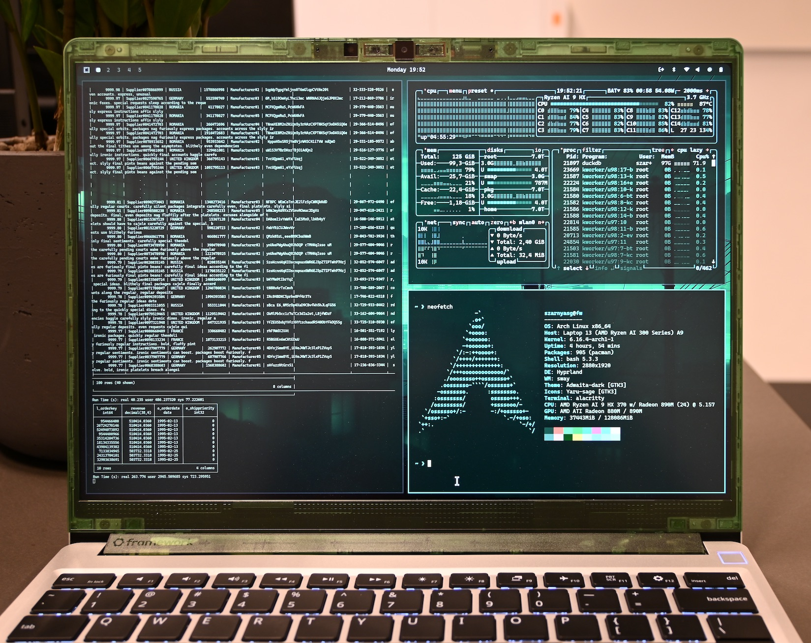

## DuckDB 以就是平民劳斯莱斯, 0.3%的成本完成SF=10,000 TPC-H测试  
          
### 作者          
digoal          
          
### 日期          
2025-09-09          
          
### 标签          
PostgreSQL , PolarDB , DuckDB , tpc-h           
          
----          
          
## 背景  
在服务器中运行数据库(DuckDB)不好奇, 在手机中运行DuckDB也有人测试过了(性能很6), 在树莓派上、在MacBook中都有过测试, 而且性能都非常棒.  
  
但是, 今天这个测试你一定要看一下. 因为这个测试: 数据量大(`TPCH SF=10000` , 光parquet 压缩列存格式数据文件都已达到4TB.), 使用x86架构的民用笔记本(不到 3000 欧元的配置)跑完全程, 且时间可观.    
  
另外值得一提的是，在当前tpc组织经过审计的 `SF=10,000 TPC-H` 排名中，能够执行 `TPC-H SF=10,000` 的最便宜的设备的成本远远超过 100 万欧元 或 120 万美元.    
  
本文用到的设备成本不到其 `0.3%`。  
  
结果表明, DuckDB 就是平民劳斯莱斯.    
  
    
  
下面来看此文翻译: https://duckdb.org/2025/09/08/duckdb-on-the-framework-laptop-13.html  
  
# 正文  
TL;DR：我们在配备 128 GB RAM 的 12 核超极本上对 DuckDB 进行了全面测试，运行高达 SF10,000 的 TPC-H 查询。  
  
## 背景  
DuckDB 的设计初稿于 2018 年提出，当时一个关键的洞察是“笔记本电脑的性能已经足够强大，足以处理数据科学家所能承担的大多数分析工作负载”。这使得将新的分析数据库实现为可在任何地方（包括笔记本电脑）运行的单节点系统成为可行的方案：DuckDB 应运而生。  
  
2020 年，Apple Silicon 的发布极大地提升了笔记本电脑上 DuckDB 的性能。如今，新款 MacBook 配备了十几个核心的 CPU、海量内存和高速磁盘 —— DuckDB 非常渴望充分利用这些优势。然而，这需要付出高昂的代价：在荷兰，配置一台配备 128 GB 内存和 8 TB 磁盘的 MacBook Pro 售价将超过 8,500 欧元。  
  
与此同时，x86 领域也取得了显著的飞跃。AMD 的[Ryzen AI 300](https://en.wikipedia.org/wiki/List_of_AMD_Ryzen_processors#Strix_Point_mobile)超薄移动处理器于 2024 年发布，配备多达 12 个核心和 24 个线程。DuckDB在 x86_64 架构和 arm64 处理器上都能顺利运行，因此我们迫切地想知道 DuckDB 在新款 AMD 处理器上的表现如何。  
  
## 部署测试环境  
为了进行这项实验，我们购买了Framework(一家模块化方式组装笔记本的电商?)的 13 英寸模块化笔记本电脑，并配备了 128 GB 的 RAM 和 8 TB 的磁盘 —— 所有这些花费[不到 3,000 欧元](https://duckdb.org/2025/09/08/duckdb-on-the-framework-laptop-13.html#cost-breakdown)。  
  
我们安装了 [Omarchy 2.0](https://omarchy.org/)，这是一个基于 Arch Linux 的操作系统发行版，拥有活跃的社区，并为 Framework 笔记本电脑提供一流的支持。组装笔记本电脑和安装 Omarchy 总共花了不到一个小时。使用安装程序脚本安装 DuckDB 命令行客户端也只需几秒钟：  
```  
curl https://install.duckdb.org | sh  
```  
  
我们将主题改为[Osaka Jade](https://github.com/Justikun/omarchy-osaka-jade-theme)，以获得更像 Matrix 的外观，然后开始工作：  
  
在 Framework Laptop 13" 上运行的 DuckDB  
  
## 实验  
为了了解这台笔记本电脑的性能，我们运行了一些基准测试，重点关注加载和查询处理时间。  
  
### CSV加载  
为了测试 CSV 加载性能，我们使用了我们最喜欢的数据集之一：[荷兰铁路服务数据集](https://duckdb.org/docs/stable/guides/snippets/dutch_railway_datasets.html)。我们选取了过去 80 个月（2019 年 1 月至 2025 年 8 月）的[完整数据集](https://blobs.duckdb.org/nl-railway/railway-services-80-months.zip)。我们可以按如下方式获取并解压该文件：  
```  
wget https://blobs.duckdb.org/nl-railway/railway-services-80-months.zip  
unzip railway-services-80-months.zip  
```  
  
生成的目录大约有 20 GB。让我们看看 DuckDB 加载这些文件的速度有多快：  
```  
duckdb  
```  
  
```  
.timer on  
CREATE TABLE services AS FROM 'services/services-*.csv.gz';  
-- Run Time (s): real 10.219 user 217.596664 sys 7.348692  
```  
  
事实证明，DuckDB 仅需 10.2 秒即可将 20 GB 的 CSV 文件加载到内存中，速度为 1.96 GB/s！  
  
## TPC-H基准测试  
为了测试查询性能，我们使用了 TPC-H 标准测试方法。我们已经在[各种环境中运行过 TPC-H 查询](https://duckdb.org/2021/10/29/duckdb-wasm.html) ， 因此很好奇：DuckDB 在这台笔记本电脑上能扩展到什么程度？  
  
### 数据生成  
当然，我们首先需要一些大型的 TPC-H 数据集，并且需要在本地生成它们——下载它们可能需要几天时间。幸运的是，我们可以使用 tpchgen-rs 工具，这是一个纯 Rust 实现的 TPC-H 生成器，可以在几个小时内在笔记本电脑上生成大规模数据集。我们将数据生成为 Parquet 文件，并将它们加载到 DuckDB 中。   
  
之前写过一篇文章介绍过 tpchgen-rs : [《tpchgen-rs, 居然比DuckDB还快!》](../202506/20250617_02.md)    
  
> Omarchy 默认自带 [btrfs 文件系统](https://en.wikipedia.org/wiki/Btrfs) 。我们为生成的数据创建了一个目录，并禁用了写时复制(cow)功能（ 参见[配置详情](https://duckdb.org/2025/09/08/duckdb-on-the-framework-laptop-13.html#file-system-configuration) ） 。    
> 顺便提一嘴cow. zfs也有这个功能, 有这个功能的文件系统通常可执行秒级快照备份、文件系统克隆等功能. 并且可以避免parital write, 所以PostgreSQL数据库在开启了cow的文件系统上运行时, 可关闭full page write.    
  
### SF=3,000   
我们首先在 SF=3,000 数据集上运行了全部 22 个 TPC-H 查询，该数据集对应 3 TB 的 CSV 文件。查询总运行时间为 47.5 分钟，几何平均查询运行时间为 86.5 秒。   
  
在实验过程中，我们注意到笔记本电脑底盖的温度超过了 45 摄氏度：虽然键盘仍然可以使用，但在运行数据处理工作负载时，你肯定不想把这台机器放在腿上。显然，过热还会导致一些热节流，导致 CPU 降频，从而降低查询速度。我们对这类问题并不陌生：去年，我们将一部 [iPhone 16 浸入干冰](https://duckdb.org/2024/12/06/duckdb-tpch-sf100-on-mobile.html#a-song-of-dry-ice-and-fire)中以改善其散热效果，但这似乎对笔记本电脑来说不切实际，所以我们采取了更实际的措施。    
  
为了进行“冷却运行”，我们只需在查询之间插入 5 分钟的休眠期，让笔记本电脑冷却下来即可。这种方法效果非常好：查询的总运行时间（不包括冷却时间）缩短至 30.8 分钟，几何平均运行时间缩短至 58.2 秒——速度提升了 32%！   
  
大多数交互式数据科学工作负载的查询执行都与编码和分析所花费的时间交织在一起 - 这为笔记本电脑提供了这样的冷却期。  
  
## 电池模式 SF=3,000   
到目前为止，我们的实验都是在笔记本电脑插上充电器的情况下进行的。但笔记本电脑毕竟是便携式设备，所以我们很好奇——我们能在移动中对 SF=3,000 数据集进行查询吗？  
  
事实证明我们能做到！在 SF=3,000 数据集上运行所有 TPC-H 查询耗时 46.9 分钟（几何平均运行时间为 83.7 秒），并将充满电的电池电量消耗至 30% 左右。即便如此，如果您在笔记本电脑上分析 TB 级数据集，为了安全起见，可能仍然需要携带移动电源。   
  
## TPC-H SF=10,000  
最后，我们迎来了终极挑战——这台笔记本电脑能否处理 SF=10,000 数据集（相当于 10 TB 的 CSV 文件）？  
  
为了找到答案，我们进行了以下工作：  
- 生成了大约 4 TB 的 Parquet 文件数据，  
- 将文件加载到 DuckDB 中 – 以 DuckDB 的文件格式计算，大约 2.7 TB，  
- 清理了 Parquet 文件 —— 多余的空间会派上用场，  
- 运行查询 - 偶尔会看到 DuckDB 在磁盘上溢出 3.6 TB(例如外部排序、外部hash join、外部hash agg等会用到临时文件.)，  
  
最终他们顺利完成了任务！  
  
运行总共耗时 4.2 小时，几何平均查询运行时间为 6.6 分钟。  
  
不出所料，这里也出现了一些热流现象，因此我们重新进行了实验，并加入了冷却期。我们发现，这将查询总运行时间缩短至 3.8 小时，几何平均运行时间为 5.7 分钟（提速 14%）。这意味着差异小于 SF=3,000 数据集，这完全合情合理：考虑到查询运行时间更长，冷却期的影响不再那么大。  
  
## 结论  
简而言之，我们发现您可以花费不到 3,000 欧元构建一台笔记本电脑，它可以以近 2 GB/秒的速度加载 CSV 文件，在使用电池的情况下在 SF=3,000 上运行全方位的 TPC-H 查询，并完成 SF=10,000 数据集上的所有查询。  
  
虽然我们的运行不是官方的 TPC-H 运行，但值得一提的是，在当前经过tcp组织官方审计的 SF=10,000 TPC-H 实施排名中，能够执行 TPC-H SF=10,000 的最便宜的设置的成本远远超过 100 万欧元或 120 万美元 - 我们的设置成本不到其 0.3%，并且可以完成 99% 的数据科学工作负载。    
    
#### [期望 PostgreSQL|开源PolarDB 增加什么功能?](https://github.com/digoal/blog/issues/76 "269ac3d1c492e938c0191101c7238216")
  
  
#### [PolarDB 开源数据库](https://openpolardb.com/home "57258f76c37864c6e6d23383d05714ea")
  
  
#### [PolarDB 学习图谱](https://www.aliyun.com/database/openpolardb/activity "8642f60e04ed0c814bf9cb9677976bd4")
  
  
#### [PostgreSQL 解决方案集合](../201706/20170601_02.md "40cff096e9ed7122c512b35d8561d9c8")
  
  
#### [德哥 / digoal's Github - 公益是一辈子的事.](https://github.com/digoal/blog/blob/master/README.md "22709685feb7cab07d30f30387f0a9ae")
  
  
#### [About 德哥](https://github.com/digoal/blog/blob/master/me/readme.md "a37735981e7704886ffd590565582dd0")
  
  

  
