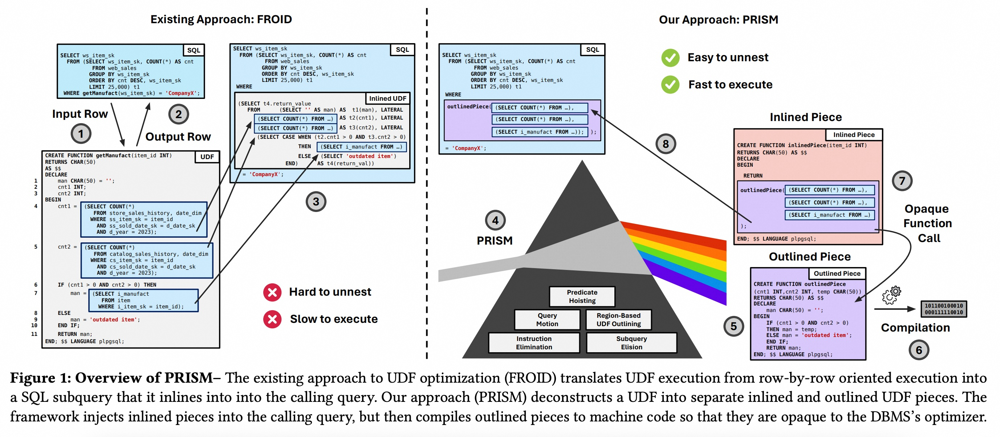
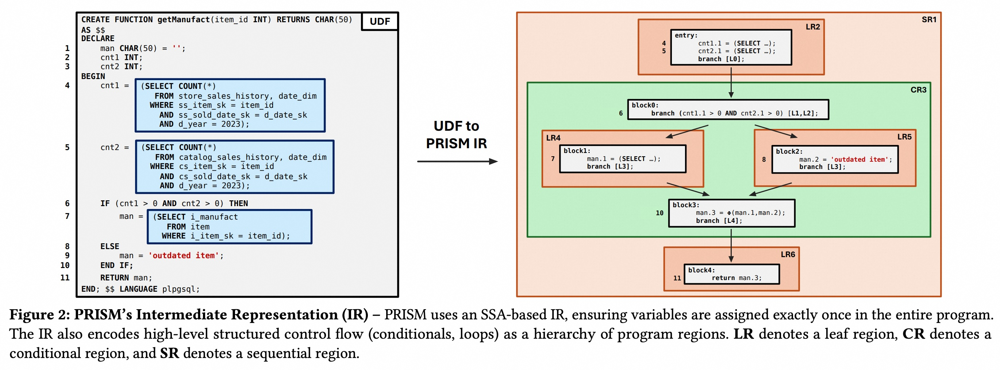
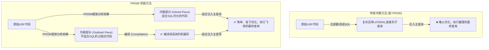
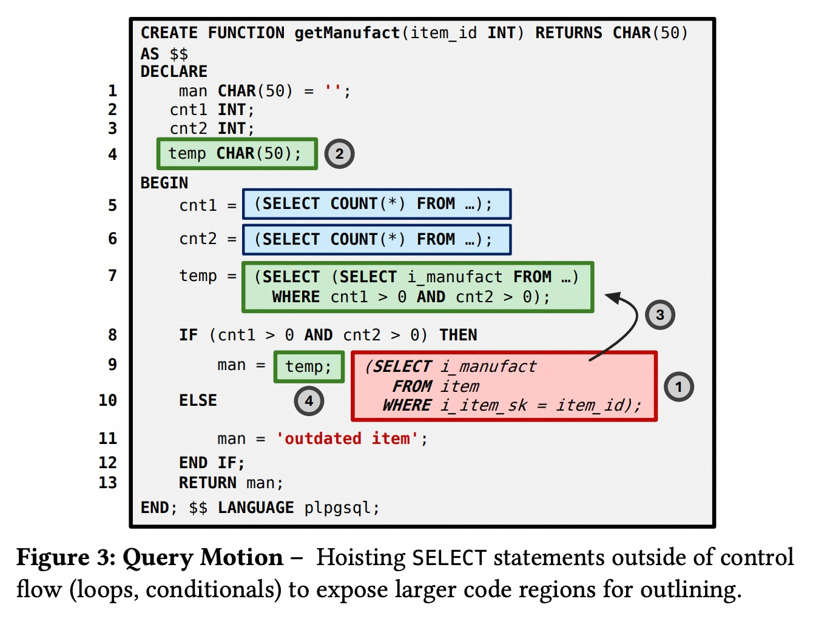
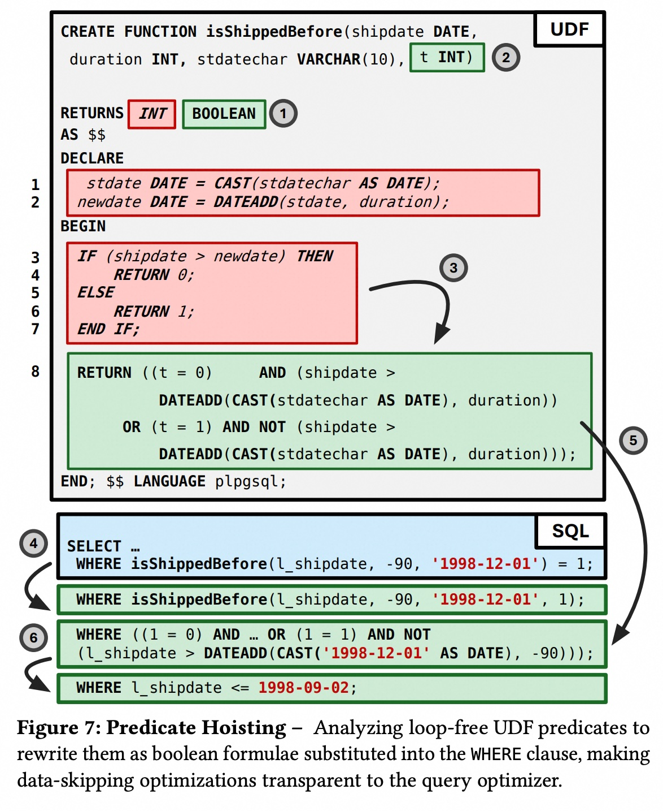
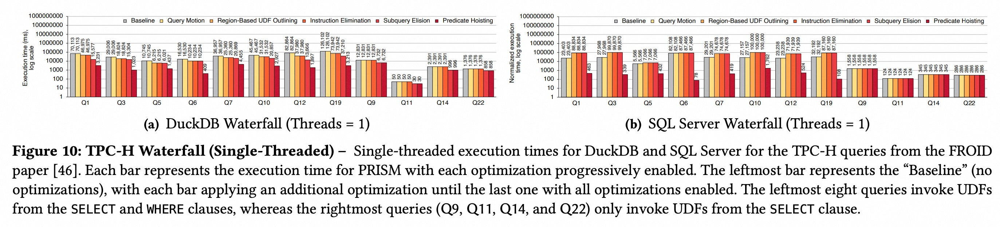

## AI论文解读 | The Key to Effective UDF Optimization: Before Inlining, First Perform Outlining
        
### 作者        
digoal        
        
### 日期        
2025-09-10       
        
### 标签        
PostgreSQL , PolarDB , DuckDB , AI , 论文解读        
        
----        
        
## 背景  
      
https://www.vldb.org/pvldb/vol18/p1-arch.pdf        
  
提示:          
```          
读懂《The Key to Effective UDF Optimization: Before Inlining, First Perform Outlining》这篇论文需要提前掌握哪些基础知识, 请使用中文通熟易懂的讲解这些基础知识, 可以引用论文中的图、表或使用Markdown支持的图形(text,mermaid等)增加解释性. 
  
使用中文通熟易懂的解读《The Key to Effective UDF Optimization: Before Inlining, First Perform Outlining》这篇论文, 其中的关键内容请着重讲解, 可以引用论文中的图、表或使用Markdown支持的图形(text,mermaid等)增加解释性. 
  
提取《The Key to Effective UDF Optimization: Before Inlining, First Perform Outlining》这篇论文中的重要术语, 使用中文对这些术语进行通熟易懂的讲解, 可以引用论文中的图、表或使用Markdown支持的图形(text,mermaid等)增加解释性. 
```     
  
## 1 前置知识 
  
您好，为了帮助您理解这篇论文，我将论文中涉及的一些关键基础知识进行了整理和解释。这些知识主要围绕数据库中的 **UDF（用户自定义函数）** 优化展开，包括传统方法及其局限性，以及论文提出的新方法。

### 1\. 什么是UDF？

**用户自定义函数（UDF，User-Defined Function）** 允许开发者在SQL的声明式语言中嵌入用其他编程语言（如Python、JavaScript或PL/SQL）编写的程序化代码，以扩展数据库系统的功能 。

  * **挑战：** 由于SQL是声明式范式，而UDF是程序化范式，这两种范式不匹配（即“阻抗不匹配”），导致数据库系统的查询优化器很难对包含UDF的查询进行优化，从而使得查询速度比没有UDF的查询慢几个数量级 。

-----

### 2\. UDF优化的两种传统方法

为了解决上述挑战，研究人员发展了多种优化技术。论文主要讨论了两种：

#### **2.1. 内联（Inlining）**

内联是一种自动将UDF调用替换为等效SQL子查询的技术 。

  * **工作原理：** 它将UDF中的每条程序化指令（如`IF/ELSE`块、变量赋值等）转换为等效的关系代数表达式（如`CASE WHEN`、`SELECT`等）。这些转换后的表达式会通过`LATERAL`连接（类似于`APPLY`操作符）串联起来，形成一个与原始UDF等效的SQL子查询 。这个子查询随后被“注入”到调用它的查询中，使整个查询变为纯关系式，从而让查询优化器能够找到更好的执行计划 。

  * **内联的局限性：**

      * **难以Unnest（嵌套展开）：** 内联生成的子查询包含复杂的`LATERAL`连接，这使得数据库很难将其“展开”成更高效的`JOIN`操作符 。这导致数据库可能不得不对每一行输入都调用一次子查询，就像调用原始UDF一样，执行效率低下 。
      * **阻止数据跳过（Data Skipping）：** 当UDF被用作`WHERE`子句中的谓词时，内联会用子查询替换它，使得优化器无法将谓词下推到查询计划的底层（如索引扫描），从而无法利用数据跳过优化来跳过不必要的表扫描 。
      * **低效的查询执行：** 内联通过`LATERAL`连接来转换UDF，但优化器在处理`JOIN`操作时本身就很吃力 。此外，内联还会将循环转换为递归`CTE`（公共表表达式），这通常比程序化形式的循环慢一个数量级 。

-----

### 3\. 论文提出的新方法：Outlining（外联）

针对内联的局限性，论文提出了 **UDF外联（UDF Outlining）** 技术 。

  * **核心思想：** 论文提出的PRISM框架不会将整个UDF都进行内联，而是首先对UDF进行分析，将其分解成更小的部分 。

      * **可内联部分：** 那些有助于查询优化的部分会被内联到主查询中，以便优化器能够处理 。
      * **可外联部分：** 那些程序化代码片段会被提取成单独的函数，并有意地“隐藏”起来，不让优化器看到 。这些外联出的函数随后会被编译成机器码，以提高执行效率 。

  * **外联的优势：**

      * **简化UDF：** 外联通过将复杂代码隐藏起来，最小化了UDF的复杂性，使生成的查询更简单 。
      * **避免`LATERAL`连接：** PRISM通过仅内联一小部分UDF，消除了所有`LATERAL`连接 。
      * **更有效的Unnesting和数据跳过：** 简化后的查询更容易被Unnest，并且通过将UDF谓词“提升”到`WHERE`子句，使优化器能够透明地应用数据跳过优化 。

图1展示了这种新方法与传统方法的对比，您可以参照理解 。   

  * **图示解释：**
      * **左侧 (FROID, 传统方法)：** 整个UDF被内联为一个复杂的SQL子查询，这个子查询包含`LATERAL`连接，导致难以Unnest且执行缓慢 。
      * **右侧 (PRISM, 论文方法)：** PRISM将UDF解构为“内联部分”和“外联部分”。内联部分被注入到主查询中，而外联部分则被编译成机器码，成为对优化器透明的“不透明函数调用”。这种方法生成的查询更简单，执行也更快 。

-----

### 4\. 编译器基础知识

论文的实现框架PRISM使用了编译器的一些核心概念来分析和优化UDF，包括：

  * **控制流图（Control Flow Graph, CFG）：** CFG将UDF分解为基本块，每个基本块包含一系列非跳转指令，以跳转指令结束 。CFG中的节点代表基本块，有向边代表跳转 。
  * **静态单赋值形式（SSA Form）：** SSA是一种中间表示（IR），它确保程序中的每个变量都只被赋值一次 。这简化了数据流分析 。当在CFG的连接点（join points）处，一个变量可能有多个可能的来源时，会插入一个特殊的 φ-函数来合并这些值 。
  * **程序区域（Regions）：** 与CFG将控制流表示为跳转不同，程序区域保留了高级的结构化控制流（如条件语句、循环）。这使得某些编译器优化更容易实现 。图2展示了PRISM如何将UDF转换为包含不同区域（如叶子区域LR、条件区域CR、顺序区域SR）的中间表示 。   

通过掌握上述基础知识，您将能更好地理解论文中提出的**Query Motion**（查询移动）、**Region-Based UDF Outlining**（基于区域的UDF外联）等具体优化技术，以及它们如何协同工作来提升性能。

希望这个解释能帮助您更好地阅读和理解这篇论文。
  
## 2 解读论文 
  
好的，我们来通俗易懂地解读一下这篇关于用户自定义函数（UDF）优化的研究论文。

**论文标题:** 《The Key to Effective UDF Optimization: Before Inlining, First Perform Outlining》（高效UDF优化的关键：在内联之前，先做外联） 

### 引言：数据库为什么“讨厌”UDF？

想象一下，数据库的查询优化器是一个非常聪明的物流规划师。你给它一个SQL查询（比如“从A仓库找到所有红色的、B公司生产的、去年上架的商品”），它能规划出最高效的路径来获取数据。

但有时，你需要在查询里加入一个用其他编程语言（如Python, PL/SQL）写的**用户自定义函数（UDF）** 。比如，你写了一个函数 `is_popular(item_id)` 来判断一个商品是否热门。这时，对于物流规划师（查询优化器）来说，这个UDF就像一个神秘的“黑盒子” 。它不知道盒子里面具体是怎么计算的，只能来一个商品，就调用一次这个函数，效率极低。这导致包含UDF的查询通常比纯SQL查询慢上几个数量级 。

### 现有最佳方案：UDF内联（Inlining）及其痛点

为了解决“黑盒子”问题，研究人员提出了 **UDF内联（UDF Inlining）** 技术 。它的思路很简单：把UDF函数里的代码逻辑，直接翻译成等价的SQL子查询，然后“塞”回原来的大查询里 。

这样一来，整个查询就都是SQL了，优化器又能看懂全局，从而找到更好的执行计划。这个技术效果显著，有时能带来高达1000倍的性能提升 。

**但是，这种“暴力”内联有很严重的后遗症**，论文指出了三大痛点 ：

1.  **难以展开（Difficult to Unnest）**: 内联后的UDF会变成一长串复杂的、带有 `LATERAL` 连接的子查询 。很多数据库优化器处理不了这么复杂的结构，无法将其“展开”成高效的普通连接（Join），最终还是退化成来一行数据计算一次子查询的低效模式 。
2.  **阻碍数据跳过（Prevent Data Skipping）**: 如果你的UDF用在 `WHERE` 条件里（例如 `WHERE is_popular(item_id) = true`），内联后它会变成一个复杂的子查询。优化器无法将这个条件“下推”到底层去利用索引或者分区等进行数据筛选，导致必须全表扫描，白白浪费大量I/O 。
3.  **查询执行效率低下（Inefficient Query Execution）**: 内联产生了大量的 `LATERAL` 连接，这本身就给优化器带来了巨大的负担 。而且，如果UDF里有循环，内联会将其翻译成递归CTE（Common Table Expressions），其执行效率通常比原来的过程式循环要慢得多 。

### 核心思想：先“外联”，再“内联” (Outlining before Inlining)

这篇论文的核心思想非常巧妙：**不要盲目地把整个UDF都内联，而是先把它“拆解”开** 。

他们开发了一个名为 **PRISM** 的框架 ，其工作流程可以用下图来概括，它对比了传统方法（FROID）和PRISM方法的区别 ：



简单来说，PRISM像一个棱镜，将UDF这束“混合光”分解开 ：

  * **外联（Outlining）**：把UDF中那些纯粹的、过程式的计算逻辑（比如if/else、循环）提取出来，形成一个独立的、新的、更小的函数 。然后把这个小函数编译成高效的机器码，让它对优化器保持“不透明” 。这样做的好处是**大大简化了主UDF的结构** 。
  * **内联（Inlining）**：只把UDF中那些对数据库优化有益的部分（主要是`SELECT`查询语句）保留下来，进行内联 。

通过这种方式，最终生成的SQL查询变得非常简洁，没有了那些复杂的`LATERAL`连接，优化器处理起来得心应手，执行效率自然就高了 。

### PRISM 的五大神器：关键优化技术详解

PRISM通过一套组合拳（五种互补的优化技术）来实现上述思想 ：

1.  **查询移动 (Query Motion)**

      * **解决什么问题？** 开发者常常把`SELECT`语句写在`IF`或`LOOP`等控制流代码块里面，导致SQL代码和过程代码“耦合”在一起，没法单独处理 。
      * **如何做的？** PRISM会分析代码，把`SELECT`语句从控制流中“提升”出来，同时保留原有的逻辑条件 。如下图所示（改编自论文Figure 3），`SELECT ... FROM item`语句被从`IF`语句中移出，并增加了`WHERE`条件来保证逻辑不变 。   

2.  **基于区域的UDF外联 (Region-Based UDF Outlining)**

      * **解决什么问题？** 这是实现“外联”的核心技术。需要准确地识别出哪些代码块是纯过程式的，并且能安全地将它们提取成独立的函数 。
      * **如何做的？** PRISM会将UDF代码表示为一种层次化的“区域”（Region）树状结构 。然后它会从上到下遍历这个树，找到不包含任何`SELECT`语句的、最大的纯过程代码区域，将其“剪切”出来，创建一个新函数，并编译成机器码 。原位置则替换为一个对新函数的简单调用 。

3.  **指令消除 (Instruction Elimination)**

      * **解决什么问题？** 即使经过外联，UDF中可能还剩下一些临时的变量赋值语句，这些语句在内联时依然会产生不必要的`LATERAL`连接 。
      * **如何做的？** 这是一个类似于编译器优化的步骤。PRISM会把变量直接替换成定义它的表达式 。例如，如果代码是`a = (SELECT ...); b = a + 1; RETURN b;`，它会将其简化为 `RETURN (SELECT ...) + 1;`。通过这种方式，它能将UDF压缩到只剩下一条`RETURN`指令 。

4.  **子查询省略 (Subquery Elision)**

      * **解决什么问题？** 经过指令消除后，UDF可能变成了 `RETURN some_expression` 的形式。标准的内联仍然会把它包装成 `SELECT (some_expression)` 的子查询，这层包装是多余的 。
      * **如何做的？** PRISM会识别这种情况，直接“剥掉”这层子查询的外壳，将 `some_expression` 直接注入到主查询中，完全避免了子查询的产生 。

5.  **谓词提升 (Predicate Hoisting)**

      * **解决什么问题？** 专门处理UDF用在`WHERE`子句中的情况，以解决前面提到的“阻碍数据跳过”的痛点 。
      * **如何做的？** PRISM会分析UDF的逻辑，将其整体改写成一个等价的、纯粹的布尔表达式（一个只返回真或假的公式） 。然后用这个布尔表达式替换掉`WHERE`子句中对UDF的调用。这样一来，优化器就能完全理解这个过滤条件，并利用索引等进行高效的数据跳过优化 。如下图所示（改编自论文Figure 7），一个返回0或1的UDF被改写成了一个直接的日期比较表达式，使得数据库可以使用`l_shipdate`列上的索引 。    

### 实验效果：PRISM 到底有多快？

论文在 DuckDB 和 SQL Server 两个数据库系统上进行了详尽的实验，结果非常惊人 。

| 数据库 (测试集) | 平均性能提升 (相比传统内联) | 最高性能提升 |
| :--- | :--- | :--- |
| DuckDB (ProcBench) | **1.29倍** | **2270.22倍**  |
| SQL Server (ProcBench) | **298.73倍** | **2997.92倍**  |
| DuckDB (TPC-H) | **17.69倍** | **43.68倍**  |
| SQL Server (TPC-H) | **135.83倍** | **1053.32倍**  |

  * 在SQL Server上，性能提升尤为巨大，因为PRISM生成的简单查询使得SQL Server能够成功进行子查询展开，而传统内联生成的复杂查询则无法展开 。
  * 在DuckDB上，虽然它本身就能展开非常复杂的子查询，但PRISM通过避免生成额外的连接操作，仍然带来了稳定的性能提升 。
  * 论文中的“瀑布图”（Waterfall Chart，论文Figure 10）清晰地展示了PRISM的每一步优化都在逐步累积性能优势，证明了这些优化技术的互补性和有效性 。    

### 总结

这篇论文提出了一个非常新颖且有效的UDF优化思路。它颠覆了过去“全盘内联”的传统方法，通过 **“先外联（Outlining），再内联（Inlining）”** 的精细化操作，将UDF拆解成最适合数据库优化的部分和最适合编译执行的部分，并分别进行处理。最终，PRISM框架能够生成极其简洁高效的SQL查询，极大地释放了数据库的优化潜力，在多个场景下取得了数百倍甚至数千倍的性能提升。
  
## 3 术语 
  
您好，我已根据论文内容为您整理了几个重要的术语，并用通俗易懂的方式进行了讲解。

### 1\. UDF (User-Defined Function) 用户自定义函数

  * **定义：** UDF 允许开发者在 SQL 语言中嵌入用其他编程语言（如 Python、Java 或 PL/SQL）编写的程序化代码。
  * **通俗解释：** 想象一下，SQL 就像一个只知道基本运算的计算器，而 UDF 就像你给它编写的“快捷键”，可以执行一些更复杂的自定义操作。例如，你可以编写一个 UDF 来计算某个特定业务指标，然后在 SQL 查询中直接调用这个“快捷键”，而不用写一长串复杂的公式。
  * **挑战：** SQL 是**声明式**的（你告诉它要什么结果，而不是怎么得到），而 UDF 是**程序化**的（你告诉它要一步一步怎么做）。这种范式的**不匹配**（即“阻抗不匹配”）使得数据库的查询优化器很难对包含 UDF 的查询进行有效优化。

-----

### 2\. Inlining 内联

  * **定义：** 这是一种将 UDF 的程序化代码自动转换为等效 SQL 子查询的优化技术。
  * **通俗解释：** 就像是把你的“快捷键”里的所有步骤都展开，直接写到 SQL 查询里。比如，如果你的 UDF 是`IF/ELSE`判断，内联就会把它变成 SQL 里的`CASE WHEN`表达式。目标是把整个查询都变成纯 SQL，让查询优化器能够像处理普通查询一样去优化它。
  * **局限性：** 论文指出，将整个 UDF 都内联通常会导致性能不佳。因为内联会生成复杂的 SQL 子查询，这些子查询难以被优化器 **嵌套展开（Unnesting）** 成更高效的`JOIN`操作。此外，它还会阻碍 **数据跳过（Data Skipping）** 等重要优化。

-----

### 3\. Outlining 外联

  * **定义：** 论文提出的核心技术。它分析 UDF，将其分解为更小的部分，只对有助于优化的部分进行内联，而将其他部分“提取”出来，编译成独立的、对优化器不透明的函数。
  * **通俗解释：** 这是一种更聪明的方法。它不是把整个“快捷键”都展开，而是只把其中对优化有帮助的那一小部分展开。至于那些复杂的、难以优化的程序化代码（比如复杂的循环或条件分支），它会把它们单独拿出来，编译成高效的机器码，变成一个对 SQL 优化器来说是“黑盒子”的函数。
  * **优势：** 这种方法生成的 SQL 查询更简单，更容易被优化器处理，从而避免了内联带来的各种问题，并能有效地利用像数据跳过这样的优化。

图1展示了**内联**和**外联**两种方法的对比：   

  * **左侧 (FROID, 传统内联)：** 整个 UDF 被转换为一个复杂的子查询。
  * **右侧 (PRISM, 论文提出的外联)：** UDF 被分解为可内联部分和外联部分。外联部分被隐藏起来，简化了主查询。

-----

### 4\. 程序区域 (Regions)

  * **定义：** 这是论文中用于分析 UDF 控制流的一种抽象表示。它将程序代码根据其结构（如循环、条件分支等）组织成逻辑块。
  * **通俗解释：** 想象一个程序的流程图，程序区域就是把流程图中的“顺序执行”、“`IF/ELSE`分支”和“`FOR`循环”等结构化地框起来。它比单纯的 **控制流图（CFG）** 更能保留程序的“高级结构”，这对于后续的优化，尤其是决定哪些代码应该被外联，非常有帮助。

通过理解这些术语，您将能更好地掌握论文提出的核心思想：**在对 UDF 进行内联之前，首先进行外联，以获得更好的优化效果。**
  
## 参考        
         
https://www.vldb.org/pvldb/vol18/p1-arch.pdf    
        
<b> 以上内容基于DeepSeek、Qwen、Gemini及诸多AI生成, 轻微人工调整, 感谢杭州深度求索人工智能、阿里云、Google等公司. </b>        
        
<b> AI 生成的内容请自行辨别正确性, 当然也多了些许踩坑的乐趣, 毕竟冒险是每个男人的天性.  </b>        
    
#### [期望 PostgreSQL|开源PolarDB 增加什么功能?](https://github.com/digoal/blog/issues/76 "269ac3d1c492e938c0191101c7238216")
  
  
#### [PolarDB 开源数据库](https://openpolardb.com/home "57258f76c37864c6e6d23383d05714ea")
  
  
#### [PolarDB 学习图谱](https://www.aliyun.com/database/openpolardb/activity "8642f60e04ed0c814bf9cb9677976bd4")
  
  
#### [PostgreSQL 解决方案集合](../201706/20170601_02.md "40cff096e9ed7122c512b35d8561d9c8")
  
  
#### [德哥 / digoal's Github - 公益是一辈子的事.](https://github.com/digoal/blog/blob/master/README.md "22709685feb7cab07d30f30387f0a9ae")
  
  
#### [About 德哥](https://github.com/digoal/blog/blob/master/me/readme.md "a37735981e7704886ffd590565582dd0")
  
  

  
