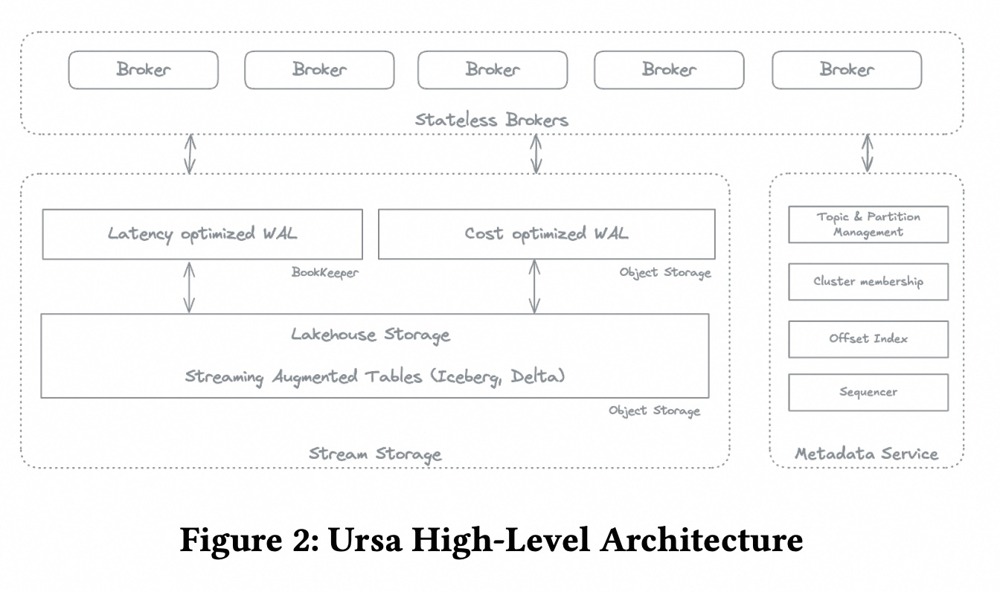
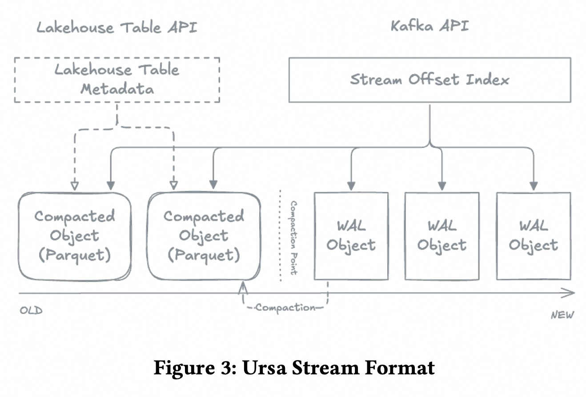
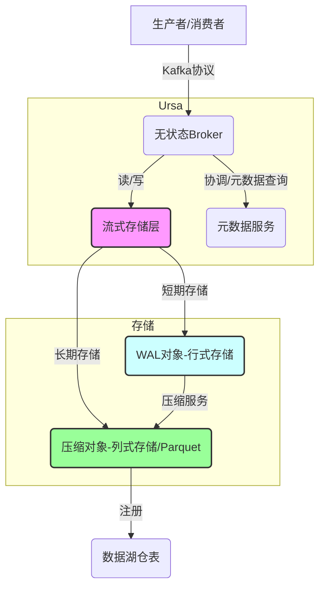
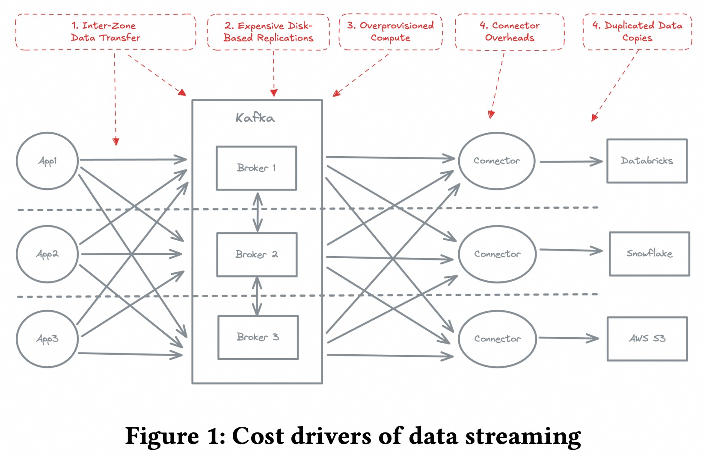
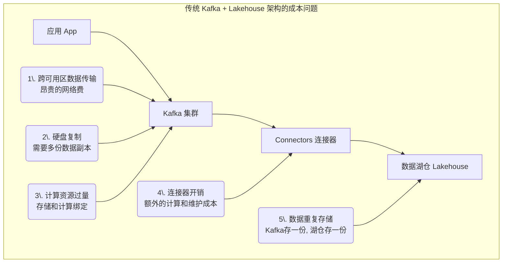
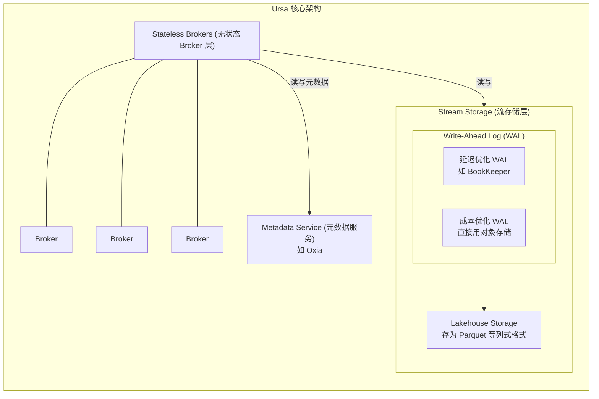
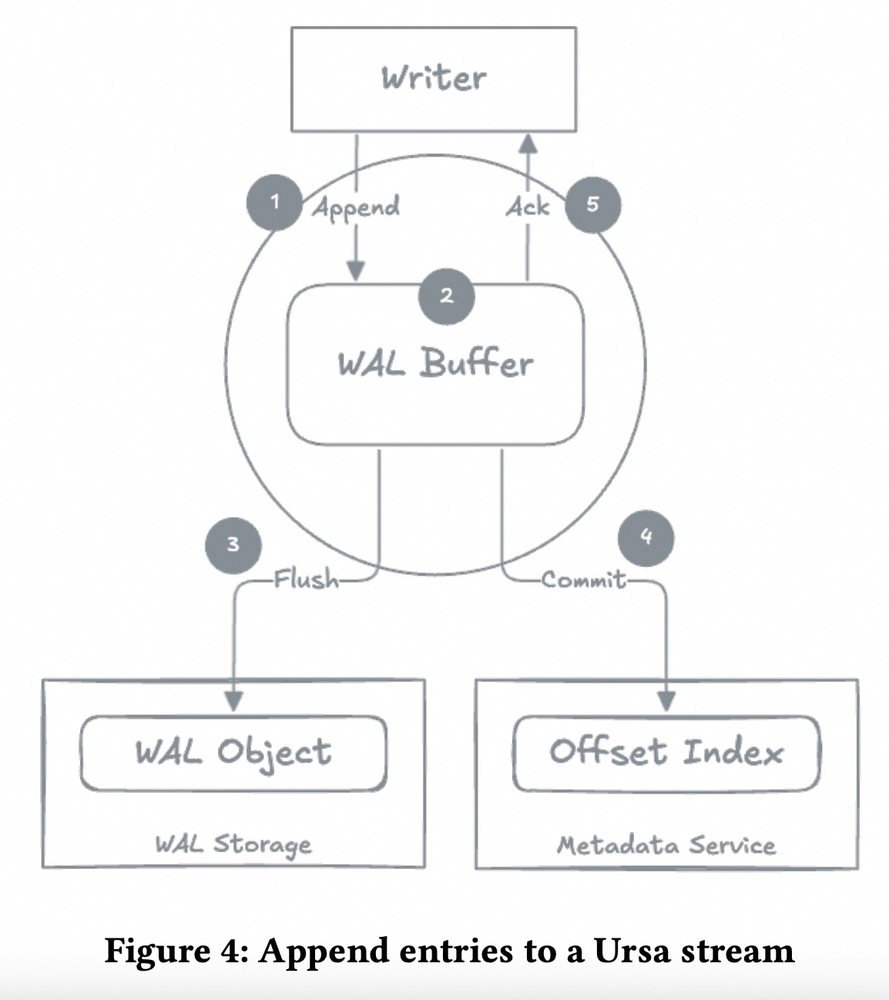
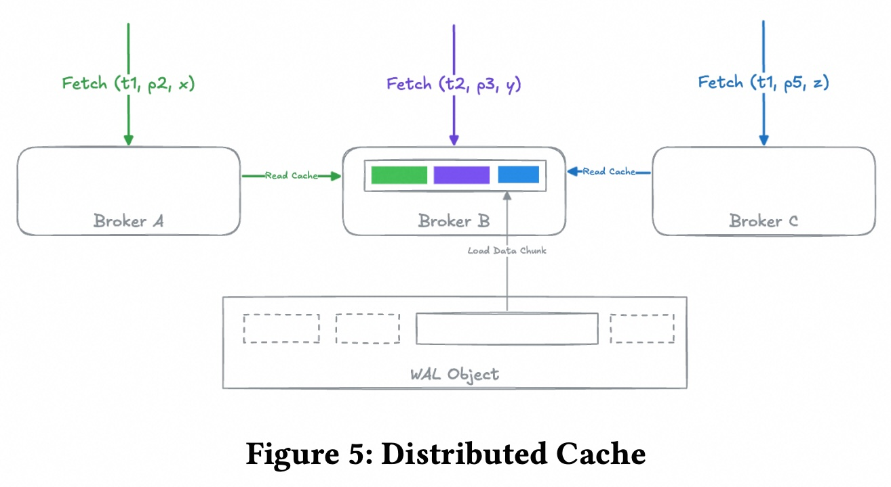
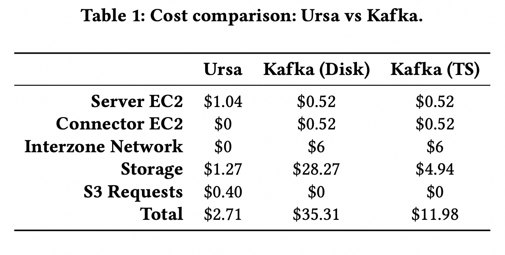
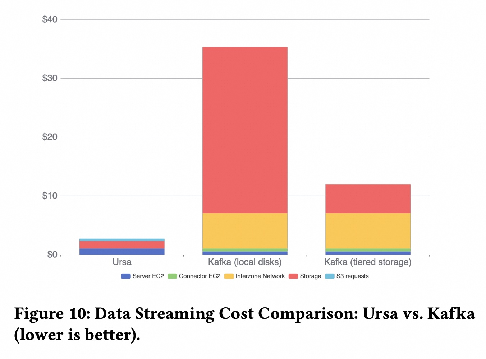

## AI论文解读 | Ursa: A Lakehouse-Native Data Streaming Engine for Kafka
        
### 作者        
digoal        
        
### 日期        
2025-09-10       
        
### 标签        
PostgreSQL , PolarDB , DuckDB , AI , 论文解读        
        
----        
        
## 背景  
      
https://www.vldb.org/pvldb/vol18/p5184-guo.pdf        
  
提示:          
```          
读懂《Ursa: A Lakehouse-Native Data Streaming Engine for Kafka》这篇论文需要提前掌握哪些基础知识, 请使用中文通熟易懂的讲解这些基础知识, 可以引用论文中的图、表或使用Markdown支持的图形(text,mermaid等)增加解释性. 
  
使用中文通熟易懂的解读《Ursa: A Lakehouse-Native Data Streaming Engine for Kafka》这篇论文, 其中的关键内容请着重讲解, 可以引用论文中的图、表或使用Markdown支持的图形(text,mermaid等)增加解释性. 
  
提取《Ursa: A Lakehouse-Native Data Streaming Engine for Kafka》这篇论文中的重要术语, 使用中文对这些术语进行通熟易懂的讲解, 可以引用论文中的图、表或使用Markdown支持的图形(text,mermaid等)增加解释性. 
```     
  
## 1 前置知识 
  
读懂《Ursa: A Lakehouse-Native Data Streaming Engine for Kafka》这篇论文，需要掌握以下几个方面的基础知识，这些知识是理解Ursa设计理念和技术优势的关键。

-----

### 1\. 数据湖仓（Lakehouse）架构

数据湖仓（Lakehouse）是一种新兴的数据架构，它结合了数据湖（Data Lake）和数据仓库（Data Warehouse）的优点 。

  * **数据湖的优点**：低成本、高弹性的存储，通常使用如Amazon S3等云对象存储服务 。
  * **数据仓库的优点**：提供事务保证、模式管理和查询优化等功能 。

简单来说，数据湖仓试图在低成本的对象存储上实现数据仓库的功能，使其既能处理大规模非结构化数据，又能支持高并发的事务和分析查询。论文中提到的Apache Iceberg和Delta Lake就是这种架构的典型实现 。

### 2\. Apache Kafka

Apache Kafka是一个分布式的、可水平扩展的流数据平台，被广泛用于实时数据流处理 。

  * **领导者（Leader）-追随者（Follower）模式**：传统的Kafka采用领导者-追随者架构，每个数据分区（Partition）都有一个领导者（Leader）Broker和多个追随者（Follower）Broker 。数据写入时，生产者（Producer）只与领导者Broker通信，领导者再将数据复制（Replication）给追随者。这种模式可以保证高可用性和低延迟 。
  * **磁盘复制（Disk-based Replication）**：Kafka的默认操作模型依赖于Broker级别的磁盘复制 。为了保证数据不丢失，数据会被写入到多个Broker的本地磁盘上 。
  * **连接器（Connectors）**：为了将Kafka中的数据导入到其他系统中（如数据湖仓），通常需要使用额外的连接器（如Kafka Connect）或ETL（Extract, Transform, Load）工具 。

### 3\. Ursa的核心设计理念

论文的核心内容是Ursa如何解决传统Kafka与数据湖仓架构集成时面临的挑战，主要包括以下几点：

  * **高成本**：传统的Kafka架构在大规模云环境中成本很高 。

      * **跨可用区（AZ）数据传输**：在多可用区部署时，跨可用区的数据复制会产生昂贵的网络流量费用 。
      * **基于磁盘的复制**：数据在Broker的本地磁盘上存储多份副本，增加了存储成本 。
      * **过度配置的计算资源**：由于计算和存储资源紧密耦合，为了增加存储容量，可能需要过度配置Broker，导致资源浪费 。
      * **连接器开销和数据重复**：使用额外的连接器会消耗额外的计算资源，并且数据需要在Kafka和数据湖仓中存储多份，导致数据重复和复杂性增加 。

  * **Ursa的解决方案**：

      * **无领导者（Leaderless）架构**：Ursa消除了传统的领导者-追随者模式，所有Broker都是无状态的，只负责处理请求 。数据持久化和偏移量（offset）排序等任务被委托给一个独立的服务，即**元数据服务（Metadata Service）** 。这简化了故障恢复和扩展，不再需要复杂的领导者选举和分区重平衡 。
      * **计算与存储分离**：Ursa将计算和存储解耦 。数据不再存储在Broker的本地磁盘上，而是直接写入**对象存储**（例如Amazon S3） 。
      * **统一流式和表式语义**：Ursa将实时数据流（Stream）和分析表（Table）统一在同一套文件上 。新写入的数据先存入一个**预写日志（WAL）对象，然后由后台的压缩服务（Compaction Service）定期将其转换为列式存储**（如Parquet文件），并注册到数据湖仓表中 。
      * **减少数据副本**：通过这种设计，数据不再需要在Kafka和数据湖仓中重复存储，消除了连接器开销，简化了数据流管理 。

Ursa的架构可以用以下图示来概括（参考论文图2和图3）：

  

  



**图示说明**：

1.  **生产者/消费者**通过标准的Kafka协议与**无状态Broker**通信 。
2.  **Broker**不存储任何数据，它将数据写入操作委托给**流式存储层** 。
3.  **流式存储层**将新数据以行式格式写入 **预写日志（WAL）** 对象 。
4.  **压缩服务**将WAL对象中的数据转换为**列式（Parquet）文件**，这些文件可以直接作为数据湖仓表的底层数据 。
5.  **元数据服务**负责管理所有数据的偏移量索引和事务状态 。

通过这些基础知识的理解，你就可以更好地理解论文中Ursa如何通过架构创新来解决传统数据流系统在高成本、复杂性和扩展性方面的问题。

-----

如果想进一步深入了解，你对论文中提到的“新的CAP定理”（New CAP Theorem）感兴趣吗？这个概念是Ursa在设计时权衡成本、可用性和性能（Cost, Availability, Performance Tolerance）的理论依据。
  
## 2 解读论文 
  
好的，我们来用通俗易懂的中文解读一下《Ursa：一个为 Kafka 设计的湖仓原生数据流引擎》这篇论文。

这篇论文的核心思想是：**创建一个全新的、与 Kafka 兼容的数据流引擎 Ursa，它从根本上改变了传统 Kafka 的工作方式，旨在大幅降低在云环境（特别是数据湖仓架构）中使用流处理的成本和复杂性。**

-----

### Ursa 要解决的核心痛点是什么？

想象一下，现在很多公司都用“数据湖仓”（Data Lakehouse）来存储和分析海量数据，它结合了数据湖的低成本和数据仓库的高性能。同时，大家用 Kafka 来实时接收和处理数据流（比如用户点击、交易记录等）。

但问题来了，把 Kafka 和数据湖仓结合在一起用，会遇到很多麻烦，特别是成本高、架构复杂 。论文作者将这些成本驱动因素总结为下图（图1）：

  



  * **跨可用区（AZ）的网络成本**：传统 Kafka 每个分区（Partition）都有一个 Leader 副本，数据必须先写入 Leader。如果你的应用和 Leader 不在同一个机房（AZ），数据传来传去就会产生高昂的网络流量费 。
  * **基于硬盘的复制**：Kafka 为了保证数据不丢，默认会在多个 Broker（服务器）的硬盘上存好几份数据副本。硬盘，尤其是高性能硬盘，本身就很贵 。
  * **计算和存储耦合**：在 Kafka 里，计算（处理请求）和存储（存数据）是绑在一起的。你想增加存储空间，就得加整个 Broker 服务器，这常常导致计算资源的浪费 。
  * **额外的连接器（Connectors）**：数据从 Kafka 进入湖仓，不能直接“倒”进去，需要一个叫 Kafka Connect 的中间件做搬运和格式转换，这又是一层架构，又是一笔开销 。
  * **数据重复存储**：一份数据，在 Kafka 里存一次，在湖仓里可能还得再存一次，造成存储浪费 。

Ursa 的诞生，就是为了从根本上解决以上这些问题。

-----

### Ursa 的核心设计与架构创新

Ursa 采用了 **“无领导者（Leaderless）”、“存算分离”和“湖仓原生”** 三大法宝来解决上述痛点。

我们可以通过论文中的架构图（图2）来理解它的设计：

  



1.  **无状态和无领导者的 Broker (Stateless Brokers)**

      * **无领导者（Leaderless）**：与 Kafka 不同，Ursa 的 Broker 没有 Leader 的概念 。任何一个 Broker 都可以处理任何数据分区的读写请求。这避免了数据必须跨区找 Leader 的问题，大大降低了网络成本 。
      * **无状态（Stateless）**：Ursa 的 Broker 自己不存数据 。数据直接写到后端的存储层。这意味着 Broker 可以随时增加或减少（弹性伸缩），而不需要像 Kafka 那样进行耗时耗力的数据迁移（Rebalancing） 。

2.  **存算分离的流存储 (Stream Storage)**

      * Ursa 把存储和计算彻底分开。数据写入分为两步：
        1.  **写入 WAL (Write-Ahead Log)**：新数据先快速写入一个“预写日志”中以保证不丢失。这个 WAL 是可插拔的，你可以选择为追求低延迟而设计的（如 Apache BookKeeper），也可以选择为追求低成本而直接写入对象存储（如 AWS S3）的 。
        2.  **转存为湖仓格式**：后台有一个“压缩服务”（Compaction Service），会定期把 WAL 里的数据转换成高效的列式存储格式（如 Parquet），并直接存入湖仓表（如 Iceberg 或 Delta Lake）中 。
      * 这种设计的好处是，一份数据，两种形态，同时满足流式读取（从 WAL 读）和分析查询（从湖仓表读）的需求，实现了 **“流表二象性”（Stream-Table Duality）** 。

3.  **独立的元数据服务 (Metadata Service)**

      * 所有关于数据位置、偏移量（Offset）等关键信息，都不在 Broker 上管理，而是由一个独立的、高可用的元数据服务（论文中使用了 StreamNative Oxia）来统一管理 。
      * 这使得整个系统的协调变得简单可靠，也是实现 Broker 无状态和无领导者的基础 。

-----

### Ursa 的数据写入与读取流程

**写入流程（见论文图4）**：

  

1.  客户端把数据发给任意一个 Broker。
2.  Broker 在内存里攒一批数据 。
3.  攒够了就一次性刷入（Flush）到后端的 WAL 存储中 。
4.  写入成功后，在元数据服务里提交（Commit）这批数据对应的位置信息（Offset Index） 。
5.  元数据提交成功后，才向客户端确认（Ack）写入成功。

这个过程保证了数据写入的持久性和一致性 。

**读取流程**：

1.  消费者向 Broker 请求某个位置（Offset）的数据。
2.  Broker 先去元数据服务查询这个 Offset 对应的数据到底存在哪个 WAL 文件里，还是已经转存到哪个 Parquet 文件里了 。
3.  找到物理位置后，Broker 从存储层（WAL 或 Lakehouse Storage）把数据读出来 。
4.  返回给消费者。

为了避免多个 Broker 重复读取同一个数据块造成浪费，Ursa 还设计了一个**分布式缓存机制**（见论文图5） 。它会指定某个 Broker 负责缓存特定数据块，其他 Broker 需要时就从这个缓存 Broker 获取，而不是直接去访问底层存储 。

  

-----

### 性能与成本对比：Ursa 效果如何？

这篇论文最吸引人的部分就是成本分析。作者做了一个非常直观的对比实验（见论文表1和图10）。

  

  

**核心结论**：在一个特定的测试场景下，与传统的 Kafka 部署相比，Ursa 的成本优势巨大：

  * 比使用本地磁盘的 Kafka **便宜 92%** 。
  * 比使用了分层存储（Tiered Storage）的 Kafka **便宜 78%** 。

**成本节省来自哪里？**

  * **网络费用几乎为零**：由于 zone-aware（区域感知）的无领导者设计，跨机房流量大大减少 。
  * **无需连接器**：原生写入湖仓，省去了 Kafka Connect 集群的机器成本 。
  * **存储成本极低**：利用了廉价的对象存储，并且通过压缩服务只保留最终的 Parquet 文件，大大减少了数据副本和存储空间 。

性能方面，实验表明 Ursa 能够维持很高的吞吐量（约 5 GB/s），并且在高负载下依然能将 P99 发布延迟控制在 1 秒以内 。

### 总结

Ursa 通过**无领导者架构、存算分离、以及与湖仓格式的原生集成**，巧妙地解决了传统 Kafka 在云原生时代面临的高成本和高复杂性问题。它不仅是一个与 Kafka API 兼容的替代品，更是一种将流处理和数据分析无缝融合的新范式，真正实现了“一份数据，处处可用”，极大地简化了实时数据平台的技术栈。

-----

如果您对 Ursa 的某个特定设计（比如它的压缩服务如何工作，或者它如何保证数据一致性）感兴趣，我们可以进一步深入探讨。
  
## 3 术语 
  
好的，根据《Ursa: A Lakehouse-Native Data Streaming Engine for Kafka》这篇论文，以下是几个重要术语的中文解释，希望能帮助你更好地理解论文的核心思想。

### 1. Lakehouse（数据湖仓）
**数据湖仓**是一种新兴的数据架构，它结合了**数据湖**（Data Lake）和**数据仓库**（Data Warehouse）的优点。

* **数据湖**的优点在于其成本效益高，可以存储海量的原始数据（包括非结构化和半结构化数据），但其在数据管理和查询性能方面相对较弱。
* **数据仓库**的优点在于其强大的数据管理能力，例如支持事务（ACID）、数据模式（Schema）管理和高效查询，但通常成本较高且灵活性较差。

**数据湖仓**旨在**使用数据湖的底层存储（如云对象存储）来提供数据仓库的功能**。论文中提到的Apache Iceberg和Delta Lake都是这种架构的典型实现，它们通过在廉价的对象存储之上添加元数据和事务层，实现了数据仓库的性能和可靠性。

### 2. Leaderless Architecture（无领导者架构）
传统的Apache Kafka采用**领导者-追随者（Leader-Follower）架构**，每个分区都有一个领导者，所有写操作都必须经过这个领导者，再由它负责将数据复制给追随者。

**无领导者架构**是Ursa的一项核心创新。它消除了传统架构中的领导者角色，所有的**Broker**（代理节点）都是**无状态的**，只负责处理客户端的请求。数据不再在Broker之间进行复制，而是直接被写入**共享的流式存储层**。这种设计的好处是：
* **简化故障恢复**：不再需要复杂的领导者选举过程。
* **提高可扩展性**：可以独立地扩展计算（Broker）和存储资源。
* **降低成本**：消除了Broker之间的跨可用区数据复制，显著降低了网络传输费用。

### 3. Separation of Compute and Storage（计算与存储分离）
这是云计算时代的一种常见设计模式，Ursa将这一模式应用到了流数据引擎中。在传统的Kafka中，计算（Broker）和存储（本地磁盘）是紧密耦合的。

而在Ursa中，**计算**由无状态的Broker负责，而**存储**则由云对象存储（如Amazon S3）承担。这种分离带来了以下优势：
* **弹性扩展**：你可以根据需要独立地增加或减少Broker数量和存储容量。
* **成本效益**：云对象存储通常比本地磁盘或SSD便宜得多。
* **数据持久性**：数据直接写入具有高持久性的对象存储，而不是依赖于Broker的本地磁盘，提高了数据的可靠性。

### 4. WAL (Write-Ahead Log) Object（预写日志对象）
**WAL**是一种常见的数据持久化技术，用来保证数据的原子性和持久性。在Ursa中，当生产者发送数据时，Broker会将这些数据直接写入一个**WAL对象**，它本质上是一个在对象存储中的文件，以**行式格式**存储新到达的数据。

你可以将WAL对象看作是数据进入数据湖仓的“入口”，所有新数据都先在这里排队。

### 5. Compaction Service（压缩服务）
**压缩服务**是Ursa的一个后台服务，它负责将WAL对象中的行式数据定期转换为更高效的**列式格式**（例如Apache Parquet或Apache ORC文件）。

* **行式存储**（Row-oriented）：适合快速写入和处理流数据。
* **列式存储**（Column-oriented）：适合进行大规模分析查询，可以极大地减少读取所需的数据量。

这个服务的存在，让Ursa能够同时满足**实时流数据的高吞吐写入**和**数据湖仓的高效分析查询**两种需求。

---
这些术语构成了Ursa解决传统流数据系统挑战的核心技术。如果你对这些术语的实际应用感兴趣，我可以进一步为你解释论文中提到的**元数据服务（Metadata Service）**是如何实现**exactly-once semantics（精确一次语义）**的，你觉得这个方向如何？
  
## 参考        
         
https://www.vldb.org/pvldb/vol18/p5184-guo.pdf    
        
<b> 以上内容基于DeepSeek、Qwen、Gemini及诸多AI生成, 轻微人工调整, 感谢杭州深度求索人工智能、阿里云、Google等公司. </b>        
        
<b> AI 生成的内容请自行辨别正确性, 当然也多了些许踩坑的乐趣, 毕竟冒险是每个男人的天性.  </b>        
    
#### [期望 PostgreSQL|开源PolarDB 增加什么功能?](https://github.com/digoal/blog/issues/76 "269ac3d1c492e938c0191101c7238216")
  
  
#### [PolarDB 开源数据库](https://openpolardb.com/home "57258f76c37864c6e6d23383d05714ea")
  
  
#### [PolarDB 学习图谱](https://www.aliyun.com/database/openpolardb/activity "8642f60e04ed0c814bf9cb9677976bd4")
  
  
#### [PostgreSQL 解决方案集合](../201706/20170601_02.md "40cff096e9ed7122c512b35d8561d9c8")
  
  
#### [德哥 / digoal's Github - 公益是一辈子的事.](https://github.com/digoal/blog/blob/master/README.md "22709685feb7cab07d30f30387f0a9ae")
  
  
#### [About 德哥](https://github.com/digoal/blog/blob/master/me/readme.md "a37735981e7704886ffd590565582dd0")
  
  

  
