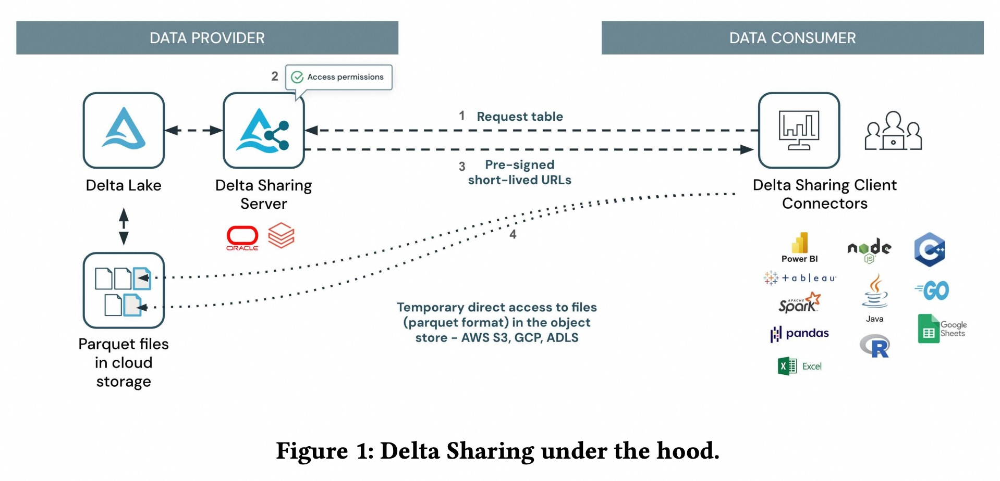
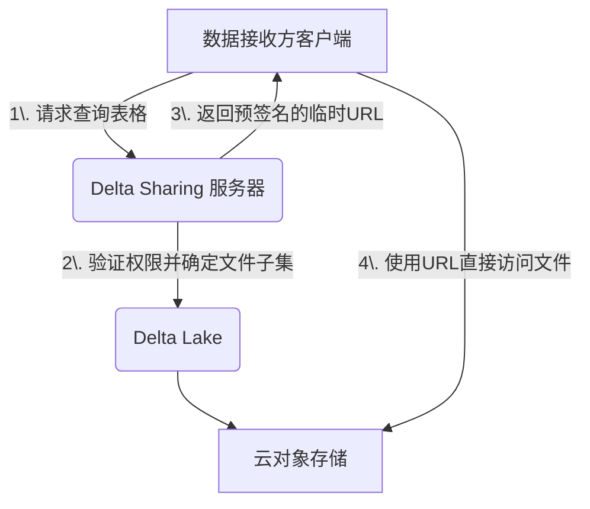
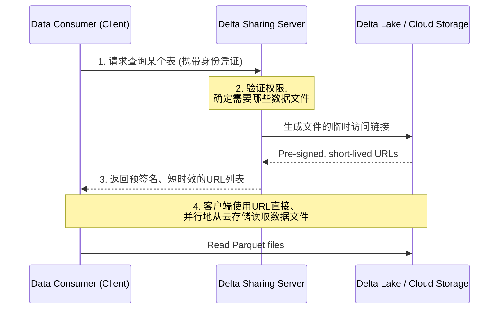
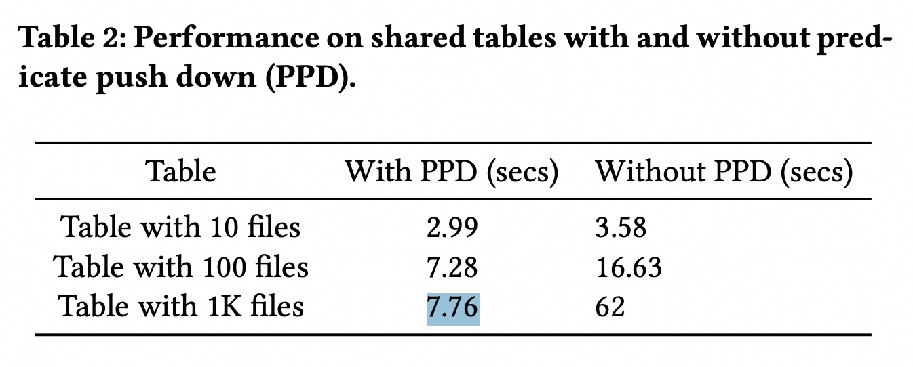
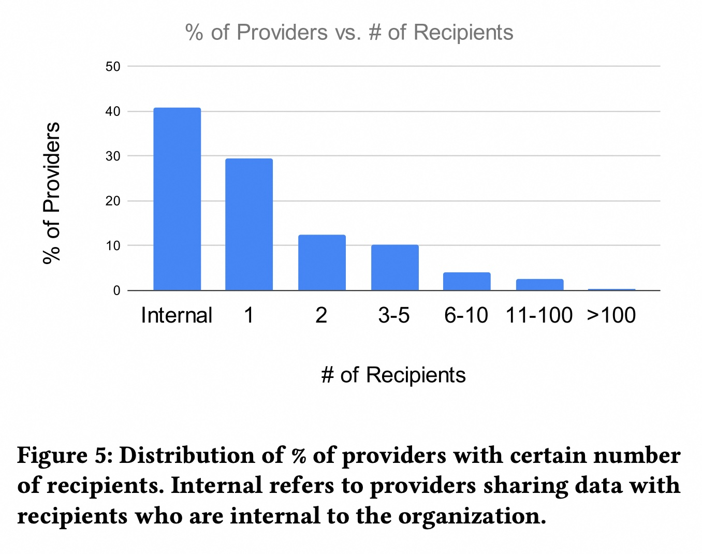

## AI论文解读 | Delta Sharing: An Open Protocol for Cross-Platform Data Sharing
        
### 作者        
digoal        
        
### 日期        
2025-09-10       
        
### 标签        
PostgreSQL , PolarDB , DuckDB , AI , 论文解读        
        
----        
        
## 背景  
      
https://www.vldb.org/pvldb/vol18/p5197-puttaswamy.pdf        
  
提示:          
```          
读懂《Delta Sharing: An Open Protocol for Cross-Platform Data Sharing》这篇论文需要提前掌握哪些基础知识, 请使用中文通熟易懂的讲解这些基础知识, 可以引用论文中的图、表或使用Markdown支持的图形(text,mermaid等)增加解释性. 
  
使用中文通熟易懂的解读《Delta Sharing: An Open Protocol for Cross-Platform Data Sharing》这篇论文, 其中的关键内容请着重讲解, 可以引用论文中的图、表或使用Markdown支持的图形(text,mermaid等)增加解释性. 
  
提取《Delta Sharing: An Open Protocol for Cross-Platform Data Sharing》这篇论文中的重要术语, 使用中文对这些术语进行通熟易懂的讲解, 可以引用论文中的图、表或使用Markdown支持的图形(text,mermaid等)增加解释性. 
```     
  
## 1 前置知识 
  
要读懂《Delta Sharing: An Open Protocol for Cross-Platform Data Sharing》这篇论文，你需要了解以下几个核心基础知识。这些知识点是理解论文中数据共享理念和技术实现的关键。

-----

### 1\. 传统数据共享方式的局限性

在了解Delta Sharing之前，首先要明白它解决的是什么问题。论文中提到了两种传统的数据共享方法，它们的局限性是催生Delta Sharing的主要原因：

  * **FTP (文件传输协议)**: 这种方式通过创建数据副本并进行传输来实现共享。它的主要问题在于繁琐、管理成本高。数据提供方需要维护复杂的ETL（抽取-转换-加载）流水线，为每个接收方创建数据，并管理不断增长的数据和接收方数量。而数据接收方也需要投入资源来定期摄取（ingest）数据并将其整合到自己的数据平台中 。
  * **专有数据仓库共享方案**: 像Snowflake、BigQuery等专有数据仓库提供了零拷贝（zero-copy）共享功能 ，但这通常只适用于使用同一数据仓库的用户 。它们的局限性主要在于互操作性差，因为这些平台的数据格式通常是专有的 ，导致外部工具无法直接访问数据 。

### 2\. 开放式数据格式：Delta Lake 和 Apache Parquet

Delta Sharing的核心是建立在开放格式之上的，这与专有数据仓库形成了鲜明对比。

  * **Apache Parquet**: 这是一种非常流行的**开放式列式存储格式** 。它的主要特点是高效压缩和查询，常用于大数据分析。可以把Parquet文件想象成一个优化过的电子表格文件，它不是按行存储，而是按列存储，因此在进行聚合或分析特定列时性能非常高。论文提到，Parquet文件通常存储在云对象存储（如AWS S3、Azure ADLS、Google GCS）中 。

  * **Delta Lake**: Delta Lake 是构建在云对象存储之上的一种**开放格式**，它提供了数据仓库的可靠性，同时保持了数据湖的灵活性。你可以把它看作是在一堆Parquet文件之上添加了一个“事务日志”（transaction log） 。

      * **如何工作？** Delta Lake 表的核心是一个目录，里面包含Parquet数据文件和一个名为 `_delta_log` 的子目录。这个日志子目录包含一系列JSON文件，记录了对表执行的所有操作，比如添加或删除文件 。
      * **核心优势**: 这种设计使得Delta Lake能够实现事务的原子性（即使底层对象存储只提供最终一致性保障） ，并且提供了 **"时间旅行" (Time Travel)** 功能，让你能查询表格的任意历史版本 。

### 3\. Delta Sharing 的工作原理

理解了以上基础，我们再来看看Delta Sharing是如何运作的。论文中的图1（Figure 1）非常清晰地展示了其架构，可以用以下简化流程来解释：

  



**步骤分解**:

1.  **请求**: 数据接收方的客户端（例如，一个Python脚本或BI工具）向Delta Sharing服务器发送一个查询请求，并提供认证信息 。
2.  **验证与筛选**: 服务器验证接收方的权限，并根据查询条件（如`WHERE country='US'`）从Delta Lake的事务日志中确定需要共享的**Parquet文件子集** 。
3.  **返回预签名URL**: **这是最关键的一步**。服务器不会传输数据本身，而是生成一个**预签名URL**列表并返回给客户端。这些URL是临时的访问令牌，可以直接让客户端在短时间内访问云对象存储中的Parquet文件，而无需额外的身份验证 。
4.  **直接访问**: 客户端拿到这些URL后，可以绕过Delta Sharing服务器，直接并行地从云对象存储（如AWS S3）中读取数据文件 。这种设计避免了服务器成为性能瓶颈，实现了高效、大规模的数据共享 。

**Delta Sharing 的核心理念可以概括为**: **共享元数据（metadata），而不是共享数据本身**。通过共享包含数据文件信息和临时访问权限的元数据，实现了跨平台、无复制、高效且安全的实时数据共享。

-----

**想了解更多关于这篇论文的细节吗？您可以告诉我您最感兴趣的部分，例如：**

  * **数据共享的应用场景**（如内部共享、商业数据共享、隐私安全协作）
  * **论文中提到的技术挑战和解决方案**（如细粒度访问控制、安全共享、成本管理）
  * **论文中的生产工作负载研究**（关于4000多家组织如何使用Delta Sharing的数据分析）
  
## 2 解读论文 
  
好的，我们来一起深入解读这篇关于 Delta Sharing 的论文。这篇论文不仅介绍了一个创新的数据共享协议，还通过大规模的真实世界数据，展示了它如何改变跨组织、跨平台的数据协作方式。

简而言之，**Delta Sharing 是一种开放协议，旨在让任何组织、使用任何计算平台，都能安全、实时、高效地共享数据，而无需复制数据**。它解决了传统数据共享方式（如 FTP）和封闭的数据仓库共享方案（如 Snowflake, BigQuery）的关键痛点。

-----

### 传统数据共享的困境

在理解 Delta Sharing 的精妙之处前，我们先看看它旨在解决的问题。过去，数据共享主要有两种方式，但都有明显缺陷 ：

1.  **文件传输 (如 FTP/SFTP)**：这是几十年来某些行业的标准做法 。

      * **提供方**：需要维护复杂的 ETL 管道，为每个接收方生成、过滤和传输数据副本。随着数据量和接收方数量增长，维护成本和服务器压力剧增 。
      * **接收方**：也需要投入资源定期接收、加载和整合数据，流程繁琐且数据延迟高 。

2.  **专有数据仓库内共享**：像 Snowflake、BigQuery 等平台提供了在其生态系统内部的“零拷贝”共享功能 。

      * **最大问题是“锁定”**：这种共享通常要求提供方和接收方使用**同一个**数据仓库或云平台 。在一个企业内部，不同部门可能使用不同技术栈；在企业之间，这种情况更普遍 。
      * **互操作性差**：数据通常存储在专有格式中，外部工具无法直接访问，导致接收方需要支付额外费用或承受性能损失才能查询数据 。

Delta Sharing 的目标就是打破这些壁垒，实现一个开放、跨平台、安全、实时且高性能的理想方案 。

-----

### Delta Sharing 的核心原理与架构

Delta Sharing 的核心思想非常巧妙：**不移动或复制数据，而是安全地“递送”对源数据的临时访问凭证**。

它的工作流程可以用论文中的图1来概括 ：

  



这个流程的关键点在于：

  * **开放格式**：底层数据存储在开放的 **Apache Parquet** 和 **Delta Lake** 格式中，任何兼容的工具都能读取 。
  * **简单的 REST API**：客户端与服务器之间的通信通过标准的 REST API 完成，易于集成 。
  * **预签名URL (Pre-signed URLs)**：这是实现安全、直接访问的核心机制。服务器不会成为数据传输的瓶颈，因为它只负责元数据和授权管理。它会为客户端需要的每个数据文件（Parquet 格式）生成一个有时效性（如1小时）的、只能读取的URL 。
  * **高性能**：客户端拿到 URL 列表后，可以利用云存储的超高带宽，并行地直接读取数据，实现大规模数据的高性能查询，避免了通过服务器中转的瓶颈 。

-----

### 关键设计挑战与解决方案

论文的第4章详细阐述了在设计这个看似简单的协议时遇到的复杂挑战以及应对之策。

#### 1\. 通用共享 (Universal Sharing)

  * **挑战**：如何让共享数据也能支持 Delta Lake 的高级功能，如时间旅行（查询历史版本）、变更数据流（CDF）、流式处理等，同时还要支持非表格类资产（如机器学习模型、文件）的共享 。
  * **解决方案**：
      * **协议层面支持**：通过在 API 中加入 `version` 或 `timestamp` 等参数，服务器可以计算出对应版本包含哪些数据文件，并返回它们的URL，从而巧妙地在协议层实现了这些高级功能 。
      * **文件夹令牌 (Folder-token)**：对于非表格或文件数量极多的场景，逐一签发文件URL效率低下。为此，他们设计了一种可以授权访问整个云存储“文件夹”的临时令牌，让客户端自行处理文件夹内的文件，这对于 Databricks 内部平台间的共享尤其高效 。

#### 2\. 精细化访问控制 (Fine-Grained Access Control, FGAC)

  * **挑战**：如何安全地共享一个大表的子集（特定的行或列）给不同的接收方，例如，一个多租户SaaS应用，只想让每个租户看到自己的数据 。
  * **解决方案**：采用双模策略。
      * **可信引擎 (Trusted Engine)**：如果接收方的查询引擎是“可信的”（例如，提供方和接收方都在 Databricks 平台上），服务器可以直接将行/列过滤规则下发给该引擎，并授权它访问完整的底层数据，由接收方的引擎来确保安全策略被执行 。
      * **物理物化 (Materialization)**：如果接收方的引擎是“不可信的”（如一个开源的Python客户端），服务器会在提供方这边的一个可信环境中，先计算出该用户可见的数据子集并将其“物化”成临时数据，然后只对这个临时数据授权访问 。

#### 3\. 成本管理 (Cost Management)

  * **挑战**：实时共享虽然避免了存储多份拷贝的成本，但当接收方跨云或跨区域访问数据时，会产生高昂且不可预测的网络“出口费”（Egress Cost）。
  * **解决方案**：
      * **灵活的复制策略**：允许提供方根据场景选择。例如，对于访问频繁的接收方，提供方可以选择在接收方所在的区域创建一个副本，将出口费转化为更可控的存储和复制费用 。
      * **集成Cloudflare R2**：Cloudflare R2 提供零出口费的云存储服务。Delta Sharing 与其集成，让提供方可以将数据同步到 R2，从而极大地降低了共享给大量外部用户的出口成本 。

#### 4\. 性能 (Performance)

  * **挑战**：对于一个拥有数百万个文件的大表，服务器在响应查询时需要快速处理 Delta Log 元数据，并筛选出相关文件，这可能成为瓶颈 。
  * **解决方案**：
      * **谓词下推 (Predicate Pushdown)**：客户端可以在查询请求中附带过滤条件（如 `WHERE country = 'US'`）。服务器利用 Delta Lake 的文件统计信息（如每列的最大/最小值）跳过不相关的文件，从而显著减少需要签名和返回的 URL 数量，也减轻了客户端的读取负担 。
      * **性能对比**：论文中的表格展示了谓词下推的巨大效果。对于一个包含1000个文件的表，使用谓词下推后查询时间从 **62秒** 锐减到 **7.76秒** 。   

-----

### 真实世界的工作负载研究

这篇论文最有价值的部分之一是基于4000多个组织近4年的使用数据，得出的深刻洞察 。

  * **内部共享是主流**：约 **40%** 的数据共享发生在同一个组织的不同业务单元之间，这表明打破内部数据孤岛是刚需 。
  * **开放性至关重要**：超过一半 (约55%) 的数据提供方在与 Databricks 平台**以外**的接收方共享数据 。这些外部接收方使用了超过15种不同的客户端工具（如 PowerBI, Pandas），充分证明了开放协议的价值 。
  * **跨云和跨区域共享很普遍**：在 Databricks 平台间的共享中，约 **9%** 是跨云的，剩余的流量在同区域和跨区域之间平分 。这说明用户不希望为了共享数据而迁移平台。
  * **共享基数多样**：如下图（论文图5）所示，既有大量只与一个外部伙伴共享的场景（约30%），也有少数数据供应商（Hubs）与数百个组织共享数据 。

  

*根据论文图5重绘的示意图*

### 结论

《Delta Sharing》这篇论文不仅仅是一个技术方案的介绍，它通过一个设计简洁而强大的开放协议，证明了在现代数据栈中，互操作性和开放性是数据协作的核心。它成功地在不牺牲安全性、性能和治理能力的前提下，打破了平台的壁垒，让数据能够像信息一样自由、实时地流动，为构建跨组织的数据网格和数据生态系统奠定了坚实的基础。

-----

以上是对这篇论文核心内容的解读。您是对其中的特定技术挑战（如安全性和性能优化），还是对其在真实世界中的应用和市场影响更感兴趣？我们可以就您感兴趣的点进行更深入的探讨。
  
## 3 术语 
  
好的，我已经为您梳理了《Delta Sharing: An Open Protocol for Cross-Platform Data Sharing》这篇论文中的几个重要术语，并用通俗易懂的方式进行解释。

---

### 重要术语详解

#### 1. Delta Sharing (数据共享开放协议)
Delta Sharing 是这篇论文的核心，它是一个**开放协议**，旨在解决跨组织、跨平台实时安全共享数据的难题。你可以把它想象成一个“通用翻译官”，它让不同的数据平台（比如 Databricks、Snowflake、Power BI等）能够互相理解和访问对方的数据，而无需复制大量的数据副本。这与传统的、只能在同一平台内部共享数据的“专有协议”形成鲜明对比。

#### 2. Open Protocol (开放协议)
**开放协议**指的是它的规范是公开透明的。任何人都可以根据这个协议来开发自己的数据共享客户端或服务。这确保了协议的**互操作性**（Interoperability），意味着不管数据提供方使用什么平台，只要遵循这个开放协议，数据接收方都可以用任何支持该协议的工具来访问数据。

#### 3. Delta Lake
**Delta Lake**是一种开源的存储层，它构建在云对象存储（如AWS S3、Azure ADLS）上。它的核心作用是在Parquet文件集合之上提供**ACID事务**（原子性、一致性、隔离性、持久性）。

为了方便理解，可以把它想象成一个带有“版本控制”功能的文件夹：
* **Parquet文件**是你的数据文件。
* **_delta_log 目录**是你的版本控制日志，它记录了对这些数据文件所做的每一次修改（添加、删除、更新）。
* **Delta Lake**就是这个文件夹和日志的组合，它确保了即使多人同时操作数据，数据也不会出错，而且你还可以查看数据的历史版本。

#### 4. Apache Parquet (列式存储格式)
**Apache Parquet**是一种非常流行、开源的**列式存储文件格式**。如果你把数据看作一张电子表格，传统的行式存储是把每一行数据连续存储起来，而列式存储则是把每一列的数据连续存储起来。

你可以通过下图直观地理解它的优势：

| ID | Name | Age | City |
| :-- | :-- | :-- | :-- |
| 1 | Alice | 30 | New York |
| 2 | Bob | 25 | London |
| 3 | Carol | 35 | Tokyo |

**行式存储：** `1,Alice,30,New York | 2,Bob,25,London | 3,Carol,35,Tokyo`
**列式存储：** `1,2,3 | Alice,Bob,Carol | 30,25,35 | New York,London,Tokyo`

当你在分析数据时，如果只需要统计所有人的平均年龄（只需要读取 Age 这一列），列式存储可以大大减少读取的数据量，从而实现更快的查询速度。Delta Sharing 正是基于这种高效的底层格式进行数据共享的。

#### 5. Pre-Signed URL (预签名URL)
**预签名URL**是Delta Sharing中实现高效数据传输的关键技术。它是一个带有临时安全凭证的URL，允许接收方在不经过身份验证的情况下，直接从云对象存储（如S3或ADLS）下载指定的数据文件。

可以把它比作一张“一次性入场券”：
* 数据接收方向Delta Sharing服务器请求数据。
* 服务器验证权限后，不直接发送数据，而是给接收方一张**限时有效**的“入场券”（预签名URL）。
* 接收方拿着这张券，直接到“数据仓库”门口（云对象存储）取走数据。

这种方式的好处是，Delta Sharing服务器只需负责权限验证和元数据管理，**数据传输的重任则完全交给了高速的云对象存储**，这极大地提高了大规模数据共享的效率和可扩展性。

---

希望这些解释能帮助您更好地理解这篇论文。您对其中的哪些方面最感兴趣？比如，您想了解论文中提到的**安全共享**是如何实现的吗？
  
## 参考        
         
https://www.vldb.org/pvldb/vol18/p5197-puttaswamy.pdf    
        
<b> 以上内容基于DeepSeek、Qwen、Gemini及诸多AI生成, 轻微人工调整, 感谢杭州深度求索人工智能、阿里云、Google等公司. </b>        
        
<b> AI 生成的内容请自行辨别正确性, 当然也多了些许踩坑的乐趣, 毕竟冒险是每个男人的天性.  </b>        
    
#### [期望 PostgreSQL|开源PolarDB 增加什么功能?](https://github.com/digoal/blog/issues/76 "269ac3d1c492e938c0191101c7238216")
  
  
#### [PolarDB 开源数据库](https://openpolardb.com/home "57258f76c37864c6e6d23383d05714ea")
  
  
#### [PolarDB 学习图谱](https://www.aliyun.com/database/openpolardb/activity "8642f60e04ed0c814bf9cb9677976bd4")
  
  
#### [PostgreSQL 解决方案集合](../201706/20170601_02.md "40cff096e9ed7122c512b35d8561d9c8")
  
  
#### [德哥 / digoal's Github - 公益是一辈子的事.](https://github.com/digoal/blog/blob/master/README.md "22709685feb7cab07d30f30387f0a9ae")
  
  
#### [About 德哥](https://github.com/digoal/blog/blob/master/me/readme.md "a37735981e7704886ffd590565582dd0")
  
  

  
