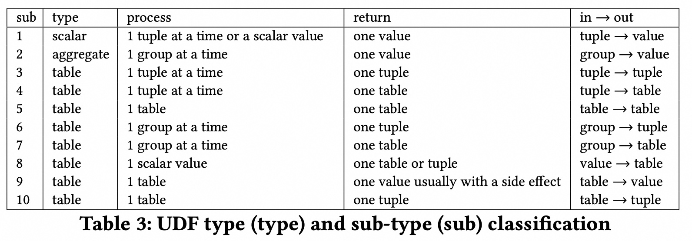
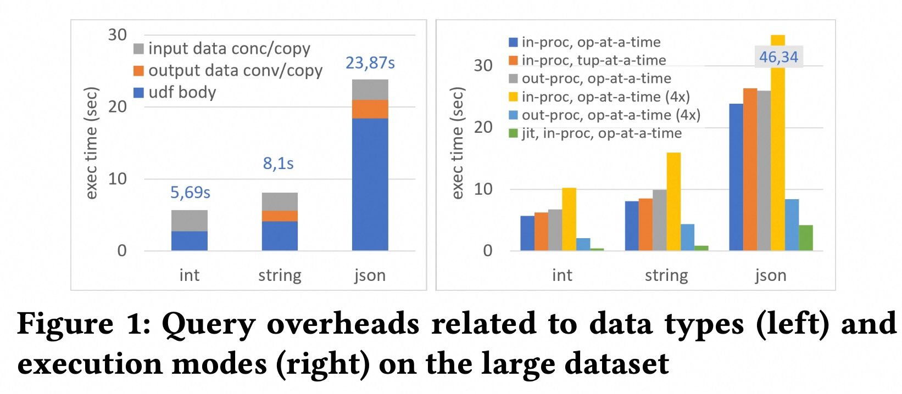
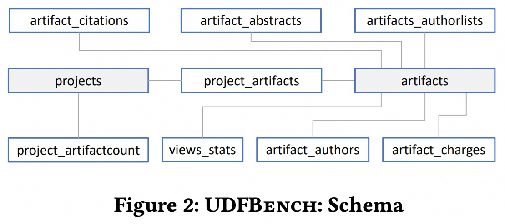
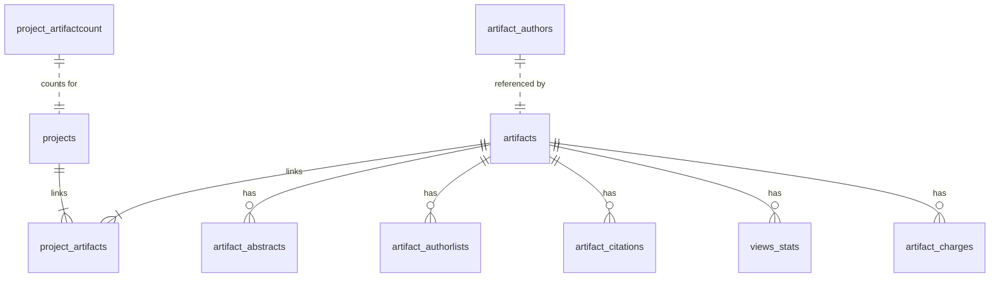
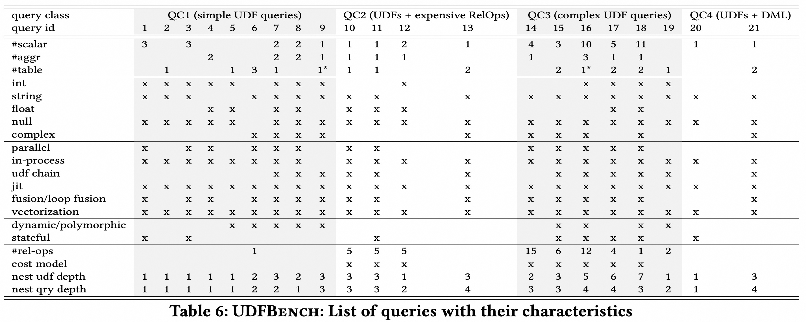
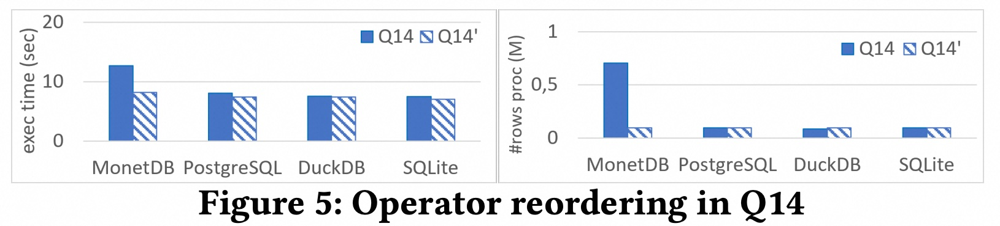
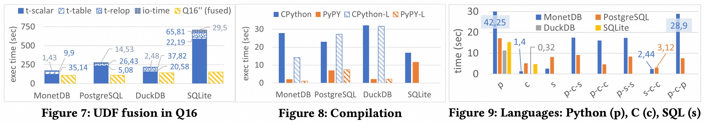
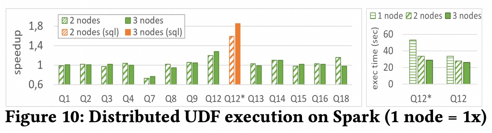

## AI论文解读 | The UDFBench Benchmark for General-purpose UDF Queries
        
### 作者        
digoal        
        
### 日期        
2025-09-10       
        
### 标签        
PostgreSQL , PolarDB , DuckDB , AI , 论文解读        
        
----        
        
## 背景  
      
https://www.vldb.org/pvldb/vol18/p2804-foufoulas.pdf        
  
提示:          
```          
读懂《The UDFBench Benchmark for General-purpose UDF Queries》这篇论文需要提前掌握哪些基础知识, 请使用中文通熟易懂的讲解这些基础知识, 可以引用论文中的图、表或使用Markdown支持的图形(text,mermaid等)增加解释性. 
  
使用中文通熟易懂的解读《The UDFBench Benchmark for General-purpose UDF Queries》这篇论文, 其中的关键内容请着重讲解, 可以引用论文中的图、表或使用Markdown支持的图形(text,mermaid等)增加解释性. 
  
提取《The UDFBench Benchmark for General-purpose UDF Queries》这篇论文中的重要术语, 使用中文对这些术语进行通熟易懂的讲解, 可以引用论文中的图、表或使用Markdown支持的图形(text,mermaid等)增加解释性. 
```     
  
## 1 前置知识 
  
要读懂《The UDFBench Benchmark for General-purpose UDF Queries》这篇论文，你需要提前掌握一些关于数据库、SQL以及函数编程的基础知识。这篇论文的核心在于探讨“用户自定义函数（User-Defined Functions, UDFs）”在数据库查询中的性能瓶颈和优化方法，并提出了一个名为 UDFBENCH 的基准测试工具来系统地衡量这些问题。

以下是理解这篇论文所需掌握的关键基础知识：

### 1\. 数据库与 SQL 基础

论文的前提是关系型数据库系统，因此你需要理解以下概念：

  * **SQL (Structured Query Language)**：用于管理关系数据库的标准语言。
  * **查询处理（Query Processing）**：数据库管理系统如何执行 SQL 查询的整个过程，包括**查询优化器（Query Optimizer）和执行引擎（Execution Engine）**。
  * **查询优化（Query Optimization）**：数据库系统自动寻找最快执行查询计划的过程。论文指出，传统的查询优化器通常将 UDF 视为“黑盒”，这导致它们难以对包含 UDF 的查询进行有效优化 。

-----

### 2\. 用户自定义函数 (UDF)

UDF 是这篇论文的核心。它允许开发者用自己选择的编程语言（如 C/C++、Python、Java）实现复杂逻辑，并将其作为函数在 SQL 查询中使用 。论文将 UDF 分为三大类，并进一步细化为 10 种子类型 ：

  * **标量 UDF (Scalar UDFs)**：每次处理一个元组（一行数据），并返回一个单一值 。
  * **聚合 UDF (Aggregate UDFs)**：每次处理一个分组的数据，并返回一个单一值 。
  * **表 UDF (Table UDFs)**：每次处理一个子查询或标量参数，并返回一个表 。

你可以通过论文中的表格 3 来理解这些 UDF 类型的输入和输出特性：

  

```
+-----+-----------+-------------------------+-----------+----------------+
| sub | type      | process                 | return    | in → out       |
+-----+-----------+-------------------------+-----------+----------------+
| 1   | scalar    | 1 tuple or scalar value | one value | tuple → value  |
| 2   | aggregate | 1 group at a time       | one value | group → value  |
| 3   | table     | 1 tuple at a time       | one tuple | tuple → tuple  |
| 4   | table     | 1 tuple at a time       | one table | tuple → table  |
| 5   | table     | 1 table                 | one table | table → table  |
| 6   | table     | 1 group at a time       | one tuple | group → tuple  |
| 7   | table     | 1 group at a time       | one table | group → table  |
| 8   | table     | 1 scalar value          | one table | value → table  |
| 9   | table     | 1 table                 | one value | table → value  |
| 10  | table     | 1 table                 | one tuple | table → tuple  |
+-----+-----------+-------------------------+-----------+----------------+
```

*(表格根据论文中表格3信息重新组织 )。*

-----

### 3\. UDF 性能瓶颈

这篇论文的核心是分析 UDF 带来的性能问题，其中最主要的瓶颈是 UDF 和 SQL 运行环境之间的“阻抗不匹配”（impedance mismatch） 。论文详细阐述了几个导致性能下降的关键因素：

  * **数据类型与转换开销**：当 UDF 和数据库引擎使用不同的数据类型时（例如 Python 和 C++），需要进行数据转换和复制 。论文中的图 1（左）展示了数据转换和复制所带来的额外开销。   
  * **执行模式 (Execution Mode)**：
      * **进程内 vs. 进程外 (In-process vs. Out-process)**：UDF 在数据库的同一进程内执行通常性能更高，但可能存在安全风险 。
      * **按元组执行 vs. 向量化执行 (Tuple-at-a-time vs. Vectorized)**：按元组执行会导致大量的函数调用开销，而向量化执行则可以批量处理数据，从而提高效率 。
      * **并行性 (Parallelism)**：论文提到，Python UDF 在多线程执行时会受到“全局解释器锁”（Global Interpreter Lock, GIL）的限制，导致性能不佳 。
  * **优化技术**：为了解决上述问题，论文提到了多种优化技术，例如并行化（Parallelization）、向量化（Vectorization）、函数内联/外联（Function Inlining/Outlining）和即时编译（JIT Compilation） 。

-----

### 4\. 论文中的图例和概念

论文中引用了一些图表，可以帮助你更好地理解其论点：

  * **图 1 (Figure 1)**：展示了数据类型（左图）和执行模式（右图）对查询开销的影响 。特别是在右图中，你可以看到不同的执行模式（例如 `in-proc`、`out-proc`、`op-at-a-time`、`tup-at-a-time`）对执行时间的影响 。   
  * **图 2 (Figure 2)**：描绘了 UDFBENCH 的实体-关系图（ER-diagram），即其所使用的数据库模式。它展示了论文中用来进行测试的 10 个数据表及其关系 。   

-----

### 5\. 总结

总的来说，要理解这篇论文，你需要具备以下知识：

1.  **数据库和 SQL 基础**：理解查询优化和执行过程。
2.  **函数和编程语言基础**：理解 UDF 是什么，以及不同编程语言（如 Python、C++）之间的性能差异。
3.  **性能分析概念**：理解数据转换、进程通信、并行性等对性能的影响。

掌握了这些基础知识，你将能更好地理解论文中提出的 UDFBENCH 基准如何系统地评估和分析这些性能瓶颈。

-----

### **下一步：**

我已经概述了阅读这篇论文所需的基础知识。如果你对其中的任何一个概念，例如 **“全局解释器锁 (GIL)”** 或 **“向量化执行”** ，想了解更详细的解释，我可以提供更多信息。
  
## 2 解读论文 
  
好的，我们来一起深入解读这篇关于数据库用户自定义函数（UDF）的重要论文——《The UDFBENCH Benchmark for General-purpose UDF Queries》。

我会用尽可能通俗易懂的语言，为你剖析这篇论文的核心思想、关键设计和重要发现。

-----

### 一文读懂 UDFBENCH：为数据库用户自定义函数（UDF）量身打造的“体检”标准

想象一下，SQL 数据库就像一个装备精良的厨房，有各种标准厨具（如 `SELECT`, `JOIN`, `GROUP BY`）。而 **UDF (User-Defined Function, 用户自定义函数)** 就像是你自己带来的特殊工具（比如一个特定型号的空气炸锅或面条机），它可以让你用自己熟悉的编程语言（如 Python, C++, Java）来完成标准厨具做不了的复杂烹饪任务。

这本应是件好事，但实际情况是，当你把自己的工具带进厨房时，总会遇到各种问题：插座不匹配、电压不对、或者厨师长（查询优化器）不知道怎么安排你的工具，导致整个做菜流程变得异常缓慢。这就是 UDF 在数据库中面临的困境。

**这篇论文的核心贡献，就是创造了一套名为 UDFBENCH 的标准化“体检”流程，专门用来测试和衡量不同数据库在运行 UDF 时的性能表现、找出它们的瓶颈所在。**

-----

### 1\. 问题的核心：为什么UDF查询这么慢？

论文首先分析了导致 UDF 性能低下的几大“罪魁祸首”（论文中称之为“choke points”，即瓶颈点）：

  * **语言不匹配 (Impedance Mismatch)**: 数据库内核通常用 C/C++ 编写，而 UDF 常用 Python。数据在两者之间来回传递，需要进行格式转换和复制，就像在说中文和英文的人之间加了个翻译，耗时耗力。
  * **黑盒式优化 (Black-box Optimization)**: 数据库的“大脑”——查询优化器，通常不理解 UDF 内部的逻辑。它只知道这是一个“黑盒子”，不知道这个函数是快是慢，是耗CPU还是耗内存。因此，它无法做出最优的执行计划。比如，一个很耗时的 UDF 本应在数据被过滤后（数据量变小）再执行，但优化器可能会先对所有数据执行UDF，造成巨大浪费。
  * **执行模式 (Execution Mode)**: UDF 的执行方式也大有讲究。
      * **进程内 vs. 进程外**: 在数据库主进程内执行速度快，但UDF出错可能导致整个数据库崩溃；在进程外执行更安全，但通信开销大。
      * **逐元组 vs. 向量化**: 一条一条数据调用UDF（逐元组），调用次数多开销大；一次性给UDF一批数据（向量化），效率高但可能破坏执行流水线。
  * **编程语言特性**: 特别是 Python 的 **全局解释器锁 (GIL)**，导致它在多线程环境下无法真正并行，严重限制了性能。
  * **数据类型**: 处理简单的数字、字符串和处理复杂的 JSON、数组，其转换和序列化开销天差地别。

为了直观展示这些开销，论文在 **Figure 1** 中用实验说明了**数据类型转换**和**执行模式**对性能的巨大影响。

  

-----

### 2\. UDFBENCH 的构成：一把精密的“手术刀”

为了精准地测量上述瓶颈，UDFBENCH 被设计成了一套包含 **“真实数据、多样化UDF、复杂查询”** 的完整工具集。

#### 2.1 真实的数据和模型 (Schema & Data)

  * **来源**: 数据模型源自一个真实的大型科研项目 OpenAIRE，确保了场景的真实性。
  * **规模**: 提供了三种不同规模的数据集（小、中、大），最大的有约1.2亿行，可以测试不同数据量下的性能表现。
  * **结构**: 包含了10个表，有范式化的数据，也有JSON这类半结构化数据，模拟了现代应用的复杂数据环境。




  

*UDFBENCH 简化的实体关系图 (基于论文 Figure 2)*

#### 2.2 精心设计的UDF (User-Defined Functions)

UDFBENCH 包含了 **42个** 从真实业务逻辑中提炼出的 UDF。最关键的是，论文对它们进行了系统分类。如 **Table 3** 所示，它根据 UDF 的输入和输出，将它们分为 **10个子类型**：

  

| 主类型 (Type) | 子类型 (Sub-type) | 处理方式 (Process) | 返回 (Return) | 描述 |
| :--- | :--- | :--- | :--- | :--- |
| **Scalar (标量)** | 1 | 一次处理一行或一个值 | 一个值 | `tuple -> value`，最常见的UDF，如`lower('ABC')` |
| **Aggregate (聚合)**| 2 | 一次处理一组 | 一个值 | `group -> value`，如自定义的`median()` |
| **Table (表)** | 3-10 | 多种多样 | 一行或一个表 | `tuple -> tuple`, `table -> table`等8种复杂情况 |

这种分类至关重要，因为它揭示了不同 UDF 对查询优化的潜在影响。例如，一次处理一行的表函数（`tuple -> table`）是**可以并行处理**的，而一次处理整张表的函数（`table -> table`）则是**阻塞**的，会中断整个查询的并行流水线。

#### 2.3 覆盖全面的查询 (Queries)

UDFBENCH 设计了 **21个** 查询，并将其分为 **4个查询类别 (QC1-QC4)**，各有侧重：

  * **QC1 (简单UDF查询)**: 主要测试UDF自身的开销，SQL逻辑很简单。比如，对比用三个独立的标量UDF和用一个表UDF来从日期中提取年、月、日。
  * **QC2 (UDF + 昂贵关系操作)**: 混合了UDF和`JOIN`, `GROUP BY`等复杂SQL操作，用于评估UDF与数据库核心算子的交互性能。
  * **QC3 (复杂UDF查询)**: 包含深层嵌套的UDF和复杂的业务逻辑，专门用来“拷问”查询优化器的能力极限。
  * **QC4 (UDF + DML操作)**: 测试在 `INSERT`, `UPDATE` 等数据修改操作中使用UDF的性能。

**Table 6** 详细列出了每个查询的特征，比如它用了几种UDF、是否可以并行、是否适合JIT编译等等，是整个 benchmark 的设计蓝图。   

-----

### 3\. 实验与发现：五大数据库“同台竞技”

论文在五个具有不同架构特点的数据库上部署了 UDFBENCH，进行了一场全面的“性能摸底考试”。这五个数据库分别是：**PostgreSQL, MonetDB, DuckDB, SQLite, 和 Spark**。

下面是实验中一些最关键的发现：

#### 发现一：架构决定性能特点

不同的数据库架构在处理UDF时表现出明显的偏好。

| 数据库 | 核心架构特点 | UDF 性能优势 | UDF 性能劣势 |
| :--- | :--- | :--- | :--- |
| **PostgreSQL** | 基于进程，行式存储 | **多进程并行**绕开了Python的GIL限制，在CPU密集型UDF上表现出色。 | 进程间通信开销大，逐元组执行模式在处理大量数据时效率不高。 |
| **DuckDB/MonetDB**| **向量化执行**，列式存储 | 聚合和分析类查询极快，通过NumPy/Pandas实现**零拷贝**数据交换。 | 受Python GIL影响，多线程并行效果不佳。在某些复杂查询下内存消耗巨大。 |
| **SQLite** | 嵌入式，单线程 | **进程内执行**，没有通信开销，在简单查询上非常快。 | 无法并行，处理复杂查询和大数据量时性能瓶颈明显。 |
| **Spark** | 分布式计算 | **强大的分区并行**能力，在可并行化的UDF和大规模数据集上扩展性好。 | 许多阻塞型或非并行安全的UDF无法运行，调度和数据移动开销大。 |

#### 发现二：优化技术是关键，但多数数据库做得不够好

  * **算子重排 (Operator Reordering)**: **Figure 5** 展示了查询Q14的例子。聪明的优化器（如PostgreSQL和SQLite）会把昂贵的`jsonparse` UDF推迟到`JOIN`和`FILTER`之后执行，处理的数据量大大减少。而MonetDB则没有这样做，导致性能较差。   
  * **UDF融合 (UDF Fusion)**: **Figure 7** 中，通过手动将Q16查询中的一连串UDF操作**融合成一个UDF**，减少了函数调用和数据交换的次数，所有数据库的性能都得到了显著提升。这证明了UDF融合的巨大潜力。   
  * **即时编译 (JIT Compilation)**: **Figure 8** 的实验非常亮眼。通过使用支持JIT的PyPy代替标准的CPython来执行UDF，查询性能获得了**数倍甚至数十倍**的提升。这说明编译技术是优化UDF性能的“杀手锏”。  
  * **语言的影响**: **Figure 9** 清晰地显示了性能差异：**C \> SQL \> Python**。C/C++ UDF几乎是性能的上限，而Python UDF由于GIL和解释执行，性能最差。 

#### 发现三：UDF会让分布式系统的优势打折扣

在 Spark 上的实验（**Figure 10**）发现，包含 UDF 的查询（Q12）在增加计算节点时，性能提升远不如纯SQL的等价查询（Q12\*）。原因是 Spark 视 UDF 为黑盒，无法对其内部进行并行优化，只能在分区层面进行粗粒度的并行，这限制了分布式系统的扩展能力。   

-----

### 4\. 核心洞察与结论

通过 UDFBENCH 的全面评测，这篇论文给出了深刻的洞察：

1.  **没有银弹**: 不同的数据库架构各有优劣。向量化引擎适合分析，而多进程模型能更好地应对Python GIL。
2.  **优化器是短板**: 当前主流数据库的查询优化器对 UDF 的理解和优化能力普遍不足，存在巨大的提升空间。
3.  **编译是未来**: JIT 编译等技术能从根本上解决解释型语言（如Python）的执行效率问题，是提升UDF性能的重要方向。
4.  **UDF需要被“一等公民”对待**: 数据库系统需要更深入地集成UDF，提供更丰富的UDF类型支持、更智能的优化策略（如自动融合和重排），而不是简单地将其作为外部黑盒调用。

总而言之，**UDFBENCH 不仅提供了一个评估UDF性能的工具，更重要的是，它建立了一套分析和理解UDF性能瓶颈的方法论，为未来数据库系统的设计和优化指明了方向。** 它告诉我们，要想让用户自带的“十八般兵器”在数据库这个“大厨房”里游刃有余，厨房本身的设计也必须与时俱进。
  
## 3 术语 
  
好的，根据《The UDFBench Benchmark for General-purpose UDF Queries》这篇论文的内容，我为你提取并整理了几个重要的核心术语，并用通俗易懂的方式进行了解释。

---

### 1. 用户自定义函数 (User-Defined Function, UDF)

**核心概念:**
你可以把 **UDF** 想象成一个程序员自己写的、能在数据库查询（SQL）里调用的“小工具”。这些小工具通常用来处理一些 SQL 本身做不了的复杂逻辑，比如文本分析、机器学习模型的调用，或者复杂的数学计算。

**论文中的分类:**
论文根据 UDF 的输入和输出方式，将它们分为三大类：
* **标量 UDF (Scalar UDFs)**：就像一个计算器，你给它一个输入（比如一行数据），它就返回一个单一的结果（比如计算后的值）。
* **聚合 UDF (Aggregate UDFs)**：就像一个求和机，你给它一组数据（比如一个分组的所有行），它就返回一个汇总结果（比如总和、平均值等）。
* **表 UDF (Table UDFs)**：这个更复杂，它返回的不是一个值，而是一个“表”，也就是说，它能把输入的一行或多行数据，转换成一个新的表结构。

你可以参考论文中的**表 3**，它详细展示了不同 UDF 子类型的输入和输出关系。   

### 2. UDFBENCH

**核心概念:**
这是一个由论文作者设计的**基准测试工具**，目的就是系统性地衡量 UDF 在各种数据库系统中的性能表现。你可以把它看作是一个专门为 UDF 设计的“性能测试场”。

**为什么需要它?**
在 UDFBENCH 出现之前，没有一个统一的标准来测试 UDF，每篇研究 UDF 优化的论文都用自己的方法。UDFBENCH 通过提供统一的数据集、UDF 实现和查询模板，让研究人员能够公平地比较不同数据库或优化技术的性能。

### 3. 阻抗不匹配 (Impedance Mismatch)

**核心概念:**
这个词形象地描述了 UDF 为什么会变慢。数据库引擎（比如用 C/C++写的）和 UDF 的代码（比如用 Python写的）是两个“世界”。它们有不同的数据类型、内存管理方式和执行模型。

你可以想象一下，你用普通话（SQL）和一位只讲粤语的朋友（UDF）交流。每一次交流都需要一个翻译（阻抗不匹配），这个翻译过程会消耗时间和精力。这个“翻译”就是**数据转换（data marshalling）**和**进程间通信（inter-process communication）**，这些都会产生显著的性能开销，也就是论文中反复提到的瓶颈。

### 4. 向量化执行 (Vectorized Execution)

**核心概念:**
这是解决 UDF 性能问题的一种关键优化技术。
* **传统方式 (Tuple-at-a-time)**：数据库引擎每处理一行数据，就调用一次 UDF。这种方式会产生大量的函数调用开销，就像你在超市结账时，每扫一件商品，收银员都要和你打招呼一次，效率很低。
* **向量化执行 (Vectorized Execution)**：它不是一行一行地处理数据，而是一次性打包处理一批数据（一个“向量”或“批次”）。这就像收银员一次性扫完你购物篮里的所有商品，然后只打一次招呼。这样可以大幅减少函数调用的次数，从而显著提高性能。

你可以参考论文中的**图 1（右图）**，它清晰地对比了不同执行模式对查询总耗时的影响。   

### 5. 即时编译 (Just-in-Time, JIT) Compilation

**核心概念:**
这是一种高级优化技术。通常，UDF 代码是解释执行的（比如 Python）。JIT 编译器可以在运行时，将这些解释型代码直接编译成机器码，然后执行。

**为什么它很重要？**
编译后的机器码运行速度比解释执行快得多。对于那些频繁执行的 UDF，JIT 编译可以有效消除解释器带来的性能瓶颈，让 UDF 的执行速度更接近数据库引擎本身的性能。

---

希望这些解释能帮助你更好地理解这篇论文。如果你对**UDF 性能瓶颈**中的某一个方面，比如数据转换或进程级通信，想了解更详细的例子，我很乐意为你进一步解释。
  
## 参考        
         
https://www.vldb.org/pvldb/vol18/p2804-foufoulas.pdf    
        
<b> 以上内容基于DeepSeek、Qwen、Gemini及诸多AI生成, 轻微人工调整, 感谢杭州深度求索人工智能、阿里云、Google等公司. </b>        
        
<b> AI 生成的内容请自行辨别正确性, 当然也多了些许踩坑的乐趣, 毕竟冒险是每个男人的天性.  </b>        
    
#### [期望 PostgreSQL|开源PolarDB 增加什么功能?](https://github.com/digoal/blog/issues/76 "269ac3d1c492e938c0191101c7238216")
  
  
#### [PolarDB 开源数据库](https://openpolardb.com/home "57258f76c37864c6e6d23383d05714ea")
  
  
#### [PolarDB 学习图谱](https://www.aliyun.com/database/openpolardb/activity "8642f60e04ed0c814bf9cb9677976bd4")
  
  
#### [PostgreSQL 解决方案集合](../201706/20170601_02.md "40cff096e9ed7122c512b35d8561d9c8")
  
  
#### [德哥 / digoal's Github - 公益是一辈子的事.](https://github.com/digoal/blog/blob/master/README.md "22709685feb7cab07d30f30387f0a9ae")
  
  
#### [About 德哥](https://github.com/digoal/blog/blob/master/me/readme.md "a37735981e7704886ffd590565582dd0")
  
  

  
