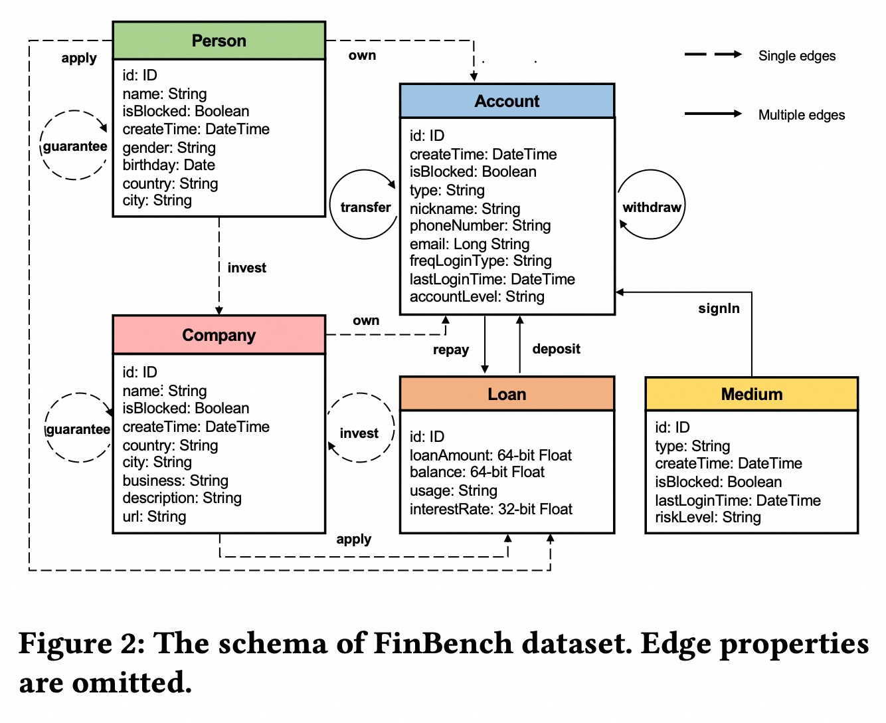
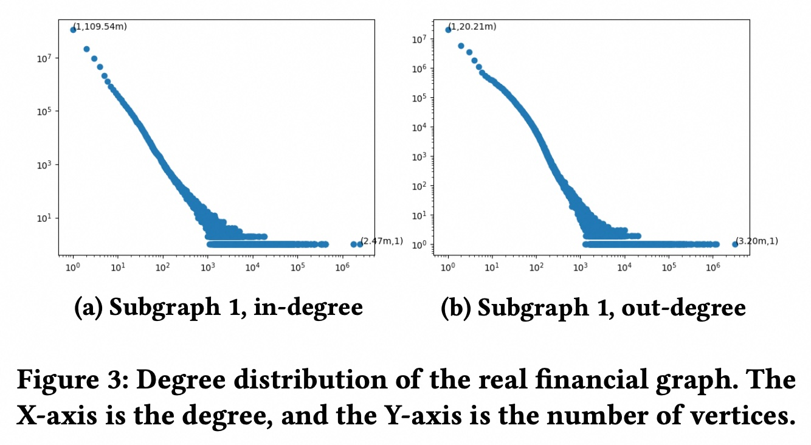
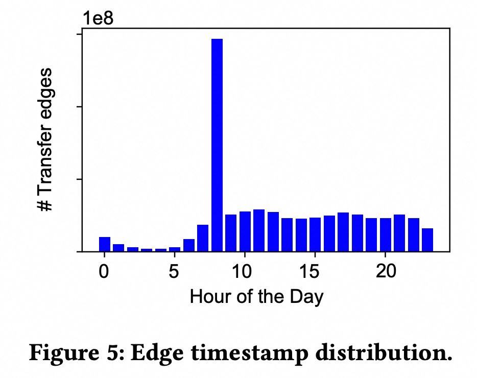
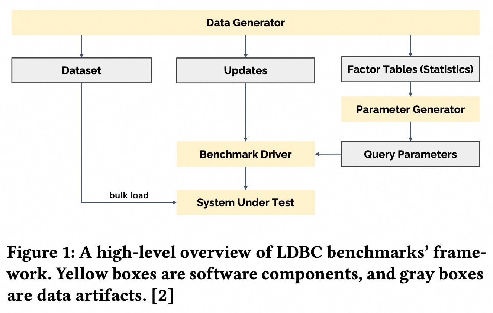
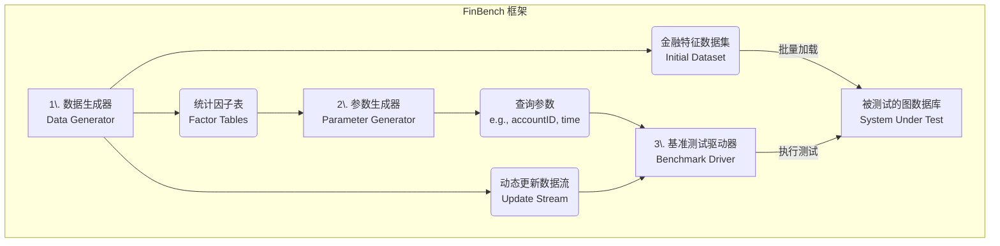
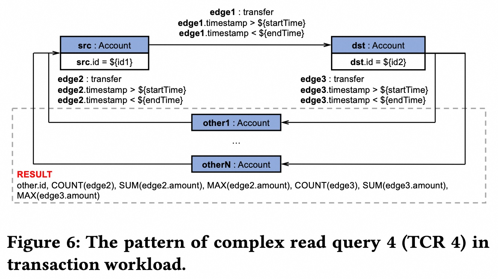
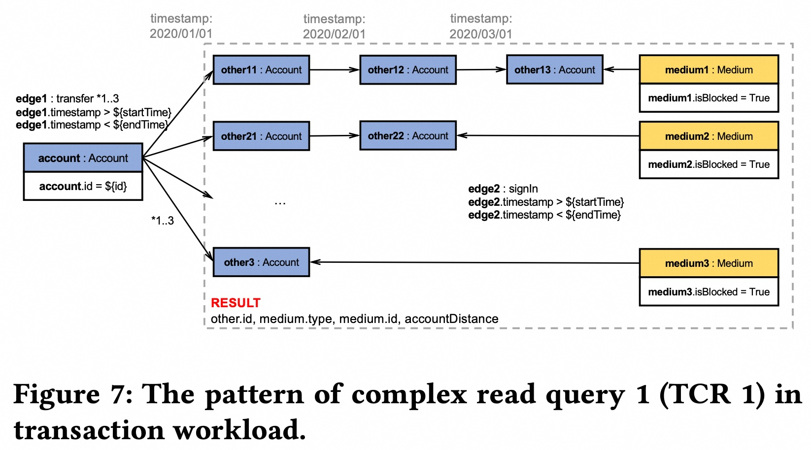
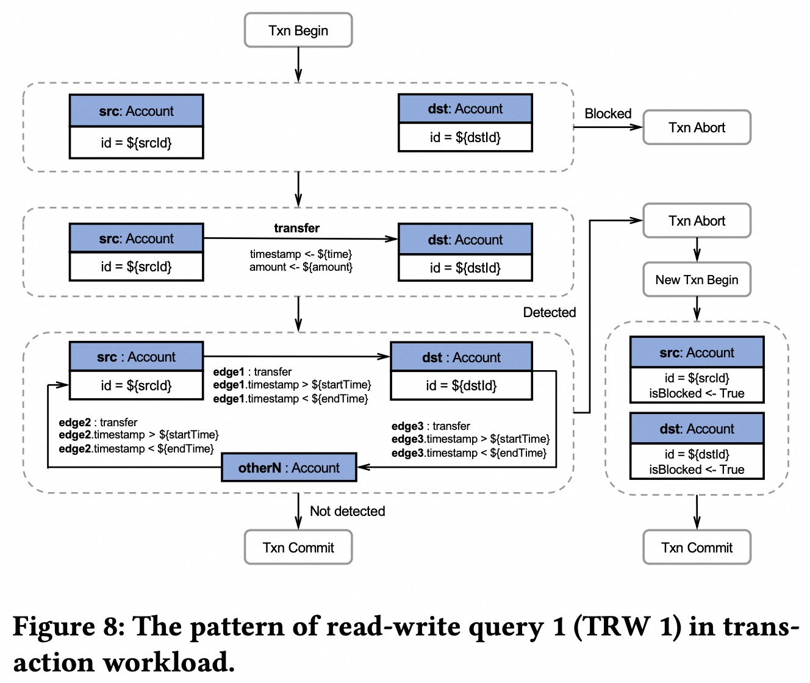

## AI论文解读 | The LDBC Financial Benchmark: Transaction Workload
        
### 作者        
digoal        
        
### 日期        
2025-09-10       
        
### 标签        
PostgreSQL , PolarDB , DuckDB , AI , 论文解读        
        
----        
        
## 背景  
      
https://www.vldb.org/pvldb/vol18/p3007-qi.pdf        
  
提示:          
```          
读懂《The LDBC Financial Benchmark: Transaction Workload》这篇论文需要提前掌握哪些基础知识, 请使用中文通熟易懂的讲解这些基础知识, 可以引用论文中的图、表或使用Markdown支持的图形(text,mermaid等)增加解释性. 
  
使用中文通熟易懂的解读《The LDBC Financial Benchmark: Transaction Workload》这篇论文, 其中的关键内容请着重讲解, 可以引用论文中的图、表或使用Markdown支持的图形(text,mermaid等)增加解释性. 
  
提取《The LDBC Financial Benchmark: Transaction Workload》这篇论文中的重要术语, 使用中文对这些术语进行通熟易懂的讲解, 可以引用论文中的图、表或使用Markdown支持的图形(text,mermaid等)增加解释性. 
```     
  
## 1 前置知识 
  
要读懂《The LDBC Financial Benchmark: Transaction Workload》这篇论文，您需要提前掌握以下几个核心基础知识。这篇论文通过一个金融领域的图数据库基准测试，详细介绍了图数据库在金融场景下的独特挑战和特性。

### 1. 图数据库基础（Graph Database Fundamentals）
首先，您需要理解**图数据库（Graph Database）**的基本概念。

* **顶点与边（Vertices and Edges）**：图数据库的核心是**顶点（Vertices）**和**边（Edges）**。顶点代表实体，比如论文中提到的**人（Person）**、**公司（Company）**和**账户（Account）**。边代表实体之间的关系或活动，比如“转账”（`transfer`）或“拥有”（`own`）。

* **属性图模型（Labeled Property Graph, LPG）**：论文采用的是**属性图模型**，这意味着每个顶点和边都可以附加多个**属性（Properties）**。例如，“账户”顶点可以有“创建时间”和“账户级别”等属性，而“转账”边可以有“转账金额”和“时间戳”等属性 。论文中的图2展示了整个金融数据集的模式，其中包含5种顶点类型和9种边类型 。

  

### 2. 金融图数据的独有特性（Unique Characteristics of Financial Graphs）
金融图数据与常见的社交网络图数据有显著不同，这些特性是论文设计基准测试的关键。

* **数据倾斜（Skewness）**：金融活动的数据分布往往是高度不平衡的。论文用**幂律分布（Power-law distribution）**来解释这种倾斜 。这意味着绝大多数账户的交易数量很少，但少数几个“中心账户”（hub vertices）的交易量巨大 。

* **多重边（Edge Multiplicity）**：这是金融图数据的一个重要特征，指在同一个源头和目标顶点之间可以存在多条边 。例如，同一家公司可能每月多次向同一个员工账户转账，这就会在两个账户之间产生多条“转账”边。论文的图2中，实线箭头（如`transfer`）代表允许有多重边的关系 。   

* **时间性（Temporality）**：金融活动有明显的时间规律。论文指出，交易量在一天中会有周期性波动，例如在银行和金融市场开门时（8:00-9:00）达到峰值，而午夜到凌晨的交易量很少 。

### 3. 基准测试与工作负载（Benchmark and Workload）
这篇论文的本质是一个基准测试，因此需要了解一些相关的术语。

* **基准测试（Benchmark）**：一种用于客观比较不同数据库系统性能的标准方法 。

* **工作负载（Workload）**：指系统需要处理的查询类型和操作的集合。论文的重点是**事务型工作负载（Transaction Workload）**，即大量读操作和少量写操作的混合体 。

* **查询类型与瓶颈（Query Types and Choke Points）**：论文设计了多种特殊的查询来测试系统性能的“瓶颈（Choke Point）” 。理解这些查询模式非常重要：
    * **时间窗口过滤查询（Time-window Filtering Queries）**：这类查询只关注特定时间段内的数据，例如查找在某个时间窗口内发生的所有转账 。
    * **递归路径过滤查询（Recursive Path Filtering Queries）**：这类查询用于追踪资金流向或关系链，需要对多跳（multi-hop）路径进行导航，并在每一步都进行筛选 。

---
如果您对论文的某个特定部分特别感兴趣，例如对数据生成器（Data Generator）或者查询设计（Query Design）有疑问，我们可以深入探讨。您希望我继续为您讲解哪一部分呢？
  
## 2 解读论文 
  
好的，我们来一起通俗易懂地解读一下《The LDBC Financial Benchmark: Transaction Workload》这篇论文。

简单来说，这篇论文做了一件核心的事情：**为金融领域的图数据库专门设计了一套“高考题”，也就是一个标准的性能测试工具，取名 FinBench**。

为什么要做这件事呢？因为以前的图数据库性能测试工具（Benchmark），大多是模拟社交网络（比如好友关系）的场景，拿给金融场景（比如反欺诈、反洗钱）用，就像让一个短跑运动员去参加马拉松比赛一样，测不出真实水平。金融数据和查询有着自己非常独特的特点，之前的工具无法覆盖这些特点。

-----

### 关键内容一：金融场景的数据和查询到底有什么不一样？

论文首先分析了真实的金融数据，发现了几个关键特征，这些也是 FinBench 设计的基石：

1.  **数据分布极度不均 (Skewness)**：金融网络里存在“超级节点”（Hub Vertices）。想象一下，一个大型企业的对公账户，可能会与成千上万个员工账户发生转账关系，这就是一个超级节点。查询一旦涉及到这种节点，计算量会爆炸式增长。论文中的图3就展示了这种典型的“幂律分布”，即绝大多数账户交易很少，而极少数账户交易量极大。   

      * **论文图3：真实金融图的度分布**
          * **解读**：这张图的X轴是度（可以理解为交易对手的数量），Y轴是账户数量。可以看到，曲线非常陡峭，说明度很小的账户（左侧）数量极多，而度非常大（右侧）的账户数量极少，但确实存在。

2.  **边的高重复性 (Edge Multiplicity)**：在社交网络里，两个人之间通常只有一种“好友”关系。但在金融场景中，两个账户之间可能在不同时间发生无数次转账。这意味着两个节点之间存在大量平行的“边”，这对数据库的存储和查询设计提出了新要求。

3.  **强烈的时间属性 (Temporality)**：金融交易严格依赖时间。分析师常常需要查询“最近5分钟内”、“上个季度的”或者“某个特定时间窗口内”的交易。交易时间戳的分布也很有规律，比如在工作日的上午8-9点达到高峰，这在论文的图5中有清晰的展示。   

      * **论文图5：边的时间戳分布**
          * **解读**：这张图展示了一天24小时内交易数量的分布，可以清楚地看到在上午8-9点有一个巨大的交易高峰。

-----

### 关键内容二：FinBench 的整体设计

为了模拟上述的金融特性，FinBench 设计了一套完整的框架。我们可以用下面这张流程图来理解它的核心组件，这也呼应了论文中的图1。 

  



  * **数据生成器 (Data Generator)**：它不仅仅是生成一堆数据，而是会精准地模拟前面提到的幂律分布、时间规律等特征，确保生成的数据集“闻起来就像真实的金融数据”。
  * **参数生成器 (Parameter Generator)**：为了保证测试的公平和稳定，它会根据数据的统计特征来生成查询参数，避免某些查询因为参数太极端而耗时过长，或者因为太简单而失去意义。
  * **基准测试驱动器 (Benchmark Driver)**：这是“主考官”，它负责将被测数据库初始化，然后根据设定的负载，混合执行各种复杂的读、写查询，并记录性能指标（如吞吐量和延迟）。

-----

### 关键内容三：识别并测试系统的“技术难点” (Choke Points)

这部分是论文的精髓。FinBench 的设计方法是 **“技术难点驱动 (choke point-driven)”** ，它专门设计了一些查询来“刁难”数据库，看它在处理金融领域最头疼的问题时表现如何。

#### 难点1：时间窗口过滤 (Time-window Filtering)

  * **场景**：查询两个账户（src, dst）在某个时间段内，是否存在一个“三角转账”关系：`src` 转给 `dst`，同时 `dst` 转给某个 `other` 账户，而这个 `other` 账户又转回给了 `src`。这在反洗钱中是常见模式。
  * **挑战**：数据库需要高效地在海量交易中筛选出符合特定时间窗口的记录。如果内部存储没有按时间优化，就需要扫描大量无关数据，性能会很差。
  * **论文图6 (TCR 4查询模式)**
      * **解读**：这个模式图清晰地展示了查询必须满足所有三条转账边（edge1, edge2, edge3）的时间戳都在 `$startTime` 和 `$endTime` 之间。    

#### 难点2：递归路径过滤 (Recursive Path Filtering)

  * **场景**：从一个初始账户出发，寻找最多3步转账内，能到达一个被“封禁(blocked)”账户的资金链路，并且要求整条链路上的转账时间是依次递增的（模拟资金流动）。
  * **挑战**：这是一种“循着线索找人”的查询。数据库需要在遍历图的同时，不断检查路径上的属性（比如时间戳是不是递增的）。如果不能在遍历早期就剪掉无效路径，中间结果会爆炸式增长，导致查询非常慢。
  * **论文图7 (TCR 1查询模式)**
      * **解读**：这个查询要求找到一条最多3跳的路径（`*1..3`），并且路径上所有转账的时间戳必须是升序的 (`isAsc`)，最终连接到一个被封禁的媒介（`medium.isBlocked = true`）。   

#### 难点3：读写混合查询 (Read-Write Queries)

  * **场景**：模拟一笔转账操作。系统需要：
    1.  **先读**：检查转账双方账户是否被封禁。
    2.  **再写**：如果账户正常，则创建一笔新的转账记录。
    3.  **再读**：检查这笔新转账是否构成了一个新的洗钱环路。
    4.  **最终决定**：如果构成了风险，则**回滚**这笔转账并把双方账户标记为封禁；否则，**提交**转账。
  * **挑战**：这个过程要求在一个事务（Transaction）内完成，对数据库的并发控制和事务处理能力是巨大的考验。一个查询既要读又要写，还带有复杂的业务逻辑，非常容易产生锁竞争和性能瓶颈。
  * **论文图8 (TRW 1查询模式)**
      * **解读**：这张流程图完美诠释了读写混合的复杂逻辑。根据读取结果（是否封禁、是否形成环路），事务可能会中止（Txn Abort）或提交（Txn Commit）。   

-----

### 结论与价值

论文最后通过在多个真实的图数据库系统（如 TuGraph-DB, Galaxybase, gStore）上运行 FinBench，证明了其有效性。实验结果显示，针对上述“技术难点”进行优化的系统，性能提升非常显著 。例如，对时间戳进行排序存储，可以让时间窗口查询的性能提升40.9% 。

总而言之，**FinBench 的价值在于它提供了一把精准的“尺子”**，让金融机构在选择或开发图数据库时，能够衡量其是否真正满足金融场景下的高性能、高并发和复杂查询需求。同时，它也为数据库开发者指明了优化的方向。
  
## 3 术语 
  
要读懂《The LDBC Financial Benchmark: Transaction Workload》这篇论文，了解其重要术语至关重要。以下是对论文中几个核心术语的通俗讲解：

### 1. 事务型工作负载（Transaction Workload）
这是论文标题的核心。简单来说，**工作负载**就是一系列要对数据库执行的操作。**事务型**则意味着这些操作通常是**小规模、高并发**的，比如一次转账、一次查询账户余额。与此相对的是“分析型工作负载”，后者通常涉及大规模数据扫描和复杂计算。这篇论文的重点就在于模拟金融行业中大量且快速的交易行为。

### 2. 幂律分布（Power-law distribution）
这是描述金融网络数据特征的一个关键概念。在金融世界里，账户和交易量的分布极度不均衡。
* **通俗解释**：就像在社交媒体上，少数几个名人（大V）拥有数百万粉丝，而绝大多数普通人的粉丝数很少。在金融网络中也一样，少数几个**中心账户（hub vertices）**处理着天文数字的交易，而绝大多数账户的交易量非常低。
* **论文中的体现**：论文明确指出，他们的数据生成器就是为了模拟这种“**数据倾斜（Skewness）**”，这是金融网络区别于普通社交网络的重要特征。

### 3. 多重边（Edge Multiplicity）
**多重边**是指在两个顶点之间，可以存在多条边。
* **通俗解释**：假设A公司给员工B发工资，每个月发一次。那么，A公司和员工B的账户之间，每个月就会产生一条“转账”边。一年下来，就会有12条从A到B的“转账”边。
* **论文中的体现**：论文图2展示了数据模式，其中实线箭头（如`transfer`）代表允许有多重边的关系，而虚线箭头则代表唯一关系。这强调了金融交易的序列性和重复性。   

### 4. 递归路径过滤（Recursive Path Filtering）
这是论文设计的一种复杂查询类型。
* **通俗解释**：这种查询旨在追踪资金的流向或关系链。它不仅仅是找“A转账给B”这么简单，而是要找到“A转账给B，B转账给C，C又转账给D”这样的链条。在每一步（每一次转账）中，还需要根据某些条件（比如金额、时间）进行筛选。
* **论文中的作用**：这种查询能有效地测试数据库在处理复杂反洗钱、欺诈检测等场景下的性能，因为这些场景往往需要追溯很长一段交易链。

### 5. 时间窗口过滤（Time-window Filtering）
这是另一种重要的查询类型，其核心是时间。
* **通俗解释**：想象一下你要查询“上周三上午10点到11点之间，所有发生的大额转账”，这就是一个典型的**时间窗口过滤**查询。
* **论文中的作用**：这类查询测试数据库如何高效地利用时间索引来快速定位数据。在金融应用中，很多查询都与时间相关，比如实时监控、批量对账等。

---
这些术语构成了理解该论文工作负载和挑战的基础。如果您想更深入了解，我还可以为您讲解论文中用于生成这些复杂数据的“数据生成器（Data Generator）”，或者更详细地解释不同查询类型的具体细节。您对哪个部分更感兴趣呢？
  
## 参考        
         
https://www.vldb.org/pvldb/vol18/p3007-qi.pdf    
        
<b> 以上内容基于DeepSeek、Qwen、Gemini及诸多AI生成, 轻微人工调整, 感谢杭州深度求索人工智能、阿里云、Google等公司. </b>        
        
<b> AI 生成的内容请自行辨别正确性, 当然也多了些许踩坑的乐趣, 毕竟冒险是每个男人的天性.  </b>        
    
#### [期望 PostgreSQL|开源PolarDB 增加什么功能?](https://github.com/digoal/blog/issues/76 "269ac3d1c492e938c0191101c7238216")
  
  
#### [PolarDB 开源数据库](https://openpolardb.com/home "57258f76c37864c6e6d23383d05714ea")
  
  
#### [PolarDB 学习图谱](https://www.aliyun.com/database/openpolardb/activity "8642f60e04ed0c814bf9cb9677976bd4")
  
  
#### [PostgreSQL 解决方案集合](../201706/20170601_02.md "40cff096e9ed7122c512b35d8561d9c8")
  
  
#### [德哥 / digoal's Github - 公益是一辈子的事.](https://github.com/digoal/blog/blob/master/README.md "22709685feb7cab07d30f30387f0a9ae")
  
  
#### [About 德哥](https://github.com/digoal/blog/blob/master/me/readme.md "a37735981e7704886ffd590565582dd0")
  
  

  
