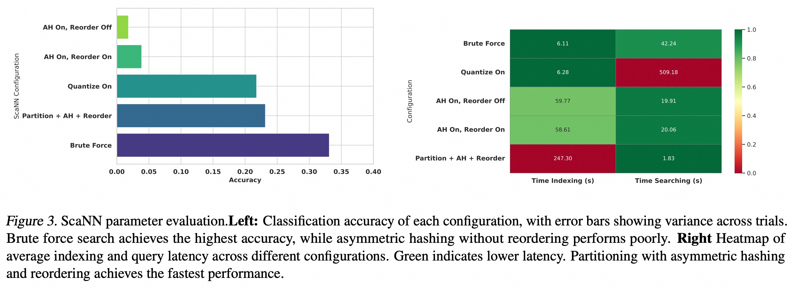

## AI论文解读 | Fast and Scalable Gene Embedding Search: A Comparative Study of FAISS and ScaNN
        
### 作者        
digoal        
        
### 日期        
2025-09-12       
        
### 标签        
PostgreSQL , PolarDB , DuckDB , AI , 论文解读        
        
----        
        
## 背景  
      
https://arxiv.org/pdf/2507.16978        
  
提示:          
```          
读懂《Fast and Scalable Gene Embedding Search: A Comparative Study of FAISS and ScaNN》这篇论文需要提前掌握哪些基础知识, 请使用中文通熟易懂的讲解这些基础知识, 可以引用论文中的图、表或使用Markdown支持的图形(text,mermaid等)增加解释性. 
  
使用中文通熟易懂的解读《Fast and Scalable Gene Embedding Search: A Comparative Study of FAISS and ScaNN》这篇论文, 其中的关键内容请着重讲解, 可以引用论文中的图、表或使用Markdown支持的图形(text,mermaid等)增加解释性. 
  
提取《Fast and Scalable Gene Embedding Search: A Comparative Study of FAISS and ScaNN》这篇论文中的重要术语, 使用中文对这些术语进行通熟易懂的讲解, 可以引用论文中的图、表或使用Markdown支持的图形(text,mermaid等)增加解释性. 
```     
  
## 1 前置知识 
  
好的，要读懂这篇名为《Fast and Scalable Gene Embedding Search: A Comparative Study of FAISS and ScaNN》的论文，你需要了解几个关键的基础概念，这些概念都与基因数据处理和机器学习有关。

这篇论文的核心是比较两种工具：FAISS 和 ScaNN，它们用于**基因嵌入**（gene embeddings）的**相似性搜索**（similarity search）。简单来说，就是将基因序列转换成数字向量，然后快速地找到与某个向量最相似的其他向量。

以下是几个你需要掌握的核心基础知识：

* **基因嵌入（Gene Embedding）：** 想象一下，一个DNA序列像是一长串由A、T、C、G组成的文字。传统的生物信息学方法，比如BLAST，是直接比较这些文字串的相似度，这个过程非常耗时且计算成本高 。而“基因嵌入”则是受到了自然语言处理（NLP）领域的启发。它使用像 **MetaBERTa** 这样的深度学习模型（类似于处理人类语言的GPT或BERT）来学习基因序列，并把它们压缩成一个**高维的向量**或“嵌入”（embedding）。在这个向量空间里，功能相似或结构相关的基因序列会位于彼此附近。这篇论文使用了 **MetaBERTa** 模型将DNA序列转换成一个 **1024 维的向量** 。

* **相似性搜索（Similarity Search）与近似最近邻（ANN）：** 找到了基因的向量表示后，下一步就是寻找数据库里与这个查询向量最相似的向量。最精确的方法是“**暴力搜索**”（Brute-force），也就是计算查询向量与数据库中所有其他向量的距离，然后排序找到最近的那个。但这在大型数据库中几乎不可行，因为它会非常慢 。因此，这篇论文引入了 **近似最近邻（Approximate Nearest Neighbor, ANN）** 的方法。ANN 不保证找到的向量是“最”近的，但它能在极短的时间内找到一个“足够近”的向量，这在许多应用中都是一个可接受的权衡 。FAISS 和 ScaNN 就是两种最先进的 ANN 库 。

* **FAISS与ScaNN：** 这两种工具都是用来实现快速相似性搜索的。
    * **FAISS** (Facebook AI Similarity Search) 支持多种索引结构，例如 **Flat Index**（扁平索引）、**IVF**（倒排文件索引）和 **PQ**（乘积量化）。
        * **Flat Index** 相当于前面提到的“暴力搜索”，虽然精确但速度慢 。
        * **IVF** 通过将向量分成多个簇来加速搜索。在查询时，它只在与查询向量最相关的几个簇中进行搜索，而不是整个数据库 。
        * **PQ** 是一种数据压缩技术，通过将向量分成小块（sub-vectors）并对每个小块进行量化来减少内存占用，从而加快距离计算 。
    * **ScaNN** (Scalable Nearest Neighbors) 是 Google 开发的，它也通过量化（如**非对称哈希**）和**分区**（partitioning）来加速搜索 。它还引入了 **Reordering**（重排序）步骤，以提高搜索结果的准确性 。

这篇论文的 **图2** 和 **图3** 详细比较了 FAISS 和 ScaNN 在不同配置下的性能，包括准确率、索引时间和搜索时间。

  

  

  
## 2 解读论文 
  
好的，我们来通俗易懂地解读一下这篇名为《快速可扩展的基因嵌入搜索：FAISS与ScaNN的比较研究》的论文。

这篇论文的核心思想是：随着基因测序数据的爆炸式增长，像BLAST这种传统的基因序列比对方法已经越来越“慢”了，处理海量数据时力不从心 。因此，研究人员们借鉴了自然语言处理（NLP）领域的先进思想，将基因序列（DNA片段）转换成一种叫做“嵌入”（Embedding）的数学形式（即向量），然后利用高效的向量搜索技术来快速查找相似的基因 。

这篇论文重点比较了两种业界领先的向量搜索库——由Facebook（Meta）开发的 **FAISS** 和由Google开发的 **ScaNN**，看看它们在处理基因嵌入数据时，谁更快、谁更准、谁更实用 。

### **核心步骤：从DNA序列到相似性搜索**

整个流程可以分为两步，如下图（根据原论文Figure 1简化）所示：


  

1.  **生成嵌入 (Generate Embedding)**：首先，使用一个预先训练好的、类似大型语言模型（LLM）的AI模型（论文中叫MetaBERTa-BigBird），将每一个DNA序列（比如一段400个碱基对的片段）转换成一个高维度的数字列表，也就是“向量”或“嵌入” 。这个向量浓缩了DNA序列的结构、功能和进化信息 。
2.  **索引与搜索 (Indexing and Searching)**：然后，将海量的基因向量存入数据库，并使用FAISS或ScaNN为这些向量建立索引。当有一个新的基因序列需要查询时，也先将它转换成向量，然后利用FAISS或ScaNN的索引，在数据库中快速找到与它最“近”（最相似）的K个向量 。

-----

### **两大主角：FAISS vs. ScaNN**

#### **FAISS (Facebook AI Similarity Search)**

FAISS 是一个功能非常强大的库，它提供了多种索引方法，让用户可以在**搜索速度**、**搜索精度**和**内存占用**之间找到最适合自己的平衡点 。论文对FAISS的多种配置进行了详细测试，关键发现如下（参考原论文Figure 2）：   

  * **追求最高精度**：使用 `PCAW64,Flat` 这种配置，精度最高，达到了 **36.2%** 。这种方法有点像“暴力搜索”，虽然准确，但当数据库非常大时，搜索速度可能不是最快的 。
  * **追求极致速度**：使用像 `OPQ32,IVF4096,PQ16` 这样的配置，搜索速度极快，但代价是精度会大幅下降（可能降至21%） 。这种方法通过一种叫“量化”（Quantization）的技术压缩向量，牺牲了信息来换取速度 。
  * **最佳平衡点**：论文发现，一个名为 `PCAWR64,IVF4096,Flat` 的配置在保持较高精度（32.7%）的同时，搜索速度比最高精度的配置快了大约**25倍**，是一个非常实用的选择 。

**FAISS配置性能权衡 (根据原论文Figure 2数据整理)**

| FAISS 配置类别 | 主要特点 | 准确率 | 索引时间 | 搜索时间 | 适用场景 |
| :--- | :--- | :--- | :--- | :--- | :--- |
| **Flat / PCA+Flat**  | 暴力搜索，精度高 | **最高 (约0.36)** | 快 (约8秒) | 中等 (约7.8秒) | 对准确率要求极高的任务 |
| **IVF+Flat**  | 分区搜索，精度较高 | 较高 (约0.35) | 较快 | **慢** (约97.4秒) | 精度要求高但对搜索延迟不敏感 |
| **IVF+PQ/OPQ**  | 压缩+分区，速度最快 | **最低 (约0.21)** | **极慢** (可超1200秒) | **最快** (可低至0.99秒) | 对搜索速度要求极高，可牺牲准确率 |

#### **ScaNN (Scalable Nearest Neighbors)**

ScaNN 是Google开发的库，它通过一些先进的量化技术和非对称距离计算来提升搜索效率 。论文对ScaNN的测试发现（参考原论文Figure 3）：   

  * **暴力搜索 (Brute Force)**：同样，ScaNN的暴力搜索能达到其最高的准确率（约33%），但查询延迟也很高（约42秒） 。
  * **加速策略**：ScaNN的核心加速技术是“非对称哈希”（Asymmetric Hashing, AH）。
      * 单独使用AH时，虽然速度提升，但准确率会急剧下降 。
      * 将 **分区 (Partitioning) + 非对称哈希 (AH) + 重新排序 (Reordering)** 这三种技术结合起来，ScaNN取得了最佳的平衡：查询速度非常快（约1.8秒），同时保持了可接受的准确率（约25%） 。

论文还通过SHAP分析发现一个有趣的现象：对于ScaNN，调整参数主要影响的是**运行时间**（索引和查询速度），而对**准确率**的影响非常小 。这意味着使用ScaNN时，你可以大胆地去优化速度，而不用太担心精度会因此大幅下降 。

-----

### **最终对决：FAISS vs. ScaNN vs. 传统方法**

论文将表现最好的FAISS和ScaNN配置，与传统的序列比对工具MMseqs2进行了最终比较。结果一目了然（参考原论文Table 1）：   

**性能总结对比表 (根据原论文Table 1数据)**

| 模型 | 准确率 (越高越好) | 索引时间 (越低越好) | 搜索时间 (越低越好) | 索引内存 (越低越好) |
| :--- | :--- | :--- | :--- | :--- |
| **FAISS (高精度版)**\* | **36.2%**  | 7.7 秒  | 7.7 秒  | 647.0 MB  |
| **FAISS (均衡版)†** | 32.7%  | 33.7 秒  | **0.3 秒**  | 647.0 MB  |
| **ScaNN (均衡版)** | 31.0%  | 240.9 秒  | 2.1 秒  | 646.9 MB  |
| **MMseqs2 (传统方法)** | 1.8%  | 5.8 秒  | 25.7 秒  | **99.5 MB**  |

*FAISS using PCA64, Flat   †FAISS using PCAWR64, IVF4096, Flat*

从上表可以得出几个关键结论：

1.  **嵌入方法完胜传统方法**：无论是FAISS还是ScaNN，在处理短基因片段（400bp）时，其准确率和搜索速度都远超传统的MMseqs2 。MMseqs2虽然内存占用小，但准确率极低，速度也很慢 。
2.  **FAISS综合表现更优**：FAISS在各项关键指标上都表现出色。它不仅能达到最高的准确率，而且通过适当配置，还能在保持高精度的同时实现比ScaNN快得多的搜索速度 。
3.  **FAISS在新颖性检测上更有潜力**：论文通过分析查询结果的距离分布（原论文Figure 5）发现，FAISS能更好地将“域内”（in-domain，已知的）和“域外”（out-of-domain，未知的、新颖的）序列区分开来，这对于发现新基因或新物种非常重要 。   

### **论文结论**

这篇论文通过全面的实验证明，对于大规模基因数据的相似性搜索任务，基于嵌入的向量搜索方法是一个非常有前途的方向 。在FAISS和ScaNN这两个顶尖工具的对决中，**FAISS在索引速度、查询延迟、检索准确率和新颖性检测方面都全面胜出** 。因此，研究人员推荐使用像FAISS这样的框架来构建未来可扩展的、具有生物学意义的基因组数据搜索系统。
  
## 3 术语 
  
好的，这是一篇关于利用现代机器学习方法进行基因数据分析的论文。为了更好地理解它，我们可以把论文中的一些关键术语提取出来，并用通俗易懂的中文进行解释。

**1. 基因嵌入 (Gene Embedding)**

  * **通俗解释:** 想象一下，我们把一段复杂的DNA序列，比如“ATTGCTA…”，看作是一句话。传统的生物学方法是逐字逐句地去比对这些话，看它们有多像，这个过程很慢。而**基因嵌入**就像是给这段话做了一个“总结”，把它转换成一个包含几百甚至上千个数字的**向量**（也就是一个长长的数字列表）。这个向量就代表了这段DNA序列的生物学特征。
  * **论文中的应用:** 这篇论文使用了 **MetaBERTa-BigBird** 模型将400个碱基对的DNA片段转换成一个1024维的向量 。这些向量可以捕捉到超越简单序列比对的结构、功能和进化模式 。

**2. 近似最近邻 (Approximate Nearest Neighbor, ANN)**

  * **通俗解释:** 找到基因嵌入向量后，我们面临一个问题：如何在一个包含成千上万甚至上亿个向量的数据库中，快速找到与我们查询的向量最相似的那个？直接与数据库中每个向量都计算一次距离（即**暴力搜索**），效率太低。**近似最近邻**就是一种聪明的“捷径”，它不保证找到的答案是百分之百最精确的，但它能在极短的时间内找到一个“足够好”的近似答案。
  * **论文中的应用:** 论文明确指出，随着DNA测序数据的爆炸式增长，传统的启发式方法难以有效扩展，因此迫切需要高效的计算方法来支持大规模的相似性搜索 。ANN方法提供了一个有前景的解决方案，但它们在生物学领域的应用仍未得到充分探索 。

**3. FAISS 和 ScaNN**

  * **通俗解释:** 这两个是论文重点比较的工具，它们都是实现 ANN 的开源库。

      * **FAISS (Facebook AI Similarity Search)**: 就像一个功能强大的工具箱，里面有很多不同的加速搜索的方法，可以根据需求自由组合。
      * **ScaNN (Scalable Nearest Neighbors)**: 则是谷歌开发的，它专注于通过一些特定的技术（如非对称量化）来提高搜索的准确性和速度。

  * **论文中的比较:** 论文的 **图2** 和 **图3** 直观地展示了它们的性能差异。

      * **FAISS** 的 **PCA-enhanced Flat** 索引（一种结合了降维和暴力搜索的方法）在准确性上表现最好 。但它也提供非常快的搜索选项，比如与 **IVF/PQ** 结合，虽然这会牺牲一些准确率，但能大大缩短查询时间 。
      * **ScaNN** 的 **分区+非对称哈希+重排序** 组合在速度上表现出色，实现了最快的查询延迟 。但它在准确性上略逊于 FAISS 的最佳配置 。

     

我们可以用一个简单的 Mermaid 图来总结 FAISS 和 ScaNN 的主要权衡：


**4. 索引 (Indexing)**

  * **通俗解释:** 索引就像图书馆的目录。我们不需要翻遍图书馆的每一本书来找一本特定的书，只需要先查目录，目录会告诉我们这本书在哪个区域、哪个书架。在向量搜索中，**索引**就是预先对数据库中的向量进行分类、压缩和组织的过程，以便在查询时能快速定位到可能相似的向量，而不是逐一比对。
  * **论文中的应用:** 论文详细探讨了 FAISS 和 ScaNN 中不同的索引策略 。例如，FAISS 的 **IVF (Inverted File Index)** 就像是将向量数据库分成了不同的“书架”，在查询时只搜索最相关的几个书架，从而大大加快了搜索速度 。

**5. 暴力搜索 (Brute-Force Search)**

  * **通俗解释:** 这种方法最简单直接，但效率最低。它就是把查询向量和数据库中的**所有**向量都进行距离计算，然后找出距离最近的那个。
  * **论文中的应用:** 论文将暴力搜索作为准确率的**上限**进行比较 。例如，ScaNN 的暴力搜索配置实现了最高的准确率（0.33） ，但查询延迟高达42秒 。这证明了为什么在实际应用中，我们需要转向更高效的近似搜索方法 。

-----

-----

### **表格总结 (Table 1)**

| 模型 | 准确率 (↑) | 时间 (s)  | 内存 (MB)  |
|:--- |:--- |:--- |:--- |
| | | 索引 | 搜索 | 索引 | 搜索 |
| **FAISS**\* | 0.362 | 7.7 | 8.0 | 647.0 | 56.0 |
| **FAISS†** | 0.327 | 33.7 | **0.3** | 647.0 | 56.0 |
| **ScaNN** | 0.310 | 240.9 | 2.1 | 646.9 | 55.8 |
| **MMseqs2** | 0.018 | 5.8 | 25.7 | 99.5 | 209.2 |

  * **FAISS**\*: 采用PCA64, Flat配置，追求最高准确率 。
  * **FAISS†**: 采用PCAWR64, IVF4096, Flat配置，追求速度与准确率的最佳平衡，搜索速度比最高准确率的配置快了25倍 。

  

**表格解读:**

  * **FAISS** 在准确率上领先，其最高准确率配置达到了 **0.362**，明显优于 ScaNN (0.310) 和 MMseqs2 (0.018) 。
  * **FAISS†** 展示了极快的搜索速度，仅需 **0.3秒**，比 ScaNN 的最佳速度 (2.1秒) 快了约7倍 。
  * **MMseqs2** 作为传统的比对工具，在处理这种短基因片段时，表现非常差，准确率仅为 **0.018**，并且搜索速度也相对较慢 。这突出显示了基于嵌入的方法在处理大规模基因组数据时的显著优势 。

**总结:** 论文的结论是，FAISS 在索引速度、查询延迟、检索准确性和新颖性检测方面都持续优于 ScaNN 。尽管 ScaNN 在某些配置下提供了更快的推理速度，但其整体准确性受到限制 。总的来说，基于嵌入的检索框架（如 FAISS）是处理大规模基因组数据、实现可扩展和有生物学意义的相似性搜索的理想选择 。

-----

这篇论文的解读涵盖了核心概念、工具比较和关键发现。为了进一步深入理解，你最感兴趣的是哪一点？是想了解FAISS和ScaNN中不同索引配置的具体工作原理，还是想探讨这些工具在未来的生物信息学研究中可能有哪些应用？
  
## 参考        
         
https://arxiv.org/pdf/2507.16978    
        
<b> 以上内容基于DeepSeek、Qwen、Gemini及诸多AI生成, 轻微人工调整, 感谢杭州深度求索人工智能、阿里云、Google等公司. </b>        
        
<b> AI 生成的内容请自行辨别正确性, 当然也多了些许踩坑的乐趣, 毕竟冒险是每个男人的天性.  </b>        
    
#### [期望 PostgreSQL|开源PolarDB 增加什么功能?](https://github.com/digoal/blog/issues/76 "269ac3d1c492e938c0191101c7238216")
  
  
#### [PolarDB 开源数据库](https://openpolardb.com/home "57258f76c37864c6e6d23383d05714ea")
  
  
#### [PolarDB 学习图谱](https://www.aliyun.com/database/openpolardb/activity "8642f60e04ed0c814bf9cb9677976bd4")
  
  
#### [PostgreSQL 解决方案集合](../201706/20170601_02.md "40cff096e9ed7122c512b35d8561d9c8")
  
  
#### [德哥 / digoal's Github - 公益是一辈子的事.](https://github.com/digoal/blog/blob/master/README.md "22709685feb7cab07d30f30387f0a9ae")
  
  
#### [About 德哥](https://github.com/digoal/blog/blob/master/me/readme.md "a37735981e7704886ffd590565582dd0")
  
  

  
