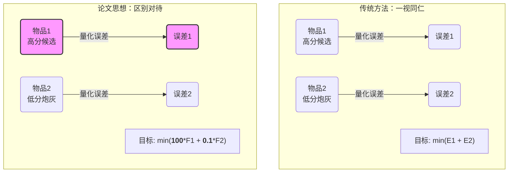
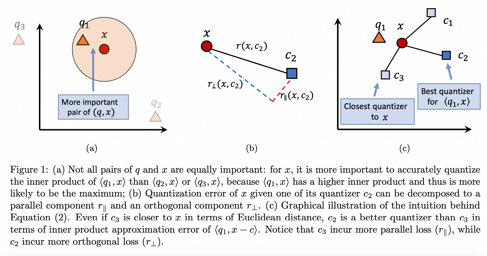
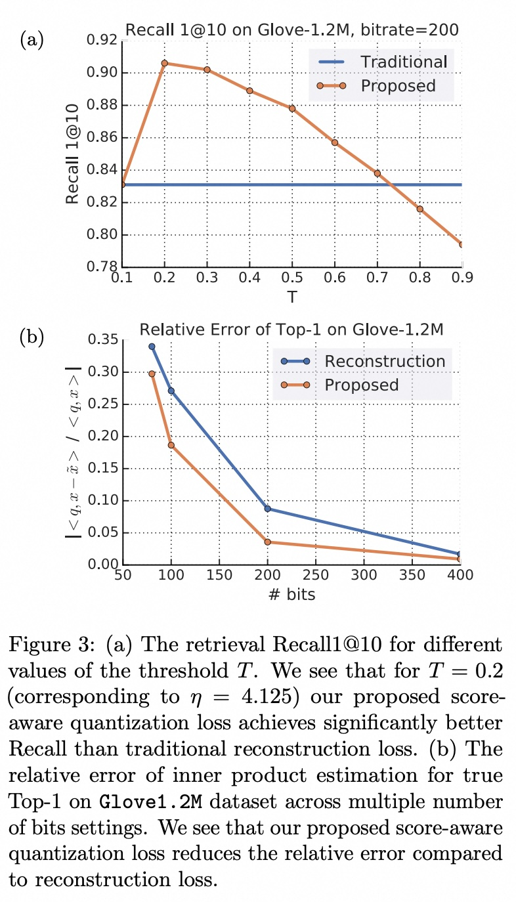
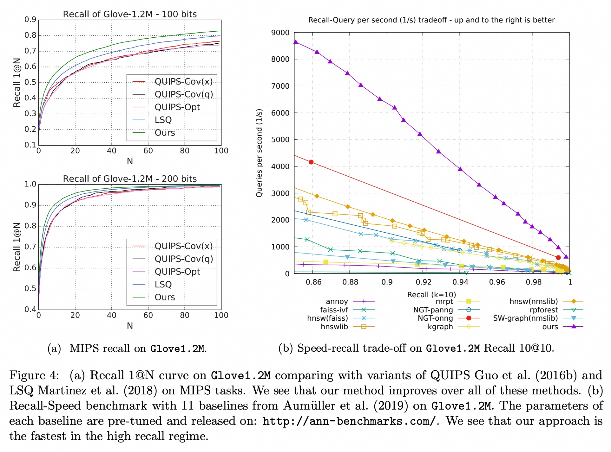

## AI论文解读 | Accelerating Large-Scale Inference with Anisotropic Vector Quantization
        
### 作者        
digoal        
        
### 日期        
2025-09-12       
        
### 标签        
PostgreSQL , PolarDB , DuckDB , AI , 论文解读        
        
----        
        
## 背景  
      
https://arxiv.org/pdf/1908.10396        
  
提示:          
```          
读懂《Accelerating Large-Scale Inference with Anisotropic Vector Quantization》这篇论文需要提前掌握哪些基础知识, 请使用中文通熟易懂的讲解这些基础知识, 可以引用论文中的图、表或使用Markdown支持的图形(text,mermaid等)增加解释性. 
  
使用中文通熟易懂的解读《Accelerating Large-Scale Inference with Anisotropic Vector Quantization》这篇论文, 其中的关键内容请着重讲解, 可以引用论文中的图、表或使用Markdown支持的图形(text,mermaid等)增加解释性. 
  
提取《Accelerating Large-Scale Inference with Anisotropic Vector Quantization》这篇论文中的重要术语, 使用中文对这些术语进行通熟易懂的讲解, 可以引用论文中的图、表或使用Markdown支持的图形(text,mermaid等)增加解释性. 
```     
  
## 1 前置知识 
  
要读懂《Accelerating Large-Scale Inference with Anisotropic Vector Quantization》这篇论文，您需要先掌握几个核心概念。这篇论文的核心在于，它提出了一种更适合大规模相似性搜索的向量量化方法，而这种方法与传统的量化方法不同，它有意识地放大了“重要”数据点的量化误差权重。

下面我将以通俗易懂的方式为您讲解这些基础知识：

### 1\. 最大内积搜索（MIPS）

这是论文要解决的核心问题。

  * **概念**: 简单来说，内积（或称点积）是衡量两个向量（比如用户查询向量和商品向量）相似度的常用指标。内积值越大，表示两个向量的方向越接近，相似度越高。最大内积搜索就是要在一个庞大的数据库中，找到与您输入的查询向量内积最大的那个数据向量 。
  * **应用场景**: 比如在推荐系统中，我们把用户和商品都表示成向量，找到与用户向量内积最大的商品向量，就是找到了用户最可能喜欢的商品 。

### 2\. 向量量化 (Vector Quantization)

当数据库中的向量数量非常庞大时，逐一计算内积会非常耗时。向量量化就是为了解决这个问题而生。

  * **概念**: 向量量化是一种数据压缩技术。它不是存储原始的、高维的向量，而是用一个“代表性向量”（称为**码字**或**聚类中心**）来代替它。这个过程类似于聚类，比如K-均值聚类（k-means），就是找到一组“代表性”的码字，然后将每个数据向量分配给离它最近的那个码字 。
  * **为什么有效**: 量化后，我们只需要存储每个数据点所对应的码字索引，这大大减少了存储空间。在搜索时，我们先计算查询向量与所有码字的内积，然后通过查表的方式快速得到每个数据点的近似内积值，从而避免了大量的原始内积计算 。

### 3\. 传统量化方法的不足

传统向量量化的目标通常是最小化**重构误差（Reconstruction Error）** 。重构误差是原始向量与其量化后向量之间的欧氏距离。

论文指出，这种方法对MIPS任务来说是次优的 。为什么呢？因为对于MIPS来说，只有那些内积值较高的点（即与查询向量相似度高的点）的量化误差才重要，而那些内积值很低的点，无论其量化误差多大，都不会影响最终的搜索结果 。

### 4\. 论文核心：各向异性量化（Anisotropic Vector Quantization）

这篇论文的核心思想是提出一种新的、**“与得分相关”的量化损失函数**（score-aware quantization loss），这种函数可以引导量化过程更加关注那些重要的误差。

  * **“各向异性”的概念**: 意思是“依赖于方向”。论文认为，一个数据向量的量化误差可以分解成两个部分：与数据向量方向**平行**的分量，和与数据向量方向**正交**（垂直）的分量 。

    如下图所示，误差向量 `r` 可以被分解为平行分量 `r_||` 和正交分量 `r_⊥`。

    ```mermaid
    graph LR
        A["x (原始数据点)"]
        B["~x (量化后的码字)"]
        C["r (误差向量)"]
        D["r_|| (平行分量)"]
        E["r_⊥ (正交分量)"]
        A -->|指向| C
        C --> D
        C --> E
        
        subgraph 误差分解
        direction LR
        D
        E
        end
        style A fill:#f9f,stroke:#333,stroke-width:2px
        style B fill:#f9f,stroke:#333,stroke-width:2px
        style C fill:#9cf,stroke:#333,stroke-width:2px
        style D fill:#9cf,stroke:#333,stroke-width:2px
        style E fill:#9cf,stroke:#333,stroke-width:2px
        linkStyle 0 stroke:#000,stroke-width:2px
        linkStyle 1 stroke:#000,stroke-width:2px
        linkStyle 2 stroke:#000,stroke-width:2px
    ```

  * **为什么平行分量更重要**: 论文的关键发现是，与数据向量平行的量化误差分量对最终的内积得分影响更大 。举例来说，如下图所示，`q1` 是查询向量，`x` 是数据点。`c2` 和 `c3` 是两个候选码字。虽然从欧氏距离看，`c3` 比 `c2` 离 `x` 更近，但 `c2` 在与 `x` 平行的方向上的误差更小，而`c3`的平行误差更大。因此，对于与 `q1` 内积很高的 `x` 来说，用 `c2` 来近似 `x`，得到的内积误差更小 。

  * **解决方案**: 论文提出的“各向异性量化”方法，就是通过一种新的损失函数，给平行误差分量赋予更高的权重，从而在量化过程中优先减小这一部分的误差 。

### 总结

简单来说，要理解这篇论文，您需要先知道：

1.  **MIPS**: 在海量数据中寻找最相似的向量，核心是通过内积来衡量相似度。
2.  **向量量化**: 一种通过压缩数据来加速搜索的有效方法。
3.  **传统量化**: 追求最小化所有数据点的重构误差，但对MIPS任务来说，这并不是最佳策略。
4.  **论文贡献**: 提出了一种“各向异性”的量化方法，通过给平行于数据点的误差分量更高的权重，更精准地近似那些对最终结果影响大的向量，从而显著提升了MIPS的性能 。

-----

如果您对论文中提到的**产品量化 (Product Quantization)** 或 **如何使用 Lloyd 算法来解决各向异性向量量化问题**感兴趣，我可以为您提供更详细的解释。
  
## 2 解读论文 
  
好的，我们来通俗易懂地解读一下这篇在业界非常有影响力的论文《Accelerating Large-Scale Inference with Anisotropic Vector Quantization》。

简单来说，这篇论文解决了一个核心问题：**如何在海量数据中（比如数十亿个商品或视频）为一个用户（查询）快速、准确地找到他最感兴趣的几个东西？**

-----

### 1\. 背景：最大内积搜索 (MIPS) 是什么？

在现代的推荐系统、搜索引擎或大规模分类任务中，系统通常会把用户和物品（如商品、新闻、视频）都转换成数学上的“向量”。这些向量包含了它们的特征。

  * **一个关键假设是**：如果一个用户的向量和一个物品的向量“方向”越接近，夹角越小，那么它们的**内积 (inner product)** 就越大，代表用户对这个物品越感兴趣。

因此，推荐问题就转化成了一个数学问题：给定一个查询向量 $q$ (代表用户)，从数据库 $X$ (代表所有物品) 中，找到那个能使内积 $\\langle q, x \\i \\rangle$ 最大的向量 $x\_i$。这个问题就叫做**最大内积搜索 (Maximum Inner Product Search, MIPS)** 。

当数据库有数百万甚至数十亿个物品时，挨个计算内积是极其耗时的，线上服务根本无法承受 。因此，学术界和工业界都在研究如何为 MIPS 加速。

### 2\. 传统加速方法及其“痛点”

一个主流的加速技术叫做**量化 (Quantization)**。它的思想类似“数据压缩”，用一个更短、更简单的“码字 (codeword)”来近似表示原始的、复杂的向量。这样不仅能节省存储空间，还能通过预计算等方式极大加速内积计算 。

传统的量化方法，其核心目标是最小化**重建误差 (Reconstruction Error)** 。也就是说，它希望量化后的向量 $\\tilde{x}$ 与原始向量 $x$ 的欧氏距离（$||x - \\tilde{x}||^2$）尽可能小。

**然而，这篇论文敏锐地指出了这种传统方法的“痛点”**：

> 对于 MIPS 任务，我们只关心谁是“冠军”（内积最大），谁是“亚军”。至于那些排名第10万、第100万的物品，它们的内积被算得准不准确，我们根本不关心。而最小化重建误差的策略，是对所有物品“一视同仁”，平等地对待每个物品的量化误差，这显然是次优的 。

我们可以用下图来直观理解：



传统方法希望总误差最小，但论文认为，我们应该给高分候选的误差赋予极高的权重，而低分炮灰的误差则可以容忍。

### 3\. 论文的核心创新：分数感知的“各向异性”量化

基于上述洞察，作者提出了一种全新的损失函数，叫做**分数感知量化损失 (score-aware quantization loss)** 。

这个新的损失函数在计算误差时，会根据原始内积分数 $\\langle q, x\_i \\rangle$ 的高低进行加权。分数越高的组合，其量化误差的惩罚就越重 。

这个聪明的想法带来了一个非常深刻且重要的数学结果，作者称之为**各向异性 (Anisotropic) 量化** 。

让我们来看论文中的 `Figure 1` 来理解这个关键概念。    

  * **图 (a)** 直观展示了论文的核心思想：对于物品 $x$ 而言，查询 $q\_1$ 和它的内积很大（很可能是个高分结果），所以我们必须精确计算 $\\langle q\_1, x \\rangle$。而 $q\_2, q\_3$ 的内积很小，算得粗糙一点也无所谓 。
  * **图 (b) 和 (c)** 是“各向异性”的关键。量化产生的误差向量 $r(x, c\_2)$（从原始点 $x$ 指向量化中心 $c\_2$ 的向量），可以被分解为两个部分：
    1.  **平行误差 ($r\_{||}$)**：与原始向量 $x$ 方向平行（或反向）的误差分量 。**这个分量会直接改变内积的大小，对最终的排名影响巨大**。
    2.  **正交误差 ($r\_{\\perp}$)**：与原始向量 $x$ 方向垂直的误差分量 。**这个分量对内积大小的影响则小得多**，尤其是当查询 $q$ 和 $x$ 本身就很相似时。
  * **论文的结论是**：他们提出的“分数感知损失函数”，最终会自动地、更严厉地惩罚**平行误差**，而对**正交误差**则更加宽容 。这种不平等的惩罚，就是所谓的“各向异性”。

### 4\. 算法实现与实验效果

作者将这种新的“各向异性”损失函数应用到了经典的向量量化 (VQ) 和乘积量化 (PQ) 算法中，并设计了一套新的迭代优化算法来学习最优的量化“码本” 。

实验结果非常惊艳，证明了该方法的巨大优势： 

1.  **更高的召回率 (Recall)**：如下 `Figure 3 (a)` 所示，在给定相同的压缩率（比特数）下，新提出的方法（红线）相比传统方法（蓝线），能更准确地找到真正的Top-1结果，召回率显著提升 。   

2.  **更准的内积估计**：如上 `Figure 3 (b)` 所示，新方法对最高分物品的内积估算误差（Relative Error）也远低于传统方法 。这在一些需要精确分值的场景（如Softmax计算）中至关重要。

3.  **业界顶尖的性能**：作者将此方法开源实现为名为 `ScaNN` 的库。在公开的 `ann-benchmarks.com` 基准测试中，如下图 `Figure 4 (b)` 所示，ScaNN 在“速度-召回率”的综合性能上，超越了包括 Faiss 在内的众多顶级算法，尤其是在业界非常看重的高召回率区域，性能优势明显 。    

-----

### 总结

这篇论文的贡献可以概括为：

1.  **指出了根本问题**：为 MIPS 任务设计的量化算法，不应该以最小化“重建误差”为目标。
2.  **提出了创新方案**：设计了“分数感知”的损失函数，它自然地导出了对排名影响更大的“平行误差”施加更重惩罚的“各向异性”量化方案。
3.  **取得了卓越成果**：将该理论应用于实践，实现了在速度和精度上都达到业界顶尖水平的 MIPS 算法，并在实际应用中取得了巨大成功。
  
## 3 术语 
  
在《Accelerating Large-Scale Inference with Anisotropic Vector Quantization》这篇论文中，有几个非常重要的核心术语。理解了它们，你就能抓住整篇论文的精髓。

下面我将为您详细讲解这些术语：

---

### 最大内积搜索（MIPS）
* **英文**: Maximum Inner Product Search
* **通俗解释**: 想象你在一个巨大的仓库里寻找最匹配的商品。这个仓库里的每件商品和你的购物清单都可以用一个“向量”来表示。**内积**就是衡量你的清单和每件商品有多“匹配”的分数。MIPS的目标就是在这个仓库里，快速找到那个内积分数最高的商品。
* **核心**: 论文要解决的就是如何高效地完成这个“找最高分”的任务。

---

### 向量量化（Vector Quantization, VQ）
* **英文**: Vector Quantization
* **通俗解释**: 当你的仓库太大，一件件比对商品太慢时，向量量化就是一种“捷径”。它通过聚类的方式，将所有商品分成很多小组。每个小组都有一个**代表**，这个代表就是**码字（Codeword）**。在搜索时，你只需要比较你的清单和每个小组代表的匹配度，而不是和仓库里所有的商品都进行比对。这样就大大减少了计算量。
* **与论文的关系**: 论文在传统的向量量化基础上进行了改进，使其更适合MIPS任务。

---

### 各向异性向量量化（Anisotropic Vector Quantization）
* **英文**: Anisotropic Vector Quantization
* **通俗解释**: 这是一个非常形象的术语。**各向异性**是指在不同方向上表现出不同的特性。传统的向量量化追求的是在所有方向上都尽可能减小误差，但论文发现，对于MIPS来说，某些方向的误差比其他方向的误差更重要。

* **误差分解**: 论文将向量量化产生的误差分为两个部分：
    * **平行分量（Parallel Component）**: 误差向量中与原始数据点方向平行的那一部分。
    * **正交分量（Orthogonal Component）**: 误差向量中与原始数据点方向垂直的那一部分。
* **核心思想**: 论文发现，平行分量对最终的内积搜索结果影响更大。因此，论文提出的各向异性量化方法，就是有意识地在量化时，更严格地惩罚平行分量上的误差，而对正交分量则没那么在意。这种 **“区别对待”**，让量化后的向量更精准地反映出原始向量的内积特性，从而提升了搜索准确性。

---

### 重构误差（Reconstruction Error）
* **英文**: Reconstruction Error
* **通俗解释**: 向量量化后，我们用一个“码字”来代替原始向量，这个码字和原始向量之间是存在差异的。这个差异就是重构误差。
* **与论文的关系**: 传统的量化方法是以最小化重构误差为目标。但论文指出，对于MIPS任务来说，最小化重构误差并不能保证搜索的准确性。论文转而追求最小化与最终内积得分相关的误差，也就是 **“得分感知量化损失（Score-aware quantization loss）”**，这才是这篇论文的核心创新点。

---
如果您对论文中提到的**乘积量化 (Product Quantization)** 或 **如何使用 Lloyd 算法来解决各向异性向量量化问题**感兴趣，我可以为您提供更详细的解释。
  
## 参考        
         
https://arxiv.org/pdf/1908.10396    
        
<b> 以上内容基于DeepSeek、Qwen、Gemini及诸多AI生成, 轻微人工调整, 感谢杭州深度求索人工智能、阿里云、Google等公司. </b>        
        
<b> AI 生成的内容请自行辨别正确性, 当然也多了些许踩坑的乐趣, 毕竟冒险是每个男人的天性.  </b>        
    
#### [期望 PostgreSQL|开源PolarDB 增加什么功能?](https://github.com/digoal/blog/issues/76 "269ac3d1c492e938c0191101c7238216")
  
  
#### [PolarDB 开源数据库](https://openpolardb.com/home "57258f76c37864c6e6d23383d05714ea")
  
  
#### [PolarDB 学习图谱](https://www.aliyun.com/database/openpolardb/activity "8642f60e04ed0c814bf9cb9677976bd4")
  
  
#### [PostgreSQL 解决方案集合](../201706/20170601_02.md "40cff096e9ed7122c512b35d8561d9c8")
  
  
#### [德哥 / digoal's Github - 公益是一辈子的事.](https://github.com/digoal/blog/blob/master/README.md "22709685feb7cab07d30f30387f0a9ae")
  
  
#### [About 德哥](https://github.com/digoal/blog/blob/master/me/readme.md "a37735981e7704886ffd590565582dd0")
  
  

  
