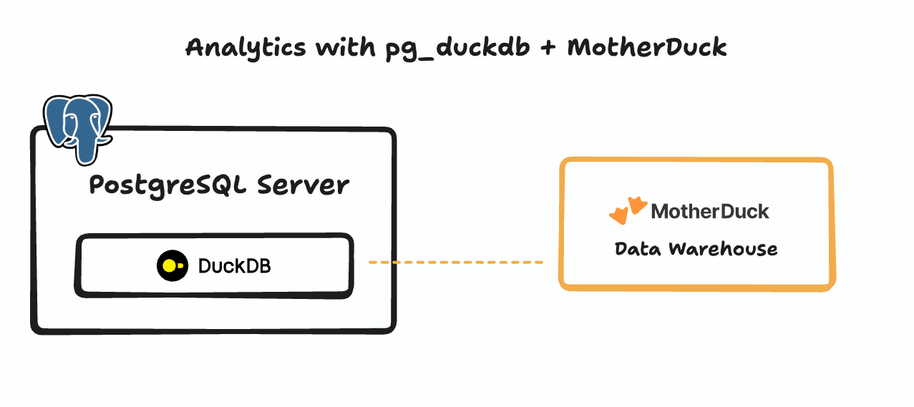

## pg_duckdb 1.0.0 正式发布, 有哪些重大更新?  
                                                                                                        
### 作者                                                                            
digoal                                                                            
                                                                                   
### 日期                                                                                 
2025-09-12                                                                           
                                                                                
### 标签                                                                              
PostgreSQL , PolarDB , DuckDB , pg_duckdb , 分析能力 , 数据湖能力 , 插件化能力      
                                                                                                       
----                                                                                
                                                                                              
## 背景     
pg_duckdb是MotherDuck开源出来的PostgreSQL插件, 该插件旨在  
- 利用DuckDB的向量化执行引擎提升PG的复杂查询性能,   
- 利用DuckDB的远程数据访问能力(motherduck, oss, parquet ...)为PG提供数据湖的能力.   
- 利用DuckDB的插件化的能力(虽然PG也有很多插件), DuckDB插件也非常丰富, 与PG有互补.    
  
如今pg_duckdb已正式发布1.0.0, 意味着该插件已具备生产级稳定性.   
  
下面来看一下pg_duckdb 1.0.0有哪些更新  
  
1、支持并行获取PostgreSQL数据, 类似duckdb postgres_scanner插件的并行扫描. 根据ctid block范围, 开启多个线程同时读取postgresql单表的数据. 详见: [《duckdb postgres_scan 插件 - 不落地数据, 加速PostgreSQL数据分析》](../202210/20221001_02.md)    
```  
Benchmark query: select * from lineitem order by 1 limit 1  
Other GUC setups: duckdb.max_workers_per_postgres_scan = 2  
```  
  
Threads (duckdb.threads_for_postgres_scan)	| Costs (seconds)  
---|---  
1	|15.8  
2	|8.7  
4	|5.8  
  
2、新增类型支持 ` DOMAIN, VARINT, TIME, TIMETZ, BIT, VARBIT, UNION, MAP, STRUCT `.  
  
3、pg_duckdb 支持安装DuckDB社区插件, 这个就牛逼了, 不仅仅是简单的提升PG分析性能, 还能利用pg_duckdb的插件.   
  
https://duckdb.org/community_extensions/list_of_extensions  
  
4、支持 Postgres 18  
  
注意以上仅挑选了部分重点特性, 详细请详见  
- https://github.com/duckdb/pg_duckdb/releases/tag/v1.0.0  
  
下面看一下motherduck的官方blog介绍, 翻译自: https://motherduck.com/blog/pg-duckdb-release/  
  
# pg_duckdb 1.0 版本发布  
  
我们很高兴地宣布 pg_duckdb 1.0 版本的发布。这是一个开源的 PostgreSQL 扩展，它将 DuckDB 的向量化分析引擎(利用cpu的批量处理指令, 例如simd)直接引入到 PostgreSQL 中。您可以将其视为为您的 PostgreSQL 数据库添加了一个涡轮引擎，使其能够运行高效的临时查询，同时 PostgreSQL 仍能继续执行其最擅长的工作：为您的生产应用处理事务性工作负载。  
  
Pg_duckdb 将 DuckDB 实例直接嵌入到您现有的 PostgreSQL 进程中。虽然 pg_duckdb 不会将您的 PostgreSQL 数据库变成一个功能齐全的数据仓库，但它为 PostgreSQL 用户提供了一条快速分析查询的途径。  
  
1.0 版增强了 MotherDuck 集成，支持更多数据类型，稳定性更高，性能改进（包括并行表扫描）—— 请阅读完整的 pg_duckdb 发行说明，了解所有详细信息。  
  
让我们深入了解性能用例。  
  
## 大象模式下的 DuckDB 速度  
首先，我们来看看 pg_duckdb 的性能。一如既往，性能很大程度上取决于您的工作负载。简而言之，pg_duckdb 最能体现其性能的查询是那些无法高效利用索引的查询。某些单独使用 PostgreSQL 时会超时的查询，现在使用 pg_duckdb 也能做到！  
  
我们运行了类似 TPCH 的基准测试套件，以两种方式测试了 pg_duckdb：创建所有 PostgreSQL 索引，以及与仅包含主键的 PostgreSQL 进行比较。与包含所有索引的 PostgreSQL 相比，速度提升幅度不错，但并不惊人 —— 最多只快了约 <b>4 倍</b>。但与仅包含主键的 PostgreSQL 引擎相比，pg_duckdb 的速度要快得多。在 PostgreSQL 上，</b>原本在 10 分钟内超时的查询，现在使用 pg_duckdb 可以在 10 秒内完成！</b>   
  
有关基准设置的更多详细信息，请参阅 pg_duckdb repo。  
  
https://github.com/duckdb/pg_duckdb/blob/main/scripts/tpch/README.md#results  
  
## 使用DuckDB 进行 PostgreSQL 分析  
传统上，在 PostgreSQL 中扩展分析工作负载意味着维护一组数据副本。每个数据副本从主实例 WAL 接收数据并应用更改，同时保持对分析查询的可用性。向数据副本添加索引可以提高分析查询的性能(某些情况)，但问题在于：必须在主实例上维护索引才能在副本上进行读取。更新索引会导致维护主数据库的团队和使用副本进行分析工作负载的团队之间不断协商(也就是OLTP和OLAP不可兼得)。  
  
值得庆幸的是，pg_duckdb 扩展添加了 DuckDB，它可以直接从 PostgreSQL 存储格式读取数据集并快速返回，而无需将其复制到其他存储格式或添加索引。如果使用得当，这可以大幅加速查询，在某些情况下最高可达 1000 倍（如果已存在索引，则速度提升会更低）。  
  
需要注意的是，当直接使用 pg_duckdb 查询 PostgreSQL 表时，您仍然在使用 PostgreSQL 的行式存储 —— 您无法获得 DuckDB 的列式存储优势或压缩优势。性能提升源于 DuckDB 的向量化执行引擎，该引擎针对分析工作负载进行了优化，即使在处理行式数据时也是如此。  
  
你已经是 PostgreSQL 专家了？你可以直接使用 Docker 镜像运行 pg_duckdb：  
```  
docker run -d -e POSTGRES_PASSWORD=duckdb pgduckdb/pgduckdb:16-main  
```  
  
然后，直接查询 PostgreSQL 表 - 或者查询外部 Parquet 文件，例如包含 Netflix 前 10 个节目数据的开放数据集：  
```  
-- Use DuckDB engine to query a Postgres table directly    
SET duckdb.force_execution = true; SELECT count(*) FROM your_pg_table WHERE status = 'active';  
  
  
-- Use DuckDB engine to query an external Parquet file accessible from the PG server    
SELECT COUNT(*) FROM read_parquet('s3://us-prd-motherduck-open-datasets/netflix/netflix_daily_top_10.parquet');  
```  
  
请记住：PostgreSQL 要求主服务器和副本服务器上的扩展程序完全相同，因此主服务器上也必须安装 pg_duckdb 扩展程序。由于 DuckDB 可能非常耗费资源，因此您需要采取控制措施，以防止在主服务器上使用。此外，每个与 PostgreSQL 的连接都会拥有自己的 DuckDB 实例 —— 应适当配置 DuckDB 的资源限制，使其与副本服务器的大小相匹配。  
  
## 把 PostgreSQL 变成数据湖引擎  
由于 DuckDB 对数据湖有着出色的抽象 —— 一个跨云提供商和文件格式的统一 SQL 接口 —— 我们也可以使用 pg_duckdb 将其扩展到 PostgreSQL。此扩展为 PostgreSQL 带来了强大的功能：安全访问云存储（S3、GCP、Azure）、直接查询各种格式（CSV、JSON、Parquet、Iceberg、Delta）的远程文件，以及一个使用熟悉的 PostgreSQL SQL 为 BI 工具和应用程序提供服务的分析引擎。  
  
结果是“数据库内 ETL” —— 您现在可以直接在 SQL 查询中处理传统上需要外部工具的数据转换。  
  
这种架构实现了极其强大的功能：只需一个查询即可将 PostgreSQL 数据与远程数据湖文件连接起来。例如，您可以使用 S3 上存储的 100 亿行 Parquet 文件中的用户行为数据来丰富本地客户表——只需一个 SQL 查询即可完成。  
```  
-- enrich customers table with event data from S3  
  
SELECT   
   date_trunc('month', c.signup_date) as signup_month,  
   avg(b['page_views']) as avg_page_views,  
   avg(b['session_duration']) as avg_session_duration,  
   count(*) as customer_count  
FROM customers c   
JOIN read_parquet('s3://data-lake/user_behavior_10b_rows.parquet') b ON c.customer_id = b['customer_id']  
WHERE b['last_active'] >= '2024-01-01'  
GROUP BY date_trunc('month', c.signup_date)  
ORDER BY signup_month;  
```  
  
## MotherDuck 的 serverless 分析能力  
虽然 PostgreSQL 可以通过 pg_duckdb 受益于 DuckDB 的分析能力，但它的架构并非专为处理大型分析查询带来的峰值工作负载而设计。pg_duckdb 扩展提供了 MotherDuck 集成，通过将高要求的分析任务转移到无服务器云计算来解决此问题，允许用户使用熟悉的 SQL 操作（例如`CREATE TABLE AS`语句或增量`INSERT`）将 PostgreSQL 数据传输到 MotherDuck。  
  
这种混合方法具有诸多优势。MotherDuck 可以利用与云存储的连接来加快数据湖读取速度，并且用户可以灵活地进行数据交互——他们可以直接连接到 MotherDuck 进行复杂的 DuckDB 分析，或者继续使用 PostgreSQL 进行熟悉的操作查询。  
  
与将数据存储在常规 PostgreSQL 表中相比，MotherDuck 中的数据分析查询速度也将更快，因为 DuckDB 引擎受益于 MotherDuck 使用的列式存储。最后，该架构支持通过只读副本进行扩展，这些副本会自动扩展到一组 Duckling（MotherDuck 计算实例），这意味着当分析工作负载激增时，小型、始终在线的 PostgreSQL 副本可以立即获得强大的无服务器计算能力。  
  
  
  
图表显示了使用 PostgreSQL 和 MotherDuck 进行的分析。  
  
权衡在于网络延迟与处理能力。虽然仅将数据存储在 PostgreSQL 中可以最大限度地减少数据移动，但将频繁访问的数据复制到 MotherDuck 可以通过将计算和存储保持在云端共置来减少分析查询的网络瓶颈。  
  
## 参考  
https://github.com/duckdb/pg_duckdb/releases/tag/v1.0.0  
  
https://motherduck.com/blog/pg-duckdb-release/  
  
[《duckdb postgres_scan 插件 - 不落地数据, 加速PostgreSQL数据分析》](../202210/20221001_02.md)    
  
https://duckdb.org/community_extensions/list_of_extensions  
  
[《既生瑜何生亮 | 有了 pg_duckdb/pg_mooncake 为什么还要 pg_parquet》](../202508/20250829_09.md)    
  
[《穷鬼玩PolarDB RAC一写多读集群系列 | 接入pg_duckdb & pgmooncake支持数据湖功能,且OLAP性能数量级提升》](../202412/20241231_02.md)    
  
[《PolarDB PG 15 编译安装 & pg_duckdb 插件 + OSS 试用》](../202411/20241111_01.md)    
  
[《Tom lane遭“报复”: CrunchyData遇最强开源对手pg_duckdb》](../202408/20240822_01.md)    
  
      
#### [期望 PostgreSQL|开源PolarDB 增加什么功能?](https://github.com/digoal/blog/issues/76 "269ac3d1c492e938c0191101c7238216")
  
  
#### [PolarDB 开源数据库](https://openpolardb.com/home "57258f76c37864c6e6d23383d05714ea")
  
  
#### [PolarDB 学习图谱](https://www.aliyun.com/database/openpolardb/activity "8642f60e04ed0c814bf9cb9677976bd4")
  
  
#### [PostgreSQL 解决方案集合](../201706/20170601_02.md "40cff096e9ed7122c512b35d8561d9c8")
  
  
#### [德哥 / digoal's Github - 公益是一辈子的事.](https://github.com/digoal/blog/blob/master/README.md "22709685feb7cab07d30f30387f0a9ae")
  
  
#### [About 德哥](https://github.com/digoal/blog/blob/master/me/readme.md "a37735981e7704886ffd590565582dd0")
  
  

  
