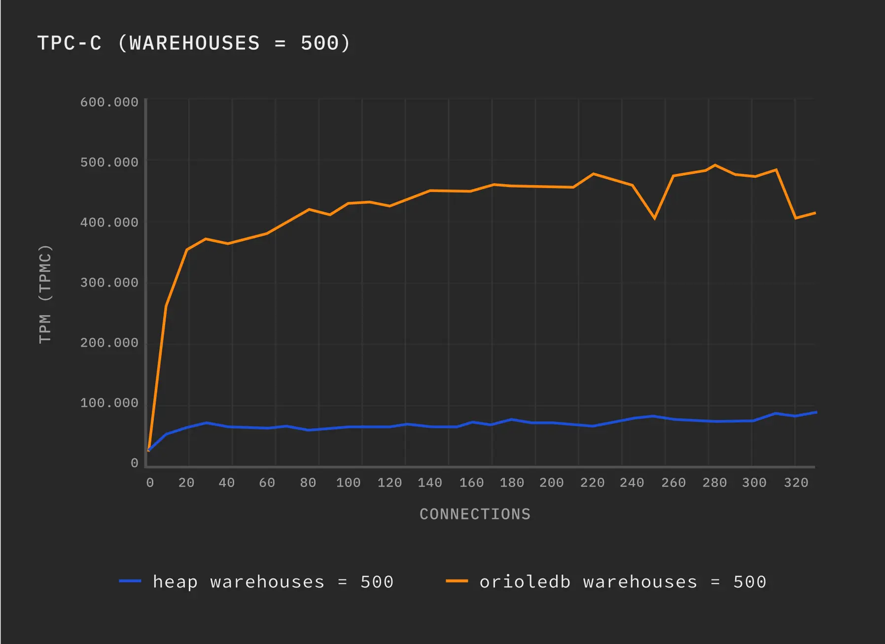

## Supabase 拿到专利权并宣布: OrioleDB 真正 Free 了     
                                                                                                              
### 作者                                                                                  
digoal                                                                                  
                                                                                         
### 日期                                                                                       
2025-09-12                                                                                 
                                                                                      
### 标签                                                                                    
PostgreSQL , PolarDB , DuckDB , OrioleDB , 专利权 , UNDO , 存储引擎 , table access method    
                                                                                                             
----                                                                                      
                                                                                                    
## 背景        
OrioleDB 是一款基于UNDO回滚段管理多版本的PostgreSQL表存储引擎插件, 解决了HEAP表MVCC管理带来的各种问题(管理不当将导致: I/O放大, 碎片, shared buffer放大, 性能下降, 膨胀等问题).    
    
不过使用 OrioleDB 要给PostgreSQL打patch, 原因是OrioleDB 拓展了 table access method 接口, 就像要按照babelfish插件加了wire protocol钩子(sql server协议兼容插件)需要给PostgreSQL打patch一样.     
    
今天, Supabase 宣布拿到了专利权, 终于可大搞OrioleDB了, 并且将专利权授予给已经或未来将使用OrioleDB的用户, OrioleDB这下子真free了.     
    
来看看Supabase的报道, 以及未来他们将如何规划OrioleDB的发展.    
    
以下内容翻译自: https://supabase.com/blog/orioledb-patent-free    
    
# OrioleDB 专利：现已免费向 Postgres 社区开放    
    
我们(Supabase)一年多前宣布收购 OrioleDB。此后，我们一直致力于理顺法律架构并最终完成资产转让。目前，我们已完成所有法律事务，并完全拥有美国专利号为 10,325,030（“持久多版本 B+ 树”）的专利。    
    
今天，Supabase 明确按照 OrioleDB 许可向所有 OrioleDB 用户（包括专有分支）提供美国专利号 10,325,030 的非独占许可。    
    
https://patents.google.com/patent/US10325030B2/    
    
## 背景：什么是 OrioleDB ？    
https://www.orioledb.com/    
    
OrioleDB 是 Postgres 的存储扩展，它使用 PostgreSQL 的可插拔存储系统(TAM)。它旨在作为 PostgreSQL 现有存储引擎的直接替代品。OrioleDB 旨在利用现代硬件和云基础架构，为 Postgres 工作负载提供更佳的性能和可扩展性。    
    
OrioleDB 基准测试表明，它比 Heap (TPC-C，500 个仓库) 快 5.5 倍左右：    
    
https://www.orioledb.com/blog/orioledb-beta12-benchmarks    
    
OrioleDB 基准测试:     
    
    
    
Supabase 正在与 OrioleDB 团队合作，为 Postgres 开发高性能存储引擎，并以 Postgres 优先的思维方式推动技术发展。    
    
## 开源、开放贡献    
OrioleDB 将继续作为开源项目，并采用开放贡献模式。无论您是在生产环境中运行 Postgres，在其上构建工具，还是仅仅对存储引擎感兴趣，我们都诚邀您贡献问题、测试、文档和代码。我们的目标是：    
    
- 通过表访问方法 API 将 OrioleDB 开发为 Postgres 的嵌入式存储引擎。    
- 与 Postgres 社区合作，尽量减少并上游所需的更改，以便 OrioleDB 可以作为 Postgres 扩展运行。    
    
https://www.orioledb.com/docs#patch-set    
    
## 与Postgres的许可证兼容性    
OrioleDB 许可证基于PostgreSQL 许可证。为了增强 IP 兼容性，Supabase 将根据 OrioleDB 许可证，向所有 OrioleDB 用户（包括专有分支）提供美国专利（“持久多版本 B+ 树”）的非独占许可。该专利旨在作为盾牌而非利剑，保护开源软件免受恶意 IP 索赔的侵害。    
    
https://github.com/orioledb/orioledb?tab=License-1-ov-file#readme    
    
## 与 Postgres 保持一致    
OrioleDB 的初衷并非与 Postgres 竞争，而是让 Postgres 变得更好。我们相信，OrioleDB 的长期发展之所在于 Postgres 内部。我们的目标在于将必要的内容推向上游，以便 OrioleDB 最终能够成为 Postgres 源代码树的一部分，与 Postgres 的其他部分一起开放地开发和维护。    
    
## 下一步    
上游化与标准化。继续合作开发存储引擎灵活性所需的补丁，并着眼于在 Postgres 原版系统上运行。 如果postgresql社区接纳了这些补丁, 未来可能不需要打patch就可以安装OrioleDB插件.     
    
性能与稳定性。针对生产工作负载，持续不断地推出基准测试、修复和功能。    
    
文档和入门指南。更清晰的文档和指南，方便团队快速评估和采用 OrioleDB。    
    
## 如何参与    
分享基准、迁移说明和生产反馈。    
    
加入 Postgres 邮件列表中有关可插拔存储和 Postgres 修补工作的技术讨论。    
    
尝试 OrioleDB，进行测试，并提出问题或 PR    
```    
docker run -d --name orioledb -p 5432:5432 orioledb/orioledb    
```    
  
    
      
#### [期望 PostgreSQL|开源PolarDB 增加什么功能?](https://github.com/digoal/blog/issues/76 "269ac3d1c492e938c0191101c7238216")
  
  
#### [PolarDB 开源数据库](https://openpolardb.com/home "57258f76c37864c6e6d23383d05714ea")
  
  
#### [PolarDB 学习图谱](https://www.aliyun.com/database/openpolardb/activity "8642f60e04ed0c814bf9cb9677976bd4")
  
  
#### [PostgreSQL 解决方案集合](../201706/20170601_02.md "40cff096e9ed7122c512b35d8561d9c8")
  
  
#### [德哥 / digoal's Github - 公益是一辈子的事.](https://github.com/digoal/blog/blob/master/README.md "22709685feb7cab07d30f30387f0a9ae")
  
  
#### [About 德哥](https://github.com/digoal/blog/blob/master/me/readme.md "a37735981e7704886ffd590565582dd0")
  
  

  
