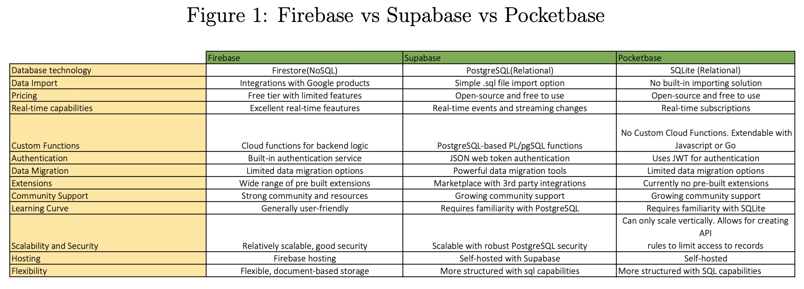
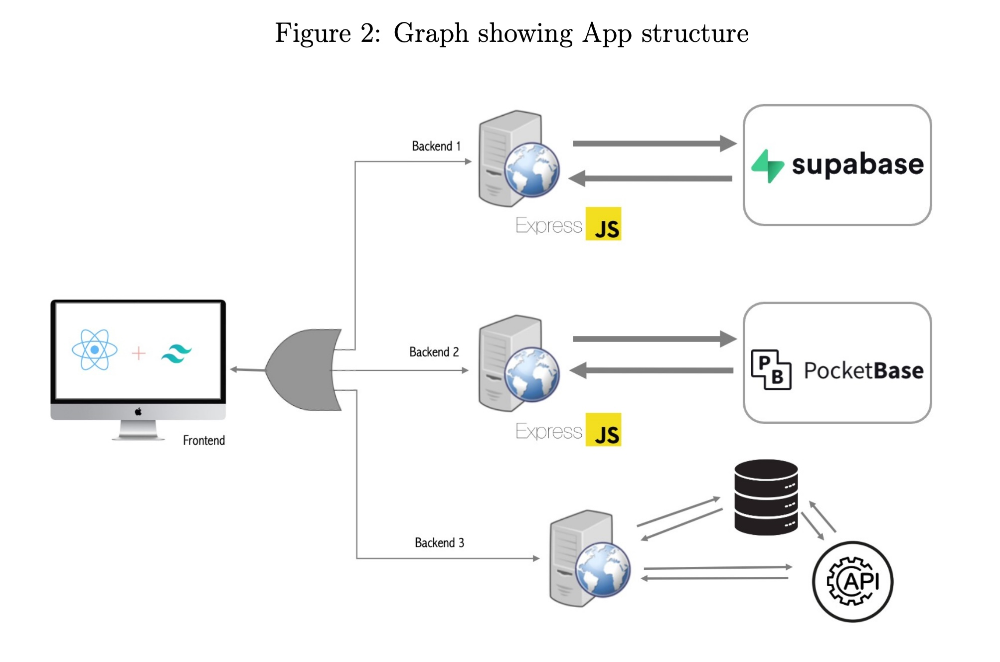
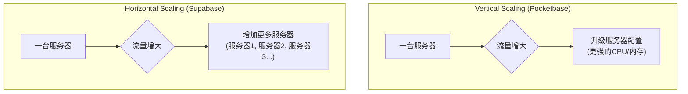
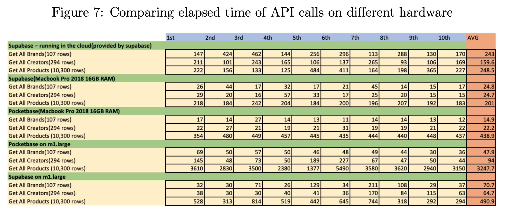
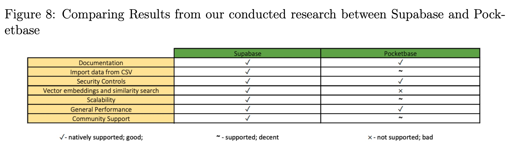

## AI论文解读 | Comparing different BaaS solutions and their performance
        
### 作者        
digoal        
        
### 日期        
2025-09-13        
        
### 标签        
PostgreSQL , PolarDB , DuckDB , AI , 论文解读        
        
----        
        
## 背景  
      
https://hps.vi4io.org/_media/teaching/autumn_term_2023/stud/hpcsa_joao_soares.pdf        
  
提示:          
```          
读懂《Comparing different BaaS solutions and their performance》这篇论文需要提前掌握哪些基础知识, 请使用中文通熟易懂的讲解这些基础知识, 可以引用论文中的图、表或使用Markdown支持的图形(text,mermaid等)增加解释性. 
  
使用中文通熟易懂的解读《Comparing different BaaS solutions and their performance》这篇论文, 其中的关键内容请着重讲解, 可以引用论文中的图、表或使用Markdown支持的图形(text,mermaid等)增加解释性. 
  
提取《Comparing different BaaS solutions and their performance》这篇论文中的重要术语, 使用中文对这些术语进行通熟易懂的讲解, 可以引用论文中的图、表或使用Markdown支持的图形(text,mermaid等)增加解释性. 
```     
  
## 1 前置知识 
  
要理解这篇关于比较不同 BaaS（后端即服务）解决方案的报告，你需要掌握一些基础知识。下面，我将使用通俗易懂的方式为你讲解这些概念，并引用报告中的相关内容作为辅助。

### 1. 什么是 BaaS？

BaaS，即“Backend as a Service”，后端即服务。简单来说，它是一种云计算服务，提供预先构建好的后端功能，让开发者可以专注于构建应用程序的前端部分（用户界面）。

想象一下，你要盖一栋房子。传统的开发模式（自己搭建后端）就像是你需要自己准备所有材料，从打地基、砌墙到安装水电，每一步都要亲力亲为。而使用 BaaS 服务，就像是有人已经为你准备好了现成的地基、框架、水电管线，你只需要在此基础上设计和装修你的房子（也就是开发应用程序）。

报告中讨论的 **Firebase**、**Supabase** 和 **Pocketbase** 都是 BaaS 解决方案。

### 2. BaaS 提供的核心功能

BaaS 解决方案通常提供以下几个核心功能，这也是为什么开发者会选择它们的原因：

* **数据库 (Database)**: 存储应用程序的数据。比如在报告的示例应用中，你需要一个数据库来存储产品、品牌、创作者等信息。
* **身份验证 (Authentication)**: 管理用户的注册、登录和权限。报告提到，Supabase 和 Pocketbase 都提供了内置的身份验证服务，支持电子邮件、密码等多种登录方式。
* **文件存储 (File Storage)**: 存储图片、视频、文档等文件。Supabase 就提供了此功能，并且可以集成到数据库的行级安全策略中。
* **API**: 应用程序前端与后端通信的接口。BaaS 平台通常会自动生成 API，省去了开发者手动编写的工作。

### 3. 两种数据库类型：关系型 vs. 非关系型

理解这篇报告的一个关键点是区分两种主流的数据库类型：

#### 关系型数据库 (Relational Database)
* **特点**: 数据以表格形式存储，就像 Excel 表格一样。不同的表格之间可以建立关系，例如，你可以有一个“产品”表和一个“品牌”表，通过一个共同的“品牌ID”将它们关联起来。 这种结构化、有组织的方式特别适合需要复杂查询和数据一致性的应用。
* **例子**: **PostgreSQL** (Supabase 使用) 和 **SQLite** (Pocketbase 使用) 都是关系型数据库。
* **优势**: 报告提到，关系型数据库让查询和数据检索更快，并且支持更复杂的查询。
* **劣势**: 传统的 PostgreSQL 数据库在扩展（Scalability）方面可能比较困难，但这篇报告指出 Supabase 已经解决了这个问题，能够自动处理扩展问题。

#### 非关系型数据库 (NoSQL Database)
* **特点**: 数据通常以文档形式存储，没有固定的表格结构。
* **例子**: Firebase 使用的 **Firestore** 就是一种 NoSQL 数据库。
* **优势**: 在处理非结构化数据或需要极高扩展性的场景下表现出色。报告也指出，NoSQL 数据库在某些类型的数据关系上扩展起来非常困难，比如全文搜索。

报告的图1对比了这三种 BaaS 解决方案的主要区别，你可以从中看到它们各自使用的数据库技术。

  

---

### 4. 前端开发的基础知识

报告中提到的示例应用程序是使用 **React** 和 **Express.js** 开发的。

* **React**: 一个用于构建用户界面的 **JavaScript** 库。它是前端开发中非常流行的工具，负责创建网页上你看到的所有元素。
* **Express.js**: 一个用于构建后端 API 的 **Node.js** 框架。它的作用是处理前端发来的请求，并与数据库进行交互。报告中的图2清晰地展示了应用程序的结构，前端通过 Express.js 创建的 API 与 Supabase 或 Pocketbase 后端进行通信。    

### 5. 什么是“自托管”（Self-hosting）？

自托管是指开发者在自己的服务器或虚拟机（VM）上运行 BaaS 服务。报告中详细介绍了如何在 GWDG 的虚拟机上自托管 Supabase 和 Pocketbase。

* **优点**: 完全的控制权，可以根据自己的需求进行定制。通常也更便宜，因为你只需要支付服务器的租用费。
* **缺点**: 需要自己处理所有配置、维护和更新，技术门槛更高。报告指出，Pocketbase 没有自己的云服务，因此必须自托管。

### 6. 其他重要概念

* **性能基准 (Performance benchmarks)**: 指通过运行标准化测试来比较不同软件或硬件的性能。报告中引用了 Supabase 和 Pocketbase 官方提供的基准测试，并自己进行了实验，比较了在不同硬件上 API 调用的响应时间。
* **行级安全 (Row-level Security, RLS)**: 一种数据库安全机制，允许你根据用户身份来控制他们可以访问哪些行（记录）。报告指出，Supabase 支持 RLS，而 Pocketbase 使用的是类似的 API 规则。
* **矢量嵌入 (Vector embeddings) 和相似性搜索**: 这是一种高级功能，用于在数据库中表示和查询非结构化数据，比如文本或图片。这对于构建像报告中提到的“搜索引擎”功能至关重要。报告提到 Supabase 使用 **pgvector** 扩展来支持此功能，而 Pocketbase 则没有内置支持。

希望这些基础知识能帮助你更好地理解这篇报告！

---

*你想了解关于这份报告的哪些具体内容？比如，你对Supabase和Pocketbase在性能上的具体差异感兴趣吗？*
  
## 2 解读论文 
  
好的，我们来一起通俗易懂地解读这篇关于后端即服务（BaaS）解决方案的性能比较论文。

### 论文核心思想：一句话讲明白

这篇论文的核心目的，是通过构建一个真实的Web应用，来比较两个热门的开源后端服务工具——**Supabase** 和 **Pocketbase**。作者想搞清楚，对于不同水平的开发者来说，这两个工具在**易用性、功能、性能、扩展能力**等方面各有什么优劣，究竟应该选择哪一个。

-----

### 1\. 什么是BaaS？为什么需要它？

在解读之前，我们先要明白一个概念：**BaaS（Backend as a Service，后端即服务）**。

你可以把它想象成一个“后端开发工具箱”。以前我们开发一个App，除了要编写用户能看到的界面（前端），还要自己从零开始搭建处理数据、用户登录、文件存储等一系列看不见的功能（后端）。这个过程非常耗时且复杂。

BaaS 的出现就是为了解决这个问题。它把那些通用的后端功能，比如**数据库、用户认证、文件存储**等，都打包好，开发者只需要通过简单的调用就能使用，极大地加快了开发速度。这篇论文的主角 Supabase 和 Pocketbase，就是市面上很流行的开源BaaS解决方案，它们经常被用来和商业巨头 Google 的 **Firebase** 对比。

-----

### 2\. 参赛选手介绍：Supabase vs. Pocketbase

论文主要对比了下面两位选手：

| 特性 | **Supabase** | **Pocketbase** | **一句话点评** |
| :--- | :--- | :--- | :--- |
| **核心数据库** | **PostgreSQL** (功能强大、成熟的关系型数据库) | **SQLite** (轻量级、嵌入式的关系型数据库) | Supabase的“发动机”更强劲，Pocketbase更小巧便携。 |
| **定位** | Firebase的开源替代品，功能全面，力求做到企业级。 | 一个“all-in-one”的后端程序，极其简单，一个文件就能运行。 | Supabase是“瑞士军刀”，Pocketbase是“折叠小刀”。 |
| **托管方式** | 官方提供云服务，也可以自己部署（Self-host）。 | 只能自己部署（Self-host）。 | Supabase更省心，Pocketbase更自由。 |
| **社区活跃度** | 非常活跃，贡献者众多 。 | 相对较小，但也在增长 。 | 遇到问题时，Supabase更容易找到帮助。 |

-----

### 3\. 关键内容深度解读：它们到底哪里不一样？

作者为了让对比更贴近实际，虚构了两位开发者角色：

  * **用户A (新手)**：经验不足，参加编程马拉松，追求**开发速度**和**简单易用**。
  * **用户B (老手)**：经验丰富，想寻找一个能解决后端开发中**安全、性能、扩展性**等复杂问题的捷径。

接下来，我们就从这两位用户的视角，看看论文中最重要的几个对比维度。

#### 3.1 易用性与开发体验

  * **数据导入**：这是一个对新手（用户A）至关重要的功能。Supabase的后台管理界面**原生支持**从CSV文件一键导入数据，非常方便 。而Pocketbase没有这个官方功能，需要借助社区开发的第三方工具，作者在使用中还遇到了一些特殊字符处理的问题 。
  * **文档**：两者的文档都有代码示例，但Supabase的文档结构更清晰、易于查阅 。

**小结**：在易用性上，尤其是对新手友好的功能上，**Supabase略胜一筹**。

#### 3.2 安全性控制

  * **Supabase**：支持**行级安全策略 (Row-Level Security, RLS)** 。这是一个非常精细的权限控制方式，可以让你规定“用户A只能看到和修改自己发布的数据”，而“管理员能看到所有数据”。这种精细化控制对于经验丰富、注重安全的用户B来说非常有吸引力。
  * **Pocketbase**：使用**API规则**进行访问控制 。它的控制粒度是基于集合（表）级别的，比如规定“‘文章’这个表，所有人都可以读，但只有登录用户才能写”。虽然也够用，但不如Supabase的RLS灵活和强大。

**小结**：在安全性上，两者都提供了可靠的机制，但**Supabase的控制粒度更细，功能更强大**。

#### 3.3 扩展能力 (Scalability)

这是两者之间**最核心的区别之一**。

  * **Pocketbase**：只能**垂直扩展 (Vertical Scaling)** 。这意味着当你的用户增多、流量变大时，你只能通过给服务器升级配置（比如换更强的CPU、加更多内存）来应对。它本身被设计为在单个服务器上运行 。
  * **Supabase**：基于PostgreSQL，被设计为可以**水平扩展 (Horizontal Scaling)** 。当流量增大时，你可以通过增加更多的服务器来分担压力。Supabase官方也提供了诸如只读副本等功能来帮助应用扩展到百万用户级别 。

我们可以用一个简单的图来理解这两种扩展方式的区别：



**小结**：如果你的项目有潜力发展到大量用户（论文中提到超过10000个连接），那么**Supabase是更明智的选择** 。对于老手用户B来说，这一点至关重要。

#### 3.4 高级功能：向量搜索

  * **Supabase**：**原生支持**`pgvector`扩展，可以用来存储和查询向量嵌入（Vector Embeddings）。这对于实现现代AI应用，比如“以图搜图”或复杂的语义搜索（例如搜索“mac品牌的棕色睫毛膏”）至关重要 。
  * **Pocketbase**：**不支持**向量功能，且官方表示没有计划在未来加入 。

**小结**：如果你想在应用中集成AI或高级搜索功能，**Supabase是目前唯一的选择**。

#### 3.5 性能实测对比

这是论文的“硬核”部分。作者在不同硬件上（自己的MacBook和一台云服务器）对同一个操作（查询数据库）进行了10次测试并取平均值。

**关键数据解读 (引用自论文图7 )**：

  

| 测试场景 | 操作 | Supabase 耗时 | Pocketbase 耗时 | 结论 |
| :--- | :--- | :--- | :--- | :--- |
| **本地MacBook (16GB RAM)** | 查询10,300行数据 | 204.7 ms | 438.9 ms | **Pocketbase慢了约2倍**  |
| **云服务器m1.large (8GB RAM)** | 查询10,300行数据 | 490.9 ms | 3262.7 ms | **Pocketbase慢了约6倍**  |

**性能测试结论**：
在处理少量数据时，两者性能相似。但在**处理大规模数据时，Supabase的性能表现远优于Pocketbase** 。这可能是因为其底层的PostgreSQL数据库在处理复杂查询和大数据量时更加优化。

-----

### 4\. 最终结论与总结

论文最后给出了一个非常清晰的总结，我们可以用下面这个表格来概括（简化自论文图8 ）：

  

| 评估维度 | Supabase | Pocketbase | 谁更优？ |
| :--- | :--- | :--- | :--- |
| **文档** | 👍 (好) | 👌 (尚可) | **Supabase** |
| **数据导入** | 👍 (原生支持) | 👎 (不支持) | **Supabase** |
| **安全控制** | 👍 (精细) | 👌 (够用) | **Supabase** |
| **向量搜索** | 👍 (原生支持) | 👎 (不支持) | **Supabase** |
| **扩展能力** | 👍 (水平扩展) | 👌 (仅垂直扩展) | **Supabase** |
| **综合性能** | 👍 (大数据量下更优) | 👌 (小数据量下尚可) | **Supabase** |
| **社区支持** | 👍 (非常活跃) | 👌 (相对较小) | **Supabase** |

**最终结论**：

  * **Supabase** 是一个功能更全面、性能更强、扩展性更好的“多面手”。对于任何有长期发展计划、追求功能完整性和未来扩展性的项目（无论是新手用户A的成功项目，还是经验用户B的复杂应用），Supabase都是一个更可靠、更具前瞻性的选择 。

  * **Pocketbase** 则是一个优秀的“小而美”的解决方案。它的最大优点是极致的简单和便携。对于一些小型的、个人项目、内部工具或者对性能和扩展性要求不高的场景，Pocketbase是一个非常好的入门选择 。

总而言之，这篇论文通过扎实的实践和数据告诉我们：**选择哪个工具，完全取决于你的项目需求和未来规划。**
  
## 3 术语 
  
以下是根据您提供的论文内容，提取并解释的重要术语：

### 1. BaaS (Backend as a Service)
**定义**: BaaS，即“后端即服务”，是一种云服务模式，为开发者提供了预先构建好的后端功能，让他们可以专注于开发应用程序的前端和用户界面 。
**通俗解释**: 想象一下你要制作一个复杂的应用，比如一个社交媒体平台。你不仅要设计用户能看到的页面（前端），还要处理用户数据、登录、文件存储等看不见的部分（后端）。BaaS就像一个工具箱，里面已经包含了所有这些后端功能，你只需要拿来用，而不需要自己从零开始编写代码和搭建服务器。这极大地简化了开发流程，尤其适合那些没有太多后端开发经验的开发者 。

### 2. Relational Database (关系型数据库)
**定义**: 关系型数据库是一种以表格形式存储数据的数据库，这些表格之间通过预定义的键（如主键和外键）建立联系 。
**通俗解释**: 关系型数据库就像一个由许多相互关联的电子表格组成的大文件柜。每个表格代表一类数据（例如，“产品”表或“创作者”表），每行代表一个具体的数据项，每列则代表一个数据字段。你可以通过关联键轻松地从一个表格中查找另一个表格中的相关信息 。
**论文中的应用**: 报告指出，**Supabase** 使用的是 **PostgreSQL**，而 **Pocketbase** 使用的是 **SQLite**，它们都属于关系型数据库 。报告认为，与非关系型数据库相比，关系型数据库在查询和数据检索方面更快，并且可以执行更复杂的查询 。

### 3. NoSQL Database (非关系型数据库)
**定义**: 非关系型数据库是一种不采用传统表格形式存储数据的数据库。它通常使用文档、键值对、图形或列族等非结构化或半结构化的方式来组织数据 。
**通俗解释**: 想象一下你的数据不是放在整齐的表格里，而是放在一个巨大的文件夹里，每个文件都是一个独立的“文档”，里面包含了所有相关信息。这种方式非常灵活，可以存储各种类型的数据，不需要事先定义好所有字段。
**论文中的应用**: 报告提到，**Firebase** 使用的 **Firestore** 就是一种 NoSQL 数据库 。报告指出，虽然它在处理某些数据关系时很方便，但在处理某些复杂关系（如全文搜索）时可能会遇到困难 。

---

### 4. Self-hosting (自托管)
**定义**: 自托管是指用户在自己的服务器、虚拟机（VM）或物理设备上安装、配置和运行软件，而不是使用服务提供商的云服务 。
**通俗解释**: 这就像是自己在家搭建一个网站服务器，而不是使用像 GoDaddy 这样的托管服务商。你拥有完全的控制权，但也需要自己处理所有的维护、安全和更新问题 。
**论文中的应用**: 报告详细描述了如何自托管 **Supabase** 和 **Pocketbase**。**Pocketbase** 的一个显著特点就是它不提供自己的云服务，因此必须自托管 。

### 5. RLS (Row-level Security) (行级安全)
**定义**: 行级安全是一种数据库安全机制，它允许你根据用户的身份或角色来控制他们对数据库中特定行（记录）的访问权限 。
**通俗解释**: 假设你有一个包含用户信息的表格。使用行级安全，你可以设置规则，让每个用户只能看到和编辑他们自己的信息，而不能访问其他人的数据。这比传统的只控制对整个表格访问权限的方式更精细、更安全。
**论文中的应用**: 报告指出，**Supabase** 支持行级安全，而 **Pocketbase** 则通过 **API 规则** 来实现类似的访问控制 。

### 6. Vector embeddings (矢量嵌入)
**定义**: 矢量嵌入是一种将数据（如文本、图像等）转换为多维向量（数字列表）的技术，以便计算机能够更好地理解和处理它们 。
**通俗解释**: 想象一下，你有一堆关于化妆品产品的描述。通过矢量嵌入，你可以把这些描述转换成一组数字，而这些数字能够捕捉到描述中隐含的意义。这样，当用户搜索“棕色睫毛膏”时，系统可以通过比较这些数字向量的相似性，轻松找到所有相关的产品，即使描述中没有完全匹配的词汇 。
**论文中的应用**: 报告将此功能视为一个重要的评估标准，因为它对于创建类似搜索引擎的功能至关重要 。报告指出，**Supabase** 使用 **pgvector** 工具来支持矢量嵌入和相似性搜索，而 **Pocketbase** 则没有此功能 。

---

您想更深入了解这些术语中的哪一个，或者想看看它们在实际开发中是如何应用的？
  
## 参考        
         
https://hps.vi4io.org/_media/teaching/autumn_term_2023/stud/hpcsa_joao_soares.pdf    
        
<b> 以上内容基于DeepSeek、Qwen、Gemini及诸多AI生成, 轻微人工调整, 感谢杭州深度求索人工智能、阿里云、Google等公司. </b>        
        
<b> AI 生成的内容请自行辨别正确性, 当然也多了些许踩坑的乐趣, 毕竟冒险是每个男人的天性.  </b>        
  
    
#### [期望 PostgreSQL|开源PolarDB 增加什么功能?](https://github.com/digoal/blog/issues/76 "269ac3d1c492e938c0191101c7238216")
  
  
#### [PolarDB 开源数据库](https://openpolardb.com/home "57258f76c37864c6e6d23383d05714ea")
  
  
#### [PolarDB 学习图谱](https://www.aliyun.com/database/openpolardb/activity "8642f60e04ed0c814bf9cb9677976bd4")
  
  
#### [PostgreSQL 解决方案集合](../201706/20170601_02.md "40cff096e9ed7122c512b35d8561d9c8")
  
  
#### [德哥 / digoal's Github - 公益是一辈子的事.](https://github.com/digoal/blog/blob/master/README.md "22709685feb7cab07d30f30387f0a9ae")
  
  
#### [About 德哥](https://github.com/digoal/blog/blob/master/me/readme.md "a37735981e7704886ffd590565582dd0")
  
  

  
