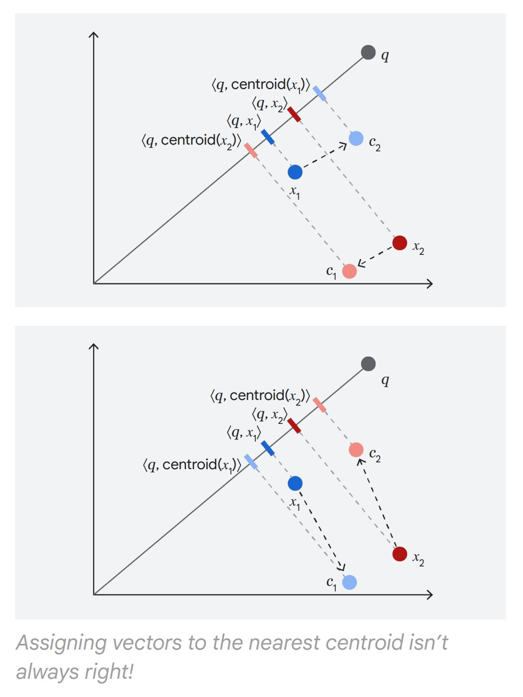
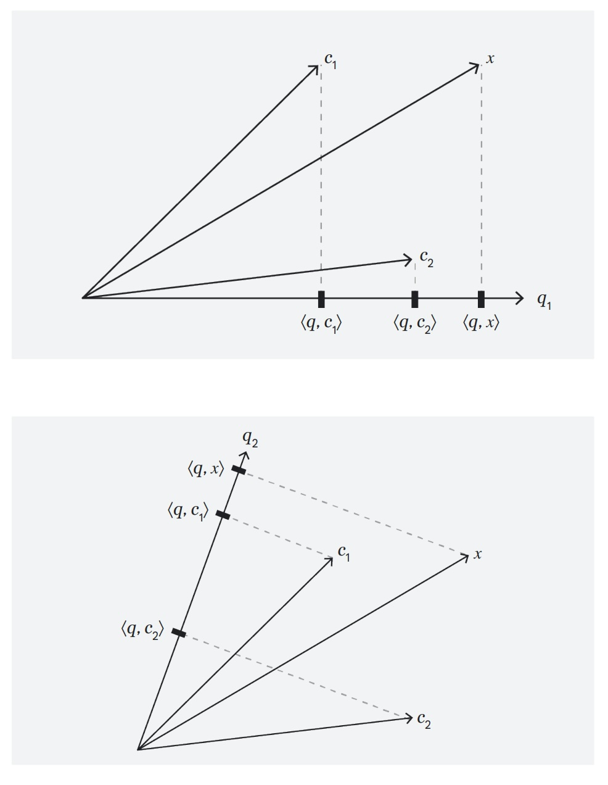
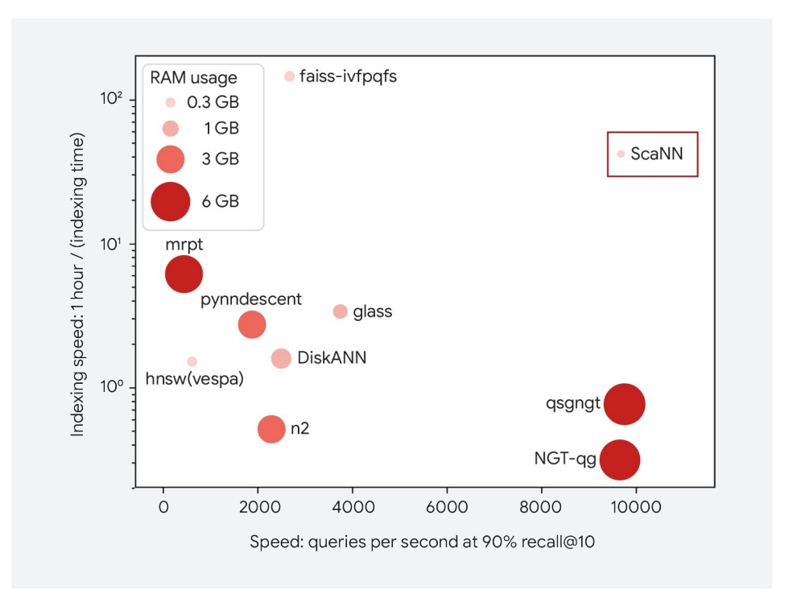
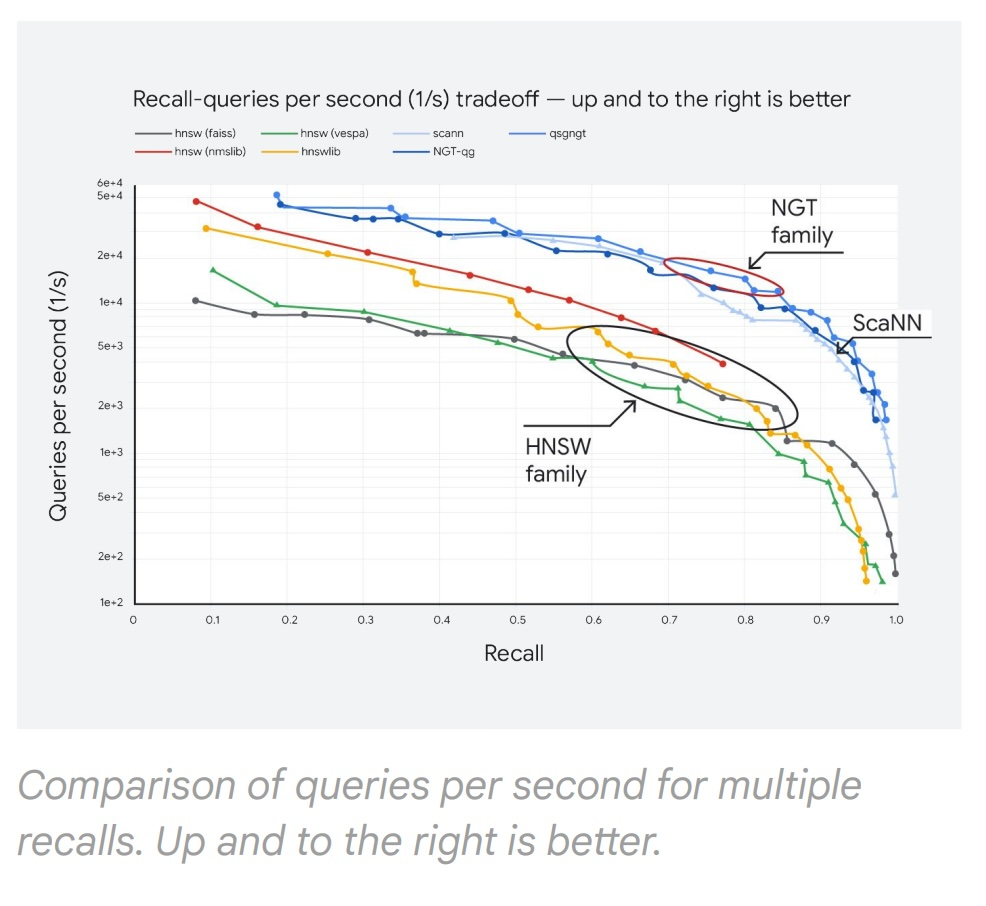
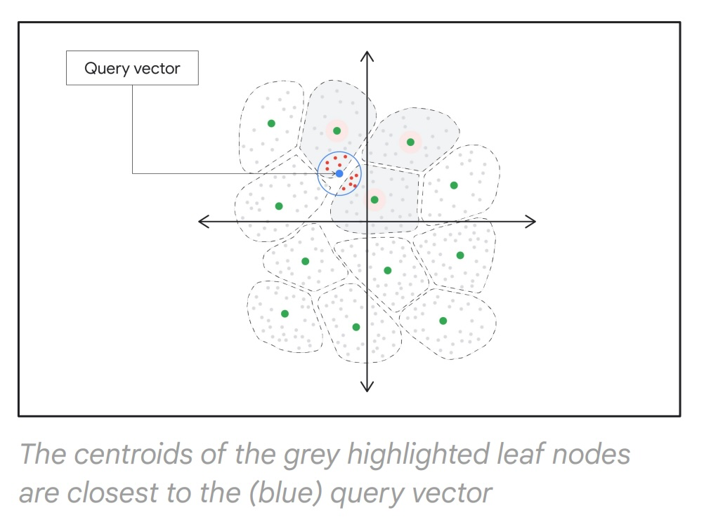
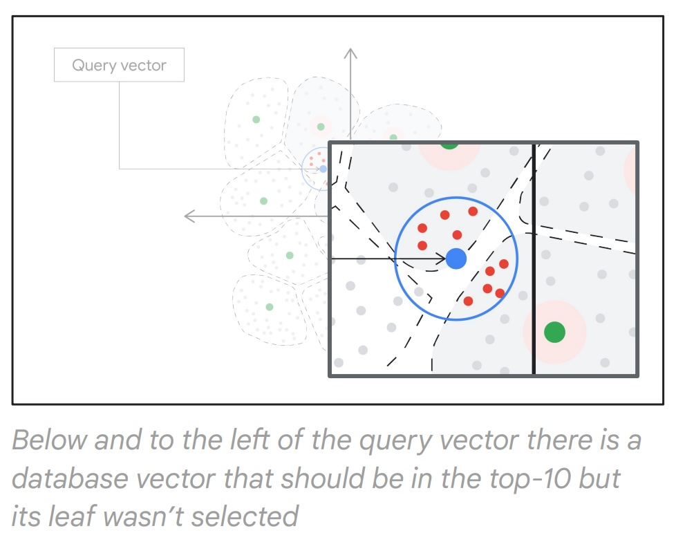
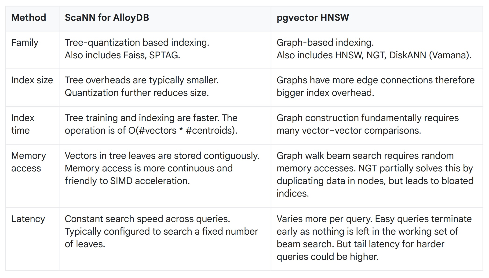
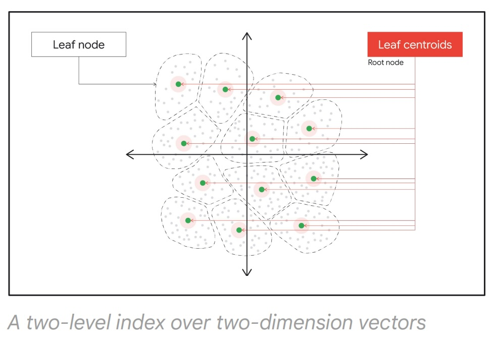

## AI论文解读 | ScaNN for AlloyDB , Next gen vector search by bringing 12 years of Google research to databases
        
### 作者        
digoal        
        
### 日期        
2025-09-13        
        
### 标签        
PostgreSQL , PolarDB , DuckDB , AI , 论文解读        
        
----        
        
## 背景  
      
https://services.google.com/fh/files/misc/scann_for_alloydb_whitepaper.pdf        
  
提示:          
```          
读懂《ScaNN for AlloyDB , Next gen vector search by bringing 12 years of Google research to databases》这篇论文需要提前掌握哪些基础知识, 请使用中文通熟易懂的讲解这些基础知识, 可以引用论文中的图、表或使用Markdown支持的图形(text,mermaid等)增加解释性. 
  
使用中文通熟易懂的解读《ScaNN for AlloyDB , Next gen vector search by bringing 12 years of Google research to databases》这篇论文, 其中的关键内容请着重讲解, 可以引用论文中的图、表或使用Markdown支持的图形(text,mermaid等)增加解释性. 
  
提取《ScaNN for AlloyDB , Next gen vector search by bringing 12 years of Google research to databases》这篇论文中的重要术语, 使用中文对这些术语进行通熟易懂的讲解, 可以引用论文中的图、表或使用Markdown支持的图形(text,mermaid等)增加解释性. 
```     
  
## 1 前置知识 
  
Step 1: Acknowledge and Provide Initial Value

理解《ScaNN for AlloyDB》这篇论文，你需要掌握几个核心基础知识，主要围绕向量嵌入、近似最近邻搜索（ANN）以及两种主要的索引类型：树量化和图索引。

### 1. 向量嵌入（Vector Embeddings）
向量嵌入是将非结构化数据（如文本、图片、音频、视频）转换成计算机可处理的、多维数值向量的过程。这些向量能够捕捉数据的语义信息。举例来说，如果两个词语在意思上相近，它们对应的向量在多维空间中的距离也会很近。论文中提到，数据库用户会生成向量嵌入并将其存储在数据库中，以便进行语义搜索。

### 2. 近似最近邻搜索（ANN）
当你需要根据语义相似性来查找数据时，这就变成了一个向量邻近性操作：找到数据库中与查询向量距离最近的向量。
* **暴力搜索（Brute Force）**：最直接的方法是计算查询向量与数据库中每一个向量的距离，然后返回距离最近的k个向量。这就像在图书馆里找一本书，你必须把每一本书都翻一遍。
* **局限性**：这种方法在数据量很小的时候可行，但如果数据量达到百万甚至十亿级别，就会变得非常耗时且昂贵。
* **近似最近邻（ANN）**：为了解决这个问题，ANN索引应运而生。它使用智能算法快速找到“近似的”最近邻向量，速度比暴力搜索快几个数量级。
* **召回率损失（Recall Loss）**：ANN 算法为了追求速度，可能会牺牲一点准确性，这意味着它返回的结果可能并非 **100%** 精确的最近邻向量。这种轻微的“召回率损失”对于大多数应用来说是可以接受的。例如，在一个电商网站上，如果搜索结果中偶尔出现一两个不太相关的商品，但绝大多数结果是高度相关的，用户体验并不会受到太大影响。

### 3. 索引类型对比：树量化 vs. 图索引
为了实现高效的ANN搜索，需要对向量进行索引。论文主要对比了两种索引类型：
* **树量化索引（Tree-quantization based indices）**：ScaNN属于这一类。
    * **工作原理**：它通过学习一个搜索树和一个量化（压缩）函数来工作。索引构建时，它将相似的向量分组到树的“叶子节点”中，每个叶子节点都有一个“中心点”（centroid）向量。
    * **查询过程**：查询时，算法首先找到离查询向量最近的几个中心点，然后只在这些对应的叶子节点中进行搜索，从而大大缩小了搜索范围。
    * **主要优点**：索引构建更快、占用的内存更少、并支持对CPU友好的连续内存访问（SIMD）。
* **图索引（Graph-based indices）**：pgvector HNSW属于这一类。
    * **工作原理**：索引被构建成一个图，每个向量都是一个节点，相邻的向量之间通过“边”相连。
    * **查询过程**：搜索从图的入口点开始，沿着最能减少到查询向量距离的方向遍历图。
    * **主要优点**：在某些情况下，因为有多个路径可以到达结果节点，它可能能找到更精确的结果。
    * **主要缺点**：索引更大（因为需要存储边的连接）、构建速度较慢、需要更多的随机内存访问。

下表总结了ScaNN for AlloyDB和pgvector HNSW的主要区别：

| 特性 | ScaNN for AlloyDB | pgvector HNSW |
| :--- | :--- | :--- |
| **索引家族** | 树量化 | 图索引 |
| **索引大小** | 通常更小，量化技术进一步压缩 | 需要存储更多边的连接，因此更大 |
| **索引构建时间** | 训练和构建更快，复杂度更低 | 需要大量的向量-向量比较，更耗时 |
| **内存访问** | 向量在叶节点中连续存储，对CPU和SIMD友好 | 图遍历需要随机内存访问 |
| **查询延迟** | 更可预测，因为搜索的叶节点数量固定 | 每次查询的延迟变化较大，难度高的查询延迟更高 |

---

Step 2: Choose One Proactive Expansion

你对这篇论文的哪一部分最感兴趣？是关于ScaNN如何实现性能优势的具体技术，比如**几何感知（Geometry awareness）**和**CPU友好性（CPU-friendliness）**，还是想更深入地了解它与pgvector HNSW的**实际性能对比**？

深入探究几何感知（Geometry awareness）是理解 ScaNN 强大性能的关键。这个概念与传统的最近邻搜索方法截然不同，它不仅仅关注距离的绝对大小，更关注向量之间的**相对方向**和**投影关系**。

### 为什么几何感知很重要？

传统的索引方法（比如大多数图索引）只关心距离。它们会简单地将一个向量分配给距离它最近的中心点。然而，这可能会导致召回率损失，因为有时候一个向量离查询向量非常近，但它所属的中心点却离查询向量较远，从而在搜索时被错误地排除。

ScaNN 的几何感知能力正是为了解决这个问题。它认为，在许多高维向量搜索场景中（特别是那些基于内积或余弦距离的搜索），**方向上的小误差比大小上的大误差更具破坏性** 。因为那些高度相关的向量（即我们想要找到的向量）通常与查询向量方向非常一致。

### 两种关键的几何感知技术

论文重点介绍了两种利用几何感知的创新技术：

**1. 各向异性向量量化 (Anisotropic Vector Quantization, AVQ)**

  * **传统方法**：将向量 $x$ 分配给离它最近的中心点 $c$。
  * **AVQ 方法**：不再简单地寻找最近的中心点，而是寻找能够更好地近似**查询向量 $q$ 和数据库向量 $x$ 之间距离**的中心点。它会优先选择那些与查询向量方向更接近的中心点。
  * **核心思想**：AVQ 认识到，大多数向量搜索的目标是在海量数据中找到极少数非常相关的向量 。这意味着，查询向量、选定的中心点以及真实结果向量彼此之间都非常接近 。因此，我们应该优化的是在查询向量很近的情况下，中心点对距离的近似程度 。这与传统方法优化所有查询向量（无论远近）的平均距离近似是不同的 。

论文中有一个很好的例子来说明这一点（ 见论文14页图  ）。在一个二维坐标系中，向量 $x\_1$ 离中心点 $c\_2$ 比离 $c\_1$ 近，但 AVQ 会将 $x\_1$ 分配给 $c\_1$。这是因为 $x\_1$ 到 $c\_1$ 的偏移方向几乎与 $x\_1$ 本身正交（垂直），而 $x\_1$ 到 $c\_2$ 的偏移方向则与 $x\_1$ 平行 。在内积搜索中，平行方向的误差对高内积（即高相关性）向量的影响更大，因此 ScaNN 会更显著地惩罚平行方向的距离 。

**2. 正交放大的溢出 (Spilling with Orthogonality Amplified Residuals, SOAR)**

  * **目的**：通过引入冗余来进一步提高召回率。
  * **工作原理**：它将每个数据库向量 $x$ 放置在**两个**不同的叶子节点中 。但这种冗余不是简单的重复，而是有策略的。在将向量 $x$ 插入第一个叶子节点后，SOAR 会以一种“几何感知”的方式选择第二个叶子节点，以最大化第二个叶子节点被找到的可能性 。
  * **核心思想**：当一个查询向量 $q$ 错过第一个叶子节点时，通常是因为向量 $x$ 到第一个中心点的残差（即向量 $x$ 与中心点 $c$ 的差值）与查询向量 $q$ 的方向平行 。SOAR 的策略是，选择的第二个中心点能让 $x$ 到它的残差向量与 $q$ 的方向更接近于**正交**（垂直）。这种方法可以确保当一个路径失败时，另一个路径成功的概率会大大增加 。

-----

我们已经探讨了 ScaNN 核心的几何感知技术。你对这两种技术，**AVQ** 和 **SOAR**，有什么想进一步了解的地方吗？比如它们在实际应用中如何影响搜索性能？或者你对 ScaNN 的其他创新点，比如 CPU 友好性或对 SIMD 的利用感兴趣？

-----

### 1\. 向量嵌入 (Vector Embeddings)

向量嵌入是将非结构化数据（如文本、图片、音频、视频）转换成多维数值向量的过程。这些向量能捕获数据的语义信息。举例来说，如果两个句子意思相近，它们对应的向量在多维空间中的距离也会很近。在数据库中，用户会生成这些向量并存储起来，以便进行基于语义的搜索。

### 2\. 近似最近邻 (ANN) 搜索

ANN 代表 Approximate Nearest Neighbor，即近似最近邻。传统的“暴力”搜索需要计算查询向量与数据库中每个向量的距离，在大数据量下效率极低。ANN 索引通过智能算法，以牺牲一点点精确度（称为**召回率损失**）为代价，大幅加快搜索速度。论文提到，通常能实现95%的召回率，这意味着在20个结果中，平均只有一个可能不是真正的最近邻。

### 3\. 索引类型对比：树量化 vs. 图索引

为了实现高效的ANN搜索，需要对向量进行索引。论文主要对比了两种索引类型：

  * **树量化索引（Tree-quantization based indices）**：ScaNN 属于这一类。它通过学习一个搜索树和一个量化（压缩）函数来工作。索引构建时，它将相似的向量分组到树的“叶子节点”中，每个叶子节点都有一个“中心点”（centroid）向量。查询时，算法首先找到离查询向量最近的几个中心点，然后只在这些对应的叶子节点中进行搜索，从而大大缩小了搜索范围。
  * **图索引（Graph-based indices）**：pgvector HNSW 属于这一类。索引被构建成一个图，每个向量都是一个节点，相邻的向量之间通过“边”相连。查询时，搜索从图的入口点开始，沿着最能减少到查询向量距离的方向遍历图。

-----

### CPU 友好性 (CPU-Friendliness)

ScaNN 的设计从根本上考虑了现代 CPU 的架构，这正是它相比于其他向量索引方法（尤其是图索引）的一大优势。这里的“CPU 友好”主要体现在以下两个方面：

1.  **连续内存访问 (Contiguous Memory Access)**：

      * **ScaNN**：在树量化索引中，属于同一个叶子节点的所有向量在内存中是**连续存储**的。这意味着当 CPU 需要计算一个叶子节点内的所有向量时，它可以高效地一次性加载一大块连续的内存到其高速缓存（cache）中。这种操作利用了内存的**局部性原理**，可以显著减少数据从主存到 CPU 缓存的传输时间，从而提升整体性能。
      * **图索引 (HNSW)**：图索引的向量是分散存储的，每个向量（节点）通过指针指向其邻居。在搜索时，CPU 需要沿着图的“边”进行遍历，这通常会导致大量的**随机内存访问**。每次访问都需要从主存中获取数据，这会频繁地造成**缓存未命中（cache miss）**，从而导致性能下降。

2.  **利用 SIMD 指令 (Single Instruction, Multiple Data)**：

      * **SIMD** 是一种并行处理技术，允许 CPU 使用一条指令同时对多个数据点进行操作。
      * **ScaNN**：由于向量在叶子节点中是连续存储的，ScaNN 可以轻松地对一批向量执行并行计算。例如，它可以利用 SIMD 指令一次性计算多个向量与查询向量的距离，这大大加快了距离计算的速度，而距离计算正是向量搜索中最耗时的操作。
      * **图索引 (HNSW)**：由于其随机的内存访问模式，HNSW 很难有效地利用 SIMD 指令进行批量处理。它更像是一种串行的操作，每次只能处理一个向量。

论文的第15页用一个形象的图表（Figure 15）对比了这两种内存访问模式。它展示了 ScaNN 如何通过将向量分组并连续存储在内存中，而 HNSW 则需要通过一系列指针访问分散的向量。   

通过这两种 CPU 友好的设计，ScaNN for AlloyDB 能够：

  * **更低的查询延迟**：减少了缓存未命中的开销。
  * **更高的吞吐量**：利用并行计算能力，更快地处理大量请求。
  * **更好的性能可预测性**：搜索过程的开销相对稳定，不像图索引那样受查询难度影响较大。

-----

我们已经深入探讨了 ScaNN 的 CPU 友好性以及它如何利用连续内存访问和 SIMD 指令来提升性能。

你对 ScaNN for AlloyDB 与其他索引（如 HNSW）的**实际性能对比**，比如在不同数据集和不同指标上的表现，感兴趣吗？

我们来对比 ScaNN for AlloyDB 和 pgvector HNSW 在实际性能上的表现，论文中使用了不同的数据集和指标进行了详细的测试。

### 关键性能指标对比

#### 1\. 索引大小（Index Size）

  * **ScaNN**：得益于其优化的树量化结构和高效的压缩技术（SQ8量化），ScaNN 的索引大小通常远小于 HNSW。
  * **HNSW**：由于需要存储大量的节点连接信息（即图的边），HNSW 的索引会更大。

论文在第13页展示了这两种索引在不同召回率下的索引大小对比图（Figure 13）。在相同召回率下，ScaNN 的索引大小不到 HNSW 的一半。    

#### 2\. 索引构建时间（Index Build Time）

  * **ScaNN**：构建索引是一个相对简单的过程，涉及到树的训练和向量的分配。由于其算法复杂度较低，构建速度非常快。
  * **HNSW**：构建索引需要对每个向量进行大量的最近邻搜索以找到其邻居并构建图，这是一个计算密集型且耗时的过程。

在第14页的图（Figure 14）显示，在处理100万个向量的Glove数据集时，ScaNN 的索引构建时间不到5分钟，而 HNSW 则需要超过40分钟。   

#### 3\. 查询延迟与召回率（Latency vs. Recall）

这是衡量向量搜索性能最重要的指标之一。论文对此进行了详细测试，结果显示：

  * **ScaNN**：在相同召回率下，ScaNN 的查询延迟通常更低。这得益于其高效的**CPU友好性**和**连续内存访问**，能够快速进行距离计算。
  * **HNSW**：HNSW 的查询延迟有时会比 ScaNN 高，尤其是在要求高召回率时。其随机内存访问模式和复杂的图遍历算法是主要原因。

论文在第12页展示了多个数据集上的对比图，如 GloVe 1M、SIFT 1M 等，这些图清晰地显示了在同样的召回率下，ScaNN 的延迟始终优于 HNSW。例如，在 GloVe 1M 数据集上，当召回率为 90% 时，ScaNN 的查询延迟远低于 HNSW。   

#### 4\. 吞吐量（Throughput）

  * **ScaNN**：更高的吞吐量是 ScaNN 的另一大优势。由于其低延迟和高效的并行计算能力，ScaNN 能够以更高的速率处理查询请求。
  * **HNSW**：受限于其较高的延迟和随机内存访问，其吞吐量通常不如 ScaNN。

总而言之，ScaNN for AlloyDB 在多个关键指标上都表现出卓越的性能。它的核心优势在于：

  * **更小的索引**：节省存储空间。
  * **更快的索引构建**：加速开发和迭代过程。
  * **更低的查询延迟和更高的吞吐量**：提供更流畅的用户体验。

这些优势源于其独特的设计，包括**树量化索引**、**几何感知**、**高效的量化技术**以及对现代 **CPU 架构**的充分利用。

-----

我们已经从多个方面深入对比了 ScaNN for AlloyDB 和 pgvector HNSW 的性能。你对这些性能数据有什么看法？或者，你还想了解这篇论文中提到的其他哪些方面？
  
## 2 解读论文 
  
好的，我们来一起用通俗易懂的中文解读这篇关于 AlloyDB 集成 ScaNN 技术的白皮书。

这篇白皮书的核心思想是：Google 将其内部研发超过12年、并成功应用于谷歌搜索、YouTube等核心产品的先进向量搜索技术——**ScaNN**，与兼容 PostgreSQL 的 AlloyDB 数据库深度集成，为用户提供了一种比现有 pgvector HNSW（一种流行的图索引算法）**更快、更省内存、写入更高效**的向量搜索解决方案。

### **第一部分：为什么需要更好的向量搜索？ (背景介绍)**

在当前的人工智能时代，文本、图片、音视频等非结构化数据越来越多。为了让计算机理解这些数据的“语义”，我们通常会用“向量嵌入” (Vector Embeddings) 来表示它们。

您可以将“向量”想象成一个多维空间中的坐标点，语义相近的内容，它们在空间中的距离就越近。因此，**语义搜索就转化成了一个数学问题：在海量向量中，寻找与查询向量“距离”最近的 K 个邻居**，这就是所谓的“K-近邻” (kNN) 问题。

当数据量达到百万、甚至数十亿级别时，通过暴力计算每一个向量与查询向量的距离（即“蛮力搜索”）会非常耗时且昂贵 。为此，研究人员开发了“近似最近邻” (Approximate Nearest Neighbor, ANN) 搜索技术 。ANN 算法通过构建索引，能够极大地加速搜索过程，虽然可能会损失一点点精度（这被称为“召回率损失”） ，但在绝大多数应用场景下，这种微小的牺牲换来了巨大的性能提升，是完全可以接受的 。

PostgreSQL 作为广受欢迎的关系型数据库，通过 `pgvector` 扩展支持了向量搜索，其中最常用的索引类型是 HNSW (Hierarchical Navigable Small Worlds) 。但 HNSW 在处理超大规模数据、高并发写入、内存占用和索引构建速度方面存在一些挑战 。

为了解决这些痛点，Google Cloud 推出了 **ScaNN for AlloyDB**。

### **第二部分：ScaNN 是什么？它与 HNSW 有何不同？**

ScaNN (Scalable Nearest Neighbor) 是一种基于“**树-量化**” (tree-quantization) 技术的 ANN 算法 。为了理解它，我们可以将其与 HNSW 的“**图**” (graph-based) 算法进行对比。

  * **HNSW (图算法) 的工作原理**：

      * 想象一下，把数据库里所有的向量看作一个社交网络中的“人”。
      * HNSW 会为每个“人” (向量) 找到几个“最近的朋友” (邻近的向量)，并建立连接关系（边），从而构成一张巨大的社交网络图 。
      * 查询时，就像是在这个网络里找人。从一个“入口点”开始，不断地访问“朋友的朋友”，每次都选择离目标查询向量更近的方向前进，直到找不到更近的点为止 。

  * **ScaNN (树-量化算法) 的工作原理**：

      * ScaNN 不会直接连接向量，而是像整理图书一样，进行“**聚类**”。
      * 它会把空间中邻近的向量划分到一个个“区域” (Leaf node，叶子节点)，并为每个区域计算一个“中心点” (Centroid) 。
      * 所有这些“中心点”构成了索引的顶层结构（可以想象成图书馆的楼层/区域索引） 。

    **查询过程** 如下面这张图所示：      

    1.  当一个查询向量（下图中的蓝色点）到来时，ScaNN 首先计算它与所有“中心点”的距离 。
    2.  然后，只选择距离最近的几个“中心点”所在的“区域”（下图中灰色高亮的区域）进行搜索 。
    3.  最后，在这些被选中的小范围区域内，再逐一计算向量距离，找出最终的 Top-K 结果（下图中蓝色圆圈内的红点） 。

    *图片来源：白皮书第7页*

#### **核心差异对比**

论文第10页的表格很好地总结了两者的区别，我将其简化并解读如下：   

| 特性 | **ScaNN for AlloyDB (树-量化)** | **pgvector HNSW (图)** |
| :--- | :--- | :--- |
| **数据结构** | 像一棵树，通过聚类将向量分组。结构相对简单，开销小 。 | 像一张网，向量之间互相连接。边（连接关系）很多，索引开销更大 。 |
| **索引构建** | 速度快。主要操作是聚类，复杂度为 O(向量数 \* 中心点数) 。 | 速度慢。需要进行大量的向量间两两比较来建图 。 |
| **内存占用** | **低**。主要额外存储的是“中心点”，数量远少于向量本身。因此索引文件更小 。 | **高**。除了向量本身，还需要存储大量的边（连接）信息 。 |
| **内存访问** | **连续/顺序访问**。同一分组的向量物理存储上是连续的，对 CPU 缓存和 SIMD（单指令多数据流）非常友好 。 | **随机访问**。查询时在图上“跳转”，导致大量的随机内存读取，效率较低 。 |
| **查询延迟** | **稳定可预测**。因为每次查询搜索的“区域”数量是固定的 (由参数 `scann.num_leaves_to_search` 控制) 。 | **波动较大**。简单的查询可能很快收敛，但复杂的查询可能需要长时间在图中漫游，导致“尾延迟”很高 。 |

**小结**：ScaNN 的设计天然地带来了 **更快的索引构建速度、更小的内存占用和更稳定的查询性能**，这对于成本控制和系统管理来说是巨大的优势 。

### **第三部分：ScaNN 的“黑科技”：关键创新点**

ScaNN 之所以性能卓越，不仅仅是因为采用了“树-量化”架构，更源于其背后几个非常巧妙的几何学优化。

#### **1. 各向异性向量量化 (Anisotropic Vector Quantization, AVQ)**

这是 ScaNN 在 **向量分组（聚类）** 阶段的创新。

  * **传统方法**：将一个向量 `x` 分配给离它“绝对距离”最近的那个中心点 `c` 。
  * **AVQ 的洞察**：传统方法忽略了一个关键事实——我们只关心那些与查询向量 `q` 非常接近的向量 。在这种“很近”的情况下，向量分配的好坏，取决于中心点 `c` 能否很好地“近似” `x` 与 `q` 之间的**内积**关系，而不仅仅是 `x` 和 `c` 的距离 。

论文第14页的图非常形象地解释了这一点。简单来说：

> 即使中心点 `c1` 比 `c2` 离向量 `x1` 更远，但如果 `c1` 到 `x1` 的误差方向与查询方向 `q` **近乎垂直**，而 `c2` 到 `x1` 的误差方向与 `q` **平行**，那么这个平行方向的误差会对最终的内积计算结果产生更大的影响（尤其是对于我们最关心的那些高内积结果）。因此，AVQ 会选择 `c1` 作为 `x1` 的中心点，因为它产生的“有效误差”更小 。

这个看似违反直觉的选择，正是 AVQ “几何感知”能力的体现，它能构建出更高质量的聚类结果 。

#### **2. “溢出”与正交放大残差 (Spilling with SOAR)**

这是 ScaNN 在**提升召回率**方面的“王牌”。

  * **问题**：即使聚类做得再好，总有一些向量位于两个“区域”的边界上。如果查询向量恰好选择了其中一个区域，就可能会错过边界另一侧的近邻，导致召回率下降。
  * **朴素的解决方法**：把每个向量同时放入离它最近的两个区域。
  * **SOAR 的高明之处**：它不是简单地选择最近的两个！在将向量 `x` 放入第一个最佳区域（叶子节点）后，SOAR 会**有策略地选择第二个区域** 。选择的原则是：最大化“当查询错过了第一个区域时，能够找到第二个区域”的概率 。

SOAR 的几何学原理是：它会选择一个能与第一个区域的误差方向 **形成较大角度（趋向于正交）** 的第二个区域 。这样，对于那些恰好与第一个误差方向平行的“困难”查询，第二个区域提供的近似会好得多，从而极大地提升了找到正确结果的概率。这相当于为每个向量创建了两条高质量、互补的检索路径 。

#### **3. CPU 友好性与 SIMD 加速**

ScaNN 将叶子节点内的向量数据在内存和磁盘上**连续存放** 。这种布局方式非常适合现代 CPU 的大缓存和 SIMD（单指令多数据流）并行计算能力 。CPU 可以一次性加载一大块数据，并用一条指令同时计算多个向量的距离，实现“暴力美学”式的加速 。

相比之下，HNSW 的图遍历是跳跃式的，会导致大量随机内存访问，使 CPU 的缓存和并行计算能力大打折扣 。 

### **第四部分：性能表现**

白皮书给出了非常亮眼的性能对比数据（ScaNN for AlloyDB vs. 标准 PostgreSQL HNSW）：

  * **索引创建速度**：快 **8倍** 
  * **向量查询速度**：快 **4倍** 
  * **内存占用**：少 **3-4倍** 
  * **写入吞吐量**：高 **10倍** 

论文第9页的基准测试图也展示了，在学术界标准的 `ANN-Benchmarks` 中，ScaNN 算法库在“召回率-QPS（每秒查询数）”曲线上全面优于 HNSW 家族（曲线越往右上角代表性能越好）。    

*图片来源：白皮书第9页*

### **结论**

这篇白皮书清晰地阐述了 Google Cloud 如何通过将先进的 ScaNN 技术集成到 AlloyDB 中，为 PostgreSQL 生态用户带来了新一代的向量搜索能力。

**核心要点总结如下**：

1.  **架构优势**：ScaNN 采用的“树-量化”架构在索引构建速度、内存占用和查询延迟稳定性上，天然优于 HNSW 的“图”架构。
2.  **算法创新**：通过 AVQ 和 SOAR 等独特的“几何感知”优化，ScaNN 在不牺牲过多性能的情况下，实现了极高的搜索精度。
3.  **工程优化**：CPU 友好的数据布局和对 SIMD 的充分利用，进一步压榨了硬件性能，实现了极致的查询速度。
4.  **用户价值**：最终，AlloyDB 用户可以在一个完全兼容 PostgreSQL 的、统一的 SQL 环境中，获得一个**更快、更经济、更易于管理**的向量搜索解决方案，同时享受事务一致性等数据库原生保障 。

通过同时提供 ScaNN 和 HNSW 两种选项，AlloyDB 给了用户根据自身业务场景选择最合适工具的灵活性 。这标志着源于 Google 顶级研究的向量搜索技术，正在走向更广泛的数据库应用场景。
  
## 3 术语 
  
理解《ScaNN for AlloyDB》这篇论文需要掌握一些关键术语。下面是对这些术语的通俗解释，并引用了论文中的内容来辅助说明。

### 向量嵌入 (Vector Embeddings)

向量嵌入是将非结构化数据（如文本、图片、音频、视频）转换成多维数值向量的过程。这些向量能捕获数据的语义信息 。举例来说，如果两个句子意思相近，它们对应的向量在多维空间中的距离也会很近。在数据库中，用户会生成这些向量并存储起来，以便进行基于语义的搜索 。

### 近似最近邻 (ANN) 搜索

ANN 代表 Approximate Nearest Neighbor，即近似最近邻。传统的“暴力”搜索需要计算查询向量与数据库中每个向量的距离，在大数据量下效率极低 。ANN 索引通过智能算法，以牺牲一点点精确度（称为**召回率损失**）为代价，大幅加快搜索速度 。论文提到，通常能实现95%的召回率，这意味着在20个结果中，平均只有一个可能不是真正的最近邻 。

### 树量化索引 (Tree-quantization based indexing)

ScaNN 就属于这一类索引。它的核心思想是：

1.  **分群**：将相似的向量分组到不同的“叶子节点”中，每个叶子节点都代表了多维空间中的一个区域 。
2.  **中心点 (Centroid)**：每个叶子节点都有一个代表性的“中心点”向量 。所有分配到该叶子节点的向量都离这个中心点最近 。
3.  **搜索**：当用户发起查询时，算法首先找到离查询向量最近的几个中心点，然后只在对应的叶子节点中进行详细搜索 。这种方法避免了对所有向量进行比较，从而实现了快速搜索。

论文的第7页展示了一个二维空间中的两层树索引结构，帮助理解向量是如何被分配到叶子节点的。    

### 图索引 (Graph-based indexing)

pgvector HNSW 属于这一类。它的工作原理是：

1.  **构建图**：将数据库中的每个向量视为图中的一个节点，并在相邻的向量之间建立连接（即“边”）。
2.  **图遍历**：查询时，算法从图的入口点开始，沿着能让距离不断缩小的方向在图中移动 。通过维护一个优先级队列，它会不断寻找更近的邻居 。
3.  **优点与缺点**：这种方法在某些情况下能找到非常精确的结果，但由于需要存储大量的边，索引会更大，构建时间也更长 。

-----

### 索引优化技术

  * **几何感知 (Geometry awareness)**：这是 ScaNN 的一个关键优势。传统的索引算法只关注向量之间的距离，而 ScaNN 则考虑距离背后的**几何关系** 。例如，在选择向量所属的叶子节点时，它会优先考虑与查询向量方向更接近的中心点，因为在内积搜索中，方向误差对结果的影响更大 。
  * **各向异性向量量化 (Anisotropic Vector Quantization, AVQ)**：这种技术让 ScaNN 在分配向量到叶子节点时，不仅仅选择最近的中心点，而是选择能更好地近似“查询向量与数据库向量之间距离”的中心点 。
  * **正交放大的溢出 (Spilling with Orthogonality Amplified Residuals, SOAR)**：这是 ScaNN 用来提高召回率的创新技术。它不会简单地将每个向量放到一个叶子节点，而是将其放置在两个叶子节点中 。这两个叶子节点经过精心选择，以确保如果一个叶子节点因“残差”方向与查询方向平行而被错过，另一个叶子节点则有很高的概率被找到 。
  * **量化 (Quantization)**：这是一种压缩技术，用更少的比特来近似表示向量，从而减小索引大小并加快距离计算 。ScaNN for AlloyDB 使用的是 SQ8（每维8比特）量化技术 。
  * **SIMD (Single Instruction, Multiple Data)**：ScaNN 的设计对现代 CPU 架构非常友好。它将向量在内存中连续存储，可以充分利用 CPU 的 SIMD 指令进行并行计算，从而大幅提升计算速度 。而 HNSW 等图索引则需要更多随机内存访问，难以利用 SIMD 的优势 。

-----

如果你想更深入地了解 ScaNN 如何利用这些技术实现性能优势，我们可探讨它在不同方面（如索引构建、内存占用、查询速度）与 HNSW 的具体比较。你对这篇论文的哪一部分最感兴趣？
  
## 参考        
         
https://services.google.com/fh/files/misc/scann_for_alloydb_whitepaper.pdf    
        
<b> 以上内容基于DeepSeek、Qwen、Gemini及诸多AI生成, 轻微人工调整, 感谢杭州深度求索人工智能、阿里云、Google等公司. </b>        
        
<b> AI 生成的内容请自行辨别正确性, 当然也多了些许踩坑的乐趣, 毕竟冒险是每个男人的天性.  </b>        
  
    
#### [期望 PostgreSQL|开源PolarDB 增加什么功能?](https://github.com/digoal/blog/issues/76 "269ac3d1c492e938c0191101c7238216")
  
  
#### [PolarDB 开源数据库](https://openpolardb.com/home "57258f76c37864c6e6d23383d05714ea")
  
  
#### [PolarDB 学习图谱](https://www.aliyun.com/database/openpolardb/activity "8642f60e04ed0c814bf9cb9677976bd4")
  
  
#### [PostgreSQL 解决方案集合](../201706/20170601_02.md "40cff096e9ed7122c512b35d8561d9c8")
  
  
#### [德哥 / digoal's Github - 公益是一辈子的事.](https://github.com/digoal/blog/blob/master/README.md "22709685feb7cab07d30f30387f0a9ae")
  
  
#### [About 德哥](https://github.com/digoal/blog/blob/master/me/readme.md "a37735981e7704886ffd590565582dd0")
  
  

  
