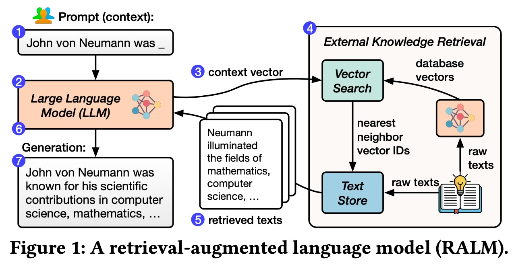
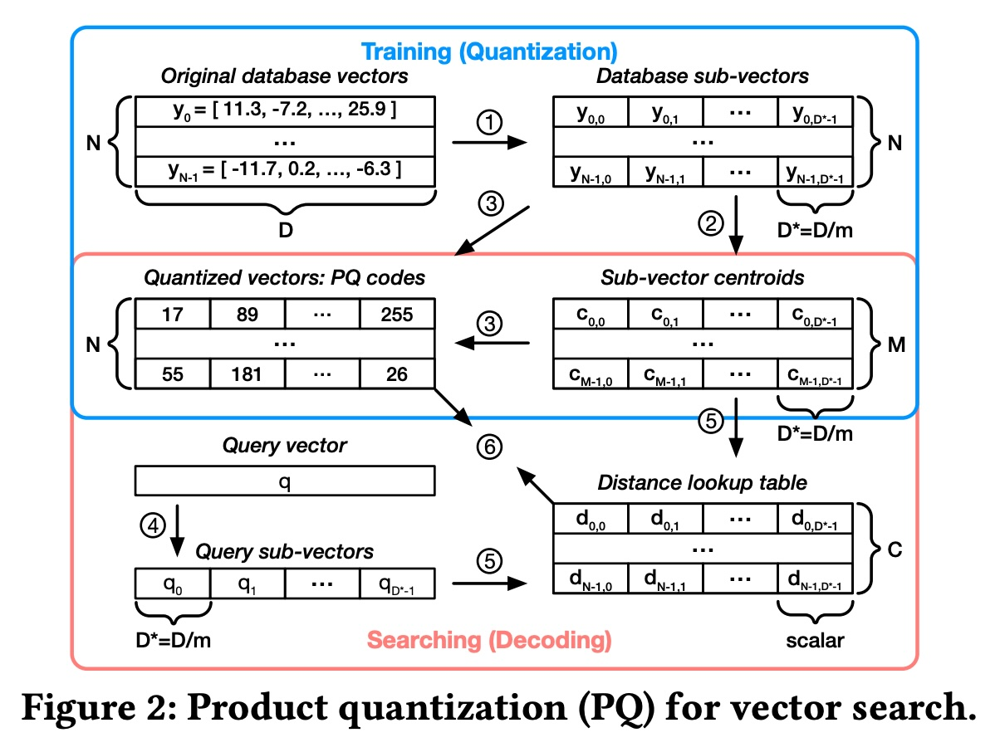
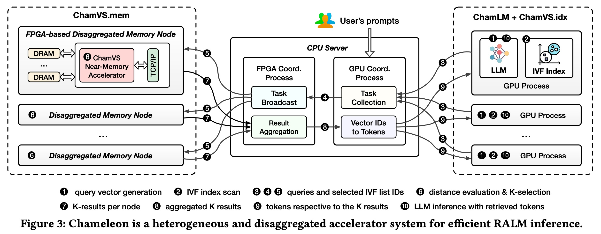
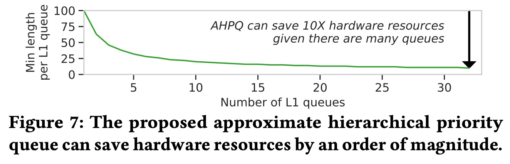
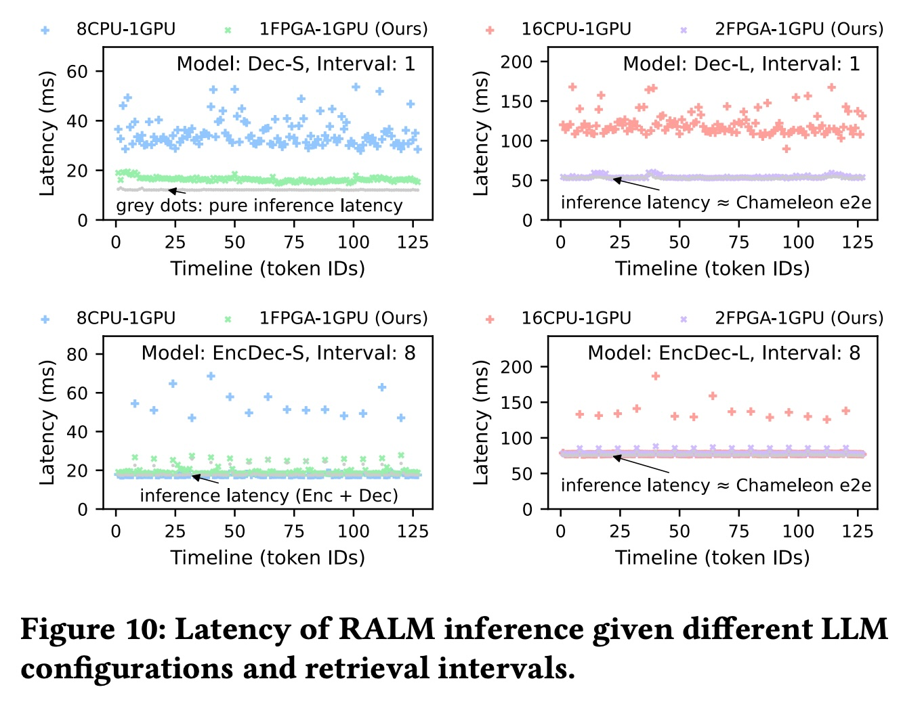

## AI论文解读 | Chameleon: a Heterogeneous and Disaggregated Accelerator System for Retrieval-Augmented Language Models
        
### 作者        
digoal        
        
### 日期        
2025-09-13        
        
### 标签        
PostgreSQL , PolarDB , DuckDB , AI , 论文解读        
        
----        
        
## 背景  
      
https://www.vldb.org/pvldb/vol18/p42-jiang.pdf        
  
提示:          
```          
读懂《Chameleon: a Heterogeneous and Disaggregated Accelerator System for Retrieval-Augmented Language Models》这篇论文需要提前掌握哪些基础知识, 请使用中文通熟易懂的讲解这些基础知识, 可以引用论文中的图、表或使用Markdown支持的图形(text,mermaid等)增加解释性. 
  
使用中文通熟易懂的解读《Chameleon: a Heterogeneous and Disaggregated Accelerator System for Retrieval-Augmented Language Models》这篇论文, 其中的关键内容请着重讲解, 可以引用论文中的图、表或使用Markdown支持的图形(text,mermaid等)增加解释性. 
  
提取《Chameleon: a Heterogeneous and Disaggregated Accelerator System for Retrieval-Augmented Language Models》这篇论文中的重要术语, 使用中文对这些术语进行通熟易懂的讲解, 可以引用论文中的图、表或使用Markdown支持的图形(text,mermaid等)增加解释性. 
```     
  
## 1 前置知识 
  
根据《Chameleon: a Heterogeneous and Disaggregated Accelerator System for Retrieval-Augmented Language Models》这篇论文，要读懂它，你需要掌握以下几个核心基础知识，这些知识构成了论文的基础和创新点。

### 1. 检索增强语言模型 (RALM)
---
首先，你需要理解什么是**检索增强语言模型（RALM）**。传统的LLM（大语言模型）的所有知识都固化在模型的参数中，这导致它们在回答特定或新颖问题时容易产生“幻觉”（即生成不真实的内容）。

RALM 是一种将LLM与外部知识库（通常是**向量数据库**）结合的架构。论文中的图1（图已提供）清晰地展示了它的工作流程：   

* **向量化**: 外部文本知识被编码成向量并存储在向量数据库中 。
* **检索**: 当用户输入一个提示（prompt）时，LLM会生成一个“查询向量” 。
* **向量搜索**: 系统通过向量搜索（Vector Search）在数据库中找到与该查询向量最相似的文本向量 。
* **增强**: 找到的“相关文本”被作为上下文，与原始提示一起输入给LLM 。
* **生成**: LLM利用这些增强的上下文来生成更准确、更可信的答案 。

简而言之，RALM让LLM专注于理解语言结构和生成流畅的文本，而将事实性知识的存储和更新交给外部数据库 。

### 2. 大规模向量搜索 (Vector Search)
---
向量搜索是RALM架构中至关重要的一环，因为需要从庞大的数据库中快速找到相似的向量 。论文指出，由于精确的K近邻（KNN）搜索在大型数据集上成本过高，实际系统都采用**近似最近邻（ANN）搜索** 。

论文特别提到了两种核心技术：

* **倒排文件（IVF）索引**: 这种方法通过K-means等聚类算法将海量向量分成多个不相交的子集（称为IVF列表）。在查询时，系统只扫描与查询向量最接近的少数几个IVF列表，从而有效缩小了搜索范围 。
* **乘积量化（PQ）**: PQ技术通过将每个高维向量压缩成更小的“PQ代码”来显著减少内存占用和计算量 。论文中的图2（图已提供）展示了PQ的训练和搜索过程，其中最关键的一步是“距离查找表（Distance Lookup Table）”的构建和使用，它将复杂的距离计算变成了简单的查表操作，大大提高了效率 。   

### 3. 异构与解耦系统架构
---
这是论文的核心创新点。Chameleon系统之所以命名为“变色龙”，正是因为它采用了 **异构（Heterogeneous）** 和 **解耦（Disaggregated）** 的架构来应对RALM的挑战 。

* **异构性**: 指系统使用不同类型的硬件加速器来处理不同的任务 。论文提出，LLM推理任务非常适合GPU（图形处理器），因为它们擅长快速的张量运算 ，而向量搜索任务则更适合FPGA（现场可编程门阵列） 。异构架构确保了LLM推理和向量搜索两个主要组件都能高效运行 。
* **解耦性**: 指将不同的硬件加速器（如LLM加速器和向量搜索加速器）物理上分离，而不是固定在一个服务器上 。论文中的图3（图已提供）展示了这种架构：LLM推理（ChamLM）在GPU上运行，而向量搜索（ChamVS）在带有FPGA的独立内存节点上运行，CPU作为协调器进行通信 。这种解耦设计允许你根据不同RALM模型的需求（例如，有的模型需要更大的数据库，有的需要更高的检索频率）独立地扩展LLM或向量搜索的硬件，从而实现更高的灵活性和资源利用率 。   

总的来说，要理解这篇论文，你需要先在宏观上理解**RALM的工作原理**，然后在微观上掌握**向量搜索中的IVF和PQ技术**，最后理解论文提出的**异构和解耦系统架构**如何将这些技术高效地整合在一起。

---
如果您想了解论文中提到的 **近似分层优先队列（AHPQ）** 的具体实现细节，我可以为您详细解释。

好的，近似分层优先队列（AHPQ）是《Chameleon》论文中一个关键的技术细节，它被用来解决向量搜索的效率问题。简单来说，AHPQ是一种专为FPGA（现场可编程门阵列）硬件设计的优化索引和搜索算法，旨在以极高的吞吐量和低延迟执行近似最近邻（ANN）搜索。

### AHPQ 的核心思想
---
论文中指出，传统的基于倒排文件（IVF）的搜索在处理大规模数据时，如果需要保证高准确率，通常需要扫描多个IVF列表，这会消耗大量内存带宽。AHPQ正是为了解决这个问题而设计的。

AHPQ的核心思想可以分解为两个主要部分：

1.  **分层索引（Hierarchical Index）**:
    AHPQ 在标准的 IVF 索引之上增加了一个新的层级。它将所有倒排列表（inverted lists）进一步分组，形成一个分层的结构。这样在搜索时，系统可以首先快速确定最相关的组，而不是盲目地扫描多个不相关的列表。这种分层结构减少了需要访问的数据量，从而提高了搜索效率。

2.  **优先队列（Priority Queue）搜索**:
    一旦确定了需要访问的倒排列表，AHPQ 并不立即开始线性扫描所有向量。相反，它利用一个**近似优先队列**来管理搜索过程。

    * 对于每个待处理的向量，系统会计算一个**近似距离**（通过乘积量化，PQ）并将其放入一个优先队列中。
    * 这个队列会**动态地**将那些最有可能成为最终最近邻的向量排在前面。
    * FPGA 上的硬件可以并行地从队列中取出并处理这些最相关的向量，而忽略那些距离较远、不太可能成为最近邻的向量。

通过结合分层索引和优先队列，AHPQ 使得 ChamVS（Chameleon 向量搜索模块）能够以**近似的、动态的**方式找到最近邻，而不是通过暴力扫描。这使得它在保证搜索质量的同时，大幅减少了计算量和内存访问，从而在 FPGA 上实现了论文所宣称的高效性能。

---
现在您已经了解了 AHPQ 的原理，您是否想进一步了解论文中是如何在 FPGA 上具体实现这个**ChamVS**模块的？
  
## 2 解读论文 
  
好的，我们来通俗易懂地解读一下《Chameleon: a Heterogeneous and Disaggregated Accelerator System for Retrieval-Augmented Language Models》这篇论文。

### **一、论文概述**

简单来说，这篇论文设计并实现了一个名为 **Chameleon (变色龙)** 的高性能计算系统，专门用于加速一种叫做 **“检索增强语言模型” (Retrieval-Augmented Language Models, RALM)** 的AI模型 。

当今的语言模型（比如ChatGPT）有时会“一本正经地胡说八道”（即产生幻觉），或者知识更新不及时 。RALM通过给语言模型外挂一个“知识库”（向量数据库），让模型在回答问题时能先去查资料，再结合查到的内容生成答案，从而大大提高了准确性和时效性 。

然而，这种“查询+生成”的模式对计算系统提出了新的挑战。论文的核心思想就是：**针对RALM中不同类型的工作负载，使用不同类型的专用硬件（异构加速），并且让这些硬件可以独立扩展（分离式架构），以达到最高效率** 。

-----

### **二、核心背景：什么是检索增强语言模型 (RALM)？**

我们可以把RALM理解为一个“开卷考试”的语言模型。传统的LLM是“闭卷考试”，所有知识都得记在模型的参数里 。而RALM的工作流程如下，论文中的图1很好地解释了这一点：   

*图源：p42-jiang.pdf*

1.  **用户提问 (Prompt)** ：用户输入一个提示，比如“John von Neumann was...”。
2.  **生成查询向量 (Context Vector)** ：LLM将这个提示转换成一个数学向量（可以理解为问题的“坐标”）。
3.  **知识检索 (External Knowledge Retrieval)** ：
      * **向量搜索 (Vector Search)** ：系统拿着这个查询向量，去庞大的向量数据库里寻找与之最相似（最相关）的几个向量 。
      * **获取原文 (Text Store)** ：根据找到的向量ID，从文本库中取出对应的原始文本片段，比如“Neumann illuminated the fields of mathematics, computer science,...” 。
4.  **整合与生成 (Generation)** ：LLM将原始问题和检索到的文本片段整合在一起，作为新的、更丰富的上下文，然后生成最终的答案 。例如：“John von Neumann was known for his scientific contributions in computer science, mathematics,...” 。

**RALM的优势**：

  * **更高质量**：即使模型参数规模小一到两个数量级，其生成质量也能媲美甚至超过传统大模型 。
  * **知识更新方便**：只需更新外部数据库，无需重新训练整个模型 。
  * **减少幻觉**：因为答案有据可查，可靠性和可解释性更强 。

-----

### **三、问题与挑战：为什么高效运行RALM很难？**

论文指出，高效运行RALM面临两大挑战：

1.  **工作负载不匹配**：LLM推理主要进行张量计算，适合用GPU加速 。而向量搜索则需要巨大的内存容量和快速的数据扫描能力，这两种工作的特性截然不同 。

      * **CPU太慢**：CPU进行向量搜索时，内存带宽利用率极低，大约需要16个核心才能跑满一个内存通道的带宽 。
      * **GPU不完美**：GPU内存（显存）有限且昂贵，无法容纳超大规模的向量数据库（例如高达92TB）。即使采用混合架构让GPU从CPU内存读取数据，两者之间的传输带宽也远低于GPU自身的显存带宽，成为瓶颈 。

2.  **系统需求多变**：不同的RALM模型配置千差万别。有的模型每生成一个词就要检索一次，有的生成一整段话才检索一次 ；数据库大小和模型大小也各不相同 。这意味着系统的性能瓶颈会不断变化，需要一个灵活的架构来适应 。

-----

### **四、Chameleon：论文提出的解决方案**

为了解决上述挑战，Chameleon系统应运而生。它的设计遵循两大原则：**异构加速 (Heterogeneity)** 和 **分离式架构 (Disaggregation)** 。

#### **系统架构**

Chameleon系统由三个主要部分组成，如下图3所示：   

*图源：p42-jiang.pdf*

1.  **ChamLM + ChamVS.idx (运行在GPU上)** ：

      * **ChamLM** ：这是LLM推理引擎，负责生成文本和查询向量。
      * **ChamVS.idx** ：这是一个向量索引扫描器，运行在GPU上。它负责第一步粗筛，快速从海量索引中找到可能相关的几个“列表”（IVF lists）。这一步非常适合利用GPU的大规模并行能力 。

2.  **ChamVS.mem (FPGA 加速的内存节点)** ：

      * 这是专门为向量搜索设计的硬件。每个节点包含大容量DRAM内存和一块FPGA（现场可编程门阵列）。
      * FPGA上部署了 **近内存加速器 (Near-Memory Accelerator)** ，可以直接在内存旁边高速处理数据，进行精细的距离计算和排序，避免了CPU或GPU的带宽瓶颈。

3.  **CPU服务器 (协调者)** ：

      * 充当“交通警察”，负责接收GPU发来的搜索请求，将其广播给所有FPGA节点，然后收集、汇总FPGA返回的结果，最后将最终的文本内容发回给GPU 。

#### **工作流程 (Token Generation Workflow)**

当需要检索时，整个流程是这样运作的（对应上图中的数字序号）：

1.  **① 生成查询向量**: GPU上的LLM根据当前上下文生成一个查询向量 。
2.  **② 扫描IVF索引**: GPU在自己的显存中快速扫描IVF索引，确定要去哪些数据分区（IVF lists）里查找 。
3.  **③④⑤ 发送任务**: GPU将查询向量和选定的列表ID通过网络发送给CPU协调器 。
4.  **⑥ 任务广播**: CPU协调器将任务广播给所有的FPGA内存节点 。
5.  **⑦ 距离计算和K筛选**: 每个FPGA节点上的近内存加速器并行地计算查询向量与自己存储的数据库向量之间的距离，并找出最近的K个结果 。
6.  **⑧ 结果聚合**: 所有FPGA节点将各自的Top-K结果发回给CPU协调器，CPU将其聚合成最终的全局Top-K结果 。
7.  **⑨⑩ 返回结果并推理**: CPU将最终结果对应的文本内容发送回GPU ，GPU结合这些新信息生成下一个词元（token）。

-----

### **五、关键技术深度解析：AHPQ**

Chameleon的一个核心创新在于FPGA加速器内部的 **近似分层优先级队列 (Approximate Hierarchical Priority Queue, AHPQ)** 。

在向量搜索的最后一步，需要从海量的距离计算结果中选出最小的K个（即K-selection）。如果有很多个计算单元同时产生结果，设计一个能处理高并发输入的排序模块非常消耗硬件资源 。

AHPQ的巧妙之处在于：

  * **核心洞察**：在多个并行的处理队列中，最终的Top-K结果不太可能全部集中在某一个队列里 。
  * **近似思想**：既然向量搜索本身就是近似的（ANN），那么K-selection也不必做到100%精确。AHPQ的设计目标是在99%的情况下能得到和精确排序完全相同的结果，但硬件资源消耗却大大降低 。
  * **效果**：如下图7所示，随着并行队列（L1 queues）数量的增加，每个队列的所需长度可以缩减一个数量级，从而节省了大量的FPGA硬件资源 。   

*图源：p42-jiang.pdf*

-----

### **六、实验结果与评估**

论文通过详尽的实验证明了Chameleon系统的优越性。

  * **向量搜索性能**：与优化的CPU基准相比，Chameleon的向量搜索延迟降低了最多 **23.72倍**，同时能耗减少了 **5.8到26.2倍** 。

  * **端到端RALM性能**：

      * **延迟**：在需要检索的步骤，Chameleon系统的端到端延迟显著降低。如下图10所示，灰色点代表纯粹的LLM推理延迟，而其他颜色的点代表包含检索的总延迟。可以看到，基准系统（CPU-GPU）的检索延迟非常高，而Chameleon（FPGA-GPU）的检索延迟几乎可以忽略不计 。
      * **吞吐量**：Chameleon的吞吐量（每秒生成的token数）最高可达基准系统的 **3.18倍** 。    

*图源：p42-jiang.pdf*

  * **分离式架构的必要性**：实验证明，不同RALM配置所需的GPU（推理）和FPGA（检索）的最佳比例差异巨大，从53.7%到99.0%不等 。这意味着，一个固定的、一体化的硬件配比无法适应所有场景。Chameleon的分离式架构允许按需调整两类加速器的数量，从而始终保持高性能和高资源利用率，远超固定比例的“单体式”设计 。

-----

### **七、总结**

《Chameleon》这篇论文是首个尝试使用异构和分离式加速器系统来优化RALM推理性能的工作 。它深刻洞察了RALM负载的独特性，通过 **“GPU负责推理 + FPGA负责检索”** 的异构设计，以及允许两者独立扩展的分离式架构，成功解决了现有硬件的瓶颈，为未来高效、灵活地部署检索增强大模型系统铺平了道路 。
  
## 3 术语 
  
读懂《Chameleon》这篇论文，理解其中的核心术语是关键。下面我将对论文中几个重要的概念进行通俗易懂的中文讲解：

---

### 1. 检索增强语言模型 (RALM)

这是论文研究的**核心对象**。你可以把它想象成一个“**超级学霸**”和“**活字典**”的组合。

* **传统大语言模型 (LLM)**：就像一个学霸，拥有强大的语言组织能力和逻辑推理能力，但它所有知识都来源于训练时的数据，就像是脑袋里的“死记硬背”，可能存在知识过时或“胡言乱语”（幻觉）的问题。
* **检索增强 (Retrieval-Augmented)**：给这个学霸配上了一本实时更新的、巨大的“活字典”（**外部向量数据库**）。当学霸需要回答问题时，它会先去这本“字典”里快速查找与问题最相关的资料，然后结合自己的语言能力来组织答案。

**简言之**：RALM = 活字典（检索）+ 学霸（LLM）。这样既能保证答案的准确性和时效性，又能利用LLM强大的语言生成能力。

---

### 2. 异构系统 (Heterogeneous System)

这指的是在同一个系统中，使用**不同类型的硬件**来处理不同的任务。论文中的“变色龙（Chameleon）”系统正是这种思想的体现。

* **LLM 推理**：这项任务需要大量的并行矩阵运算，非常适合使用**GPU (图形处理器)**。
* **向量搜索**：这项任务涉及海量数据的比较和查找，需要极高的内存带宽和并行I/O，论文认为 **FPGA (现场可编程门阵列)** 更适合。

**核心思想**：让最擅长特定任务的硬件去处理该任务，而不是用一种硬件（如CPU）来包办所有事。这就像一个团队里，让擅长编程的人写代码，让擅长设计的人做美工，各司其职，效率最高。

---

### 3. 解耦架构 (Disaggregated Architecture)

这是论文在系统设计上的最大创新。你可以把它理解为 **“分而治之”**。

* **传统方式**：LLM 模型和向量数据库通常部署在同一台服务器上，资源是紧密耦合的。
* **Chameleon的解耦方式**：将LLM推理加速器（GPU）和向量搜索加速器（FPGA）物理上分离，每个部分都运行在独立的服务器或计算节点上。

这带来了巨大的灵活性：

1.  如果你的LLM模型需要升级，可以只增加或更换GPU节点。
2.  如果你的向量数据库知识库需要扩容，可以只增加FPGA节点。
3.  两者可以独立扩展，互不影响，避免了资源浪费。

---

### 4. 向量搜索 (Vector Search)

这是RALM架构中检索环节的核心技术，也可以称作**近似最近邻 (ANN) 搜索**。

* **向量**：可以将任何信息（文本、图片等）通过编码模型转化为一个多维的数字序列，这个序列就是向量。相似的信息会拥有相似的向量。
* **向量数据库**：专门用来存储和索引海量向量的数据库。
* **向量搜索**：给定一个查询向量，在数据库中快速找到与之距离最近（最相似）的那些向量。

因为数据库通常非常庞大，进行精确的搜索（遍历所有向量）是不可行的，所以系统会使用**近似**的方法，在保证足够准确率的同时，大大加快搜索速度。论文中提到的 **倒排文件（IVF）** 和 **乘积量化（PQ）** 就是两种重要的近似搜索技术。

---

### 5. 倒排文件索引 (Inverted File Index, IVF)

这是一种常用的向量搜索索引技术，你可以把它想象成**图书馆里的分类目录**。

1.  **聚类**：首先，用聚类算法（比如 K-Means）将所有向量分成若干个类别，每个类别叫做一个**倒排列表**。
2.  **查找**：当有一个查询向量时，系统会先判断它最接近哪个类别的中心点。
3.  **精确搜索**：然后，只在那个最接近的类别（倒排列表）中进行精确搜索，找出最近邻。

这种方法避免了扫描整个数据库，大大提高了搜索效率。

---

### 6. 乘积量化 (Product Quantization, PQ)

这是一种**向量压缩技术**，用来减小向量数据库的体积，并加速距离计算。

1.  **分段**：将一个长向量（比如128维）拆分成几个短的子向量（比如4个32维的子向量）。
2.  **量化**：对每个子向量，用一个量化器将其压缩成一个更小的“代码”。
3.  **计算**：在搜索时，不需要计算原始向量间的复杂距离，而是通过一个预先计算好的**距离查找表**，将向量间的距离计算转换为简单的查表和加法操作。

这使得向量数据库可以存储在更小的内存空间里，并且搜索速度更快。

---

### 7. 近似分层优先队列 (AHPQ)

这是论文为了优化FPGA上的向量搜索而专门设计的算法。

* **分层**：在传统的IVF索引上再增加一层索引，进一步缩小搜索范围。
* **优先队列**：在处理倒排列表时，系统会用一个近似优先队列来管理最可能成为最近邻的向量。FPGA会优先处理这些向量，而不是盲目地遍历所有向量。

这使得FPGA在向量搜索时，能够动态地、高效地找到最相关的结果。

---

如果您想了解论文中是如何将这些组件整合起来，并量化评估Chameleon系统性能的，我可以为您进一步讲解。
  
## 参考        
         
https://www.vldb.org/pvldb/vol18/p42-jiang.pdf    
        
<b> 以上内容基于DeepSeek、Qwen、Gemini及诸多AI生成, 轻微人工调整, 感谢杭州深度求索人工智能、阿里云、Google等公司. </b>        
        
<b> AI 生成的内容请自行辨别正确性, 当然也多了些许踩坑的乐趣, 毕竟冒险是每个男人的天性.  </b>        
  
    
#### [期望 PostgreSQL|开源PolarDB 增加什么功能?](https://github.com/digoal/blog/issues/76 "269ac3d1c492e938c0191101c7238216")
  
  
#### [PolarDB 开源数据库](https://openpolardb.com/home "57258f76c37864c6e6d23383d05714ea")
  
  
#### [PolarDB 学习图谱](https://www.aliyun.com/database/openpolardb/activity "8642f60e04ed0c814bf9cb9677976bd4")
  
  
#### [PostgreSQL 解决方案集合](../201706/20170601_02.md "40cff096e9ed7122c512b35d8561d9c8")
  
  
#### [德哥 / digoal's Github - 公益是一辈子的事.](https://github.com/digoal/blog/blob/master/README.md "22709685feb7cab07d30f30387f0a9ae")
  
  
#### [About 德哥](https://github.com/digoal/blog/blob/master/me/readme.md "a37735981e7704886ffd590565582dd0")
  
  

  
