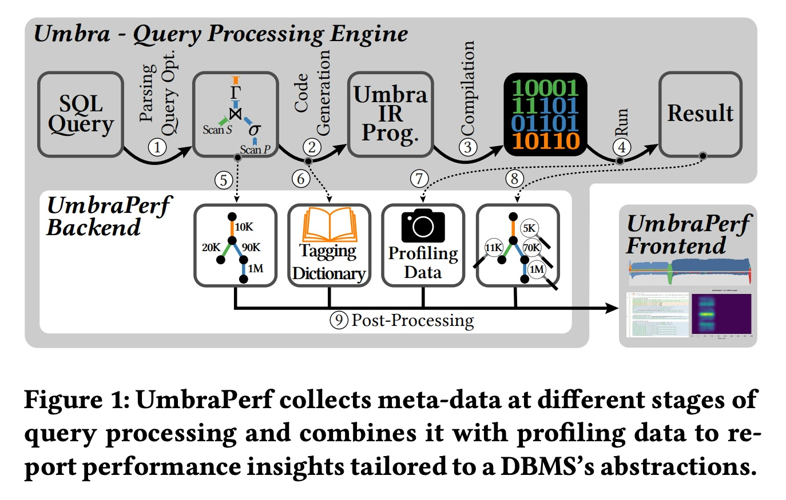
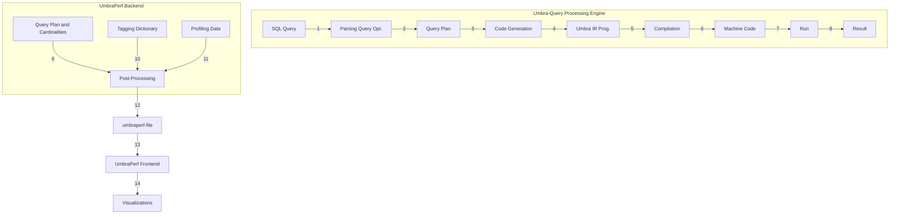
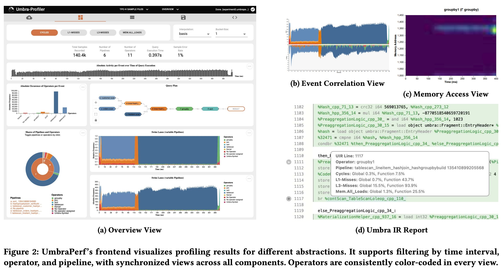
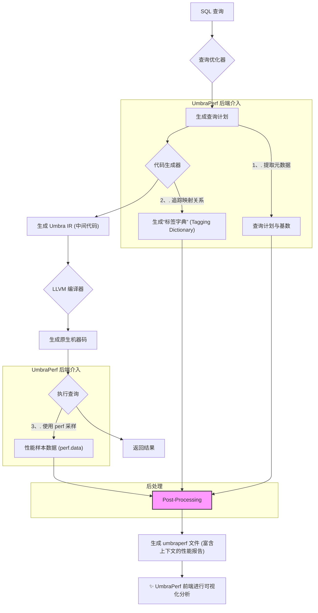
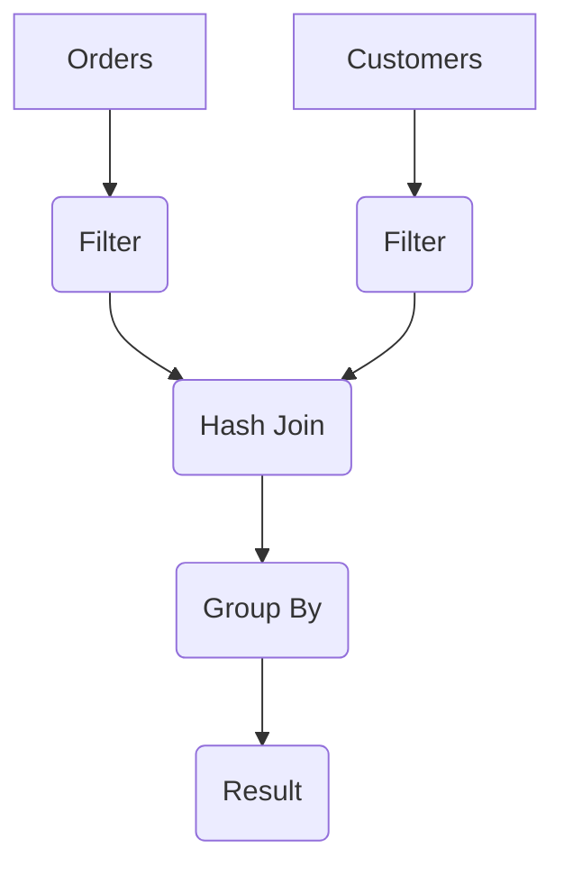

## AI论文解读 | UmbraPerf - Profiling Results Tailored for DBMS Developers
        
### 作者        
digoal        
        
### 日期        
2025-09-13        
        
### 标签        
PostgreSQL , PolarDB , DuckDB , AI , 论文解读        
        
----        
        
## 背景  
      
https://www.vldb.org/pvldb/vol18/p5291-beischl.pdf        
  
提示:          
```          
读懂《UmbraPerf - Profiling Results Tailored for DBMS Developers》这篇论文需要提前掌握哪些基础知识, 请使用中文通熟易懂的讲解这些基础知识, 可以引用论文中的图、表或使用Markdown支持的图形(text,mermaid等)增加解释性. 
  
使用中文通熟易懂的解读《UmbraPerf - Profiling Results Tailored for DBMS Developers》这篇论文, 其中的关键内容请着重讲解, 可以引用论文中的图、表或使用Markdown支持的图形(text,mermaid等)增加解释性. 
  
提取《UmbraPerf - Profiling Results Tailored for DBMS Developers》这篇论文中的重要术语, 使用中文对这些术语进行通熟易懂的讲解, 可以引用论文中的图、表或使用Markdown支持的图形(text,mermaid等)增加解释性. 
```     
  
## 1 前置知识 
  
这篇文章《UmbraPerf - Profiling Results Tailored for DBMS Developers》主要介绍了一个名为 **UmbraPerf** 的性能分析工具，它是专门为**代码生成型数据库管理系统 (DBMS)** 的开发者设计的 。要理解这篇论文，你需要先掌握以下几个核心概念：

### 1\. 数据库管理系统 (DBMS)

**数据库管理系统 (DBMS)** 简单来说就是管理数据库的软件，比如常见的MySQL、PostgreSQL。这篇论文讨论的是一类特殊的DBMS，叫做**代码生成型DBMS** 。

  * **传统DBMS**：像Postgres这种，它们通常使用预编译好的代码来执行用户查询。开发者对这些代码很熟悉，所以即使使用像 **Linux perf** 这样的通用性能分析工具，也能大致将性能结果（比如哪个函数耗时多）和数据库的组件联系起来 。
  * **代码生成型DBMS**：这篇论文介绍的 **Umbra** 就是其中一种 。这类系统在执行查询时，会为每个查询**动态生成并编译专门的机器码** 。这样做的优点是生成的代码高度优化，执行效率高 。但缺点也很明显：每次生成的代码都不一样，传统的性能分析工具很难把分析结果和数据库的抽象概念（比如查询计划中的“操作符”）对应起来 。

### 2\. 性能分析 (Profiling)

**性能分析**就是测量程序的运行情况，比如找出哪个部分最耗时、哪个部分消耗最多内存等 。这篇论文的重点就在于解决**代码生成型DBMS**的性能分析难题 。

  * **通用性能分析工具**：比如 **Linux perf**、**vTune** 。它们通常在**指令级别**或**函数级别**报告结果 。对于代码生成型DBMS来说，由于代码是动态生成的，这些工具的报告结果会变得难以理解，开发者无法直接将它们与数据库的**查询计划操作符**（比如“哈希连接”或“分组聚合”）联系起来 。

### 3\. 数据库查询执行的抽象概念

为了理解论文中的 **UmbraPerf** 工具，你需要知道数据库开发者在优化查询时通常会关注哪些概念 ：

  * **SQL查询**：用户输入的文本查询，比如 `SELECT * FROM Orders WHERE ...` 。
  * **查询计划 (Query Plan)**：DBMS 将 SQL 查询解析后生成的、表示查询执行步骤的“路线图” 。计划由多个**操作符 (Operators)** 组成 。
  * **操作符 (Operator)**：查询计划中的单个执行步骤，比如 **Scan** (扫描表)、**Join** (连接表)、**GroupBy** (分组) 。
  * **流水线 (Pipeline)**：在代码生成型DBMS中，为了提高效率，多个操作符会被“融合”在一起，形成一个紧密的执行流水线 。

**UmbraPerf** 的核心价值就在于它能够把底层的性能分析数据（比如**CPU周期**、**缓存未命中**等）**映射**到这些高层的数据库抽象概念上，比如某个操作符或流水线在执行过程中产生了多少次缓存未命中 。这让开发者可以直接看到“是哪个操作符出了问题”，从而快速定位和解决性能瓶颈 。

### 4\. 论文中UmbraPerf的架构和工作流程

要彻底理解UmbraPerf，最好看看论文中这张关键的架构图 **Figure 1** 。

  



UmbraPerf 的工作流程可以分为三个部分:

  * **后端 (Backend)**：当 **Umbra** 数据库执行一个查询时，**UmbraPerf 后端**会同步进行几件事 ：

      * **收集元数据**：在代码生成阶段，它会创建一个**标记字典 (Tagging Dictionary)**，记录每个查询操作符和生成的中间代码（Umbra IR）之间的对应关系 。这就像给每一段生成的代码贴上“标签”，表明它属于哪个操作符 。
      * **性能采样**：它使用 **Linux perf** 这样的工具，在查询执行时对程序进行采样，收集性能数据，比如 CPU 周期、缓存未命中等 。
      * **后处理**：执行完毕后，它把收集到的性能数据与之前创建的**标记字典**和**查询计划**结合起来，生成一个增强的 `umbraperf-file` 文件 。这个文件就包含了“哪个操作符在哪个时间段产生了多少次缓存未命中”这样的信息 。

  * **前端 (Frontend)**：这是一个交互式的**网页应用** 。开发者将 `umbraperf-file` 文件上传到这里，UmbraPerf 前端会实时处理数据并以多种视图（如图 **Figure 2** 所示）进行可视化 。   

  * **可视化视图**：UmbraPerf 的前端提供了多种视图，让开发者可以从高到低逐层深入分析问题 ：

      * **Overview View (概览)**：提供高层视图，比如哪个操作符占用了大部分执行时间 。
      * **Event Correlation View (事件关联)**：可以同时展示两种性能事件（比如 CPU 周期和缓存未命中）随时间的变化，帮助开发者发现它们之间的关联 。
      * **Memory Access Analysis (内存访问分析)**：用 X-Ray 图来可视化特定操作符的内存访问模式，帮助识别随机访问模式 。
      * **Umbra IR Report (Umbra IR 报告)**：这是最底层的视图，可以精确地看到每一条生成的机器指令对应的性能指标，并且这些指令仍然和其所属的操作符、流水线相关联 。

现在你对这篇论文有了基本的理解。你对哪一部分最感兴趣？比如，你想更深入了解它如何解决**操作符融合**带来的难题，还是想知道论文中提到的两个**具体应用场景**？

操作符融合（Operator Fusion）是代码生成型数据库管理系统（DBMS）中一种重要的优化技术，它能将多个操作符的功能集成到一个紧密的循环中，从而提升数据局部性和计算效率 。但正如论文所指出的，这种优化也带来了性能分析的难题，因为它模糊了操作符之间的界限，使得开发者难以将性能分析结果与原始的查询计划组件对应起来 。

UmbraPerf 解决了这一难题，其核心方法是**在查询编译过程中保留并关联不同抽象层级的信息** 。具体来说，它通过以下步骤实现：

---

### UmbraPerf 的解决方案

1.  **抽象跟踪（Abstraction Tracking）**：在代码生成阶段，UmbraPerf 会创建一个“标记字典（Tagging Dictionary）” 。这个字典的作用就像一个映射表，它记录了查询计划中的每一个**操作符**和它所对应的**Umbra IR 指令**之间的关系 。
2.  **寄存器标记（Register Tagging）**：UmbraPerf 还采用了寄存器标记技术，这有助于在有共享代码位置的情况下区分不同的操作符 。例如，哈希表实现在多个操作符（如哈希连接和分组）中可能会被复用，通过寄存器标记，UmbraPerf 能够分辨出这些共享代码的使用者 。
3.  **后处理（Post-processing）**：当查询执行完毕，UmbraPerf 会将通用性能分析工具（如 Linux `perf`）采集到的低层级性能数据（如 CPU 周期、缓存未命中）与前面生成的标记字典和查询计划进行关联 。这使得开发者能够查看每个操作符或流水线在不同性能事件上的具体表现 。

通过这个方法，UmbraPerf 成功地在性能分析数据和高层级的数据库抽象之间建立了桥梁 。开发者可以在其交互式前端中，从**查询计划**的高级视图  一路向下，无缝地钻取到**单个 Umbra IR 指令**的详细性能报告 ，即使这些指令是由多个融合的操作符生成的 。

---

为了更好地理解 UmbraPerf 的工作方式，你是否想了解论文中提到的两个具体场景？这些场景展示了 UmbraPerf 如何帮助开发者解决实际的性能问题，比如定位 L3 缓存未命中或评估新的优化方案。

好的，这篇论文中提到了两个具体的应用场景，展示了 UmbraPerf 如何帮助数据库开发者解决实际的性能问题。

### 场景一：识别优化机会

在这个场景中，一位名叫 Alice 的 DBMS 开发者想要优化一个运行缓慢的查询（TPC-H Query 3）。她使用 UmbraPerf 工具进行分析，并遵循以下步骤：

1.  **高层概览**：Alice 首先查看 **UmbraPerf 前端**的概览视图（Overview View），通过查询计划和时间轴图来了解哪些操作符是主要性能瓶颈 。
2.  **事件关联**：接着，她切换到事件关联视图（Event Correlation View），将不同的性能事件（如 CPU 周期、缓存未命中）进行对比。她观察到，`join 1` 和 `group by` 操作符导致了 L3 缓存未命中峰值 。
3.  **内存访问分析**：为了进一步调查，Alice 使用内存访问分析视图（Memory Access Analysis View）检查 `group by` 操作符的内存地址。她发现这些 L3 缓存未命中发生在与 `join 1` 相同的内存地址上 。
4.  **底层钻取**：最后，她进入 Umbra IR 报告（Umbra IR Report）视图，将分析范围过滤到 `join 1` 和 `group by` 操作符，并锁定在 L3 缓存未命中峰值发生的时间段。在这个最低的抽象层级上，她发现缓存未命中是由于 `join 1` 在构建 `l_orderkey` 的哈希表和 `group by` 在构建分组哈希表时重复操作造成的 。

通过 UmbraPerf，Alice 能够从高层概览逐步深入到具体的指令级别，精确地找到了性能瓶颈的根本原因，即重复构建哈希表 。

---

### 场景二：评估优化效果

在识别了问题后，Alice 实现了一个 **group-join** 优化来避免两次构建哈希表 。为了验证这个新优化的效果，她再次使用 UmbraPerf 对查询进行性能分析，并将新旧结果进行对比：

1.  **性能对比**：通过对比，她发现查询执行速度提升了 14% 。
2.  **验证效果**：UmbraPerf 的结果显示，L3 缓存未命中只在一次哈希表构建过程中发生，这正是她引入 `group-join` 所期望的效果 。
3.  **进一步调优**：在确认优化有效后，Alice 可以使用 UmbraPerf 的 Umbra IR 报告来进一步评估新操作符中每条生成指令的成本和指标，从而进行更细致的调优 。

这两个场景清晰地展示了 UmbraPerf 如何通过其多层级的可视化和强大的关联能力，帮助开发者有效地识别性能问题、验证优化效果并进行进一步的调优 。

---

你对 UmbraPerf 的哪一个可视化视图最感兴趣，比如它如何用泳道图（Swimlanes）展示操作符活动，或者你想更深入地了解 Umbra IR 报告是如何工作的？

UmbraPerf 使用泳道图（Swimlanes）来可视化查询执行过程中操作符随时间的变化活动 。

泳道图能够直观地展示以下信息 ：
* **时间序列**：图表的横轴表示查询执行时间 。
* **相对和绝对测量**：泳道图以相对（百分比）和绝对（样本数）两种方式，显示了在选定的性能事件下，操作符在不同时间点上的活动量 。
* **操作符交互**：通过泳道图，开发者可以清晰地看到不同操作符在时间上的重叠和交互，从而发现特定查询执行段中是否存在异常行为 。

总的来说，泳道图提供了一种直观的方式来评估单个操作符的实时性能和它们之间的动态关系 。

---

你对 UmbraPerf 的泳道图还有什么具体想了解的地方吗？比如，想知道它如何与时间间隔过滤功能配合使用，或者想看看论文中是否有具体的泳道图示例？
  
## 2 解读论文 
  
好的，我们来通俗易懂地解读一下《UmbraPerf - Profiling Results Tailored for DBMS Developers》这篇论文。

简单来说，这篇论文介绍了一个名为 **UmbraPerf** 的新型性能分析工具。它的核心目标是解决一个长期困扰数据库（DBMS）开发者的问题：**通用的性能分析工具（如 Linux perf）提供的数据太底层，开发者很难将这些数据与数据库自身的高层逻辑（比如查询计划中的某个操作）对应起来，从而难以快速定位和解决性能瓶瓶颈。** 

UmbraPerf 就像一个“高级翻译”，能把机器语言级别的性能数据，“翻译”成数据库开发者能听懂的“数据库语言”。

-----

### 核心痛点：为什么需要一个新的分析工具？

想象一下，你是一位数据库内核开发者，你发现某条 SQL 查询特别慢。你使用传统的性能分析工具（比如 `perf` 或 `vTune`）去检查，工具会告诉你：

> “在执行期间，有 50% 的 CPU 周期都花在了内存地址 `0x...` 到 `0x...` 的这段机器指令上。”

这个信息虽然精确，但对你来说用处有限。因为你关心的是：

  * 到底是 **哪个查询算子**（比如是 Hash Join 还是 Table Scan）这么耗时？
  * 如果是 Hash Join 算子，它是在构建哈希表，还是在探测（Probe）阶段慢？
  * 为什么会出现大量的缓存未命中（Cache Miss）？是哪个算子访问内存的方式有问题？

特别是对于像 Umbra 这样能为每条查询**动态生成和编译代码**的先进数据库 ，问题更加严重。因为每次查询运行的都是“一次性”的、高度优化的机器码，编译完成后，代码与原始查询计划之间的联系就彻底丢失了 。这就像给了你一张城市交通的拥堵热力图，却没有告诉你具体是哪条路、哪个路口堵车了。

UmbraPerf 就是为了解决这个“信息断层”而生的。

-----

### UmbraPerf 的解决方案：连接底层数据与高层抽象

UmbraPerf 的聪明之处在于，它在整个查询处理流程中，像侦探一样，一路跟踪并记录关键信息，最后将所有线索串联起来。它主要分为**后端**和**前端**两部分 。

#### 1\. 后端：数据收集与关联的“幕后英雄”

后端的任务是在不影响查询性能的前提下，收集所有必要的数据，并将它们关联起来。我们可以通过下面这个流程图来理解它的工作原理（该图是对论文中 Figure 1 的简化和解释）：

  



**关键步骤讲解:**

  * **① 提取查询计划：** 在查询被优化后，UmbraPerf 会先把这份最终的“作战蓝图”（物理查询计划）保存下来 。
  * **② 生成“标签字典” (Tagging Dictionary)：** 这是整个方案的**核心与精髓**。在数据库将查询计划转换为中间代码（Umbra IR）的过程中，UmbraPerf 会创建一个映射表 。这个表详细记录了：“这段代码（比如 `v1 = v2 + v3`）是属于哪个查询算子（如 `HashJoin_Node1`）的，并且属于哪一个执行管道（Pipeline）” 。这个字典就像一本密码本，保留了高层逻辑和底层代码之间的关联。
  * **③ `perf` 采样与后处理：** 当生成的机器码执行时，UmbraPerf 会启动 `perf` 在后台进行采样，收集 CPU 周期、缓存未命中等硬件事件 。查询结束后，它会利用 LLVM 编译器产生的调试信息，将机器指令的样本映射回 Umbra IR 指令 。然后，再用第二步的“标签字典”，将这些 IR 指令的性能数据精确地归属到对应的查询算子和管道上 。

最终，所有这些信息被打包成一个 `.umbraperf` 文件，这个文件里的每一条性能样本，都带有清晰的“身份标签”：它属于哪个算子，发生在什么时间。

#### 2\. 前端：交互式可视化分析的“驾驶舱”

前端是一个基于 Web 的交互式应用，它能解析 `.umbraperf` 文件，并通过多个视图，从不同维度和抽象层次展示性能数据 。

##### **(a) 概览视图 (Overview View)**

这是分析的起点，提供了查询执行的全局总览 。

fig.2a  

   

  * **时间线 (Timeline):** 显示不同时间段的性能事件数量，可以框选特定时间段进行深入分析 。
  * **查询计划图 (Operator Plan):** 可视化展示查询计划，将鼠标悬停在算子上，可以看到预估和实际的数据量，以及最耗时的几条指令 。
  * **成本分布图 (Operator & Pipeline Costs):** 通过条形图和旭日图，直观地看出哪个算子和管道是性能消耗的大户 。
  * **泳道图 (Swimlanes):** 展示了各个算子在整个执行过程中的活跃时间，可以清晰地看到哪些算子在并行执行，以及它们的活动模式 。

##### **(b) 事件关联视图 (Event Correlation View)**

这个视图允许你并排比较两种不同的性能事件（比如 CPU 周期和 L3 缓存未命中），帮助你发现它们之间的关联关系 。

fig.2b  

##### **(c) 内存访问视图 (Memory Access View)**

它用类似 X 光片的方式，将不同算子在不同时间的内存访问地址和模式可视化出来，对于诊断缓存问题、随机/顺序访问问题非常有效 。

fig.2c  

##### **(d) Umbra IR 报告 (Umbra IR Report)**

这是最底层的视图，类似于 `perf report`，但它展示的是 Umbra IR 级别的代码 。每一行代码都标注了它所属的算子和管道，以及详细的性能指标 。这使得开发者可以直接定位到是哪一行生成的代码导致了性能问题 。

fig.2d  

-----

### 实践案例：开发者 Alice 如何使用 UmbraPerf

论文通过一个生动的例子展示了 UmbraPerf 的威力 。

**场景一：发现性能瓶颈**
开发者 Alice 发现 TPC-H 的第 3 条查询很慢 。

1.  她在**概览视图**中发现 `join` 和 `group by` 这两个算子消耗了大量资源，尤其是在 L3 缓存未命中这个指标上出现了峰值 。
2.  她切换到**事件关联视图**，确认了 `group by` 算子在活跃度不高的情况下，却产生了大量的缓存未命中，这很不正常 。
3.  在**内存访问视图**中，她发现这些缓存未命中访问的内存地址，与之前 `join` 算子访问的地址重合 。
4.  最后，她在 **Umbra IR 报告**中深入挖掘，最终定位到问题根源：`join` 算子为 `l_orderkey` 字段建立了一个哈希表，紧接着 `group by` 算子又为同一个字段重复建立了一个哈希表。两次独立的建表操作导致了数据无法在缓存中有效复用，引发了大量缓存未命中 。

**场景二：评估优化效果**
Alice 针对性地实现了一个名为 `group-join` 的优化，这个优化可以在一次操作中同时完成 Join 和 Group By，避免了重复建表 。

1.  她再次使用 UmbraPerf 分析优化后的查询，在两个浏览器窗口中进行对比 。
2.  结果显示，查询执行速度提升了 **14%**，并且 L3 缓存未命中的问题也如预期一样消失了 。
3.  现在，她还可以继续使用 IR 报告，对新的 `group-join` 算子内部的指令进行微调，追求极致性能 。

这个案例完美地展示了 UmbraPerf 如何帮助开发者实现**快速、精准的“分析-定位-优化-验证”闭环** 。

### 总结

UmbraPerf 最大的贡献在于，它成功地在**底层硬件性能数据**和**高层数据库系统抽象**之间架起了一座桥梁 。通过在编译过程中巧妙地保留映射关系，并结合强大的交互式前端，它为代码生成式数据库的开发者提供了一套量身定制的、极其强大的性能分析工具，使他们能够更直观、更高效地进行性能调优 。
  
## 3 术语 
  
从《UmbraPerf - Profiling Results Tailored for DBMS Developers》这篇论文中，可以提取出几个重要的核心术语。理解这些术语是理解这篇论文的关键。

### 1\. 代码生成型数据库管理系统 (Code-generating DBMS)

这是论文讨论的**Umbra**所属的一类特殊数据库系统 。与传统的数据库系统不同，这类系统在执行查询时，不是使用预先写好的代码，而是会**动态地为每个查询生成高度优化的机器码** 。

**优点：** 能够针对特定查询进行深度优化，提高执行效率 。
**挑战：** 由于代码是动态生成的，每次执行的代码都不同，这使得传统的性能分析工具很难将结果与数据库的内部组件（如操作符）关联起来 。

### 2\. 查询计划操作符 (Query Plan Operator)

**查询计划**是数据库将 SQL 查询翻译成的一系列执行步骤，而**操作符**就是这些步骤的组成单元 。例如，`Scan`（扫描）、`Join`（连接）、`GroupBy`（分组）都是常见的操作符。在数据库开发者的日常工作中，查询计划操作符是他们进行优化的主要抽象概念 。



  * **Hash Join** 和 **Group By** 在这个例子中就是两个操作符。

### 3\. 操作符融合 (Operator Fusion)

这是代码生成型 DBMS 中一种重要的优化技术 。它将查询计划中多个逻辑上连续的操作符**融合**到一个单一的、紧密的执行循环中 。

**优点：** 减少了函数调用开销，并最大化了数据的 CPU 寄存器驻留时间，从而提升了数据局部性，带来了极高的性能 。
**挑战：** 融合操作模糊了不同操作符之间的界限 ，使得传统的性能分析工具无法分辨出紧密循环中的性能瓶颈具体属于哪个操作符 。UmbraPerf 的一个主要任务就是解决这个问题 。

### 4\. 抽象跟踪 (Abstraction Tracking)

这是 UmbraPerf 解决操作符融合难题的关键技术之一 。它指的是在查询编译过程中，UmbraPerf 会**跟踪并保留**从高级的**查询计划操作符**到低级的**Umbra IR（中间表示）指令**之间的映射关系 。这就像给每一段生成的代码都打上了“标签”，记录它属于哪个操作符和流水线 。

-----

为了更深入地了解 UmbraPerf 如何将这些概念联系起来，你对它的**架构**感兴趣吗？论文中的 **Figure 1** 详细描述了 UmbraPerf 的**后端**如何通过**元数据收集**和**后处理**来实现这一目标 。

  
  
## 参考        
         
https://www.vldb.org/pvldb/vol18/p5291-beischl.pdf    
        
<b> 以上内容基于DeepSeek、Qwen、Gemini及诸多AI生成, 轻微人工调整, 感谢杭州深度求索人工智能、阿里云、Google等公司. </b>        
        
<b> AI 生成的内容请自行辨别正确性, 当然也多了些许踩坑的乐趣, 毕竟冒险是每个男人的天性.  </b>        
  
    
#### [期望 PostgreSQL|开源PolarDB 增加什么功能?](https://github.com/digoal/blog/issues/76 "269ac3d1c492e938c0191101c7238216")
  
  
#### [PolarDB 开源数据库](https://openpolardb.com/home "57258f76c37864c6e6d23383d05714ea")
  
  
#### [PolarDB 学习图谱](https://www.aliyun.com/database/openpolardb/activity "8642f60e04ed0c814bf9cb9677976bd4")
  
  
#### [PostgreSQL 解决方案集合](../201706/20170601_02.md "40cff096e9ed7122c512b35d8561d9c8")
  
  
#### [德哥 / digoal's Github - 公益是一辈子的事.](https://github.com/digoal/blog/blob/master/README.md "22709685feb7cab07d30f30387f0a9ae")
  
  
#### [About 德哥](https://github.com/digoal/blog/blob/master/me/readme.md "a37735981e7704886ffd590565582dd0")
  
  

  
