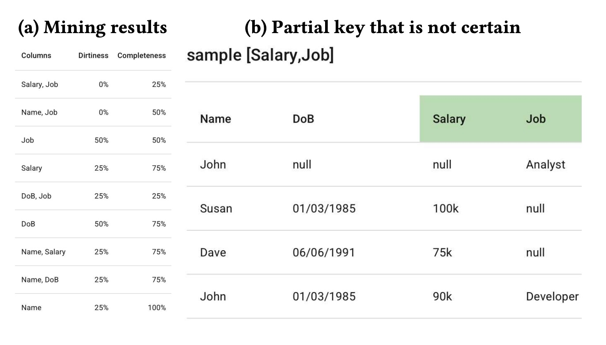

## AI论文解读 | Mining Meaningful Keys and Foreign Keys with High Precision and Recall
        
### 作者        
digoal        
        
### 日期        
2025-09-13        
        
### 标签        
PostgreSQL , PolarDB , DuckDB , AI , 论文解读        
        
----        
        
## 背景  
      
https://www.vldb.org/pvldb/vol18/p5363-link.pdf        
  
提示:          
```          
读懂《Mining Meaningful Keys and Foreign Keys with High Precision and Recall》这篇论文需要提前掌握哪些基础知识, 请使用中文通熟易懂的讲解这些基础知识, 可以引用论文中的图、表或使用Markdown支持的图形(text,mermaid等)增加解释性. 
  
使用中文通熟易懂的解读《Mining Meaningful Keys and Foreign Keys with High Precision and Recall》这篇论文, 其中的关键内容请着重讲解, 可以引用论文中的图、表或使用Markdown支持的图形(text,mermaid等)增加解释性. 
  
提取《Mining Meaningful Keys and Foreign Keys with High Precision and Recall》这篇论文中的重要术语, 使用中文对这些术语进行通熟易懂的讲解, 可以引用论文中的图、表或使用Markdown支持的图形(text,mermaid等)增加解释性. 
```     
  
## 1 前置知识 
  
好的，为了更好地理解《Mining Meaningful Keys and Foreign Keys with High Precision and Recall》这篇论文，你需要掌握以下几个关键的基础知识。

### 1. 实体-关系（E/R）模型和数据完整性

这篇论文的核心是**E/R Profiling**，它是传统E/R建模的“数据驱动”版本 。简单来说，E/R建模是数据库设计中用来描述现实世界实体（如“产品”、“客户”）和它们之间关系（如“销售”）的一种方法 。

* **实体完整性 (Entity Integrity)**：确保每个实体（表中的一行数据）都有一个唯一的标识符。在关系型数据库中，这个标识符就是**主键（Primary Key）**。主键必须唯一且不能包含空值（NULL）。
* **参照完整性 (Referential Integrity)**：确保表与表之间的关系是有效的。这通常通过 **外键（Foreign Key）** 来实现。外键是某个表中的一个字段，它引用另一个表中的主键。例如，在一个`Sales`（销售）表中，`customerID`字段可以作为外键，它引用`Customers`（客户）表中的`customerID`主键，从而保证每一笔销售记录都对应一个实际存在的客户。

论文中提到的 **E/R Profiling** 的任务，就是从现有的数据中自动识别出这些**业务规则（Business Rules）**，也就是主键和外键 。

### 2. 键（Keys）和依赖项（Dependencies）

在关系型数据库中，**键**是用来唯一标识表中记录的属性或属性集。

* **唯一性约束（Uniqueness Constraints - UCs）**：确保某列或某组列的值在整个表中是唯一的 。论文将这作为发现“键”的基础。
* **包含依赖（Inclusion Dependencies - INDs）**：如果表 A 中的某列或某组列的值都包含在表 B 中的某列或某组列中，那么就存在一个包含依赖。外键就是一种特殊的包含依赖 。

这篇论文的独特之处在于它引入了新的**键变体（Key variants）**，以处理数据中的空值（NULL）。这些变体形成了一个严格的层次结构，包括 **可能键（possible keys）** 、 **域键（domain keys）** 、 **部分键（partial keys）** 等 。

### 3. 数据挖掘中的精度（Precision）和召回率（Recall）

理解这篇论文最重要的概念是**精度**和**召回率**。论文的标题就强调了这两个指标，并且图2用一个维恩图清晰地展示了它们的作用 。   

* **R**：代表通过数据挖掘工具发现的**规则集合**（如唯一性约束和包含依赖）。
* **B**：代表数据中实际存在的、有意义的**业务规则集合**。

理想情况下，我们希望 R 和 B 是完全相同的，但现实中会存在差异，这正是需要处理的问题 。

* **真阳性（True Positives）**： $R \cap B$ 。这部分是工具发现的规则，并且它们确实是真正的业务规则。
* **假阳性（False Positives）**： $R - B$ 。这部分是工具发现的规则，但它们只是数据中**偶然出现**的唯一性或依赖关系，并不是真正的业务规则 。例如，在一张小表中，员工的姓氏可能恰好都是唯一的，但这并不是一个有意义的键。
* **假阴性（False Negatives）**： $B - R$ 。这部分是真正的业务规则，但工具却没有发现它们 。这通常是因为数据中存在不一致或缺失值（“脏数据”）导致的 。

---
### 4. 论文中的创新点

论文通过两个关键技术来提高精度和召回率：

* **正交性（Orthogonality）**：用来**减少假阳性（提高精度）**。该方法通过分析键中各列的数据分布，来区分“偶然形成的”键和“有意义的”键 。如果一个键的各个部分（列）之间是相互独立的，那么它更有可能是一个有意义的键。
* **近似（Approximation）**：用来**减少假阴性（提高召回率）**。这允许工具发现那些由于脏数据（如空值或重复项）而不能严格满足唯一性或包含依赖的规则 。通过设置一个 **“脏度阈值”（dirtiness threshold）** ，工具可以接受一定比例的违反，从而发现那些“近似正确”的业务规则 。

### 5. 论文中的其他概念

* **arity (arity)**: 在数学和计算机科学中，"arity"指的是一个函数或操作符所接受的参数或操作数的数量。在论文中，"arity"是指一个键（例如，一个唯一约束或一个包含依赖）所包含的列的数量 。

* **completeness (completeness)**: 论文中定义的"completeness ratio"（完整性比率）是指一个键的字段中不包含空值的记录所占的百分比 。当完整性设置为100%时，所有记录在键字段中都不能有空值。

---

希望这些解释能帮助你更好地理解论文内容。

为了进一步深入，你希望我们重点讨论哪一部分内容？例如：

* **详细解释**正交性（orthogonality）是如何工作的？
* **探讨**近似（approximation）如何帮助发现被脏数据破坏的业务规则？
* **分析**论文中提到的不同键变体（key variants）的层次结构？

您好，正交性是这篇论文中一个非常重要的概念，它主要用来解决**假阳性（false positives）**的问题，从而**提高数据分析的精确度（precision）**。

### 正交性如何工作？

简单来说，正交性帮助我们区分那些偶然产生的、无意义的键和那些真正有意义的业务键。

* **无意义的偶然键（Accidental Keys）**: 想象一下一个包含员工数据的表格，其中包含员工ID、姓名、入职日期、生日等信息。如果这个表格只包含非常少的记录，那么可能出现这样的情况：每个员工的姓氏都碰巧是唯一的。此时，姓氏列可以作为“键”，但它并不是一个有意义的业务规则。这种偶然形成的键就是“假阳性”。论文指出，当一个键的列数足够多时，任意两条记录都可能在某一列上有所不同，从而导致键的偶然形成 。

* **有意义的业务键（Meaningful Keys）**: 相比之下，一个有意义的键，比如一个由`CustomerID`和`ProductID`组成的复合键，其各个部分（`CustomerID`和`ProductID`）的唯一性是业务逻辑所决定的，而不是偶然的巧合。

正交性的核心思想是，**通过分析一个键中各个列的数据分布，来判断这个键是偶然形成的还是有意义的** 。具体来说，如果一个键的各个组成部分（比如一个复合键中的各个列）之间没有显著的关联性（即它们是“反相关”的或“正交”的），那么这个键更有可能是偶然形成的 。例如，如果一个复合键中的两列各自都倾向于包含唯一值，那么它们组合起来形成一个键的可能性就很高，这可能是一个偶然的巧合。相反，一个有意义的键，其组成列的数据分布可能不会那么“巧合”。

### 实际应用

论文指出，在进行近似键挖掘时，会产生大量的假阳性，而正交性对于处理这些假阳性至关重要 。通过设置不同的正交性级别，用户可以控制挖掘结果的精确度。例如，在对TPC-H数据集进行分析时，如果不使用正交性（正交性级别0），工具需要115秒才能挖掘出696个满足条件的约束；而当正交性级别设为最高（9）时，大多数假阳性被移除，工具仅用13秒就返回了25个候选键 。这个例子清晰地展示了正交性在提高精确度和减少分析时间方面的作用 。

---

您想进一步了解正交性是如何在算法层面实现的，还是对论文中提到的其他参数，比如“脏度（dirtiness）”和“完整性（completeness）”，更感兴趣？

近似（approximation）在数据分析中扮演着至关重要的角色，它能够帮助我们发现那些因为存在脏数据（dirty data）而无法被传统方法识别出来的、但仍然具有实际意义的业务规则。

### 为什么需要近似？

在现实世界的数据中，完美的数据集是罕见的。数据中经常包含各种不一致性、缺失值（nulls）或输入错误，这些问题都可能破坏严格的业务规则。例如，一个本应唯一的客户ID字段可能因为数据录入错误而出现重复。一个本应作为外键的字段，可能因为某些记录缺失了引用表中的对应值而无法形成严格的包含依赖。在这些情况下，传统的严格数据挖掘算法会直接忽略这些规则，将它们标记为无效，从而产生**假阴性（false negatives）** 。

### 近似如何工作？

近似的核心思想是引入一个可容忍的“脏度阈值”（dirtiness ratio）。这个阈值允许我们在一定比例的记录违反规则的情况下，仍然认为该规则是“近似有效”的 。

**以键（keys）的发现为例：**

  * **无近似：** 如果一个字段被定义为唯一的，但数据中哪怕只有一条记录是重复的，传统的严格唯一性约束挖掘算法就会判定该字段不是一个键。
  * **有近似：** 论文中的新一代 E/R 分析器允许用户设定一个**脏度阈值**，例如10% 。这意味着，即使一个字段有10%的记录违反了唯一性，工具仍然可以将其识别为一个“近似键” 。通过这种方式，它能够发现那些因为一小部分脏数据而“隐藏”起来的、实际上有意义的业务规则，从而提高了**召回率（recall）** 。

**以包含依赖（inclusion dependencies）的发现为例：**

  * 同样地，在发现外键时，如果一个本应是外键的列中存在一些值在主表（被引用表）中不存在，传统的严格外键发现方法会失败 。
  * 使用近似，我们可以设定一个**覆盖阈值（coverage threshold）** 。例如，如果设定30%的覆盖率，那么即使一些值在主表中找不到，只要有足够多的记录满足包含关系，工具仍然可以将其识别为潜在的外键。

通过这种方式，近似挖掘将数据质量挑战转变为发现有意义约束的机会 。用户可以分析这些“近似”规则，通过查看违例的示例数据来理解问题所在，并决定这是否是一个需要修复的、有意义的业务规则 。

-----

### 举例说明

以下是论文中提到的一个例子，它展示了如何通过近似发现“脏”的外键 ：

在某个数据集中，存在一个有意义的外键，但是由于数据不一致，该外键在一些记录中引用了不存在的值。


  * **无近似**：传统的严格算法会因为`Orders`表中存在违反参照完整性的记录而无法识别出`CustomerID`列是外键。
  * **有近似**：通过设置一个非零的脏度阈值，工具可以发现`CustomerID`是一个“近似”外键，并将其作为候选结果返回。用户可以进一步检查这些不一致的记录，从而发现数据质量问题 。

您是否想了解论文中提到的其他关键参数，比如完整性（completeness）、键的变体（key variants）和它们的层次结构？

在论文中，作者提出了一系列新的**键变体（key variants）**，用以处理数据中的空值（nulls）或不完整实体（incomplete entities）。这些变体形成了一个严格的层次结构，可以更精细地识别出不同程度的“键”。

这个层次结构从最严格的**候选键**开始，逐层放宽对空值的要求，直到最宽松的**可能键**。

### 键变体的层次结构

1.  **候选键（Candidate Key）**
    这是最严格的键，等同于传统数据库理论中的定义。一个候选键必须是**唯一的**（uniqueness）并且是**最小的**（minimality）。这意味着它不能包含空值，且不能移除任何一个列而不破坏唯一性。所有其他键变体都是以候选键作为基准。

2.  **域键（Domain Key）**
    域键允许空值存在，但要求非空值的子集必须是唯一的。

3.  **确定键（Certain Key）**
    确定键比域键更进一步。它允许空值，但有一个关键的要求：在所有可能的“空值填充”（null imputation）中，该键必须保持唯一性。也就是说，无论你如何用非空值替换空值，键的唯一性都不能被破坏。

4.  **部分键（Partial Key）**
    部分键是针对不完整实体设计的。它允许空值，并且不要求非空值是唯一的。如图8b所示，`(Job, Salary)`可以是一个部分键，因为它满足“没有两条不同的记录部分匹配”的条件。然而，它并不是一个确定键，因为当你用非空值替换空值时，可能会导致唯一性被破坏（例如，当John的`null`被`100k`替换，Susan的`null`被`Analyst`替换时，会形成一个可能的“世界”，其中不同的实体具有相同的`job`和`salary`）。   

5.  **可能键（Possible Key）**
    这是最宽松的键变体。它类似于 SQL 中的 `UNIQUE` 约束，允许空值的存在，但对空值的唯一性不做任何限制。这意味着如果有多行记录的某列或某几列都为空，它们仍然被认为是唯一的。

这个层次结构允许用户根据数据中空值的普遍性和业务需求，选择最合适的键变体进行挖掘。例如，如果数据的完整性很高，用户可以只关注候选键；而如果数据存在大量缺失，则部分键或可能键会更有意义。

---
您想了解一下这个层次结构是如何帮助用户发现不同类型的业务规则的吗？
  
## 2 解读论文 
  
好的，這就為您通俗易懂地解讀這篇名為《以高精準度和召回率挖掘有意義的鍵和外鍵》的論文。

-----

### 論文核心思想：做一名聰明的大數據偵探

您可以將這篇論文描述的工具想像成一位高級的「數據偵探」。在龐大的數據倉庫（就像一座城市）裡，隱藏著很多不成文的「規則」（Business Rules），比如「每個市民的身份證號碼都是獨一無二的」（這就是「主鍵」），或者「每張訂單上的客戶編號，都必須能在客戶名單裡找到」（這就是「外鍵」）。

傳統的數據分析工具就像一個新手偵探，要麼找出太多無關緊 calendario的「巧合」（比如，碰巧某個小區裡，沒有人的身高和體重是完全一樣的，但這並不是一條真正的規則），要麼因為數據有些髒污或缺漏（比如，某個人的身份證號碼印錯了），就錯過了真正的規則。

這篇論文介紹的「下一代實體/關係分析器 (Next-gen E/R Profiler)」工具，就是為了**又準又全**地找出這些真正有意義的規則，讓數據管理和分析變得更高效、更可信。

### 關鍵挑戰與論文的解決方案

論文的核心圍繞解決數據挖掘中的一對經典矛盾：**精準度 (Precision)** 與 **召回率 (Recall)**。我們可以透過下圖來理解這個概念 。


  * **真陽性 (True Positives)**: 機器找到的規則，確實是真實的業務規則 。這是我們想要的結果。
  * **假陽性 (False Positives)**: 機器找到的規則，在當前數據中碰巧成立，但並不是有意義的業務規則 。例如，在一個小公司，可能`{出生年份, 辦公室樓層}` 碰巧能唯一識別每個員工，但這顯然不是一個穩定的、有意義的規則。這會干擾我們的分析，降低**精準度**。
  * **假陰性 (False Negatives)**: 這些是真實的業務規則，但因為數據存在錯誤或缺失，機器沒能把它們找出來 。例如，「訂單號」本應是唯一的，但因為有兩筆重複錄入的訂單，導致機器認為這條規則不成立。這會讓我們錯過重要的信息，降低**召回率**。

#### 關鍵內容 1：用「正交性 (Orthogonality)」提升精準度

這是該論文最重要的一個創新點。

  * **問題**: 為什麼會有很多「假陽性」的規則？因為當你組合的數據列足夠多時，任何兩條紀錄幾乎總能在某一列上找到差異，從而碰巧構成了「唯一鍵」 。
  * **核心思想**: 論文作者提出，有意義的鍵（如學號、訂單ID）和偶然形成的鍵，其內部數據分佈模式是不同的 。**正交性**就是一種用來衡量這種差異的數學方法，它幫助工具區分「精心設計的規則」和「隨機的巧合」 。
  * **效果**: 在論文的實驗中，效果非常驚人。
      * 在一個名為「Hockey」的數據庫上，不使用正交性時，工具花費近7分鐘找到了1029個候選鍵 。
      * 而啟用最高級別的正交性後，僅用**2秒鐘**就將範圍縮小到**37個**更有意義的候選鍵 。這極大地排除了噪音，提高了挖掘的**精準度**和效率。

#### 關鍵內容 2：用「近似挖掘 (Approximation)」提升召回率

  * **問題**: 真實世界的數據往往是不完美的，充滿了重複、錯誤和遺漏。嚴格的挖掘算法會因為幾條「髒數據」而把一條本應成立的重要規則給否定掉（即「假陰性」）。
  * **核心思想**: 工具允許使用者設定一個「**髒數據容忍度 (Dirtiness Threshold)**」 。比如，設定為1%。這意味著，如果某個候選鍵在99%的數據上都成立，只有不到1%的數據違反了規則，那麼工具依然會將其作為一個「近似鍵」報告出來 。
  * **效果**: 這種方法讓偵探（工具）不會因為一點小瑕疵就放棄一條重要的線索。它幫助使用者在不完美的數據中，依然能「召回」那些被數據質量問題所掩盖的真實業務規則，從而提升**召回率** 。

### 新一代E/R分析器是如何工作的？

使用者可以像調整儀器一樣，通過設置一系列參數來控制挖掘的過程和結果 。

**控制 E/R 分析的關鍵參數**

| 參數 (Parameter) | 控制的維度 | 通俗解釋 |
| :--- | :--- | :--- |
| **key variant (鍵變體)** | 如何識別包含空值(null)的實體  | 數據中經常有缺失值，這個參數決定了如何處理這些不完整的數據來識別實體 。 |
| **arity (維度)** | 列的可擴展性  | 你想找的鍵最多由幾個字段組成？比如設置為3，工具就只會查找由1、2或3個字段組合的鍵 。 |
| **dirtiness (髒數據容忍度)** | **召回率 (recall)**  | 你能容忍多大比例的數據違反規則？這是實現「近似挖掘」的關鍵 。 |
| **orthogonality (正交性)** | **精準度 (precision)**  | 用於過濾巧合規則的篩選器有多嚴格？級別越高，找到的規則越可能是真正有意義的 。 |
| **completeness (完整度)** | 實體完整性的範圍  | 要求候選鍵的字段在多大比例的數據行中是不能有空值的 。 |

整個工作流程是迭代式的：用戶連接數據源，設定參數進行挖掘，然後在瀏覽界面分析結果，並通過查看數據樣本來驗證某條規則是否有意義，之後再調整參數進行新一輪的挖掘，直到找到滿意的業務規則 。

### 論文的價值與影響

這篇論文的貢獻在於，它不僅僅是提出了一個理論，而是展示了一個實用的工具和方法論，它通過以下方式，極大地提升了數據分析的效率和質量：

1.  **自動化與人機互動的結合**: 工具極大地自動化了繁瑣的規則發現過程，同時又提供了豐富的交互界面和參數，讓數據分析師、架構師和工程師能深入理解和驗證數據背後的邏輯 。
2.  **應對不完美的真實數據**: 通過創新的「正交性」和「近似挖掘」概念，有效解決了現實世界中數據挖掘最頭痛的「噪音」和「髒數據」問題 。
3.  **提升下游數據任務的價值**: 準確地找出主鍵和外鍵，是數據庫設計、數據整合、數據清洗、查詢優化和建立可信報告的基石 。這個工具的產出可以直接賦能這些關鍵任務，最終幫助企業從數據中獲得更準確、更深刻的洞察。

總而言之，這篇論文展示的工具就像是為數據偵探配備了「放大鏡」（近似挖掘）和「偽裝識別器」（正交性），讓他能夠在複雜、混亂的數據場景中，快速、準確地找到真正的「案件線索」（業務規則）。
  
## 3 术语 
  
《Mining Meaningful Keys and Foreign Keys with High Precision and Recall》这篇论文中包含一些重要的术语，理解它们是掌握全文内容的关键。下面我将用通俗易懂的方式对这些术语进行解释。

### 1\. E/R Profiling (实体/关系画像)

**E/R Profiling**是一项任务，旨在从给定的数据仓库中识别出管理实体和参照完整性的业务规则 。简单来说，它就像一个数据侦探，通过分析现有数据来自动找出数据中的**主键（Keys）和外键（Foreign Keys）** 。这与传统的 **E/R建模（E/R Modeling）** 不同，后者需要手动设计数据模型 。E/R画像是E/R建模的“数据驱动”对应物 。

### 2\. 精度 (Precision) 与 召回率 (Recall)

这两个术语是衡量数据画像工具有效性的核心指标。论文中用一个维恩图（图1和图2）清晰地解释了它们之间的关系 。

      


  * **R**: 指的是工具从数据中挖掘出的**所有规则**（如唯一性约束和包含依赖）。
  * **B**: 指的是数据中**真正有意义的业务规则** 。

理想情况下， $R$ 应该等于 $B$ ，但现实中总是存在差异 。

  * **真阳性 ($R \\cap B$)**: 指的是工具正确发现的、同时也是真正有意义的业务规则 。
  * **假阳性 ($R - B$)**: 指的是工具发现的规则，但它们只是数据中的**偶然巧合**，并非真正的业务规则 。例如，在一张小表中，员工的姓氏可能碰巧都是唯一的，但这不构成一个有意义的键。**正交性**就是用来减少这类假阳性，从而提高**精度** 。
  * **假阴性 ($B - R$)**: 指的是数据中真实存在的业务规则，但由于数据不完整或不一致（即“脏数据”）而没有被工具发现 。**近似**就是用来减少这类假阴性，从而提高**召回率** 。

-----

### 3\. 正交性 (Orthogonality)

**正交性**是论文提出的一个核心概念，用来提高**精度** 。它通过评估一个键中各列之间的数据分布相关性来区分**有意义的键**和**偶然形成的键** 。直观地说，如果一个复合键的各列数据分布是相互独立的，那么它很可能是偶然形成的，而不是由业务逻辑驱动的 。通过设置不同的正交性级别（如图4和图8所示），用户可以控制挖掘结果的精确度 。论文中的一个例子表明，在TPC-H数据集上，将正交性从0提高到9可以大幅减少假阳性，并将挖掘时间从115秒缩短至13秒 。

  

  

### 4\. 近似 (Approximation)

**近似**是另一个核心概念，它通过允许一定的**脏度（dirtiness）来处理不完整和不一致的数据 。脏度阈值指的是一个键中需要删除才能使其成为有效键的记录的百分比 。通过设置非零的脏度阈值，工具可以发现那些因脏数据而未能严格满足规则的“近似”键 。这大大提高了召回率**，帮助用户发现那些被数据质量问题所掩盖的真实业务规则 。

### 5\. 键变体 (Key Variants)

这篇论文引入了一个**严格的键变体层次结构**，以处理数据中的空值（nulls）问题 。这个层次结构让用户可以根据数据的完整性选择不同的键类型进行分析，从最严格到最宽松依次为：

  * **候选键（Candidate Key）**: 必须是唯一的且没有空值。
  * **确定键（Certain Key）**: 允许空值，但其唯一性在所有可能的空值填充方案中都必须保持。
  * **部分键（Partial Key）**: 允许空值，并且不要求非空值部分是唯一的，只要没有两条不同的记录部分匹配即可。
  * **可能键（Possible Key）**: 最宽松，允许空值，并且对空值的唯一性不做任何限制，类似于SQL中的`UNIQUE`约束。

-----

希望这些解释对您有所帮助。您是否对论文中提到的**采样方法**，或者**如何利用这些工具发现新的业务洞见**感兴趣呢？
  
## 参考        
         
https://www.vldb.org/pvldb/vol18/p5363-link.pdf    
        
<b> 以上内容基于DeepSeek、Qwen、Gemini及诸多AI生成, 轻微人工调整, 感谢杭州深度求索人工智能、阿里云、Google等公司. </b>        
        
<b> AI 生成的内容请自行辨别正确性, 当然也多了些许踩坑的乐趣, 毕竟冒险是每个男人的天性.  </b>        
  
    
#### [期望 PostgreSQL|开源PolarDB 增加什么功能?](https://github.com/digoal/blog/issues/76 "269ac3d1c492e938c0191101c7238216")
  
  
#### [PolarDB 开源数据库](https://openpolardb.com/home "57258f76c37864c6e6d23383d05714ea")
  
  
#### [PolarDB 学习图谱](https://www.aliyun.com/database/openpolardb/activity "8642f60e04ed0c814bf9cb9677976bd4")
  
  
#### [PostgreSQL 解决方案集合](../201706/20170601_02.md "40cff096e9ed7122c512b35d8561d9c8")
  
  
#### [德哥 / digoal's Github - 公益是一辈子的事.](https://github.com/digoal/blog/blob/master/README.md "22709685feb7cab07d30f30387f0a9ae")
  
  
#### [About 德哥](https://github.com/digoal/blog/blob/master/me/readme.md "a37735981e7704886ffd590565582dd0")
  
  

  
