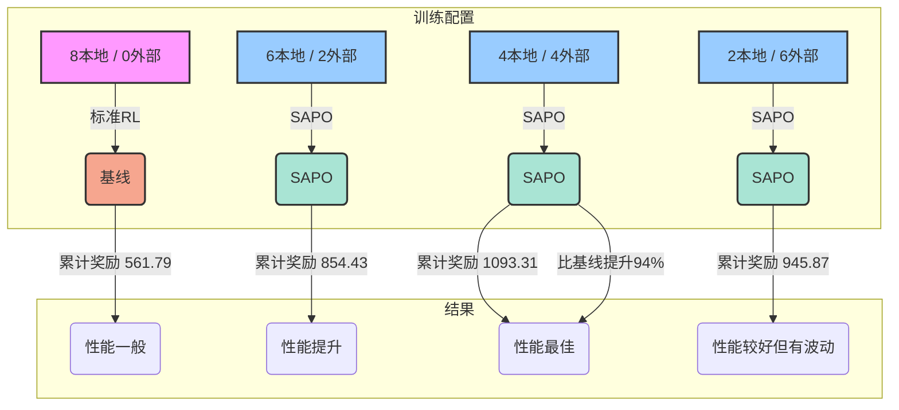
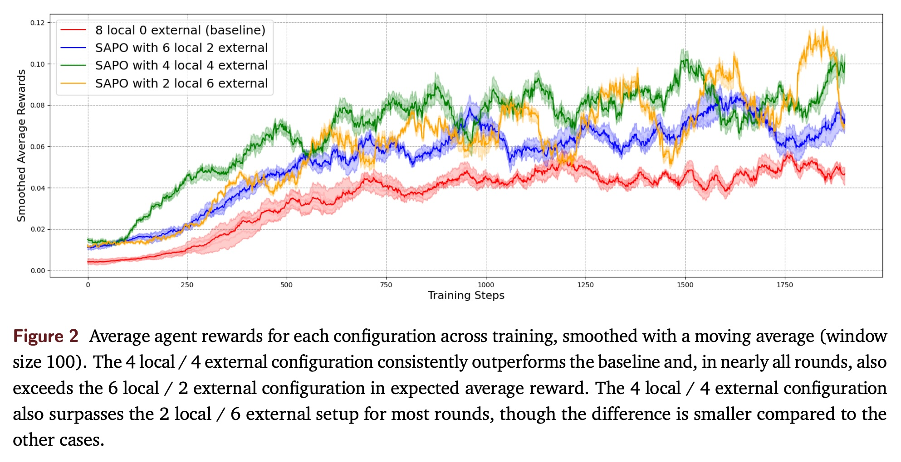
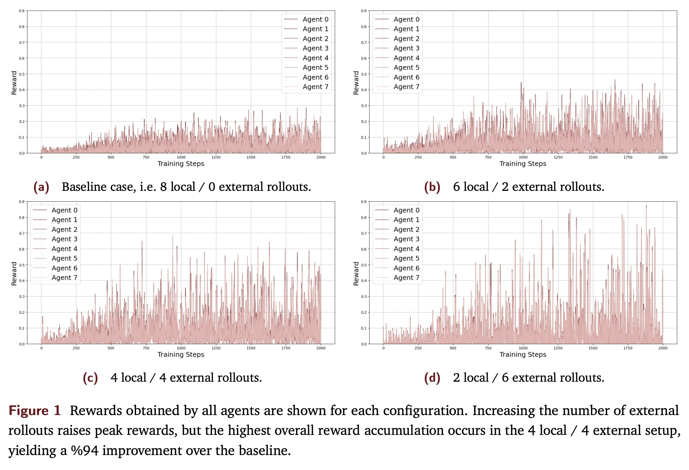
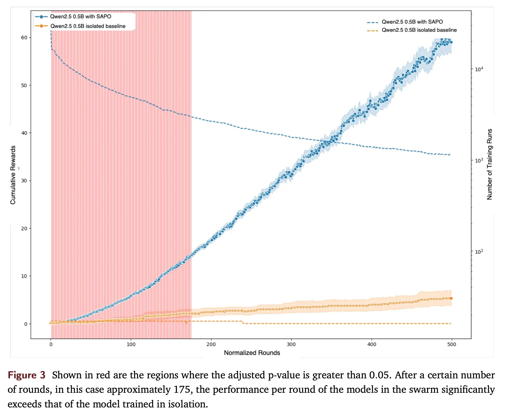
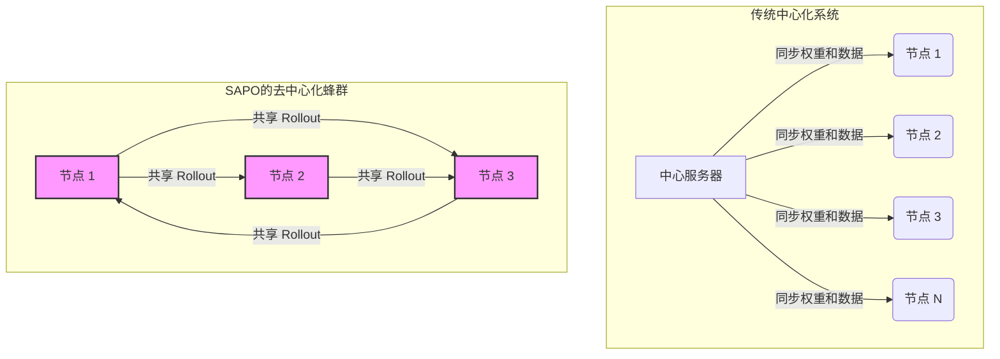

## AI论文解读 | Sharing is Caring: Efficient LM Post-Training with Collective RL Experience Sharing
        
### 作者        
digoal        
        
### 日期        
2025-09-13        
        
### 标签        
PostgreSQL , PolarDB , DuckDB , AI , 论文解读        
        
----        
        
## 背景  
      
https://arxiv.org/pdf/2509.08721        
  
提示:          
```          
读懂《Sharing is Caring: Efficient LM Post-Training with Collective RL Experience Sharing》这篇论文需要提前掌握哪些基础知识, 请使用中文通熟易懂的讲解这些基础知识, 可以引用论文中的图、表或使用Markdown支持的图形(text,mermaid等)增加解释性. 
  
使用中文通熟易懂的解读《Sharing is Caring: Efficient LM Post-Training with Collective RL Experience Sharing》这篇论文, 其中的关键内容请着重讲解, 可以引用论文中的图、表或使用Markdown支持的图形(text,mermaid等)增加解释性. 
  
提取《Sharing is Caring: Efficient LM Post-Training with Collective RL Experience Sharing》这篇论文中的重要术语, 使用中文对这些术语进行通熟易懂的讲解, 可以引用论文中的图、表或使用Markdown支持的图形(text,mermaid等)增加解释性. 
```     
  
## 1 前置知识 
  
为了理解这篇名为《Sharing is Caring: Efficient LM Post-Training with Collective RL Experience Sharing》的论文，你需要掌握以下几个关键的基础知识。我会用通俗易懂的方式为你讲解，并引用论文内容来帮助你理解。

### 1\. 语言模型（LMs）

首先，你需要知道什么是**语言模型**（LMs）。简单来说，语言模型是一种能够理解和生成人类语言的AI模型，就像我们平时使用的ChatGPT、文心一言等。这篇论文关注的是如何让这些模型在预训练之后，通过进一步的训练来提升它们的复杂推理能力，也就是所谓的 **“后训练”** （post-training） 。

-----

### 2\. 强化学习（RL）

理解这篇论文的核心，就必须了解**强化学习**（Reinforcement Learning, RL）。这是一种让AI通过 **“试错”** 来学习的训练方法 。

你可以想象一个小狗学习听从指令。当你让它“坐下”，它坐下后你给它一块零食，这就是**奖励**（Reward）。如果它没坐下，你没有给零食，它就会意识到这个行为没有奖励。通过不断重复这个过程，小狗就能学会“坐下”这个指令。

在论文中，强化学习就是让语言模型像这只小狗一样，通过完成任务并获得奖励来提升自己的能力 。论文特别提到了两种常见的RL方法：

  * **RLHF（Reinforcement Learning from Human Feedback）**：从人类反馈中进行强化学习 。这就像人类给AI的回答打分，好的回答得高分，不好的得低分。AI根据这些分数来调整自己的行为。
  * **RLVR（Reinforcement Learning with Verifiable Rewards）**：利用可验证的奖励进行强化学习 。这篇论文的实验就是用的这种方法 。这种方法的奖励是**程序化**的、**有规则**的，而不是依赖人类打分 。比如，对于一个数学问题，如果模型的回答是正确的，它就得到1分的奖励，否则得到0分 。论文实验中使用的**ReasoningGYM**数据集就提供了这种可以自动检查答案的验证器 。

-----

### 3\. 分布式系统与中心化/去中心化网络

这篇论文提出的新算法**SAPO**（Swarm sAmpling Policy Optimization）是为**去中心化**网络设计的 。要理解它，你需要先了解**中心化**和**去中心化**系统的区别。

  * **中心化系统**：所有参与训练的AI模型（论文里称为 **“策略”** 或 **“节点”** ）都需要与一个中心服务器保持同步，共享模型权重 。这就像一个公司所有员工都必须把自己的工作进度实时汇报给唯一的总监，才能继续工作。这种方式虽然有效，但成本高昂，容易出现通信瓶颈，并且需要精密的工程基础设施来维护稳定 。论文提到的大多数现有方法都属于这一类 。
  * **去中心化网络（Swarm）**：论文把这种去中心化网络称为 **“蜂群”** （swarm） 。在这个网络里，每个节点都是独立的，它们有自己的模型，不需要与其他节点保持同步 。你可以想象每个员工都独立完成自己的任务，然后把结果（**rollouts**）分享到公共区域，其他员工可以随时取用这些结果来学习。这种方式避免了中心化系统的诸多问题，并且能让使用不同硬件、不同模型的节点参与进来 。

SAPO算法的核心思想就是让这些独立的节点通过 **“共享”** 它们的 **“rollouts”** （可以理解为模型在解决问题时产生的数据，比如回答和相关信息 ）来互相学习。论文强调，这种共享是 **轻量级** 的，因为共享的是解码后的文本数据，而不是模型权重 。

-----

### 4\. SAPO算法的核心概念

SAPO（Swarm sAmpling Policy Optimization）这个名字本身就揭示了它的工作原理。

  * **Swarm（蜂群）**：正如前面所说，它代表了一个由独立节点组成的去中心化网络 。
  * **Sampling（采样）**：这是SAPO的关键步骤 。每个节点在训练时，会从两个地方 **“采样”** 数据来更新自己的模型:
    1.  **本地数据（Local rollouts）**：节点自己生成的任务数据 。
    2.  **外部数据（External rollouts）**：从网络中的其他节点共享的数据池中采样 。

通过这种方式，即使一个节点遇到了一个很好的解决方案（论文里称之为 **“Aha moment”** ），这个“灵光一闪”也能迅速在整个网络中传播，让所有节点都从中受益，从而加速学习过程 。

论文的实验结果很好地说明了这一点。作者测试了四种不同的本地/外部数据配比，结果显示：



从上图和论文的图2可以看出，**4本地 / 4外部**的配置表现最好，比基线（无共享）提升了94% 。这证明了适当的经验共享能带来巨大的性能提升。但过度依赖外部数据（比如2本地 / 6外部）则可能导致性能波动，甚至会“忘记”之前学到的东西 。

  

总而言之，理解这篇论文的关键在于：

  * **什么是语言模型**，以及为什么需要**后训练**。
  * **强化学习**如何通过**试错**和**奖励**来改进模型。
  * **去中心化**的 **“蜂群”** 网络如何克服传统中心化系统的弊端。
  * **SAPO**算法如何通过**本地采样**和**外部采样**相结合的方式，让模型在**去中心化网络**中高效地进行**协作学习**。
  
## 2 解读论文 
  
好的,我们来通俗易懂地解读一下这篇名为《Sharing is Caring: Efficient LM Post-Training with Collective RL Experience Sharing》(分享即关怀:通过集体强化学习经验共享实现高效的语言模型后训练)的论文。

这篇论文的核心思想是,与其让单个语言模型闭门造车式地学习,不如让成千上万个模型组成一个“蜂群(swarm)”,互相分享学习经验,从而让大家一起更快地进步。为此,研究人员提出了一种名为**SAPO (Swarm sAmpling Policy Optimization, 蜂群采样策略优化)** 的全新算法 。

-----

### 1\. 为什么需要 SAPO？传统方法的痛点

在语言模型(LM)完成基础的预训练后,我们通常希望通过“后训练”(post-training)来提升它在特定方面的能力,比如复杂的逻辑推理。强化学习(RL)是一种非常有效的方法,它让模型像人一样通过“试错”来学习,而不是仅仅依赖于现成的标准答案 。

但是,传统的强化学习方法在规模化应用时面临着巨大的挑战:

  * **成本高昂**: 需要大型的、集中的GPU集群,非常烧钱 。
  * **技术复杂**: 为了让集群中的所有模型保持同步,需要解决延迟、内存和通信瓶颈等一系列棘手的技术问题 。
  * **硬件要求高**: 通常要求硬件配置统一,不够灵活。

SAPO的出现,就是为了解决这些问题。

### 2\. SAPO 的核心理念: 去中心化的“经验共享”

SAPO 是一种完全**去中心化**和**异步**的强化学习算法 。想象一个由成千上万台普通电脑(比如你我的MacBook)组成的网络,这就是一个“蜂群” 。

在这个蜂群里:

  * **各自为政**: 每个节点(即每台电脑)可以运行自己的模型,模型大小、硬件配置都可以不同 。
  * **轻量级分享**: 节点之间不需要同步复杂的模型权重。它们分享的是“经验”,也就是模型生成的答案(论文中称为"rollouts"),这些答案是以普通文本等解码后的格式分享的 。
  * **集体智慧**: 每个节点不仅用自己的经验来训练,还会从蜂群中“借鉴”别人的优秀经验来学习 。这就像一个学生在做题,他不仅自己思考,还会参考学霸们的解题思路。

这个机制最大的好处是,当蜂群中任何一个模型有了“顿悟时刻”(Aha moments),比如它偶然发现了一种解决某类问题的绝佳方法,这个宝贵的经验可以迅速在整个网络中传播开来,从而带动所有成员共同进步 。

### 3\. SAPO 是如何运作的？

SAPO的训练过程可以简化为以下几个步骤,正如论文中的算法伪代码所示:

1.  **生成经验**: 每个节点拿到一批问题,然后让自己的模型生成若干个答案(即 rollouts) 。
2.  **分享经验**: 节点将自己的一部分解题经验(问题、答案、元数据等)广播到蜂群网络中 。
3.  **借鉴经验**: 节点从蜂群中收到的海量经验里,挑选一部分(比如那些得分高的、有启发性的) ,再结合自己生成的经验,共同组成一个训练集 。
4.  **更新模型**: 每个节点使用这个“集百家之长”的训练集来更新自己的模型参数,让模型变得更聪明 。

这个过程不断重复,使得整个蜂群的智慧水平螺旋式上升。

### 4\. SAPO 效果如何？来自实验的证据

研究人员进行了两组实验来验证SAPO的有效性。

#### 实验一: 受控环境下的对比测试

研究人员创建了一个由8个相同的小模型组成的微型蜂群,让它们解决一系列推理任务 。他们设置了四种不同的训练模式:

  * **基线 (Baseline)**: 完全不分享经验,每个模型只用自己的8份经验学习 (8 local / 0 external)。
  * **SAPO 模式**: 不同比例地混合使用自己的经验和来自蜂群的经验 (6/2, 4/4, 2/6)。

**实验结果非常显著:**

从下面的图表可以看出,所有采用SAPO分享策略的组,其获得的奖励(代表模型性能)都远超不分享的基线组。

**图1: 不同分享比例下的模型奖励变化**

  

> *来源: 《Sharing is Caring: Efficient LM Post-Training with Collective RL Experience Sharing》论文, 图1 。这张图展示了四种不同配置下,8个智能体(Agent)在训练过程中的奖励变化。*

  * **最佳平衡点**: “4份本地经验 + 4份外部经验” (4 local / 4 external) 的组合效果最好,其累积总奖励比基线高出 **94%** 。这说明,既要独立思考,又要积极借鉴他人,二者平衡才能达到最佳效果。
  * **过度依赖的风险**: 当模型过度依赖外部经验时(如 2 local / 6 external),虽然有时能达到很高的峰值,但学习过程会变得非常不稳定,出现剧烈的“学习和遗忘”振荡 。这好比一个学生光抄作业,不自己思考,基础不牢,成绩忽高忽低。

下图更清晰地展示了平均奖励的趋势:

**图2: 不同配置下平均奖励的平滑曲线**

  

> *来源: 《Sharing is Caring: Efficient LM Post-Training with Collective RL Experience Sharing》论文, 图2 。该图显示,4/4配置(黑线)的平均奖励持续稳定地高于其他所有配置。*

#### 实验二: 大规模真实世界测试

为了在更真实、更复杂的环境下测试SAPO,研究团队发起了一个开源演示项目,吸引了数千名社区成员参与。这些成员使用着各式各样的硬件和模型,构成了一个庞大而异构的蜂群 。

**实验结果再次证明了SAPO的价值:**

**图3: 蜂群训练 vs. 独立训练的累积奖励对比**

  

> *来源: 《Sharing is Caring: Efficient LM Post-Training with Collective RL Experience Sharing》论文, 图3 。图中蓝色曲线代表使用SAPO在蜂群中训练的模型,橙色曲线代表独立训练的模型。*

上图显示,对于Qwen2.5 0.5B这个模型,参与蜂群训练的蓝色曲线,其累积奖励随着时间推移显著超越了独立训练的橙色曲线 。这表明,集体学习确实比单打独斗更有效。

一个有趣的发现是,SAPO对于中等能力的模型帮助最大,而对于那些本身就很强的模型,效果则不那么明显 。研究者推测,这可能是因为中等生有更大的“吸收”和学习空间,而优等生可能需要更精准、更高质量的经验分享,而不仅仅是随机采样 。

### 5\. 结论与启示

这篇论文的核心贡献在于提出了SAPO,一个可扩展、低成本且高效的去中心化训练框架,它将“经验分享”变成了核心优势 。

**主要结论:**

1.  **分享确实有效**: 通过在蜂群中分享经验,可以显著加速语言模型的学习过程,提升其推理能力 。
2.  **平衡是关键**: 最佳策略是在独立探索和借鉴外部经验之间找到一个平衡点。过度依赖外部分享反而会破坏学习的稳定性 。
3.  **democratizing AI**: SAPO为我们描绘了一个未来,即便是拥有普通消费级硬件的个人,也能通过加入一个“蜂群网络”,为训练和优化强大的人工智能模型贡献一份力量,真正实现AI的民主化 。

未来的研究方向包括探索更复杂的蜂群(例如,让不同特长的模型协同工作),甚至将人类的智慧也引入这个网络中,以及开发更智能的经验筛选和采样策略 。
  
## 3 术语 
  
好的，我来帮你提取并解释这篇论文中的重要术语。

-----

### 重要术语解析

#### 1\. 后训练（Post-training）

“后训练”指的是在语言模型完成**预训练**（pre-training）之后，通过进一步的训练来提升其能力的步骤 。这篇论文的核心任务就是通过强化学习（RL）对语言模型进行后训练，以此增强它们的复杂推理能力，而无需依赖传统的监督微调 。

#### 2\. 强化学习（RL）

**强化学习**（Reinforcement Learning, RL）是一种通过“试错”来训练模型的方法 。模型通过与环境交互，根据行为获得的**奖励信号**（reward signal）来调整自己的策略。在这个过程中，模型的目标是最大化累积奖励 。

  * **RLHF（Reinforcement Learning from Human Feedback）**：一种RL范式，通过人类的偏好数据来训练奖励模型 。
  * **RLVR（Reinforcement Learning with Verifiable Rewards）**：另一种RL范式，利用基于规则、可编程验证的奖励函数 。这篇论文的实验就是采用了RLVR，使用 **ReasoningGYM** 数据集，该数据集能为模型的回答提供可自动验证的奖励 。

#### 3\. 蜂群（Swarm）

“蜂群”指的是一个由多个**异构**（heterogeneous）计算节点组成的去中心化网络 。在这样的网络中，每个节点都独立管理自己的策略模型，并且可以与其他节点“共享”数据 。这种架构避免了传统分布式训练中的中心化瓶颈，比如同步、延迟和内存问题 。

你可以将传统的中心化系统比作一个需要所有员工同步向中央服务器汇报的团队，而“蜂群”则像一个灵活的、每个成员都可以独立工作并互相分享经验的松散联盟。



#### 4\. Rollouts（Rollouts）

**Rollouts**指的是模型在完成一个任务时生成的一组答案 。在SAPO中，每个节点会生成自己的 **rollout**，然后将部分或全部数据以**解码格式**（decoded format，例如纯文本）共享给蜂群 。这种轻量级的数据交换方式，使得不同的模型架构、学习算法和硬件设备能够无缝地进行协作 。

#### 5\. SAPO（Swarm Sampling Policy Optimization）

**SAPO**是这篇论文提出的一种完全**去中心化**和**异步**的强化学习后训练算法 。它的核心思想是，每个节点在训练时，会从**本地生成的rollouts**和**蜂群中共享的外部rollouts**中进行**采样**，来构建自己的训练集 。

论文的实验结果清晰地展示了这种混合采样方法的优势（见图1和图2）。

  * **基线（Baseline）**：只使用本地生成的rollouts进行训练（8本地 / 0外部）。
  * **SAPO**：混合使用本地和外部rollouts。论文测试了不同比例的混合配置（6本地 / 2外部、4本地 / 4外部、2本地 / 6外部）。

**实验结果（图2）** 显示， **4本地 / 4外部** 的配置表现最佳，其累积奖励比基线高出 **94%** 。这证明了在本地探索（local exploration）和集体经验共享（collective experience sharing）之间找到一个平衡点是成功的关键。

  

  

#### 6\. Aha moments（顿悟时刻）

**“顿悟时刻”** 指的是一个模型在训练中找到一个特别好的解决方案 。SAPO的优势在于，当一个节点产生了这样一个“顿悟时刻”后，它产生的优质rollout可以被共享到蜂群中 。其他节点在采样这些外部rollout时，就能快速地学习到这些成功的经验，从而“拔高”整个蜂群的性能 。这种效应使得训练过程可以自我引导和加速 。
  
## 参考        
         
https://arxiv.org/pdf/2509.08721    
        
<b> 以上内容基于DeepSeek、Qwen、Gemini及诸多AI生成, 轻微人工调整, 感谢杭州深度求索人工智能、阿里云、Google等公司. </b>        
        
<b> AI 生成的内容请自行辨别正确性, 当然也多了些许踩坑的乐趣, 毕竟冒险是每个男人的天性.  </b>        
  
    
#### [期望 PostgreSQL|开源PolarDB 增加什么功能?](https://github.com/digoal/blog/issues/76 "269ac3d1c492e938c0191101c7238216")
  
  
#### [PolarDB 开源数据库](https://openpolardb.com/home "57258f76c37864c6e6d23383d05714ea")
  
  
#### [PolarDB 学习图谱](https://www.aliyun.com/database/openpolardb/activity "8642f60e04ed0c814bf9cb9677976bd4")
  
  
#### [PostgreSQL 解决方案集合](../201706/20170601_02.md "40cff096e9ed7122c512b35d8561d9c8")
  
  
#### [德哥 / digoal's Github - 公益是一辈子的事.](https://github.com/digoal/blog/blob/master/README.md "22709685feb7cab07d30f30387f0a9ae")
  
  
#### [About 德哥](https://github.com/digoal/blog/blob/master/me/readme.md "a37735981e7704886ffd590565582dd0")
  
  

  
