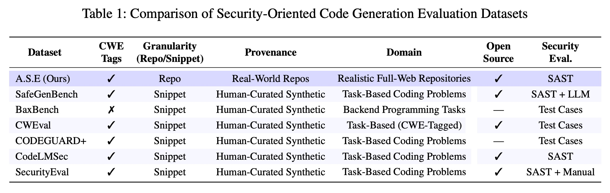

## AI论文解读 | A.S.E: A Repository-Level Benchmark for Evaluating Security in AI-Generated Code
        
### 作者        
digoal        
        
### 日期        
2025-09-13        
        
### 标签        
PostgreSQL , PolarDB , DuckDB , AI , 论文解读        
        
----        
        
## 背景  
      
https://arxiv.org/pdf/2508.18106        
  
提示:          
```          
读懂《A.S.E: A Repository-Level Benchmark for Evaluating Security in AI-Generated Code》这篇论文需要提前掌握哪些基础知识, 请使用中文通熟易懂的讲解这些基础知识, 可以引用论文中的图、表或使用Markdown支持的图形(text,mermaid等)增加解释性. 
  
使用中文通熟易懂的解读《A.S.E: A Repository-Level Benchmark for Evaluating Security in AI-Generated Code》这篇论文, 其中的关键内容请着重讲解, 可以引用论文中的图、表或使用Markdown支持的图形(text,mermaid等)增加解释性. 
  
提取《A.S.E: A Repository-Level Benchmark for Evaluating Security in AI-Generated Code》这篇论文中的重要术语, 使用中文对这些术语进行通熟易懂的讲解, 可以引用论文中的图、表或使用Markdown支持的图形(text,mermaid等)增加解释性. 
```     
  
## 1 前置知识 
  
您好！为了帮助您更好地理解《A.S.E: A Repository-Level Benchmark for Evaluating Security in AI-Generated Code》这篇论文，我已为您整理了所需的基础知识，并结合论文内容进行了通俗易懂的解释。

### 1. 什么是大语言模型（LLMs）代码生成？

大语言模型（Large Language Models，简称 LLMs）是近年来快速发展的人工智能技术，比如 ChatGPT、Claude 等。当这些模型被用于编写代码时，它们可以极大地提高开发效率 。这篇论文所关注的，就是当大语言模型生成代码时，如何评估这些代码的安全性 。

### 2. 为什么需要 A.S.E 这样的基准测试？

虽然已经有很多针对 AI 代码的评估基准，但它们大多存在以下问题 ：
* **数据脱离实际：** 它们通常使用人工编写的、与实际项目不相关的代码片段作为测试数据 。
* **任务不够真实：** 任务只局限于孤立的代码片段，没有考虑文件或项目内部的上下文关系，这与现实世界的编程场景不符 。
* **评估方法不可靠：** 评估结果常常依赖人工或模型本身的判断，导致结果不可重现且不准确 。

A.S.E.（AI Code Generation Security Evaluation）正是为了解决这些问题而设计的。它是一个**仓库级别的基准测试**，旨在更真实地模拟现实中的 AI 编程任务 。

---

### 3. 理解论文中的关键概念

#### (1) 仓库级别（Repository-level）
这是 A.S.E. 与其他基准测试最大的区别。大多数现有基准测试是 **片段级别（Snippet-level）** 的，只关注一小段代码的正确性 。A.S.E. 则将评估范围扩展到整个代码仓库，要求模型理解文件内及文件间的上下文关系 。这更接近于开发者使用 AI 助手（如 Cursor）的真实场景 。

#### (2) 常见漏洞类型与 CWE
A.S.E. 专注于以下四种在实际 Web 项目中常见的漏洞类型 ：
* **SQL 注入 (SQL Injection, CWE-89)**：通过恶意输入，攻击者可以篡改数据库查询语句，从而窃取、修改或删除数据。
* **跨站脚本 (Cross-Site Scripting, XSS, CWE-79)**：攻击者在网页中注入恶意脚本，当用户访问该页面时，脚本就会执行，可能导致用户会话被劫持、数据泄露等。
* **路径遍历 (Path Traversal, CWE-22)**：攻击者利用目录路径中的特殊字符（如 `..`），访问服务器上存储在非预期目录下的文件。
* **命令注入 (Command Injection, CWE-78)**：攻击者将恶意操作系统命令作为输入，让应用程序执行，从而控制服务器。

**CWE** (Common Weakness Enumeration) 是一个公开的、用于识别和分类软件与硬件漏洞类型的列表。论文中用 CWE 编号来明确指定所评估的漏洞类型 。

#### (3) 静态分析安全测试（SAST）与数据流分析
A.S.E. 评估模型生成代码的安全性，不依赖人工判断，而是使用定制化的**静态分析安全测试**（SAST）规则 。SAST 是一种不执行代码，通过分析源代码来发现潜在安全漏洞的方法 。

为了更准确地检测漏洞，A.S.E. 使用了**数据流分析**的概念，特别是**污点传播（Taint Propagation）**。
* **数据源（Source）**：用户输入或外部来源，数据不可信。
* **数据槽（Sink）**：一个敏感操作，如执行系统命令或数据库查询。

**污点传播**就是跟踪从不可信的“数据源”进入程序的数据，看它是否能不受限制地传播到危险的“数据槽”中。如果污点数据未经处理（如过滤、消毒）就到达了数据槽，那么就可能存在漏洞 。A.S.E. 为每个测试案例量身定制了检测规则来追踪这些路径 。

---

### 4. 论文中的图解与流程
为了帮助您理解 A.S.E. 的工作流程，您可以参考论文中的图表。

#### 论文图1：A.S.E. 整体工作流程
这张图展示了 A.S.E. 基准测试的三个核心部分:   
* **基准测试构建**：从真实世界的 GitHub 仓库中选取有 CVE 记录的项目作为“种子数据集”，并进行**语义和结构变异**来生成变体，以防止模型“记忆”训练数据 。
* **模型代码生成**：A.S.E. 移除原始仓库中的漏洞代码，留下一个“不完整的仓库” 。然后，它将漏洞描述和相关上下文提供给大语言模型，让模型像开发者一样去完成这段代码 。
* **安全评估**：生成的代码被应用到仓库中，并使用定制化的 SAST 工具进行评估。评估维度包括代码**安全性、质量和生成稳定性** 。

#### 论文表1：与其他基准测试的对比
这张表格对比了 A.S.E. 与其他安全导向的代码生成评估数据集 。您可以看到，A.S.E. 是唯一一个**在仓库层面**（Repo）进行评估，且数据来源于**真实世界仓库**（Real-World Repos）的基准测试，同时使用 **SAST** 进行安全评估，这与那些只在“代码片段”（Snippet）级别进行测试的基准测试有本质区别 。    

通过理解以上基础知识和论文框架，您将能更容易地掌握论文的核心思想，并理解其对 AI 代码生成安全领域的重要贡献。
  
## 2 解读论文 
  
好的，我们来通俗易懂地解读一下这篇名为《A.S.E: A Repository-Level Benchmark for Evaluating Security in AI-Generated Code》的论文。

简单来说，这篇论文解决了一个核心问题：**我们怎么知道AI写的代码到底安不安全？**

现在用AI（大语言模型，LLM）写代码非常普遍，比如让它帮你写个功能、修复个bug。但AI写的代码可能会有安全漏洞，这就很危险了。为了评测AI写代码的安全性，学术界和工业界做了很多“考卷”（也就是评测基准，Benchmark），但这篇论文的作者认为，以前的“考卷”都太“假”了，不够真实，无法反映AI在真实工作场景中的表现。

因此，他们推出了一个全新的、更严格、更真实的“考场”——**A.S.E.**。

-----

### A.S.E. 的三大核心特点是什么？（为什么说它更真实？）

以前的评测基准主要有三个问题：1. 数据是“人造”的，不够真实；2. 任务太简单，只是写一小段代码（snippet），脱离了项目整体；3. 评分方式不可靠，依赖人工或者其他AI来打分。

A.S.E. 正是针对这三点进行了革命性的改进：

1.  **真实的“考题”来源** ：

      * A.S.E. 的所有“考题”都来自**GitHub上的真实开源项目** 。
      * 这些项目都有**被公开记录过的安全漏洞（CVE）** 。这意味着每个问题都是一个曾经发生过的、真实的安全事件，而不是研究人员凭空想象出来的。

2.  **仿真的“考试”环境 (仓库级评估)** ：

      * 它不像以前的评测只让AI写一个孤立的函数。A.S.E. 会把整个项目（代码仓库）都提供给AI，让AI在理解整个项目代码（包括跨文件的依赖关系）的**上下文**后，去修复那个有漏洞的代码 。
      * 这就好比考试，以前只考“单词填空”，现在A.S.E. 考的是“**阅读理解 + 篇章写作**”，难度和真实性都大大提高了。

3.  **自动化、可复现的“阅卷”系统** ：

      * A.S.E. 不依赖主观的人工打分或不稳定的AI打分 。
      * 它为每一个漏洞案例都**量身定制了专门的静态漏洞检测规则** 。这个“阅卷”系统非常精确，能自动化、稳定地判断AI生成的代码是否真的修复了漏洞，结果可靠且可以重复验证 。

-----

### A.S.E. 是如何构建和运作的？

论文中的图1清晰地展示了这个流程，我们可以把它分为三步：   


**第一步：构建数据集 (Benchmark Construction)** 

  * **数据来源**：团队从GitHub等平台收集了大量有据可查的真实漏洞项目 。
  * **筛选与精炼**：网络安全专家对这些项目进行严格筛选和分析，确保漏洞是真实、可复现的，最终留下了40个高质量的“种子”项目 。
  * **数据扩展与防作弊**：为了防止AI因为在训练时“背过”这些开源代码而作弊，研究者对这40个项目进行了“变异”处理，比如修改变量名、改变代码结构等，生成了80个变异版本 。这样总共构成了**120个**评测实例 。
  * **统计信息**：这些实例涵盖了**5种**主流编程语言（PHP、Python、Go、JavaScript、Java）和**4种**常见的Web漏洞类型（SQL注入、路径遍历、跨站脚本、命令注入）。

**第二步：模型生成代码 (Model Code Generation)** 

  * **创建任务**：研究者会把项目中那段有漏洞的“坏代码”删掉，变成一个“**填空题**” 。
  * **提供上下文**：然后把这个不完整的项目、相关的代码文件、以及对漏洞的功能描述，一同作为“题干”交给AI 。
  * **生成代码**：AI需要理解整个项目的逻辑，然后生成一小段代码（以Patch文件的形式）来补全这个“填空”，并修复漏洞 。

**第三步：安全评估 (Code Assessment)** 

  * A.S.E.从三个维度对AI生成的代码进行打分：
    1.  **代码质量 (Quality)**：生成的代码语法对不对？能不能成功应用到项目里？。
    2.  **代码安全 (Security)**：漏洞是不是真的被修复了？用定制的检测工具一扫便知 。
    3.  **生成稳定性 (Stability)**：让同一个AI对同一个问题做三次，看结果是否稳定一致 。
  * 最后，通过一个加权公式计算总分，其中**安全分的权重最高（60%）**，体现了对安全性的重视 。
      * $Overall = 0.6 \\times Security + 0.3 \\times Quality + 0.1 \\times Stability$ 

-----

### 核心发现与结论

团队用A.S.E.对市面上26个主流的AI模型（包括GPT系列、Claude系列、Qwen系列等）进行了一场“大考” ，得出了几个关键结论：

1.  **现有大模型的安全编码能力普遍不足** 。

      * 从论文的排行榜（Table 2）可以看出，几乎所有模型在“代码质量”上得分很高（大多能生成可用的代码），但在“**代码安全**”上得分很低，**没有一个模型超过50分**（满分100）。    
      * 表现最好的 **Claude-3.7-Sonnet** 总分第一，代码质量高达91.58，但安全分也只有46.72 。这说明，模型倾向于保证功能正确，而忽略了潜在的安全风险 。

2.  **“慢思考”不一定更安全，甚至可能更糟** 。

      * 很多模型有“快思考”（直接生成）和“慢思考”（经过更多步骤反思再生成）两种模式。直觉上，“慢思考”应该更周全、更安全。
      * 但实验结果恰恰相反，**“慢思考”模式在安全得分上普遍低于“快思考”模式** 。这可能是因为复杂的思考过程反而引入了新的、更不易察觉的漏洞 。

3.  **特定漏洞类型是“重灾区”**。

      * 在四种漏洞类型中，所有模型在处理“**路径遍历 (Path Traversal)**”漏洞时表现最差 。这说明当前的AI对于文件系统操作和访问控制的理解还很薄弱 。

4.  **开源与闭源模型的差距在缩小**。

      * 虽然排名靠前的大多是闭源的商业模型，但优秀的开源模型（如阿里的Qwen3系列）表现也十分抢眼，紧随其后 。这表明开源社区在代码大模型领域的追赶速度非常快。

### 总结与意义

这篇论文最大的贡献是提供了一个**更接近真实世界、评估更可靠**的AI代码安全评测基准A.S.E. 。它就像一个“照妖镜”，清晰地照出了当前AI在安全编码方面的短板。

这项工作不仅能帮助开发者在选择AI工具时做出更明智的决策，更重要的是，它为AI研究者指明了未来改进的方向：**不能只追求代码的“能用”，更要追求代码的“安全”**。同时，论文将A.S.E.的框架和数据集全部开源 ，这将极大地推动整个社区共同努力，去训练出更安全、更可靠的AI编程助手。
  
## 3 术语 
  
为了帮助您更深入地理解《A.S.E: A Repository-Level Benchmark for Evaluating Security in AI-Generated Code》这篇论文，我已为您梳理并详细解释了其中的重要术语，希望能帮助您更好地掌握论文核心。

-----

### 重要术语讲解

#### 1\. 仓库级别 (Repository-level)

这是 A.S.E. 最核心的创新点，也是它与现有基准测试的最大区别。

  * **通俗解释**：大多数传统的代码评估，比如 LeetCode 题目，都是只看一小段代码（即**片段级别**），这就像在考场上解一道数学题。但现实中的编程更像是完成一个项目，需要理解多个文件、模块之间的相互调用关系。**仓库级别**的评估，就是模拟这种真实场景，要求 AI 不仅能写好一个函数，还要能把这个函数正确地嵌入到整个项目中，确保它不会引入安全问题。

#### 2\. 污点传播 (Taint Propagation)

这是论文中用于检测漏洞的关键技术，属于静态分析的一种。

  * **通俗解释**：您可以想象数据就像有 **“毒”** （污点）和 **“无毒”** （无污点）两种。用户输入的数据，我们认为它是有“毒”的，因为它可能包含恶意内容。而像数据库查询、文件读写等敏感操作，我们称之为 **“数据槽”** （Sink），就像一个“毒物处理厂”。**污点传播**的工作，就是追踪这些带有“污点”的数据，看它们是否在未经处理（如过滤、消毒）的情况下，直接进入了“数据槽”。如果发生了这种情况，就意味着可能存在漏洞。

例如，在 SQL 注入的场景中：

  * **污点源 (Source)**：用户在网页输入框中填写的用户名。
  * **污点传播**：用户名数据从输入框被接收，并在程序中传递。
  * **数据槽 (Sink)**：执行数据库查询的 SQL 语句。

#### 3\. 静态分析安全测试 (SAST)

这是论文用来自动化评估 AI 生成代码安全性的方法。

  * **通俗解释**：想象您是一位老师，正在批改学生的作业。静态分析就像是您在不运行程序的情况下，只通过**阅读代码**来找出错误，比如语法错误、逻辑错误等。**静态分析安全测试 (SAST)** 则专注于寻找安全漏洞，就像您专门盯着看学生有没有把敏感信息（比如密码）硬编码在程序里。这种方法的好处是自动化、高效且可重复。

#### 4\. CVE 与 CWE

这两个是衡量漏洞的标准，是安全领域公认的术语。

  * **CVE (Common Vulnerabilities and Exposures)**：

      * **通俗解释**：可以理解为“已公开的漏洞编号”。每一个被发现并披露的已知漏洞，都会被分配一个独一无二的 CVE 编号，就像身份证号一样。论文使用从 CVE 数据库中找出的真实漏洞，来构建测试案例，确保了测试数据的真实性。

  * **CWE (Common Weakness Enumeration)**：

      * **通俗解释**：这是一个软件弱点和漏洞类型的**通用分类列表**。可以理解为漏洞的“户口本”。比如 CWE-89 代表 SQL 注入，CWE-79 代表跨站脚本。论文在设计基准测试时，特意选择了四种高危且常见的 CWE 类型，以评估 AI 在不同漏洞场景下的表现。

#### 5\. 语义和结构变异 (Semantic and Structural Mutations)

这是论文用来确保评估公平性的一项重要技术。

  * **通俗解释**：为了防止 AI 模型“作弊”——也就是它在训练时可能已经“见过”这些漏洞代码了，论文对从真实仓库中提取的漏洞代码进行了修改。
      * **结构变异**：就像给代码换个发型，比如改变变量名、调整函数顺序、修改代码风格等，让代码看起来不一样，但功能保持不变。
      * **语义变异**：这更高级一些，就像给代码换件衣服，在不影响原始漏洞逻辑的前提下，改变它的实现方式。比如，将一个 `if-else` 语句转换为三元表达式，或者用不同的 API 来实现相同的功能。

通过这些变异，A.S.E. 确保模型是在真正理解并解决问题，而不是简单地“记忆”答案。
  
## 参考        
         
https://arxiv.org/pdf/2508.18106    
        
<b> 以上内容基于DeepSeek、Qwen、Gemini及诸多AI生成, 轻微人工调整, 感谢杭州深度求索人工智能、阿里云、Google等公司. </b>        
        
<b> AI 生成的内容请自行辨别正确性, 当然也多了些许踩坑的乐趣, 毕竟冒险是每个男人的天性.  </b>        
  
    
#### [期望 PostgreSQL|开源PolarDB 增加什么功能?](https://github.com/digoal/blog/issues/76 "269ac3d1c492e938c0191101c7238216")
  
  
#### [PolarDB 开源数据库](https://openpolardb.com/home "57258f76c37864c6e6d23383d05714ea")
  
  
#### [PolarDB 学习图谱](https://www.aliyun.com/database/openpolardb/activity "8642f60e04ed0c814bf9cb9677976bd4")
  
  
#### [PostgreSQL 解决方案集合](../201706/20170601_02.md "40cff096e9ed7122c512b35d8561d9c8")
  
  
#### [德哥 / digoal's Github - 公益是一辈子的事.](https://github.com/digoal/blog/blob/master/README.md "22709685feb7cab07d30f30387f0a9ae")
  
  
#### [About 德哥](https://github.com/digoal/blog/blob/master/me/readme.md "a37735981e7704886ffd590565582dd0")
  
  

  
