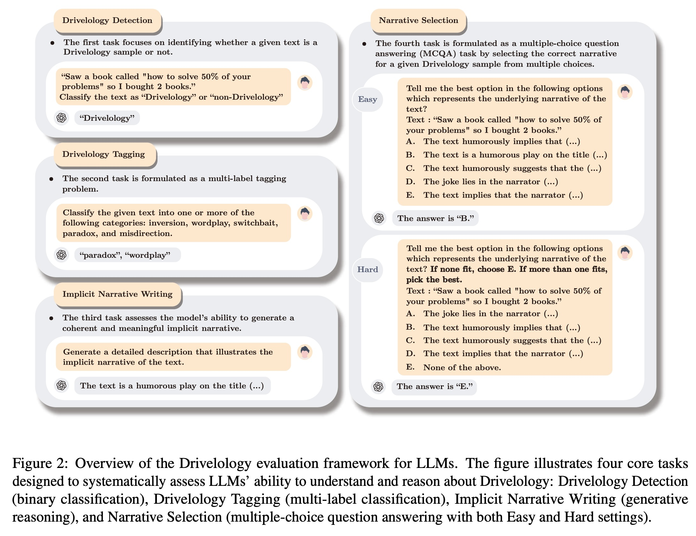
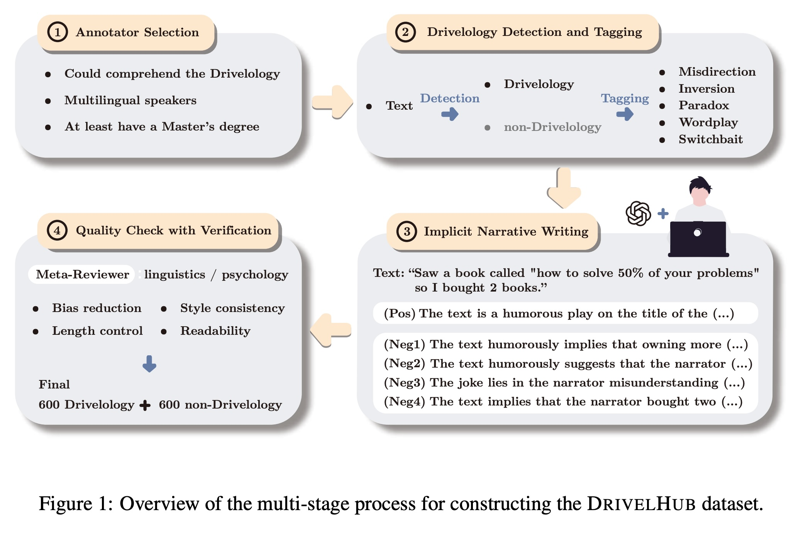
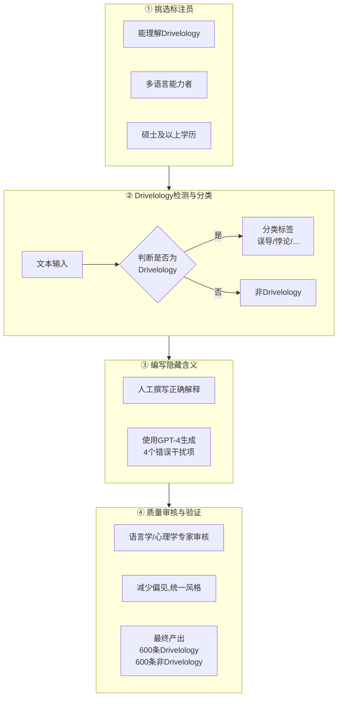
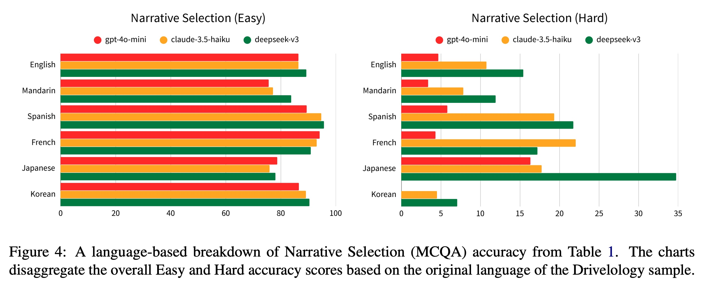
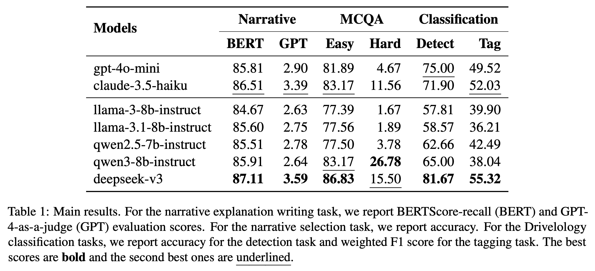

## AI论文解读 | Drivel-ology: Challenging LLMs with Interpreting Nonsense with Depth
        
### 作者        
digoal        
        
### 日期        
2025-09-13        
        
### 标签        
PostgreSQL , PolarDB , DuckDB , AI , 论文解读        
        
----        
        
## 背景  
      
https://arxiv.org/pdf/2509.03867        
  
提示:          
```          
读懂《Drivel-ology: Challenging LLMs with Interpreting Nonsense with Depth》这篇论文需要提前掌握哪些基础知识, 请使用中文通熟易懂的讲解这些基础知识, 可以引用论文中的图、表或使用Markdown支持的图形(text,mermaid等)增加解释性. 
  
使用中文通熟易懂的解读《Drivel-ology: Challenging LLMs with Interpreting Nonsense with Depth》这篇论文, 其中的关键内容请着重讲解, 可以引用论文中的图、表或使用Markdown支持的图形(text,mermaid等)增加解释性. 
  
提取《Drivel-ology: Challenging LLMs with Interpreting Nonsense with Depth》这篇论文中的重要术语, 使用中文对这些术语进行通熟易懂的讲解, 可以引用论文中的图、表或使用Markdown支持的图形(text,mermaid等)增加解释性. 
```     
  
## 1 前置知识 
  
您好，我已经阅读了您提供的论文《Drivel-ology: Challenging LLMs with Interpreting Nonsense with Depth》。要理解这篇论文，您需要掌握以下几个基础知识：

-----

### 1\. 什么是“Drivelology”（废话学）？

论文的核心是引入了一个名为“**Drivelology**”的新概念，您可以理解为“有深度的废话” 。它不是那种毫无意义的胡言乱语，而是指那些**在语法上看似通顺，但在语用、情感或修辞上存在矛盾**的言论 。

与我们通常理解的“废话”不同，Drivelology 故意通过**荒谬的表面语言**来传达更深层次的、隐含的意义，这些意义通常需要结合**上下文推理、道德判断或情感解读**才能理解 。

论文举了两个例子来解释：

  * **例子1**：“我非常敬佩切·格瓦拉的反资本主义精神，所以我买了所有他的周边商品。”  这句话表面上是在表达敬佩，但实际上却是在通过购买商品这一资本主义行为，讽刺那种**表演式激进主义**。
  * **例子2**：“我除了长得好看，身材好，还有钱之外，一无所有。”  这句话反转了通常谦虚的抱怨结构，变成了一种傲慢的炫耀，其幽默和讽刺感源于对熟悉结构的颠覆。

-----

### 2\. 区分“Drivelology”与其他概念

为了更好地理解 Drivelology，论文将其与其他几个相关但不同的概念进行了对比 。

  * **与单纯的胡言乱语（Deep Bullshit）的区别**：

      * **单纯的胡言乱语**：指的是那些对词语是否有意义完全漠不关心的言论，例如乔姆斯基的“无色的绿色思想在狂怒地睡觉” 。这类话语是语义上空洞的。
      * **Drivelology**：虽然表面上看起来是废话，但它**精心构建**，旨在传达隐藏的深层含义 。

  * **与讽刺（Sarcasm）、反语（Irony）和幽默（Humour）的区别**：

      * 传统的讽刺或反语通常只涉及一个认知步骤，即通过上下文来反转一个词语的字面意思 。
      * **Drivelology** 则更具挑战性，因为它具有**多层次的结构**和**语用矛盾** 。它不仅仅是简单的语义反转，还可能需要**整合文化知识**才能理解 。

-----

### 3\. 理解大型语言模型（LLMs）和自然语言处理（NLP）

这篇论文是基于 NLP 领域的研究，因此您需要了解一些基础概念 。

  * **LLMs（大型语言模型）**：这是论文评估的对象，如 GPT-4、Claude-3 和 Llama3 等 。论文指出，尽管这些模型在很多 NLP 任务中表现出色，但它们**难以理解 Drivelology 中蕴含的深层语义** 。
  * **NLP（自然语言处理）**：这是一个让计算机理解、解释和操作人类语言的领域。论文通过 Drivelology 来挑战 LLM，旨在探讨这些模型是真正理解语言，还是仅仅在进行**统计模式匹配** 。

-----

### 4\. 论文的评估框架和任务

论文设计了一套完整的评估框架，来系统性地测试 LLMs 对 Drivelology 的理解能力 。这个框架包括四个核心任务，如图 2 所示 。   

  * **Drivelology 检测**：一个二元分类任务，要求模型判断一段文本是否为 Drivelology 。
  * **Drivelology 标注**：一个多标签分类任务，要求模型为 Drivelology 文本标注一个或多个类别，例如“矛盾”、“文字游戏”或“误导”等 。
  * **隐式叙事写作**：一个生成任务，要求模型解释 Drivelology 文本背后隐含的叙事和意义 。
  * **叙事选择**：一个多项选择任务，要求模型从几个选项中选出正确的叙事解释 。

通过以上这些基础知识，您可以更好地理解这篇论文的核心思想、研究方法以及它所揭示的，当前大型语言模型在**语用理解和深层推理**方面的局限性 。
  
## 2 解读论文 
  
好的，我们来通俗易懂地解读一下这篇非常有意思的论文——《Drivel-ology: Challenging LLMs with Interpreting Nonsense with Depth》。

这篇论文的核心思想是：现在的大语言模型（LLM），比如GPT系列，虽然在很多任务上表现惊人，看起来什么都懂，但它们真的“理解”了语言深层的含义，还是只是在做高水平的“模式匹配”？为了回答这个问题，研究者们提出了一种独特的语言现象——**“Drivel-ology”**，并以此为“试金石”来考验各大模型。

-----

### **关键内容一：什么是“Drivel-ology”？(言之无物学)**

“Drivel-ology”这个词是作者自创的，可以理解为 **“有深度的废话”** 或 **“言之无物学”** 。

它指的是那些**表面上语法通顺，但逻辑上矛盾、情感上复杂或在修辞上具有颠覆性的言论** 。这些话看起来像是胡说八道，但实际上隐藏着需要结合上下文、道德推理或情感才能理解的深层含义 。

举个论文里的例子来帮你理解：

> “我非常敬佩切·格瓦拉的反资本主义精神，所以我把他所有的周边商品都买了。” 

这句话表面上看起来很矛盾：一个反资本主义的偶像，你却通过资本主义消费行为（买商品）来表达敬佩。这其中的深层含义，其实是对那种“口嫌体正直”、流于表面的“行为艺术式”激进主义的讽刺 。

**“Drivel-ology”与普通废话的区别：**

  * **普通废话**：比如乔姆斯基举例的“无色的绿色观念疯狂地睡着 (Colourless green ideas sleep furiously)” ，这句话语法正确但没有任何实际意义 。
  * **Drivel-ology**：它是被精心设计出来的，其表面的荒谬是为了引导读者去理解一个隐藏的批评、观点或情感 。它是一种“有目的的废话” 。

-----

### **关键内容二：为“Drivel-ology”建立分类体系**

为了系统地研究这种语言现象，作者们建立了一个分类法，将“Drivel-ology”按照其修辞手法的不同分为了五大类 。

1.  **误导 (Misdirection)**：先把你引向一个预期的方向，最后突然反转，给出一个意想不到的、更字面或荒谬的结局 。

      * **例子**：“别那么轻易放弃你的梦想！接着睡！”  (本以为是鼓励，结果是让你继续做白日梦)。

2.  **悖论 (Paradox)**：一句话表面上看起来自相矛盾，但细想之下却蕴含着某种深刻或幽默的道理 。

      * **例子**：“这个恩情我永世不忘，直到我忘了为止。”  (用一个逻辑循环来强调自己记性好)。

3.  **诱转 (Switchbait)**：利用一个具有文化特定双关含义的词（诱饵），然后突然切换到另一个出人意料的语境中（转换） 。

      * **例子**：“英国人：你们有枪支问题。美国人：是啊，但至少这是个现代问题。”  (将对枪支泛滥的批评“转换”为对英国持刀犯罪问题的暗讽)。

4.  **倒置 (Inversion)**：将一个众所周知的短语、陈词滥调或社会常规完全颠倒过来，创造出讽刺性的新含义 。

      * **例子**：“我这个人，除了长得帅、身材好、有钱之外，一无是处。”  (把谦虚的句式颠倒过来进行炫耀)。

5.  **文字游戏 (Wordplay)**：利用词语的发音或多义性进行的语言创造，比如双关语 。

      * **例子**：“你有葡萄干(raisins)吗？没有？那来个约会(date)如何？”  (利用`date`既有“枣子”又有“约会”的意思)。

-----

### **关键内容三：构建数据集和四大评测任务**

为了评测LLM，研究团队创建了一个名为 **DRIVELHUB** 的新基准数据集 。

#### **数据集构建 (参考图1)**

这个过程非常严谨，如下图所示，分为四个主要步骤：   



*图1的流程简化示意图*

这个数据集包含了超过1200个样本，覆盖了英语、中文、西班牙语、法语、日语和韩语六种语言 。

#### **四大评测任务 (参考图2)**

研究者设计了四个由易到难的任务来全面评估LLM的能力 。   

1.  **Drivelology 检测 (Drivelology Detection)** 

      * **任务**：一个简单的二元分类题，判断给定的文本是不是“Drivel-ology”。
      * **例子**：“我看到一本书叫《如何解决你50%的问题》，于是我买了两本。” -\> 请分类为“Drivelology”或“非Drivelology”。

2.  **Drivelology 分类 (Drivelology Tagging)** 

      * **任务**：多标签分类，给一段“Drivel-ology”文本打上一个或多个前面提到的分类标签（如“悖论”、“文字游戏”）。
      * **例子**：“我看到一本书叫《如何解决你50%的问题》，于是我买了两本。” -\> 标签应为：“悖论”、“文字游戏”。

3.  **隐藏含义写作 (Implicit Narrative Writing)** 

      * **任务**：生成任务，要求模型详细描述一段“Drivel-ology”文本背后隐藏的深层含义。
      * **例子**：针对上面的例子，模型需要生成类似“这段话通过对书名进行字面化的、幽默的解读，暗示了……”的解释。

4.  **含义选择 (Narrative Selection)** 

      * **任务**：选择题，从五个选项中选出对“Drivel-ology”最准确的解释。
      * **难度分为两种**：
          * **简单模式**：四个干扰项 + 一个正确项 。
          * **困难模式**：在简单模式的基础上，将一个干扰项换成“以上都不是”，这要求模型必须真正理解，而不能靠排除法蒙混过关 。

-----

### **关键内容四：主要发现与结论**

通过在DRIVELHUB数据集上对多个主流LLM进行测试，论文得出了一些核心结论：

  * **LLM普遍表现不佳**：尽管模型在生成流畅文本方面得分很高（如BERTScore很高），但在需要真正理解的判断任务上（如由GPT-4作为裁判的评分）得分却很低 。这表明**模型的“统计流畅性”并不等同于“认知理解能力”** 。

  * **“困难模式”是照妖镜**：在“含义选择”任务的困难模式下，所有模型的准确率都大幅下降 。这暴露了它们在进行精细、深度的推理时存在严重缺陷。

  * **模型越大不一定越好**：研究发现，并非所有任务的性能都随着模型参数量的增加而稳定提升 。例如，在“检测”任务中，8B（80亿参数）模型的表现甚至优于更大和更小的模型 。这说明简单地“堆参数”并不能解决所有问题。

  * **文化背景是巨大挑战**：从**表1**和**图4**可以看出，不同语言的内容对模型来说难度不同。韩语和中文的内容始终是模型最难处理的，准确率最低 。这说明LLM在理解深层文化内涵方面存在短板 。     

| 模型 (Models) | 含义写作 (GPT) | 选择题(困难) (Hard) | 检测 (Detect) | 分类 (Tag) |
| :--- | :---: | :---: | :---: | :---: |
| gpt-4o-mini | 2.90 | 4.67 | 75.00 | 49.52 |
| claude-3.5-haiku | 3.39 | 11.56 | 71.90 | 52.03 |
| **deepseek-v3** | **3.59** | 15.50 | **81.67** | **55.32** |
| llama-3-8b | 2.63 | 1.67 | 57.81 | 39.90 |
| qwen3-8b | 2.64 | **26.78** | 65.00 | 38.04 |

*表1 节选：展示了不同模型在几项关键任务上的表现。可以看出即便是最强的deepseek-v3，在需要深度推理的选择题（困难）任务上也只有15.5%的准确率。* 

### **总结**

这篇论文通过“Drivel-ology”这个巧妙的概念，设计了一套严谨的评测体系，深刻地揭示了当前大语言模型在**深层语义、语用和文化理解上的“表征鸿沟” (representational gap)** 。

它告诉我们，要实现真正的人工通用智能（AGI），未来的研究不仅要追求模型的规模，更需要开发新的训练方法，让模型学会人类那样进行多层次、依赖文化背景的复杂推理 。
  
## 3 术语 
  
您好！根据论文《Drivel-ology: Challenging LLMs with Interpreting Nonsense with Depth》，我为您整理并解释了其中几个重要的术语：

---

### 1. Drivelology（废话学）

这是论文的核心概念。它指的是一种特殊的语言现象，可以理解为“**有深度的废话**”。这种言论在语法上通常是通顺的，但其核心在于**语用上的矛盾、情感上的冲突或修辞上的颠覆**。

简单的说，Drivelology 是一种精心构造的表达，它通过看似荒谬或矛盾的表面语言，来传达更深层次的、隐含的意义。这种意义需要结合上下文、情感或文化背景才能被正确解读。

**论文中的一个经典例子：**
“我非常敬佩切·格瓦拉的反资本主义精神，所以我买了所有他的周边商品。”
* **表面含义**：表达对切·格瓦拉的敬佩。
* **深层含义**：通过“购买商品”这一资本主义行为，反讽那些口头支持反资本主义，行为上却完全相反的“**表演式激进主义**”。

---

### 2. Pragmatic Paradox（语用悖论）

这是构成 Drivelology 的关键特征之一。它指的是**一个言论的字面意义与其隐含的语用功能之间存在矛盾**。

举个例子：当你看到一个朋友穿着一件印有“我爱贫困”T恤时，他想表达的并非真的喜爱贫困，而是一种讽刺或反向幽默。在这种情况下，“爱贫困”这个字面意思与他实际想表达的语用功能（嘲讽）形成了悖论。

---

### 3. Deep Bullshit（深层胡言乱语）

论文用这个概念来对比和区分 Drivelology。
* **Deep Bullshit**：指的是**语义上完全空洞、毫无意义**的言论。比如语言学家乔姆斯基提出的著名例子：“无色的绿色思想在狂怒地睡觉。” 这句话在语法上是正确的，但你无法从中推断出任何有意义的信息。
* **Drivelology**：与此不同，它虽然看起来像胡言乱语，但**蕴含着可被解读的、有深度的隐式意义**。

简单来说，前者是真正的“无意义”，而后者是“假装无意义”以表达某种深意。

---

### 4. Underlying Narrative（隐式叙事）

这是指 Drivelology 文本所要传达的**潜在主题、隐含信息或视角**。这篇论文指出，许多大型语言模型（LLMs）可以生成语法正确的句子，但它们在理解这种隐式叙事方面存在显著的困难。

论文为了评估 LLMs 对 Drivelology 的理解，设计了四个核心任务，其目标都是为了测试模型能否准确地提取出这种隐式叙事。

---

### 5. The Drivelology Evaluation Framework（“废话学”评估框架）

为了系统性地测试大型语言模型对 Drivelology 的理解能力，论文构建了一个包含四个任务的评估框架。

* **Drivelology 检测**：要求模型判断一段文本是不是 Drivelology。
* **Drivelology 标注**：要求模型为 Drivelology 文本标记其特点（例如：“矛盾”、“误导”）。
* **隐式叙事写作**：要求模型解释 Drivelology 文本背后隐含的叙事。
* **叙事选择**：要求模型从多个选项中选择最符合 Drivelology 文本的隐式叙事。

这个框架旨在从不同维度（分类、生成、推理）来验证模型是否真正理解了文本的深层含义，而不仅仅是识别表面的语法或语义。
  
## 参考        
         
https://arxiv.org/pdf/2509.03867    
        
<b> 以上内容基于DeepSeek、Qwen、Gemini及诸多AI生成, 轻微人工调整, 感谢杭州深度求索人工智能、阿里云、Google等公司. </b>        
        
<b> AI 生成的内容请自行辨别正确性, 当然也多了些许踩坑的乐趣, 毕竟冒险是每个男人的天性.  </b>        
  
    
#### [期望 PostgreSQL|开源PolarDB 增加什么功能?](https://github.com/digoal/blog/issues/76 "269ac3d1c492e938c0191101c7238216")
  
  
#### [PolarDB 开源数据库](https://openpolardb.com/home "57258f76c37864c6e6d23383d05714ea")
  
  
#### [PolarDB 学习图谱](https://www.aliyun.com/database/openpolardb/activity "8642f60e04ed0c814bf9cb9677976bd4")
  
  
#### [PostgreSQL 解决方案集合](../201706/20170601_02.md "40cff096e9ed7122c512b35d8561d9c8")
  
  
#### [德哥 / digoal's Github - 公益是一辈子的事.](https://github.com/digoal/blog/blob/master/README.md "22709685feb7cab07d30f30387f0a9ae")
  
  
#### [About 德哥](https://github.com/digoal/blog/blob/master/me/readme.md "a37735981e7704886ffd590565582dd0")
  
  

  
