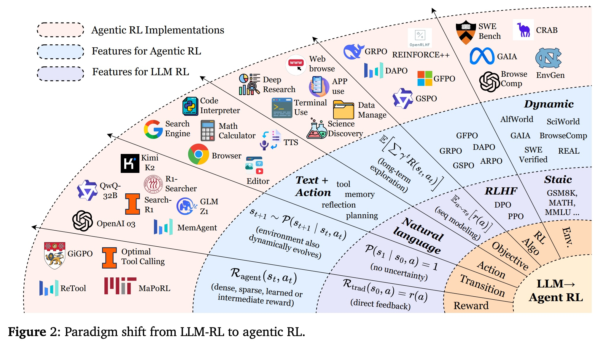
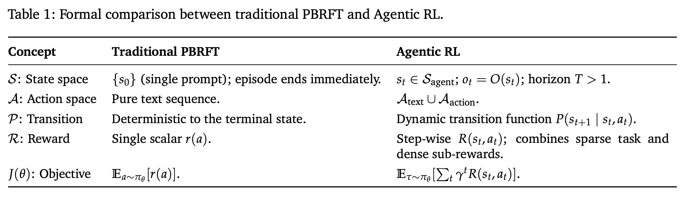
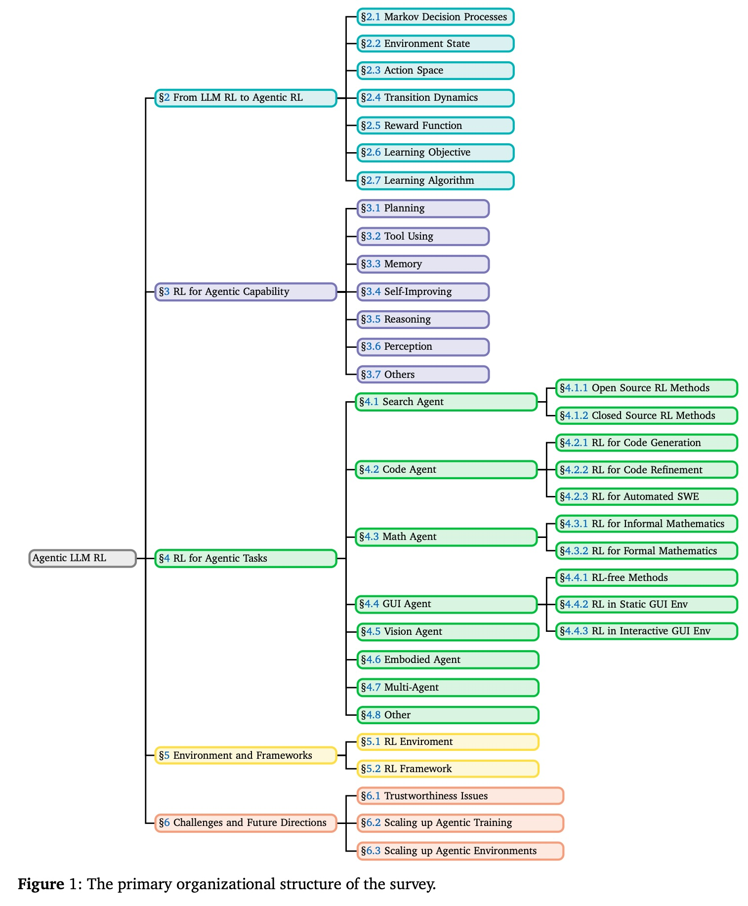
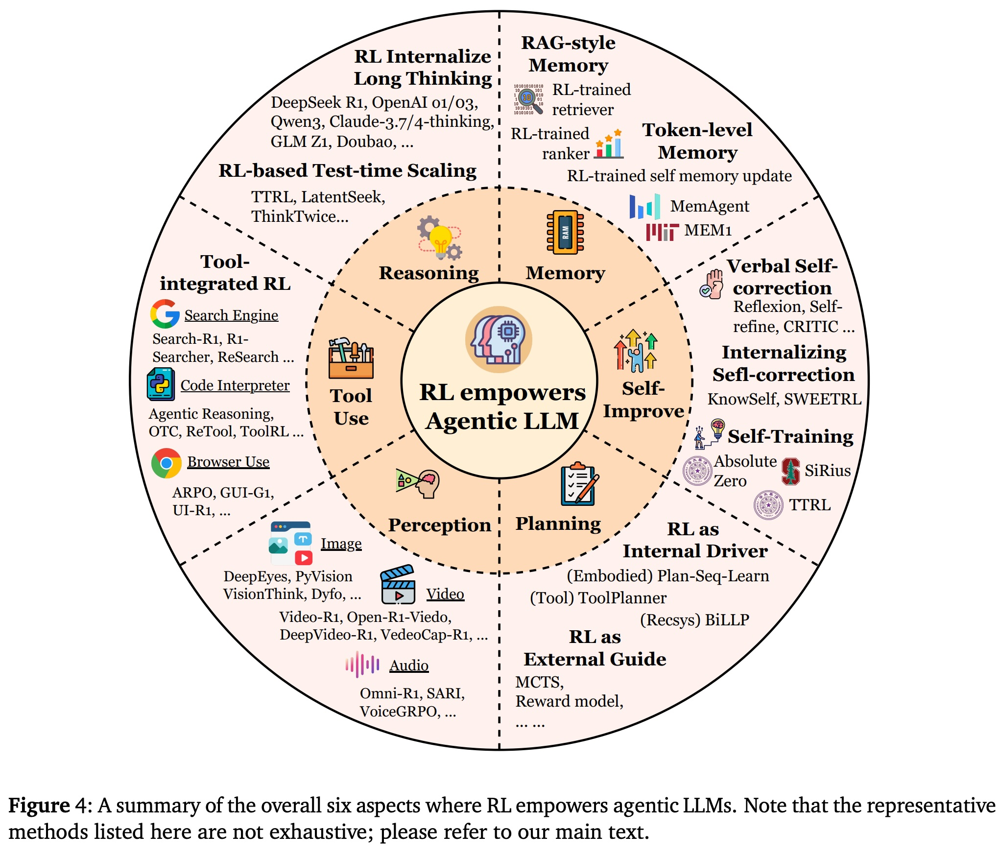
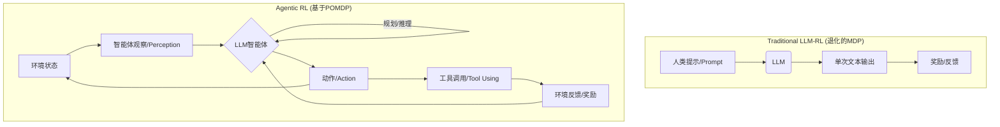

## AI论文解读 | The Landscape of Agentic Reinforcement Learning for LLMs: A Survey
        
### 作者        
digoal        
        
### 日期        
2025-09-13        
        
### 标签        
PostgreSQL , PolarDB , DuckDB , AI , 论文解读        
        
----        
        
## 背景  
      
https://arxiv.org/pdf/2509.02547        
  
提示:          
```          
读懂《The Landscape of Agentic Reinforcement Learning for LLMs: A Survey》这篇论文需要提前掌握哪些基础知识, 请使用中文通熟易懂的讲解这些基础知识, 可以引用论文中的图、表或使用Markdown支持的图形(text,mermaid等)增加解释性. 
  
使用中文通熟易懂的解读《The Landscape of Agentic Reinforcement Learning for LLMs: A Survey》这篇论文, 其中的关键内容请着重讲解, 可以引用论文中的图、表或使用Markdown支持的图形(text,mermaid等)增加解释性. 
  
提取《The Landscape of Agentic Reinforcement Learning for LLMs: A Survey》这篇论文中的重要术语, 使用中文对这些术语进行通熟易懂的讲解, 可以引用论文中的图、表或使用Markdown支持的图形(text,mermaid等)增加解释性. 
```     
  
## 1 前置知识 
  
根据您提供的论文《The Landscape of Agentic Reinforcement Learning for LLMs: A Survey》，要读懂这篇论文，您需要提前掌握以下几个核心基础知识：

### 1. 强化学习（RL）基础概念
这篇论文的核心是强化学习，因此理解其基本组成部分至关重要。论文使用 **马尔可夫决策过程（MDP）** 和 **部分可观察马尔可夫决策过程（POMDP）** 来形式化代理式强化学习（Agentic RL） 。

您可以将强化学习想象成一个智能体（Agent）在特定环境（Environment）中通过“试错”学习最优行为的过程。这个过程有几个关键要素：

* **智能体（Agent）**：这里指的是大型语言模型（LLM）。
* **环境（Environment）**：智能体所处的、需要与其互动的世界，例如网页、操作系统或虚拟游戏。
* **状态（State）**：环境在某一时刻的完整情况。
* **动作（Action）**：智能体在某一状态下可以执行的操作。
* **奖励（Reward）**：智能体执行动作后，环境给出的反馈信号，用于评估动作的好坏。
* **策略（Policy）**：智能体从状态到动作的映射，决定了在某个状态下应该采取什么行动。
* **目标（Objective）**：最大化长期累积奖励。

### 2. 从传统LLM-RL到代理式RL的范式转变
论文的核心观点是将LLM-RL的范式从传统的单次（single-turn）生成器转变为能够进行长期、多步骤决策的自主智能体 。下表概括了这两者的主要区别：

| 概念（Concept） | 传统基于偏好数据的RL（PBRFT） | 代理式RL（Agentic RL） | 解释 |
| :--- | :--- | :--- | :--- |
| **状态（S）** | 静态的、单步的提示词（prompt）  | 动态的、随时间演变的全景世界状态  | 传统RL模型在接收到提示后立即结束一个“回合”，而代理式RL模型可以在一个“回合”内进行多步操作。 |
| **动作（A）** | 纯文本序列  | **文本**（`A_text`）和**工具/环境动作**（`A_action`）的组合  | 代理式RL模型不仅能生成自然语言文本，还能调用外部工具（如搜索引擎）或直接与环境交互。 |
| **奖励（R）** | 单一标量奖励，通常是最终结果的反馈  | 逐步（step-wise）奖励，包含任务稀疏奖励和子任务密集奖励  | 代理式RL可以从每一步的进展中获得即时反馈，而不仅仅是最终结果。 |
| **目标（J）** | 最大化单步奖励  | 最大化带有折扣因子（γ）的长期累积奖励  | 代理式RL的目标是追求长远利益，而不仅仅是眼前的单次奖励。 |

---
### 3. 代理智能体的核心能力
论文从能力（capability）角度对代理式RL进行了分类，这些能力是构成一个自主智能体的关键模块 ：

* **规划（Planning）**：智能体能够分解复杂任务，并制定多步执行计划的能力 。
* **工具使用（Tool Using）**：智能体能够调用外部工具（如搜索、代码解释器、计算器等）来完成任务的能力 。
* **记忆（Memory）**：智能体能够维护和更新上下文信息，以支持长期推理和持续适应的能力 。
* **自优化（Self-Improvement）**：智能体能够根据反馈进行自我反思、调试和改进的能力 。
* **推理（Reasoning）**：智能体能够进行逻辑、数学等方面的推理，以解决复杂问题的能力 。
* **感知（Perception）**：智能体能够处理和理解多模态信息（如图像、声音、视频）的能力 。

### 4. 关键的强化学习算法
论文介绍了在LLM-RL和代理式RL中常用的几种算法，掌握它们有助于您理解模型是如何进行优化的：

* **REINFORCE**：最基础的策略梯度算法，通过增加高回报动作的概率来优化策略 。
* **PPO (Proximal Policy Optimization)**：目前在LLM对齐领域占主导地位的RL算法，其特点是稳定可靠，通过限制更新步长来防止策略剧烈变化 。
* **DPO (Direct Preference Optimization)**：一种创新的、无需单独训练奖励模型的算法，它将奖励最大化问题重构为基于人类偏好数据的似然目标 。
* **GRPO (Group Relative Policy Optimization)**：旨在解决PPO中庞大价值网络问题的算法，通过比较一组响应的相对奖励来计算优势，从而提高样本效率和减少计算开销 。

掌握了上述概念，您将能够更好地理解论文中关于代理式强化学习的理论基础、核心能力、任务应用以及未来挑战等内容。
  
## 2 解读论文 
  
好的，我们来一起深入解读这篇关于大语言模型（LLM）的重磅综述性论文——《The Landscape of Agentic Reinforcement Learning for LLMs: A Survey》（LLM的智能体强化学习全景：一篇综述）。

这篇论文于2025年9月发布，系统性地梳理了一个非常前沿且重要的领域：**智能体强化学习（Agentic Reinforcement Learning, 简称 Agentic RL）**。简单来说，它探讨的是如何使用强化学习（RL）技术，将大语言模型（LLM）从一个“只会说话的鹦鹉”转变为一个能自主思考、决策、并与复杂动态世界互动的“智能代理”（Agent）。

这篇综述内容非常详尽，整合了超过500篇近期研究，为我们描绘了该领域的全貌。接下来，我将为你剖析其中的核心思想和关键内容。

### 核心观点：从“LLM-RL”到“Agentic RL”的范式革命

论文开篇立论，指出我们正在经历一场从传统的 **“LLM强化学习”（LLM-RL）** 到 **“智能体强化学习”（Agentic RL）** 的范式转变 。

  * **传统LLM-RL**：主要目标是“对齐”（Alignment）。比如，通过强化学习人类反馈（RLHF）技术，让模型学会拒绝回答有害问题，或者让它的回答更符合人类偏好 。在这种模式下，LLM更像一个**被动的序列生成器**，我们关心的是它在单次交互中能否生成一个“好”的回答 。
  * **Agentic RL**：目标是赋予LLM **“智能体特性”（Agentic Capabilities）** 。它将LLM视为一个能够进行 **长期、序贯决策** 的大脑，嵌入在复杂、动态、且信息不完全（部分可观察）的环境中 。模型不仅要生成文本，还要能 **规划、使用工具、维护记忆、进行推理和自我改进** ，以完成一个长远的目标 。

为了更清晰地解释这个转变，论文引用了一张非常直观的对比图（图2），并给出了一个正式的数学定义对比（表1）。

    

*图2：从LLM-RL到Agentic RL的范式转变*

这张图形象地展示了两者的区别：

| 特征 | 传统 LLM-RL (左侧) | Agentic RL (右侧) |
| :--- | :--- | :--- |
| **环境 (Env.)** | **静态的 (Static)** ：通常是一个固定的数据集或评测基准。 | **动态的 (Dynamic)** ：环境会因为智能体的行为而改变，比如真实的网页、代码库。 |
| **动作 (Action)** | **自然语言 (Natural language)** ：仅生成文本。 | **文本 + 工具 (Text + tool Action)** ：除了生成文本，还能调用计算器、搜索引擎、代码解释器等工具。 |
| **奖励 (Reward)** | **直接反馈 (direct feedback)** ：通常是基于最终答案给出的单一、明确的评分。 | **稠密、稀疏或学习的奖励 (dense, sparse, learned)** ：奖励可能在任务完成时才给出（稀疏），也可能在每一步都给出（稠密）。 |
| **目标 (Objective)** | **序列建模 (seq modeling)** ：最大化单次回答的奖励。 | **长期探索 (long-term exploration)** ：最大化整个任务序列的累积折扣奖励。 |
| **核心能力** | 仅限于语言生成。 | 涉及 **规划(planning)、记忆(memory)、反思(reflection)** 等高级认知能力 。 |

这种转变的本质是，我们不再把LLM看作一个孤立的模型，而是看作一个可以学习和适应的**策略（Policy）**，强化学习是激发其智能体潜能的关键机制 。

### 论文结构：双重分类法

为了系统地梳理这个领域，论文提出了一个双重分类法，并用一张结构图（图1）清晰地展示了全文脉络。

  

*图1：论文的组织结构*

这个结构可以概括为：

1.  **理论基础 (第2节)**：定义 Agentic RL，并与传统LLM-RL进行区分。
2.  **能力视角 (第3节)**：从智能体的核心能力出发，探讨RL如何增强这些能力。
3.  **任务视角 (第4节)**：从具体的应用领域出发，展示Agentic RL的实际落地。
4.  **生态系统 (第5节)**：总结相关的开源环境、框架和基准。
5.  **未来挑战 (第6节)**：展望未来的研究方向和挑战。

接下来，我们重点讲解能力和任务这两个核心视角。

### 核心内容一：RL如何赋能智能体的六大核心能力 (能力视角)

论文认为，一个强大的智能体由多个可优化的模块/能力构成。RL的作用就是将这些原本静态的模块，变成可以自适应、联合优化的动态策略。

  

*图4：RL赋能智能体LLM的六个方面*

1.  **规划 (Planning)** 
    RL在规划中扮演两种角色：

      * **外部向导**：LLM负责生成可能的行动方案，而RL则训练一个辅助模型来评估这些方案的好坏，从而指导像蒙特卡洛树搜索（MCTS）这样的传统搜索算法 。
      * **内部驱动**：直接将LLM看作一个策略模型，利用环境的反馈（成功或失败的轨迹）通过RL算法（如DPO）直接微调LLM自身的规划能力 。

2.  **工具使用 (Tool Using)** 
    这是Agentic RL最成功的应用之一。它推动了工具使用从简单的模仿学习（如ReAct框架）演变为结果驱动的优化 。通过RL，智能体能自主学习**在何时、如何、以及使用何种工具**的策略，而不是死板地模仿预设模式 。这使得智能体在面对新情况或错误时更加灵活和鲁棒。

3.  **记忆 (Memory)** 
    RL将记忆从一个被动的“数据库”转变为一个由RL控制的动态子系统 。智能体可以通过RL学习决定**什么信息值得储存、何时检索、以及如何遗忘** 。论文回顾了记忆机制的演变：从早期的RAG（检索增强生成），到更先进的、由RL管理的 token 级别记忆（无论是可读的自然语言还是隐式的嵌入向量）。

4.  **自我提升 (Self-Improvement)** 
    这指的是智能体从自身错误中学习和反思的能力。RL是实现持续自我改进的关键。

      * **语言自我纠错**：通过提示工程，让模型在一次推理中完成“生成-反思-修正”的循环（有时被称为“语言强化学习”）。
      * **内化自我纠错**：使用带梯度的RL更新，将反思和纠错的能力真正“刻进”模型参数中 。
      * **迭代式自我训练**：构建一个自我持续的循环，让智能体自己生成任务、尝试解决、验证结果，并用结果作为奖励来训练自己，实现类似AlphaZero的无数据自我进化 。

5.  **推理 (Reasoning)** 
    论文将推理分为“快推理”（类似人类直觉，快速但易错）和“慢推理”（深思熟虑、多步骤的逻辑链，如思维链CoT）。传统LLM擅长快推理，但Agentic RL对于训练可靠、鲁棒的**慢推理能力**至关重要 。通过在多步推理中提供奖励信号，RL可以引导模型生成更长、更连贯、更准确的推理过程。

6.  **感知 (Perception)** 
    主要体现在多模态领域，特别是视觉语言模型（LVLM）。RL推动LVLM从**被动感知**（看图说话）走向**主动视觉认知**（带着目的去“看”）。例如，通过RL，模型可以学习将推理步骤与图像中的特定区域 **“锚定”** （Grounding），或者学习 **使用视觉工具** （如图像编辑器），甚至通过**生成草图来辅助思考**（想象力）。

### 核心内容二：Agentic RL在关键任务领域的应用 (任务视角)

论文详细介绍了Agentic RL在多个前沿领域的具体应用，展示了其解决现实问题的巨大潜力。

1.  **搜索与研究智能体 (Search & Research Agent)** 
    Agentic RL将传统的检索增强生成（RAG）提升到了一个新的高度。智能体不再是简单地检索信息回答问题，而是能够执行复杂、多步骤的深度研究任务，包括自主规划搜索策略、综合多个信息源、并撰写详细报告 。无论是开源模型还是闭源系统（如OpenAI的Deep Research），都已将RL作为优化端到端研究过程的核心技术 。

2.  **代码智能体 (Code Agent)** 
    软件工程是Agentic RL的理想试验场，因为代码的正确性可以通过编译、单元测试等方式自动验证，从而提供清晰的奖励信号 。该领域的进展可以分为三个阶段：

      * **代码生成**：RL用于微调模型，以生成更高正确率的代码片段 。
      * **迭代式代码修正**：智能体在多轮交互中接收错误信息（如编译失败），并学习如何逐步调试和完善代码 。
      * **自动化软件工程**：这是最前沿的方向，智能体需要在一个完整的代码库中完成复杂任务（如修复bug、添加新功能），这要求它具备长期规划、使用多种开发工具（如版本控制、shell）的能力 。

3.  **数学智能体 (Mathematical Agent)** 
    数学推理因其严谨的逻辑性，成为衡量智能体推理能力的黄金标准。

      * **非形式化推理**：在自然语言和代码（如Python计算器）的帮助下解决数学问题 。RL可以奖励最终答案的正确性（结果奖励），也可以奖励中间步骤的合理性（过程奖励），从而激发智能体自主学习如何结合思考和工具使用 。
      * **形式化推理**：在严格定义的语言（如Lean）中进行自动定理证明 。这是一个巨大的搜索问题，RL通过二元的验证器反馈（证明成功或失败）来引导模型探索广阔的证明空间 。

4.  **GUI/Web/多模态/多智能体等其他任务**
    论文还广泛覆盖了其他领域，如：

      * **GUI智能体**：通过RL在真实或模拟的图形界面（如安卓、桌面操作系统）中进行试错学习，以完成导航和操作任务 。
      * **视觉智能体**：RL被广泛用于图像/视频的理解和生成任务，以提升其时空推理和内容创作能力 。
      * **具身智能体**：在模拟或现实世界中控制机器人，RL用于优化其导航和操作策略 。
      * **多智能体系统 (MAS)**：RL用于训练多个智能体如何有效协作、沟通和分工，以解决单个智能体难以完成的复杂任务 。

### 未来的挑战与方向

最后，论文指出了该领域面临的三大核心挑战 ：

1.  **可信度 (Trustworthiness)** ：如何确保智能体的**安全、不产生幻觉、不盲目迎合用户（Sycophancy）**。RL的奖励机制设计不当可能会加剧这些问题，例如，智能体为了最大化奖励而“抄近路”，学会了不安全的行为（奖励黑客 Reward Hacking）。
2.  **扩展智能体训练 (Scaling up Agentic Training)** ：如何解决**算力、数据和算法效率**的瓶颈。研究表明，增加RL的训练时长和数据多样性确实能显著提升智能体的推理能力，但成本极高 。
3.  **扩展智能体环境 (Scaling up Agentic Environment)** ：智能体的能力上限受限于其训练环境。我们需要**更复杂、更动态、能与智能体共同进化的环境**。未来的一个重要方向是让环境本身也变得智能，能够根据智能体的弱点自动生成新的、有针对性的训练任务 。

### 总结

这篇综述清晰地阐述了**Agentic RL**作为一个新兴范式，正在如何深刻地改变我们对大型语言模型的认知和应用。它不仅仅是一种技术优化，更是一场将LLM从“工具”推向“伙伴”的革命。通过系统性的梳理和前瞻性的展望，这篇论文为所有致力于构建通用人工智能（AGI）的研究者和开发者提供了一份宝贵的路线图和参考。
  
## 3 术语 
  
根据您提供的论文《The Landscape of Agentic Reinforcement Learning for LLMs: A Survey》，以下是其中一些重要的术语及其通俗易懂的中文讲解：

-----

### 1\. 核心范式术语

#### **代理式强化学习 (Agentic Reinforcement Learning, Agentic RL)**

  * **通俗解释**：这是一种全新的范式，它将大型语言模型（LLM）从一个“被动”的文本生成器，转变为一个能够自主行动和决策的“智能体”（Agent）。想象一下，传统的LLM就像一个只会回答问题的图书馆管理员，而代理式RL下的LLM则变成了一个能够自己查找资料、规划行动并解决问题的研究员。它的核心在于让LLM能够像人类一样，在复杂的、动态的环境中，通过多步骤的行动来实现一个长期目标。

#### **LLM强化学习 (LLM Reinforcement Learning, LLM-RL)**

  * **通俗解释**：这是代理式强化学习出现之前的传统方法。它通常指用强化学习来优化LLM的输出，使其更好地与人类偏好或特定奖励信号对齐。比如，用奖励模型（Reward Model）来指导LLM生成更友好、更准确的回答。这个过程通常是单步的，即给出一个提示（prompt），模型生成一个完整的回答，然后获得一个奖励信号。这种方法缺乏长期规划和与环境互动的能力。

-----

### 2\. 核心理论术语

#### **马尔可夫决策过程 (Markov Decision Process, MDP)**

  * **通俗解释**：可以理解为强化学习的数学框架。它描述了一个“理想”的决策过程，其中环境的下一个状态只取决于当前状态和智能体所采取的动作，与之前的历史状态无关。论文中提到，传统的LLM-RL可以被看作是一种“退化”的单步MDP，因为其决策过程只持续一个步骤。

#### **部分可观察马尔可夫决策过程 (Partially Observable Markov Decision Process, POMDP)**

  * **通俗解释**：这是MDP的升级版，更贴近现实世界。在POMDP中，智能体无法直接观察到环境的完整状态，只能通过自己的感知来获得“部分观察”（Observation）。例如，LLM智能体在浏览网页时，它一次只能看到屏幕的一部分，而不是整个互联网。代理式RL正是用POMDP框架来描述LLM在复杂环境中的决策过程，因为LLM无法完全获取环境信息，需要根据有限的观察来做出决策。

下图（根据论文概念绘制）展示了从LLM-RL到Agentic RL的范式转变：



-----

### 3\. 代理智能体的核心能力

#### **规划 (Planning)**

  * **通俗解释**：这是指智能体分解复杂任务、并制定多步骤执行计划的能力。它就像一个项目经理，能够将一个大目标（比如“订一张去巴黎的机票”）拆解成一系列可执行的小步骤（如“搜索航班”-“比较价格”-“选择日期”-“完成预订”）。论文中提到了一些规划方法，如ReAct（推理+行动）和CoT（思维链）。

#### **工具使用 (Tool Using)**

  * **通俗解释**：指智能体能够调用外部工具来扩展自身能力。LLM本身无法直接获取实时信息或进行复杂计算，但通过调用工具，它可以像人类使用手机或电脑一样，完成各种任务。
  * **举例**：
      * **搜索工具**：获取最新信息（比如“今天的天气”）。
      * **代码解释器**：执行复杂的数学计算或处理数据。
      * **网页浏览器**：浏览网页、提取信息。

#### **记忆 (Memory)**

  * **通俗解释**：智能体保存和管理信息的能力。这不仅仅是指在对话中记住之前说了什么，更重要的是能够长期存储和检索信息，以便在未来的决策中利用。论文中提到了两种记忆类型：
      * **短期记忆 (Short-term Memory)**：通常是对话上下文，用于处理当前的任务。
      * **长期记忆 (Long-term Memory)**：可以存储更久远的信息，例如智能体过往的经验或学习到的知识。

#### **自优化 (Self-Improvement)**

  * **通俗解释**：智能体根据反馈进行自我反思、调试和改进的能力。这就像一个人在完成任务后，会反思“我哪里做得不好？”或“下次我该如何改进？”。论文中指出，这是代理式RL区别于传统LLM-RL的关键能力之一，它使智能体能够从失败中学习，并不断提高自己的表现。

-----

### 4\. 关键算法术语

#### **PPO (Proximal Policy Optimization)**

  * **通俗解释**：一种非常流行的强化学习算法，主要用于更新智能体的策略（即行动规则）。PPO的目标是在更新策略时，既要让它朝着更好的方向改变，又要防止改变得太快导致“翻车”（策略崩溃）。它通过限制新策略与旧策略之间的差异，确保训练过程稳定可靠。

#### **DPO (Direct Preference Optimization)**

  * **通俗解释**：一种相对较新的对齐算法，它通过直接优化人类偏好数据来训练模型，而不需要像PPO那样先训练一个独立的奖励模型。你可以把它想象成：直接告诉模型“我喜欢这个回答，不喜欢那个”，然后模型就会自动调整，生成更多你喜欢的回答。

掌握了这些术语，您就能够更好地理解论文中关于代理式强化学习的理论基础、核心构成和应用前景。
  
## 参考        
         
https://arxiv.org/pdf/2509.02547    
        
<b> 以上内容基于DeepSeek、Qwen、Gemini及诸多AI生成, 轻微人工调整, 感谢杭州深度求索人工智能、阿里云、Google等公司. </b>        
        
<b> AI 生成的内容请自行辨别正确性, 当然也多了些许踩坑的乐趣, 毕竟冒险是每个男人的天性.  </b>        
  
    
#### [期望 PostgreSQL|开源PolarDB 增加什么功能?](https://github.com/digoal/blog/issues/76 "269ac3d1c492e938c0191101c7238216")
  
  
#### [PolarDB 开源数据库](https://openpolardb.com/home "57258f76c37864c6e6d23383d05714ea")
  
  
#### [PolarDB 学习图谱](https://www.aliyun.com/database/openpolardb/activity "8642f60e04ed0c814bf9cb9677976bd4")
  
  
#### [PostgreSQL 解决方案集合](../201706/20170601_02.md "40cff096e9ed7122c512b35d8561d9c8")
  
  
#### [德哥 / digoal's Github - 公益是一辈子的事.](https://github.com/digoal/blog/blob/master/README.md "22709685feb7cab07d30f30387f0a9ae")
  
  
#### [About 德哥](https://github.com/digoal/blog/blob/master/me/readme.md "a37735981e7704886ffd590565582dd0")
  
  

  
