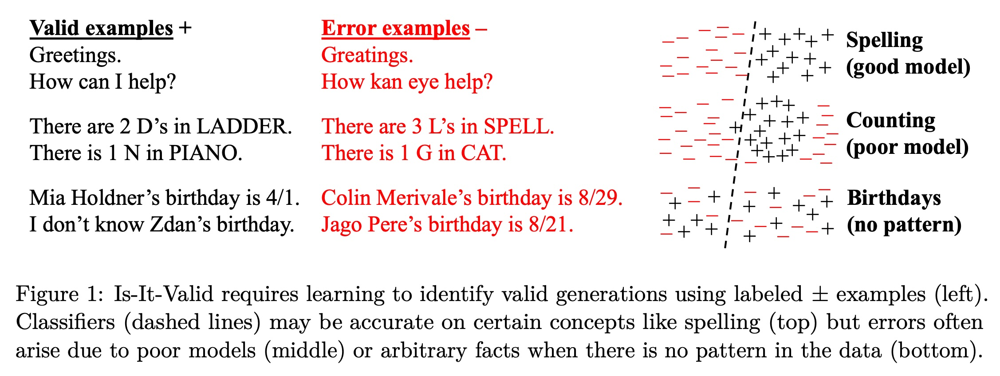

## AI论文解读 | Why Language Models Hallucinate
        
### 作者        
digoal        
        
### 日期        
2025-09-13        
        
### 标签        
PostgreSQL , PolarDB , DuckDB , AI , 论文解读        
        
----        
        
## 背景  
      
https://arxiv.org/pdf/2509.04664        
  
提示:          
```          
读懂《Why Language Models Hallucinate》这篇论文需要提前掌握哪些基础知识, 请使用中文通熟易懂的讲解这些基础知识, 可以引用论文中的图、表或使用Markdown支持的图形(text,mermaid等)增加解释性. 
  
使用中文通熟易懂的解读《Why Language Models Hallucinate》这篇论文, 其中的关键内容请着重讲解, 可以引用论文中的图、表或使用Markdown支持的图形(text,mermaid等)增加解释性. 
  
提取《Why Language Models Hallucinate》这篇论文中的重要术语, 使用中文对这些术语进行通熟易懂的讲解, 可以引用论文中的图、表或使用Markdown支持的图形(text,mermaid等)增加解释性. 
```     
  
## 1 前置知识 
  
您好，我已经阅读了您上传的《Why Language Models Hallucinate》这篇论文。为了帮助您更好地理解这篇论文，下面我用通俗易懂的方式讲解一些您需要提前掌握的基础知识。

-----

### 1\. 什么是语言模型的“幻觉”？

论文的核心概念是 **“幻觉”（Hallucination）** ，这指的是大型语言模型在不确定时，会像学生面对难题时一样，产生听起来很合理但实际上是错误的信息，而不是承认自己不知道 。这并不是什么神秘的现象，而是可以从统计学和训练流程中找到原因的 **一种错误** 。

论文认为，幻觉可以被简化为一个 **“它有效吗？”** （Is-It-Valid，简称IIV）的二元分类问题 。简单来说，语言模型在生成每个词或句子时，都在进行一个“是”或“否”的判断：这个输出是有效的（正确）吗？还是无效的（错误）？

### 2\. 幻觉产生的两个主要阶段

论文将幻觉的产生归因于语言模型训练的两个主要阶段：

#### 2.1 预训练（Pre-training）阶段

在预训练阶段，模型会学习一个庞大文本语料库中的语言分布 。即使训练数据是完全正确的，模型在学习过程中也可能会产生幻觉。

论文通过将 **生成错误（generative errors）** 和 **二元分类错误（binary classification errors）** 联系起来，证明了这一观点。他们提出了一个重要的数学关系：**生成错误率 ≥ 2 × IIV分类错误率** 。这意味着如果模型在区分“有效”和“无效”输出时表现不佳，它产生幻觉的可能性就会更高 。

论文引用了图1来解释这一概念：

  * **拼写（Spelling）**：这是模型很容易学习的模式，因为有清晰的规律 。
  * **计数（Counting）**：对于一些复杂的计数任务，模型可能学习得不好，从而产生错误 。
  * **生日等任意事实（Birthdays/Arbitrary Facts）**：这些事实没有规律可循，模型很难通过模式识别来学习。如果某个事实只在训练数据中出现过一次（称为“独点”），那么模型在这种事实上的幻觉率，至少会等于这类事实在训练数据中的占比 。

  

**图1：IIV二元分类问题解释** 


#### 2.2 后训练（Post-training）阶段

后训练阶段通常旨在减少幻觉，但论文认为，**现有的评估机制反而加剧了幻觉的持续存在** 。

这个阶段的问题是一个 **“社会技术”** （socio-technical）问题 。大多数语言模型评估基准（例如，准确率或通过率）都使用了 **二元评分** （binary scoring）：答对得1分，答错或回答“我不知道”（IDK）都得0分.

在这种评分机制下，模型会像参加考试的学生一样，**通过猜测来最大化自己的得分** 。例如，如果一个模型（模型B）在不确定时总是猜测，而另一个模型（模型A）则会承认不确定，那么模型B在大多数现有基准上会表现得比模型A更好 。这导致了一种 **“惩罚不确定性”的现象**  。

论文引用了图2，展示了**校准（Calibration）的概念。一个校准良好的模型**，其给出的答案概率（横轴）与实际正确率（纵轴）是一致的，这在预训练模型（左图）中通常表现良好 。但在后训练（特别是强化学习）之后，模型的校准会变差（右图），变得**过于自信** 。

  

**图2：GPT-4在强化学习前后的校准直方图** 


### 3\. 如何解决幻觉？

论文的核心观点是，要从根本上解决幻觉，不应该一味地创建新的评估基准，而是**修改现有的、占主导地位的评估基准的评分方式**，停止对不确定性回答的惩罚 。这样才能引导AI领域朝着更加值得信赖的方向发展 。
  
## 2 解读论文 
  
好的，這是一篇關於大型語言模型為何會產生「幻覺」的論文解讀。我將以通俗易懂的方式，為您解析這篇名為《Why Language Models Hallucinate》的論文，並重點講解其中的關鍵內容。

### 論文核心觀點概覽

這篇於2025年9月4日發表的論文，由來自OpenAI和喬治亞理工學院的研究人員撰寫 。他們提出了一個核心論點：**大型語言模型之所以會產生幻覺（即一本正經地胡說八道），根本原因在於它們的訓練和評估方式，獎勵了「猜測」，而非承認「不確定性」** 。

您可以將語言模型想像成一個正在參加考試的學生。面對難題時，與其誠實地回答「我不知道」（IDK），它更傾向於猜一個看似合理的答案，因為現有的考試規則（即評估基準）對空白卷或「不知道」的答案不給分，而猜對了卻能得分 。這種機制導致模型即使在不確定的情況下，也傾向於自信地編造答案。

論文從兩個主要階段剖析了幻覺的產生和持續存在的原因：

1.  **預訓練（Pre-training）階段**：幻覺的統計學根源。
2.  **後訓練（Post-training）階段**：評估體系如何強化了幻覺行為。

-----

### 第一部分：幻覺的起源 —— 預訓練階段的統計壓力

許多人認為幻覺是一個神秘的現象，但作者指出，幻覺的產生在本質上源於一個簡單的統計問題：**二元分類錯誤（errors in binary classification）** 。

#### 關鍵概念：Is-It-Valid (IIV) 二元分類問題

為了說明這一點，論文引入了一個名為「**Is-It-Valid (IIV)**」的虛構分類任務 。想像一下，我們需要訓練一個模型來判斷一句話是「有效的」（Valid）還是「錯誤的」（Error）。

  * **有效的例子（+）**: "Greetings." (你好)、"There are 2 D's in LADDER." (LADDER 中有2個D) 
  * **錯誤的例子（-）**: "Greatings." (拼寫錯誤)、"There is 1 G in CAT." (CAT 中沒有G) 

這個任務就像一個是非題判斷。作者認為，**生成一個有效的句子，比判斷一個句子是否有效要困難得多** 。因為生成模型在內部需要對無數個候選答案進行隱性的「有效性」判斷。

作者通過一個數學公式建立了**生成錯誤率**和**IIV分類錯誤率**之間的關係：
$$(\text{生成錯誤率}) \ge 2 \times (\text{IIV 分類錯誤率})$$
這意味著，如果一個模型在判斷是非題（IIV任務）上都做不好，那麼它在生成正確答案（更困難的任務）時，犯錯的機率會更高 。

#### 為什麼IIV分類會出錯？

論文使用下圖（圖1）解釋了導致分類錯誤的三種情況，這也對應了語言模型產生幻覺的三類原因：   


1.  **好的模型（Good model）**：對於像拼寫檢查這類有明確規則可循的問題，模型可以學習得很好，準確率很高 。
2.  **差的模型（Poor model）**：當任務需要一定的推理能力（如計算字母數量）時，如果模型本身架構或能力不足（例如，舊的Trigram模型無法理解長距離的語法依賴），就容易出錯 。論文中提到，DeepSeek-V3模型在數字母"D"的數量時頻繁出錯，而其具備推理能力的版本DeepSeek-R1則能通過「思維鏈」正確解答，這說明了模型能力的重要性 。
3.  **無模式（No pattern）/ 任意事實（Arbitrary facts）**：對於那些沒有內在規律、純粹靠記憶的事實（如某個不知名人物的生日），如果訓練數據中這個事實只出現過一次或從未出現，模型就無法學習到一個通用的模式 。在這種情況下，模型除了猜測，別無他法。這就是論文開頭提到的例子，當被問及作者Adam Tauman Kalai的生日時，模型三次給出了不同的錯誤答案 。

#### 關鍵發現：單例率（Singleton rate）與幻覺的關係

對於第三種「任意事實」的幻覺，論文提出了一個重要的發現：**一個在預訓練數據中只出現過一次的事實（稱為 singleton），其產生幻覺的機率非常高** 。

> **定理**: 基礎模型在處理任意事實時，其幻覺率的下限約等於訓練數據中「單例」事實所佔的比例（singleton rate） 。

例如，如果關於生日的事實中有20%在數據庫中只出現過一次，那麼模型在回答相關生日問題時，預計至少會有20%的幻覺率 。

-----

### 第二部分：幻覺的持續存在 —— 後訓練與評估體系的「共謀」

預訓練讓模型產生了幻覺的「種子」，而後訓練階段（如指令微調、人類反饋強化學習 RLHF）本應是修正這些錯誤的機會。但作者尖銳地指出，**現行的評估體系不僅沒能抑制幻覺，反而在鼓勵這種行為** 。

#### 評估體系的「致命缺陷」：二元評分（Binary Grading）

目前的絕大多數主流評估基準（Benchmarks），如MMLU、GPQA等，都採用**二元評分**，即答案要麼全對（1分），要麼全錯（0分）。對於回答「我不知道」（IDK）或任何表示不確定的答案，一律視為錯誤，給0分 。

| 評估基準 (Benchmark) | 評分方式 | 是否為二元評分 | IDK是否給分 |
| :--- | :--- | :--- | :--- |
| GPQA | 多選題準確率 | 是 | 否 |
| MMLU-Pro | 多選題準確率 | 是 | 否 |
| IFEval | 程序化指令驗證 | 是 | 否 |
| Omni-MATH | 等效性評分 | 是 | 否 |
| WildBench | LM評分（1-10分） | 否 | 可能得分較低 |
| BBH | 多選題/完全匹配 | 是 | 否 |
| MATH (L5) | 等效性評分 | 是 | 否 |
| SWE-bench | 代碼補丁通過單元測試 | 是 | 否 |

  

(改編自論文表2 )

在這種規則下，模型的最佳策略是什麼？**是猜測！**

  * **模型A (誠實)**：遇到不確定的問題時，回答「我不知道」。得分：0。
  * **模型B (愛猜)**：遇到不確定的問題時，猜一個最可能的答案。如果猜對了，得分：1；猜錯了，得分：0。

顯然，模型B的期望得分更高 。這就造成了一種「流行病」：**整個AI領域都在懲罰誠實的不確定性，而獎勵高風險的猜測行為** 。

#### 模型的校準度（Calibration）變化

一個有趣的現象是，模型在預訓練後通常是**校準良好**的（well-calibrated），意味著它輸出的置信度與其實際的準確率比較吻合。然而，經過RLHF等後訓練，模型的校準度反而會**變差** 。

下圖（圖2）展示了GPT-4在預訓練後和經過強化學習後的校準曲線對比：   

  * **左圖（預訓練後）**：模型的預測機率（P(answer)）與其實際的正確率（P(correct)）非常接近，幾乎貼合對角虛線，表現出良好的校準度 。
  * **右圖（後訓練後）**：曲線明顯偏離對角線，尤其是在高置信度區間，模型變得過於自信，即其校準度變差 。

這背後的原因是，後訓練的目標是讓模型輸出更符合人類偏好的答案，而不是嚴格遵循統計分佈，這可能導致模型為了「取悅」評分系統而變得過於自信。

-----

### 如何解決問題？論文提出的建議

作者認為，僅僅增加幾個專門的幻覺評估基準是遠遠不夠的，因為主流評估的「指揮棒」方向是錯的 。他們提出了一種「社會-技術」層面的解決方案：**修改現有主流評估的評分機制，引入明確的置信度目標** 。

具體做法是在問題中明確告知模型評分規則，例如：

> 「只有當你的置信度超過 **t** 時才回答。因為錯誤的答案將被扣 **t/(1-t)** 分，正確答案得1分，回答『我不知道』得0分。」

  * **當 t = 0.5 (置信度50%)**: 答錯扣1分。這鼓勵模型只有在非常有把握時才作答。
  * **當 t = 0 (置信度0%)**: 答錯不扣分。這就等同於現在的二元評分，鼓勵模型「大膽猜測」。

通過這種方式，可以引導模型學會**行為校準 (behavioral calibration)**  —— 即根據不同的風險要求，調整自己的行為模式，在不確定時選擇承認，而不是盲目地編造答案。

### 總結

《Why Language Models Hallucinate》這篇論文為我們提供了一個清晰且系統的框架來理解語言模型的幻覺問題。

1.  **幻覺並非神秘現象**：它源於預訓練階段的統計壓力，本質上是模型在面對無法區分正確與錯誤信息時的必然產物，尤其是在處理缺乏規律的「任意事實」時。
2.  **現有評估體系是「幫兇」**：後訓練階段，以二元評分為主的評估基準，通過懲罰「不確定性」而獎勵「猜測」，使得幻覺行為被固化甚至強化。
3.  **解決之道在於改變規則**：根本性的解決方案是改革主流的評估體系，引入能反映不確定性成本的評分機制，從而引導整個領域朝著構建更值得信賴的AI系統發展 。
  
## 3 术语 
  
在您上传的《Why Language Models Hallucinate》这篇论文中，有几个重要的术语是理解其核心观点的关键。以下是对这些术语的中文解释：

-----

### **1. 幻觉（Hallucination）**

这是论文的核心概念。它指的是语言模型在不确定或缺乏足够信息时，**生成听起来很合理但实际上是错误或虚构的内容**。论文将这种现象比作学生在考试时遇到难题，**选择猜测而不是承认不知道**。

论文认为，幻觉并非神秘现象，而是一种可以被分析和理解的错误类型，它源于语言模型在训练和评估过程中的缺陷。

### **2. “它有效吗？”（Is-It-Valid, IIV）**

这是一个由论文提出的概念，用于将幻觉问题简化成一个**二元分类问题**。简单来说，语言模型在生成每一个词或句子时，都在进行一个“是”或“否”的判断：

  * **“是”**：这个输出是有效的、正确的吗？
  * **“否”**：这个输出是无效的、错误的吗？

论文认为，如果模型在这个“是”或“否”的判断上表现不佳（即**IIV分类错误率高**），它产生幻觉的可能性就会越高。论文通过一个数学不等式证明了这一点：**生成错误率 ≥ 2 × IIV分类错误率**。

### **3. 校准（Calibration）**

**校准**是衡量模型**预测的概率与其实际准确性之间一致性**的指标。一个校准良好的模型，如果它说一个答案有80%的概率是正确的，那么它实际上正确的几率也应该接近80%。

论文引用了图2，展示了**GPT-4在强化学习前后的校准情况**。在预训练阶段，模型通常校准良好（左图）。但在后训练阶段（特别是通过强化学习进行微调后），模型为了在现有评估基准上获得高分，会变得**过于自信（overconfident）**，其预测的概率与实际准确性之间出现偏差，导致校准变差（右图）。这种校准的恶化是幻觉持续存在的重要原因之一。

  

**图2：GPT-4在强化学习前后的校准直方图**


### **4. “惩罚不确定性”**

这是论文指出的一个 **“社会技术”问题** 。在大多数现有的语言模型评估基准中，评分机制是**二元的**：

  * 答对：得1分
  * 答错或回答“我不知道”（IDK）：得0分

这种评分机制使得模型在不确定时，为了最大化得分，会倾向于猜测而不是承认不确定。论文认为，这种**对不确定性回答的惩罚**是导致幻觉难以消除的根本原因。要解决幻觉问题，就必须改变这种评估方式，停止对“我不知道”的惩罚。
  
## 参考        
         
https://arxiv.org/pdf/2509.04664    
        
<b> 以上内容基于DeepSeek、Qwen、Gemini及诸多AI生成, 轻微人工调整, 感谢杭州深度求索人工智能、阿里云、Google等公司. </b>        
        
<b> AI 生成的内容请自行辨别正确性, 当然也多了些许踩坑的乐趣, 毕竟冒险是每个男人的天性.  </b>        
  
    
#### [期望 PostgreSQL|开源PolarDB 增加什么功能?](https://github.com/digoal/blog/issues/76 "269ac3d1c492e938c0191101c7238216")
  
  
#### [PolarDB 开源数据库](https://openpolardb.com/home "57258f76c37864c6e6d23383d05714ea")
  
  
#### [PolarDB 学习图谱](https://www.aliyun.com/database/openpolardb/activity "8642f60e04ed0c814bf9cb9677976bd4")
  
  
#### [PostgreSQL 解决方案集合](../201706/20170601_02.md "40cff096e9ed7122c512b35d8561d9c8")
  
  
#### [德哥 / digoal's Github - 公益是一辈子的事.](https://github.com/digoal/blog/blob/master/README.md "22709685feb7cab07d30f30387f0a9ae")
  
  
#### [About 德哥](https://github.com/digoal/blog/blob/master/me/readme.md "a37735981e7704886ffd590565582dd0")
  
  

  
