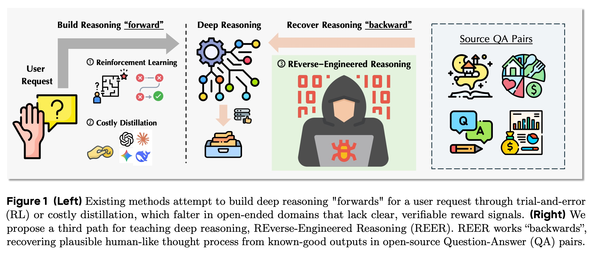
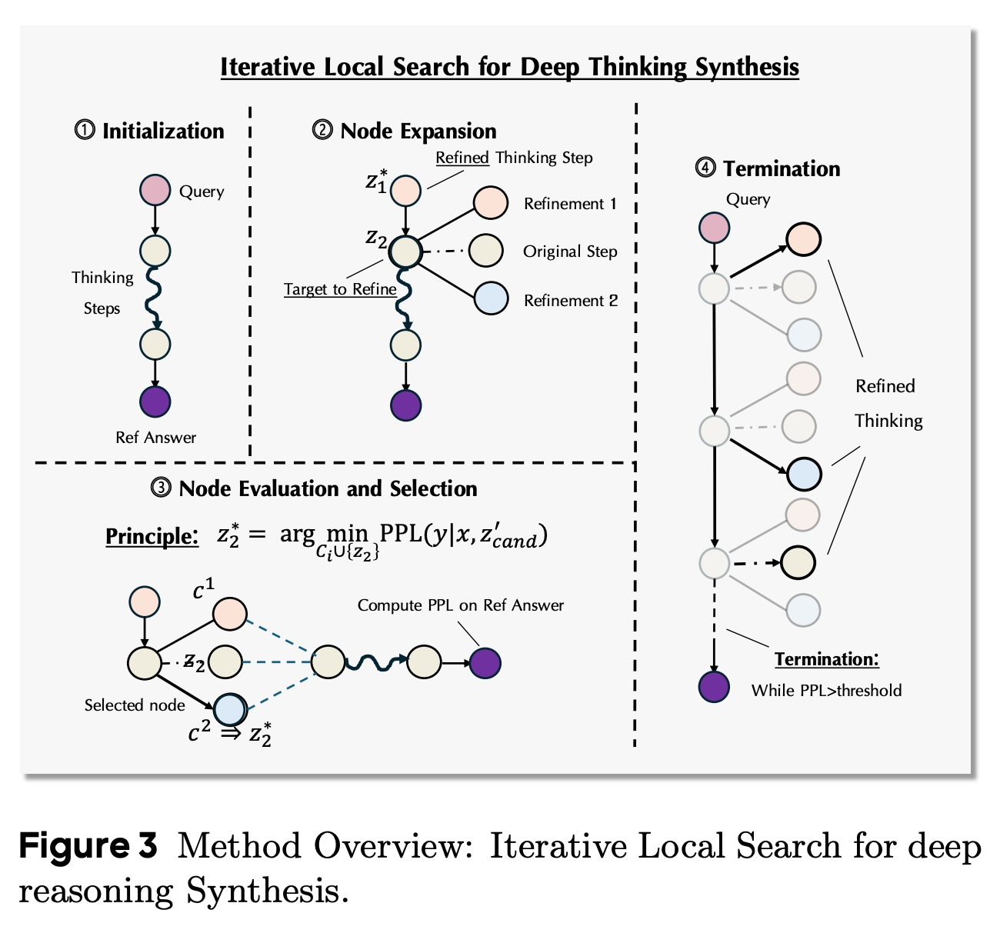
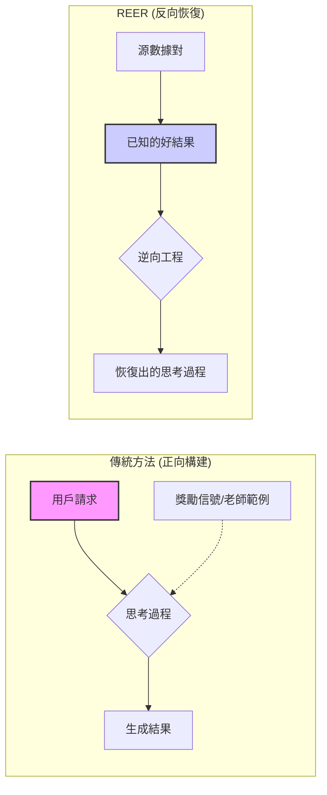
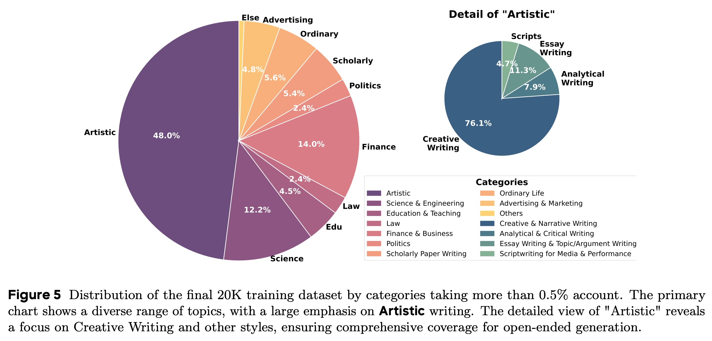
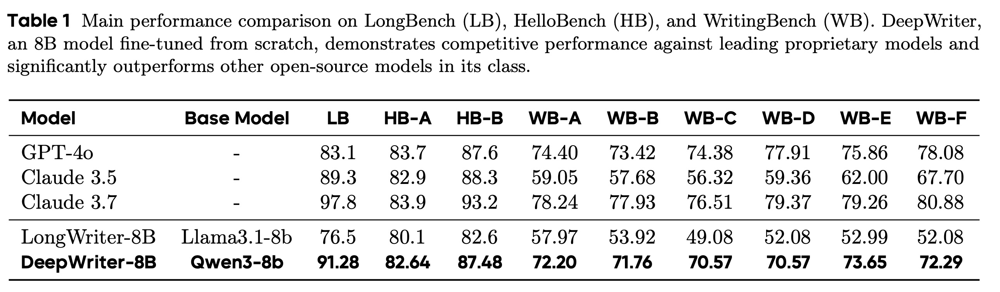
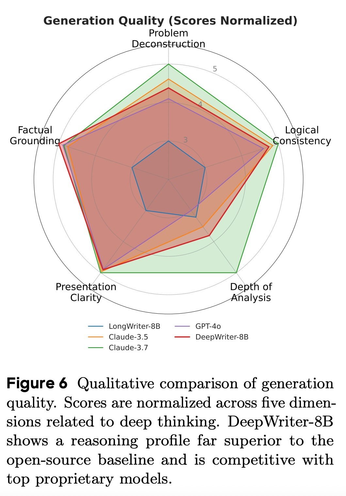

## AI论文解读 | Reverse-Engineered Reasoning for Open-Ended Generation
        
### 作者        
digoal        
        
### 日期        
2025-09-13        
        
### 标签        
PostgreSQL , PolarDB , DuckDB , AI , 论文解读        
        
----        
        
## 背景  
      
https://arxiv.org/pdf/2509.06160        
  
提示:          
```          
读懂《Reverse-Engineered Reasoning for Open-Ended Generation》这篇论文需要提前掌握哪些基础知识, 请使用中文通熟易懂的讲解这些基础知识, 可以引用论文中的图、表或使用Markdown支持的图形(text,mermaid等)增加解释性. 
  
使用中文通熟易懂的解读《Reverse-Engineered Reasoning for Open-Ended Generation》这篇论文, 其中的关键内容请着重讲解, 可以引用论文中的图、表或使用Markdown支持的图形(text,mermaid等)增加解释性. 
  
提取《Reverse-Engineered Reasoning for Open-Ended Generation》这篇论文中的重要术语, 使用中文对这些术语进行通熟易懂的讲解, 可以引用论文中的图、表或使用Markdown支持的图形(text,mermaid等)增加解释性. 
```     
  
## 1 前置知识 
  
想要读懂《Reverse-Engineered Reasoning for Open-Ended Generation》这篇论文，你需要了解几个核心基础知识。这篇论文提出了一种新的方法来解决大型语言模型（LLM）在开放式、非可验证任务（如创意写作）中的深度推理问题。

以下是理解这篇论文需要掌握的几个关键概念，我将用通俗易懂的方式为你解释。

### 1\. 深度推理 (Deep Reasoning)

深度推理是一种让语言模型在生成最终答案之前进行多步思考和规划的能力。这与快速、表面化的推理不同，它让模型能够像人类一样，先在大脑中形成一个结构化的、一步一步的思考过程，然后再生成最终的文本。这篇论文的核心目标就是教会模型这种能力，尤其是在那些没有唯一正确答案的开放式任务上。

### 2\. 现有主流方法的局限性

论文首先对比了两种用于训练模型深度推理的现有主流方法，并指出了它们的不足：

  * **强化学习 (Reinforcement Learning, RL)**：RL 就像让模型通过“试错”来学习。在数学、编程等有明确正确答案的任务中，模型得到正确答案就能获得正向奖励，这非常有效 。但对于创意写作这类任务，没有唯一的“正确”答案，其质量判断依赖于主观标准（如原创性、情感共鸣等），因此很难提供清晰的奖励信号 。
  * **指令蒸馏 (Instruction Distillation)**：这种方法是让一个强大的“老师”模型（如 GPT-40）生成高质量的推理过程，然后用这些数据去训练一个较小的“学生”模型。但论文指出，这种方法有两个主要缺点：一是成本高昂，因为需要大量调用强大的私有模型 ；二是它的能力上限受限于老师模型，学生模型无法学会老师模型所不具备的能力 。

论文通过一张图（图 1）清晰地展示了这两种“正向”推理构建方法的困境。    

图 1：正向推理与逆向推理的对比

### 3\. 反向推理 (Reverse-Engineered Reasoning, REER)

这是论文提出的新范式。与从问题出发“正向”构建推理过程不同，REER 的核心思想是**从一个已知的优质答案出发，去“反向”推导出最有可能生成它的、结构化的思考过程** 。

你可以这样理解这个过程：不是让模型从零开始想如何写一篇文章，而是给它一篇写好的优秀文章，然后让它反过来思考：“如果要写出这篇好文章，我需要经过哪些思考步骤？”通过这种方式，可以大规模、低成本地合成高质量的推理数据 。

### 4\. 困惑度 (Perplexity, PPL)

**困惑度是这篇论文中最重要的技术概念**。它是一个衡量语言模型对文本序列“惊讶程度”的指标 。

  * **困惑度越低**，代表模型对这段文本越不“惊讶”，说明这段文本在模型看来是越连贯、越合乎逻辑、越符合预期的。
  * **困惑度越高**，代表模型越“惊讶”，说明这段文本在模型看来是不太可能出现的、不连贯的。

论文利用困惑度来作为判断推理轨迹质量的“代理指标”（proxy）。简单来说，一个好的思考过程（推理轨迹）应该能让模型在看到最终答案时，其困惑度降到最低 。

### 5\. 迭代局部搜索 (Iterative Local Search)

由于寻找最优推理轨迹的搜索空间过于庞大，论文没有采用传统的梯度下降法，而是设计了一种**无梯度（gradient-free）的迭代局部搜索算法** 。

这个算法的工作流程如下图（图 3）所示：    

图 3：深度思考合成的迭代局部搜索方法概述 

1.  **初始化 (Initialization)**：从一个给定的问题和优质答案对开始，模型首先生成一个初始的、不完美的推理轨迹 。
2.  **节点扩展 (Node Expansion)**：算法进入一个迭代循环，一次只改进推理轨迹中的一个“片段”（segment） 。模型会针对这个片段生成多个可能的备选改进方案 。
3.  **节点评估与选择 (Node Evaluation and Selection)**：对每一个备选方案，算法会计算它所对应的最终答案的困惑度。困惑度最低（即最能解释最终答案）的那个方案会被选中，并用于更新当前的推理轨迹 。
4.  **终止 (Termination)**：这个迭代过程会持续进行，直到困惑度达到预设的阈值或达到最大迭代次数为止 。

通过这个过程，模型能够将最初简单的想法逐渐细化和完善，最终生成高质量的、详细的深度推理轨迹 。

-----

掌握了以上这些基础知识，你就能更好地理解这篇论文的核心思想、技术实现和创新点。它本质上是提供了一种在缺乏明确奖励信号的开放式领域，**通过“逆向”思维，利用困惑度作为指导，来自动化地合成高质量训练数据**的新范式 。
  
## 2 解读论文 
  
好的，這是一篇關於名為《Reverse-Engineered Reasoning for Open-Ended Generation》的論文的通俗解讀。

-----

### 論文核心思想解讀：像破案一樣，從結果反推思考過程

想像一下，傳統訓練AI寫作或進行創意生成，就像是教一個學生解題。你要麼是：

1.  **強化學習 (Reinforcement Learning)**：讓他不斷嘗試，做對了給獎勵，做錯了就懲罰。但在寫作這種沒有標準答案的領域，什麼才算「對」？很難定義，所以獎勵信號不明確。
2.  **指令蒸餾 (Instruction Distillation)**：找個學霸（比如GPT-4），讓他把解題的思路過程寫下來，然後讓普通學生去模仿。但這個方法不僅成本高昂，而且學生的水平永遠無法超越學霸老師。

這篇論文提出了一個全新的思路，我們稱之為 **逆向工程推理 (Reverse-Engineered Reasoning, REER)**。

這個方法不再是從問題出發「正向」地去構建思考過程，而是像偵探破案一樣，從一個已知的「好結果」（一篇好文章）出發，「反向」地去推導出「最可能產生這個結果的思考過程是怎樣的」。

**簡單來說，論文的核心就是：**

> 給定一篇高質量的文章，我們反過來問：「一個聰明的人類作者，在寫這篇文章之前，腦子裡會想些什麼、如何規劃、如何組織思路？」然後，我們用計算機化的方法把這個潛在的、詳細的思考過程給「還原」出來。

如下圖所示，傳統方法（左側）是「正向構建」，而REER（右側）是「反向恢復」。



*圖解：傳統方法是從請求出發，通過強化學習或蒸餾來構建思考過程；而REER是從已有的高質量問答對（源數據）中的答案出發，反向恢復出其背後的思考過程。*

### 關鍵技術：REER如何實現？

REER的實現被巧妙地轉化為一個**搜索問題**。目標是在海量的可能性中，找到一條最優的「思考路徑」（Deep Reasoning Trajectory），這條路徑能最好地解釋那篇已有的高質量文章。

**評價標準是什麼？**
論文用了一個非常聰明的指標：**困惑度 (Perplexity, PPL)**。困惑度可以理解為模型對於一段文本的「驚訝程度」。如果一個思考路徑寫得好，那麼接下來生成那篇高質量文章就會變得順理成章，模型的「驚訝程度」就會很低（即PPL低）。

所以，REER的目標就是找到一條思考路徑 $z$，使得模型在看到這個思考路徑後，對高質量答案 $y$ 的困惑度 $PPL(y|x, z)$ 最小。

**實現步驟：迭代式局部搜索 (Iterative Local Search)**

由於思考路徑的可能性太多，直接找到最優解是不可能的。因此，研究者採用了一種類似「逐步優化」的策略，如下圖所示：

  

*來源：論文Fig. 3. 迭代式局部搜索用於深度思考合成的概覽。* 

1.  **初始化 (Initialization)**：首先，讓一個大語言模型（LLM）針對給定的文章，生成一個初步的、不完美的思考大綱。 
2.  **節點擴展 (Node Expansion)**：將這個大綱分成好幾個段落（步驟）。一次只針對一個段落進行優化，讓LLM圍繞這個段落生成多個更詳細、更具反思性的候選版本。 
3.  **評估與選擇 (Node Evaluation and Selection)**：用新的候選段落替換掉原文中的對應段落，然後計算整篇文章的困惑度。選擇那個能讓困惑度變得最低的候選版本，作為這一輪的優化結果。 
4.  **終止 (Termination)**：不斷重複第2步和第3步，直到困惑度降低到一個預設的目標值，或者達到了最大迭代次數為止。 

通過這個過程，一個粗糙的思考大綱會被逐步打磨成一個充滿細節、包含分支思考（比如 "嗯...或者我可以..."）和自我修正（比如 "等等，這個想法有點太直接了"）的深度思考路徑。 

### 關鍵成果：Deep Writing-20K 數據集與 Deep Writer-8B 模型

1.  **Deep Writing-20K 數據集**：利用上述REER方法，研究團隊創建並開源了一個包含2萬個深度思考路徑的大規模數據集。  該數據集覆蓋了多種主題，尤其側重於創意和藝術寫作，極大地緩解了該領域高質量訓練數據稀缺的問題。    

    *來源：論文Fig. 5. 最終20K訓練數據集的類別分布。* 

    從圖中可以看出，數據集內容多樣，其中「藝術 (Artistic)」類佔比最大（48%），而藝術類中又以「創意寫作 (Creative Writing)」為主（76.1%）。

2.  **Deep Writer-8B 模型**：團隊使用這個新創建的數據集，在一個80億參數的開源模型（Qwen3-8B）上進行微調，訓練出了**Deep Writer-8B**模型。 

### 實驗效果如何？

**Deep Writer-8B** 的表現非常驚人。論文通過一系列基準測試，將其與頂尖的專有模型（如GPT-4o, Claude 3.5）和其它強大的開源模型進行了比較。

**主要結果 (Main Results)**
如下表所示，Deep Writer-8B（最後一行）在多個寫作基準測試中，不僅遠超同級別的開源模型（Long Writer-8B），甚至在某些指標上可以媲美甚至超越GPT-4o和Claude 3.5。 

  

| 模型 | LB (長文寫作) | HB-A (開放問答) | HB-B (創意寫作) | WB-D (文學藝術) |
| :--- | :--- | :--- | :--- | :--- |
| GPT-40 | 83.1 | 83.7 | 87.6 | 77.91 |
| Claude 3.5 | 89.3 | 82.9 | 88.3 | 59.36 |
| **Deep Writer-8B** | **91.28** | **82.64** | **87.48** | **70.57** |

*來源：論文Table 1. 簡化版主要性能對比。* 

  * 在長文寫作（LB）上，它的得分（91.28）超過了GPT-40和Claude 3.5。 
  * 在創意寫作（HB-B）上，它的得分（87.48）與GPT-40（87.6）幾乎持平。 
  * 在各領域專業寫作（WB）上，它全面超越了Claude 3.5。 

**定性分析 (Qualitative Analysis)**
研究者還從多個維度評估了模型生成內容的「思考質量」，包括問題分解、邏輯一致性、分析深度等。   

*來源：論文Fig. 6. 生成質量的定性比較。* 

從雷達圖中可以看出，Deep Writer-8B（深藍色實線）的思考能力遠遠包圍了基線開源模型（淺藍色五邊形），並且與GPT-4o（紅色區域）的表現非常接近，顯示出其強大且全面的深度思考能力。 

### 結論與意義

這篇論文的貢獻是開創性的：

1.  **提出了新範式REER**：為解決開放式、非驗證性任務的深度推理訓練難題，提供了一條有別於強化學習和蒸餾的「第三條道路」。  這種方法成本效益高，且易於擴展。
2.  **開源了高質量數據集**：發布的Deep Writing-20K數據集，將極大推動社區在創意生成和長文本規劃領域的研究。 
3.  **證明了小模型的潛力**：成功證明了通過高質量的合成數據，一個中等規模的開源模型（8B）也能夠學習到 ранее被認為是頂級專有大模型才具備的複雜、類人的深度思考和規劃能力。 

總之，REER通過一種「逆向思維」，巧妙地繞過了傳統方法的瓶頸，為訓練更聰明、更會「思考」的AI模型開闢了一條充滿潛力的新路。
  
## 3 术语 
  
-----

想要理解《Reverse-Engineered Reasoning for Open-Ended Generation》这篇论文，掌握几个重要的术语至关重要。我将为你详细解释这些核心概念。

### 1\. 反向推理 (Reverse-Engineered Reasoning, REER)

这是论文的核心思想。传统的推理模式是“正向”的，就像你解一道数学题，从问题（题目）开始，一步一步推导出答案。而反向推理则恰恰相反：它从一个**已知的高质量答案**出发，反向推导出“为了得到这个答案，最合理的思考路径（推理轨迹）是什么？”

可以想象成侦探破案：不是从案发现场开始寻找线索，而是从一个已经抓住的罪犯（高质量答案）开始，反向梳理他作案的全过程。这种方法解决了开放式任务中无法提供明确奖励信号的问题，因为优质的“答案”本身就是已知的，模型只需要去寻找能解释这个答案的“思考过程”。

### 2\. 推理轨迹 (Reasoning Trajectory)

推理轨迹指的是模型在生成最终答案之前，所经历的**一系列中间思考步骤**。它通常是结构化的，比如“第一步，构思故事背景；第二步，塑造主角性格；第三步，设计情节冲突……”

这篇论文的目标，正是要让模型能够生成和学习这种高质量的、多步的推理轨迹。

### 3\. 困惑度 (Perplexity, PPL)

**困惑度是衡量一个语言模型对文本序列“惊讶程度”的指标**。简单来说：

  * **困惑度越低**，说明模型认为这段文字越“顺畅”，越符合语言规律，越容易预测。
  * **困惑度越高**，说明模型觉得这段文字越“奇怪”，越难预测。

在REER方法中，困惑度被用作一个**代理目标（Proxy Objective）**。论文的核心假设是：如果一个推理轨迹是好的，那么它会使得模型在看到最终答案时，困惑度降到最低。也就是说，一个好的思考过程，能够让最终的答案变得“毫不意外”，水到渠成。

### 4\. 迭代局部搜索 (Iterative Local Search)

这是一种用于寻找最优推理轨迹的算法。由于可能的推理轨迹数量巨大，无法一一遍历，所以论文采用了一种无梯度的迭代搜索方法。

这个过程就像是在一个巨大的迷宫中寻找出口，但你每次只能走一小步，并且每走一步都选择能让你离出口更近的方向。该算法的工作流程如下图所示：

一个图，展示了迭代局部搜索算法的四个阶段：初始化、节点扩展、节点评估与选择、终止。   

1.  **初始化**: 从一个问题和优质答案开始，生成一个粗略的、初始的推理轨迹。
2.  **扩展**: 算法一次只看推理轨迹中的一个部分，并针对这个部分生成多个可能的改进方案。
3.  **评估与选择**: 对每个改进方案，计算它所对应的答案的困惑度。选择其中困惑度最低的那个方案。
4.  **终止**: 重复以上步骤，直到困惑度不再明显下降或达到设定的迭代次数，最终得到一个高质量的推理轨迹。

### 5\. Deep Writing-20K (DW-20K)

这是论文中开源的一个大规模数据集，包含了超过2万个由REER方法生成的、高质量的**问题-推理轨迹-答案**三元组。这个数据集对于训练未来能进行深度推理的语言模型至关重要。

### 6\. DeepWriter

这是论文作者基于REER方法训练出来的、能够进行深度推理的语言模型系列，包括DeepWriter-8B等不同规模的模型。这些模型在开放式生成任务中展现了优于其他同等规模模型的表现。
  
## 参考        
         
https://arxiv.org/pdf/2509.06160    
        
<b> 以上内容基于DeepSeek、Qwen、Gemini及诸多AI生成, 轻微人工调整, 感谢杭州深度求索人工智能、阿里云、Google等公司. </b>        
        
<b> AI 生成的内容请自行辨别正确性, 当然也多了些许踩坑的乐趣, 毕竟冒险是每个男人的天性.  </b>        
  
    
#### [期望 PostgreSQL|开源PolarDB 增加什么功能?](https://github.com/digoal/blog/issues/76 "269ac3d1c492e938c0191101c7238216")
  
  
#### [PolarDB 开源数据库](https://openpolardb.com/home "57258f76c37864c6e6d23383d05714ea")
  
  
#### [PolarDB 学习图谱](https://www.aliyun.com/database/openpolardb/activity "8642f60e04ed0c814bf9cb9677976bd4")
  
  
#### [PostgreSQL 解决方案集合](../201706/20170601_02.md "40cff096e9ed7122c512b35d8561d9c8")
  
  
#### [德哥 / digoal's Github - 公益是一辈子的事.](https://github.com/digoal/blog/blob/master/README.md "22709685feb7cab07d30f30387f0a9ae")
  
  
#### [About 德哥](https://github.com/digoal/blog/blob/master/me/readme.md "a37735981e7704886ffd590565582dd0")
  
  

  
