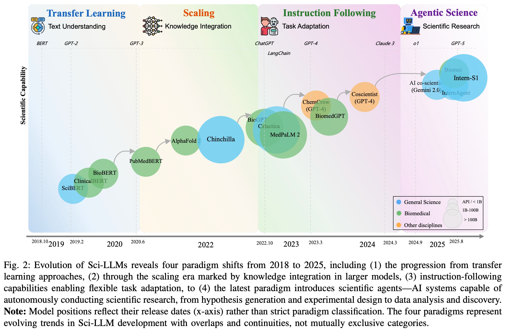
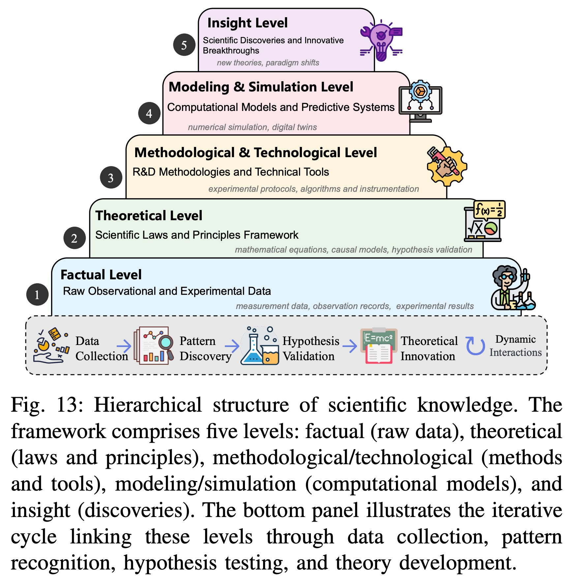
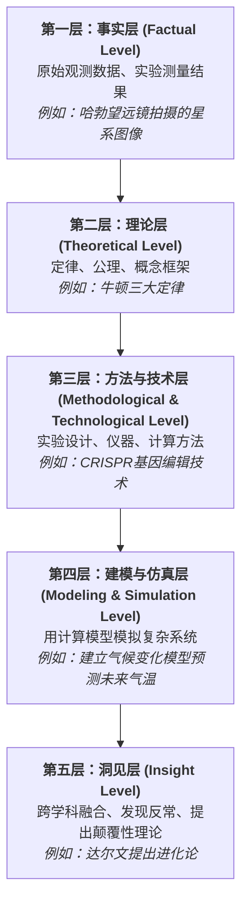
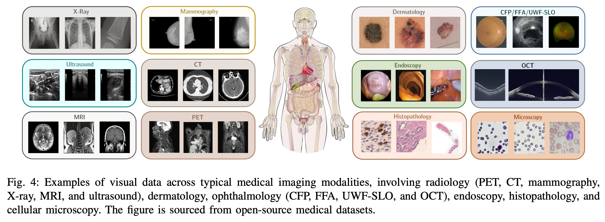
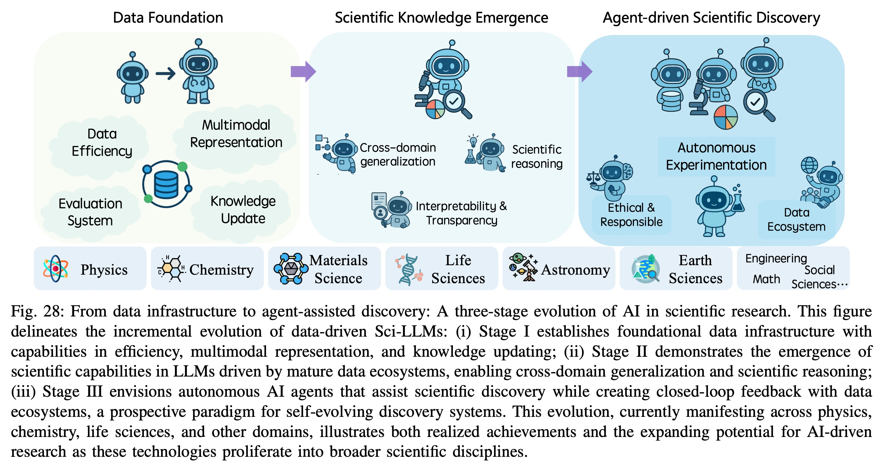
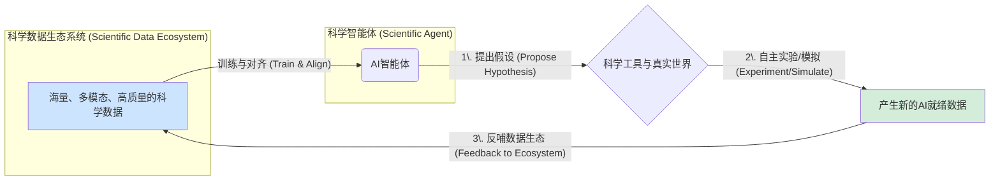

## AI论文解读 | A Survey of Scientific Large Language Models: From Data Foundations to Agent Frontiers
        
### 作者        
digoal        
        
### 日期        
2025-09-13        
        
### 标签        
PostgreSQL , PolarDB , DuckDB , AI , 论文解读        
        
----        
        
## 背景  
      
https://arxiv.org/pdf/2508.21148        
  
提示:          
```          
读懂《A Survey of Scientific Large Language Models: From Data Foundations to Agent Frontiers》这篇论文需要提前掌握哪些基础知识, 请使用中文通熟易懂的讲解这些基础知识, 可以引用论文中的图、表或使用Markdown支持的图形(text,mermaid等)增加解释性. 
  
使用中文通熟易懂的解读《A Survey of Scientific Large Language Models: From Data Foundations to Agent Frontiers》这篇论文, 其中的关键内容请着重讲解, 可以引用论文中的图、表或使用Markdown支持的图形(text,mermaid等)增加解释性. 
  
提取《A Survey of Scientific Large Language Models: From Data Foundations to Agent Frontiers》这篇论文中的重要术语, 使用中文对这些术语进行通熟易懂的讲解, 可以引用论文中的图、表或使用Markdown支持的图形(text,mermaid等)增加解释性. 
```     
  
## 1 前置知识 
  
阅读《A Survey of Scientific Large Language Models: From Data Foundations to Agent Frontiers》这篇论文，需要掌握以下几个方面的基础知识，才能更好地理解其核心思想。这些知识主要集中在大型语言模型（LLMs）和科学研究的交叉领域。

---

### 1. 大型语言模型（LLM）的基础概念
首先，你需要理解什么是大型语言模型。论文中提到，LLMs主要基于 **Transformer** 解码器架构 。它们通过对海量文本数据进行 **预训练** 来学习世界知识，这个过程通常使用“下一个词元预测”（next-token prediction）的目标 。

简单来说，LLM就是一种能够理解、生成和处理人类语言的模型。论文中提到，LLM的核心能力是在预训练阶段从大规模多样化的数据中编码“世界知识”，而 **后训练** 过程（post-training）则是激活和增强这些知识，让模型能够理解用户指令并解决复杂任务 。

### 2. 科学数据与通用数据之间的差异
这篇论文的核心论点之一是，科学数据与通用的自然语言处理（NLP）数据集有显著不同 。为了理解这一点，你需要知道科学数据的独特之处。

论文提出了一个科学数据分类学，将其分为六大类主要数据类型:
* **文本格式（Textual Formats）**: 包括科学论文、实验报告、实验室笔记等，这些是科学知识的基础 。
* **视觉数据（Visual Data）**: 例如医学扫描图像、天文观测图像等 。
* **符号表示（Symbolic Representations）**: 包括数学公式、化学分子结构式等，这些数据带有精确的符号关系，必须在处理过程中得以保留 。
* **结构化数据（Structured Data）**: 例如数据库和知识图谱 。
* **时间序列数据（Time-Series Data）**: 例如神经生理学记录、天文学中的光变曲线等 。
* **多组学数据整合（Multi-omics Integration）**: 这是生命科学中的一个特殊情况，它需要整合来自不同生物学层面的异构数据（如基因组学、转录组学、蛋白质组学）。

论文指出，科学数据集具有极高的 **异构性（heterogeneity）**，跨越多种模态和格式 。例如，化学领域的模型必须能够处理分子字符串、三维分子坐标、光谱数据和反应机制等多种数据类型 。

### 3. 科学知识的层次结构
论文认为，科学知识本身具有层次结构，这对于理解科学人工智能系统至关重要 。它将科学知识分为五个层次：
* **事实层面（Factual Level）**: 这是最基础的层面，由原始观测数据和实验数据组成。
* **理论层面（Theoretical Level）**: 在事实基础上，通过归纳和推理形成的抽象理论框架。
* **方法论与技术层面（Methodological and Technological Level）**: 描述如何进行实验和解决问题的方法。
* **建模与仿真层面（Modeling and Simulation Level）**: 使用数学模型和计算工具模拟现实世界。
* **洞察层面（Insight Level）**: 通过分析和综合不同层次的知识，形成的深层次见解。

理解这些层次有助于认识到，科学人工智能系统不仅需要处理原始数据，还需要在不同层次之间进行推理和整合。

---

### 4. 科学LLM的演变范式
论文概述了科学LLM自2018年以来的四个主要演变阶段，可以参考论文中的图2（Fig. 2）进行理解:    

1.  **迁移学习阶段（Transfer Learning）** (2018-2020): 这一阶段的模型（如SciBERT、BioBERT）通过在大型科学语料库上进行预训练，展现了在特定科学文本理解任务中的能力 。
2.  **规模化阶段（Scaling）** (2020-2022): 这一阶段的模型（如GPT-3、Galactica）通过扩大参数和训练数据规模，实现了紧急的知识整合能力 。
3.  **指令遵循阶段（Instruction Following）** (2022-2024): 这一阶段的模型（如ChatGPT、MedPaLM-2）专注于通过指令微调来适应特定任务，从而实现更精确的科学任务执行 。
4.  **智能体科学阶段（Agentic Science）** (2023-至今): 这是最新的范式，AI系统被赋予了“科学能动性”（scientific agency），能够像科学研究者一样规划、行动并迭代发现过程 。这些智能体能够利用外部工具和多智能体协作，自主进行科学研究 。

---

### 5. 论文讨论的主要挑战
理解这篇论文还需要了解科学LLM面临的独特挑战:
* **数据异构性（Data Heterogeneity）**: 科学数据形式多样，导致处理困难 。
* **跨尺度与多模态整合（Cross-scale and Multimodal Integration）**: 模型需要能够同时处理和整合跨越不同尺度和模态的数据 。
* **非顺序和非文本数据的表示（Representing Non-Sequential and Non-Textual Data）**: 许多科学知识无法用线性文本表示，需要创新的方法来处理 。
* **现有科学数据集的局限性（Limitations of Current Scientific Datasets）**: 论文指出，目前科学数据集存在实验数据稀缺、过度依赖文本模态数据、缺乏可追溯性等问题 。
* **评估方法的不足（Evaluation of Sci-LLMs）**: 传统的NLP基准测试不足以评估科学发现能力。论文讨论了向评估研究水平、过程导向和基于代理的评估转变的趋势 。

---

掌握以上这些基础知识，你将能够更好地理解论文中关于数据、模型、智能体和未来发展方向的讨论，并领会这篇论文如何将科学LLM的发展重新定义为模型与底层数据基石的共同演化过程。
  
## 2 解读论文 
  
好的，很乐意为您用通俗易懂的中文解读这篇重磅综述论文《A Survey of Scientific Large Language Models: From Data Foundations to Agent Frontiers》。

这篇论文由上海人工智能实验室联合全球顶尖高校和科研机构共同完成，堪称一部关于“科学大模型（Sci-LLMs）”领域的百科全书。它不仅仅是简单罗列现有的模型，而是**从最根本的“数据”视角出发，为我们描绘了一幅从数据基石到智能体前沿的完整路线图**。

简单来说，论文的核心思想是：**科学大模型的进步，本质上是模型与科学数据之间共同演化的结果。未来的终极目标，是让AI从一个知识渊博的“学生”，进化成一个能独立思考、动手实验、并推动知识边界的“科学家伙伴”**。

下面，我们将为您着重讲解其中的四大核心关键内容。

### 核心观点一：科学大模型的“四世同堂”——发展的四个阶段

论文开篇就用一张非常精彩的图（图2）总结了从2018年到2025年，科学大模型经历的四个主要发展阶段。这就像一个家族的“四世同堂”，每一代都有其鲜明的特点和能力。

  

图2：科学大模型从2018到2025的四个发展阶段

> **图解**：上图（原论文图2）清晰地展示了科学大模型（Sci-LLMs）的演进历程。横轴是时间，纵轴代表模型的科学能力。不同颜色的圈代表不同领域的模型（绿色是生物医学，蓝色是通用科学）。模型的发展明显分为四个阶段。 

1.  **第一阶段：迁移学习 (2018-2020) - “魔改”现有模型**

      * **特点**：这个阶段主要是将当时流行的BERT模型进行“领域化改造”。研究者们拿来一个通用的语言模型，用特定领域的科学文献（比如生物医学的论文）去继续训练它，诞生了像SciBERT（科学文献）、BioBERT（生物医学文献）这样的模型。 
      * **能力**：它们擅长**理解**特定领域的科学文本，比如做文本分类、命名实体识别等任务。但它们像一个只会背书的学生，很难生成新的、有创意的科学内容。 

2.  **第二阶段：规模为王 (2020-2022) - “大力出奇迹”**

      * **特点**：以GPT-3为代表，大家发现只要模型参数足够大、训练数据足够多，模型就会“涌现”出惊人的知识整合和推理能力。  科学界的Galactica模型就是这个思路的产物，它用海量的科学论文、教科书和百科全书进行训练。 
      * **能力**：模型开始具备初步的**知识整合**能力，能写出像模像样的科学摘要，甚至解答一些专业问题。但它们也遇到了“数据墙”——高质量的科学数据远比通用网络文本稀少。 

3.  **第三阶段：指令遵循 (2022-2024) - “听得懂人话”**

      * **特点**：以ChatGPT为标志，模型开始通过“指令微调”（Instruction-tuning）和人类反馈强化学习（RLHF）进行训练，使其能更好地理解和执行人类的复杂指令。  开源模型的兴起（如LLaMA）也极大地推动了这一阶段的发展。
      * **能力**：模型变得更加“好用”，能够进行**任务适配**，可以根据你的要求写代码、设计实验步骤、解释复杂的生物过程等。  这是Sci-LLMs应用大爆发的时期。

4.  **第四阶段：智能体科学 (2023-至今) - “自主的科学家”**

      * **特点**：这是目前最前沿的阶段。AI不再是一个被动回答问题的工具，而是被赋予了“能动性”（Agency），成为一个可以**自主规划、执行、反思**的科学智能体（Agent）。 
      * **能力**：这些AI智能体可以模拟一个科研团队，自主提出假说、设计实验、调用外部工具（如数据库、模拟器）进行验证，甚至撰写论文。  它们的目标是实现**端到端的科学研究自动化**。 

-----

### 核心观点二：科学知识不是一堆事实，而是一座金字塔

这篇论文提出了一个非常深刻的观点：**科学知识是有层级结构的，而不是一堆杂乱事实的集合。**  理解这个层级对于构建真正智能的科学AI至关重要。论文将其划分为五个层次（见图13）。

  

图13：科学知识的层次结构

> **图解**：上图（原论文图13）展示了科学知识的五层金字塔结构。从底层的原始数据到顶层的革命性洞见，知识的抽象程度和价值逐级提升。科学的进步正是在这些层级间不断循环迭代的过程。 

我们可以用一个简单的文本图形来理解这个金字塔：



  * **对AI的启示**：当前的科学大模型大多停留在对**事实层**和**理论层**知识的记忆和检索上。一个真正强大的Sci-LLM，必须能够理解和运用所有五个层次的知识。例如，它不仅要能背出牛顿定律（理论层），还要能理解如何设计实验来验证它（方法层），能用代码模拟一个物体的运动（建模层），甚至在面对与定律相悖的数据时，能提出新的可能性（洞见层）。 

-----

### 核心观点三：科学数据的“七十二变”与系统性挑战

论文花费大量篇幅分析了科学数据的极端复杂性，这正是科学大模型面临的最大挑战。科学数据远非普通文本那么简单，它千变万化，如同孙悟空的“七十二变”。

  * **多模态 (Multi-modal)**：科学研究天然就是多模态的。
      * **文本格式**：论文、教科书、实验记录本。 
      * **视觉数据**：医学影像（X光、CT ）、显微镜图像 、天文照片 、地理遥感图  等。（如下图所示）
      * **符号表示**：数学公式（$E=mc^2$ ）、化学分子式（SMILES字符串，如`C1=CC=C(C=C1)O`代表苯酚 ）、基因序列等。
      * **结构化数据**：数据库、知识图谱。 
      * **时间序列数据**：脑电图（EEG）信号、引力波数据、气象站记录。 

  

图4：医学影像中的多种视觉数据

> **图解**：上图（原论文图4）展示了医学领域视觉数据的多样性，从放射学（X光、CT、MRI等）到皮肤病学、眼科、内窥镜、病理学和细胞显微镜，每种模态都承载着独特的诊断信息。 

  * **系统性挑战**：
    1.  **数据孤岛与异构性**：不同领域、不同仪器产生的数据格式、标准、尺度都不同，难以整合。 
    2.  **静态知识与动态过程的鸿沟**：现有数据集大多是已发表成果的“静态快照”，无法体现科学研究的动态、迭代过程，尤其是失败的实验和曲折的探索路径。 
    3.  **数据质量与偏见**：存在严重的发表偏见（倾向于发表阳性结果）、语言偏见（以英语为主）和领域偏见（生物医学数据远多于其他领域）。 
    4.  **缺乏“AI就绪”的数据**：大量数据以PDF等非结构化形式存在，或者缺少必要的元数据（如实验条件），AI无法直接使用。 

-----

### 核心观点四：从“数据基石”到“智能体前沿”的闭环愿景

这是论文最具前瞻性的部分，它指明了科学AI的未来发展方向——**构建一个模型与数据生态系统之间相互促进、共同演化的闭环**。

  

图28：AI在科学研究中的三阶段演进

> **图解**：上图（原论文图28）描绘了AI在科学研究中的演进蓝图。**第一阶段**是构建基础的数据设施；**第二阶段**是基于成熟的数据生态，让LLM涌现出科学能力；**第三阶段**（未来愿景）是AI智能体自主进行科学发现，同时其探索过程产生的新数据又反哺数据生态系统，形成一个自我进化、不断加速的闭环。 

这个闭环的工作模式可以这样理解：



  * **当前现状 (A -\> B)**：我们主要依赖现有的、静态的、不完美的数据集来训练模型。这是一个单向的过程。
  * **未来愿景 (B -\> C -\> D -\> A)**：
    1.  AI智能体基于现有知识，**提出新的科学假说**。
    2.  它**自主调用**外部工具（如云端实验室的机器人、超级计算机的模拟软件）来设计并执行实验进行验证。
    3.  实验过程产生**全新的、高质量、结构化的“AI就绪”数据**。
    4.  这些新数据被无缝地、实时地整合回数据生态系统中，用于**下一代AI智能体的训练和升级**。

这个闭环彻底改变了数据与模型的关系。数据不再仅仅是燃料，也成为了模型探索世界的产物。AI从此真正成为了科学发现的“引擎”，而不仅仅是“知识库”。

### 总结

总而言之，这篇论文为我们理解和发展科学大模型提供了一个**以数据为核心**的全新框架。它告诉我们，通往通用人工智能科学家的道路，必须解决数据层面的根本性挑战。未来的突破将不仅仅依赖于更大的模型或更巧妙的算法，更在于能否构建一个能让AI智能体**自由探索、实验、并与数据世界实时互动的、自我完善的生态系统**。这为AI for Science领域的未来研究指明了清晰、宏大且激动人心的方向。
  
## 3 术语 
  
好的，根据论文《A Survey of Scientific Large Language Models: From Data Foundations to Agent Frontiers》，以下是其中一些重要的核心术语及其通俗易懂的中文讲解。

-----

### 1\. 科学大型语言模型（Sci-LLM）

  * **通俗讲解**: **科学大型语言模型（Sci-LLM）** 并不是一个全新的模型类型，而是将现有的LLM（如GPT-4、Llama等）应用到科学研究领域后，为了适应科学数据的特殊性而进行微调和优化的模型。简单来说，它就像一个“通才”的LLM经过了“科学专业特训”，变得更擅长理解和处理物理、化学、生物、医学等领域的专业知识和数据。

-----

### 2\. 数据基础（Data Foundations）

  * **通俗讲解**: 论文认为，科学LLM的根基在于其所学习的“数据基础”。这与通用LLM主要学习自然语言不同，科学LLM需要处理高度多样化的数据。
  * **重要概念**：
      * **异构性（Heterogeneity）**: 科学数据并非单一的文本格式，而是高度混杂的。例如，在化学领域，数据可能包括：
          * 文本（化学论文）
          * 符号（分子式 C₆H₁₂O₆）
          * 图像（分子结构图）
          * 表格（实验数据）
      * **多模态（Multimodality）**: 科学数据通常是多模态的，意味着它跨越多种形式。例如，一篇研究论文可能包含文字、图表、公式和代码，模型需要理解它们之间的内在联系。

-----

### 3\. 智能体科学（Agentic Science）

  * **通俗讲解**: 这是论文提出的一个最新发展范式。传统的LLM是被动地接收指令并给出答案，而 **智能体科学（Agentic Science）** 则将LLM升级为具有“能动性”（agency）的科学研究“智能体”。
  * **智能体（Agent）** 不仅能回答问题，还能：
      * **自主规划**：根据研究目标，制定实验计划或数据分析步骤。
      * **工具使用**：调用外部工具，如计算软件、数据库或自动化实验设备。
      * **自我迭代**：根据实验结果，调整计划，进行下一轮的探索和发现。

你可以把“智能体科学”想象成一个AI科学家，它能像人类一样，从一个想法开始，然后自己去设计实验、收集数据、分析结果，最终得出结论。

-----

### 4\. 科学LLM的范式演变

  * **通俗讲解**: 论文将科学LLM的发展分为四个阶段，这是一个从简单到复杂、从被动到主动的演变过程。
  * **演变路径（根据论文Fig. 2）**:    
    ```mermaid
    graph TD
        A[阶段1: 迁移学习] --> B[阶段2: 规模化]
        B --> C[阶段3: 指令遵循]
        C --> D[阶段4: 智能体科学]
        style A fill:#f9f,stroke:#333,stroke-width:2px
        style B fill:#9ff,stroke:#333,stroke-width:2px
        style C fill:#f9f,stroke:#333,stroke-width:2px
        style D fill:#9ff,stroke:#333,stroke-width:2px
    ```
    1.  **迁移学习（Transfer Learning）**: 最初的模型（如SciBERT、BioBERT）在海量科学文本上预训练，然后用于下游任务，例如文本分类。
    2.  **规模化（Scaling）**: 随着模型规模增大（如GPT-3），模型开始涌现出处理复杂科学任务的能力。
    3.  **指令遵循（Instruction Following）**: 模型通过指令微调（Instruction Tuning），能够更好地理解和执行用户的复杂指令，例如生成研究报告或解释概念。
    4.  **智能体科学（Agentic Science）**: 智能体能够自主规划和执行任务，实现更深层次的科学发现，这是当前最前沿的阶段。

-----

### 5\. 科学知识的层次结构

  * **通俗讲解**: 论文认为科学知识并不是平面的，而是分层次的。理解这个层次结构有助于我们设计更有效的科学AI系统。
  * **五个知识层次**:
    1.  **事实层面（Factual Level）**: 最基础的数据，比如实验观测值。
    2.  **理论层面（Theoretical Level）**: 建立在事实之上，通过归纳和推理形成的理论。
    3.  **方法论与技术层面（Methodological and Technological Level）**: 描述如何获取知识和解决问题的方法。
    4.  **建模与仿真层面（Modeling and Simulation Level）**: 使用数学或计算模型来模拟现实。
    5.  **洞察层面（Insight Level）**: 最高层次，是跨越不同层面的知识融合后产生的深刻见解。

这个框架表明，一个真正智能的科学LLM，不仅要能处理原始数据（事实层面），还要能够进行高级别的推理和建模（理论、建模层面），最终产生新的洞见。
  
## 参考        
         
https://arxiv.org/pdf/2508.21148    
        
<b> 以上内容基于DeepSeek、Qwen、Gemini及诸多AI生成, 轻微人工调整, 感谢杭州深度求索人工智能、阿里云、Google等公司. </b>        
        
<b> AI 生成的内容请自行辨别正确性, 当然也多了些许踩坑的乐趣, 毕竟冒险是每个男人的天性.  </b>        
  
    
#### [期望 PostgreSQL|开源PolarDB 增加什么功能?](https://github.com/digoal/blog/issues/76 "269ac3d1c492e938c0191101c7238216")
  
  
#### [PolarDB 开源数据库](https://openpolardb.com/home "57258f76c37864c6e6d23383d05714ea")
  
  
#### [PolarDB 学习图谱](https://www.aliyun.com/database/openpolardb/activity "8642f60e04ed0c814bf9cb9677976bd4")
  
  
#### [PostgreSQL 解决方案集合](../201706/20170601_02.md "40cff096e9ed7122c512b35d8561d9c8")
  
  
#### [德哥 / digoal's Github - 公益是一辈子的事.](https://github.com/digoal/blog/blob/master/README.md "22709685feb7cab07d30f30387f0a9ae")
  
  
#### [About 德哥](https://github.com/digoal/blog/blob/master/me/readme.md "a37735981e7704886ffd590565582dd0")
  
  

  
