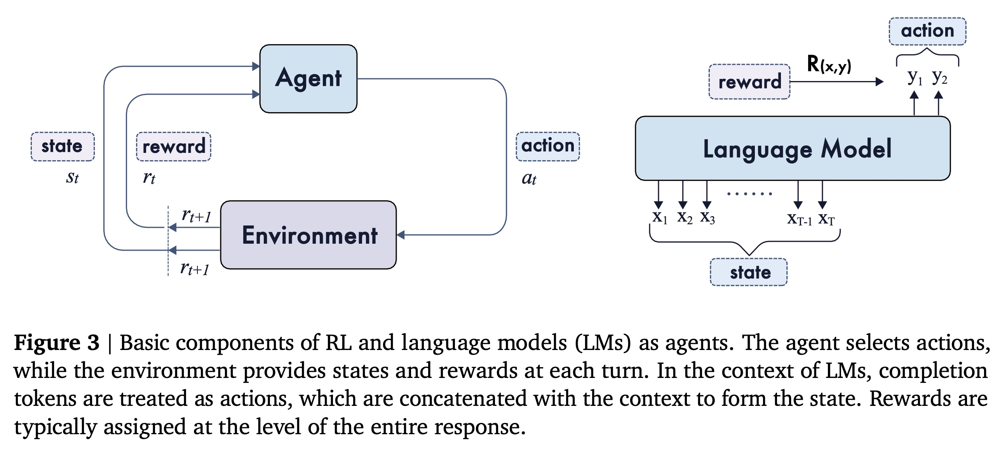
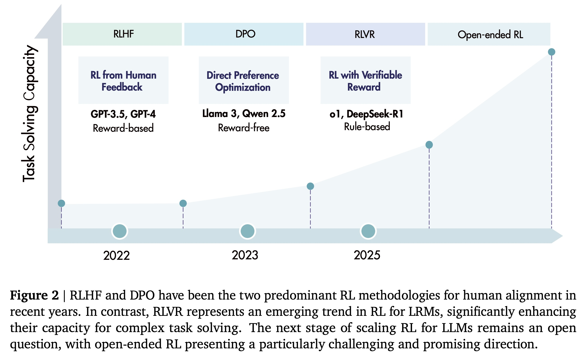
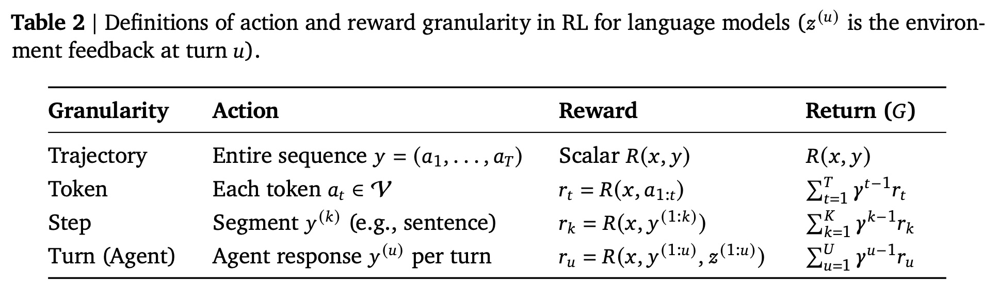
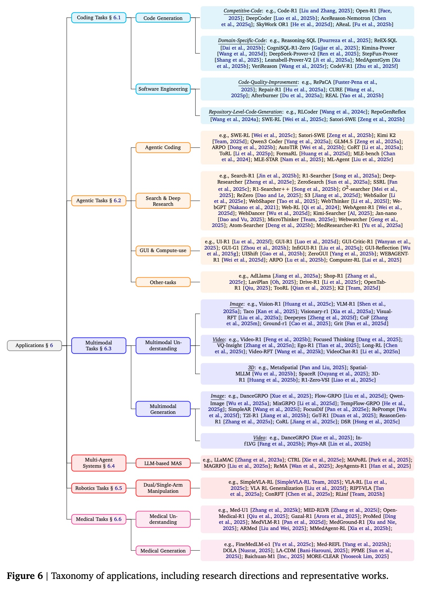

## AI论文解读 | A Survey of Reinforcement Learning for Large Reasoning Models
        
### 作者        
digoal        
        
### 日期        
2025-09-13        
        
### 标签        
PostgreSQL , PolarDB , DuckDB , AI , 论文解读        
        
----        
        
## 背景  
      
https://arxiv.org/pdf/2509.08827        
  
提示:          
```          
读懂《A Survey of Reinforcement Learning for Large Reasoning Models》这篇论文需要提前掌握哪些基础知识, 请使用中文通熟易懂的讲解这些基础知识, 可以引用论文中的图、表或使用Markdown支持的图形(text,mermaid等)增加解释性. 
  
使用中文通熟易懂的解读《A Survey of Reinforcement Learning for Large Reasoning Models》这篇论文, 其中的关键内容请着重讲解, 可以引用论文中的图、表或使用Markdown支持的图形(text,mermaid等)增加解释性. 
  
提取《A Survey of Reinforcement Learning for Large Reasoning Models》这篇论文中的重要术语, 使用中文对这些术语进行通熟易懂的讲解, 可以引用论文中的图、表或使用Markdown支持的图形(text,mermaid等)增加解释性. 
```     
  
## 1 前置知识 
  
要读懂《A Survey of Reinforcement Learning for Large Reasoning Models》这篇论文，您需要提前掌握以下两方面的基础知识：**强化学习（Reinforcement Learning, RL）基础** 和 **大语言模型（Large Language Models, LLMs）基础**，以及两者如何结合。

-----

### 1\. 强化学习基础

这篇论文的核心是强化学习，因此理解其基本组成部分至关重要。强化学习是一种让智能体在特定环境中通过试错来学习如何做出最优决策，以最大化累积奖励的方法 。

论文中**图3**直观地展示了强化学习的基本框架 。您可以将其理解为一个循环，包含以下几个核心概念：   

  * **Agent (智能体):** 在这个框架中，智能体就是我们想要训练的模型，即大型语言模型（LLM） 。
  * **Environment (环境):** 智能体与其互动的外部世界。对于语言模型，这通常是指用户给出的**提示（Prompt/Task）**，以及模型已生成的部分内容 。
  * **State (状态):** 智能体在每个时间点所处的具体情境。在LLM中，这由用户提示和到目前为止已生成的文本序列组成 。
  * **Action (行动):** 智能体在某个状态下可以做出的选择。在语言模型中，每个“行动”就是生成序列中的下一个**词元（token）** 。
  * **Reward (奖励):** 智能体完成行动后，环境给予的反馈信号。奖励可以是单一的，比如在整个输出序列结束后给出的最终奖励；也可以是多步的，为序列中的每个词元或每个步骤提供奖励 。智能体的目标就是最大化其获得的累积奖励 。

这个循环可以用以下文本图表示：

```
Agent（LLM） --> Action（生成词元） --> Environment（提示和已生成文本）
        ^                                      |
        |                                      v
      Reward（奖励）   <--  Environment（环境）<-- State（状态）
```

-----

### 2\. 大语言模型（LLMs）与强化学习的结合

论文重点探讨了强化学习如何从最初的“人机对齐”转向“推理能力”的培养 。

  * **从对齐到推理：** 最初，强化学习主要用于 **从人类反馈中学习强化学习（RLHF）** 和 **直接偏好优化（DPO）** 等方法，目的是让模型行为更符合人类偏好，比如更“有用、诚实、无害” 。
  * **可验证奖励的强化学习（RLVR）：** 论文指出，一个新兴趋势是利用 **可验证奖励的强化学习（RLVR）** 来训练大型推理模型（LRMs） 。这种方法不再只是对齐人类偏好，而是通过可自动检查的、基于规则的奖励信号（如数学题答案的正确性或代码的单元测试通过率）来直接激励模型进行长链条的复杂推理 。
  * **与监督微调（SFT）的区别：** 论文还讨论了强化学习与传统的 **监督微调（Supervised Fine-Tuning, SFT）** 之间的区别 。强化学习倾向于在可验证任务和显著的分布变化上实现“真正的泛化” ，而监督微调则更偏向于记忆 。

掌握了这些基础概念后，您将能更好地理解论文中关于“奖励设计”、“策略优化”、“采样策略”等更深层主题的讨论，并理解为什么强化学习被认为是将LLMs转变为LRMs的关键方法 。
  
## 2 解读论文 
  
好的，我们来通俗易懂地解读一下《A Survey of Reinforcement Learning for Large Reasoning Models》这篇重要的综述论文。

这篇论文可以看作是当前如何使用**强化学习（Reinforcement Learning, RL）** 这门技术，将我们熟知的大语言模型（LLMs，如GPT系列）“淬炼”成更强大的**大型推理模型（Large Reasoning Models, LRMs）** 的一本综合指南和路线图。

-----

### **引言：核心思想的转变**

首先，我们要理解一个核心的转变。过去，我们用强化学习主要是为了“**对齐（Alignment）**”，比如通过**RLHF（人类反馈强化学习）** 技术，让模型变得更乐于助人、诚实无害，更好地听从人类指令 。

而现在，这篇论文聚焦于一个更新、更激动人心的方向：**用强化学习直接提升模型的“推理能力”** 。这就像以前我们教一个孩子“听话懂礼貌”，现在我们开始教他“如何解奥数题和写代码”。

这个转变的核心技术趋势是 **RLVR（Reinforcement Learning with Verifiable Rewards，基于可验证奖励的强化学习）** 。

我们可以用论文中的 **图2** 来直观地理解这个演进过程：   

  * **RLHF (2022年)**：依赖人类来评价模型输出的好坏，代表是GPT-3.5/4。
  * **DPO (2023年)**：一种更简洁的对齐方法，代表是Llama 3。
  * **RLVR (2025年)**：不再依赖主观的人类判断，而是使用**可自动验证的、基于规则的奖励**，极大地提升了模型在复杂任务上的解决能力，代表是OpenAI的o1和DeepSeek-R1 。
  * **未来方向**：开放式强化学习（Open-ended RL），让模型在更开放的环境中持续学习和进化 。

-----

### **核心概念：大模型如何通过RL进行“训练”？**

为了理解后续内容，我们先用论文中的 **图3** 快速回顾一下强化学习的基本流程，并将其对应到大模型上：   

  * **智能体 (Agent)**：就是大语言模型自己 。
  * **环境 (Environment)**：模型需要解决的问题，比如一道数学题的题干 。
  * **行动 (Action)**：模型生成下一个词（Token） 。
  * **状态 (State)**：题干 + 模型已经生成的所有文字 。
  * **奖励 (Reward)**：这是最关键的部分。模型完成一次回答后，系统会给出一个分数，告诉它做得好不好 。

整个过程就是模型不断地针对问题（环境）做出回答（行动），并根据得到的分数（奖励）来调整自己的内部参数，力求下次获得更高的分数。

-----

### **第一大关键：奖励设计 (Reward Design) - 如何告诉模型“好”与“坏”？**

如何设计奖励信号，是整个强化学习流程的灵魂。论文将奖励设计分为了几大类，其中**可验证奖励**是重中之重。

#### 1\. 可验证奖励 (Verifiable Rewards)

这是RLVR的核心。对于那些有明确对错标准的任务，我们不再需要人类来打分，而是用程序自动检查 。

  * **数学任务**：检查模型在`<boxed>{...}`中给出的最终答案是否与标准答案一致。对了就给+1分，错了就是0分 。
  * **编程任务**：直接运行模型生成的代码，看它能否通过所有的单元测试（Unit Tests）。通过了就给高分 。

这个思想引出了一个非常深刻的洞见，论文中称为“**验证者定律 (Verifier's Law)**” ：

> **如果一个任务的产出结果很容易被自动验证，那么训练AI来完成这个任务就会变得相对容易。**

这就是为什么RL在数学和编程这类任务上取得了巨大突破，因为它们的“对错”一目了然，奖励信号清晰、可靠且可以大规模获取。

#### 2\. 生成式奖励 (Generative Rewards)

对于那些没有标准答案的开放式、主观性任务（如写一首诗、总结一篇文章），“验证者定律”就不适用了。这时，我们会用另一个更强大的模型（通常被称为“**裁判模型 Judge Model**”）来生成评价和分数 。这相当于用“魔法”来评价“魔法”，将RL的应用范围扩展到了非验证领域。

#### 3\. 密集奖励 vs. 稀疏奖励 (Dense vs. Sparse Rewards)

  * **稀疏奖励**：只在任务最终完成后给一次奖励（例如，只有最终答案正确才给分）。
  * **密集奖励**：在推理过程的**每一步**都给予反馈 。比如，模型解数学题时，每推导一步正确的公式，就给一点小奖励。

论文中的 **表2** 清晰地定义了不同粒度的奖励：    

| 粒度 (Granularity) | 行动 (Action) | 奖励 (Reward) |
| :--- | :--- | :--- |
| **轨迹 (Trajectory)** | 整个回答序列 | 对整个回答打一个总分 |
| **词元 (Token)** | 生成的每一个词 | 对每个词打分 |
| **步骤 (Step)** | 推理的一个步骤（如一个句子） | 对每个步骤打分 |
| **轮次 (Turn)** | 多轮对话中的一轮 | 对每一轮的回答打分 |

密集奖励能让模型更快地学到正确的推理路径，提高训练效率 。

#### 4\. 无监督奖励 (Unsupervised Rewards)

这是更前沿的方向，旨在完全摆脱人类标签和标准答案 。主要思路包括：

  * **基于模型自身**：利用模型的内在属性，如**输出一致性**（多次生成的结果如果指向同一个答案，那这个答案很可能是对的）或**内部置信度**（模型对自己生成的内容有多自信）来构造奖励信号 。
  * **基于外部启发**：使用一些自动化的、启发式的规则，比如奖励特定的输出格式或长度 。

-----

### **第二大关键：策略优化 (Policy Optimization) - 模型如何根据奖励“改进自己”？**

拿到了奖励分数后，模型需要一套算法来更新自己（即优化它的“策略”）。论文重点介绍了两大流派。

#### 1\. 有评论家算法 (Critic-based)

这类算法（如经典的 **PPO**）会训练一个额外的“评论家”模型。这个评论家模型的作用是评估当前“状态”的价值，或者说，预测从当前步骤开始最终能拿到多少分。它能提供更精细的指导，但缺点是计算开销大，训练复杂 。

#### 2\. 无评论家算法 (Critic-free)

这类算法更加简洁高效，**也是当前训练大型推理模型的主流** 。它不需要额外的评论家模型，直接使用最终的奖励信号来更新策略。其中的明星算法是 **GRPO (Group Relative Policy Optimization，组相对策略优化)** 。

GRPO的核心思想非常巧妙：

> 针对同一个问题，让模型生成一组（比如64个）不同的回答。然后，不单独看每个回答的好坏（比如+1或0），而是计算**每个回答相对于这组回答平均水平的优势**。表现优于平均水平的回答会被鼓励，低于平均水平的则被抑制 。

这种“相对评分”机制极大地稳定了训练过程，降低了奖励信号的方差，让模型学得又快又好。

-----

### **第三大关键：核心问题与争论 (Foundational Problems)**

这篇论文还深刻地探讨了领域内几个悬而未决的核心争论，这体现了其综述的深度。

#### 1\. RL的角色：磨尖还是发现？(Sharpening vs. Discovery)

  * **磨尖论 (Sharpening)**：认为RL并没有教会模型任何新知识。模型的能力是在海量的预训练数据中就已经“埋下”的。RL的作用只是像磨刀一样，把这些潜在的、正确的推理路径“磨得更锋利”，让模型更容易找到它们 。
  * **发现论 (Discovery)**：认为通过RL的探索和试错，模型能够真正地**发现**一些在预训练数据中不存在的、全新的解题方法和推理模式 。

论文指出，目前两种观点都有证据支持，结论可能取决于训练的时长、规模和具体设置 。

#### 2\. RL vs. SFT：泛化还是记忆？(Generalize vs. Memorize)

  * **SFT (监督微调)**：用“问题-标准答案”对来训练模型。这种方式容易让模型 **“背答案”** ，即 **记忆** 数据，导致在新问题上的表现（泛化能力）不佳 。
  * **RL (强化学习)**：通过试错和奖励来学习，更能迫使模型理解任务的内在逻辑，从而获得更好的**泛化**能力 。

目前的共识是，两者并非完全对立，**将SFT和RL结合的混合训练范式**可能是未来的最佳实践 。

#### 3\. 模型先验：从弱模型还是强模型开始？(Weak vs. Strong Model Prior)

  * 应该在**基础模型（Base Model）** 上直接做RL，还是在经过指令微调的**对话模型（Instruct Model）** 上做？
  * 论文和许多研究发现，**从基础模型开始效果往往更好** 。因为对话模型可能已经形成了一些固有的行为模式（比如过于“听话”或格式固定），这些模式有时会妨碍RL进行自由的探索。
  * 此外，不同的模型家族（如Qwen和Llama）对RL的“友好度”也不同，这和它们的预训练数据与架构密切相关 。

-----

### **应用与未来展望**

论文最后系统地梳理了RL在各项任务中的应用，并展望了未来方向。

#### 应用领域 (Applications)

通过论文中的 **图6** 可以看到，RL的应用极其广泛：   

  * **编码任务**：自动生成代码、修复Bug、甚至参与整个软件工程项目 。
  * **智能体任务**：让模型学会使用工具（计算器、API）、浏览网页、操作图形界面（GUI），像一个真正的智能助手一样完成复杂任务 。
  * **多模态任务**：不仅处理文本，还能理解和生成图像、视频，并在其中进行推理 。
  * **其他**：还包括多智能体系统、机器人控制和医疗诊断等前沿领域。

#### 未来方向 (Future Directions)

1.  **持续强化学习 (Continual RL)**：让模型能够像人一样持续学习新知识，而不是在一次训练后就固定不变 。
2.  **基于模型的RL (Model-based RL)**：让LLM自己构建一个“世界模型”来模拟环境，从而进行更高效的规划和学习 。
3.  **为预训练设计的RL (RL for Pre-training)**：在模型的“婴儿期”（预训练阶段）就引入RL，而不是等到后期微调 。
4.  **架构与算法的协同设计 (Architecture-Algorithm Co-Design)**：用RL来动态地、智能地调整模型自身的网络结构（比如MoE中的专家路由），以适应不同的任务和计算资源，实现极致的效率和性能 。

### **结论**

《A Survey of Reinforcement Learning for Large Reasoning Models》这篇论文系统地总结了从“对齐”到“推理”的范式转变。它明确指出，**以RLVR为核心，采用GRPO等高效的无评论家算法，是当前提升大模型复杂推理能力、推动其走向通用人工智能（AGI）的关键路径**。这篇综述为研究者和开发者提供了一份宝贵的知识地图和行动指南。
  
## 3 术语 
  
根据《A Survey of Reinforcement Learning for Large Reasoning Models》这篇论文，以下是几个重要的术语及其通俗易懂的中文解释：

-----

### 1\. 从人类反馈中学习强化学习 (RLHF)

**RLHF** 是 **R**einforcement **L**earning from **H**uman **F**eedback 的缩写，中文意思是“从人类反馈中学习强化学习”。

**通俗解释:** 想象一下，你正在教一个孩子如何写一篇好的作文。你不是直接告诉他每个句子该怎么写，而是在他写完初稿后，根据你的喜好和标准（比如“用词生动”、“结构清晰”）给他打分。这个“打分”就是**人类反馈**，孩子根据你的反馈去修改作文，下次写得更好。

在LLMs中，RLHF就是这个过程：

  * **人类标注者**对模型生成的多个回答进行**排序或评分**，表达他们的偏好。
  * 根据这些偏好数据训练一个独立的**奖励模型 (Reward Model, RM)**，这个模型能模拟人类的偏好，对模型的任何回答进行打分。
  * 然后，利用这个奖励模型的分数作为**奖励信号**，用强化学习算法去微调LLM，让它学会生成高分（也就是更符合人类偏好）的回答。

论文中提到，RLHF是LLM与人类价值观对齐的关键技术。

-----

### 2\. 可验证奖励的强化学习 (RLVR)

**RLVR** 是 **R**einforcement **L**earning with **V**erifiable **R**ewards 的缩写，中文意思是“可验证奖励的强化学习”。

**通俗解释:** RLHF的奖励是主观的，取决于人类的偏好。而RLVR的奖励是客观的、可验证的。你可以理解为，RLVR是让模型自己去完成一个有“标准答案”的挑战。

例如，让模型解一道数学题、写一段能通过单元测试的代码，或者证明一个定理。这些任务的答案是**客观**的。如果模型给出了正确的答案，它就得到一个**高奖励**（比如1分）；如果答案是错的，它就得到一个**低奖励**（比如0分）。

  * **奖励模型（RM）在这里被替代**了，因为奖励可以直接根据规则或外部工具（如计算器、代码编译器）来自动计算和验证。

论文指出，RLVR是训练LLMs进行**复杂、长链条推理**的关键，因为它直接激励模型去追求**正确性**，而不仅仅是“听话”。

-----

### 3\. 思维链 (Chain-of-Thought, CoT)

**思维链（CoT）** 是一种提示（Prompt）技术，通过让大模型模仿人类的思考过程，逐步展示推理步骤，最终得出结论。

**通俗解释:** 传统的提示方式是“问题+答案”。而思维链是“问题+思考过程+答案”。这就像老师要求学生在答题时写出详细的解题步骤，而不是只写一个最终结果。这不仅有助于人类检查，也能大幅提升模型的推理能力。

```
传统提示:
Q: 12 + 34 = ?
A: 46

思维链提示:
Q: 12 + 34 = ?
A: 首先，我们计算个位数：2 + 4 = 6。
   然后，我们计算十位数：1 + 3 = 4。
   最后，把它们组合起来：46。
   所以答案是 46。
```

论文中讨论了如何将强化学习应用于CoT，例如通过奖励模型来评估每个推理步骤的质量，从而引导模型生成更可靠、更高效的推理链。

-----

### 4\. 基于图的推理 (Reasoning-as-a-Graph)

**基于图的推理**是一种将复杂的推理任务抽象为图结构的方法。

**通俗解释:** 论文中将推理过程比作一个**树形搜索**或**图搜索**。模型的每个决策（例如生成下一个词元或选择下一个推理步骤）都是在图中向前移动。

  * **节点 (Nodes):** 可能是不同的思考状态或部分答案。
  * **边 (Edges):** 代表从一个状态到另一个状态的行动或转换。

强化学习在这个图中的作用，就是通过奖励信号来指导模型，让它找到一条能通往正确答案（高奖励）的路径，同时避免那些导致错误结果的路径。这种方法可以帮助模型在广阔的可能选项中，高效地探索并找到最佳的推理序列。
  
## 参考        
         
https://arxiv.org/pdf/2509.08827    
        
<b> 以上内容基于DeepSeek、Qwen、Gemini及诸多AI生成, 轻微人工调整, 感谢杭州深度求索人工智能、阿里云、Google等公司. </b>        
        
<b> AI 生成的内容请自行辨别正确性, 当然也多了些许踩坑的乐趣, 毕竟冒险是每个男人的天性.  </b>        
  
    
#### [期望 PostgreSQL|开源PolarDB 增加什么功能?](https://github.com/digoal/blog/issues/76 "269ac3d1c492e938c0191101c7238216")
  
  
#### [PolarDB 开源数据库](https://openpolardb.com/home "57258f76c37864c6e6d23383d05714ea")
  
  
#### [PolarDB 学习图谱](https://www.aliyun.com/database/openpolardb/activity "8642f60e04ed0c814bf9cb9677976bd4")
  
  
#### [PostgreSQL 解决方案集合](../201706/20170601_02.md "40cff096e9ed7122c512b35d8561d9c8")
  
  
#### [德哥 / digoal's Github - 公益是一辈子的事.](https://github.com/digoal/blog/blob/master/README.md "22709685feb7cab07d30f30387f0a9ae")
  
  
#### [About 德哥](https://github.com/digoal/blog/blob/master/me/readme.md "a37735981e7704886ffd590565582dd0")
  
  

  
