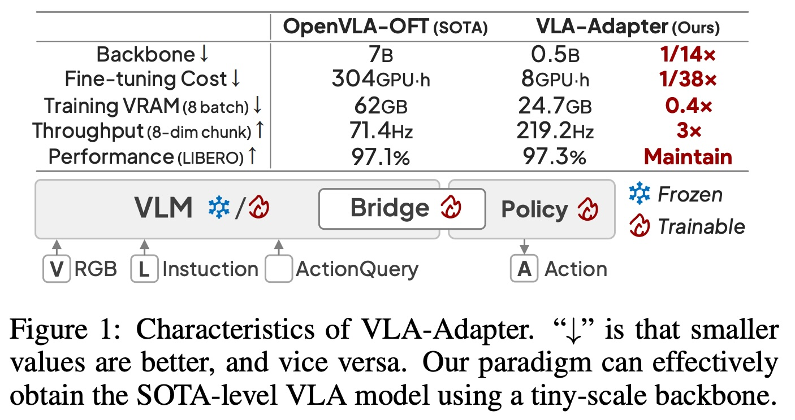
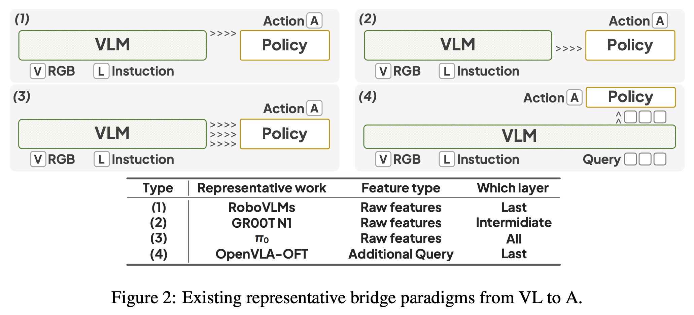
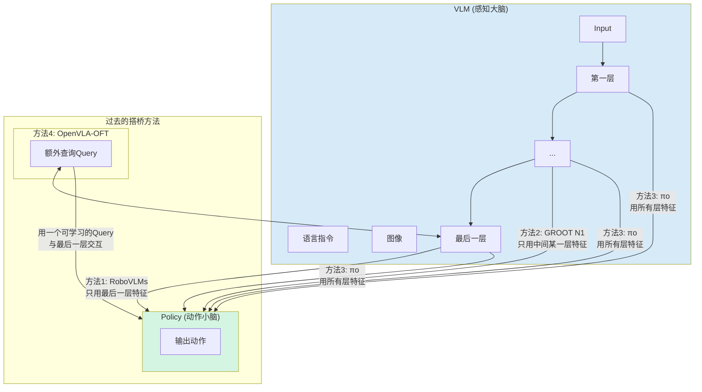
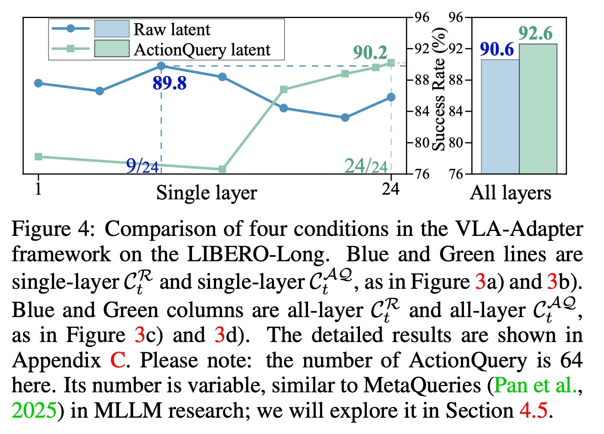
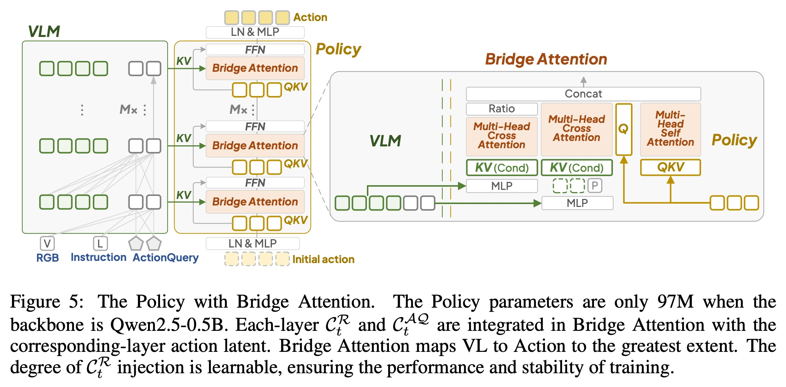

## AI论文解读 | VLA-ADAPTER: AN EFFECTIVE PARADIGM FOR TINY-SCALE VISION-LANGUAGE-ACTION MODEL
        
### 作者        
digoal        
        
### 日期        
2025-09-13        
        
### 标签        
PostgreSQL , PolarDB , DuckDB , AI , 论文解读        
        
----        
        
## 背景  
      
https://arxiv.org/pdf/2509.09372        
  
提示:          
```          
读懂《VLA-ADAPTER: AN EFFECTIVE PARADIGM FOR TINY-SCALE VISION-LANGUAGE-ACTION MODEL》这篇论文需要提前掌握哪些基础知识, 请使用中文通熟易懂的讲解这些基础知识, 可以引用论文中的图、表或使用Markdown支持的图形(text,mermaid等)增加解释性. 
  
使用中文通熟易懂的解读《VLA-ADAPTER: AN EFFECTIVE PARADIGM FOR TINY-SCALE VISION-LANGUAGE-ACTION MODEL》这篇论文, 其中的关键内容请着重讲解, 可以引用论文中的图、表或使用Markdown支持的图形(text,mermaid等)增加解释性. 
  
提取《VLA-ADAPTER: AN EFFECTIVE PARADIGM FOR TINY-SCALE VISION-LANGUAGE-ACTION MODEL》这篇论文中的重要术语, 使用中文对这些术语进行通熟易懂的讲解, 可以引用论文中的图、表或使用Markdown支持的图形(text,mermaid等)增加解释性. 
```     
  
## 1 前置知识 
  
您好，要读懂《VLA-ADAPTER: AN EFFECTIVE PARADIGM FOR TINY-SCALE VISION-LANGUAGE-ACTION MODEL》这篇论文，您需要掌握以下几个核心基础知识。这篇论文的核心在于如何以更高效、更轻量的方式，让机器人通过视觉和语言指令执行任务。

-----

### 1\. 什么是视觉-语言-动作（VLA）模型？

**VLA模型**是连接**感知**（视觉和语言）和**动作**（机器人操作）的桥梁 。它们通常依赖一个预训练好的**视觉-语言模型（VLM）**，来理解图像和人类指令，然后将这些理解转化为机器人可以执行的动作 。

想象一下，您给机器人一个指令：“把桌上的苹果放进篮子里”。

  * **视觉（V）**：机器人通过摄像头看到桌子、苹果和篮子。
  * **语言（L）**：机器人通过您的指令理解任务意图。
  * **动作（A）**：机器人伸出手，抓起苹果，然后将其放入篮子。

VLA模型就是将V和L的输入，有效地转化为A的输出。

-----

### 2\. VLM（视觉-语言模型）与Policy（策略网络）

这篇论文的VLA模型主要由两个部分构成：

  * **VLM（视觉-语言模型）**：这是一个预训练好的模型，负责处理图像和文本指令，从中提取出有用的“表示”或“特征” 。论文中使用的是**Prismatic VLM**，并分别用**Qwen2.5-0.5B**和**LLaMA2-7B**等不同规模的模型进行了实验 。
  * **Policy网络（策略网络）**：这个网络是论文的创新点之一 。它从VLM接收这些特征，并负责生成最终的机器人动作序列 。

论文的一个关键发现是，他们的方法即使使用**0.5B**这样的小规模VLM，并且**不进行机器人数据预训练**，也能达到领先的性能 。

-----

### 3\. 如何连接VL和A？——桥接范式

论文的核心问题是：“如何更有效地将 **视觉-语言（VL）表示桥接** 到 **动作（A）** 空间？”。这篇论文系统地分析了不同的桥接方法。

下图展示了四种现有的桥接范式：

  * **原始特征（Raw Features）**：直接从VLM中提取视觉和语言的原始表示 。根据提取的层级，可以分为：
      * **最后一层**：认为最后一层包含了最相关的语义信息 。
      * **中间层**：认为中间层保留了更丰富的多模态信息 。
      * **所有层**：将所有中间层的特征都用上 。
  * **附加查询（Additional Query）**：引入一个可学习的“查询”作为VLMs和Policy之间的接口，而不是直接传递原始特征 。这个查询可以捕获多模态信息，并被证明性能更优 。

论文发现：

  * **原始特征**：中间层的原始特征通常比深层的更好 。
  * **附加查询**：深层的附加查询特征效果更好 。
  * **多层特征**：使用所有层的特征作为条件通常优于只使用单层 。

-----

### 4\. VLA-Adapter 的核心——Bridge Attention

为了解决这些问题，论文提出了一个带有**Bridge Attention**的轻量级Policy网络 。

  * **它的作用**：Bridge Attention能够最大程度地将VL信息映射到动作空间 。它接收来自VLM的**原始特征（Raw Features）和附加查询特征（ActionQuery Features）**，并将它们与Policy网络的**动作潜变量**进行整合 。

  * **它的工作原理**：它由两个**交叉注意力**（Cross Attention）和一个**自注意力**（Self Attention）组成 。

    1.  **第一个交叉注意力**：处理原始特征（ $\\mathcal{C}\_{t}^{\\mathcal{R}}$ ）。
    2.  **第二个交叉注意力**：处理附加查询特征（ $\\mathcal{C}\_{t}^{\\mathcal{AQ}}$ ）和本体感知状态 。
    3.  **自注意力**：处理动作潜变量本身 。

通过这个机制，VLA-Adapter可以自主地将最优的条件注入到动作空间中 。此外，它还引入了一个可学习的参数**Ratio**来动态调整原始特征的注入程度，以确保训练的稳定性和性能 。

总的来说，要理解这篇论文，您需要先掌握**VLA模型**的基本概念，然后理解论文提出的**VLA-Adapter**模型如何通过创新的**Bridge Attention**机制，有效地**桥接**视觉-语言信息与机器人动作，从而在轻量级模型上实现高性能。
  
## 2 解读论文 
  
好的，我们来通俗易懂地解读一下这篇名为《VLA-ADAPTER: AN EFFECTIVE PARADIGM FOR TINY-SCALE VISION-LANGUAGE-ACTION MODEL》的论文。

可以把这篇论文的核心思想概括为：**通过一种创新的“智能搭桥”方法，让一个“小个子”机器人模型（Tiny-Scale Model）干出了“大个子”模型（Large-Scale Model）才能干的活，而且做得又快又省钱。**

-----

### 一、当前机器人模型的“痛点”是什么？

想象一下，要训练一个机器人，让它能听懂人话（比如“把桌子上的苹果放到篮子里”），看懂眼前的场景，并准确地执行动作，这需要一个强大的“大脑”，也就是**视觉-语言-动作（VLA）模型**。

目前主流的做法是：

1.  先用一个非常巨大的、在海量网络图文上预训练过的 **视觉语言模型（VLM）** 作为“眼睛和大脑的感知部分”。
2.  然后，用大量的机器人操作数据对这个大模型进行“微调”，教它如何将感知和语言理解转化为具体的机器人动作。

这种方法的**痛点**非常明显 ：

  * **成本高昂**：需要巨大的VLM模型（参数动辄几十亿），训练起来非常耗时耗电，需要很多高端GPU。
  * **效率低下**：模型太大，导致训练慢、推理（实际运行时）也慢。
  * **门槛太高**：普通研究者或小公司根本没有足够的资源去训练和部署这样的模型。

正如论文开头的图1所示，当前最先进的（SOTA）模型 `OpenVLA-OFT` 和 `VLA-Adapter` 相比，在各个方面都显得“笨重” 。    

| 特性 | OpenVLA-OFT (SOTA) | VLA-Adapter (本文方法) | 优势 |
| :--- | :--- | :--- | :--- |
| **模型大小 (Backbone)** | 7B (70亿参数) | **0.5B (5亿参数)** | **缩小为 1/14** |
| **微调成本 (Fine-tuning Cost)** | 304 GPU-h | **8 GPU-h** | **成本降为 1/38** |
| **训练显存 (Training VRAM)** | 62 GB | **24.7 GB** | **显存占用减少 60%** |
| **推理速度 (Throughput)** | 71.4 Hz | **219.2 Hz** | **速度提升 3倍** |
| **性能 (Performance)** | 97.1% | **97.3%** | **性能持平甚至略优** |

这个对比清晰地展示了 VLA-Adapter 的巨大优势：用极小的代价，实现了顶级的性能。

-----

### 二、核心问题：如何从“感知”到“动作”搭一座高效的桥？

论文作者把研究的核心聚焦在一个关键问题上：**如何更有效地将VLM的“视觉-语言（VL）感知”信息，传递给生成机器人动作的“策略（Policy）”网络？**  这个传递过程，就是一座连接“感知”和“动作”的桥梁。

过去的“搭桥”方法主要有以下几种，如下图2所示：   



这些方法各有千秋，但没人系统地研究过，到底哪种“桥梁”材料（特征）才是最好的。

-----

### 三、VLA-Adapter的探索与发现

作者为了找到最佳“建桥方案”，做了一系列实验。他们主要比较了两种信息（特征）作为“建桥材料”：

1.  **原始特征 (Raw latent)**：直接从VLM各层抽取的、包含了图像和文本信息的特征 。
2.  **动作查询特征 (ActionQuery latent)**：一种额外引入的、专门用来学习和浓缩动作相关信息的可学习“令牌”（Token）。

**实验结果（如图4所示）揭示了几个关键发现：**    

  * **发现1 (对于原始特征)**：VLM的**中间层**特征效果比深层（最后几层）好 。因为深层特征更偏向于“语义理解”，丢失了很多对动作至关重要的细节；而中间层则很好地融合了图像和文本信息 。
  * **发现2 (对于ActionQuery)**：VLM的**深层**特征效果最好 。因为ActionQuery是从零开始学习的，在VLM的深层能聚合到最丰富、最凝练的多模态信息 。
  * **发现3 (层数越多越好)**：无论是哪种特征，使用**所有层**的信息通常都比只用单层要好 。

**最重要的结论是：使用所有层的 `ActionQuery` 特征（上图右侧绿色柱子，成功率92.6%）是所有单一方案中效果最好的** 。

-----

### 四、核心创新：桥接注意力 (Bridge Attention)

虽然“所有层的ActionQuery”平均分最高，但作者发现，在某些特别困难的任务上，“中间层的原始特征”反而表现更佳 。

于是，他们想：**能不能把两者的优点结合起来，让模型自己学会怎么用这两种信息呢？**

这就是 VLA-Adapter 的核心创新 —— **桥接注意力（Bridge Attention）** ，其结构如下图5所示。    

你可以这样理解“桥接注意力”的工作机制：

1.  **双通道信息输入**：在策略网络（Policy）的每一层，它都同时接收两种信息作为“建桥材料”：
      * 来自VLM对应层的**原始特征 (`C_t^R`)**
      * 来自VLM对应层的**动作查询特征 (`C_t^AQ`)** 
2.  **智能融合**：它不是简单地把两种信息加起来，而是设计了一个 **可学习的“阀门”（`tanh(g)`）** 来控制 `C_t^R`（原始特征）的注入量 。
3.  **自主学习**：在训练过程中，模型会自己学习这个“阀门”的大小。如果当前任务更需要原始特征中的细节，它就会“开大阀门”，多用一些 `C_t^R`；如果ActionQuery的信息已经足够，它就会“关小阀门” 。

通过这种方式，`Bridge Attention` 机制**最大限度地、智能地将VLM中的多模态知识迁移到了动作生成中** ，实现了一种极其高效和灵活的“桥接”。

-----

### 五、惊艳的实验效果

VLA-Adapter 不仅理论上创新，实际效果也非常出色。

  * **对无机器人数据预训练的模型提升巨大**：在没有经过昂贵的机器人数据预训练的VLM上，VLA-Adapter 相比当前SOTA方法（OFT）能带来高达 **9.2%** 的性能提升 。这证明了其“搭桥”方法的普适性和高效性。
  * **冻结骨干网络依然强大**：即便将巨大的VLM骨干网络完全“冻结”（不参与训练，大大节省资源），VLA-Adapter 依然能取得非常好的性能，远超其他方法 。
  * **在各类任务上表现优异**：
      * 在复杂的 **LIBERO** 基准测试中，0.5B的 VLA-Adapter 全面超越了其他小型模型，并达到了与14倍大的7B模型相媲美的性能 。
      * 在考验泛化能力的 **CALVIN** 测试中，它在完成连续任务的平均长度上甚至超过了所有体量远大于它的对手，展现了极强的泛化能力 。
      * 在**真实世界的机器人**上，它的表现也显著优于基线方法，证明了其在实际应用中的潜力 。

### 总结

《VLA-Adapter》这篇论文的主要贡献可以总结为：

1.  **首次系统性地分析**了从“感知”到“动作”的不同“桥接”方式，并给出了宝贵的设计经验 。
2.  **提出了一种创新的 `Bridge Attention` 机制**，能够智能地融合不同类型的特征，高效地将知识从VLM传递给策略网络 。
3.  **实现了一个轻量、高效、高性能的VLA范式**，用一个0.5B的微型模型，达到了与7B甚至更大模型相媲美的SOTA级性能，同时训练成本、硬件要求和推理速度都有了数量级的优化 。

这项工作极大地降低了高性能机器人VLA模型的研发和部署门槛，为未来机器人领域的研究和应用提供了一个坚实且高效的基础 。
  
## 3 术语 
  
您好，根据您提供的《VLA-ADAPTER: AN EFFECTIVE PARADIGM FOR TINY-SCALE VISION-LANGUAGE-ACTION MODEL》这篇论文，我为您整理并解释了几个重要的核心术语，旨在用通俗易懂的方式帮助您理解。

-----

### 1\. 视觉-语言-动作模型 (VLA Model)

**VLA模型**可以理解为一种让机器人“能看、能听（理解指令）、能动”的AI系统。它的核心任务是接收来自**视觉**（比如摄像头拍摄的图像）和**语言**（比如人类的指令）的信息，然后将这些信息转换成机器人可以执行的**动作**。

论文中研究的就是如何用更高效、更轻量的方式来实现这个过程，让机器人无需庞大的模型也能完成复杂任务。

### 2\. 微型模型 (Tiny-Scale Model)

这篇论文的重点之一是证明，即使使用**微型模型**（Tiny-Scale Model），也能实现高性能。这里的“微型”是相对于那些拥有数千亿甚至万亿参数的巨型模型而言的。论文使用的是一个仅有**0.5B**（5亿）参数的VLM（视觉-语言模型），相比之下，许多大型模型参数量可达7B（70亿）或更高。

论文的贡献在于，它证明了通过巧妙的设计，即使是小模型也能有效完成复杂的机器人任务，这大大降低了训练和部署的成本。

-----

### 3\. 桥接范式 (Bridge Paradigm)

**桥接范式**是这篇论文最核心的理论部分，它指的是如何将 **视觉-语言（VL）** 的表示信息有效地传递给 **动作（A）** 网络。简单来说，就是如何搭建一个“桥梁”，让AI的“理解”能力能够指挥它的“行动”。

论文系统地研究了四种不同的桥接方式，如下图所示：

  * **原始特征 (Raw Features)**：直接从预训练的VLM中提取视觉和语言的特征向量，作为动作网络的输入。
  * **附加查询 (Action Query)**：这种方法更像是一个“可学习的令牌”。它不是直接使用原始特征，而是引入一个新的、可训练的查询，这个查询会与VLM的特征进行交互，从而提取出对动作任务最有用的信息。论文证明，这种方式通常效果更好。

### 4\. VLA-Adapter

**VLA-Adapter**是这篇论文提出的新范式，它是一个轻量级的、可训练的模块，专门用来解决上述“桥接”问题。它就像一个“适配器”，插在VLM和Policy网络之间，让两者能高效地协同工作。

它的关键在于引入了下面要讲的“桥接注意力”机制。

### 5\. 桥接注意力 (Bridge Attention)

**桥接注意力**是VLA-Adapter的核心技术，它是一种特殊的注意力机制，目的是将来自VLM的**原始特征**和**附加查询特征**智能地融合到**动作**网络中。

您可以想象它有三个核心部分：

  * **交叉注意力（Cross Attention）**：它有两个，一个负责从**原始特征**中提取信息，另一个负责从**附加查询特征**中提取信息。
  * **自注意力（Self Attention）**：它负责处理动作网络自身的潜在表示。

通过这三个部分协同工作，桥接注意力可以自主地判断哪种信息（原始特征还是附加查询特征）在当前情况下更重要，并将其有效地传递给动作网络，从而生成更准确的机器人动作。
  
## 参考        
         
https://arxiv.org/pdf/2509.09372    
        
<b> 以上内容基于DeepSeek、Qwen、Gemini及诸多AI生成, 轻微人工调整, 感谢杭州深度求索人工智能、阿里云、Google等公司. </b>        
        
<b> AI 生成的内容请自行辨别正确性, 当然也多了些许踩坑的乐趣, 毕竟冒险是每个男人的天性.  </b>        
  
    
#### [期望 PostgreSQL|开源PolarDB 增加什么功能?](https://github.com/digoal/blog/issues/76 "269ac3d1c492e938c0191101c7238216")
  
  
#### [PolarDB 开源数据库](https://openpolardb.com/home "57258f76c37864c6e6d23383d05714ea")
  
  
#### [PolarDB 学习图谱](https://www.aliyun.com/database/openpolardb/activity "8642f60e04ed0c814bf9cb9677976bd4")
  
  
#### [PostgreSQL 解决方案集合](../201706/20170601_02.md "40cff096e9ed7122c512b35d8561d9c8")
  
  
#### [德哥 / digoal's Github - 公益是一辈子的事.](https://github.com/digoal/blog/blob/master/README.md "22709685feb7cab07d30f30387f0a9ae")
  
  
#### [About 德哥](https://github.com/digoal/blog/blob/master/me/readme.md "a37735981e7704886ffd590565582dd0")
  
  

  
