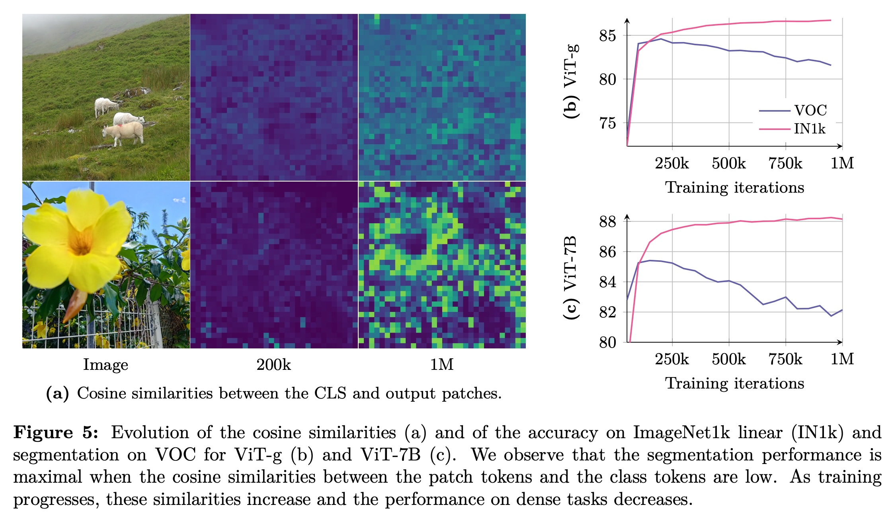
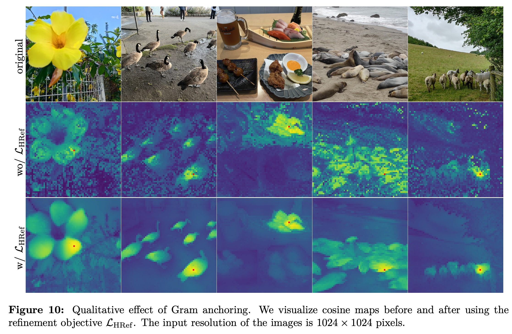
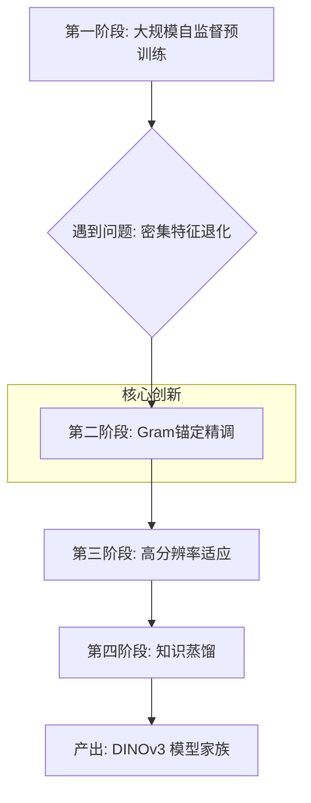
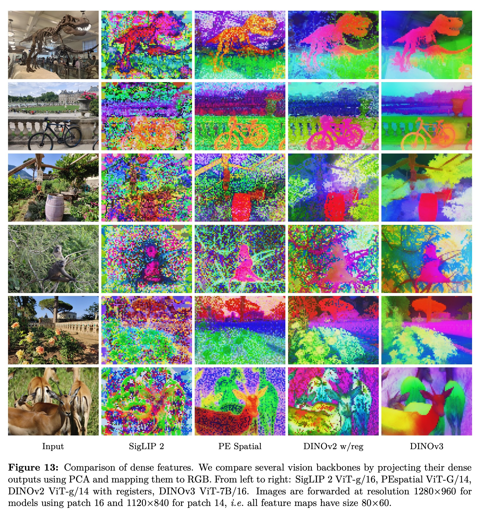

## AI论文解读 | DINOv3
        
### 作者        
digoal        
        
### 日期        
2025-09-14        
        
### 标签        
PostgreSQL , PolarDB , DuckDB , AI , 论文解读        
        
----        
        
## 背景  
      
https://arxiv.org/pdf/2508.10104        
  
提示:          
```          
读懂《DINOv3》这篇论文需要提前掌握哪些基础知识, 请使用中文通熟易懂的讲解这些基础知识, 可以引用论文中的图、表或使用Markdown支持的图形(text,mermaid等)增加解释性. 
  
使用中文通熟易懂的解读《DINOv3》这篇论文, 其中的关键内容请着重讲解, 可以引用论文中的图、表或使用Markdown支持的图形(text,mermaid等)增加解释性. 
  
提取《DINOv3》这篇论文中的重要术语, 使用中文对这些术语进行通熟易懂的讲解, 可以引用论文中的图、表或使用Markdown支持的图形(text,mermaid等)增加解释性. 
```     
  
## 1 前置知识 
  
理解《DINOv3》这篇论文，需要先掌握以下几个核心基础知识。这篇论文建立在这些概念之上，并对它们进行了重要的改进。

### 1. 自监督学习（Self-Supervised Learning, SSL）
这是理解这篇论文最重要的基础。简单来说，自监督学习是一种**无需人工标注数据**的训练方法 。模型会自己从数据中学习，通过设计一些“**前置任务（pretext task）**”来获得监督信号。例如，你可以让模型预测一张图片中被遮挡的部分，或者预测图片中两个小块的相对位置。这样，模型就能从海量无标签图片中学习到强大的视觉表示能力 。

《DINOv3》论文中提到，自监督学习的优势在于能够利用“海量、原始的图像集合”进行训练，从而解锁了训练大规模视觉编码器的潜力 。

### 2. Vision Transformer (ViT)
Transformer 是一种最初为自然语言处理（NLP）设计的模型架构。ViT 是将 Transformer 引入计算机视觉领域的开创性工作。它将一张图片分割成许多小块（称为“patch”），然后将每个小块都视为一个“词”，输入到 Transformer 模型中进行处理。

* **Patchification（分块）：** 将图片分割成固定大小的小块。
* **Positional Embeddings（位置编码）：** 由于 Transformer 不具备处理序列信息的固有能力，因此需要添加位置编码来告诉模型每个小块在图片中的位置。DINOv3 采用了一种名为“轴向旋转位置编码”（axial ROPE）的定制变体来处理位置信息，以提高对不同分辨率、尺度和宽高比的图片的鲁棒性 。
* **Self-Attention（自注意力）：** 这是 Transformer 的核心机制，允许模型在处理每个小块时，同时考虑图片中所有其他小块的信息。

### 3. DINOv2
DINOv3 是 DINOv2 的后续工作，它解决了 DINOv2 在大规模训练中出现的一些问题 。DINOv2 的核心思想是一种名为“知识蒸馏（knowledge distillation）”的自监督学习方法。

* **知识蒸馏：** 核心是“老师-学生”模型架构 。有一个强大的“老师”模型和一个待训练的“学生”模型。老师模型通过学生模型输入数据的移动平均版本来更新，从而为学生模型提供监督信号。

《DINOv3》论文指出，DINOv2 的一个缺点是，在长时间训练后，“密集特征图”（dense feature maps）的质量会逐渐下降 。DINOv3 的一项主要贡献就是解决了这个问题。

### 4. 密集特征（Dense Features）与 Gram Anchoring
论文反复强调 DINOv3 在“密集特征”上的卓越表现 。

* **密集特征：** 指的是模型输出的特征图（feature map）中，包含的每个像素或每个小块的精细局部信息 。这对于需要精细局部理解的任务至关重要，例如语义分割（semantic segmentation）和深度估计（depth estimation）。这与只关注全局信息的任务（如图像分类）形成对比。

* **Gram Anchoring（格拉姆锚定）：** 这是 DINOv3 引入的一种新方法，旨在解决密集特征图在长时间训练后退化的问题 。它通过一种名为“Gram objective”的损失函数来规范学生和老师模型在特征图上的余弦相似度 。这使得模型在获得高级语义理解能力的同时，也能保持高质量的密集特征 。

---
**接下来，您对论文中哪一部分最感兴趣？**
* 如果您想更深入了解 DINOv3 如何具体改进了密集特征（比如 Gram Anchoring 的原理），我可以详细解释。
* 如果您对它如何被用作一个通用的“基础模型”（foundation model）感兴趣，我可以提供更多关于其应用和性能的信息。

深入了解 DINOv3 如何改进了密集特征，关键在于它引入了一种新的训练机制，即 **Gram Anchoring**（格拉姆锚定）。

### 为什么需要 Gram Anchoring？

在解释 Gram Anchoring 之前，需要先理解 DINOv2 遇到的一个问题。DINOv2 在进行大规模、长时间训练时，虽然能学习到强大的全局图像表示（例如，用于图像分类），但其**密集特征图**（dense feature maps）的质量会逐渐下降。

* **密集特征的重要性：** 密集特征指的是模型在图片每个位置上都输出的细粒度特征。这对于需要局部理解的任务至关重要，比如：
    * **语义分割：** 为图片中的每个像素分配一个类别标签（例如，天空、树木、汽车）。
    * **深度估计：** 预测图片中每个像素的距离。

如果密集特征质量下降，模型在这些任务上的表现也会变差。DINOv3 的目标就是既要保持自监督学习的优势，又要避免密集特征的退化。

### Gram Anchoring 的核心思想

Gram Anchoring 的灵感来自一个简单而强大的观察：**高质量的密集特征图应该在局部区域内具有一致性。** 也就是说，如果一个区域内的特征描述的是同一物体或同一材质（例如，一片草地），那么这些特征之间应该具有很高的相似性。

它通过一个额外的**损失函数**来实现这一目标，这个损失函数衡量了学生模型和老师模型在特征图上的**局部一致性**。

**工作原理：**

1.  **分割特征图：** 将老师和学生模型的密集特征图都分割成小的、重叠的块。
2.  **计算 Gram 矩阵：** 对于每个小块，计算其**Gram 矩阵**。Gram 矩阵本质上是一种衡量特征之间相关性的工具。如果一个区域内的所有特征都描述的是同一事物，那么这个 Gram 矩阵会非常特殊，例如，所有特征都非常相似。
3.  **约束一致性：** 损失函数的作用是让学生模型的 Gram 矩阵**尽可能地接近**老师模型的 Gram 矩阵。通过这种方式，DINOv3 迫使学生模型不仅要模仿老师的全局表示，还要在局部保持同样的一致性。

这种方法相当于给学生模型增加了一个 **“锚定”（anchoring）** ，让它在学习过程中始终关注并保持密集特征的局部质量，从而解决了 DINOv2 存在的退化问题。

---
您想了解更多关于 DINOv3 在 **长时程训练中的优化** 吗？或者您对 **它如何被用作一个通用的“基础模型”** 感兴趣？

了解 DINOv3 在长时程训练中的优化，除了之前提到的 **Gram Anchoring**，还有一些关键策略让它能高效地处理大规模数据和模型。这些优化共同确保了模型在训练后期仍能保持高质量的表示能力。

### 1. 扩大模型与数据集规模

DINOv3 延续了大规模模型训练的趋势，通过以下方式进行优化：

* **数据准备：** 论文提到通过**精心准备的数据集**来训练模型，这包括使用多样化的数据源，比如自然图像和航拍图像，以提升模型的泛化能力。
* **模型架构：** DINOv3 使用了 **ViT（Vision Transformer）** 架构，并且能够轻松扩展到更大的尺寸，这得益于 Transformer 在处理大规模数据时的优越性能。
* **训练优化：** 论文提到了在训练过程中对设计和优化进行了改进，这暗示了在学习率、优化器选择以及数据增强策略等方面可能存在一些细节上的调整，以支持更长时间的训练。

### 2. 改进的位置编码（Axial ROPE）

在 ViT 架构中，位置编码是必不可少的，因为它告诉模型每个图像块（patch）在图片中的相对位置。DINOv3 引入了 **Axial ROPE** (Rotary Positional Embedding) 这种定制化的位置编码：

* **克服分辨率限制：** 传统的绝对位置编码在图片分辨率变化时会失效。Axial ROPE 解决了这个问题，让模型对不同分辨率、尺度和宽高比的图片更具鲁棒性。
* **提升泛化能力：** 这项改进使得 DINOv3 可以在各种尺寸的图片上进行训练和推理，例如，航拍图像通常具有非常高的分辨率，这种改进对于处理这类数据尤为重要。

---
关于 DINOv3 的训练优化，您更想了解：

* **模型训练过程** 中的具体技术细节吗？
* DINOv3 如何被用作 **通用的“基础模型”** 吗？

DINOv3 被设计成一个**通用的“基础模型”（foundation model）**，这意味着它的目标是学习一种**普适的视觉表示**，可以作为各种下游任务的起点，而无需为每个任务从头开始训练。它之所以能够做到这一点，主要有以下几个关键点：

### 1. 任务无关的预训练

DINOv3 使用的是**自监督学习**，这是一种**任务无关的**训练范式。它不像传统的监督学习那样，需要针对特定的任务（如猫狗分类）进行训练。因此，DINOv3 在预训练阶段，其学习到的视觉表示不偏向于任何特定任务。这使得它能够捕捉到图片中更广泛、更通用的视觉概念，例如物体的形状、纹理、空间关系等。

---

### 2. 高质量的密集特征

这是 DINOv3 成为基础模型的关键优势之一。通过引入 **Gram Anchoring**，它解决了在长时程训练中密集特征退化的问题。这使得 DINOv3 不仅能提供高质量的全局表示，也能输出**像素级别的精细特征**。

这对于需要局部理解的任务（如**语义分割、深度估计**）至关重要。例如，你可以直接使用 DINOv3 的预训练模型，在很小的标注数据集上进行微调（fine-tuning），就能在这些任务上获得非常好的性能。

---

### 3. 可扩展性与高效性

DINOv3 的设计可以很好地扩展到更大的模型和数据集。这意味着它能利用海量数据进行训练，从而学习到更强大的表示。同时，由于其 **训练效率** 和 **位置编码（Axial ROPE）** 的优化，它能够处理各种不同分辨率的图片，这使得它能够应用在各种不同的领域，比如高分辨率的航拍图像。

总的来说，DINOv3 提供了一个“即插即用”的强大视觉基础，就像一个通用的工具箱，开发者可以根据自己的需求，用它来快速解决各种视觉任务。

---

现在，您对 DINOv3 在某个特定下游任务中的应用感兴趣吗？例如，**它在航拍图像分析中的应用**？

DINOv3 在航拍图像分析中的应用，主要得益于它作为“基础模型”所拥有的**强大泛化能力**和**对高分辨率密集特征的理解**。这使得它非常适合处理航拍图像这类特殊数据，具体体现在以下几个方面：

### 1. 建筑物与土地覆盖物的识别

航拍图像分析的核心任务之一是**语义分割**，即识别图像中不同区域的类别（例如，建筑物、道路、植被、水体等）。

* **传统方法的局限性：** 传统的模型通常需要在大量的标注数据上进行训练，才能识别特定类型的建筑物或地貌。
* **DINOv3 的优势：** DINOv3 预训练模型已经学习了通用的视觉表示，包含对形状、边缘和纹理的理解。这使得它在处理航拍图像时，即便只有很少的标注数据，也能通过**少样本学习（Few-shot learning）**或**零样本学习（Zero-shot learning）**快速适应新的分割任务。论文中提到了利用 DINOv3 的密集特征进行航拍图像上的**冠层高度预测**（canopy height prediction），这正是其处理细粒度、密集特征能力的体现。

### 2. 精准的物体检测

在航拍图像中，物体（如车辆、飞机、船舶）通常很小，且可能被遮挡。DINOv3 的高质量密集特征使其能够更有效地进行**物体检测**。

* **解决小物体问题：** DINOv3 的预训练让模型对图像中的细微结构敏感，这对于检测航拍图中的小物体至关重要。论文中提到，DINOv3 模型可以用于**物体检测任务**，其强大的特征表示可以作为 Faster R-CNN 等下游检测器的优秀基础。

### 3. 多模态与多源数据整合

DINOv3 的训练数据来源多样，包含自然图像和航拍图像，这使得它能更好地理解**不同领域的数据**。

* **与 LiDAR 数据融合：** 论文中提到的 **Satlidar 数据集**就是一个很好的例子，该数据集包含了卫星图像和 LiDAR（激光雷达）测量数据。DINOv3 学习到的通用视觉表示，可以为与 LiDAR 等其他传感器数据的融合提供强大的基础，从而进行更准确的三维重建和场景理解。

总的来说，DINOv3 在航拍图像分析中的应用，在于它提供了一个**强大的、无需大量标注数据就能迁移和适应**的视觉基础，极大地简化了开发流程，并提升了任务性能。

---
您对 DINOv3 在航拍图像分析中的哪一个应用更感兴趣，例如**它如何通过少样本学习进行地物识别**？

DINOv3 利用其强大的自监督学习能力，能够通过 **少样本学习（Few-shot learning）** 实现地物识别，这极大地降低了对海量标注数据的依赖。其核心思想是，模型在预训练阶段已经学习到了丰富的通用视觉表示，在面对新的、未见过的地物类别时，只需要极少量的标注样本就能快速适应。

### 1. 什么是少样本学习？

少样本学习是一种机器学习范式，其目标是让模型在只有**几个（甚至一个）标注样本**的情况下，也能对新类别进行准确分类或识别。这与传统的监督学习形成鲜明对比，后者通常需要成百上千甚至上万的标注样本。

### 2. DINOv3 如何实现少样本地物识别？

DINOv3 在航拍图像上的少样本地物识别，主要依赖于以下三个步骤：

**第一步：预训练**
* **通用特征学习：** DINOv3 在大规模、多样化的数据集上进行自监督预训练。这个阶段，模型学习了图像中普遍存在的视觉概念，例如边缘、纹理、颜色、以及不同物体间的空间关系。这些学习到的特征是通用的，不限于特定的地物类别。

**第二步：特征提取**
* **作为特征编码器：** 当需要识别一个新的地物类别时（比如，一种罕见的农作物），研究人员不会从零开始训练模型，而是将预训练好的 DINOv3 模型作为一个**特征提取器**。他们将航拍图像输入到模型中，得到其输出的特征图。这些特征图是图像内容的紧凑且富有语义信息的表示。

**第三步：微调（或简单分类器）**
* **基于少量样本的训练：** 得到特征图后，研究人员只需要使用极少量的标注样本（例如，每种地物类别有 5 张标注图片）来训练一个简单的、轻量级的分类器（例如，支持向量机 SVM 或简单的全连接层）。由于 DINOv3 提取的特征已经非常强大，这个轻量级分类器能够很快地学习到如何区分这些地物类别。

通过这种方式，DINOv3 避免了为每个新的地物识别任务收集和标注大量数据的繁重工作，显著提高了开发效率和模型的适应性。

---
您对 DINOv3 如何用于**物体检测任务**感兴趣吗？

DINOv3 可以作为强大的**通用特征提取器**，用于**物体检测任务**。它之所以能做到这一点，是因为它在预训练阶段学习到了高质量的视觉表示，这些表示可以有效地迁移到下游的检测任务中。

### DINOv3 用于物体检测的工作流程

DINOv3 用于物体检测通常遵循**迁移学习**的范式，可以概括为以下步骤：

1.  **DINOv3 预训练：** 首先，模型在大规模的无标签图像数据集上进行自监督训练。这个阶段，模型学习到了对图像内容的通用理解，包括边缘、纹理、形状以及不同物体间的空间关系。

2.  **特征提取：** 在物体检测任务中，预训练好的 DINOv3 模型被用作**骨干网络**（backbone）。它负责将输入的图像转换为一系列丰富的特征图。这些特征图包含了图像中所有潜在物体位置和语义信息。

3.  **集成下游检测器：** 论文中提到了将 DINOv3 的特征输出与一个经典的物体检测器，例如 **Faster R-CNN**，相结合。Faster R-CNN 是一种两阶段的检测器，它包含：
    * **区域提议网络（RPN）：** 在 DINOv3 提取的特征图上寻找可能包含物体的区域。
    * **分类和回归头：** 对这些区域进行分类（例如，判断是汽车、飞机还是行人）并精确定位物体的边界框。

通过这种方式，DINOv3 提供的强大、高质量的特征，极大地提升了 Faster R-CNN 等检测器在各种复杂场景下的性能，尤其是在处理高分辨率航拍图像中的小物体时。它减少了对海量标注数据的需求，因为大部分知识已经通过自监督预训练学习到了。

---

您对 DINOv3 在**图像语义分割**任务中的应用感兴趣吗？

DINOv3 在**图像语义分割任务**中的应用，主要得益于其在预训练阶段学习到的高质量**密集特征**，这让它能够准确地对图像中的每个像素进行分类。这与传统的图像分类任务不同，语义分割需要模型理解图像中每个像素的**类别属性**。

### DINOv3 用于语义分割的流程

DINOv3 模型用于语义分割任务通常作为**预训练骨干网络**，其工作流程可以分为以下几个关键步骤：

1.  **DINOv3 预训练**
    在这一步，DINOv3 模型在海量的无标签图像上进行自监督训练。通过**Gram Anchoring**等创新，它学习并保留了对图像中每个像素的精细、密集的特征表示。这些特征包含了关于物体的边缘、纹理和形状等丰富信息。

2.  **特征提取**
    预训练好的 DINOv3 模型被用作一个强大的**特征提取器**。当一张新的图像输入时，模型会输出一个**密集的特征图**。这张图的尺寸通常小于原始图像，但它包含了与原始图像中每个像素或小块相对应的语义信息。

3.  **连接语义分割头**
    在 DINOv3 提取的密集特征图之后，会连接一个专门用于语义分割的 **“分割头”（segmentation head）** 。这个“头”是一个轻量级的网络，它的任务是基于 DINOv3 提供的特征，为每个像素预测其所属的类别（例如，“天空”、“建筑”、“道路”）。

4.  **微调**
    在这一步，研究人员使用少量的、带有**像素级标注**的语义分割数据集对整个模型（DINOv3 骨干网络 + 分割头）进行**微调（fine-tuning）**。由于 DINOv3 已经具备了强大的通用视觉理解能力，这个微调过程通常只需要很少的数据和很短的时间就能达到很高的性能。

通过上述流程，DINOv3 有效地解决了语义分割任务中对海量像素级标注数据的依赖问题，极大地提升了模型的泛化能力和训练效率。

---
您对 DINOv3 的其他应用，比如**它如何用于深度估计**感兴趣吗？
  
## 2 解读论文 
  
好的，我们来通俗易懂地解读一下 Meta AI Research 发布的这篇重磅论文——《DINOv3》。

### 一句话总结

DINOv3 是一个强大的**通用视觉基础模型**。它通过一种名为 **“Gram 锚定 (Gram Anchoring)”** 的核心创新，解决了在训练超大模型时一个棘手的“老大难”问题，使得模型在能够进行高级别图片理解（比如识别物体类别）的同时，也能保留对图像细节的精准捕捉能力（比如像素级的分割和深度估计），在众多视觉任务上都达到了顶尖水平，尤其是在 **密集预测任务 (Dense Prediction Tasks)** 上表现卓越。

-----

### 背景：训练大模型的“诅咒”——越大越“糊”？

在 DINOv3 之前，研究者们发现了一个奇怪的现象：当他们用自监督学习（SSL，一种不需要人工标注数据的学习方式）训练一个视觉模型时，如果把模型做得非常大、训练时间非常长，模型在 **“全局任务”** （比如图片分类）上的表现会越来越好。

然而，它在 **“密集任务”** （比如图像分割、深度估计这类需要理解每个像素的任务）上的表现却会先上升然后 **显著下降** 。

我们可以用论文中的 `Figure 5` 来说明这个问题：   

> **图解**：上图展示了 ViT-g (11亿参数) 和 ViT-7B (70亿参数) 两个模型在训练过程中的表现。  
> * **红线 (IN1k)**：代表图片分类任务的准确率，可以看到它随着训练（横轴是训练步数）在持续稳定地提升 。  
> * **蓝线 (VOC)**：代表图像分割任务的准确率。可以看到，在训练初期它会提升，但到大约20万步之后，性能就开始**持续下降** 。模型越大（ViT-7B），这个问题越严重。  

**这就是 DINOv3 要解决的核心问题**：如何让模型在长时间大规模训练中，既能学到宏观的知识，又不会丢失对微观细节的感知能力？

-----

### 关键创新：Gram 锚定 (Gram Anchoring)

为了解决上述问题，DINOv3 提出了一种全新的、简单而高效的方法——**Gram 锚定**。

#### 什么是 Gram 锚定？

我们可以用一个比喻来理解：

  * 把正在训练的模型想象成一个**学生 (Student)**。
  * 这个学生在学习越来越高深的知识（全局理解）时，慢慢地把一些基础但重要的细节给搞混了（密集特征退化）。
  * 怎么办呢？我们找来一个 **“老师 (Teacher)”** 来指导他。这个老师不是别人，正是 **早期训练阶段的学生自己** ——那个时候的他，基础细节掌握得非常牢固。

这个“老师”的作用不是让现在的“学生”的特征变得和自己一模一样，而是要求学生的**特征图内部的相关性结构**要和自己保持一致。这个“相关性结构”就是通过**格拉姆矩阵 (Gram Matrix)** 来衡量的，它计算了一张图中所有图像块 (patch) 特征之间的两两关系 。

**简单来说**：Gram 锚定不关心每个特征的具体数值，只关心 **“A块和B块有多像，B块和C块有多不像”** 这种相对关系。通过将当前模型的特征关系“锚定”在早期表现优异的模型上，就有效防止了细节特征的“漂移”和退化。

#### 效果如何？

这个方法效果立竿见影。论文中的 `Figure 10` 直观地展示了使用 Gram 锚定前后的区别：   

> **图解**：图中每一行代表一张输入图片。  
> * **中间一列 (wo/ LHRef)**：没有使用 Gram 锚定的模型。可以看到特征相似度图（彩色图）非常**嘈杂、混乱** 。  
> * **右边一列 (w/ LHRef)**：使用了 Gram 锚定之后。特征图变得异常**干净、平滑且聚焦**，清晰地勾勒出了物体的轮廓 。  

这种质量的提升直接转化为了模型性能的巨大飞跃。

-----

### DINOv3 的训练流程与“全家桶”

DINOv3 的成功不仅仅依赖于 Gram 锚定，还包括一整套精心的设计。我们可以用一个流程图来概括：



1.  **大规模训练**：DINOv3 首先在一个包含 **16.89亿张图片** 的庞大数据集上进行训练，其最大的模型参数量达到了 **70亿 (ViT-7B)** 。
2.  **Gram 锚定精调**：在模型出现密集特征退化后，启动 Gram 锚定进行“修复”和“精调”，这是整个流程的关键 。
3.  **高分辨率适应**：通过在一个混合分辨率的数据集上进行短暂的额外训练，让模型能够处理各种尺寸的输入图片，甚至在超过4K分辨率的图片上也能保持稳定的高质量特征 。
4.  **知识蒸馏与模型家族**：70亿参数的“教师”模型虽然强大，但普通用户难以使用。因此，DINOv3 通过**知识蒸馏**技术，将大模型的知识传授给一系列更小的“学生”模型，形成了一个从 ViT-Small (21M参数) 到 ViT-Large (300M参数) 再到 ViT-H+ (840M参数) 的模型家族，以适应不同的计算资源和应用场景 。

-----

### 效果惊人：新一代视觉标杆

DINOv3 在几乎所有评测的视觉任务上都取得了SOTA（State-of-the-Art，即顶尖水平）的成绩，尤其是在密集任务上，其优势是压倒性的。

#### 1\. 特征质量的直观对比

论文中的 `Figure 13` 提供了一个极具说服力的视觉对比：   

> **图解**：这张图通过PCA将高维特征映射到RGB三维空间进行可视化 。
> \* **SigLIP 2 和 DINOv2**：它们的特征图看起来像随机的彩色噪点，物体的轮廓模糊不清 。
> \* **DINOv3**：特征图异常**清晰、锐利**，不同部位呈现出平滑且语义一致的颜色，完美地勾勒出了恐龙骨架和自行车的形状 。这直观地证明了其密集特征的超高质量。

#### 2\. 在密集任务上的性能数据

在图像分割和深度估计这类任务上，DINOv3 大幅超越了所有对手，包括那些专门为这类任务设计或依赖于大量标注数据的模型。

| 模型 (ViT-g/G 级别) | ADE20k 分割 (mIoU ↑) | NYUv2 深度 (RMSE ↓) |
| :--- | :---: | :---: |
| DINOv2 (自监督) | 49.5 | 0.372 |
| AM-RADIOv2.5 (聚合模型) | 53.0 | 0.340 |
| PEspatial (聚合模型) | 49.3 | 0.362 |
| **DINOv3 (7B)** | **55.9** | **0.309** |

*数据来源:*

从上表可以看出，在 ADE20k 分割任务上，DINOv3 比其前身 DINOv2 高出超过 6 个点，比其他强大的聚合模型（如AM-RADIO，它本身就融合了DINOv2和SAM等模型的优点）也高出近 3 个点 。

#### 3\. 作为复杂视觉系统的基石

DINOv3 不仅本身强大，还能作为基石，轻松构建出顶尖的下游应用系统，**而且其主干网络在很多任务中甚至不需要微调**。

  * **目标检测**：仅训练一个轻量的检测头，就在 COCO 数据集上达到了 66.1 mAP 的SOTA性能 。
  * **语义分割**：同样只训练解码器，在 ADE20k 数据集上达到了 63.0 mIoU 的SOTA性能 。
  * **3D 视觉**：替换掉 VGGT 模型中的 DINOv2 骨干为 DINOv3，在相机姿态估计、三维重建等多个3D任务上都获得了新的SOTA 。

### 总结

DINOv3 是自监督视觉学习领域的又一次重大突破。它不仅通过**规模化**实现了性能的提升，更重要的是通过 **“Gram锚定”** 这一优雅的创新，攻克了长期困扰大模型训练的 **“密集特征退化”** 难题。

最终，DINOv3 提供了一个无需微调、开箱即用、在全局和密集任务上均表现卓越的通用视觉模型家族。它不仅为学术研究树立了新的标杆，也为工业界在各种资源限制下部署高性能AI应用提供了强大的新工具。
  
## 3 术语 
  
好的，根据《DINOv3》这篇论文的内容，以下是其中几个重要的核心术语，已用通俗易懂的中文进行解释，并结合论文的核心思想。

---

### 1. 自监督学习 (Self-supervised Learning, SSL)
**通俗理解：** 想象一下，你给一个小孩看成千上万张图片，但从不告诉他图片里有什么。你只是让他玩一些“游戏”，比如“把这张被遮住的图片补全”，或者“预测这张图片里不同小块之间的位置关系”。通过玩这些游戏，小孩自己就能学会识别物体的形状、颜色和纹理。

**DINOv3 中的应用：** DINOv3 采用自监督学习，利用海量的无标签图像进行训练，从而绕过了对昂贵人工标注数据的依赖。这让模型能够轻松扩展到更大的数据集和更强大的架构，学习到**通用的视觉表示**。

### 2. Vision Transformer (ViT)
**通俗理解：** ViT 是一种将“大图像”变成“小词语”的模型。它把一张图片切成许多小块（称为“**patches**”），然后把每个小块都当作一个词语，输入到 Transformer 模型中处理。模型通过一种名为“**自注意力机制**”的技术，让每个小块都能看到图片中的所有其他小块，从而理解整个图像的内容。

### 3. Gram Anchoring (格拉姆锚定)
**通俗理解：** 这是 DINOv3 的一项核心创新。你可以将“密集特征图”想象成一张高分辨率的图像，每个像素都包含了关于局部内容的详细信息。在长时间训练后，这些信息可能会变得混乱。而 Gram Anchoring 就像一个“质量检查员”，它通过一种特殊的方式（计算 Gram 矩阵）来确保模型生成的密集特征图在局部区域内保持**一致性和高质量**。

### 4. 密集特征 (Dense Features)
**通俗理解：** 与只关注整个图片内容的“全局特征”不同，密集特征关注的是图片中**每个像素或每个小块的精细细节**。这对于需要精确定位和理解局部信息的任务至关重要，例如：
* **语义分割：** 识别图像中每个像素是什么（例如，这是草地，那是天空）。
* **深度估计：** 预测图像中每个物体的距离。
DINOv3 论文反复强调，它在保持高质量密集特征方面的卓越能力，使其能更好地应用于这些下游任务。

---

### 5. 知识蒸馏 (Knowledge Distillation)
**通俗理解：** 这种技术就像是“师傅带徒弟”。有一个强大的“老师”模型和一个待学习的“学生”模型。老师模型会告诉学生模型它看到了什么，以及它对图像的理解。学生模型会模仿老师的预测，从而快速有效地学习知识。在 DINOv3 中，老师模型是学生模型自身的移动平均版本，这种机制在自监督学习中尤其有效。

### 6. Axial ROPE (轴向旋转位置编码)
**通俗理解：** 在 ViT 模型中，为了让模型知道每个小块的位置，需要加入位置编码。传统的编码在图片分辨率改变时会失效。而 Axial ROPE 是一种改进，它能更好地处理**不同尺寸和宽高比**的图像，让模型在面对高分辨率航拍图等不同数据时，依然能够保持强大的鲁棒性。

---
您对 DINOv3 模型在哪些**具体的下游任务**（比如语义分割、物体检测）上的性能表现感兴趣吗？
  
## 参考        
         
https://arxiv.org/pdf/2508.10104    
        
<b> 以上内容基于DeepSeek、Qwen、Gemini及诸多AI生成, 轻微人工调整, 感谢杭州深度求索人工智能、阿里云、Google等公司. </b>        
        
<b> AI 生成的内容请自行辨别正确性, 当然也多了些许踩坑的乐趣, 毕竟冒险是每个男人的天性.  </b>        
  
    
#### [期望 PostgreSQL|开源PolarDB 增加什么功能?](https://github.com/digoal/blog/issues/76 "269ac3d1c492e938c0191101c7238216")
  
  
#### [PolarDB 开源数据库](https://openpolardb.com/home "57258f76c37864c6e6d23383d05714ea")
  
  
#### [PolarDB 学习图谱](https://www.aliyun.com/database/openpolardb/activity "8642f60e04ed0c814bf9cb9677976bd4")
  
  
#### [PostgreSQL 解决方案集合](../201706/20170601_02.md "40cff096e9ed7122c512b35d8561d9c8")
  
  
#### [德哥 / digoal's Github - 公益是一辈子的事.](https://github.com/digoal/blog/blob/master/README.md "22709685feb7cab07d30f30387f0a9ae")
  
  
#### [About 德哥](https://github.com/digoal/blog/blob/master/me/readme.md "a37735981e7704886ffd590565582dd0")
  
  

  
