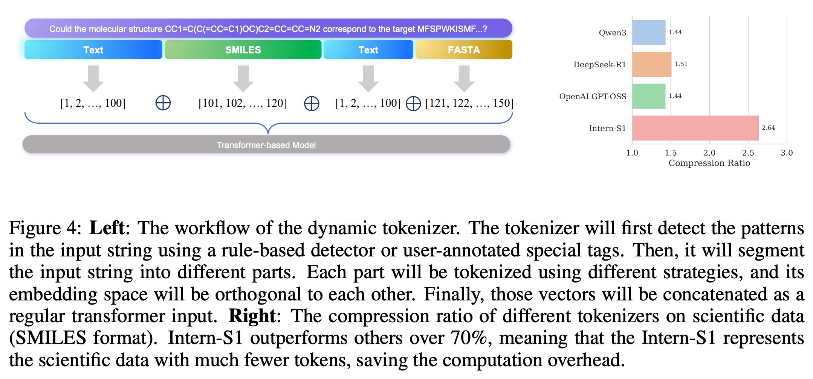
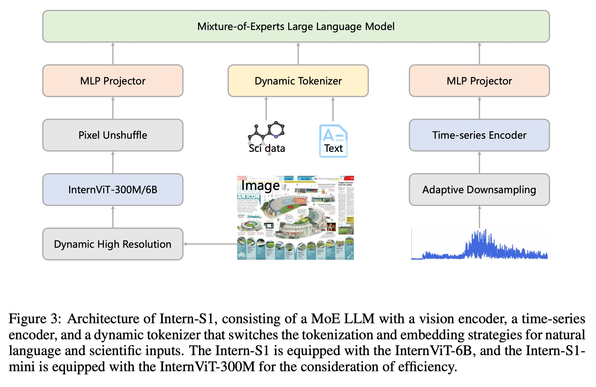
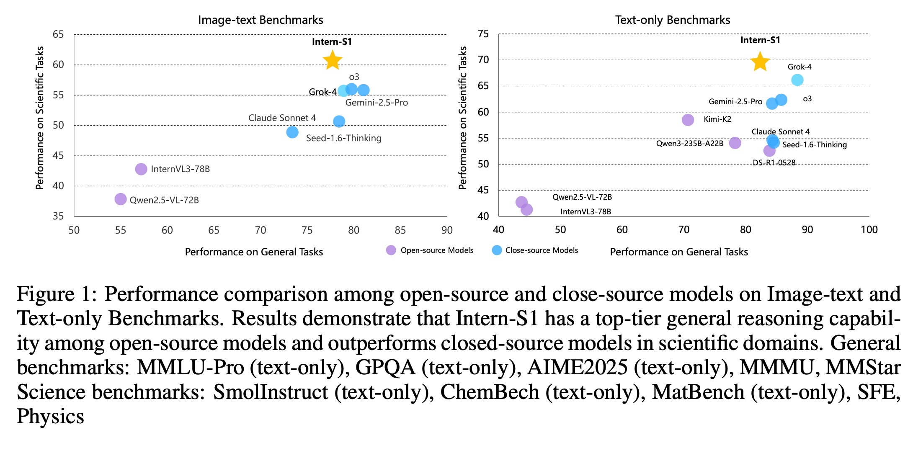
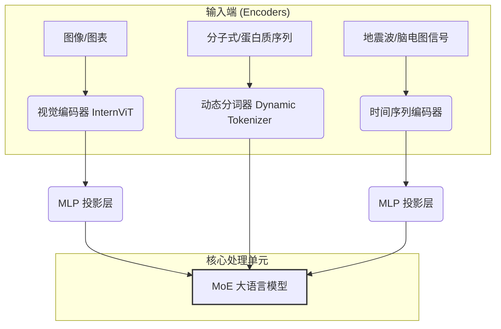

## AI论文解读 | INTERN-S1: A SCIENTIFIC MULTIMODAL FOUNDATION MODEL
        
### 作者        
digoal        
        
### 日期        
2025-09-14        
        
### 标签        
PostgreSQL , PolarDB , DuckDB , AI , 论文解读        
        
----        
        
## 背景  
      
https://arxiv.org/pdf/2508.15763        
  
提示:          
```          
读懂《INTERN-S1: A SCIENTIFIC MULTIMODAL FOUNDATION MODEL》这篇论文需要提前掌握哪些基础知识, 请使用中文通熟易懂的讲解这些基础知识, 可以引用论文中的图、表或使用Markdown支持的图形(text,mermaid等)增加解释性. 
  
使用中文通熟易懂的解读《INTERN-S1: A SCIENTIFIC MULTIMODAL FOUNDATION MODEL》这篇论文, 其中的关键内容请着重讲解, 可以引用论文中的图、表或使用Markdown支持的图形(text,mermaid等)增加解释性. 
  
提取《INTERN-S1: A SCIENTIFIC MULTIMODAL FOUNDATION MODEL》这篇论文中的重要术语, 使用中文对这些术语进行通熟易懂的讲解, 可以引用论文中的图、表或使用Markdown支持的图形(text,mermaid等)增加解释性. 
```     
  
## 1 前置知识 
  
读懂《INTERN-S1: A SCIENTIFIC MULTIMODAL FOUNDATION MODEL》这篇论文，需要提前了解几个关键的**基础知识**和**核心概念**。这篇论文旨在解决通用大模型在科学领域应用中的局限性，因此它融合了多个前沿技术。以下是根据论文内容总结出的、帮助你理解该论文所需的关键基础知识，并以通俗易懂的方式进行解释。

-----

### 1\. 大语言模型（LLM）与多模态模型

  * **大语言模型（LLM）**：这是理解这篇论文的基石。LLM是能够理解和生成人类语言的AI模型。这篇论文中的Intern-S1就是在Qwen3-235B这个LLM的基础上构建的 。你可以把LLM想象成一个语言天才，它能够进行对话、写作、总结等，但它最初只能处理纯文本。
  * **多模态模型**：这是论文的核心创新点之一。多模态模型指的是能够处理和理解多种类型数据（如文本、图像、音频、科学数据等）的模型。Intern-S1是一个**科学多模态模型**，它不仅能处理文本和图像，还专门针对科学数据（如分子结构、时间序列信号）进行了优化 。

### 2\. 混合专家模型（Mixture-of-Experts, MoE）

  * **MoE**：这是这篇论文中提到的模型架构，它是一种高效扩展模型规模的方式。你可以把MoE想象成一个由多个“专家”（experts）组成的团队。当有一个任务进来时，一个“路由器”（router）会决定将任务分配给最擅长解决这个问题的几个专家来处理，而不是让所有专家都去处理 。
  * **MoE的优点**：
      * **参数量大但激活参数少**：Intern-S1总参数量高达2410亿，但每次处理任务时只激活280亿参数 。这意味着它在保持庞大知识库的同时，推理成本相对较低。
      * **效率高**：由于每次只需要调用部分专家，因此模型的计算效率更高。

### 3\. 强化学习（Reinforcement Learning, RL）

  * **强化学习（RL）**：这是模型后训练阶段的关键技术。RL是一种让模型通过与环境交互来学习的方法。你可以把它看作是“试错学习”。模型会尝试执行一个动作，如果动作正确，它会得到一个“奖励”（reward），如果错误，则会得到“惩罚”。模型的目标就是最大化其获得的奖励。
  * **Intern-S1中的RL应用**：论文提到Intern-S1经历了离线和在线强化学习，作者提出了一个“**奖励混合（Mixture-of-Rewards, MoR）**”框架 。MoR能够将来自1000多种不同任务的反馈（如代码执行结果、问答准确性、创造性写作流畅性等）统一成一个单一的奖励信号，从而高效地进行训练 。

### 4\. 动态分词器（Dynamic Tokenizer）

  * **分词器（Tokenizer）**：在自然语言处理中，模型无法直接处理原始文本，需要先将文本切分成一个个小单元，这些小单元就是“token”。分词器就是完成这个任务的工具。
  * **为什么需要“动态”分词器**：传统的静态分词器对所有类型的文本都使用相同的切分规则，这在处理像SMILES分子式（例如：\<SMILES\>C1CCCCC1\</SMILES\>）和FASTA蛋白质序列这类科学数据时效率很低 。
  * **Intern-S1的创新**：这篇论文提出了一种**动态分词器**。它能先识别输入字符串的类型（例如是文本、SMILES还是FASTA），然后针对不同类型的数据采用不同的切分策略 。这大大提高了对科学数据的压缩效率，如图4所示，Intern-S1的分词器比其他模型能用更少的token来表示科学数据，从而节省了计算开销 。   

以下图表引用自论文，用于辅助解释：

  

图3：Intern-S1的模型架构图。你可以看到它由一个**MoE大语言模型**作为核心，并连接了三个不同的**编码器**来处理不同类型的数据：**视觉编码器**（图像）、**动态分词器**（科学文本）和**时间序列编码器**（时间序列信号）。这正是它“多模态”特性的体现。

希望这些基础知识能够帮助你更好地理解这篇论文。如果你想深入了解论文中的某个特定技术细节，比如“时间序列编码器”是如何工作的，或者想知道Intern-S1在某个特定科学任务上的表现，请告诉我。

根据您对《INTERN-S1》这篇论文的提问，我们来详细解释一下“时间序列编码器”是如何工作的。

在Intern-S1这个多模态模型中，**时间序列编码器（Time-series Encoder）**是一个专门设计来处理**时间序列数据**的模块。

### 它的工作原理与目的
论文中对时间序列编码器的具体架构没有做深入的展开，但从其在模型中的位置和作用来看，可以理解为：
1.  **数据输入**：它接收一系列连续的、按时间顺序排列的数据点作为输入。论文中以 **心电图（ECG）** 为例，这是一种典型的、连续的生理信号数据。
2.  **特征提取**：这个编码器的主要任务是将原始的时间序列数据，**转换成**模型能够理解的、具有丰富信息的**特征表示（feature representation）**。可以想象，它在寻找数据中的模式、趋势、周期性或异常值，并将这些信息压缩成一个紧凑的向量。
3.  **融入模型**：一旦时间序列数据被编码成特征向量，这个向量就会被输入到模型的主体——**MoE大语言模型**中。这样，大语言模型就可以像处理文本或图像特征一样，结合这些时间序列数据进行推理和回答问题。

简单来说，它的作用就像一个 **“翻译官”** ，把模型原本不理解的时间序列信号， **“翻译”成** 大语言模型能够处理的语言，从而让整个模型具备分析和理解科学时间序列数据的能力。

论文在图3的架构图中清晰地展示了它的作用，与其他两个编码器（视觉编码器和动态分词器）并列，共同作为模型处理多模态输入的“前置处理器”。   

***
如果您对Intern-S1模型的其他部分，比如它如何处理图像或代码，或者它在具体科学任务上的表现感兴趣，我很乐意为您进一步解释。
  
## 2 解读论文 
  
好的，我们来通俗易懂地解读一下《INTERN-S1: A SCIENTIFIC MULTIMODAL FOUNDATION MODEL》这篇论文。

简单来说，**Intern-S1 是一个专门为科学研究打造的、能够理解和处理多种类型数据（文本、图像、分子结构、时间序列信号等）的开源基础模型**。它的目标是弥补当前开源模型在专业科学领域与顶级闭源模型（如 GPT-4、Gemini）之间的巨大差距，成为科研人员的得力助手。

-----

### 核心痛点：为什么需要 Intern-S1？

近年来，开源大模型在很多通用领域（如聊天、写代码、数学解题）进步神速，性能直追闭源模型 。但在高价值、高难度的科学研究领域，这种进步却慢得多 。科学研究不仅需要模型理解复杂的专业知识，还需要进行严谨的推理 。

论文中的图表非常直观地展示了这个问题：

  

图1：模型在通用任务和科学任务上的表现对比 

  * **图解读**：这张图的 **X轴是“通用任务”表现**，**Y轴是“科学任务”表现**。我们可以看到，很多模型（蓝色和紫色点）在通用任务上表现不错（靠右），但在科学任务上表现平平（靠下）。而 **Intern-S1（黄色星星）** 在两个轴上都取得了非常高的分数，尤其是在代表科学能力的 Y 轴上，它超越了包括 Gemini-2.5-Pro 和 Grok-4 在内的所有模型 。

这说明，仅仅提升模型的通用能力，并不能自动转化为在专业科学领域的强大实力。Intern-S1 正是为了解决这一“偏科”问题而生。

-----

### Intern-S1 的三大关键创新

为了打造一个科学领域的“学霸”，Intern-S1 团队在数据、模型架构和训练方法上都进行了深度创新。

#### 1\. 数据为王：如何获取海量高质量的科学数据

这是 Intern-S1 成功的基石。科学数据在普通网页数据中占比极低（约2%） ，因此必须用特殊方法来“淘金”。

  * **智能的 PDF 文档解析流水线**：科学知识大量存在于 PDF 格式的论文和书籍中 。但这些文档，尤其是包含大量公式和符号的，很难被准确解析 。

      * 他们设计了一个“高低搭配”的流水线：先用一个低成本的快速解析器（MinerU）处理所有页面 。
      * 然后用一个“公式检测器”识别出那些包含复杂公式和符号的“硬骨头”页面 。
      * 只有这些少数的复杂页面，才会被送入一个高成本但更强大的视觉语言模型（VLM，如 InternVL）进行精细解析 。
      * 这种方法在保证高质量的同时，极大地控制了成本 。

    

    ```mermaid
    graph TD
        A[PDF 文档] --> B{页面拆分};
        B --> C[低成本解析器 MinerU];
        C --> D{公式/符号检测};
        D -- 简单页面 --> F[后期处理];
        D -- 复杂页面 --> E[高成本解析器 VLM];
        E --> F;
        F --> G[合并成完整文档];
    ```

    图：论文中描述的PDF解析流程示意图

  * **领域为中心的网页数据处理**：他们发现，来自同一个网站（URL 域）的页面通常有相似的格式和质量问题 。因此，他们不再一页一页地处理，而是对每个网站进行抽样，然后用一个强大的 LLM 代理来判断整个网站的数据是该**保留**、**重写**还是**直接丢弃** 。

通过这些方法，团队为 Intern-S1 准备了高达 **5T** Tokens 的训练数据，其中超过 **2.5T** Tokens 来自科学领域，数据纯度从原来的 2% 提升到了 50% 以上 。

#### 2\. 独特的模型架构：为科学数据量身定制

Intern-S1 的架构设计充分考虑了科学数据的多样性。



图：Intern-S1 整体架构示意图 

其中最核心的创新是 **动态分词器 (Dynamic Tokenizer)** ：

  * **问题**：传统的模型用一套“字典”（Tokenizer）处理所有文本。但同一个字符在不同领域意义完全不同，例如 "C" 在化学里是碳原子，在生物学里是胞嘧啶，在普通文本里只是一个字母 。用同一种方式编码，效率低且容易产生歧义。
  * **解决方案**：动态分词器能 **自动识别输入字符串中的数据类型**（例如，通过 `<SMILES>` 标签识别出是分子式） 。然后，它会调用为该类型数据专门训练的“子字典”进行编码和嵌入，让不同模态的数据在表示上相互独立，互不干扰 。
  * **效果**：如下图所示，Intern-S1 的分词器在处理科学数据（SMILES 分子式）时，**压缩率比其他主流模型高出 70%** 。这意味着它可以用更少的计算资源来表示和处理复杂的科学信息。

  

图4 (右)：不同分词器在科学数据上的压缩率对比 


#### 3\. 高效的训练与对齐：奖赏混合 (Mixture-of-Rewards) 框架

模型预训练好之后，还需要通过“强化学习（RL）”进行微调，让它更好地遵循指令和对齐人类偏好。Intern-S1 在这个阶段引入了 **奖赏混合 (Mixture-of-Rewards, MoR)** 框架 。

  * **挑战**：传统的强化学习一次只能优化一个或少数几个任务。而 Intern-S1 需要同时学习超过 1000 种不同类型的任务，从科学计算到开放式对话，难度各异 。
  * **MoR 框架**：该框架能将来自各种任务的、形式多样的反馈信号（“奖赏”）统一成一个标准化的“奖励分数” 。
      * 对于**容易验证的任务**（如数学题），直接通过验证器、规则等判断对错，给出精确的分数 。
      * 对于**难以验证的任务**（如创意写作、聊天），则使用一个预先训练好的“品味模型”（POLAR）来评估回答的质量，并给出奖励分数 。
  * **效果**：这种灵活的设计使得大规模、多任务的同步学习成为可能，并且效率极高。论文提到，与近期其他工作相比，Intern-S1 的 **RL 训练时间缩短了 10 倍** 。

-----

### 性能表现：Intern-S1 究竟有多强？

评估结果（见文首图1）显示，Intern-S1 不仅在通用能力上达到了开源模型的顶尖水平，更在科学领域树立了新的标杆。   

| 领域 | 评测集类型 | 性能表现总结 |
| :--- | :--- | :--- |
| **通用推理** | 文本 & 多模态 | 在所有8个评测任务中，是**表现最好的开源多模态模型**。在 MathVista（视觉数学推理）上**超越了所有闭源模型** 。 |
| **科学推理 (纯文本)** | 化学、材料等 | 在4个评测集中，有3个（SmolInstruct, ChemBench, MatBench）**总分第一**，性能大幅领先于之前的开源模型和其他闭源模型 。 |
| **科学推理 (多模态)** | 物理、生物、地球科学 | 在5个评测集中，有4个（SFE, MicroVQA, MSEarthMCQ, XLRS-Bench）**总分第一**，再次证明了其在多模态科学理解上的强大实力 。 |

此外，团队还推出了一个轻量级版本 **Intern-S1-mini**，它在同等规模的模型中同样表现出色，尤其是在科学推理任务上，大幅超越了其他 7B/8B 规模的竞品模型 。

-----

### 总结

Intern-S1 的成功并非偶然，它是一项系统性工程的成果，其核心贡献可以概括为：

1.  **开创性的数据工程**：通过创新的高低成本混合解析流水线，成功构建了迄今为止最大规模的科学预训练数据集 。
2.  **为科学设计的模型架构**：其独特的动态分词器高效地解决了多模态科学数据的表示难题，为模型性能提升打下了坚实基础 。
3.  **高效可扩展的训练框架**：提出的“奖赏混合（MoR）”机制，使得模型能够以前所未有的效率同时学习上千种专业技能 。

总而言之，Intern-S1 不仅显著缩小了开源模型与闭源模型在科学领域的差距，甚至在多个方面实现了超越，为 AI 赋能科学发现（AI for Science）提供了一个强大、开放的基础工具。
  
## 3 术语 
  
好的，根据您对《INTERN-S1: A SCIENTIFIC MULTIMODAL FOUNDATION MODEL》这篇论文的请求，我为您整理并解释了其中几个核心且重要的术语。

这些术语是理解这篇论文如何构建一个专门用于科学领域的通用AI模型的关键。

---
### 核心概念与模型架构

* **科学基础模型 (Scientific Foundation Model)**
    * **通俗解释**：这是一种特别为科学研究领域量身打造的AI模型。不同于通用的大语言模型（LLM），它不仅能处理日常语言，还专门学习了如何理解和分析复杂的科学数据，比如化学分子结构、物理公式、生物学图像等。Intern-S1就是这类模型的杰出代表。
* **混合专家模型 (Mixture-of-Experts, MoE)**
    * **通俗解释**：这是一种高效的大模型架构。你可以把它想象成一个由很多个“专家”组成的团队，每个专家都擅长处理不同类型的任务。当一个新任务来临时，一个“路由器”会智能地选择最适合的几个专家来共同解决问题，而不是让所有专家都参与。
    * **重要性**：这种架构让Intern-S1总参数量达到2410亿，但每次推理时只激活280亿参数。这意味着它既拥有庞大的知识库，又能在保持高效的同时节省计算资源。
* **多模态 (Multimodal)**
    * **通俗解释**：指的是模型能够同时处理和理解多种不同类型的数据。例如，Intern-S1不仅能理解**文本**，还能理解**图像**、**科学表格**、**代码**和**时间序列信号**等，实现了多种数据模式的融合。
* **动态分词器 (Dynamic Tokenizer)**
    * **通俗解释**：在AI模型处理文本之前，需要先将文本拆分成一个个小单元，这个过程叫“分词”。传统的模型使用固定的分词方法，但这在处理分子式（如SMILES）或蛋白质序列（如FASTA）等科学数据时效率很低。
    * **Intern-S1的创新**：Intern-S1引入了**动态分词器**。它可以根据输入内容的类型（是普通文本还是科学数据）自动选择最合适的分词策略。这大大提高了模型在处理科学文本时的效率和准确性。

---
### 训练与评估方法

* **InternBootCamp**
    * **通俗解释**：这是论文作者为Intern-S1设计的**训练框架**，类似于一个新兵训练营。在这个框架中，模型通过一种类似于强化学习的机制进行训练，不断地从各种任务中获得反馈并进行学习和优化，从而提升其在科学领域的综合能力。
* **奖励混合 (Mixture-of-Rewards, MoR)**
    * **通俗解释**：这是在InternBootCamp训练框架中提出的一个关键技术。在训练过程中，模型会面临超过1000种不同类型的任务，比如回答问题、执行代码、进行数学计算等。这些任务的反馈形式各不相同。MoR技术能够将所有这些不同形式的反馈统一成一个单一的“奖励”信号，从而高效地指导模型进行学习。
* **知识、感知与推理 (Knowledge, Perception, and Reasoning)**
    * **通俗解释**：这是论文中用来评估模型能力的三大维度。
        * **知识 (Knowledge)**：评估模型在科学领域的知识储备，比如能否正确回答专业问题。
        * **感知 (Perception)**：评估模型从图像、图表等视觉数据中提取信息的能力。
        * **推理 (Reasoning)**：评估模型能否将已有的知识和感知到的信息结合起来，进行逻辑推理和解决复杂问题。

---
我已为您解释了论文中的核心术语。如果您想了解Intern-S1在这些评估维度上的具体表现，或者对论文中提到的某个具体应用案例感兴趣，我可以为您提供更多信息。
  
## 参考        
         
https://arxiv.org/pdf/2508.15763    
        
<b> 以上内容基于DeepSeek、Qwen、Gemini及诸多AI生成, 轻微人工调整, 感谢杭州深度求索人工智能、阿里云、Google等公司. </b>        
        
<b> AI 生成的内容请自行辨别正确性, 当然也多了些许踩坑的乐趣, 毕竟冒险是每个男人的天性.  </b>        
  
    
#### [期望 PostgreSQL|开源PolarDB 增加什么功能?](https://github.com/digoal/blog/issues/76 "269ac3d1c492e938c0191101c7238216")
  
  
#### [PolarDB 开源数据库](https://openpolardb.com/home "57258f76c37864c6e6d23383d05714ea")
  
  
#### [PolarDB 学习图谱](https://www.aliyun.com/database/openpolardb/activity "8642f60e04ed0c814bf9cb9677976bd4")
  
  
#### [PostgreSQL 解决方案集合](../201706/20170601_02.md "40cff096e9ed7122c512b35d8561d9c8")
  
  
#### [德哥 / digoal's Github - 公益是一辈子的事.](https://github.com/digoal/blog/blob/master/README.md "22709685feb7cab07d30f30387f0a9ae")
  
  
#### [About 德哥](https://github.com/digoal/blog/blob/master/me/readme.md "a37735981e7704886ffd590565582dd0")
  
  

  
