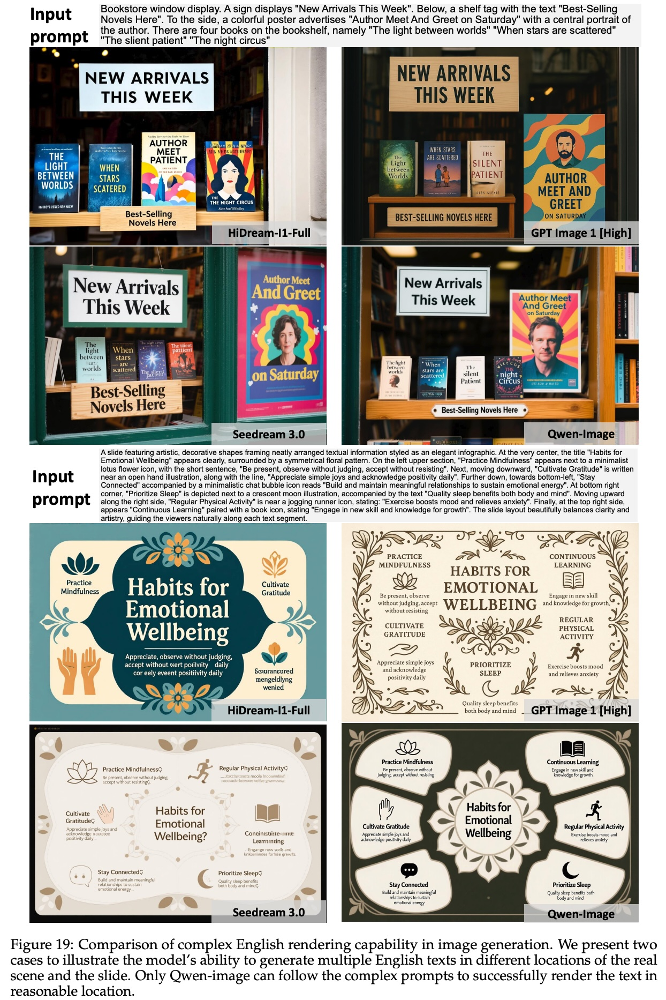

## AI论文解读 | Qwen-Image Technical Report
        
### 作者        
digoal        
        
### 日期        
2025-09-14        
        
### 标签        
PostgreSQL , PolarDB , DuckDB , AI , 论文解读        
        
----        
        
## 背景  
      
https://arxiv.org/pdf/2508.02324        
  
提示:          
```          
读懂《Qwen-Image Technical Report》这篇论文需要提前掌握哪些基础知识, 请使用中文通熟易懂的讲解这些基础知识, 可以引用论文中的图、表或使用Markdown支持的图形(text,mermaid等)增加解释性. 
  
使用中文通熟易懂的解读《Qwen-Image Technical Report》这篇论文, 其中的关键内容请着重讲解, 可以引用论文中的图、表或使用Markdown支持的图形(text,mermaid等)增加解释性. 
  
提取《Qwen-Image Technical Report》这篇论文中的重要术语, 使用中文对这些术语进行通熟易懂的讲解, 可以引用论文中的图、表或使用Markdown支持的图形(text,mermaid等)增加解释性. 
```     
  
## 1 前置知识 
  
阅读《Qwen-Image Technical Report》这篇论文，您需要了解一些关键的深度学习和计算机视觉基础知识。这篇论文的核心在于介绍一种强大的图像生成模型，它通过融合多种技术来解决图像生成和编辑中的特定难题，特别是处理复杂文本和实现精确编辑。

以下是您需要掌握的主要基础知识，我将结合论文内容用通俗易懂的方式为您讲解。

### 1. 什么是扩散模型 (Diffusion Model)

在图像生成领域，**扩散模型**是目前最主流的技术。您可以把这个过程想象成一个“去噪”过程 。

* **训练阶段**：模型通过学习，如何从一个充满随机噪声的图像，逐步恢复成一张清晰的原始图像。
* **生成阶段**：当您需要生成一张新图像时，模型会从一张完全随机的噪声图像开始，通过多次迭代，一步步“去噪”，最终生成一张符合您描述的图像。

《Qwen-Image Technical Report》中的模型就是基于这种扩散架构 。

---

### 2. 什么是多模态大语言模型 (Multimodal Large Language Model, MLLM)

您可能已经熟悉大语言模型（LLM），它能处理文字。**多模态大语言模型**则更进一步，它能同时处理多种模态的信息，比如文字和图像 。

* **作用**：在 Qwen-Image 模型中，Qwen2.5-VL 模型  就扮演了 MLLM 的角色。它负责“理解”您输入的文字提示（prompt）和图像（如果是图像编辑任务），并从中提取出“语义特征” 。
* **重要性**：这些语义特征就像是给模型的一份详细“指令”，告诉它最终应该生成什么样的内容，比如图像中应该有什么物体、它们是什么颜色、在什么位置等 。

---

### 3. 什么是变分自编码器 (Variational AutoEncoder, VAE)

VAE是一种用于图像压缩和解压缩的技术 。

* **编码器 (Encoder)**：将高分辨率的图像压缩成一个紧凑的“潜在表示”（latent representation） 。这个过程类似于把一张大图打包成一个小文件，保留了最核心的视觉信息 。
* **解码器 (Decoder)**：将这个潜在表示“解压缩”回来，重建出原始图像 。

在 Qwen-Image 中，VAE 的作用非常关键。它不仅将图像压缩成模型容易处理的格式，而且论文特别提到他们对 VAE 进行了微调，使其在处理包含**小字体文本**的图像时，重建效果更好 。这为模型后来出色的文字渲染能力打下了坚实基础 。

---

### 4. 什么是多模态扩散 Transformer (MMDiT)

**Transformer** 是当今深度学习领域非常重要的架构，擅长处理序列数据，比如文字。而 **MMDiT** 则是将 Transformer 应用到多模态扩散模型中 。

* **核心作用**：MMDiT 是 Qwen-Image 的核心骨干网络 。它负责将 MLLM 提取的“语义特征”和 VAE 提供的“图像潜在表示”结合在一起，在扩散过程中逐步生成最终的图像 。您可以把它看作是模型的“中央处理器”，负责整合所有信息并执行生成任务 。

---

### 5. 论文中的独特技术

除了上述基础知识，论文还介绍了一些独特的技术来解决特定挑战：

* **多任务训练 (Multi-task Training)**: 论文提出了一种改进的多任务训练范式，将三种任务无缝地整合在一起 ：
    * **文生图 (T2I)**：根据文字生成图像。
    * **图生图 (I2I)**：根据图像重建或转换图像。
    * **文图生图 (TI2I)**：根据文字和图像进行编辑。
    这种训练方式使得模型在图像编辑时，既能保持图像的**语义一致性**（比如保持人物身份不变），又能维持**视觉保真度**（比如只改变头发颜色而不影响面部细节） 。

* **多模态可扩展 ROPE (MSROPE)**: 这是一种创新的位置编码方法 。
    * **什么是位置编码？** 模型在处理信息时需要知道每个“元素”的位置关系，比如文字在句子里，或者像素在图片中 。这就像是为每个元素提供一个坐标。
    * **MSROPE 的优势**：MMDiT 以前的位置编码方法在处理图像和文字时会遇到问题，例如，图像的某些行和文字的位置编码可能会变得难以区分 。MSROPE 通过将文本的位置编码视为在图像网格的对角线方向上，巧妙地解决了这个问题 ，使得模型能够更好地理解和对齐图像与文本信息 。

---

现在您已经掌握了理解这篇论文所需的基本概念。如果您想深入了解其中的某个技术，例如他们如何构建数据管道来增强模型的文字渲染能力，我很乐意为您进一步讲解。

如果您对论文中的图表或其他部分有任何疑问，请随时提出！
  
## 2 解读论文 
  
好的，我们来一起用通俗易懂的方式解读一下《Qwen-Image Technical Report》这篇论文。

### 一句话总结

简单来说，**Qwen-Image (问天-图像)** 是阿里巴巴Qwen团队推出的一个开源的AI绘画和修图大模型。它最突出的两个绝活是：**① 能在图片里生成非常清晰、准确的文字（尤其是汉字）**；**② 能够非常精准地根据指令修改图片**，并且改动过的地方和没改的地方能完美融合。

-----

### 核心亮点速览

这篇论文的核心贡献可以归结为以下四点：

1.  **超强的文本渲染能力**：解决了AI绘画领域的一大痛点——在图片中生成正确、美观的文字。无论是英文段落还是复杂的中文对联，Qwen-Image都表现出色。
2.  **精准、一致的图像编辑**：用户可以用“一句话修图”，比如“把这个人的姿势从坐着改成站着”，模型不仅能听懂，还能在修改的同时保持人物的身份、服装和背景不变。
3.  **极致的数据工程**：模型强大的能力背后，是一套极其复杂和精细的数据处理流程。可以说，数据的质量和多样性是Qwen-Image成功的基石。
4.  **创新的模型架构与训练策略**：通过独特的模型设计和“循序渐进”的训练方法，让模型能够高效地学习和成长。

接下来，我们将深入这几个方面进行详细解读。

-----

### 深入解读

#### 1\. 魔鬼在细节：成功的基石——数据工程

AI模型的效果很大程度上取决于“喂”给它的数据质量。Qwen团队在这方面下了血本，构建了一个全面的数据处理体系。

**A. 数据收集与分类 (图 9)**
他们收集了数十亿的图文数据，并精心分成了四大类 ： 

  * **自然 (Nature, 55%)**: 占比最大，包含世间万物，如风景、动物、物品等，是模型通用能力的基石 。
  * **设计 (Design, 27%)**: 包括海报、UI界面、艺术品等，这类数据通常包含大量文字和复杂的布局，是训练文本渲染和设计能力的关键 。
  * **人物 (People, 13%)**: 专门用于提升人物生成和编辑的真实感与多样性 。
  * **合成数据 (Synthetic, 5%)**: 这是专门为了攻克文本渲染而**自己创造**的数据，我们下面会详细讲 。

  

论文图 9: 数据收集分类概览

**B. 为“文字”量身定制的数据合成 (图 13)**
自然图片中的文字往往是零散的、不均衡的，很多汉字甚至很少出现。为了让模型学会所有文字，他们设计了三步走的合成策略 ：

1.  **纯粹渲染 (Pure Rendering)**：在干净的背景上打印大量文字段落，让模型先认识字形 。
2.  **情景渲染 (Compositional Rendering)**：将文字合成到真实场景中，比如写在纸上、刻在木板上，让模型学习文字在真实环境中的样子 。
3.  **复杂渲染 (Complex Rendering)**：在PPT、UI设计稿等模板中填充文字，教会模型理解复杂的布局和排版指令 。

  

论文图 13: 数据合成策略

**C. 严苛的七步数据过滤流程 (图 10)**
他们设计了一个像筛子一样层层过滤的七阶段流程，确保训练数据的纯净度 。这个过程可以用下面的流程图来简化理解：


  

这个流程从最初的256像素低清图开始，剔除损坏、模糊、过曝、有水印的图片 ，逐步过渡到1328像素的高清图，并不断优化图文匹配度和数据均衡性 。

**可以说，Qwen-Image强大的文本能力，正是靠这种“笨功夫”+“巧办法”的数据工程堆出来的。**

#### 2\. 三大支柱：Qwen-Image的模型架构 (图 6)

Qwen-Image的架构由三个核心部件组成 ，我们可以把它比作一个专业的绘画团队：

  

论文图 6: Qwen-Image 架构概览

1.  **大脑 (Qwen2.5-VL)**: 这是一个多模态大语言模型，负责理解用户的指令（文字或图片） 。它就像团队的“项目经理”，能深刻领会客户的需求，并将其转化为清晰的创作指令。
2.  **画笔与画布 (VAE Encoder/Decoder)**: VAE（变分自编码器）负责图像的压缩和重建 。编码器（Encoder）像一个高级扫描仪，能把一张高清图片压缩成紧凑的数字“草稿”（即潜空间表示）；解码器（Decoder）则像一支神笔，能根据“草稿”完美地还原出图片。Qwen-Image特别对解码器进行了微调，使其在还原文字和微小细节方面能力更强 。
3.  **画家 (MMDiT)**: MMDiT（多模态扩散Transformer）是核心的图像生成器，它就是执行创作的“顶级画师” 。它接收“大脑”的指令和“画布”上的初始噪声，通过一步步的“去噪”过程，最终绘制出精美的图像。

**创新点 - MSROPE**: 论文还提到了一个技术创新叫**MSROPE**（多模态可扩展旋转位置编码）。简单理解，就是在处理图文信息时，为了不让模型混淆图片像素的位置和文字的位置，他们设计了一种巧妙的编码方式，将文字信息想象成“斜对角线”排列，从而让模型能更清晰地区分和对齐图文内容 (可见论文图 8) 。   

#### 3\. 从粗到精：先进的训练策略

**A. 渐进式训练 (Curriculum Learning)**
模型不是一口吃成个胖子的，而是像学生上学一样，从易到难地学习：

  * **从低分辨率到高分辨率**: 先用低清图训练，学会基本轮廓，再逐步用高清图训练，学习精细纹理 。
  * **从无文字到有文字**: 先学习生成不含文字的通用图像，再逐步加入文本图像，专门攻克文字渲染 。
  * **从海量数据到精品数据**: 早期用大量数据打基础，后期用精选的高质量数据进行“精修” 。

**B. Producer-Consumer 训练框架**
为了高效利用大规模GPU集群，他们设计了一个“生产者-消费者”框架 。可以想象成一个中央厨房：

  * **生产者 (Producer)**: 一组机器专门负责“备菜”，即预处理海量数据（如用VAE编码图片），并将处理好的数据放入“共享冰柜” 。
  * **消费者 (Consumer)**: 另一组GPU集群专门负责“炒菜”，即模型训练。它们直接从“冰柜”里拿处理好的数据，全身心投入计算，大大提升了训练效率 。

**C. 后期“精装修”：监督微调 (SFT) 与强化学习 (RL)**
基础模型训练好后，还要进行两轮精细打磨 ：

  * **SFT**: 用人工精选的高质量、符合人类审美的图片进行微调，让模型画风更“正” 。
  * **RL (DPO/GRPO)**: 通过人类偏好进行强化学习。简单说就是让模型生成几张图，然后由人类标注“哪张更好，哪张更差”，模型会学习去生成更符合人类喜好的图片 。

#### 4\. 效果如何？看图看数据

**A. 文本渲染能力：中英文双修，遥遥领先**
这是Qwen-Image最惊艳的部分。

  * **中文渲染 (图 20, 图 21)**: 无论是书法对联还是动漫场景里的招牌，Qwen-Image都能准确生成，字形正确、布局合理。相比之下，其他顶尖模型（如GPT-4o、Seedream 3.0）在处理中文时经常出现错字、漏字或“鬼画符” 。

     

论文图 20: 在这个例子中，只有Qwen-Image准确生成了“通云赋智乾坤启数高志远，义本生知人机同道善思新”的对联。

  * **英文渲染 (图 19)**: 在复杂的英文排版场景下，如在一张PPT中生成多处文字，Qwen-Image同样表现出色，能准确理解并执行布局指令 。   
  * **数据为证 (表 9, 表 10)**: 在专门评估中文渲染的`ChineseWord`基准测试中，Qwen-Image的综合准确率达到**58.30**，远超Seedream 3.0的33.05和GPT Image 1的36.14 。在长文本渲染测试`LongText-Bench-ZH`上，其准确率高达**0.946**，同样是第一 。     

**B. 图像编辑能力：指哪打哪，浑然天成**

  * **姿态操控 (图 26)**: 将人物从坐姿改为站姿，Qwen-Image不仅能保持人物身份和衣物不变，甚至还能合理推断出因姿态变化而露出的裤子，细节处理非常到位 。 

  

论文图 26: 保持人物和背景一致性的同时，精准地改变了姿态。

  * **物体编辑与风格保持 (图 24, 图 25)**: 无论是添加物体、移除路人，还是修改文字并保持原有艺术字体风格，Qwen-Image都展现了强大的能力，编辑后的区域与原图融合得天衣无缝 。     
  * **数据为证 (表 11, 表 12)**: 在GEdit和ImgEdit这两个权威的图像编辑基准测试中，Qwen-Image的总分均名列前茅，在多个子任务上超过了GPT Image 1等强劲对手 。   

**C. 综合实力：顶级水准，开源标杆**
在一个名为**AI Arena**的匿名打分平台上，Qwen-Image与谷歌的Imagen 4、OpenAI的GPT Image 1等顶尖闭源模型同台竞技，综合排名第三，是**排名最高的开源模型** 。这证明了其强大的综合生成能力。

  

论文图 16b: AI Arena 排行榜，Qwen-Image 位列第三。 

### 总结

《Qwen-Image Technical Report》不仅展示了一个在文本渲染和图像编辑方面取得突破性进展的SOTA（State-of-the-art，即当前最先进）模型，更重要的是，它详细揭示了通往成功的路径——**即通过极致的数据工程、创新的模型设计和精细的训练策略，可以系统性地解决现有模型的痛点**。作为开源模型，Qwen-Image为整个AI社区提供了强大的工具和宝贵的经验，推动了视觉内容生成技术的发展。
  
## 3 术语 
  
在《Qwen-Image Technical Report》这篇论文中，为了实现复杂的图像生成和编辑，研究团队引入并改进了多项关键技术。以下是论文中一些重要的核心术语及其通俗易懂的中文解释。

---

### 1. 扩散模型 (Diffusion Model)

**解释:** 扩散模型是目前最先进的图像生成技术。您可以把它理解为一个“逆向去噪”的过程。

* **训练阶段**：模型学习如何从一张模糊的、充满随机噪声的图像，逐步恢复成清晰的原始图像。这个过程就像是教一个艺术家如何通过一系列笔触，将一张完全空白的画布变成一幅具体的画作。
* **生成阶段**：当您需要生成一张新图像时，模型会从一张纯随机噪声图像开始，通过反复迭代的“去噪”步骤，逐步将噪声转化为您想要的图像。

论文中的 **Qwen-Image** 模型正是基于这种扩散架构，因此它能够生成高质量、高细节的图像。

### 2. 多模态大语言模型 (Multimodal Large Language Model, MLLM)

**解释:** 顾名思义，它是一种能够理解和处理多种信息格式（模态）的AI模型，例如同时理解文字和图像。

* **论文中的应用**：在 **Qwen-Image** 模型中，**Qwen2.5-VL** 就扮演了 MLLM 的角色。它就像是模型的“大脑”，负责解析您的文字指令（例如“生成一张戴着红色帽子的猫”）和输入的参考图像，将这些信息转化为模型可以理解的**语义特征**，从而指导图像的生成过程。

### 3. 变分自编码器 (Variational AutoEncoder, VAE)

**解释:** VAE 的主要作用是对图像进行高效的压缩和解压缩。

* **工作原理**：
    * **编码器 (Encoder)**：将高分辨率的图像压缩成一个更小的、更易于处理的**潜在表示**（latent representation）。
    * **解码器 (Decoder)**：将这个潜在表示重新扩展，重建出完整的图像。
* **论文中的独特之处**：为了解决在图像中生成清晰小字体文本的难题，研究团队特别对 VAE 进行了微调。这种微调使得 **Qwen-Image** 在处理文字信息时能够保留更多细节，从而在生成图像时能更精确地渲染文字。

### 4. 多模态扩散 Transformer (MMDiT)

**解释:** 它是 **Qwen-Image** 的核心骨干网络。可以将其视为一个“中央处理器”，负责将来自不同模态的信息（文字、图像）整合在一起，驱动扩散过程以生成最终图像。

* **核心功能**：它将 MLLM 理解的语义特征和 VAE 提供的图像潜在表示融合在一起。这个网络能够理解不同信息之间的关系，并根据这些关系逐步“去噪”，最终生成符合所有输入指令的图像。

### 5. 多任务训练 (Multi-task Training)

**解释:** 这种训练策略是指模型在一次训练中同时学习并掌握多种不同的任务，而不是只专注于一项任务。

* **论文中的应用**：**Qwen-Image** 采用了改进的多任务训练方法，将三种核心任务整合：
    * **文生图 (T2I)**：根据文字生成图像。
    * **图生图 (I2I)**：根据一张图像重建或转换另一张图像。
    * **文图生图 (TI2I)**：根据文字指令对现有图像进行编辑。

这种训练方式的优点是，模型在进行图像编辑（TI2I）时，能更好地理解原始图像的内容并保持**语义一致性**（例如保持人物身份），同时也能精确地执行文字指令（例如改变物体的颜色），从而达到更高的**视觉保真度**。

### 6. 多模态可扩展 ROPE (MSROPE)

**解释:** 这是一种创新的位置编码方法，用于帮助模型理解图像和文字信息中的空间和顺序关系。

* **为什么需要它？**：在多模态模型中，需要一种方法来告诉模型图像中的像素和文字中的单词各自所处的位置。传统的方法在处理图像和文字的混合信息时会遇到“混淆”问题。
* **MSROPE的创新**：MSROPE 巧妙地通过将文本的位置编码映射到图像网格的对角线上，解决了不同模态信息在空间上的冲突，让模型能够更清晰地对齐和理解图像与文本之间的复杂关系。

---

如果您希望我用更具体的例子或图示来解释其中某个术语，请随时告诉我，我很乐意为您进一步说明！
  
## 参考        
         
https://arxiv.org/pdf/2508.02324    
        
<b> 以上内容基于DeepSeek、Qwen、Gemini及诸多AI生成, 轻微人工调整, 感谢杭州深度求索人工智能、阿里云、Google等公司. </b>        
        
<b> AI 生成的内容请自行辨别正确性, 当然也多了些许踩坑的乐趣, 毕竟冒险是每个男人的天性.  </b>        
  
    
#### [期望 PostgreSQL|开源PolarDB 增加什么功能?](https://github.com/digoal/blog/issues/76 "269ac3d1c492e938c0191101c7238216")
  
  
#### [PolarDB 开源数据库](https://openpolardb.com/home "57258f76c37864c6e6d23383d05714ea")
  
  
#### [PolarDB 学习图谱](https://www.aliyun.com/database/openpolardb/activity "8642f60e04ed0c814bf9cb9677976bd4")
  
  
#### [PostgreSQL 解决方案集合](../201706/20170601_02.md "40cff096e9ed7122c512b35d8561d9c8")
  
  
#### [德哥 / digoal's Github - 公益是一辈子的事.](https://github.com/digoal/blog/blob/master/README.md "22709685feb7cab07d30f30387f0a9ae")
  
  
#### [About 德哥](https://github.com/digoal/blog/blob/master/me/readme.md "a37735981e7704886ffd590565582dd0")
  
  

  
