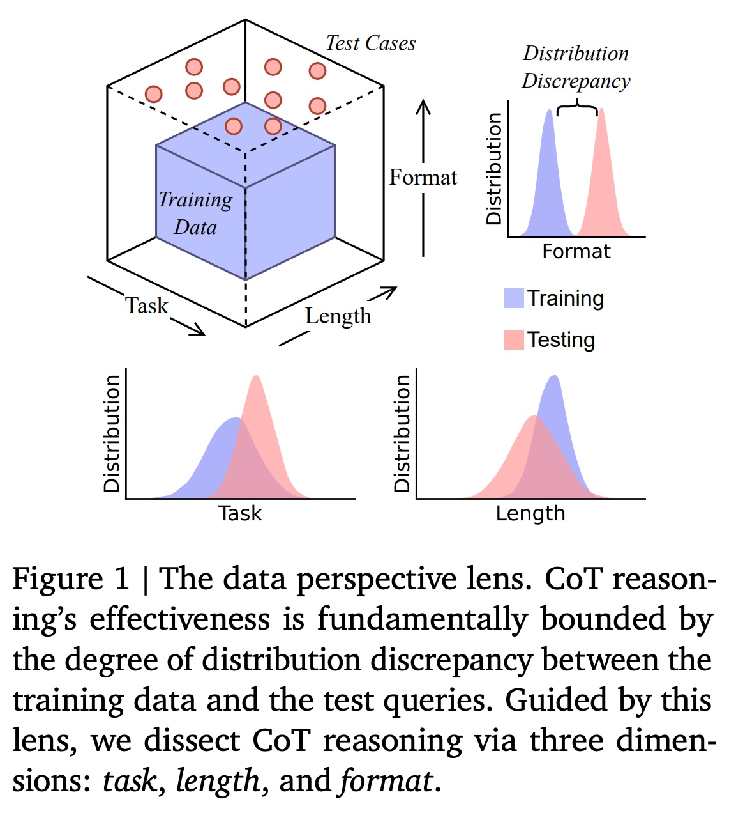
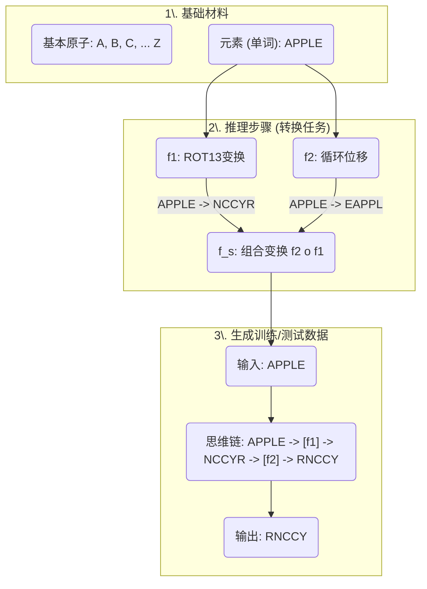
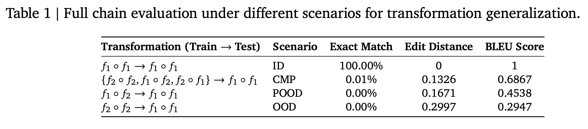
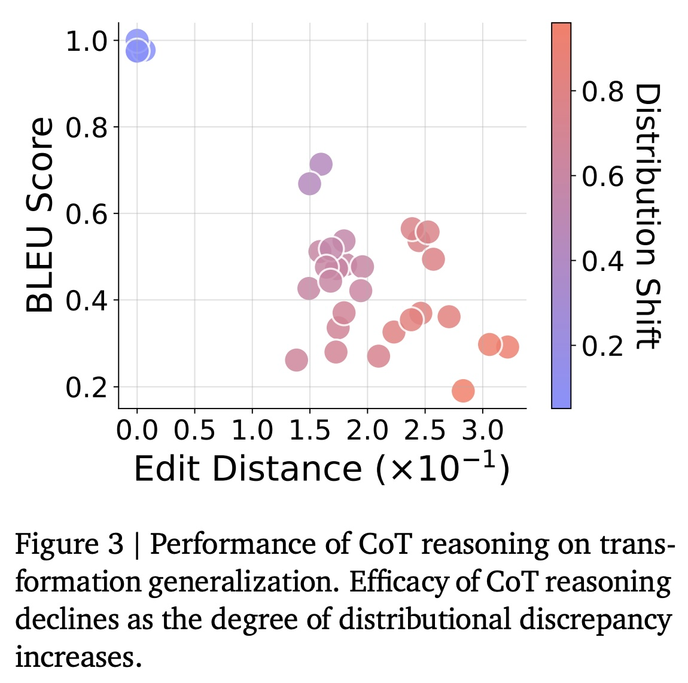
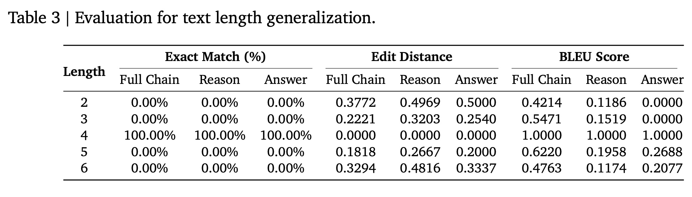
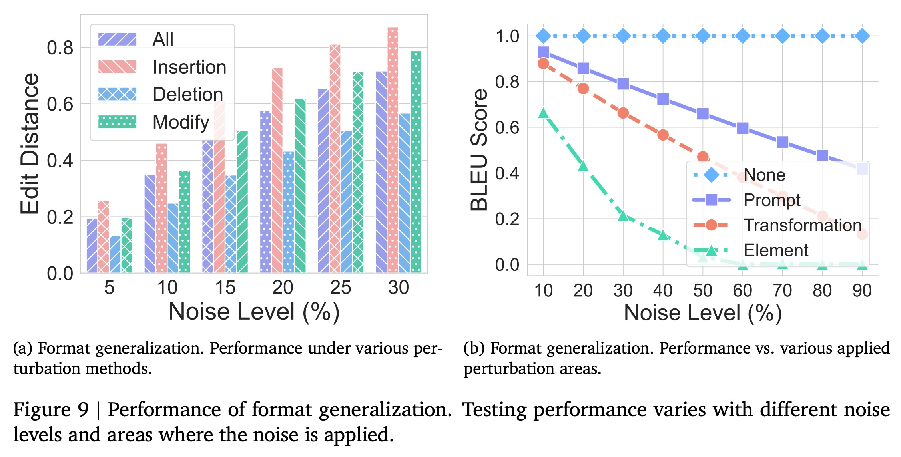

## AI论文解读 | Is Chain-of-Thought Reasoning of LLMs a Mirage? A Data Distribution Lens
        
### 作者        
digoal        
        
### 日期        
2025-09-14        
        
### 标签        
PostgreSQL , PolarDB , DuckDB , AI , 论文解读        
        
----        
        
## 背景  
      
https://arxiv.org/pdf/2508.01191        
  
提示:          
```          
读懂《Is Chain-of-Thought Reasoning of LLMs a Mirage? A Data Distribution Lens》这篇论文需要提前掌握哪些基础知识, 请使用中文通熟易懂的讲解这些基础知识, 可以引用论文中的图、表或使用Markdown支持的图形(text,mermaid等)增加解释性. 
  
使用中文通熟易懂的解读《Is Chain-of-Thought Reasoning of LLMs a Mirage? A Data Distribution Lens》这篇论文, 其中的关键内容请着重讲解, 可以引用论文中的图、表或使用Markdown支持的图形(text,mermaid等)增加解释性. 
  
提取《Is Chain-of-Thought Reasoning of LLMs a Mirage? A Data Distribution Lens》这篇论文中的重要术语, 使用中文对这些术语进行通熟易懂的讲解, 可以引用论文中的图、表或使用Markdown支持的图形(text,mermaid等)增加解释性. 
```     
  
## 1 前置知识 
  
要读懂《Is Chain-of-Thought Reasoning of LLMs a Mirage? A Data Distribution Lens》这篇论文，您主要需要掌握以下几个核心基础知识。这篇论文的核心论点是：大型语言模型（LLMs）的思维链（CoT）推理能力，可能不是真正的“推理”，而更像是对训练数据中模式的“复制和模仿”。

---

### 1. 思维链（Chain-of-Thought, CoT）推理

**是什么？** 思维链（CoT）是一种提示技巧，通过在问题后添加如“让我们一步步思考”的提示，来引导大型语言模型（LLMs）在给出最终答案前，先生成一个详细的、分步的推理过程 。这种方法已被证明能提升模型在逻辑推理和数学解题等任务上的表现 。

**论文的观点：** 尽管这种方法看起来非常像人类的思考过程，但论文质疑这可能是一种“海市蜃楼”（a mirage），即模型只是在模仿训练数据中看到的推理模式，而不是真正理解了底层的逻辑 。论文举了一个例子，一个模型在回答一个关于“美国成立年份是否为闰年”的问题时，虽然能列出判断闰年的正确步骤，但最终却给出了自相矛盾的结论 。

### 2. 数据分布（Data Distribution）视角

**是什么？** 数据分布指的是训练数据和测试数据在统计学上的特征和规律。可以想象一个三维空间，它的三个轴分别是“任务”、“长度”和“格式”，所有训练数据都集中在这个空间中的一个特定区域（蓝色立方体）。

* **in-distribution（分布内）数据：** 位于蓝色立方体内部，即模型在训练时已经见过的或非常相似的数据。
* **out-of-distribution（OOD，分布外）数据：** 位于立方体之外，与训练数据有明显差异的测试数据 。

**论文的观点：** 论文提出，CoT推理的有效性，从根本上取决于测试数据与训练数据之间的“分布差异”（distribution discrepancy） 。如果测试数据在“任务”、“长度”或“格式”上与训练数据差异太大，模型的CoT推理能力就会迅速下降，暴露出其脆弱性 。

### 3. DATAALCHEMY：可控的实验环境

为了验证其假设，作者们设计了一个名为 **DATAALCHEMY** 的受控实验环境 。在这个环境中，他们从零开始训练语言模型，并使用一套人造的规则（如ROT变换、循环位移等 ），来制造不同程度的“分布差异” 。

这样做的好处是，可以排除掉大型预训练模型中复杂的、难以解释的模式，从而孤立地研究数据分布变化对CoT推理的影响 。

### 4. 三个泛化维度

论文从三个维度来具体探究“分布差异”如何影响CoT推理：

* **任务泛化（Task Generalization）**
    * **核心：** 探讨CoT推理能否处理与训练时结构不同的新任务 。
    * **实验：** 论文通过在测试时引入新的变换（例如，在训练时只见过 `f1` 和 `f2` 组合，但测试时出现新的 `f3` 变换），来制造任务差异 。
* **长度泛化（Length Generalization）**
    * **核心：** 探究CoT推理能否应对需要比训练时更长或更短的推理步骤的任务 。
* **格式泛化（Format Generalization）**
    * **核心：** 探究CoT推理对提示词（prompt）表面形式变化的敏感程度 。例如，在问题中增加或删除无关的词汇，或者改变问题的表达方式。

---

**总而言之，** 这篇论文挑战了我们对大型语言模型“推理能力”的乐观态度，并通过严谨的实验证明，看似聪明的CoT推理，在数据分布发生变化时，就会迅速失效。它揭示了CoT更多是一种“模式匹配”系统，而非真正的逻辑推理系统 。

现在，您已经掌握了这篇论文的核心概念。您是否希望我为您详细解读论文中的某个具体部分，例如某个实验的结果或者图表？
  
## 2 解读论文 
  
好的，我们来通俗易懂地解读一下这篇名为《Is Chain-of-Thought Reasoning of LLMs a Mirage? A Data Distribution Lens》（大型语言模型的思维链推理是海市蜃楼吗？一个数据分布的视角）的论文。

这篇论文的核心观点非常犀利：**大型语言模型（LLM）的“思维链”（Chain-of-Thought, CoT）能力，看起来像是在进行逻辑推理，但本质上可能只是一种“海市蜃楼”，一种基于训练数据的、高级的模式匹配，而非真正的、可泛化的推理能力。**

-----

### 1\. 论文的出发点：一个令人困惑的例子

研究人员发现，即使是顶尖的语言模型，在进行CoT推理时也会犯一些莫名其妙的错误。

论文中举了一个例子 ：

> 问：美国成立的那一天是在闰年还是平年？
>
> Gemini的回答：“美国成立于1776年。1776能被4整除，但不是世纪年，所以它**是闰年**。因此，美国成立的那一天是在**平年**。”

这个回答很奇怪。模型正确地陈述了判断闰年的规则，也正确地判断出1776年是闰年，但最后却得出了一个自相矛盾的结论。这让研究人员怀疑，模型可能并不是真的“理解”了推理过程，而只是在“表演”或“模仿”它在训练数据中见过的推理文本模式。

-----

### 2\. 核心假设：一切都与“数据分布”有关

作者提出了一个核心假设：**CoT的有效性，本质上受限于测试问题与训练数据的“分布差异”** 。

这是什么意思呢？我们可以用一个比喻来理解：

> 假设你是一个学生，为了准备考试，你只刷了一本习题集A。这本习题集里所有的题目都是“格式1”，解题步骤都是“先做X，再做Y”。
>
>   * **分布内 (In-Distribution):** 考试时，如果题目和习题集A里的题型、格式、步骤都一样，你就能做得很好。
>   * **分布外 (Out-of-Distribution, OOD):** 但如果考试突然出了一道“格式2”的新题，或者需要“先做Y，再做Z”的步骤，即使考点相同，你也可能会不知所措。

论文认为，LLM就是这个学生。它所谓的“推理”，其实是在其庞大的训练数据（习题集）中，寻找和当前问题最相似的“解题模板”，然后进行模仿和生成。一旦问题的形式超出了它熟悉的范围，这种“推理”能力就会急剧下降。

如下图所示，训练数据（蓝色方块）只覆盖了可能性空间的一小部分。当测试案例（红色圆点）落在了训练数据覆盖的范围内或附近时，模型表现良好。但当测试案例在**任务（Task）、长度（Length）、格式（Format）** 这三个维度上与训练数据差异过大时，模型的表现就会变差 。

  

*图1：数据分布视角。思维链的有效性被训练数据和测试问题之间的分布差异所限制。* 

-----

### 3\. “人造实验室”：DATAALCHEMY

为了验证这个假设，研究人员不能直接用像GPT-4这样的大模型，因为我们不知道它们的具体训练数据是什么。于是，他们自己创建了一个高度可控的“人造实验室”环境，叫做 **DATAALCHEMY** 。

这个环境非常巧妙，我们可以用一个Mermaid流程图来理解它的构造：



  * **基本原子与元素**：用26个字母作为“原子”，由原子组成固定长度的“元素”（比如`APPLE`） 。
  * **转换（Transformations）**：定义了两种简单、明确的数学运算作为“推理规则”，比如 $f\_1$ 是ROT13加密（每个字母在字母表中后移13位）， $f\_2$ 是循环位移（把最后一个字母移到最前面） 。
  * **思维链**：将这些转换任务串联起来，比如对"APPLE"先执行 $f\_1$ 再执行 $f\_2$ ，就构成了一个两步的推理链 。

通过这个“实验室”，研究人员可以从零开始训练一个模型，并且精确地控制训练数据和测试数据在这三个维度上的差异。

-----

### 4\. 三大维度的残酷实验结果

研究人员在**任务、长度、格式**三个维度上系统地测试了模型的泛化能力，结果非常一致：一旦出现分布差异，模型性能就会“雪崩”。

#### 4.1 任务泛化 (Task Generalization)

  * **实验设计**：模型在某些转换组合（如 $f\_1 \\circ f\_1$ ）上训练，然后在新的、没见过的组合（如 $f\_2 \\circ f\_2$ 或 $f\_1 \\circ f\_2$ ）上测试 。
  * **实验结果**：如**表1**和**图3**所示，性能下降非常剧烈。在完全“分布外”（OOD）的情况下，模型的准确率（Exact Match）直接降到了0% 。这表明模型没有学会 $f\_1$ 和 $f\_2$ 的“原理”，只是记住了训练中见过的特定组合模式。     
  * **有趣的发现**：研究人员发现，只要给模型看极少量（例如0.015%）的新任务数据进行微调（SFT），它就能迅速学会。这进一步证明了它是在“背模式”，而不是在“学推理” 。

#### 4.2 长度泛化 (Length Generalization)

  * **实验设计**：模型只在固定长度的元素（如4个字母）或固定步骤的推理链（如2步）上进行训练，然后在不同长度或不同步骤数的任务上测试 。
  * **实验结果**：如**表3**所示，模型完全无法泛化 。当输入长度或推理步骤与训练数据不一致时，模型的准确率也是0%。更有趣的是，模型会强行生成和训练数据同样长度的错误答案，比如通过增删字符来凑数 。   

#### 4.3 格式泛化 (Format Generalization)

  * **实验设计**：在测试时，对输入的提示词（Prompt）做一些微小的改动，比如插入、删除或替换一些无关紧要的字符 。
  * **实验结果**：如**图9**所示，CoT推理对格式变化非常敏感。特别是对问题核心部分（元素和转换指令）的扰动，会极大地影响结果 。这说明模型依赖于极其表面的文本模式，而不是内容的语义。   

-----

### 5\. 结论与启示：CoT是“脆弱的海市蜃楼”

这篇论文最终得出一个结论：**CoT的推理能力是一种脆弱的幻象（brittle mirage）** 。它并非源于模型内在的逻辑推理能力，而是一种复杂的、结构化的模式匹配过程，其能力被训练数据分布牢牢地束缚住了 。

这对我们普通用户和开发者有什么启示呢？

1.  **警惕过度依赖和虚假信心**：不要把CoT当作一个即插即用的、可靠的推理工具，尤其是在金融、医疗、法律等高风险领域 。模型生成的看似流畅的“废话”比直接答错更具欺骗性 。
2.  **必须进行OOD（分布外）测试**：评估一个模型是否可靠，不能只用和训练数据相似的数据集，必须用它没见过的新类型、新格式、新长度的问题去“刁难”它，才能真正了解其泛化能力的边界 。
3.  **微调是“补丁”，而非“万灵药”**：虽然微调（SFT）可以很快地让模型适应新的任务模式，但这只是把它的“舒适区”扩大了一点点，并没有解决它缺乏真正抽象推理能力的根本问题 。

总而言之，这篇论文为我们揭示了当前大语言模型能力光环下的一个深刻局限，提醒我们在利用AI强大能力的同时，也要对其能力的真实边界保持清醒和审慎。
  
## 3 术语 
  
好的，我已经为您整理并解释了《Is Chain-of-Thought Reasoning of LLMs a Mirage? A Data Distribution Lens》这篇论文中的几个关键术语。这篇论文的核心观点是，大语言模型（LLMs）的思维链（CoT）推理能力可能没有我们想象的那么强大，它更多地是依赖于训练数据的分布，而非真正的逻辑推理。

---

### 1. 思维链（Chain-of-Thought, CoT）

这是一种**提示技术**，旨在引导大型语言模型（LLMs）在给出最终答案之前，先生成一系列中间的思考步骤或推理过程。

* **它的作用：** 就像我们解一道数学题时会写下详细的步骤，CoT 提示让模型也这样做。这通常能显著提高模型在需要多步推理的任务（如数学题、逻辑题）上的表现。
* **论文的看法：** 论文将这种现象称为一种 **“海市蜃楼”（Mirage）** 。它的意思是，这种看起来像“推理”的能力，很可能只是模型在模仿和复制它在海量训练数据中看到的相似模式，而不是真正掌握了推理的底层逻辑。当面对它从未见过的复杂情况时，这种能力就会“失效”。

### 2. 数据分布透镜（Data Distribution Lens）

这是作者们分析和看待 CoT 推理能力的一种**核心视角**。

* **核心思想：** 模型的表现好坏，根本上取决于它在训练时所见到的数据（**训练数据分布**）与它在测试时所面对的数据（**测试数据分布**）之间的差异大小。
* **分布内数据（in-distribution）与分布外数据（out-of-distribution, OOD）**：
    * **分布内数据**指的是那些与模型在训练时看到的数据非常相似的测试数据。在这种情况下，模型通常表现良好。
    * **分布外数据**指的是那些在任务类型、长度或格式上与训练数据有显著差异的数据。当模型遇到这类数据时，它的表现会迅速恶化。

### 3. DATAALCHEMY 实验环境

这是一个专门为研究而设计的**可控实验环境**。

* **为什么要设计它？** 现有的 LLM 都是在海量、复杂的互联网数据上训练的，很难孤立地研究某一个因素（如数据分布）对模型能力的影响。DATAALCHEMY 允许研究人员从零开始训练小型语言模型，并使用人工制造的、有明确规则的数据集，从而可以精确地控制“训练数据”和“测试数据”之间的差异。

### 4. 三个泛化维度（Generalization Dimensions）

为了量化“数据分布差异”的影响，论文从三个具体维度进行了实验，来测试模型的**泛化能力**。

* **任务泛化（Task Generalization）**：测试模型能否处理**训练时从未见过的任务规则或组合**。例如，如果模型只见过 `A+B` 和 `B+C` 的组合，测试时出现 `A+C`，它的推理能力会怎样？
* **长度泛化（Length Generalization）**：测试模型能否处理**比训练时需要更长或更短的推理步骤**的任务。
* **格式泛化（Format Generalization）**：测试模型对**提示词（prompt）格式的变化**有多敏感。例如，如果只是在提示词中增加一些无关的词语，模型的推理是否会受到影响？

---

这些术语构成了论文的理论基础和实验框架，理解了它们，您就能更好地理解论文中为何说 CoT 是一种“海市蜃楼”。

您对这些术语中的哪一个最感兴趣？我可以为您提供更多相关的例子和细节。
  
## 参考        
         
https://arxiv.org/pdf/2508.01191    
        
<b> 以上内容基于DeepSeek、Qwen、Gemini及诸多AI生成, 轻微人工调整, 感谢杭州深度求索人工智能、阿里云、Google等公司. </b>        
        
<b> AI 生成的内容请自行辨别正确性, 当然也多了些许踩坑的乐趣, 毕竟冒险是每个男人的天性.  </b>        
  
    
#### [期望 PostgreSQL|开源PolarDB 增加什么功能?](https://github.com/digoal/blog/issues/76 "269ac3d1c492e938c0191101c7238216")
  
  
#### [PolarDB 开源数据库](https://openpolardb.com/home "57258f76c37864c6e6d23383d05714ea")
  
  
#### [PolarDB 学习图谱](https://www.aliyun.com/database/openpolardb/activity "8642f60e04ed0c814bf9cb9677976bd4")
  
  
#### [PostgreSQL 解决方案集合](../201706/20170601_02.md "40cff096e9ed7122c512b35d8561d9c8")
  
  
#### [德哥 / digoal's Github - 公益是一辈子的事.](https://github.com/digoal/blog/blob/master/README.md "22709685feb7cab07d30f30387f0a9ae")
  
  
#### [About 德哥](https://github.com/digoal/blog/blob/master/me/readme.md "a37735981e7704886ffd590565582dd0")
  
  

  
