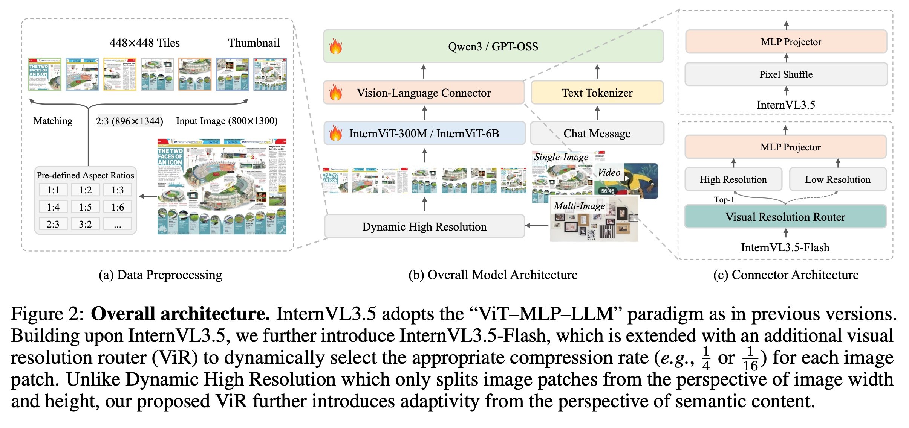
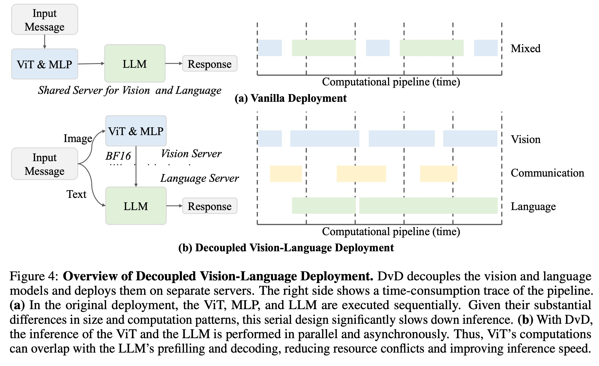
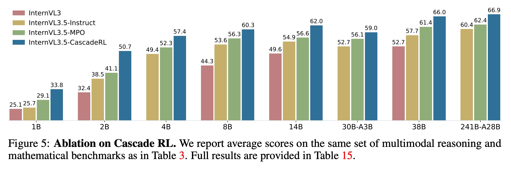
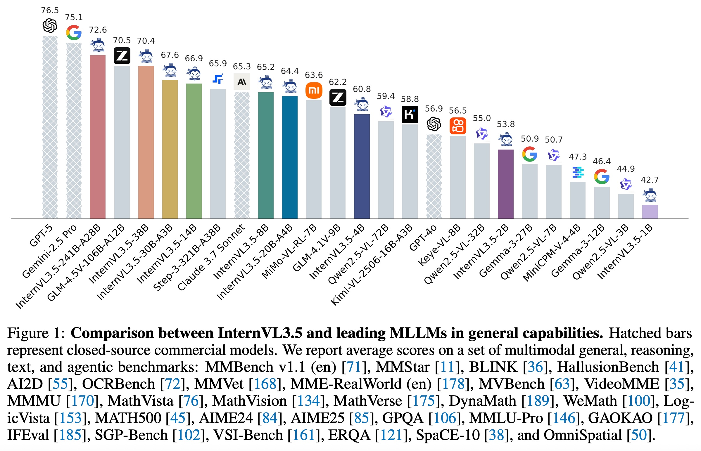
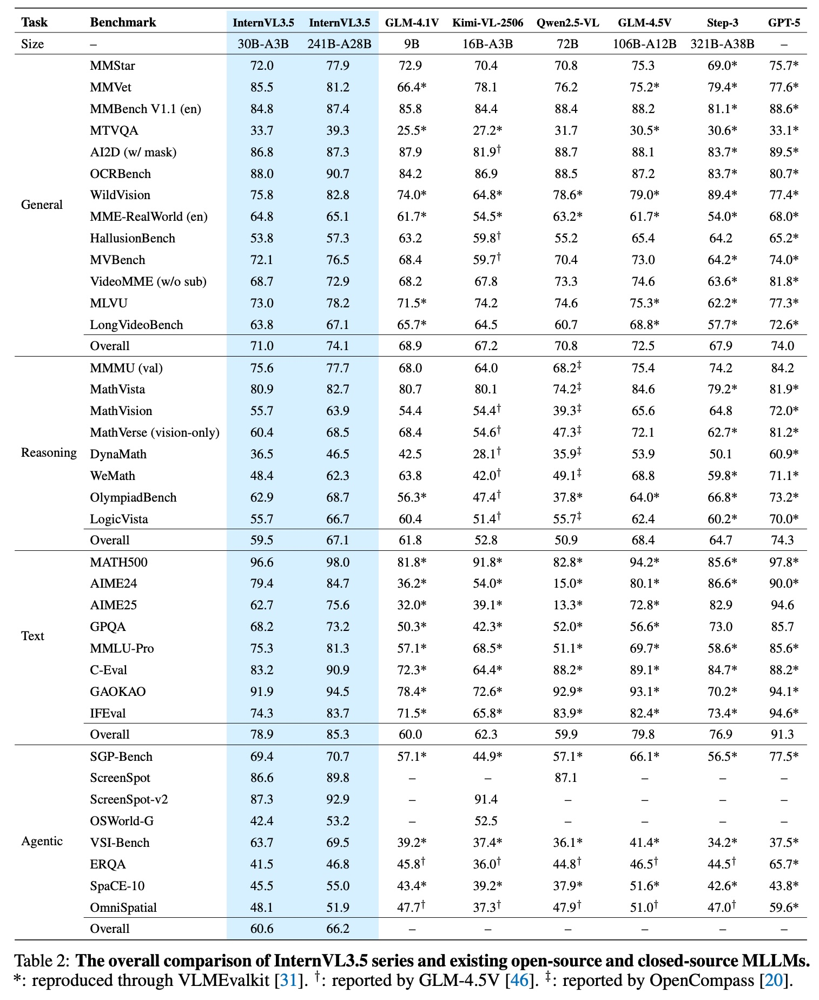

## AI论文解读 | InternVL3.5: Advancing Open-Source Multimodal Models in Versatility, Reasoning, and Efficiency
        
### 作者        
digoal        
        
### 日期        
2025-09-14        
        
### 标签        
PostgreSQL , PolarDB , DuckDB , AI , 论文解读        
        
----        
        
## 背景  
      
https://arxiv.org/pdf/2508.18265        
  
提示:          
```          
读懂《InternVL3.5: Advancing Open-Source Multimodal Models in Versatility, Reasoning, and Efficiency》这篇论文需要提前掌握哪些基础知识, 请使用中文通熟易懂的讲解这些基础知识, 可以引用论文中的图、表或使用Markdown支持的图形(text,mermaid等)增加解释性. 
  
使用中文通熟易懂的解读《InternVL3.5: Advancing Open-Source Multimodal Models in Versatility, Reasoning, and Efficiency》这篇论文, 其中的关键内容请着重讲解, 可以引用论文中的图、表或使用Markdown支持的图形(text,mermaid等)增加解释性. 
  
提取《InternVL3.5: Advancing Open-Source Multimodal Models in Versatility, Reasoning, and Efficiency》这篇论文中的重要术语, 使用中文对这些术语进行通熟易懂的讲解, 可以引用论文中的图、表或使用Markdown支持的图形(text,mermaid等)增加解释性. 
```     
  
## 1 前置知识 
  
您好，要读懂《InternVL3.5: Advancing Open-Source Multimodal Models in Versatility, Reasoning, and Efficiency》这篇论文，您需要对以下几个核心概念有基础的了解。这篇论文在多模态大语言模型（MLLMs）的基础上，提出了三个重要的创新点来提升模型的通用性、推理能力和效率。

以下是论文中提到的关键基础知识，我将为您进行通俗易懂的讲解。

### 1\. 多模态大语言模型 (MLLM) 的基本概念

多模态大语言模型（Multimodal Large Language Models, MLLMs）是近年来人工智能领域的一个热门方向 。顾名思义，这类模型能够同时处理多种类型的数据，比如文本和图像。传统的LLMs只能处理文本，而MLLMs则可以“看图说话”，进行基于图像的问答、理解文档、识别图表等复杂任务。

这篇论文的InternVL3.5系列模型就是一种典型的MLLM，它能够执行文本相关任务、推理任务和代理任务 。

-----

### 2\. 模型架构：“ViT-MLP-LLM”范式

论文中提到，InternVL3.5沿用了其前代版本的“ViT-MLP-LLM”架构范式 。这个架构可以分解为三个主要部分：

  * **ViT (Vision Transformer)**：ViT是专门用于处理图像的神经网络模型 。它将图像分解成小块（patches），然后像处理文本一样对这些图像块进行编码。您可以将其想象成模型的“眼睛”，负责将图像内容转化为模型可以理解的数字信息。
  * **MLP Projector (多层感知机)**：MLP Projector是一个连接器 。ViT生成的图像数字信息和LLM（大语言模型）处理的文本信息在格式上是不同的。MLP Projector的作用就像一个“翻译官”，将ViT的视觉输出转换成LLM可以理解的格式，从而实现视觉和语言的对齐。
  * **LLM (Large Language Model)**：LLM是模型的核心 。它负责接收MLP Projector转换后的视觉信息以及文本信息，并进行推理和生成回答。您可以将LLM想象成模型的“大脑”，负责思考和回答问题。

论文中的图2(b)展示了这种整体架构：

  

这幅图直观地展示了图像（InternViT）和文本（Text Tokenizer）如何通过连接器（Vision-Language Connector）传递给大语言模型（Qwen3/GPT-OSS），从而实现多模态的交互。

-----

### 3\. 强化学习 (Reinforcement Learning, RL)

强化学习是这篇论文中提升模型推理能力的关键技术 。简单来说，RL是一种让模型通过与环境的互动来学习最佳行为的方法。它不是直接告诉模型正确答案，而是通过**奖励机制**来引导模型。如果模型的行为是好的，就给予正向奖励；如果是不好的，就给予负向奖励。

论文的核心创新是**级联强化学习 (Cascade RL)** 框架，它结合了两种RL方法:

  * **离线强化学习 (Offline RL)**：离线RL使用预先收集好的数据集进行训练 。它的优点是训练效率高，可以快速让模型达到一个较好的水平 。论文中使用的MPO算法就属于离线RL 。
  * **在线强化学习 (Online RL)**：在线RL让模型在训练过程中与环境实时互动，产生新的数据进行学习 。这种方法虽然计算成本高，但能进一步精炼模型的输出分布，从而达到更高的性能上限 。论文中使用的GSPO算法就属于在线RL 。

Cascade RL的精妙之处在于它采用了“由粗到精”的训练策略 。首先通过高效的离线RL进行“热身”，达到一个满意的结果，为第二阶段提供高质量的训练数据；然后利用在线RL进行精细化调整，进一步提升模型的性能 。

-----

### 4\. 效率优化

为了解决模型计算成本高、推理速度慢的问题，论文提出了两个创新方法：

  * **视觉分辨率路由器 (Visual Resolution Router, ViR)**：ViR是一个模块，可以动态地根据图像内容的语义重要性来调整视觉令牌（visual tokens）的分辨率 。您可以想象成模型在处理图像时，可以自动识别出哪些区域需要高清细节，哪些区域可以压缩。这样，它可以在不牺牲太多性能的前提下，减少视觉令牌的数量，从而大幅提升推理速度 。
  * **解耦视觉-语言部署 (Decoupled Vision-Language Deployment, DvD)**：DvD是一种部署策略，它将视觉编码器（ViT）和语言模型（LLM）分别部署在不同的GPU上 。这可以有效平衡计算负载，最大限度地利用硬件并行性，从而进一步加快推理速度 。

希望这些解释能帮助您更好地理解这篇论文。

-----

如果您想进一步深入了解，我可以为您提供更多关于以下方面的详细信息：

  * 论文中提到的**模型微调**过程（如SFT、ViCO）
  * 论文中使用的**性能评估基准**（如MMMU、MathVista）
  * InternVL3.5系列模型与**其他开源模型和商业模型**的性能对比

您好，很高兴能继续探讨这篇论文。InternVL3.5论文中提到的模型微调过程是其性能提升的关键环节，主要包括两个重要步骤：**SFT（Supervised Fine-Tuning）**和**ViCO（Vision-Language Contrastive Optimization）**。

### 1. SFT (Supervised Fine-Tuning) - 有监督微调

SFT是大型语言模型训练中的一个标准且非常重要的步骤。简单来说，它的目的是让模型学会**遵循指令**并产生人类期望的回答。

* **核心思想**: 就像一个学生在老师的指导下做练习题一样，SFT利用高质量的、带有正确答案的**指令数据集**来训练模型。这些数据集通常包含“图像-问题-答案”三元组，例如：
    * **图像**: 一张猫的照片
    * **问题**: “这张照片里有什么动物？”
    * **答案**: “照片里有一只猫。”
* **作用**: 通过SFT，模型能够理解并模仿人类的指令，从而掌握基本的问答、描述、推理等能力。这一步是构建一个功能性多模态模型的基础。论文中提到，他们使用了混合的高质量多模态指令数据集进行SFT，这确保了模型能够处理各种各样的任务。

### 2. ViCO (Vision-Language Contrastive Optimization) - 视觉-语言对比优化

ViCO是这篇论文中一个非常独特的创新点，它旨在解决多模态模型在处理细节时可能遇到的挑战，特别是在区分视觉上非常相似但语义上不同的概念时。

* **核心思想**: ViCO通过**对比学习**来训练模型。它向模型展示一对“正例”和“负例”，并教导模型如何区分它们。
    * **正例**: 包含图像和与之正确匹配的文本描述。
    * **负例**: 包含图像和与之不匹配的、但视觉上相似的文本描述。
* **具体例子**: 假设有一张包含“狗”的图片。
    * **正例**: 图片 + 文本“这是一只狗”。
    * **负例**: 图片 + 文本“这是一只狼”。
    虽然狗和狼在视觉上可能很相似，但ViCO通过对比训练，强制模型学习它们之间细微的视觉和语义差异，从而提高其辨别能力。
* **作用**: ViCO能够显著增强模型的视觉-语言对齐能力，使其在处理细粒度（fine-grained）的视觉细节时更加准确，例如在识别特定品种的动物、细微的物体属性等方面表现更佳。

### 总结

InternVL3.5的微调过程是一个“SFT + ViCO”的组合拳。首先，通过SFT让模型学会通用的指令遵循能力；然后，通过ViCO进一步优化模型的视觉理解和区分能力，使其在复杂任务中表现得更出色。

现在您对论文中的模型微调过程有了更深入的了解。接下来，您对论文中提到的哪些方面最感兴趣？我们可以进一步探讨其**性能评估基准**（例如MMMU和MathVista）或**效率优化**方法（例如ViR和DvD）。

很好，效率优化是这篇论文的亮点之一。InternVL3.5通过两种核心方法显著提升了模型的推理速度，同时保持了强大的性能：**视觉分辨率路由器 (ViR)**和**解耦视觉-语言部署 (DvD)**。

### 1. 视觉分辨率路由器 (ViR)

在处理图像时，传统的MLLM通常会统一地对所有视觉信息进行编码，这就像用最高清的相机去拍摄每一个细节，效率非常低。而ViR则是一种更智能的解决方案。

* **核心思想**: ViR的理念是“按需处理”。它首先对输入的图像进行低分辨率的初步分析，快速识别出哪些区域包含重要的信息（例如文字、人脸、关键物体），哪些区域是背景或不重要的。
* **工作原理**:
    * 模型首先以较低的分辨率（例如224x224）处理整张图像，获取一个全局概览。
    * 一个小型网络（称为“路由器”）会根据这个低分辨率的分析结果，预测出哪些区域需要更高分辨率的细节。
    * 模型只针对这些“感兴趣的”区域，进行更高分辨率（例如448x448甚至896x896）的编码。
* **优势**: 这种方法避免了对整张图片进行高分辨率编码所带来的巨大计算量，极大地减少了处理的视觉令牌数量。论文中提到，这使得模型在推理速度上有了显著的提升，尤其是在处理高分辨率图像时。

### 2. 解耦视觉-语言部署 (DvD)

DvD是InternVL3.5在实际部署时的一种创新策略，它解决了多模态模型在计算上常见的瓶颈。

* **核心思想**: 将模型中的**视觉编码器（ViT）**和**语言模型（LLM）**分离，并部署到不同的硬件（如不同的GPU）上。
* **传统部署问题**: 在传统的部署模式中，ViT和LLM通常在同一个GPU上，这会导致计算资源利用不均衡。例如，在处理图像时，ViT可能成为瓶颈；而在生成文本时，LLM又需要大量的计算资源。
* **DvD如何解决**:
    1.  **并行计算**: 当一个请求到达时，ViT和LLM可以同时工作。ViT在第一个GPU上处理图像，而LLM在第二个GPU上可以并行地处理其他任务或等待ViT的输出。
    2.  **负载均衡**: 这种分离使得每个GPU都能专注于自身最擅长的任务，避免了资源浪费和计算瓶颈。
* **优势**: DvD使得模型部署更加灵活，并且能最大化地利用现有的硬件资源，特别是在处理大规模并发请求时，可以显著提高系统的吞吐量和整体效率。

---

总的来说，ViR通过智能地处理视觉信息来减少计算量，而DvD则通过优化硬件部署来提高并行效率。两者结合，使得InternVL3.5在性能强大的同时，也具备了出色的实用性和部署效率。

您对论文中的**性能评估基准**（例如MMMU和MathVista）感兴趣吗？我们可以进一步探讨这些基准如何衡量模型的能力。
  
## 2 解读论文 
  
好的，我们来通俗易懂地解读一下这篇关于 InternVL3.5 的重磅论文。

一句话总结：**上海人工智能实验室推出了一个名为 InternVL3.5 的开源多模态AI模型家族，它通过三大核心技术创新，在“能看懂、会思考、跑得快”这三个方面都取得了巨大突破，性能上已经非常接近像 GPT-5 这样的顶级闭源商业模型，成为了目前最强的开源多模态模型之一。** 

-----

### 这篇论文主要解决了什么问题？

在 InternVL3.5 出现之前，开源的多模态模型（就是既能理解图片/视频，又能理解文字的AI）普遍面临两大痛点：

1.  **“思考能力”不足**：虽然能看懂图片里的基本内容（比如“这是一只猫”），但在需要复杂推理的任务上（比如看懂图表、解数学题、理解梗图），和 GPT-4V/GPT-5 这样的商业模型差距巨大。 
2.  **“运行成本”太高**：处理高分辨率图片或视频时，计算量会急剧增加，导致模型响应慢、部署成本高，很难在实际应用中大规模推广。 

InternVL3.5 的研究核心，就是为了同时解决这两个问题：既要让模型变得更“聪明”，也要让它跑得更“快”、更“省钱”。

-----

### InternVL3.5 的三大核心法宝

为了实现上述目标，论文提出了三个非常关键的创新设计，我们可以称之为“三大法宝”：

#### 法宝一：**级联强化学习 (Cascade RL) - 让模型更会推理**

这是提升模型“智商”的核心技术。过去的强化学习方法要么不稳定，要么效率低。Cascade RL 创新地将这个过程分成了两步，像一个“先粗调、后微调”的精细化训练流程：

1.  **第一阶段：离线强化学习 (Offline RL)** 

      * **做什么**：让模型学习大量已经标记好的“好答案”和“坏答案”，进行初步的、稳定的能力提升。
      * **好比**：一个学生先通过学习大量的例题和标准答案（解题步骤都写得很清楚），快速掌握基础的解题方法和思路。这个阶段效率高，不容易跑偏。 

2.  **第二阶段：在线强化学习 (Online RL)** 

      * **做什么**：在第一阶段的基础上，让模型自己去尝试解决新问题，并根据结果的好坏进行自我修正和提升。
      * **好比**：学生在掌握了基础后，开始做模拟卷。做完后对答案，分析自己哪里做错了，总结经验，从而冲击更高的分数。这个阶段能进一步突破模型的性能上限。

通过这种“粗调+微调”的策略，InternVL3.5 在各类推理任务（如科学问答、数学解题）上的能力得到了巨大提升。 

#### 法宝二：**视觉分辨率路由器 (ViR) - 让模型跑得更快**

这是提升模型“效率”的第一个关键技术，主要用在名为 `InternVL3.5-Flash` 的高效版本中。

  * **问题**：处理一张高分辨率图片时，模型会把它切成很多小图块（patch），每个图块都会产生很多数据（token）。如果图片里有大面积简单的背景（比如蓝天、墙壁），也用高精度去处理，就是一种巨大的浪费。 
  * **ViR 的作用**：它就像一个聪明的“交通调度员”。在处理每个小图块之前，ViR 会先判断一下这个图块内容的复杂度。
      * 如果图块内容很简单（如蓝天），就进行高度压缩，用很少的数据来表示它。 
      * 如果图块内容很复杂（如密集的文字、精细的图表），就保留较高的分辨率，用更多的数据来表示。 

> **简单来说，ViR让模型学会了“看书时详略得当”，在不重要的部分一扫而过，在关键信息上精读细看。**

通过这种方式，`InternVL3.5-Flash` 版本在性能几乎没有损失的情况下，需要处理的视觉数据量减少了50%，推理速度大大加快。 

#### 法宝三：**解耦视觉-语言部署 (DvD) - 让模型部署更高效**

这是提升模型“效率”的第二个关键技术，主要针对实际应用场景。

  * **问题**：传统部署方式下，负责处理图像的“视觉模块”（ViT）和负责处理文字的“语言模块”（LLM）被打包在一起，在同一个服务器上串行工作。但这两者的计算模式完全不同，视觉模块可以并行处理，语言模块需要一步步生成，它们经常会互相“等待”，造成资源浪费和延迟。 
  * **DvD 的做法**：把这两个模块拆开，部署在不同的服务器上。
      * **视觉服务器**：专门批量处理图片，生成轻量的特征数据。 
      * **语言服务器**：接收文本和处理好的视觉特征，进行理解和生成。 

> **这就像一个高效的流水线**，如下图所示。传统方式（a）是所有工序混在一起，互相影响。DvD（b）则是将视觉和语言处理分成了两个并行的专业工序，大大减少了等待时间，提升了整体吞吐量和响应速度。

  

*图源：论文 Figure 4*

结合 ViR 和 DvD，InternVL3.5 相比其前代模型，**最高实现了 4.05 倍的推理速度提升**。 

-----

### 整体架构与训练流程

InternVL3.5 延续了经典的 "ViT-MLP-LLM" 架构，即“视觉编码器(ViT) -\> 连接器(MLP) -\> 语言模型(LLM)”。  它的训练过程如下图所示，分为四个核心阶段：

  

*图源：论文 Figure 3*

1.  **原生预训练 (Native Pre-training)**：在大约 2500 亿个图文数据上进行基础学习，让模型建立视觉和语言的基本联系。 
2.  **监督微调 (Supervised Fine-tuning)**：在约 1300 亿个高质量的对话数据上进行微调，让模型学会遵循指令、进行对话。 
3.  **级联强化学习 (Cascade RL)**：使用我们前面提到的“两步走”策略，专门提升模型的复杂推理能力。 
4.  **视觉一致性学习 (ViCO)**：这是一个额外的步骤，用于训练出带 ViR 的 `InternVL3.5-Flash` 高效版模型。 

-----

### 效果怎么样？一骑绝尘的开源模型

InternVL3.5 的性能表现非常惊人，在多个权威基准测试中都展示了其强大的实力。

下图是论文中展示的与全球顶级模型的综合能力对比，分数越高越好。其中**带阴影的柱状图是闭源商业模型**。

  

*图源：论文 Figure 1*

从图中可以清晰地看到：

  * **性能领先**：`InternVL3.5-241B-A28B` (图中第二个柱子) 的总分达到了 **75.1**，在所有开源模型中断层式领先。 
  * **逼近顶尖**：它的性能已经超过了 Google 的 Gemini-2.5 Pro 和 Anthropic 的 Claude 3.7 Sonnet，与最顶级的 GPT-5 (76.5分) 的差距非常小，仅为 3.9%。 

此外，在论文的详细数据表 (Table 2) 中可以看到，InternVL3.5 不仅总分高，而且在四大类任务上都表现出色：    

  * **通用多模态任务**：与 GPT-5 水平相当 (74.1 vs 74.0)。 
  * **推理任务**：在 MMMU 和 MathVista 等高难度推理测试中，得分远超其他开源模型。 
  * **纯文本任务**：由于训练策略得当，其文本理解和生成能力也超过了大多数开源对手。 
  * **智能体 (Agent) 任务**：在理解和操作软件界面 (GUI)、空间推理等新兴任务上也展现了巨大的潜力。 

### 结论

InternVL3.5 的发布是开源多模态领域的一个重要里程碑。它通过**级联强化学习 (Cascade RL)**、**视觉分辨率路由器 (ViR)** 和 **解耦部署 (DvD)** 这三大创新，成功地在**推理能力**和**运行效率**两个关键维度上实现了巨大突破。它不仅为学术界提供了强大的研究基础，也为工业界带来了更具性价比、更易于部署的高性能多模态解决方案，有力地推动了整个 AI 社区的发展。
  
## 3 术语 
  
《InternVL3.5: Advancing Open-Source Multimodal Models in Versatility, Reasoning, and Efficiency》这篇论文中包含一些重要的技术术语，理解它们能帮助您更好地掌握论文的核心内容。以下是一些主要术语的通俗解释：

### 1. 多模态大语言模型 (MLLM)

* **通俗解释**: 想象一下一个既能读懂文字、又能看懂图片的超级智能机器人。它能理解图片中的内容，然后用流畅的语言回答您的问题。这篇论文研究的就是如何让这种机器人变得更强大。

### 2. ViT-MLP-LLM 架构范式

* **通俗解释**: 这是一个描述模型内部结构的“公式”。可以把它看作一个三段式的流水线，每一步都有明确的分工：
    1. **ViT (Vision Transformer)**: 模型的“眼睛”。它把图片切成小块，然后理解每一块的内容，就像我们看一幅画时，会先注意到不同的部分，比如人物、背景等。
    2. **MLP Projector**: 模型的“翻译官”。ViT理解的图片信息是一种特殊的“语言”，LLM听不懂。MLP Projector就是把ViT的“语言”翻译成LLM能听懂的“语言”。
    3. **LLM (Large Language Model)**: 模型的大脑。它接收翻译过来的图片信息和您输入的文字问题，然后进行思考和推理，最终生成回答。

### 3. 级联强化学习 (Cascade RL)

* **通俗解释**: 这是一种非常巧妙的训练方法，就像一个学生分阶段学习一样。它分为两个步骤：
    1. **离线强化学习 (Offline RL)**: 这就像学生先在家通过做大量高质量的练习题来打好基础。这个阶段效率高，能快速让模型达到一个不错的水平。
    2. **在线强化学习 (Online RL)**: 这就像学生进入考场进行模拟考试，每一次考试都能发现新的不足，并实时调整学习策略，从而获得更高的分数。这个阶段能让模型表现得更完美。
    * **级联 (Cascade)**: 这个词的意思是“瀑布式”或“层叠式”，它形象地说明了这种训练是分阶段、逐步递进的。

### 4. 视觉分辨率路由器 (Visual Resolution Router, ViR)

* **通俗解释**: 想象您在看一幅高清画作，但您并不需要对每一个角落都看得一清二楚。您只会把注意力集中在画中的关键部分，比如人物的表情、物体上的细节。ViR就是让模型拥有了这种能力。它能自动识别出图片中的重要区域，只对这些区域进行高分辨率处理，而忽略那些不重要的背景，从而大大节省了计算资源和时间。

### 5. 解耦视觉-语言部署 (Decoupled Vision-Language Deployment, DvD)

* **通俗解释**: DvD是一种提高模型运行效率的“分工”策略。传统的模型像一个大厨一个人完成所有步骤（洗菜、切菜、炒菜），效率不高。DvD则像把“洗菜和切菜”（视觉处理）交给一个助手，而大厨（语言模型）则专门负责“炒菜”（文本生成）。这样，两个任务可以同时进行，大大缩短了总耗时。

---
希望这些解释能帮助您更好地理解论文中的核心概念。现在，您对论文中提到的**性能评估基准**（如MMMU和MathVista）感兴趣吗？我们可以进一步探讨这些基准是如何衡量模型能力的。
  
## 参考        
         
https://arxiv.org/pdf/2508.18265    
        
<b> 以上内容基于DeepSeek、Qwen、Gemini及诸多AI生成, 轻微人工调整, 感谢杭州深度求索人工智能、阿里云、Google等公司. </b>        
        
<b> AI 生成的内容请自行辨别正确性, 当然也多了些许踩坑的乐趣, 毕竟冒险是每个男人的天性.  </b>        
  
    
#### [期望 PostgreSQL|开源PolarDB 增加什么功能?](https://github.com/digoal/blog/issues/76 "269ac3d1c492e938c0191101c7238216")
  
  
#### [PolarDB 开源数据库](https://openpolardb.com/home "57258f76c37864c6e6d23383d05714ea")
  
  
#### [PolarDB 学习图谱](https://www.aliyun.com/database/openpolardb/activity "8642f60e04ed0c814bf9cb9677976bd4")
  
  
#### [PostgreSQL 解决方案集合](../201706/20170601_02.md "40cff096e9ed7122c512b35d8561d9c8")
  
  
#### [德哥 / digoal's Github - 公益是一辈子的事.](https://github.com/digoal/blog/blob/master/README.md "22709685feb7cab07d30f30387f0a9ae")
  
  
#### [About 德哥](https://github.com/digoal/blog/blob/master/me/readme.md "a37735981e7704886ffd590565582dd0")
  
  

  
