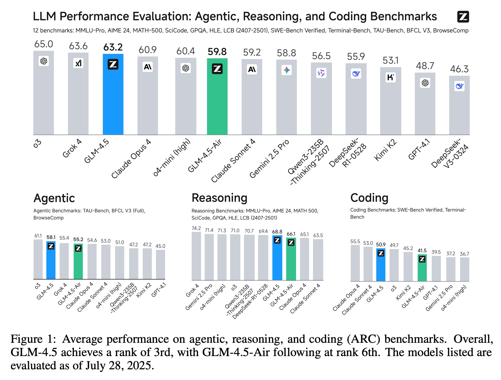
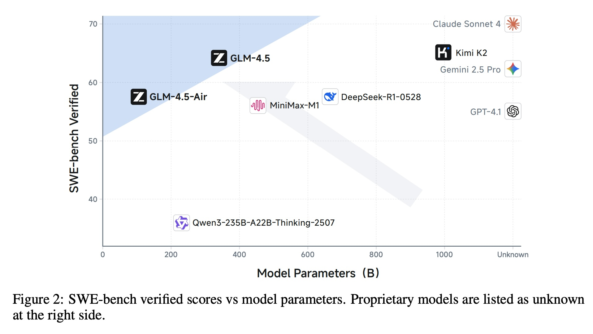
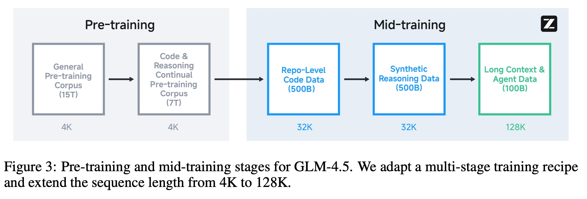

## AI论文解读 | GLM-4.5: Agentic, Reasoning, and Coding (ARC) Foundation Models
        
### 作者        
digoal        
        
### 日期        
2025-09-14        
        
### 标签        
PostgreSQL , PolarDB , DuckDB , AI , 论文解读        
        
----        
        
## 背景  
      
https://arxiv.org/pdf/2508.06471        
  
提示:          
```          
读懂《GLM-4.5: Agentic, Reasoning, and Coding (ARC) Foundation Models》这篇论文需要提前掌握哪些基础知识, 请使用中文通熟易懂的讲解这些基础知识, 可以引用论文中的图、表或使用Markdown支持的图形(text,mermaid等)增加解释性. 
  
使用中文通熟易懂的解读《GLM-4.5: Agentic, Reasoning, and Coding (ARC) Foundation Models》这篇论文, 其中的关键内容请着重讲解, 可以引用论文中的图、表或使用Markdown支持的图形(text,mermaid等)增加解释性. 
  
提取《GLM-4.5: Agentic, Reasoning, and Coding (ARC) Foundation Models》这篇论文中的重要术语, 使用中文对这些术语进行通熟易懂的讲解, 可以引用论文中的图、表或使用Markdown支持的图形(text,mermaid等)增加解释性. 
```     
  
## 1 前置知识 
  
阅读《GLM-4.5: Agentic, Reasoning, and Coding (ARC) Foundation Models》这篇论文，您需要了解一些关键的AI模型概念和训练方法。这篇论文的核心在于介绍一个名为GLM-4.5的新模型，以及它如何通过创新的架构和训练方法，在 **Agentic（智能体）、Reasoning（推理）** 和 **Coding（编程）** 这三大核心能力上取得突破。

以下是理解这篇论文所需掌握的基础知识，我将用通俗易懂的语言为您解释。

### 1. 大语言模型（LLM）架构
该论文的**GLM-4.5**模型采用了 **MoE（Mixture-of-Experts，专家混合）** 架构 。

* **什么是MoE？** 想象一个问题解决团队，每个成员都是某个领域的“专家”。当一个新任务到来时，团队经理（路由器）会快速评估任务，并将它分配给最擅长解决这类问题的专家。MoE模型的工作原理类似：它由多个“专家”网络组成，每个网络都擅长处理特定类型的数据或任务。对于输入的每个信息（token），一个小型网络（路由器）会选择性地激活一个或几个最相关的专家来处理它，而不是像传统模型那样激活所有参数。
* **MoE的优势：** 这种架构能够让模型在拥有海量总参数的同时，每次只激活一小部分参数，从而显著提高训练和推理的计算效率 。这使得GLM-4.5模型能够在参数量远小于竞争对手的情况下，仍能取得强大的性能 。

论文中提到，GLM-4.5和GLM-4.5-Air在架构上采用了MoE层、Grouped-Query Attention（分组查询注意力）和QK-Norm等技术，以增强模型的推理能力和稳定性 。

---

### 2. 多阶段训练方法
论文的核心创新之一是其 **多阶段训练（multi-stage training）** 方法 。

* **阶段一：预训练（Pre-training）**
    * 这个阶段类似于给模型进行“基础教育”。GLM-4.5模型在海量的通用文档、网页、社交媒体、书籍和代码库等数据上进行训练 。
    * 为了提高数据质量，他们对数据进行了细致的筛选和去重，例如根据质量得分对网页进行分桶，并重点使用高质量的数据进行训练 。
    * 在预训练阶段，模型重点学习语言的基本模式、世界知识和代码常识。

* **阶段二：中期训练（Mid-training）**
    * 这个阶段是模型的“专业进修”。在完成基础预训练后，模型会使用一些**特定领域的中等规模数据集**进行训练，以进一步提升其在特定应用领域的能力 。
    * **代码训练：** 通过将同一代码库中的多个文件拼接起来，模型学习文件间的依赖关系，增强其软件工程能力 。
    * **推理数据训练：** 使用人工合成的推理数据（如数学、科学和编程竞赛问题）来进一步增强模型的推理能力 。
    * **长文本与智能体训练：** 模型的上下文长度从4K扩展到128K，并加入大规模的合成智能体轨迹数据，以提升其长文本理解和智能体能力 。

---

### 3. 后期训练（Post-Training）
论文将后期训练分为两个主要阶段：**专家训练（Expert Training）**和**统一训练（Unified Training）** 。

* **监督微调（Supervised Fine-Tuning, SFT）：** 这是训练的起点。首先用高质量的人工标注数据对模型进行微调，让模型具备基本的聊天、推理和工具使用能力 。
* **强化学习（Reinforcement Learning, RL）：** 这是提升模型能力的关键。
    * **推理RL（Reasoning RL）：** 专注于提升模型在需要逻辑推理、结构化问题解决和可验证准确性任务上的能力，如数学和代码生成 。
    * **智能体RL（Agentic RL）：** 专门针对智能体任务进行训练，如网页搜索和代码生成智能体 。因为这些任务的结果可以被自动验证，所以可以提供密集且可靠的奖励信号，有效提升模型性能 。
    * **通用RL（General RL）：** 旨在全面提升模型的整体性能，通过融合基于规则、人类反馈（RLHF）和模型反馈（RLAIF）的多种奖励信号来实现 。

论文中还介绍了一种**混合推理模式（hybrid reasoning modes）**，即**思考模式（thinking mode）**和**直接响应模式（non-thinking mode）** 。在处理复杂问题时，模型会进入思考模式，逐步分解问题；而在简单的聊天或快速问答场景中，则会直接给出响应。

### 4. 核心能力（ARC）
论文的核心是围绕GLM-4.5模型在 **ARC（Agentic, Reasoning, and Coding）** 这三种能力上的表现进行评估。

* **Agentic（智能体）能力：** 模型与外部工具和真实世界交互的能力 。例如，调用工具API来查询天气、进行网页浏览等 。
* **Reasoning（推理）能力：** 解决多步骤问题的能力，尤其是在数学和科学等领域 。论文中提及在**MMLU-Pro、AIME 24、MATH 500**等多个推理基准上进行了评估 。
* **Coding（编程）能力：** 解决实际软件工程任务的能力 。论文使用了**SWE-bench Verified**和**Terminal-Bench**等基准来衡量模型的编程能力 。

您可以在论文首页的图1中看到GLM-4.5在这些基准上的表现概览。   

---

### 总结
要读懂这篇论文，您无需成为每个领域的专家，但了解以下概念会大有帮助：
* **大语言模型（LLM）** 的基本概念和**Transformer**架构。
* **MoE架构** 的工作原理，以及它在提高模型效率上的优势。
* **多阶段训练** 的基本流程，包括预训练、中期训练和后期训练（微调和强化学习）。
* **Agentic、Reasoning和Coding** 这三大核心能力的定义和区别。

有了这些基础知识，您就可以更好地理解论文中介绍的GLM-4.5模型是如何通过其独特的架构和训练方法，成为一个在多领域都表现出色的基础模型。
  
## 2 解读论文 
  
好的，我们来一起用通俗易懂的方式解读《GLM-4.5：一个在智能体、推理和编码（ARC）方面都很强的基础模型》这篇重要的AI论文。

这篇论文介绍了由 Zhipu AI 和清华大学联合推出的两个新模型：**GLM-4.5** 和其轻量版 **GLM-4.5-Air**。它们旨在成为能够像人一样思考、使用工具并编写代码的“通才”型AI。

### **核心看点：GLM-4.5 强在哪里？**

简单来说，GLM-4.5 的目标是打造一个在三个关键能力上都达到顶尖水平的开源模型：

1.  **智能体（Agentic）能力**：像一个智能助手，能理解你的指令，并自主调用外部工具（如天气查询、网络搜索）来完成复杂任务。
2.  **推理（Reasoning）能力**：像一个学霸，擅长解决需要多步骤逻辑思考的难题，比如数学题和科学问题。
3.  **编码（Coding）能力**：像一个资深程序员，能理解并解决真实的软件工程问题。

论文开篇的图表就非常直观地展示了 GLM-4.5 的强大实力。

  

图1: 各大模型在智能体、推理、编码（ARC）三大能力维度的平均表现 

从上图可以看出，在综合了12个不同基准测试的“总成绩”上，GLM-4.5 在所有参与评测的模型中**排名第三** ，而其轻量版的 GLM-4.5-Air 也取得了第六名的好成绩 。特别是在“智能体”能力上，GLM-4.5 **高居第二** ，仅次于 OpenAI 的 o3 模型 。这充分证明了 GLM-4.5 在模型“行动力”方面的领先地位。

### **揭秘 GLM-4.5 的三大技术法宝**

GLM-4.5 之所以如此强大，离不开其架构和训练方法上的创新。

#### **1. 更聪明的“大脑结构”：混合专家模型 (MoE)**

传统的AI模型像是一个知识渊博但只有一个大脑的专家。而 GLM-4.5 采用了**混合专家（Mixture-of-Experts, MoE）架构** ，你可以把它想象成一个拥有多个“专家大脑”的团队。

  * **工作原理**：当一个任务进来时，系统会根据任务的类型，激活一部分最相关的“专家大脑”来协同工作 。
  * **优势**：
      * **效率高**：不需要每次都动用整个庞大的模型，只激活部分参数，既省算力又提速 。
      * **能力强**：每个专家可以专注于特定领域，组合起来就能应对更复杂、更多样化的任务。

GLM-4.5 拥有 3550 亿的总参数量，但在处理任务时，一次只激活其中的 320 亿 。这种“集中优势兵力”的策略，让它在保持强大能力的同时，也兼顾了效率。

#### **2. “学霸”的养成之路：多阶段精细化训练**

一个强大的模型不是一蹴而就的，而是经历了一套精心设计的“教育”流程。GLM-4.5 的训练过程可以分为三个主要阶段，如下图所示：

  

图2: GLM-4.5 的预训练和中期训练流程  

  * **第一阶段：预训练 (Pre-training)** 

      * **通识教育 (15T tokens)**：首先用 15 万亿的通用文本数据（网页、书籍等）进行基础学习，让模型掌握广泛的世界知识 。
      * **专项加强 (7T tokens)**：然后，加大对代码、数学和科学等专业领域数据的学习比例，强化其推理和编码的“理科思维” 。

  * **第二阶段：中期训练 (Mid-training)** 

      * **项目级代码学习 (500B tokens)**：学习整个代码仓库的数据，理解代码文件之间的关联，提升解决实际软件工程问题的能力 。
      * **合成推理数据训练 (500B tokens)**：利用现有模型生成大量的数学、科学竞赛等推理题及其解题过程，进行高强度“刷题”训练 。
      * **长文本与智能体训练 (100B tokens)**：学习长篇文章和大量的智能体行为轨迹数据，让模型能处理更长的信息，并学会如何使用工具 。

  * **第三阶段：后训练 (Post-training) - 专家迭代与对齐** 

      * **培养“偏科生”**：先分别训练出在**推理、智能体、通用对话**三个领域的“专家模型” 。
      * **“偏科生”教“全才生”**：再通过自我蒸馏技术，将这些专家模型的能力精华整合到一个统一的模型中 。
      * **强化学习**：利用人类反馈和模型反馈进行强化学习（RLHF & RLAIF），让模型更懂人类的意图，回答更精准、更安全 。

值得一提的是，GLM-4.5 还具备**混合推理模式** 。对于复杂问题，它会像人一样进行“深度思考”（Thinking Mode），生成详细的思考过程；对于简单问题，则能“脱口而出”（Non-thinking Mode），快速给出答案 。

#### **3. 更好用的“工具箱”：创新的函数调用模板**

在智能体能力中，“函数调用”是核心。过去，模型在调用包含代码的工具时，需要生成大量转义字符，这增加了学习负担 。

GLM-4.5 设计了一种**新的基于 XML 标签的函数调用模板** 。

```xml
<tool_call>get_weather  <arg_key>city</arg_key>
  <arg_value>Beijing</arg_value>  <arg_key>date</arg_key>
  <arg_value>2024-06-27</arg_value>
</tool_call>
```

*示例: 一个调用天气查询函数的模板* 

这种方式**大大减少了不必要的转义** ，让模型能更专注于任务本身，提高了函数调用的稳定性和效率。

### **GLM-4.5 在各项评测中的具体表现**

除了总分亮眼，GLM-4.5 在各个分项上也有出色的表现。

  * **智能体能力 (Agentic)**

      * 在模拟真实世界工具交互的 TAU-Bench 测试中，其表现与 Claude Sonnet 4 相当，优于 Gemini 2.5 Pro 。
      * 在衡量函数调用能力的 BFCL V3 测试中，GLM-4.5 在所有基线模型中取得了**最高分** 。

  * **推理能力 (Reasoning)**

      * 在极具挑战性的数学竞赛基准 AIME 24 上，得分 **91.0%** ，超过了 OpenAI o3 。
      * 在科学编码基准 SciCode 上的表现也同样优于 o3 。

  * **编码能力 (Coding)**

      * 在衡量解决真实世界 GitHub issue 能力的 SWE-bench Verified 测试中，得分 **64.2%** ，显著优于 GPT-4.1 和 Gemini 2.5 Pro 。
      * 下面的图表演示了不同模型在 SWE-bench 上的表现与其参数量的关系，GLM-4.5 和 GLM-4.5-Air 处于**帕累托前沿**，意味着在同等参数规模下，它们的编码性能是顶尖的 。

  

图3: SWE-bench Verified 得分 vs. 模型参数量  

### **总结**

《GLM-4.5: Agentic, Reasoning, and Coding (ARC) Foundation Models》这篇论文不仅推出了一个在智能体、推理、编码三大核心能力上表现卓越的开源模型，更重要的是，它详细阐述了打造这样一个“通才”模型的方法论。

通过**高效的 MoE 架构**、**精细的多阶段训练流程**以及**持续的专家迭代与强化学习**，GLM-4.5 在性能上达到了与顶尖闭源模型相媲美的水平，同时保持了开源，这对推动整个AI领域的研究和应用发展具有重要意义 。它证明了，一个全面发展的“通才”模型，是实现更高级别人工智能的关键一步。
  
## 3 术语 
  
好的，根据《GLM-4.5: Agentic, Reasoning, and Coding (ARC) Foundation Models》这篇论文，我为您整理并用通俗易懂的语言解释了其中的重要术语。

---

### 1. MoE（Mixture-of-Experts，专家混合）
**什么是MoE？**
你可以把MoE想象成一个大型的“知识团队”，团队里有许多不同领域的“专家”（Expert）。当一个问题进来时，一个叫做“路由器”（Router）的程序会迅速判断这个问题属于哪个领域，然后把问题交给最擅长解决它的那个专家。这样，模型就只用激活其中一小部分参数，而不是像传统模型那样激活所有参数。

* **论文中的应用：** GLM-4.5采用了MoE架构，总参数量高达355B（3550亿），但每次处理任务时只激活32B（320亿）参数。这使得它在保持强大能力的同时，显著提高了训练和推理的效率。

### 2. ARC（Agentic, Reasoning, and Coding）
**什么是ARC？**
这是论文用来衡量GLM-4.5三大核心能力的缩写：
* **Agentic（智能体）能力：** 衡量模型与外部世界交互的能力。例如，它能否像一个智能助手一样，调用工具（如搜索工具、日历应用）来完成复杂任务。
* **Reasoning（推理）能力：** 衡量模型解决需要逻辑思考和多步骤推理问题的能力，比如数学题、科学问题、以及需要严密逻辑的语言任务。
* **Coding（编程）能力：** 衡量模型在编程和软件开发方面的能力，包括生成、理解、修改代码，甚至解决真实世界的软件工程问题。

---

### 3. 多阶段训练（Multi-stage Training）
**什么是多阶段训练？**
这是一种分步培养模型的方法，就像学生的教育过程一样。
1.  **预训练（Pre-training）：** 类似于“基础教育”。模型在海量的通用数据（如网页、书籍、代码）上学习语言的基本规律和世界知识。
2.  **中期训练（Mid-training）：** 类似于“专业进修”。在通用预训练后，模型会使用特定领域的数据集进行训练，比如专门的数学推理数据、高质量的代码库和长文本数据，以强化其特定能力。
3.  **后期训练（Post-training）：** 类似于“实践与毕业”。这一阶段包括**监督微调（SFT）**和**强化学习（RL）**，让模型学习如何更好地与人类互动、遵循指令，并解决复杂任务。

### 4. 混合推理模式（Hybrid Reasoning Method）
**什么是混合推理模式？**
这是GLM-4.5处理问题的一种新策略，结合了两种不同的思考方式：
* **思考模式（Thinking Mode）：** 当模型遇到需要复杂逻辑或多步骤才能解决的问题时，它会进入这个模式。模型会像人一样，先在“脑海”中进行推理，逐步分解问题，最终得出答案。
* **直接响应模式（Non-thinking Mode）：** 对于简单的问答或聊天，模型会像一个聊天机器人一样，不经过复杂的思考过程，直接给出简洁快速的答案。

这种模式的切换能让模型在保证准确性的同时，也兼顾了响应速度。

### 5. 关键基准测试（Benchmarks）
**什么是基准测试？**
你可以把基准测试想象成一场“考试”，用来客观地评估模型的各项能力。论文中提到了几个关键的基准，这些是证明GLM-4.5强大的“成绩单”。

* **TAU-Bench：** 这是一个专门测试模型智能体（Agentic）能力的基准。论文中，GLM-4.5在这个基准上获得了70.1%的分数，排名第二，这表明其在与工具和外部环境交互方面的能力非常出色。
* **AIME 24：** 这是一个专门测试模型推理（Reasoning）能力的基准，尤其是数学和科学领域的推理。GLM-4.5在这个基准上取得了91.0%的高分。
* **SWE-bench Verified：** 这是一个衡量模型编程（Coding）能力的基准，主要考察模型修复真实世界软件错误的能力。GLM-4.5在这个基准上获得了64.2%的分数。

这些基准测试分数共同构成了GLM-4.5在ARC三大能力上的综合表现。
  
## 参考        
         
https://arxiv.org/pdf/2508.06471    
        
<b> 以上内容基于DeepSeek、Qwen、Gemini及诸多AI生成, 轻微人工调整, 感谢杭州深度求索人工智能、阿里云、Google等公司. </b>        
        
<b> AI 生成的内容请自行辨别正确性, 当然也多了些许踩坑的乐趣, 毕竟冒险是每个男人的天性.  </b>        
  
    
#### [期望 PostgreSQL|开源PolarDB 增加什么功能?](https://github.com/digoal/blog/issues/76 "269ac3d1c492e938c0191101c7238216")
  
  
#### [PolarDB 开源数据库](https://openpolardb.com/home "57258f76c37864c6e6d23383d05714ea")
  
  
#### [PolarDB 学习图谱](https://www.aliyun.com/database/openpolardb/activity "8642f60e04ed0c814bf9cb9677976bd4")
  
  
#### [PostgreSQL 解决方案集合](../201706/20170601_02.md "40cff096e9ed7122c512b35d8561d9c8")
  
  
#### [德哥 / digoal's Github - 公益是一辈子的事.](https://github.com/digoal/blog/blob/master/README.md "22709685feb7cab07d30f30387f0a9ae")
  
  
#### [About 德哥](https://github.com/digoal/blog/blob/master/me/readme.md "a37735981e7704886ffd590565582dd0")
  
  

  
