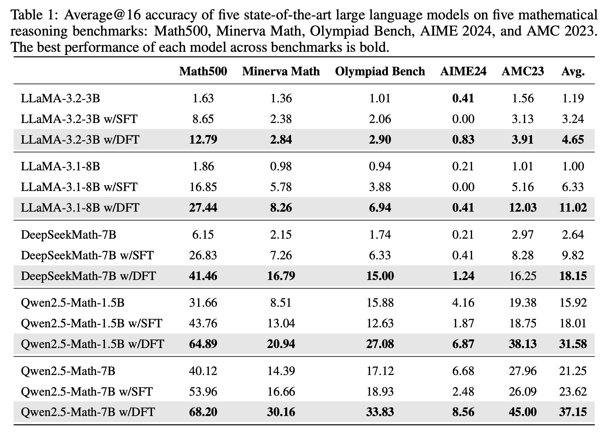
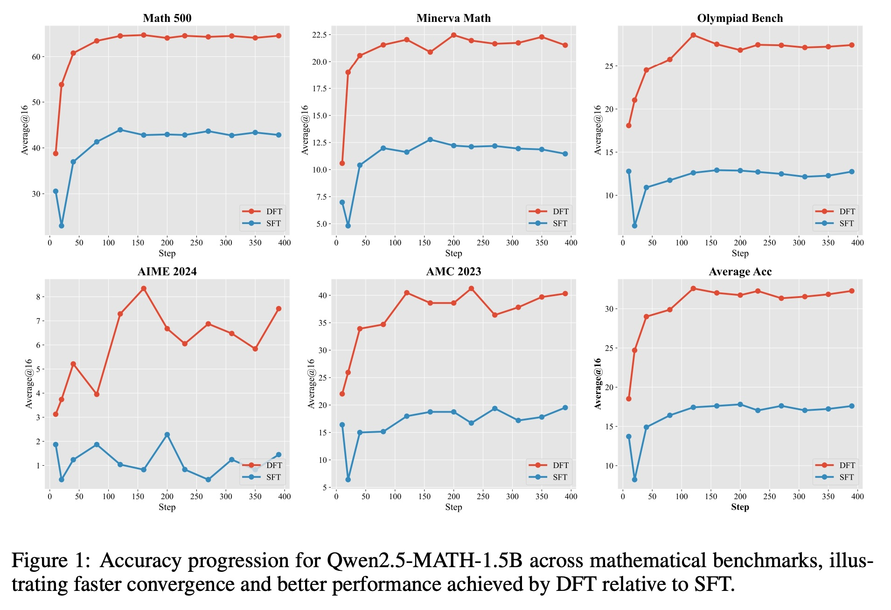
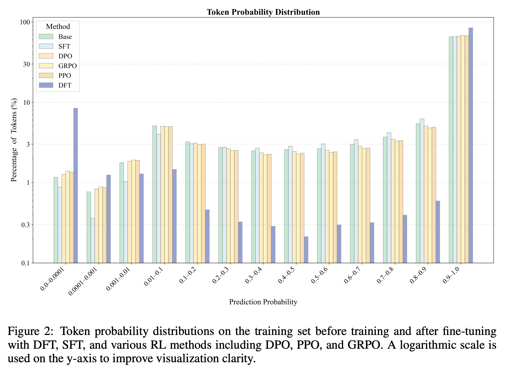
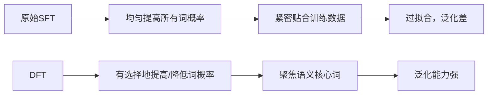
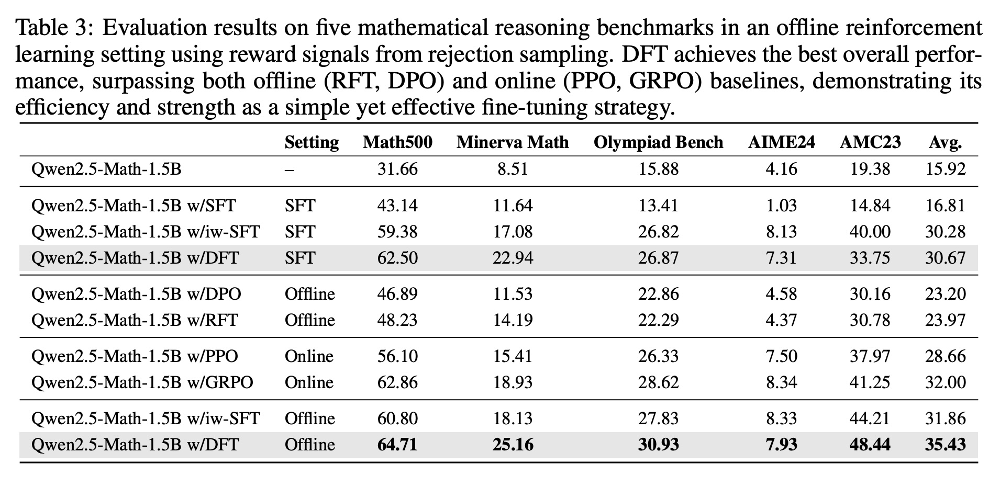
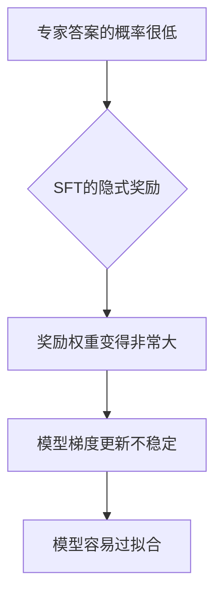

## AI论文解读 | ON THE GENERALIZATION OF SFT: A REINFORCEMENT LEARNING PERSPECTIVE WITH REWARD RECTIFICATION
        
### 作者        
digoal        
        
### 日期        
2025-09-14        
        
### 标签        
PostgreSQL , PolarDB , DuckDB , AI , 论文解读        
        
----        
        
## 背景  
      
https://arxiv.org/pdf/2508.05629        
  
提示:          
```          
读懂《ON THE GENERALIZATION OF SFT: A REINFORCEMENT LEARNING PERSPECTIVE WITH REWARD RECTIFICATION》这篇论文需要提前掌握哪些基础知识, 请使用中文通熟易懂的讲解这些基础知识, 可以引用论文中的图、表或使用Markdown支持的图形(text,mermaid等)增加解释性. 
  
使用中文通熟易懂的解读《ON THE GENERALIZATION OF SFT: A REINFORCEMENT LEARNING PERSPECTIVE WITH REWARD RECTIFICATION》这篇论文, 其中的关键内容请着重讲解, 可以引用论文中的图、表或使用Markdown支持的图形(text,mermaid等)增加解释性. 
  
提取《ON THE GENERALIZATION OF SFT: A REINFORCEMENT LEARNING PERSPECTIVE WITH REWARD RECTIFICATION》这篇论文中的重要术语, 使用中文对这些术语进行通熟易懂的讲解, 可以引用论文中的图、表或使用Markdown支持的图形(text,mermaid等)增加解释性. 
```     
  
## 1 前置知识 
  
在深入理解《ON THE GENERALIZATION OF SFT: A REINFORCEMENT LEARNING PERSPECTIVE WITH REWARD RECTIFICATION》这篇论文之前，需要掌握以下几个关键的基础知识。这篇论文的核心思想是将 **监督微调（SFT）** 从 **强化学习（RL）** 的角度进行重新审视，并提出改进方法。因此，理解SFT和RL各自的原理以及它们之间的联系至关重要。

---

### 1. 监督微调（SFT）

**SFT**，也称为行为克隆（Behavioral Cloning），是一种在专家演示数据集上训练大语言模型（LLM）的常见方法 。它的核心思想是让模型通过学习大量的“输入-专家输出”配对，来模仿专家的行为 。

这篇论文指出，SFT的优化目标是最小化**交叉熵损失（Cross-Entropy Loss）**。交叉熵衡量了模型预测的概率分布与真实专家答案的概率分布之间的差异。在SFT中，模型的目标是最大化专家答案的概率，使得训练数据中的每一个Token都尽可能地被模型预测出来。

SFT的优点在于实现简单、训练快速，能够让模型迅速学会专家的行为模式 。然而，它的主要缺点是泛化能力有限，容易出现过拟合 。

### 2. 强化学习（RL）

**RL**是一种让智能体在特定环境中通过**试错**来学习最优策略的方法 。在LLM的背景下，智能体（模型）会根据给定的提示（Prompt）生成响应（Response），然后根据这个响应获得一个**奖励信号（Reward Signal）**。模型的目标是通过不断调整生成策略来最大化累积奖励。

论文中提到，RL的优化目标是最大化预期的奖励 。其核心是 **策略梯度（Policy Gradient）** 方法，通过梯度上升来更新模型参数，使得高奖励的动作（即生成高奖励的Token）被采纳的概率更高 。

相较于SFT，RL的泛化能力通常更强，因为它通过奖励信号来探索和发现更稳健的策略，而不是单纯地模仿训练数据 。但是，RL也存在一些挑战，例如计算资源需求高、超参数敏感，并且需要有可用的奖励信号 。

---

### 3. SFT与RL的统一视角

这篇论文最核心的理论贡献，是将SFT的梯度更新从数学上重新解释为一种特殊的策略梯度方法 。

论文指出，SFT的梯度可以被看作是带有特定 **隐式奖励（Implicit Reward）** 的策略梯度 。这个隐式奖励有两个主要问题 ：

1.  **稀疏性（Sparsity）**：只有当模型生成的整个响应与专家答案完全匹配时，奖励才非零 。这就像只给满分的学生发奖，而忽略了答对大部分题目的学生。
2.  **与概率成反比（Inversely Proportional to Probability）**：这个隐式奖励与模型对专家答案的概率成反比 。这意味着，当模型对某个专家答案的预测概率很低时，它的梯度更新权重就会变得非常大，导致 **梯度方差无限大（unbounded variance）** 和不稳定的优化过程 。

为了直观地理解这一点，可以想象如下一个简化示例：

* **SFT的梯度更新**：`梯度 = - 梯度(log(模型概率)) * 1`
* **等效的RL梯度**：`梯度 = 梯度(log(模型概率)) * 奖励 * 权重`
    * 这里的**奖励**是稀疏的：如果预测与专家答案完全匹配，奖励为1，否则为0 。
    * 这里的**权重**是`1 / 模型概率` 。

由于这个`1 / 模型概率`的权重，如果模型对一个专家答案的概率很低（例如0.001），那么对应的梯度权重就会变得非常大（1000），这会使得优化过程非常不稳定，并且倾向于过拟合那些罕见的、低概率的训练样本 。

### 4. 论文提出的改进方法：动态微调（DFT）

基于上述分析，论文提出了 **动态微调（DFT）** 作为SFT的一种改进方法 。

DFT的核心思想非常简单，就是通过动态地乘以Token的概率来 **抵消** 掉SFT梯度中那个不稳定的**反向概率权重** 。

* **DFT的交叉熵损失**： $L_{DFT}(\theta) = E[sg(\pi_{\theta}(y_t^*|y_{<t}^*,x)) \cdot log \pi_{\theta}(y_t^*|y_{<t}^*,x)]$ 
* 其中， $sg(\cdot)$ 是 **停止梯度（Stop-Gradient）** 操作，确保梯度不会反向传播到概率权重项 。

通过这个修正，DFT有效地将梯度更新中的**隐式奖励**变成了一个**均匀的常数1** 。这样，模型在训练时就不会过度关注那些“难学”的低概率样本，而是对所有专家路径给予相同的奖励信号，从而实现了更稳定的训练和更好的泛化能力 。

**总结来说，理解这篇论文需要掌握以下三点：**

* **SFT是什么？** 它是一种基于交叉熵的模仿学习方法。
* **SFT为什么泛化能力差？** 论文从RL角度给出了新的解释：SFT的梯度等价于一种带有稀疏且方差巨大的隐式奖励的策略梯度。
* **DFT如何改进？** DFT通过简单地乘以模型概率来消除这个不稳定的权重，使得训练更加稳定，泛化能力更强。
  
## 2 解读论文 
  
好的，我们来用通俗易懂的中文解读一下这篇论文《ON THE GENERALIZATION OF SFT: A REINFORCEMENT LEARNING PERSPECTIVE WITH REWARD RECTIFICATION》。

这篇论文的核心思想非常巧妙：它发现我们常用的“监督微调”（SFT）方法，其实暗地里藏着一个“坏掉的奖励机制”，这导致模型学得太死板，容易过拟合。为了解决这个问题，作者提出了一个极其简单的改进方法——“动态微调”（DFT），只需要改一行代码，就能让模型学得更灵活、泛化能力更强。

---

### **1. 问题：SFT 为什么学得“死板”？**

想象一下，你是一个学生，老师（SFT）教你解数学题的方法是：**一字不差地背诵标准答案**。

*   **SFT 的做法**：给你一堆标准答案（专家示范），让你的模型（学生）去模仿，目标是让模型输出每个字、每个词的概率都尽可能高，最终和标准答案一模一样。
*   **RL 的做法**：给你一个评分标准（奖励函数），比如“步骤对了给分，答案对了给高分”。模型可以尝试不同的解题思路，只要最后能得高分就行，不一定要和老师的解法完全一样。

大家普遍发现，RL 训练出来的模型泛化能力更好，因为它在“探索”，而 SFT 训练的模型容易“死记硬背”。

**这篇论文的洞见是：SFT 其实也是一种 RL！但它用了一个非常“病态”的奖励机制。**

论文通过数学推导（第3.2节）证明，SFT 的梯度更新，等价于一个强化学习的策略梯度，其“奖励” `r(x, y)` 是这样的：
*   **奖励是什么？** 只有当模型生成的整个句子 `y` 和标准答案 `y⋆` **完全一模一样**时，才给奖励 `1`，否则奖励是 `0`。这已经非常苛刻了。
*   **更致命的“加权”**：这个奖励还要乘以一个权重 `w(y|x) = 1 / πθ(y|x)`。`πθ(y|x)` 是模型自己认为这个答案正确的概率。

**通俗解释这个“病态”奖励：**
假设老师（SFT）给学生的奖励规则是：
> “只有你写的答案和标准答案**一字不差**才算对！而且，**你越没信心（概率越低）的题目，一旦蒙对了，给你的奖励就越大！**”

这会导致什么后果？
1.  **奖励极其稀疏**：模型必须生成完全正确的完整答案才能得到奖励，这太难了。
2.  **奖励方差爆炸**：对于一个模型觉得很难（概率很低）的题目，如果它碰巧做对了，会得到一个巨大的奖励。这会让模型的训练过程变得非常不稳定，就像赌博一样。
3.  **鼓励“死记硬背”**：模型为了拿到这个巨大的奖励，会拼命去记住那些它觉得很难、但在训练集中出现过的特定答案，而不是去理解通用的解题方法。这就是**过拟合**。

论文中公式 (6) 清晰地表达了这一点：
`∇θLSFT(θ) = -E[ (1/πθ(y|x)) * ∇θ log πθ(y|x) * 1[y=y⋆] ]`
这个 `(1/πθ(y|x))` 就是罪魁祸首。

---

### **2. 解决方案：动态微调 (DFT)**

既然问题出在那个“`1/πθ`”的权重上，那最直接的解决办法就是——**把它干掉！**

DFT 的核心思想就是：**在计算损失时，给每个词的损失乘以模型自己预测这个词的概率。**

*   **原始 SFT 损失 (Cross-Entropy):** `-log(p)`。模型预测概率 `p` 越低，损失越大，惩罚越重。
*   **DFT 损失:** `-p * log(p)`。模型预测概率 `p` 越低，`p * log(p)` 这一项的绝对值也越小（因为 `p` 很小），所以惩罚反而变轻了！

**通俗解释 DFT 的“奖励规则”：**
> “只要你写的答案和标准答案**一字不差**就算对！但是，**你越没信心（概率越低）的题目，我给你的奖励就越小；你越有信心（概率越高）的题目，我给你的奖励才越大。**”

这听起来好像反直觉？为什么要奖励“有信心”的，而不是奖励“突破自我”的呢？

**关键在于“泛化”**：
DFT 的做法实际上是**稳定了训练过程**。它不再鼓励模型去赌那些低概率、高风险的“蒙对”事件，而是引导模型**稳健地、逐步地**提高它对所有正确答案的信心。这避免了模型为了追求偶尔的巨大奖励而走上过拟合的歧途。

论文中的公式 (9) 给出了最终的 DFT 损失函数：
`LDFT(θ) = E[ -Σ sg(πθ(yt⋆|y<t⋆, x)) * log πθ(yt⋆|y<t⋆, x) ]`
这里 `sg` 是“停止梯度”操作，意思是只用概率值做权重，不参与梯度计算。实际代码改动可能就一行，把原来的 `loss = -log_prob` 改成 `loss = -prob.detach() * log_prob`。

---

### **3. 效果：DFT 到底有多强？**

论文的实验结果非常震撼，尤其是在数学推理这种需要强泛化能力的任务上。

#### **3.1 在标准 SFT 场景下的表现**

论文在多个数学基准测试（如奥赛题 Olympiad Bench、AIME 2024）上测试了不同大小的模型（从1.5B到8B）。

*   **表1 是核心结果**。我们看一个最典型的例子：**Qwen2.5-Math-1.5B** 模型。    
    *   **基础模型** 在奥赛题上的准确率是 **15.88%**。
    *   用 **标准 SFT** 微调后，准确率**下降**到 **12.63%**！这说明 SFT 在这种难题上严重过拟合，把模型“教笨”了。
    *   用 **DFT** 微调后，准确率**飙升**到 **27.08%**！这是一个巨大的提升。

    再看 **AMC 2023** 数据集：
    *   基础模型: 19.38%
    *   SFT: 18.75% (轻微下降)
    *   DFT: 38.13% (几乎翻倍！)

    这个模式在其他模型（LLaMA, DeepSeek）上也一致出现。DFT 的平均提升幅度是 SFT 的 **1.5倍到5.9倍**！

*   **图1 展示了学习效率**。DFT 不仅最终效果好，而且**学得更快**！在训练早期（前10-20步），DFT 的性能就已经超过了 SFT 最终能达到的最好水平。这意味着 DFT 的梯度更新更“聪明”、更有效。   

#### **3.2 一个有趣的发现：DFT 改变了什么？**

论文的 **图2** 非常有意思，它展示了模型在训练后，其输出的词的概率分布发生了什么变化。   

*   **SFT**：像一个“平均主义者”。它会努力把所有词的概率都往上拉，让模型对每个词都更“自信”。结果就是模型被“拉”得紧紧贴住训练数据。
*   **DFT (以及PPO等RL方法)**：像一个“战略家”。它会**有选择地**提高一些重要词的概率，同时**主动降低**另一些词的概率。这形成了一个“双峰”分布（一些词概率极高，一些词概率极低）。

**论文发现，那些被 DFT 降低概率的词，往往是“the”, “let”, “,”, “.” 这类连接词或标点。**

**这非常符合直觉！** 在数学解题中，核心是定理、公式、数字这些**语义内容**，而不是“the”、“let”这些**语法功能词**。DFT 让模型学会“抓大放小”，把精力集中在真正重要的内容上，这正是泛化能力强的表现。就像老师不会要求学生把“解：”字写得多么完美，而是关注后面的解题步骤。



#### **3.3 甚至在强化学习场景下也有效！**

论文还做了一个更惊人的实验：在有奖励信号的“离线强化学习”场景下，DFT 的表现竟然超过了专业的 RL 算法（如 DPO, PPO, GRPO）！

*   **表3** 显示，在 Qwen2.5-Math-1.5B 模型上，DFT 的平均得分是 **35.43**，而最强的在线 RL 算法 GRPO 是 **32.00**，DFT 反而更高！    

这说明 DFT 不仅仅是一个“SFT 的补丁”，它本身就是一个非常强大且高效的训练范式。它不需要复杂的奖励建模、采样过程或参考模型，实现起来极其简单，但效果拔群。

---

### **4. 总结与意义**

这篇论文的价值在于：

1.  **深刻的理论洞见**：首次从数学上严格证明了 SFT 是一种带有“病态奖励”的 RL，并精准定位了问题根源——`1/πθ` 的逆概率加权。
2.  **极简的解决方案**：提出的 DFT 方法，只需要在损失函数上乘以一个概率权重，改动极小（“一行代码”），却效果显著。
3.  **强大的实验验证**：在多个模型、多个高难度数学基准上，DFT 都大幅超越 SFT，甚至在 RL 场景下也能力压群雄。
4.  **启发性的发现**：揭示了模型泛化的关键可能在于“有选择地学习”，而非“均匀地记忆”，这与人类的学习方式有异曲同工之妙。

总而言之，DFT 为提升大模型的泛化能力提供了一个**理论扎实、实现简单、效果卓越**的新工具，是连接监督学习与强化学习的一座非常实用的桥梁。
  
## 3 术语 
  
根据《ON THE GENERALIZATION OF SFT: A REINFORCEMENT LEARNING PERSPECTIVE WITH REWARD RECTIFICATION》这篇论文，以下是一些重要的核心术语及其通俗易懂的讲解。

-----

### 1\. 监督微调（Supervised Fine-Tuning, SFT）

**是什么？** SFT是一种最常见的训练大语言模型的方法。它就像老师教学生写作业一样，给模型大量的 **“问题-标准答案”** 配对，让模型去模仿和学习这些标准答案。

**论文中的视角：** 这篇论文把SFT看作是一种特殊的**行为克隆（Behavioral Cloning）**。模型的优化目标是最小化**交叉熵损失**，也就是让模型生成每个Token的概率尽可能接近标准答案。

### 2\. 强化学习（Reinforcement Learning, RL）

**是什么？** RL是一种让模型通过 **“试错”** 来学习的方法。模型生成一个回答后，会得到一个 **奖励信号（Reward Signal）** 。如果回答好，奖励就高；如果回答不好，奖励就低。模型的目标是学会如何获得最高的奖励。

**与SFT的区别：**

  * **SFT**：只关注模仿专家答案，没有奖励的概念，容易死记硬背。
  * **RL**：关注回答的质量（通过奖励衡量），更侧重于泛化和探索。

### 3\. 隐式奖励（Implicit Reward）

**是什么？** 这是论文的核心发现。研究人员通过数学分析发现，标准SFT的梯度更新，其实等价于一种特殊的RL策略梯度。在这个等价的RL框架中，存在一个 **“隐式奖励”** 。

**论文指出，这个“隐式奖励”存在两个严重问题：**

1.  **奖励稀疏（Sparse Reward）：** 只有当模型生成的完整回答与专家答案完全匹配时，奖励才非零。这就像老师只给满分学生发奖，而忽略了只差一点点的学生。
2.  **梯度方差无限大（Unbounded Variance）：** 最致命的是，这个隐式奖励的权重与模型对专家答案的概率**成反比**。这意味着，当模型对某个专家答案的预测概率非常低时，它的梯度更新权重就会变得非常大，导致模型训练极不稳定，并且容易对一些罕见的、低概率的训练样本过度学习，从而降低泛化能力。

我们可以用一个简单的图来理解这个不稳定的梯度：



### 4\. 奖励纠正（Reward Rectification）

**是什么？** 这是论文标题中的一个关键概念，也是其提出的解决方案。鉴于SFT的隐式奖励存在问题，论文提出要 **纠正（Rectify）** 它。

**具体方法：** 论文提出的方法非常巧妙且简单，叫做 **动态微调（Dynamic Fine-Tuning, DFT）** 。它在标准SFT的交叉熵损失函数中，简单地**乘以一个“停止梯度”操作的Token概率**。

这个操作的目的是：
**用Token的概率去抵消掉那个不稳定的、与概率成反比的权重。**

通过这种方式，SFT的“隐式奖励”被有效地**修正为一个均匀的常数1**。这意味着无论模型对专家答案的概率是高是低，它都会得到一个相同的、稳定的奖励信号。这就像老师对待所有学生一视同仁，从而使得模型的训练更加稳定，泛化能力也大大提升。

-----

### 总结：

  * **SFT**：模仿专家，但训练不稳定，泛化能力弱。
  * **论文的发现**：SFT的训练梯度等价于一种带有**稀疏且方差巨大**的**隐式奖励**的RL过程。
  * **论文的贡献**：提出了**奖励纠正**的概念，并通过 **动态微调（DFT）** 这一简单方法，修正了不稳定的隐式奖励，使得模型训练更稳定，泛化能力更强。
  
## 参考        
         
https://arxiv.org/pdf/2508.05629    
        
<b> 以上内容基于DeepSeek、Qwen、Gemini及诸多AI生成, 轻微人工调整, 感谢杭州深度求索人工智能、阿里云、Google等公司. </b>        
        
<b> AI 生成的内容请自行辨别正确性, 当然也多了些许踩坑的乐趣, 毕竟冒险是每个男人的天性.  </b>        
  
    
#### [期望 PostgreSQL|开源PolarDB 增加什么功能?](https://github.com/digoal/blog/issues/76 "269ac3d1c492e938c0191101c7238216")
  
  
#### [PolarDB 开源数据库](https://openpolardb.com/home "57258f76c37864c6e6d23383d05714ea")
  
  
#### [PolarDB 学习图谱](https://www.aliyun.com/database/openpolardb/activity "8642f60e04ed0c814bf9cb9677976bd4")
  
  
#### [PostgreSQL 解决方案集合](../201706/20170601_02.md "40cff096e9ed7122c512b35d8561d9c8")
  
  
#### [德哥 / digoal's Github - 公益是一辈子的事.](https://github.com/digoal/blog/blob/master/README.md "22709685feb7cab07d30f30387f0a9ae")
  
  
#### [About 德哥](https://github.com/digoal/blog/blob/master/me/readme.md "a37735981e7704886ffd590565582dd0")
  
  

  
