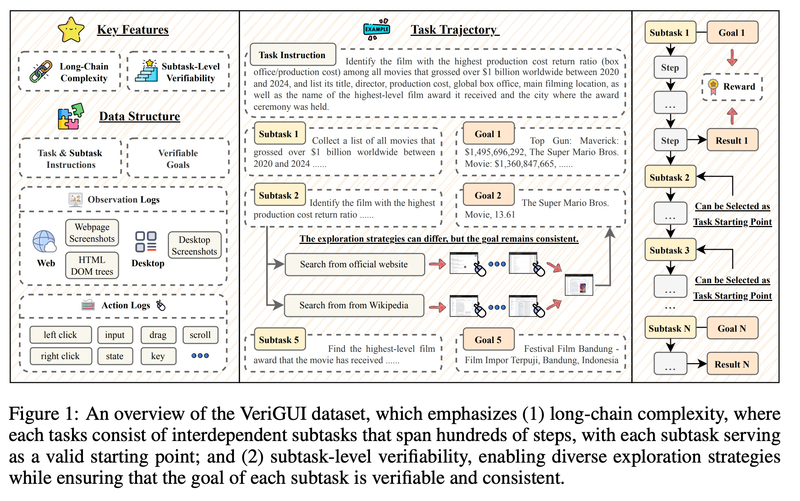
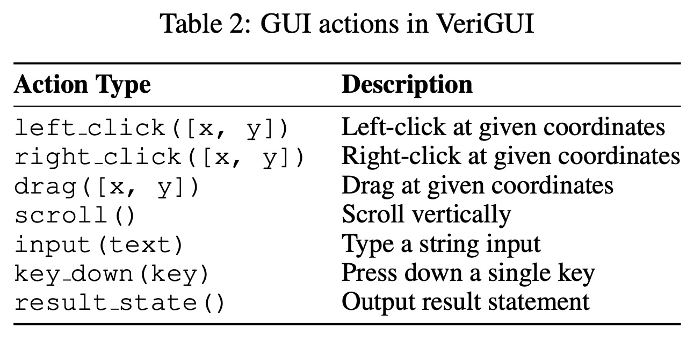
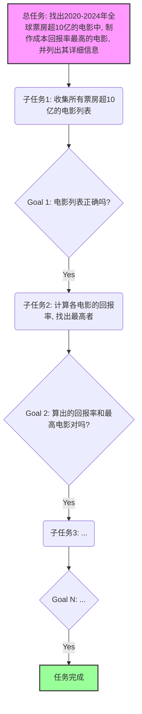
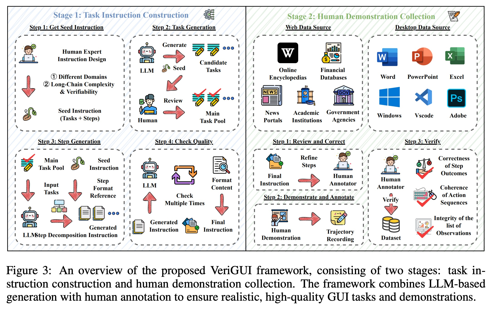
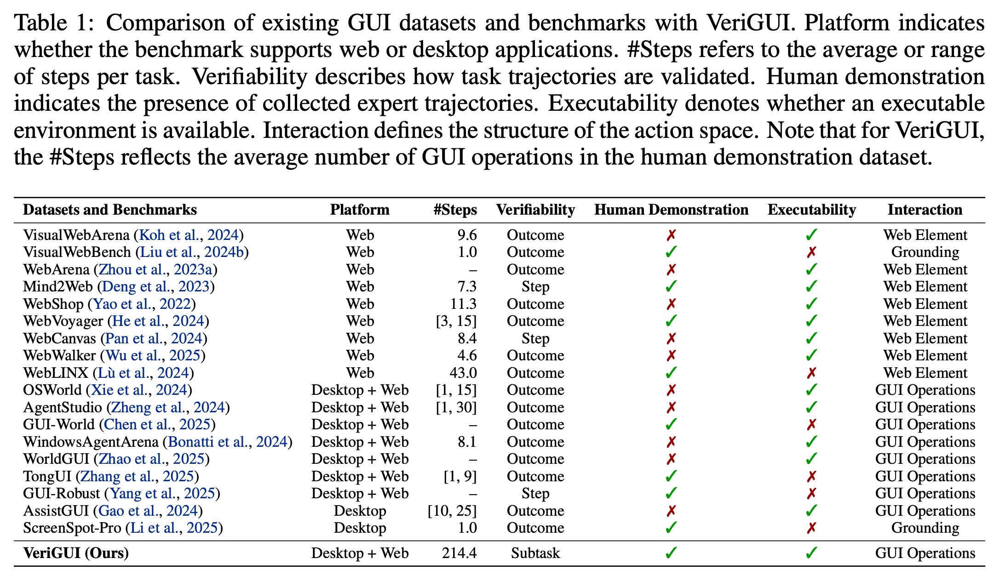
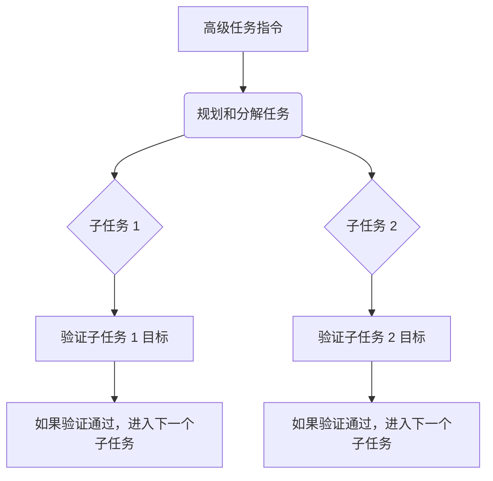

## AI论文解读 | VERIGUI: VERIFIABLE LONG-CHAIN GUI DATASET
        
### 作者        
digoal        
        
### 日期        
2025-09-14        
        
### 标签        
PostgreSQL , PolarDB , DuckDB , AI , 论文解读        
        
----        
        
## 背景  
      
https://arxiv.org/pdf/2508.04026        
  
提示:          
```          
读懂《VERIGUI: VERIFIABLE LONG-CHAIN GUI DATASET》这篇论文需要提前掌握哪些基础知识, 请使用中文通熟易懂的讲解这些基础知识, 可以引用论文中的图、表或使用Markdown支持的图形(text,mermaid等)增加解释性. 
  
使用中文通熟易懂的解读《VERIGUI: VERIFIABLE LONG-CHAIN GUI DATASET》这篇论文, 其中的关键内容请着重讲解, 可以引用论文中的图、表或使用Markdown支持的图形(text,mermaid等)增加解释性. 
  
提取《VERIGUI: VERIFIABLE LONG-CHAIN GUI DATASET》这篇论文中的重要术语, 使用中文对这些术语进行通熟易懂的讲解, 可以引用论文中的图、表或使用Markdown支持的图形(text,mermaid等)增加解释性. 
```     
  
## 1 前置知识 
  
你好！根据你上传的《VERIGUI: VERIFIABLE LONG-CHAIN GUI DATASET》这篇论文，为了更好地理解它，你需要掌握以下几个核心基础知识。这些知识是该研究领域的基础，理解它们将帮助你轻松读懂这篇论文。

---

### 1. GUI代理 (GUI Agents)

**GUI** 是指**图形用户界面**（Graphical User Interface），是我们日常使用电脑时看到的窗口、按钮、图标等。**GUI代理**是一种能够像人一样在电脑上操作界面的智能体（Agent）。它们的最终目标是根据高级指令，自主地完成复杂的计算机任务，例如浏览网页、使用办公软件或进行系统设置。

这篇论文的核心，就是为评估和开发这些GUI代理提供一个全新的、高质量的数据集。

### 2. 长链复杂性 (Long-Chain Complexity)

这是 VeriGUI 数据集的一个关键特点。它指的是任务不是简单的几步就能完成，而是需要分解成一系列相互依赖的子任务，并且整个过程可能涉及数百个操作步骤。

**为什么重要？**

传统的GUI数据集大多只关注短期的、简单的任务，比如“搜索一封关于发票的邮件”可能只需要三步（打开邮件应用、点击搜索栏、输入关键词）。但现实世界中的任务，比如论文中提到的“找到电影《马里奥兄弟》的最高奖项”就需要多步推理和长远的规划。

你可以参考论文中的**图1**：

* 整个任务被分解成了多个子任务（Subtask 1, Subtask 2, ... Subtask N）。
* 每个子任务都可以作为独立的起点来评估智能体，这使得评估更加灵活和全面。
* 这要求智能体具备强大的规划、记忆和决策能力，而不是简单地执行固定步骤。

  

### 3. 子任务级别可验证性 (Subtask-Level Verifiability)

这是 VeriGUI 数据集的另一个核心创新点，解决了传统数据集“**只验证最终结果**”的局限性。

**为什么重要？**

如果一个长链任务失败了，我们很难知道智能体是在哪一步或为什么失败的。子任务级别可验证性则可以在每个子任务完成后进行精细化的评估，而不是只看最终结果。

**图1**清晰地展示了这一点：

* 整个任务的完成度可以通过检查每个子任务的“目标”（Goal）是否达成来评估。
* 例如，子任务1的目标是“收集所有票房超过10亿美元的电影列表” 。
* 即使完成子任务1的步骤有很多种（比如从不同网站搜索），只要最终结果正确，就算达成目标。这种设计鼓励智能体探索不同的解决策略，而不是死板地遵循预设的步骤。

### 4. 多模态大型语言模型（MLLMs）

**多模态**是指模型能够同时处理不同类型的数据，比如文本、图片、音频等。 **多模态大型语言模型（MLLMs）** 就是指能够理解文本指令，同时也能“看懂”GUI界面的模型，比如论文中提到的 GPT-4V 和 Gemini-Pro 。它们是构建现代GUI代理的基石。

### 5. 部分可观察马尔可夫决策过程 (POMDP)

这是一个来自人工智能和强化学习领域的概念，论文用它来描述GUI任务。可以简单理解为：

* **状态（State）**：计算机系统的完整配置，智能体通常无法完全知道。
* **观察（Observation）**：智能体能看到的东西，通常是屏幕截图和网页的HTML DOM树（网页的结构化数据）。
* **动作（Action）**：智能体可以执行的操作，比如点击、输入、拖拽、滚动等。论文的**表2**列出了这些具体的动作类型。   
* **奖励（Reward）**：智能体每完成一个子任务都会得到奖励。

你可以把这篇论文理解为一个高级的、复杂的**GUI代理训练场和考试平台**。它通过**长链复杂性**来模拟现实世界中需要多步操作的任务，并通过**子任务级别可验证性**来提供更细致、更有指导意义的评估反馈，以此推动GUI代理技术的发展。
  
## 2 解读论文 
  
好的，我们来通俗易懂地解读一下《VERIGUI: VERIFIABLE LONG-CHAIN GUI DATASET》这篇论文。

简单来说，这篇论文发布了一个**全新的、超高难度的数据集**，专门用来训练和测试那些能像人一样操作电脑图形界面（GUI）的AI智能体（Agent）。

-----

### 一、核心思想：为什么我们需要VeriGUI？

想象一下，我们想训练一个AI，让它能帮我们完成复杂的电脑操作，比如“找出去年销售额最高的5个产品，做成PPT图表，再发邮件给老板”。

**过去的难题是：**

1.  **任务太“短”了**：之前的数据集里的任务都非常简单，比如“打开计算器算个数”或者“在网页上点个按钮”，通常10步之内就能搞定 。这就像教小孩只学了“1+1”，却指望他能解微积分方程，远远不够真实世界的复杂度。
2.  **评价太“粗”了**：以前的评判标准是“只看结果，不问过程” 。比如任务是“订一张去北京的机票”，AI只要最后跳转到了成功页面就算完成。但如果它失败了，我们完全不知道是哪一步出了问题：是日期选错了？还是乘客信息填错了？这让AI很难改进。 

**VeriGUI的解决方案：**

针对这两个痛点，VeriGUI提出了两大核心特性，彻底拉高了训练和评测AI智能体的门槛。

-----

### 二、VeriGUI的两大“王牌”特性（重点讲解）

#### 1\. 长链复杂性 (Long-Chain Complexity)

这个特性意味着VeriGUI里的任务**极其漫长且环环相扣**。

  * **长度惊人**：任务平均需要 **214.4个操作步骤** 才能完成 ，而不再是区区几步。
  * **多阶段子任务**：每个复杂任务被分解成4到8个有逻辑依赖的子任务 。比如前面做PPT的例子，就可以分解为：
      * 子任务1：登录销售系统，导出去年数据。
      * 子任务2：用Excel打开数据，筛选出销售额最高的5个产品。
      * 子任务3：根据数据制作柱状图。
      * 子任务4：新建PPT，将图表粘贴进去，并添加标题。
      * 子任务5：打开Outlook，写邮件，把PPT作为附件发送。
  * **任意起点**：VeriGUI设计了一个巧妙的机制，任何一个子任务都可以作为独立的起点来测试AI 。这好比考试，不仅能考你从头做完整张卷子，还能单独抽一道大题的第三小问让你来做，全面考察AI在任务不同阶段的能力。

#### 2\. 子任务级别的可验证性 (Subtask-Level Verifiability)

这是VeriGUI的另一个革命性创新，意思是**我们能在每个子任务完成后，都去检查AI做得对不对**。

  * **精细化反馈**：它不再只看最终的邮件有没有发出去，而是会检查：
      * 子任务1完成后，导出的数据对不对？
      * 子任务2完成后，筛选出的5个产品是不是正确的？
      * 子任务3完成后，图表画得对不对？
      * ...
        这种“过程追踪”让我们能精确地定位AI的“知识盲区”或“能力短板”。
  * **鼓励策略多样性**：只要子任务的目标达成了，VeriGUI不强制AI必须遵循和人类一模一样的操作步骤 。比如，你可以从维基百科找资料，也可以从官网找，只要最后找到了正确的信息（子任务目标），就算你完成。这给了AI更大的探索空间。

我们可以用下面这张流程图来直观理解VeriGUI的任务结构，它清晰地展示了从一个总任务到多个可验证子任务的分解过程。



*这个图模拟了论文中Figure 1的核心理念* 

  

-----

### 三、VeriGUI数据集是如何构建的？

为了保证数据集的高质量和真实性，研究团队设计了一个“AI辅助 + 专家主导”的流程（见论文Figure 3 ）：

  

1.  **任务设计（AI辅助生成）**:

      * **种子指令**: 领域专家先手动设计少量高质量、复杂的任务作为“种子”。
      * **大模型生成**: 把这些“种子”喂给大语言模型（LLM），让它模仿并大量生成候选任务。
      * **人工筛选**: 专家再从AI生成的任务中筛选出有意义、可执行、且足够复杂的任务。
      * **任务分解**: 再次使用LLM将这些复杂任务自动分解成一个个子任务和详细步骤。

2.  **数据采集（专家手动演示）**:

      * **真人操作**: 人类专家会亲自一步步完成这些复杂的任务，覆盖网页端和桌面端（如Excel, VS Code等）的各类应用 。
      * **全程记录**: 专家的每一步操作（点击、滚动、键盘输入等）以及屏幕变化都会被详细记录下来，形成“标准答案”轨迹 。
      * **严格审核**: 最后，所有记录下来的数据都会经过严格的审核，确保动作连贯、结果正确、观察数据完整 。

这个流程确保了VeriGUI中的任务既有真实世界的复杂度和多样性，又有精确、可靠的标注。

-----

### 四、VeriGUI与现有数据集的对比

通过下表（简化自论文Table 1 ），我们可以清晰地看到VeriGUI的“碾压性”优势：    

| 数据集 | 平台 | 平均步数(\#Steps) | 验证方式(Verifiability) |
| :--- | :--- | :--- | :--- |
| Mind2Web | Web | 7.3 | 按步验证 (Step) |
| WebArena | Web | 1.0 | 只看结果 (Outcome) |
| OSWorld | 桌面+Web | \~1.15 | 只看结果 (Outcome) |
| Windows AgentArena | 桌面+Web | 8.1 | 只看结果 (Outcome) |
| **VeriGUI (Ours)** | **桌面+Web** | **214.4** | **按子任务验证 (Subtask)** |

从“平均步数”和“验证方式”这两列可以看出，VeriGUI在任务长度和评测粒度上都远超以往的数据集，构建了一个更接近人类真实工作流的挑战环境。

-----

### 五、实验结论：给当前的AI智能体泼了一盆冷水

研究团队使用了各种最先进的大模型（如GPT-4系列, Gemini系列等）和智能体框架在VeriGUI上进行了测试，结果怎么样呢？

**结论非常一致：表现惨不忍睹！** 

  * **任务成功率（SR）平均低于10%** 。
  * **任务完成度（CR，即答对点的比例）平均低于30%** 。

这个结果说明，尽管现在的AI在对话、生成内容上很强大，但一旦面对需要**长期规划、多步推理、跨应用操作**的复杂任务时，它们的能力还远远不够。这恰恰证明了VeriGUI这个高难度“考场”的价值所在：它精准地暴露了当前技术的瓶颈，为未来的研究指明了方向。

### 六、总结

《VERIGUI》这篇论文的核心贡献可以概括为：

1.  **提出了一个全新的、极具挑战性的GUI任务数据集VeriGUI**。
2.  **通过“长链复杂性”和“子任务级可验证性”两大特性**，解决了现有数据集任务太短、评价太粗的问题，构建了更真实的评测环境。
3.  **通过实验证明了当前最强的AI智能体在处理真实世界的复杂任务时仍有巨大差距**，凸显了VeriGUI作为行业基准的重要性。

VeriGUI的发布，就像是为自动驾驶领域引入了真实复杂的城市路况测试，将推动整个GUI智能体研究领域向着更通用、更强大的方向发展。
  
## 3 术语 
  
你好！很高兴能帮助你深入理解这篇论文。根据《VERIGUI: VERIFIABLE LONG-CHAIN GUI DATASET》这篇论文的内容，我为你整理并讲解了几个最核心的术语，它们是理解这篇研究的关键。

-----

### 1\. GUI代理 (GUI Agents)

**GUI** 是指**图形用户界面**（Graphical User Interface），也就是我们平时操作电脑时看到的桌面、窗口、按钮、菜单等视觉元素。而**GUI代理**，就像一个能像人类一样操作电脑的“机器人”。它的目标是根据用户的自然语言指令（比如“帮我预订下周五去北京的火车票”），自主地在复杂的电脑环境中执行一系列操作来完成任务。

这篇论文的核心目的，就是为评估和开发更强大的GUI代理提供一个高质量的“训练场”。

### 2\. 长链复杂性 (Long-Chain Complexity)

这个术语指的是一个任务不是简单地几步就能完成，而是需要一系列相互依赖的子任务和大量的操作步骤。

**为什么这很重要？**

因为现实世界中的任务很少是简单的。比如论文中提到的一个例子：“找到英国首相 Rishi Sunak 的全名和他的能源政策”，这个任务需要：

1.  搜索“英国首相”。
2.  找到他的名字“Rishi Sunak”。
3.  再用他的名字搜索他的“能源政策”。
4.  最终找到政策的具体内容。

这个过程可能需要数十个甚至数百个操作（点击、滚动、输入、跳转页面等）。VeriGUI数据集的独特之处就在于它提供了这种**长链**任务，用以测试GUI代理的长期规划和执行能力。

### 3\. 子任务级别可验证性 (Subtask-Level Verifiability)

这是 VeriGUI 数据集的核心创新之一。它解决了传统数据集只关注“**最终结果**”的局限性。

**可以这样理解：**

假设你有一个长链任务：“找到某部电影的票房和最高奖项”。

  * **传统数据集**：只关心你最终是否正确地给出了票房和奖项，如果错了，你不知道是在哪一步出了问题。
  * **VeriGUI数据集**：将任务分解成多个子任务，比如“子任务1：找到票房”，“子任务2：找到最高奖项”。每一个子任务都有一个明确的“目标”（Goal），并且这个目标是可验证的。

例如，论文中的**图1**展示了一个跨越多个子任务的复杂任务：   



这种设计让研究者能够精确定位智能体在哪一步失败了，从而更好地优化其表现。

### 4\. 多模态大型语言模型（MLLMs）

**多模态**是指模型能够同时处理不同类型的数据。对于GUI代理来说，这意味着它不仅能处理文本指令，还能理解**视觉信息**（屏幕截图）和**结构化信息**（网页的HTML代码等）。

**MLLMs** 就是这类模型的代表，比如GPT-4V和Gemini-Pro。它们是构建能够理解GUI界面的智能体的关键技术。这篇论文中的VeriGUI数据集正是为了训练和测试这类模型而设计的。

### 5\. 部分可观察马尔可夫决策过程 (POMDP)

这是一个来自人工智能领域的理论概念，论文用它来建模GUI任务。听起来很复杂，但我们可以简单地把它拆解成四个部分：

  * **状态（State）**：计算机的完整状态。例如，所有程序的运行情况、所有文件的位置等。智能体通常无法完全“看到”这一切。
  * **观察（Observation）**：智能体能“看”到的信息。这通常是屏幕截图和网页的结构化数据（DOM树）。
  * **动作（Action）**：智能体可以执行的操作。论文的**表2**详细列举了这些动作，包括`点击`、`输入文本`、`滚动`、`等待`等。    
  * **奖励（Reward）**：智能体每完成一个子任务都会得到奖励，这鼓励它逐步完成整个任务。

可以把这个过程想象成一个在迷雾中前行的探险家，他不能看到整个地图（状态），只能看到眼前的一小片区域（观察），并根据所见做出行动（动作），每当他到达一个检查点（子任务目标达成），就会得到奖励。这个框架完美地描述了GUI代理面临的复杂决策环境。
  
## 参考        
         
https://arxiv.org/pdf/2508.04026    
        
<b> 以上内容基于DeepSeek、Qwen、Gemini及诸多AI生成, 轻微人工调整, 感谢杭州深度求索人工智能、阿里云、Google等公司. </b>        
        
<b> AI 生成的内容请自行辨别正确性, 当然也多了些许踩坑的乐趣, 毕竟冒险是每个男人的天性.  </b>        
  
    
#### [期望 PostgreSQL|开源PolarDB 增加什么功能?](https://github.com/digoal/blog/issues/76 "269ac3d1c492e938c0191101c7238216")
  
  
#### [PolarDB 开源数据库](https://openpolardb.com/home "57258f76c37864c6e6d23383d05714ea")
  
  
#### [PolarDB 学习图谱](https://www.aliyun.com/database/openpolardb/activity "8642f60e04ed0c814bf9cb9677976bd4")
  
  
#### [PostgreSQL 解决方案集合](../201706/20170601_02.md "40cff096e9ed7122c512b35d8561d9c8")
  
  
#### [德哥 / digoal's Github - 公益是一辈子的事.](https://github.com/digoal/blog/blob/master/README.md "22709685feb7cab07d30f30387f0a9ae")
  
  
#### [About 德哥](https://github.com/digoal/blog/blob/master/me/readme.md "a37735981e7704886ffd590565582dd0")
  
  

  
