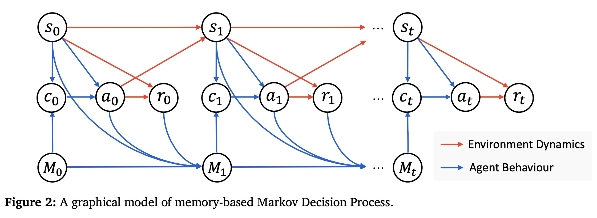
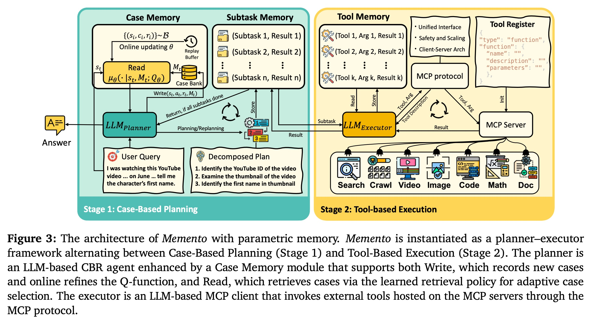
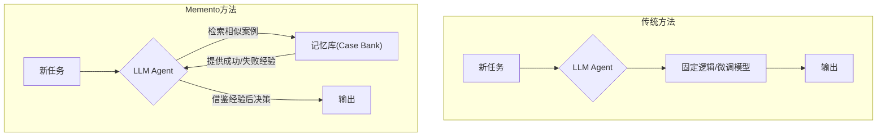
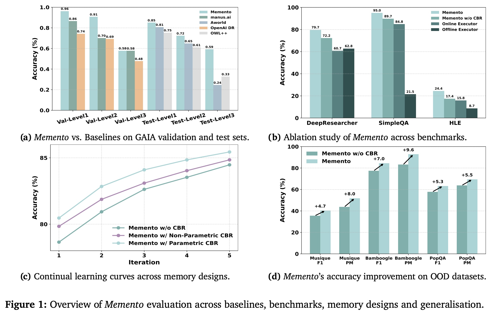
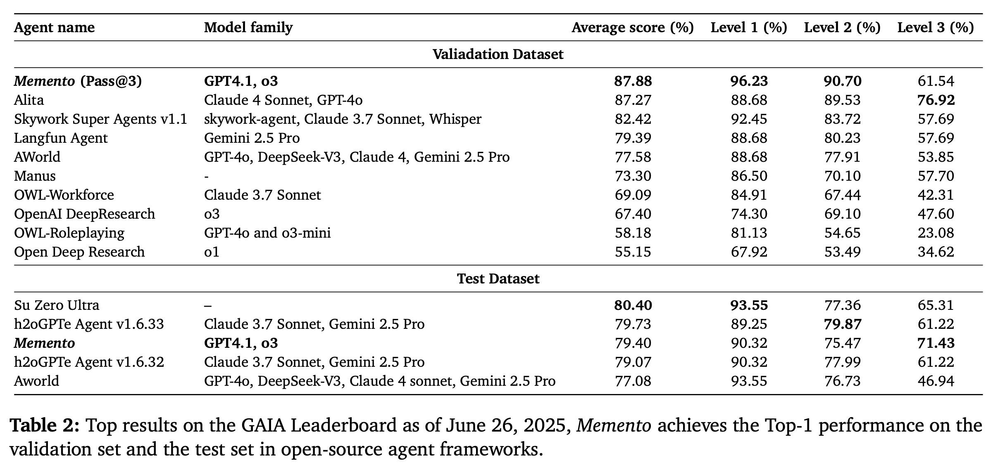
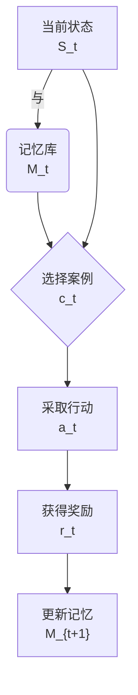

## AI论文解读 | Memento: Fine-tuning LLM Agents without Fine-tuning LLMs
        
### 作者        
digoal        
        
### 日期        
2025-09-14        
        
### 标签        
PostgreSQL , PolarDB , DuckDB , AI , 论文解读        
        
----        
        
## 背景  
      
https://arxiv.org/pdf/2508.16153        
  
提示:          
```          
读懂《Memento: Fine-tuning LLM Agents without Fine-tuning LLMs》这篇论文需要提前掌握哪些基础知识, 请使用中文通熟易懂的讲解这些基础知识, 可以引用论文中的图、表或使用Markdown支持的图形(text,mermaid等)增加解释性. 
  
使用中文通熟易懂的解读《Memento: Fine-tuning LLM Agents without Fine-tuning LLMs》这篇论文, 其中的关键内容请着重讲解, 可以引用论文中的图、表或使用Markdown支持的图形(text,mermaid等)增加解释性. 
  
提取《Memento: Fine-tuning LLM Agents without Fine-tuning LLMs》这篇论文中的重要术语, 使用中文对这些术语进行通熟易懂的讲解, 可以引用论文中的图、表或使用Markdown支持的图形(text,mermaid等)增加解释性. 
```     
  
## 1 前置知识 
  
好的，根据您提供的论文《Memento: Fine-tuning LLM Agents without Fine-tuning LLMs》，要读懂这篇论文，您需要提前掌握以下几个核心基础知识。下面我将用通俗易懂的方式，结合论文中的概念和图表为您讲解。

-----

### 1\. 大型语言模型智能体（LLM Agent）

大型语言模型（LLM）我们已经很熟悉了，它们能根据提示（Prompt）生成文本。而 **LLM智能体（LLM Agent）** 更进一步，它是一个利用LLM作为“大脑”来**自主**完成复杂任务的系统 。

与被动响应提示的LLM不同，LLM智能体能主动地进行思考、规划和决策。它们可以与外部环境互动，调用工具（如搜索、编程工具等），并利用记忆来指导自己的行为。这篇论文正是为了解决LLM智能体在持续学习和适应新环境时遇到的问题。

### 2\. 传统LLM智能体面临的挑战

论文指出，传统的LLM智能体主要有两种范式，但都存在局限性:

  * **固定工作流（Fixed Workflows）:** 这种智能体使用预先设定的、硬编码的规则来执行特定任务。它们对狭窄的任务非常有效，但缺乏灵活性，无法适应新情况或在线信息 。
  * **模型微调（Fine-tuning）:** 这种方法通过更新LLM本身的参数来让模型学习新的行为 。但微调的计算成本非常高，效率低下，并且容易导致 **“灾难性遗忘”（Catastrophic Forgetting）** ，即模型在学习新知识时忘记旧知识 。

这篇论文的核心思想，就是提出了一种在**不微调**LLM模型参数的情况下，让智能体持续学习的方法 。

### 3\. 基于案例的推理（Case-Based Reasoning, CBR）

CBR是论文中提出的一种核心学习策略，它模拟人类通过回顾过往经验来解决问题的方式 。

CBR的核心思想是：

  * **存储案例（Retain）:** 将过去的经验，包括任务、采取的行动和结果（成功或失败），作为一个“案例”存储在外部记忆库中 。
  * **检索案例（Retrieve）:** 当面临新问题时，智能体从记忆库中找到与当前情况最相似的过往案例 。
  * **复用与修正（Reuse & Revise）:** 智能体复用检索到的案例中的成功经验，并根据当前任务进行适当调整，以生成新的解决方案 。

Memento正是利用这种机制，通过存储成功的任务轨迹，让智能体在面对新任务时可以参考历史经验，从而避免了从零开始解决问题。

### 4\. 马尔可夫决策过程（Markov Decision Process, MDP）

MDP是**强化学习**中的一个基本概念，它用来描述智能体在环境中的决策过程 。一个标准的MDP通常包含以下几个要素：

  * **状态（State）**：智能体所处的当前环境。
  * **行动（Action）**：智能体可以采取的行动。
  * **奖励（Reward）**：智能体采取行动后，环境给予的反馈信号。
  * **转移（Transition）**：采取行动后，环境状态如何变化。

论文将传统的MDP进行了扩展，提出了**基于记忆的马尔可夫决策过程（M-MDP）** 。这个新概念在MDP的基础上，额外增加了一个 **记忆（Memory）** 组件。

如下图所示，论文用图形模型解释了M-MDP：

  * **红色箭头（环境动态）**：表示智能体从当前状态 $S\_t$ 采取行动 $a\_t$ 后，环境发生变化，给予奖励 $r\_t$ 并进入下一个状态 $S\_{t+1}$。
  * **蓝色箭头（智能体行为）**：表示智能体在当前状态 $S\_t$ 和记忆 $M\_t$ 的共同作用下，选择一个案例 $c\_t$，并基于这个案例做出行动 $a\_t$。同时，新的经验（ $S\_t, a\_t, r\_t$ ）会被写入记忆 $M\_{t+1}$ 中 。

  

图2: 基于记忆的马尔可夫决策过程图形模型 。 

这个模型是整个Memento框架的理论基础，它将CBR的决策过程形式化，并为后续的优化提供了数学框架 。

### 5\. 强化学习（Reinforcement Learning, RL）与软Q学习（Soft Q-Learning）

论文将案例检索策略的优化视为一个强化学习问题 。

  * **目标**：学习一个最佳的策略 $\\mu$，让智能体在给定当前状态和记忆的情况下，能选择出最好的案例 $c$ 。
  * **奖励**：智能体采取行动后，根据结果获得奖励。例如，成功解决任务会获得正奖励。
  * **软Q学习（Soft Q-Learning）**：论文采用了一种特殊的强化学习算法来解决这个问题 。与传统的Q学习不同，软Q学习不仅要最大化奖励，还要最大化策略的**熵（Entropy）**，这鼓励智能体在选择案例时保持多样性，避免过早陷入局部最优解 。通过这种方法，智能体可以持续优化其“选择案例”的能力 。

### 6\. 规划-执行架构（Planner-Executor Architecture）

Memento的实际系统实现采用了 **规划-执行（Planner-Executor）** 架构 。

  * **规划器（Planner）**：由一个大型语言模型（如GPT-4.1）扮演，它根据用户指令和从记忆库中检索到的历史案例来制定一个分解的计划或一系列子任务 。这对应于“基于案例的规划（Case-Based Planning）”阶段 。
  * **执行器（Executor）**：由另一个LLM（如o4-mini）担任，负责调用外部工具（如搜索、抓取网页、处理图像等）来一步步执行规划器制定的子任务 。这对应于“基于工具的执行（Tool-based Execution）”阶段 。

这种分工明确的架构让系统既能进行高级别的推理和规划，又能高效地利用外部工具来完成具体任务 。这个架构在论文中的图3中有所体现。   

掌握了以上这些基础知识，您就能更好地理解《Memento》这篇论文的核心思想、技术实现和创新之处。
  
## 2 解读论文 
  
好的，我们来通俗易懂地解读一下这篇名为《Memento: Fine-tuning LLM Agents without Fine-tuning LLMs》的论文。

论文标题的直译是：**《Memento：在不微调大语言模型（LLM）的情况下微调大语言模型智能体》**。

这标题有点绕，但核心思想非常清晰：**我们想让一个基于大模型的智能体（Agent）变得越来越聪明，能够不断学习和适应，但又不想花费高昂的成本去重新训练那个大模型本身** 。 Memento就是作者们提出的实现这一目标的全新学习范式 。

-----

### 1\. 问题所在：当前LLM智能体成长的烦恼

在了解Memento之前，我们先看看现有的LLM智能体主要面临什么问题。目前主流的方法有两种，但都有明显缺陷 ：

1.  **“写死”的框架 (Fixed Workflows)**：开发者为智能体设计一套固定的工作流程和逻辑规则 。这种方法在特定任务上表现不错，但非常死板，一旦部署后就无法学习新知识或适应新情况 。就像一个只会照着菜谱做菜的机器人，换个新菜式就懵了。
2.  **“烧钱”的微调 (Parameter Tuning)**：通过监督微调或强化学习来更新大模型内部的参数 。这种方法能让智能体学会更灵活的行为，但计算成本极高，而且难以实现持续、实时的在线学习 。这就像为了让机器人学会新菜，就得把它送回原厂进行一次昂贵的大脑升级手术。

**核心挑战是**：我们能否构建一种LLM智能体，它既能持续地从变化的环境中学习，又无需承担微调LLM本身那种高昂的成本？

-----

### 2\. 核心思想：借鉴人类的“记忆”与“经验”

Memento的解决方案灵感来源于人类的学习方式 。人类之所以能不断进步，是因为我们有强大的记忆系统 ：

  * 我们会将经历过的事情（无论成功还是失败）作为**情景记忆**储存起来 。
  * 当遇到新问题时，我们会回忆起过去类似的**案例（Case）**，进行类比推理来指导当前的决策 。

Memento正是借鉴了这种 **基于案例的推理（Case-Based Reasoning, CBR）** 机制 。它不再试图去修改LLM的大脑（参数），而是给智能体外挂一个“记忆库”（Case Bank），让它学会“翻阅历史经验”来解决问题 。



-----

### 3\. Memento是如何工作的？

Memento被设计成一个 **“规划者-执行者”（Planner-Executor）** 架构，交替进行“基于案例的规划”和“基于工具的执行”两个阶段 。

你可以把整个过程想象成一个项目经理（Planner）带领一个工程师（Executor）完成一项复杂任务。

*图解：Memento的架构图 。左边是负责思考和规划的**规划阶段**，右边是负责动手和执行的**执行阶段**。*

#### **阶段一：基于案例的规划 (Case-Based Planning)**

1.  **接收任务**：规划者（Planner LLM）接收到一个用户请求，比如“帮我找到这个YouTube视频里主角的名字” 。
2.  **“翻阅”记忆库**：规划者会查询 **案例记忆（Case Memory）** 模块，寻找历史上处理过的相似任务 。
3.  **借鉴经验**：记忆库会返回最相关的几个案例，每个案例都记录着当时的任务描述、采取的计划、以及最终是成功还是失败 。
4.  **制定计划**：规划者综合当前任务和历史经验，生成一个分解后的行动计划 。例如，分解为“1. 识别视频ID；2. 检查视频缩略图；3. 识别缩略图中的名字” 。

#### **阶段二：基于工具的执行 (Tool-Based Execution)**

1.  **执行子任务**：执行者（Executor LLM）拿到规划好的子任务，并调用各种外部 **工具（Tools）** 来完成它 。
2.  **丰富的工具箱**：Memento配备了强大的工具集，包括：
      * **信息获取**：搜索引擎、网页爬虫 。
      * **多模态处理**：能分析图片、视频、音频和各种文档（PDF, Word等）。
      * **代码与数学**：拥有代码执行和数学计算的能力 。
3.  **记录过程**：执行者在执行过程中会把每一步的工具调用和结果记录在 **工具记忆（Tool Memory）** 中 。

这两个阶段会循环进行，直到所有子任务完成，最终输出答案 。任务完成后，这次的整个经历（任务、计划、结果）会被打包成一个新的“案例”，存入**案例记忆库**中，供未来学习使用 。

#### **关键中的关键：案例记忆（Case Memory）**

这是Memento的核心。它有两种工作模式：

  * **非参数化记忆 (Non-Parametric Memory)**：这种模式比较简单。当需要检索案例时，它通过计算当前任务与历史任务的**语义相似度**（比如用余弦相似度）来找出最相关的K个案例 。优点是计算快，简单高效 。

  * **参数化记忆 (Parametric Memory)**：这种模式更智能。它不仅存储案例，还会同时在线学习一个**Q函数（Q-function）** 。这个Q函数可以评估，对于当前这个任务（state），检索出的某个历史案例（case）到底有多大的参考价值（Q-value）。这样，智能体就能更有选择性地借鉴那些“高质量”的经验，而不是简单地“找相似” 。

**实验证明，这两种记忆模式都能显著提升智能体的学习能力。** 如下图所示，随着学习迭代次数（Iteration）的增加，带有记忆模块的Memento（灰色和蓝色曲线）比没有记忆模块的（绿色曲线）准确率提升更明显 。

  

*图源：论文Figure 1(c) 。展示了不同记忆设计下的持续学习曲线。*

-----

### 4\. 实验效果如何？一句话：非常能打！

作者在多个权威的基准测试集上验证了Memento的性能。

  * **GAIA（高难度通用AI助手基准）**：Memento在验证集上取得了**排名第一**的成绩（87.88%），在测试集上也名列前茅（79.40%），超过了包括AWorld、OWL等在内的许多知名开源智能体框架 。

| 智能体名称 (部分) | 模型 | 验证集平均分 (%) |
| :--- | :--- | :--- |
| **Memento (Pass@3)** | GPT4.1, o3 | **87.88** |
| Alita | Claude 4 Sonnet, GPT-4o | 87.27 |
| Skywork Super Agents | skywork-agent, Claude 3.7 | 82.42 |
| AWorld | GPT-4o, DeepSeek-V3, ... | 77.58 |
| Manus | - | 73.30 |

  

*表格改编自论文Table 2 ，展示了GAIA验证集上的顶级排名。*

  * **DeepResearcher（真实网络研究任务）**：Memento的平均F1分数达到了**66.6%**，几乎是传统“CoT + RAG”基线（37.7%）的两倍，证明了其实时在线研究的能力 。

  * **SimpleQA（事实问答）**：准确率高达**95.0%**，为该基准设立了新的技术水平（state-of-the-art）。

  * **泛化能力测试**：实验还证明，通过在一些数据集上“学习”经验，Memento在从未见过的新类型数据集（OOD datasets）上也能获得**4.7%到9.6%的绝对性能提升** 。这说明通过CBR学到的“经验”是可迁移、可泛化的 。

  

*图源：论文Figure 1(d) 。展示了CBR在OOD（分布外）数据集上带来的显著准确率提升。*

-----

### 5\. 总结与启发

《Memento》这篇论文为我们展示了一条极具前景的道路，用以构建能够持续学习和进化的通用AI智能体。其核心贡献可以总结为：

1.  **提出了一种创新的、低成本的学习范式**：通过外挂一个“记忆库”并利用基于案例的推理（CBR），让智能体在不改动大模型参数的情况下实现持续学习和自我完善 。
2.  **理论与实践结合**：将智能体的决策过程严谨地建模为**记忆增强马尔可夫决策过程（M-MDP）** ，并设计了一套行之有效的“规划者-执行者”架构付诸实践 。
3.  **卓越的性能表现**：在多个高难度、多样化的基准测试中取得了顶尖的成绩，充分证明了该方法的有效性和泛化能力 。

总而言之，Memento就像是给LLM智能体安装了一个可以不断记录、反思和借鉴的“经验笔记本”，让它从一个只会“死记硬背”的学生，成长为一个懂得“举一反三”的学霸。这种“成长型”智能体的思路，对于未来构建更通用、更强大的AI系统具有重要的启发意义。
  
## 3 术语 
  
好的，根据《Memento: Fine-tuning LLM Agents without Fine-tuning LLMs》这篇论文的内容，我为您梳理并提取了以下几个重要的核心术语，并用通俗易懂的方式进行中文讲解。

-----

### Memento 框架

**Memento** 是这篇论文提出的一个新型学习范式，它的核心目标是让大型语言模型（LLM）智能体在**不微调底层LLM参数**的情况下，实现持续学习和适应新环境。传统的模型微调成本高昂且容易导致“灾难性遗忘”。而Memento通过引入外部记忆和强化学习机制，让智能体像人一样通过回顾和学习过去的经验来解决新问题。

### LLM Agent（大型语言模型智能体）

**LLM Agent**，简称LLM智能体，是一种以大型语言模型为“大脑”，能够自主完成复杂任务的系统。与仅被动响应指令的LLM不同，智能体具备**思考、规划、行动和反思**的能力。它们能够调用各种工具（例如搜索、编程工具）来与外部世界互动，并根据任务结果进行学习和调整。

-----

### Memory-augmented Markov Decision Process (M-MDP)（记忆增强的马尔可夫决策过程）

这是论文提出的一个重要理论概念。传统的马尔可夫决策过程（MDP）用来描述智能体在环境中的决策，只考虑当前状态。而 **M-MDP** 在此基础上增加了一个**记忆（Memory）组件，将智能体的决策过程公式化为：在当前状态**和**历史记忆**的共同影响下，智能体选择一个行动。

用一个简化的流程图来表示：



这个模型为Memento如何利用记忆来指导决策提供了坚实的理论基础。

-----

### Neural Case-selection Policy（神经案例选择策略）

**神经案例选择策略**是M-MDP中的一个关键组成部分。它是一个可学习的策略模型，其功能是：当智能体面临新任务时，从记忆库中**自动**找到与当前任务最相关、最有帮助的“案例”（即历史经验）。论文将这个策略的学习过程视为一个强化学习问题，通过环境反馈来不断优化其选择案例的能力，以确保每次都能找到最合适的参考经验。

### Episodic Memory（情景记忆）

**情景记忆**在论文中扮演着智能体的“经验库”。它存储了智能体过去执行任务时完整的轨迹，包括：**任务状态、采取的行动和环境反馈（奖励）**。当智能体完成一个任务后，这段完整的经验就会被作为一个“情景”或“案例”存储下来。这种存储方式使得智能体可以随时回顾和利用过去的成功经验，从而避免了重复犯错。

### Case-Based Reasoning (CBR)（基于案例的推理）

**基于案例的推理**是一种解决问题的方法，其核心思想是 **“从旧案例中学习，解决新问题”** 。Memento框架正是基于这一思想构建的。它的工作流程分为三个主要步骤：

1.  **检索（Retrieve）**：从情景记忆中找到与当前任务最相似的历史案例。
2.  **复用（Reuse）**：借鉴检索到的案例中的成功行动和策略。
3.  **修正（Revise）**：根据当前任务的特点，对借鉴的策略进行微调和适应。
    这种方法使得智能体能够高效地利用过往经验，而无需进行昂贵的模型参数更新。

### Planner-Executor Architecture（规划-执行架构）

**规划-执行架构**是Memento框架的实际系统实现方式。它将智能体的工作分为两个明确的阶段：

1.  **规划器（Planner）**：由一个强大的LLM（如论文中的GPT-4.1）扮演。它负责**思考和规划**，根据用户指令和检索到的历史案例，制定一个详细的、可执行的步骤列表。
2.  **执行器（Executor）**：由一个相对小巧、高效的LLM（如o4-mini）扮演。它负责**执行**规划器制定的每一步，并调用外部工具来完成具体任务（例如，进行网络搜索、浏览网页、执行代码等）。
    这种分工合作的模式，既保证了高级推理能力，又提高了任务执行的效率。

-----

### Catastrophic Forgetting（灾难性遗忘）

**灾难性遗忘**是传统LLM模型微调中一个普遍存在的问题。当模型学习新任务时，其参数会发生改变，这可能导致它忘记之前已经掌握的旧任务知识。Memento框架通过不微调LLM本身，而是使用外部记忆库来存储新知识，从而彻底解决了这一问题。这就像一个人，通过记笔记（外部记忆）来学习新知识，而不需要改变大脑（底层LLM）本身的结构。
  
## 参考        
         
https://arxiv.org/pdf/2508.16153    
        
<b> 以上内容基于DeepSeek、Qwen、Gemini及诸多AI生成, 轻微人工调整, 感谢杭州深度求索人工智能、阿里云、Google等公司. </b>        
        
<b> AI 生成的内容请自行辨别正确性, 当然也多了些许踩坑的乐趣, 毕竟冒险是每个男人的天性.  </b>        
  
    
#### [期望 PostgreSQL|开源PolarDB 增加什么功能?](https://github.com/digoal/blog/issues/76 "269ac3d1c492e938c0191101c7238216")
  
  
#### [PolarDB 开源数据库](https://openpolardb.com/home "57258f76c37864c6e6d23383d05714ea")
  
  
#### [PolarDB 学习图谱](https://www.aliyun.com/database/openpolardb/activity "8642f60e04ed0c814bf9cb9677976bd4")
  
  
#### [PostgreSQL 解决方案集合](../201706/20170601_02.md "40cff096e9ed7122c512b35d8561d9c8")
  
  
#### [德哥 / digoal's Github - 公益是一辈子的事.](https://github.com/digoal/blog/blob/master/README.md "22709685feb7cab07d30f30387f0a9ae")
  
  
#### [About 德哥](https://github.com/digoal/blog/blob/master/me/readme.md "a37735981e7704886ffd590565582dd0")
  
  

  
