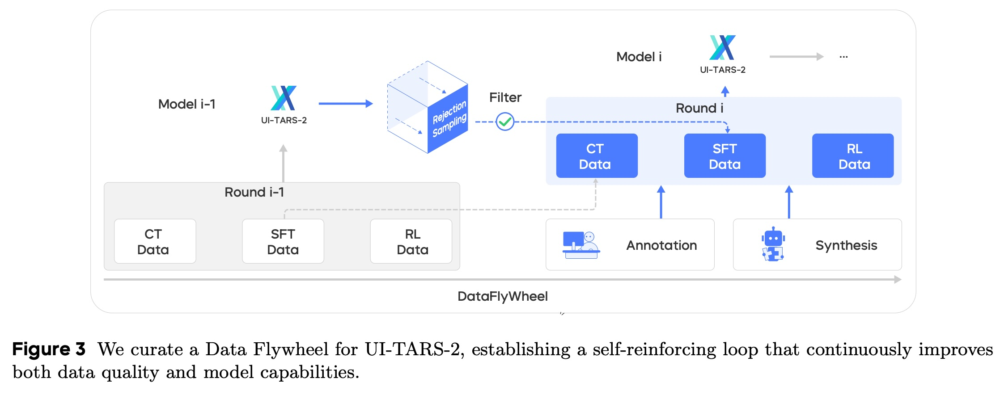
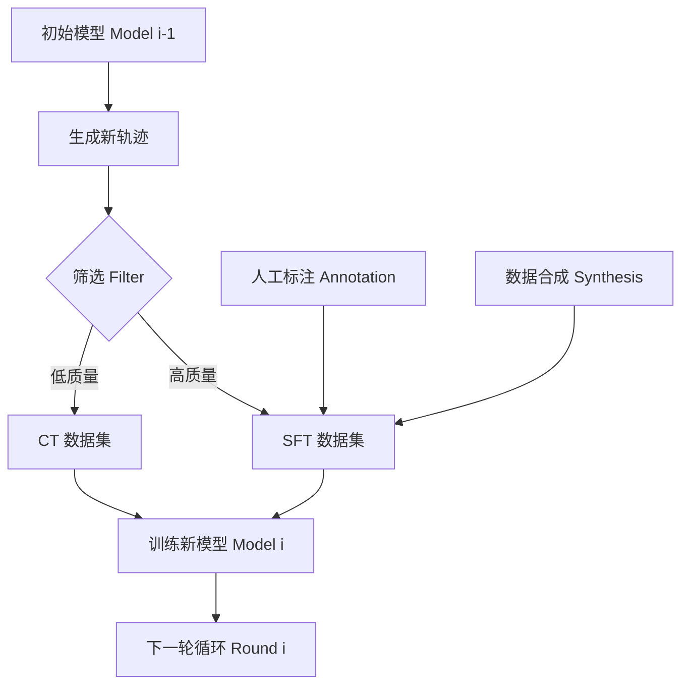
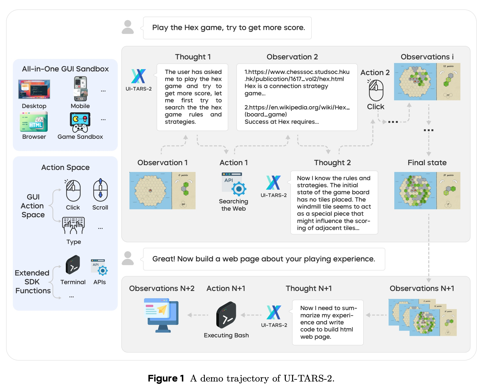
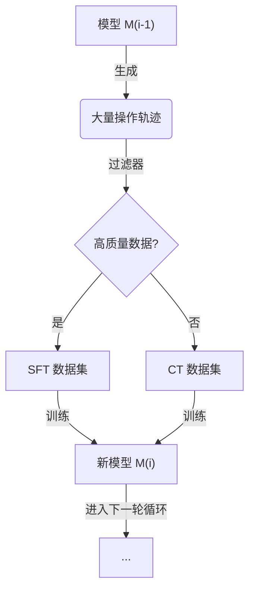
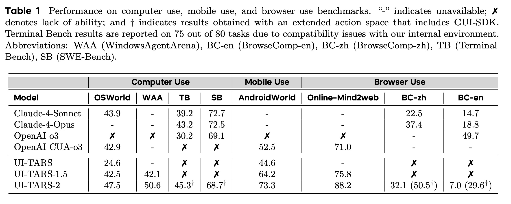
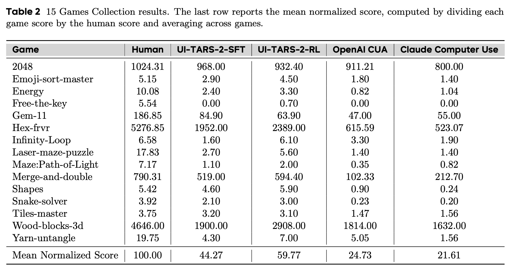
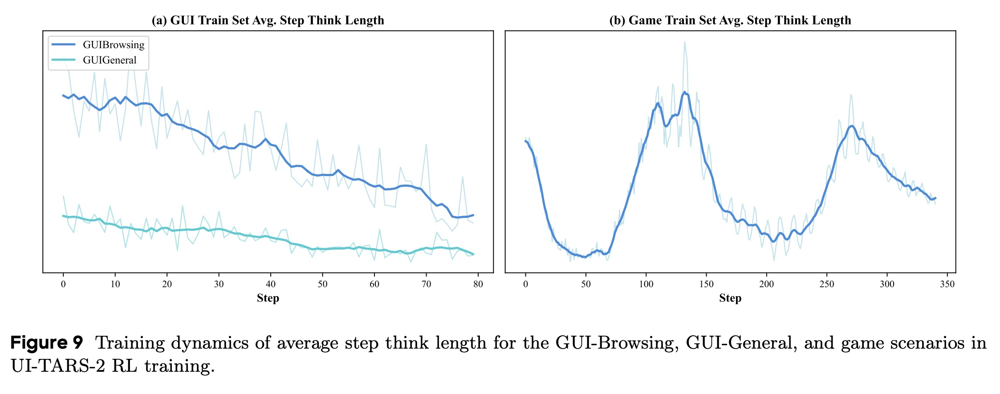
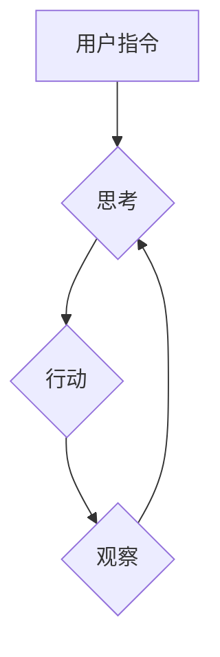
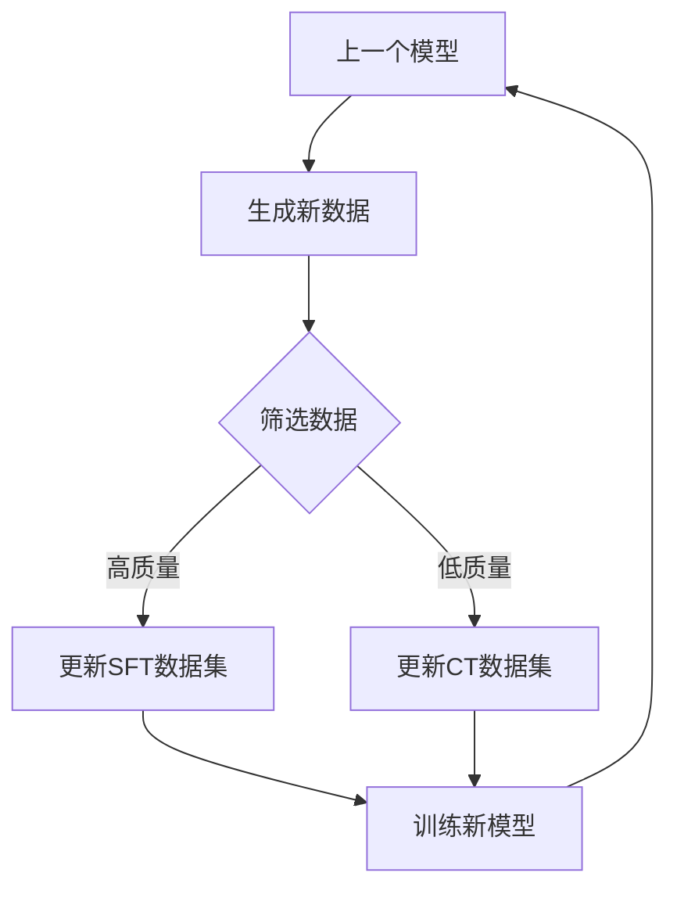
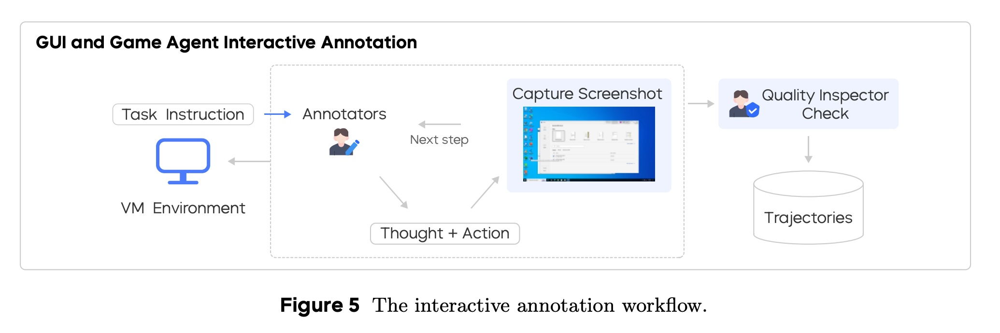

## AI论文解读 | UI-TARS-2 Technical Report: Advancing GUI Agent with Multi-Turn Reinforcement Learning
        
### 作者        
digoal        
        
### 日期        
2025-09-14        
        
### 标签        
PostgreSQL , PolarDB , DuckDB , AI , 论文解读        
        
----        
        
## 背景  
      
https://arxiv.org/pdf/2509.02544        
  
提示:          
```          
读懂《UI-TARS-2 Technical Report: Advancing GUI Agent with Multi-Turn Reinforcement Learning》这篇论文需要提前掌握哪些基础知识, 请使用中文通熟易懂的讲解这些基础知识, 可以引用论文中的图、表或使用Markdown支持的图形(text,mermaid等)增加解释性. 
  
使用中文通熟易懂的解读《UI-TARS-2 Technical Report: Advancing GUI Agent with Multi-Turn Reinforcement Learning》这篇论文, 其中的关键内容请着重讲解, 可以引用论文中的图、表或使用Markdown支持的图形(text,mermaid等)增加解释性. 
  
提取《UI-TARS-2 Technical Report: Advancing GUI Agent with Multi-Turn Reinforcement Learning》这篇论文中的重要术语, 使用中文对这些术语进行通熟易懂的讲解, 可以引用论文中的图、表或使用Markdown支持的图形(text,mermaid等)增加解释性. 
```     
  
## 1 前置知识 
  
为了帮助您更好地理解《UI-TARS-2 技术报告：使用多轮强化学习推进 GUI 代理》这篇论文，我为您总结了阅读前需要掌握的一些核心基础知识，并结合论文中的图表进行了通俗易懂的解释。

-----

### 1\. GUI 代理 (GUI Agent)

**概念：** GUI 代理可以理解为一种能像人类一样，通过图形用户界面（GUI）来操作电脑、手机或网页的 AI 机器人。它不仅仅是简单地执行点击、输入和滚动等操作，还能够理解屏幕上的内容（比如按钮、文本框），并根据任务目标进行推理和决策。

**论文中的体现：** 论文将 UI-TARS-2 描述为一个“以 GUI 为中心的原生代理模型”，它将感知、推理、动作和记忆统一在一个端到端（end-to-end）的学习框架中 。这与传统方法中将这些组件分离的设计不同。

-----

### 2\. 多轮强化学习 (Multi-Turn Reinforcement Learning, RL)

**概念：** 强化学习是一种让 AI 通过“试错”来学习如何行动的方法。想象一下训练一只小狗：当它做出正确的行为时，你会给它奖励（正向反馈），当它犯错时，它不会得到奖励（负向反馈）。多轮强化学习就是让 AI 在一个连续的、多步骤的序列中完成任务，并在最终成功或失败时获得奖励，而不是每一步都得到即时反馈。

**论文中的体现：**

  * **挑战：** 论文提到，在交互式环境中进行强化学习非常困难，因为奖励通常是稀疏或延迟的，并且很难在长序列动作中进行“功劳分配”（credit assignment）。
  * **解决方案：** 论文的核心贡献之一就是提出了一种稳定的多轮强化学习框架，它通过异步推出（Asynchronous Rollout）、流式更新（Streaming Update）等技术来优化长序列任务 。

-----

### 3\. 数据飞轮 (Data Flywheel)

**概念：** 数据飞轮是一种自我强化的训练循环。它不是一次性地用一个数据集训练模型，而是让模型自己生成新的数据，然后用这些数据进一步改进模型，形成一个良性循环。就像一个飞轮，一旦转动起来，就会越来越快。

**论文中的体现：**

  * **三阶段循环：** 论文的核心训练方法就是这个数据飞轮。它包含三个阶段：**持续预训练（CT）**、**监督微调（SFT）和强化学习（RL）** 。
  * **数据流向：** 在每次循环中，最新的 RL 模型会生成新的轨迹。其中质量高的轨迹会被用于监督微调（SFT），质量稍低的则被用于持续预训练（CT），确保每一份数据都能被有效利用，从而在模型和数据之间形成一个自我强化的循环，不断提升性能 。

图3展示了这个“数据飞轮”的运作流程：   




-----

### 4\. ReAct 范式 (ReAct Paradigm)

**概念：** ReAct 是“Reasoning（推理）”和“Acting（行动）”的缩写，是一种让语言模型具备更强推理和行动能力的方法。它通过一个循环来工作：**推理 (Thought)** → **行动 (Action)** → **观察 (Observation)**。模型会先进行内部思考（例如：下一步要做什么），然后执行一个外部动作（例如：点击一个按钮），最后从环境中获取反馈（例如：看到新的页面），并根据这个反馈来调整下一步的思考和行动。

**论文中的体现：**

  * 论文明确指出，UI-TARS-2 遵循 ReAct 范式，在每个时间步都交替进行推理、行动和观察，形成一个结构化的循环 。
  * 图1展示了一个 ReAct 循环的例子：UI-TARS-2 先进行**推理 (Thought)**（“我需要先搜索游戏规则”），然后执行**行动 (Action)**（“搜索网页”），接着从环境中获得**观察 (Observation)**（“找到维基百科和另一个网站”），最后根据观察进行新的**推理 (Thought)** 。   

-----

### 5\. 沙盒环境 (Sandbox Environment)

**概念：** 在软件开发中，“沙盒”是一个隔离的、受限的运行环境。在这里，程序可以执行而不会影响到外部系统。在 AI 代理的训练中，沙盒环境是一个至关重要的工具，因为它提供了稳定、可复现的训练平台。

**论文中的体现：**

  * **“一体化 GUI 沙盒”：** 论文介绍了一个名为“一体化 GUI 沙盒”的统一平台，它将 GUI 操作与文件系统、终端等其他资源整合在一起，使得代理能够执行更复杂的任务，比如通过浏览器下载文件，然后立即用 shell 命令处理它 。
  * **多种环境支持：** 这个沙盒可以协调各种异构环境，从用于 GUI 交互的云虚拟机（VM），到用于游戏的浏览器沙盒 。

-----

### 6\. 近端策略优化 (Proximal Policy Optimization, PPO)

**概念：** PPO 是一种非常流行的强化学习算法，主要用于训练 AI 策略（policy）。它的核心思想是，在每次更新模型时，不要让新策略与旧策略偏离太多，从而保证训练过程的稳定性。

**论文中的体现：**

  * UI-TARS-2 就是使用 PPO 算法进行训练的 。
  * 论文还提到了对 PPO 的多项增强，比如奖励塑造（Reward Shaping）、解耦广义优势估计（Decoupled GAE）和价值预训练（Value Pretraining），这些都是为了在处理长序列任务时提高训练稳定性的技术 。

掌握了这些基础知识，您将能更好地理解论文中提出的方法论和技术细节。
  
## 2 解读论文 
  
好的，我们来通俗易懂地解读一下来自字节跳动（ByteDance）的这篇重磅技术报告：《UI-TARS-2：通过多轮强化学习推进GUI智能体》。

简单来说，这篇论文介绍了一个名为 **UI-TARS-2** 的人工智能模型。你可以把它想象成一个“AI 机器人”，它的目标是学习像人类一样熟练地操作电脑和手机的图形用户界面（GUI），比如点击图标、填写表单、浏览网页，甚至玩游戏。这篇报告详细阐述了他们是如何克服重重困难，把这个“AI 机器人”训练得比之前版本和其他强大模型（如 OpenAI 和 Claude 的智能体）更聪明的。

-----

### **核心挑战：训练一个“数字劳动力”有多难？**

在深入了解 UI-TARS-2 的独门秘籍之前，我们先看看研究人员面临的四大核心挑战 ：

1.  **数据稀缺 (Data Scarcity)**：不像文本或代码那样在互联网上随处可见，能够完整记录“思考过程、具体操作、环境反馈”的高质量AI训练数据非常稀少且昂贵 。
2.  **多轮强化学习难扩展 (Scalable multi-turn RL)**：在复杂的交互任务中，AI的操作可能要很多步之后才能看到结果（奖励稀疏），这使得学习过程很不稳定，难以扩展到长时程任务中 。
3.  **纯GUI操作的局限性 (Limitations of GUI-only operation)**：很多现实世界的工作流，比如处理文件、编程开发，光靠模拟鼠标点击和打字是远远不够的，还需要和文件系统、命令行工具等进行交互 。
4.  **环境不稳定且难扩展 (Environment scalability and stability)**：要进行大规模的AI训练，需要成千上万个可复现、容错能力强的模拟环境（如虚拟机、浏览器），而搭建和维护这样的环境在工程上是一个巨大的瓶颈 。

-----

### **UI-TARS-2 的四大创新支柱**

为了解决上述难题，UI-TARS-2 提出了一套系统的、独创性的方法论，可以概括为四大支柱：

#### **1. 数据飞轮 (Data Flywheel)：自我进化的数据生产线**

这是 UI-TARS-2 的核心思想之一，旨在解决“数据稀缺”的问题。它建立了一个模型和数据相互促进、共同进化的自增强循环系统 。

**工作流程可以参考下图 (图3的简化解释):**

  



  * **模型生成数据**：使用当前最强的 UI-TARS-2 模型去执行各种任务，产生大量的操作记录（轨迹）。
  * **数据筛选与分配**：对生成的数据进行质量评估。高质量、操作正确的轨迹被送到“精加工”阶段，即**监督微调 (SFT)** 数据集 。质量稍逊但仍有学习价值的轨迹则被送到“粗加工”阶段，即**持续预训练 (CT)** 数据集 。
  * **模型迭代升级**：用更新后的数据集重新训练模型，得到一个更强大的新版模型 。这个新模型又能生成更高质量的数据，如此循环往复，形成一个“飞轮效应”，让模型和数据质量持续提升 。

这种机制确保了“好钢用在刀刃上”，并且没有任何数据被浪费，实现了高效、可持续的能力增长 。

#### **2. 稳定的多轮强化学习 (Multi-turn RL) 框架**

为了让AI在复杂的长时程任务中稳定学习，UI-TARS-2 设计了一套强大的强化学习（RL）训练框架 。

  * **异步和流式训练**：传统的训练方式是等一批任务全部完成后再开始学习，效率很低。UI-TARS-2 采用异步、流式的方式，任务一旦完成就立刻加入训练池，无需等待其他“慢任务”，大大提升了训练效率 。
  * **有状态的环境**：为了支持需要记忆之前操作的复杂任务，环境被设计成“有状态的”，能够保存上下文信息，让AI可以进行连续、多步骤的推理和操作 。
  * **精细的奖励设计**：在可以明确判断对错的任务（如游戏得分）中，直接使用二进制奖励 。在一些开放性任务（如网页操作）中，由于没有标准答案，他们创新性地训练 UI-TARS-2 模型自身来充当一个“结果奖励模型 (ORM)”，即让模型自己来判断操作轨迹的成功与否并给出评分 。
  * **优化的PPO算法**：通过引入价值预训练 (Value Pretraining)、解耦 GAE (Decoupled GAE) 等多项技术，增强了 PPO 算法在长序列任务中的稳定性和探索能力 。

#### **3. 混合式 GUI 中心环境**

为了打破纯 GUI 操作的局限，UI-TARS-2 构建了一个“混合环境” 。

如下图 (图1的解读) 所示，智能体在接到“玩 Hex 游戏并获得更高分数”的指令后，它首先通过**搜索网页 (Action 1)** 来学习规则 。在掌握了玩法并进行游戏后，用户又提出新要求：“现在为你的游戏体验创建一个网页” 。这时，智能体无缝切换到**执行 Bash 命令 (Action N+1)**，通过编码来完成这个任务 。 

  

*论文图1展示了UI-TARS-2的一个工作流程*

这个混合环境通过一个名为 **GUI-SDK** 的扩展功能，将对文件系统、命令行的访问能力集成进来，使得 UI-TARS-2 不再只是一个“鼠标键盘模拟器”，而是一个能够调用多种系统资源的“全能助手” 。

#### **4. 统一的沙盒平台**

为了支撑大规模、高并发的训练和评估，团队搭建了一个统一的、工程化水平极高的沙盒平台 。

  * **异构环境支持**：该平台能够统一管理和调度运行着 Windows、Ubuntu、Android 操作系统的云端虚拟机，以及用于网页和游戏任务的硬件加速浏览器沙盒 。
  * **高吞吐和高稳定性**：整个平台由数千个实例组成，能够支持每秒数千次的查询和高并发执行，并具备自动崩溃恢复和资源回收机制，确保了大规模训练的稳定可靠 。

-----

### **惊艳的实验结果：UI-TARS-2 表现如何？**

UI-TARS-2 在多个权威基准测试中取得了顶尖水平，显著超越了其前代版本 UI-TARS-1.5 以及包括 OpenAI 和 Claude 在内的强大对手 。

#### **GUI 任务表现 (表1摘要)**

  

| 基准测试 (Benchmark) | UI-TARS-2 | UI-TARS-1.5 | OpenAI CUA-o3 | Claude-4-Sonnet |
| :--- | :---: | :---: | :---: | :---: |
| **OSWorld** (电脑操作) | **47.5%** | 42.5% | 42.9% | 43.9% |
| **Windows Agent Arena** | **50.6%** | 42.1% | - | - |
| **AndroidWorld** (手机操作) | **73.3%** | 64.2% | 52.5% | - |
| **Online-Mind2Web** (网页浏览) | **88.2%** | 75.8% | 71.0% | - |
| **SWE-Bench** (软件工程) | **68.7%†** | ✗ | ✗ | 72.7% |

*注：† 表示使用了 GUI-SDK 扩展功能；✗ 表示不具备该能力；- 表示数据不可用 。*

从上表可以看出，UI-TARS-2 在各类 GUI 任务上都取得了领先。特别值得一提的是，通过强化学习，模型将在浏览器任务上学到的能力成功**泛化**到了它没有主要训练过的领域，例如操作系统 (OSWorld) 和安卓系统 (AndroidWorld) 的性能也获得了巨大提升 。

#### **游戏任务表现 (表2摘要)**

  

在15个网页游戏的集合测试中，如果将人类玩家的平均水平定为100分，UI-TARS-2 的表现如下：

| 模型 | 平均归一化得分 |
| :--- | :---: |
| 人类玩家 | 100.00 |
| **UI-TARS-2 (RL后)** | **59.77** |
| UI-TARS-2 (SFT) | 44.27 |
| OpenAI CUA | 24.73 |
| Claude Computer Use | 21.61 |

UI-TARS-2 达到了接近 **60% 的人类水平**，并且远超 OpenAI 和 Claude 的同类智能体 。在某些游戏上，它甚至已经接近甚至超越了人类水平 。这证明了其在需要长时程规划和动态决策的复杂场景中的强大能力。

#### **有趣的发现：越学越“自信”，思考更高效**

在分析训练过程时，研究人员发现了一个有趣的现象：在 GUI 任务中，随着训练的进行，模型的“思考长度”（即生成内部推理文本的长度）反而**减少**了 (见下图9) 。

  

*论文图9展示了“思考长度”在训练过程中的变化*

这表明，模型不再需要冗长的“自言自语”来规划，而是内化了任务知识，能够更直接、更高效地预测出正确的操作，这是一种从“新手”到“专家”的转变 。

-----

### **结论**

《UI-TARS-2》这篇技术报告不仅仅是发布了一个更强的模型，更重要的是，它提供了一套完整、系统且可扩展的方法论，用于构建通用的 GUI 智能体。通过创新的**数据飞轮**、**稳定的强化学习框架**、**混合式环境**和**强大的沙盒平台**，UI-TARS-2 在结构化的电脑任务和动态的游戏环境中都展现了卓越的性能和泛化能力 。

这项工作为实现能够像人类一样熟练使用各种数字设备的通用 AI 智能体迈出了坚实的一步，并为未来的研究提供了宝贵的经验和方法指导 。
  
## 3 术语 
  
为了帮助您理解《UI-TARS-2 技术报告：使用多轮强化学习推进 GUI 代理》这篇论文，我为您梳理了其中几个核心且重要的术语，并结合论文中的图表，用通俗易懂的语言进行了讲解。

-----

### 1\. ReAct 范式 (ReAct Paradigm)

**概念：** ReAct 是一种让大型语言模型（LLM）具备“思考”和“行动”能力的方法。它不是一次性给出答案，而是通过一个 **“思考（Thought）-行动（Action）-观察（Observation）”** 的循环，一步步推进任务。这就像一个侦探在解决案件：先思考线索，然后采取行动去调查，再根据调查结果（观察）来调整下一步的思考和行动。

**在论文中的体现：** 论文将 UI-TARS-2 的行为模式正式定义为遵循 ReAct 范式 。如图 1 所示，UI-TARS-2 在每个时间步都会经历这个循环：   

  * **思考 (Thought)：** 代理进行内部认知处理，比如分析任务、规划步骤、回忆记忆等 。
  * **行动 (Action)：** 代理执行外部交互，比如点击鼠标、输入文字、调用系统命令等 。
  * **观察 (Observation)：** 代理从环境中获得反馈，比如看到新的屏幕截图、接收到命令输出等 。




-----

### 2\. 一体化 GUI 沙盒 (All-in-One GUI Sandbox)

**概念：** 沙盒是一个隔离、安全且可控的运行环境。在 GUI 代理的训练中， **“一体化 GUI 沙盒”** 是一个能够同时支持多种操作系统和工具的统一平台。它允许代理在同一环境中无缝地进行不同类型的操作，比如在浏览器中下载文件后，立即在终端中使用命令处理这个文件 。

**在论文中的体现：** 论文提到，该沙盒可以协调各种异构环境，例如用于 GUI 交互的云虚拟机（VM）、用于游戏的浏览器沙盒以及终端等 。这种设计解决了传统 GUI 代理只能在单一环境中工作的局限性，使得 UI-TARS-2 能够应对更广泛、更复杂的真实任务 。图 1 展示了这个沙盒如何整合桌面、移动设备和浏览器等多种环境 。   

-----

### 3\. 数据飞轮 (Data Flywheel)

**概念：** **数据飞轮**是一种自我强化的训练循环机制。它不是一次性用一个数据集训练模型，而是让模型在训练过程中不断生成新的数据，然后用这些数据反过来改进模型，形成一个良性循环 。

**在论文中的体现：** 论文的核心训练方法就是这个三阶段的数据飞轮 。它包含：

  * **持续预训练 (CT)**：通过大规模、多样化的数据获取广泛的知识 。
  * **监督微调 (SFT)**：使用高质量、特定任务的数据进行精确的指令微调 。
  * **强化学习 (RL)**：通过与环境互动，进行端到端的优化 。

在每个循环中，最新的 RL 模型会生成新的轨迹。这些轨迹会被筛选 ：高质量的样本被添加到 SFT 数据集中，而质量较低的样本则被用于 CT 。这种动态的数据分配确保了每份数据都被充分利用，形成了模型和数据质量共同进化的可持续循环 。图 3 详细展示了这个过程：   

  * 新模型 (Model i) 生成新轨迹。
  * 这些轨迹被**筛选 (Filter)**。
  * 高质量的轨迹被用于训练 SFT 数据集。
  * 质量较低的轨迹被用于训练 CT 数据集。
  * 最终，模型用这些更新后的数据集进行训练，得到一个更强大的新模型 (Model i+1)，开启下一轮循环 。




-----

### 4\. 交互式标注 (Interactive Annotation)

**概念：** **交互式标注**是一种创新的数据收集方式，它将人类标注员直接引入到代理的实时运行环境中。与传统的离线修正数据不同，标注员可以在代理犯错时立即进行纠正和指导 。

**在论文中的体现：**

  * **实时监督：** 论文提出一个四层架构的交互式标注平台 。在这个平台上，标注员可以在受控的虚拟环境中（如虚拟机）完成任务 。
  * **人类参与循环：** 在每个决策点，模型会提出候选行动和推理。标注员可以选择接受建议，或用更好的“思考”和“行动”来修正代理 。这种方式确保了标注数据严格地反映了当前模型可能访问到的状态，从而实现了 **“在策略” (on-policy)** 的监督 。图 5 形象地展示了这个标注流程 。   

-----

### 5\. 参数插值 (Parameter Interpolation)

**概念：** **参数插值**是一种将多个在不同领域（如浏览器、游戏等）训练的专用代理模型，有效融合为一个通用模型的方法。它利用了这样一个事实：在同一预训练模型基础上微调出的不同模型，它们的参数在空间中大致呈线性连接 。

**在论文中的体现：** 论文没有选择在所有环境中进行联合强化学习，因为这在实践中不稳定且成本高昂 。取而代之的是，他们独立训练了多个针对特定领域的代理，然后通过对这些模型的参数进行加权平均来创建一个新的通用模型 。这种方法在不增加额外优化成本的情况下，既保留了每个专用代理的优势，又实现了强大的跨领域泛化能力 。

-----

### 6\. 混合代理强化学习 (Hybrid Agent RL)

**概念：** **混合代理强化学习**是一种同时训练代理使用两种或更多不同接口来解决任务的方法。例如，一个任务既可以通过纯 GUI 操作完成，也可以通过结合 GUI 和系统级命令（SDK）来完成。

**在论文中的体现：** 论文中探讨了这种训练方式作为参数插值的替代方案 。研究发现，即使训练数据量减半，混合训练的模型在纯 GUI 任务上的表现依然优于仅用纯 GUI 数据训练的模型 。这表明，通过更强大的 GUI-SDK 接口学到的知识可以有效地迁移到纯 GUI 交互中 。这种方法虽然训练成本更高，但能够实现更直接、更强的跨接口知识迁移 。
  
## 参考        
         
https://arxiv.org/pdf/2509.02544    
        
<b> 以上内容基于DeepSeek、Qwen、Gemini及诸多AI生成, 轻微人工调整, 感谢杭州深度求索人工智能、阿里云、Google等公司. </b>        
        
<b> AI 生成的内容请自行辨别正确性, 当然也多了些许踩坑的乐趣, 毕竟冒险是每个男人的天性.  </b>        
  
    
#### [期望 PostgreSQL|开源PolarDB 增加什么功能?](https://github.com/digoal/blog/issues/76 "269ac3d1c492e938c0191101c7238216")
  
  
#### [PolarDB 开源数据库](https://openpolardb.com/home "57258f76c37864c6e6d23383d05714ea")
  
  
#### [PolarDB 学习图谱](https://www.aliyun.com/database/openpolardb/activity "8642f60e04ed0c814bf9cb9677976bd4")
  
  
#### [PostgreSQL 解决方案集合](../201706/20170601_02.md "40cff096e9ed7122c512b35d8561d9c8")
  
  
#### [德哥 / digoal's Github - 公益是一辈子的事.](https://github.com/digoal/blog/blob/master/README.md "22709685feb7cab07d30f30387f0a9ae")
  
  
#### [About 德哥](https://github.com/digoal/blog/blob/master/me/readme.md "a37735981e7704886ffd590565582dd0")
  
  

  
