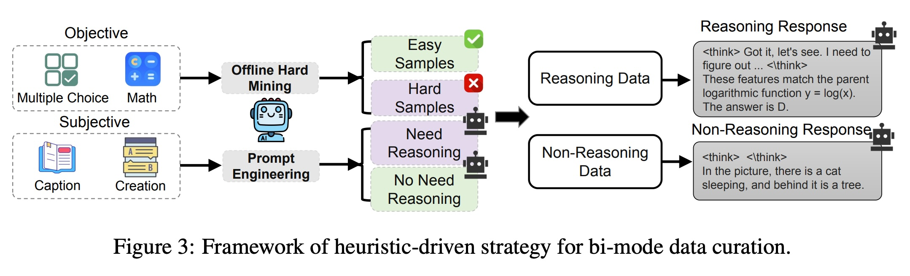

## AI论文解读 | R-4B: INCENTIVIZING GENERAL-PURPOSE AUTOTHINKING CAPABILITY IN MLLMS VIA BI-MODE ANNEALING AND REINFORCE LEARNING
        
### 作者        
digoal        
        
### 日期        
2025-09-14        
        
### 标签        
PostgreSQL , PolarDB , DuckDB , AI , 论文解读        
        
----        
        
## 背景  
      
https://arxiv.org/pdf/2508.21113        
  
提示:          
```          
读懂《R-4B: INCENTIVIZING GENERAL-PURPOSE AUTOTHINKING CAPABILITY IN MLLMS VIA BI-MODE ANNEALING AND REINFORCE LEARNING》这篇论文需要提前掌握哪些基础知识, 请使用中文通熟易懂的讲解这些基础知识, 可以引用论文中的图、表或使用Markdown支持的图形(text,mermaid等)增加解释性. 
  
使用中文通熟易懂的解读《R-4B: INCENTIVIZING GENERAL-PURPOSE AUTOTHINKING CAPABILITY IN MLLMS VIA BI-MODE ANNEALING AND REINFORCE LEARNING》这篇论文, 其中的关键内容请着重讲解, 可以引用论文中的图、表或使用Markdown支持的图形(text,mermaid等)增加解释性. 
  
提取《R-4B: INCENTIVIZING GENERAL-PURPOSE AUTOTHINKING CAPABILITY IN MLLMS VIA BI-MODE ANNEALING AND REINFORCE LEARNING》这篇论文中的重要术语, 使用中文对这些术语进行通熟易懂的讲解, 可以引用论文中的图、表或使用Markdown支持的图形(text,mermaid等)增加解释性. 
```     
  
## 1 前置知识 
  
理解这篇《R-4B》论文，您需要提前掌握以下几个核心概念。该论文的创新之处在于如何训练模型，让它能像人一样根据问题的难易度，自动选择“思考”还是“直接回答”。

下面是论文中涉及到的几个主要基础知识，我已经用通俗易懂的方式为您整理好了。

### 1. 多模态大语言模型 (MLLM)
多模态大语言模型（MLLM）是这篇论文的基础。简单来说，它是一种更聪明的AI，不仅能像普通大语言模型（LLM）一样理解和生成文本，还能同时处理图像、图表等多种信息形式。

例如，当你给它一张带图的数学题时，它能同时“看到”图片和文字，并进行综合分析。这篇论文研究的就是如何让这种模型更智能地工作。

### 2. “思考”模式与“非思考”模式
论文的核心概念是区分两种工作模式：
* **思考模式 (Thinking Mode):** 就像人在解一道复杂的数学题或推理题时，会先列出解题步骤、分析逻辑。在模型中，这表现为它会先生成一串带有 `<think>` 标签的“思考”文本，详细记录它的推理过程，然后再给出最终答案。
* **非思考模式 (Non-thinking Mode):** 就像回答一个简单问题，比如“这张图里是什么菜？”，你不需要复杂的思考，可以直接给出答案。模型会省略思考过程，直接生成答案。

该论文正是为了解决现有模型“一刀切”的问题——不管问题简单还是复杂，都用思考模式，导致浪费算力。

在论文的图2中 ，我们可以看到这两种模式的直观对比：    
* 左侧的“非思考响应”示例 ：模型看到一张麻婆豆腐的图，直接回答“这道菜叫麻婆豆腐……”，没有中间的思考过程。
* 左侧的“思考响应”示例 ：模型看到一道复杂的矩阵推理题，首先生成了 `<think> ` 标签，并在其中详细分析了图案的规律，最后才给出答案 `D`。

---

### 3. 双模退火 (Bi-mode Annealing)
这是论文的第一阶段训练方法，目的是让模型先同时掌握“思考”和“非思考”这两种能力。

* **数据准备 :** 论文作者首先构建了一个特殊的“双模数据集”，其中包含了两种类型的数据：
    * **需要推理的数据 (Reasoning Data):** 比如数学题、图表分析题等，它们的标注答案里包含了详细的思考步骤。
    * **不需要推理的数据 (Non-Reasoning Data):** 比如简单的图片描述、问答等，它们的答案是直接的。
    论文的图3详细展示了这种数据筛选策略 。   
* **模型训练 :** 就像在给学生上课时，老师把两种不同类型的题目混在一起教。这个阶段，模型同时学习这两种数据，从而获得处理不同问题的基础能力。训练后的模型被称为 R-4B-Base ，它具备了两种模式，但还不能自主判断何时使用。

---

### 4. 强化学习 (Reinforcement Learning, RL)
强化学习是一种训练模型的方法，其核心思想是让模型在与环境的互动中，通过获得“奖励”或“惩罚”来学习最优行为。

* **通俗理解：** 就像训练一只小狗，当它做出你想要的动作（比如握手）时，你给它一块零食作为奖励，它就会记住这个动作。当你给它下达一个指令时，它会不断尝试，直到找到能够获得“奖励”的正确行为。
* **在论文中：** 强化学习用于训练模型，让它学会判断何时应该进入“思考模式”才能获得更好的结果（即更高的奖励）。

### 5. 双模策略优化 (Bi-mode Policy Optimization, BPO)
这是论文的第二阶段训练方法，也是核心创新点。它是一种特殊的强化学习算法，目的是解决上一阶段中模型“思考萎缩”（thinking atrophy）的问题 ——即在复杂问题上也倾向于使用非思考模式。

* **工作原理 :** BPO 的独特之处在于，它强迫模型对于同一个输入，同时生成两种响应：思考模式的响应和非思考模式的响应 。然后，通过一个简单的规则奖励函数 ，比较这两种响应哪个更好，并据此来调整模型的策略，鼓励它在需要时“多思考”。
* **优点 :** 这种方法克服了传统强化学习需要复杂的奖励函数和大量人工标注数据的缺点 。
* **论文图6:** 形象地展示了 BPO 的工作流程：   
    1.  一个输入问题 (q) 
    2.  模型被强制生成两组响应：一组是“思考模式”的 (`o1`...`og`) ，另一组是“非思考模式”的 (`~o1`...`~og`) 。
    3.  一个“奖励规则” 会对这两组响应进行评估。
    4.  最后，模型会根据评估结果调整其策略，学会根据问题复杂性自动选择最合适的模式。

简单总结一下：要读懂这篇论文，您需要先理解多模态大语言模型的基本概念，然后掌握作者提出的两阶段训练方法：
1.  **双模退火**：让模型掌握两种能力（思考 vs. 直接回答）。
2.  **双模策略优化（BPO）**：通过强化学习，让模型学会何时使用这两种能力，从而实现“按需思考”的智能行为。

希望这些解释能帮助您更好地理解这篇论文。如果您对其中任何一个概念还有疑问，或者想了解论文的实验部分，请随时告诉我。
  
## 2 解读论文 
  
好的，我们来通俗易懂地解读一下这篇关于多模态大模型 R-4B 的论文。

### R-4B 论文解读：让 AI 学会“看情况思考”，又快又强！

#### 一句话总结

这篇论文介绍了一个名为 **R-4B** 的多模态大模型（MLLM），它能像人一样智能地判断问题的难度，**自动决定**是进行“一步步的详细思考”还是“直接给出答案”。这样一来，它在解决复杂问题时能保持高准确率，同时在处理简单问题时又非常快速和省资源，实现了性能与效率的完美平衡。

-----

### 核心要解决的问题：AI 也会“杀鸡用牛刀”

现在的很多先进多模态模型，为了解决复杂的推理问题（比如看图解数学题），都学会了一种叫“思维链”（Chain-of-Thought）的能力，也就是把解题步骤一步步地展示出来。

  * **优点**：对于难题，这种“慢思考”模式确实能显著提高准确率。
  * **缺点**：对于简单问题，比如“这张图里是什么？”或者“这道菜叫什么？”，模型还是会走一遍复杂的思考流程，这就造成了不必要的计算资源浪费和时间延迟。  这就是所谓的**计算冗余**。

**R-4B 的目标**：创造一个“会偷懒”的 AI，让它拥有“自动思考”（Auto-Thinking）的能力，遇到难题深入思考，遇到简单题直接回答。 

-----

### R-4B 的核心思想：两步走战略

为了实现这个目标，研究人员设计了一个巧妙的两阶段训练流程。我们可以用一个流程图来概括：


#### 第一阶段：双模退火 (Bi-mode Annealing) - 练就“两种武功”

这个阶段的目标是让模型**同时掌握**“思考”和“不思考”这两种回答问题的能力。

1.  **数据准备**：研究者们没有靠大量人工标注，而是巧妙地让一个更强大的模型 (Qwen2.5-32B-VL) 来自动筛选和构建数据集。  他们把问题分为两类：

      * **客观题** (如数学、选择题): 让模型尝试回答，如果屡次失败，就归为“需要推理”的难题。 
      * **主观题** (如创作、描述): 通过提示工程让大模型判断其内在难度，复杂的归为“需要推理”。 
        这个过程可以参考论文中的 **Figure 3** 。     

2.  **统一格式**：为了让模型理解这两种模式，他们设计了特殊的标签 `<think>`。

      * **思考模式**：`<think>这里是详细的推理步骤...</think>最终答案` 
      * **不思考模式**：`<think></think>最终答案` (思考标签内部为空) 

3.  **混合训练**：将这两类数据混合在一起进行训练。训练完成后，就得到了**R-4B-Base**模型。这个模型理论上已经具备了两种能力。  论文的 **Figure 4** 和 **Table 1** 展示了这个阶段庞大的训练数据构成，总计约1630万条。     

#### 第二阶段：双模策略优化 (BPO) - 学会“见机行事”

R-4B-Base 虽然身怀绝技，但它有个问题：在实际应用中，它会倾向于“不思考”，即使面对复杂问题也想直接给出答案，导致性能下降。研究者称之为 **“思维萎缩” (thinking atrophy)** 。 

为了解决这个问题，他们设计了 BPO 算法，这是一种创新的强化学习方法。

  * **核心创新点 (双模部署 Bi-mode Rollouts)**：在 BPO 训练中，对于**每一个**输入问题，**强制**模型生成两个版本的回答：一个来自思考模式，另一个来自不思考模式。 
  * **奖励机制**：然后，用一个简单的、基于规则的奖励函数（主要来自数学题的对错判断）来评估哪种回答更好。 
  * **学习过程**：通过强化学习，模型不断地对比这两种模式的优劣，逐渐学会了对于什么样的问题，采用思考模式能获得更高的“奖励”（即更可能答对）。

这个过程在论文的 **Figure 6** 中有清晰的图示。  最令人惊讶的是，尽管奖励信号只来自数学领域，但模型学到的这种“判断力”成功地泛化到了其他所有类型的任务中。    

-----

### 效果怎么样？数据说话

R-4B 的最终版本 R-4B-RL 在各项评测中表现非常出色。

#### 1\. 综合性能强大

在论文的 **Figure 1** 中，我们可以直观地看到 R-4B-RL（橙色柱）在多个权威多模态评测基准上的表现。在 MMStar、MathVerse-Vision、LogicVista 等多个榜单上，它的准确率都名列前茅，甚至超过了一些参数量远大于它的模型，比如 Kimi-VL-A3B-Thinking-2506 (16B)。 

  

> **图1 解读**: 这张图对比了 R-4B 和其他多个知名模型在不同任务上的准确率。橙色的 R-4B 经常处于第一梯队，尤其是在需要推理的 MathVerse、DynaMath 和 LogicVista 数据集上表现突出。

#### 2\. 真正实现了智能与效率的平衡

**Figure 7** 是这篇论文最有说服力的图之一。它展示了不同模式下的平均输出长度（Token 消耗量）。

  

> **图7 解读**:
> \* 在**简单任务**（如 OCRBench）上，自动思考模式（橙色）的输出长度和不思考模式（灰色）差不多，远低于强制思考模式（紫色），做到了高效。 
> \* 在**复杂任务**（如 MathVista, WeMath）上，自动思考模式的输出长度则会自动增加，接近于强制思考模式，以保证足够的推理步骤来解决问题。 

这完美证明了 R-4B-RL 确实学会了根据任务难度动态调整其“思考深度”，在保证性能的同时，最大化地节省了计算资源。 

#### 3\. 强化学习 (BPO) 效果显著

论文中的 **Figure 5** 生动地展示了 BPO 带来的巨大提升。在自动思考模式下，经过 BPO 训练的 R-4B-RL 的平均准确率（图右上方的星星）远高于未经训练的 R-4B-Base（图左下方的点）。 

  

> **图5 解读**: 这张图展示了在推理任务中，“思考触发率”与“平均准确率”的关系。R-4B-Base 模型思考得很少，准确率也低。而 R-4B-RL 学会了在需要时提高思考频率，准确率大幅提升。 

### 总结与启发

R-4B 的研究为我们展示了一条通往更智能、更高效的通用人工智能模型的清晰路径。

1.  **“自动思考”是关键**：未来的 AI 不应是“一根筋”的思考者，而应具备根据情境调整策略的灵活性。
2.  **“先培养能力，再训练判断力”**：论文提出的“双模退火 + 策略优化”的两步走框架，逻辑清晰且非常有效，为训练更复杂的 AI 行为提供了范例。
3.  **简单的规则也能产生强大的泛化能力**：BPO 仅用数学题的对错作为奖励，就让模型在所有领域都学会了何时该思考，这揭示了强化学习在激发模型通用能力方面的巨大潜力。

总而言之，R-4B 不仅是一个性能强大的模型，更重要的是，它在“如何让 AI 更智能地工作”这一核心问题上，给出了一个优雅而深刻的答案。
  
## 3 术语 
  
---
以下是《R-4B》这篇论文中几个重要的技术术语，我将它们用通俗易懂的中文为您进行解释。

### 1. **自动思考能力 (Auto-Thinking Capability)**

这是这篇论文的核心目标。它的意思不是让模型拥有人类的意识或主观思考，而是指模型能像人一样，根据问题的难易度，自动判断何时需要进行“思考”，何时可以直接给出答案。

* **通俗理解**：就像你在回答一个简单问题（例如：“地球是圆的吗？”）时，会直接回答“是”，不需要在心里列出论证步骤。但当被问到一道复杂的数学题时，你会先在草稿纸上一步步写下解题过程，最后才得出答案。这篇论文训练的模型就是为了实现这种“按需思考”的能力，避免在简单问题上浪费计算资源。

### 2. **双模退火 (Bi-mode Annealing)**

这是论文中训练模型的第一阶段方法。可以把它看作是给模型打基础，让它学会同时处理“需要思考”和“不需要思考”这两类任务。

* **通俗理解**：想象你有一个学生，既要教他做复杂的推理题，又要教他回答简单的常识问题。在“双模退火”阶段，你把两种类型的题目混合在一起，让学生同时学习。这个阶段的目标是让学生掌握两种不同的解题模式，而不是教会他如何选择。
* **论文中的实现**：论文作者构建了一个包含“思考”和“非思考”两种模式数据的特殊数据集（Bi-mode Dataset），让模型在这个数据集上进行训练。训练后的模型（R-4B-Base）就具备了两种模式的生成能力。

### 3. **双模策略优化 (Bi-mode Policy Optimization, BPO)**

这是论文的第二阶段，也是最核心的创新点。它是一种特殊的强化学习算法，专门用来训练模型如何根据问题难度，自动选择是“思考”还是“非思考”。

* **通俗理解**：如果说“双模退火”是教会学生如何做两种类型的题，那么“双模策略优化”就是教会学生如何“智能地”选择解题方法。
* **论文中的原理**：BPO 的独特之处在于，它会强制模型对同一个问题，同时给出两种回答：一种是带有思考过程的回答，另一种是直接的回答。然后，通过一个简单的规则来比较这两种回答哪个更好。如果思考后得到的答案更正确，就“奖励”模型进入思考模式；如果直接回答就足够了，就“奖励”模型直接回答。
* **强化学习**：BPO 是一种强化学习方法，但它不同于传统的复杂奖励设计，而是通过比较自身生成的两种模式的响应来学习，这让训练过程更简单高效。

---

### 4. **通用自动思考 (General-Purpose Auto-thinking)**

这个术语强调的是，模型学会的这种“自动思考”能力不是只针对特定任务（如数学或推理），而是可以应用到各种各样的任务上，包括视觉问答、图像描述、逻辑推理等。

* **通俗理解**：这种能力就像一个人的通用智能，无论遇到的是数学题、图表分析还是简单的常识问题，他都能灵活地调整自己的思维方式。这篇论文的目标就是让模型具备这种“通用性”。

通过理解以上几个术语，您就能掌握这篇论文的核心思想：即通过“双模退火”打下基础，再利用创新的“双模策略优化”方法进行强化学习，最终让模型学会根据问题的复杂性，智能地选择“思考”还是“直接回答”。
  
## 参考        
         
https://arxiv.org/pdf/2508.21113    
        
<b> 以上内容基于DeepSeek、Qwen、Gemini及诸多AI生成, 轻微人工调整, 感谢杭州深度求索人工智能、阿里云、Google等公司. </b>        
        
<b> AI 生成的内容请自行辨别正确性, 当然也多了些许踩坑的乐趣, 毕竟冒险是每个男人的天性.  </b>        
  
    
#### [期望 PostgreSQL|开源PolarDB 增加什么功能?](https://github.com/digoal/blog/issues/76 "269ac3d1c492e938c0191101c7238216")
  
  
#### [PolarDB 开源数据库](https://openpolardb.com/home "57258f76c37864c6e6d23383d05714ea")
  
  
#### [PolarDB 学习图谱](https://www.aliyun.com/database/openpolardb/activity "8642f60e04ed0c814bf9cb9677976bd4")
  
  
#### [PostgreSQL 解决方案集合](../201706/20170601_02.md "40cff096e9ed7122c512b35d8561d9c8")
  
  
#### [德哥 / digoal's Github - 公益是一辈子的事.](https://github.com/digoal/blog/blob/master/README.md "22709685feb7cab07d30f30387f0a9ae")
  
  
#### [About 德哥](https://github.com/digoal/blog/blob/master/me/readme.md "a37735981e7704886ffd590565582dd0")
  
  

  
