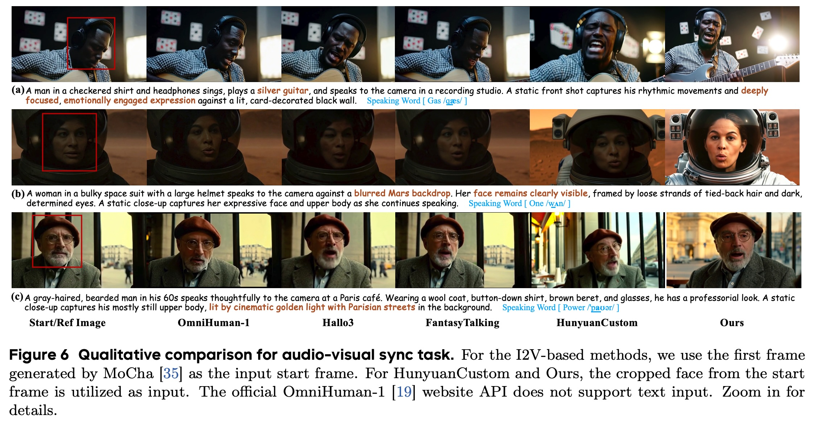

## AI论文解读 | HuMo: Human-Centric Video Generation via Collaborative Multi-Modal Conditioning
        
### 作者        
digoal        
        
### 日期        
2025-09-14        
        
### 标签        
PostgreSQL , PolarDB , DuckDB , AI , 论文解读        
        
----        
        
## 背景  
      
https://arxiv.org/pdf/2509.08519        
  
提示:          
```          
读懂《HuMo: Human-Centric Video Generation via Collaborative Multi-Modal Conditioning》这篇论文需要提前掌握哪些基础知识, 请使用中文通熟易懂的讲解这些基础知识, 可以引用论文中的图、表或使用Markdown支持的图形(text,mermaid等)增加解释性. 
  
使用中文通熟易懂的解读《HuMo: Human-Centric Video Generation via Collaborative Multi-Modal Conditioning》这篇论文, 其中的关键内容请着重讲解, 可以引用论文中的图、表或使用Markdown支持的图形(text,mermaid等)增加解释性. 
  
提取《HuMo: Human-Centric Video Generation via Collaborative Multi-Modal Conditioning》这篇论文中的重要术语, 使用中文对这些术语进行通熟易懂的讲解, 可以引用论文中的图、表或使用Markdown支持的图形(text,mermaid等)增加解释性. 
```     
  
## 1 前置知识 
  
要读懂《HuMo: Human-Centric Video Generation via Collaborative Multi-Modal Conditioning》这篇论文，你需要掌握以下几个核心概念。这篇论文建立在这些基础之上，并在此基础上提出了自己的创新点。

---

### 1. 扩散模型（Diffusion Models）与DiT

HuMo 框架的核心是基于扩散模型。你可以将扩散模型理解为一个“去噪”过程：
* **训练阶段**：模型通过不断向图片或视频中添加噪声来学习如何将其变成一团“噪音”。
* **生成阶段**：这个过程反过来，模型从一团随机的噪音开始，逐步预测并移除噪音，最终得到一张清晰的图像或一段视频。这个去噪过程就像艺术家在一张空白的画布上，通过一步步细化笔触，最终创作出一幅完整的画作。

**DiT (Diffusion Transformer)**，即“扩散模型与Transformer”的结合，是这篇论文的基础骨干网络 。它用Transformer取代了传统的U-Net架构来处理扩散过程中的数据。Transformer是一种非常强大的神经网络架构，最初用于处理自然语言，但后来被证明在处理图像、视频等序列数据上也非常有效。DiT利用Transformer的**自注意力机制（Self-Attention）**，更好地捕捉视频中每一帧之间以及帧内不同区域之间的关系，从而生成更连贯、高质量的视频 。

### 2. 潜空间（Latent Space）与VAE

在HuMo论文中，模型不是直接处理原始的高分辨率视频像素，而是先使用 **3D变分自编码器（3D VAE）** 将视频压缩到一个更紧凑、更易于处理的低维“潜空间”中 。
* **3D VAE**：它包含一个编码器（Encoder）和一个解码器（Decoder）。编码器将高维视频数据压缩成潜空间中的一个向量，而解码器则将这个向量重新还原成视频。
* **为什么要用潜空间**：直接处理高分辨率视频数据计算量巨大。将数据压缩到潜空间可以大幅减少计算量，同时保留视频中的关键信息，使得模型训练更高效。

### 3. 多模态输入与注意力机制

这篇论文的重点在于同时处理多种模态的输入：文本、图像和音频 。为了让模型能够理解并整合这些不同来源的信息，论文使用了两种关键的注意力机制：
* **自注意力（Self-Attention）**：这个机制让模型在处理一个视频帧时，能够“注意”到同一帧内的其他部分，以及视频序列中其他帧的内容 。这对于保持人物身份和场景的跨帧一致性至关重要。
* **交叉注意力（Cross-Attention）**：这是连接不同模态信息的关键。它允许模型在去噪过程中，让视频的潜在信息去“注意”文本、图像和音频中的信息，从而让生成的视频内容与这些条件对齐 。

### 4. 无分类器引导（Classifier-Free Guidance, CFG）

**无分类器引导（CFG）** 是扩散模型中一种常用的技术，用于控制生成内容的质量和对输入的遵循程度 。
* **基本原理**：在生成过程中，模型会同时进行两次去噪：一次是基于输入条件（如文本），另一次是基于无条件（即没有输入）。CFG通过计算这两次去噪结果的“差距”，并沿着这个差距方向进行调整，从而“引导”模型更倾向于生成符合输入条件的内容。
* **论文的创新**：HuMo提出了**时间自适应的CFG（Time-Adaptive CFG）** 。作者观察到，在去噪过程的不同阶段，各模态的影响力是不同的。
    * **早期去噪**（大步长，例如时间步1.0到0.98）：模型主要关注整体的语义结构和空间布局，因此此时文本和参考图像的引导权重更大 。
    * **后期去噪**（小步长，例如时间步0.98到0）：模型开始填充精细细节，如人物身份相似度和音画同步，因此此时会增加音频和图像的引导权重 。
    这种动态调整策略可以更好地平衡不同模态之间的影响，实现灵活且精细的多模态控制 。你可以参考论文中的图4，它直观地展示了这种自适应策略如何平衡文本引导和身份保留 。   

---

### 论文中的独有策略

除了上述基础知识，理解这篇论文还需要关注其针对性提出的两个训练策略：

1.  **渐进式多模态训练（Progressive Multimodal Training）**：为了解决多模态之间能力相互妥协的问题 ，HuMo采用了分阶段的训练方法 。
    * **第一阶段（Stage 1）**：主要学习文本和图像协同控制下的“人物保留任务” 。
    * **第二阶段（Stage 2）**：在此基础上，逐步加入“音画同步任务”，让模型同时学习文本、图像和音频的协同控制 。

2.  **“预测式聚焦”（Focus-by-Predicting）策略**：针对音画同步任务，传统的做法是直接将音频注意力局限于人脸区域 。但这篇论文提出一种更“柔和”的方法：在训练时，模型会学习预测人脸区域的分布，并使用这个预测结果作为一种“软性正则化” 。这鼓励模型将注意力更多地放在人脸区域，但又不会硬性限制，从而保留了模型处理全身动作和复杂互动的能力 。
  
## 2 解读论文 
  
好的，我们来通俗易懂地解读一下《HuMo》这篇关于“以人为中心的视频生成”的最新研究论文。

想象一下，你只需要提供一张照片、一段文字描述和一段音频，就能让AI生成一段视频，视频里的人不仅长得和你照片里的一样，还能按照你的文字描述做动作、变换场景，并根据你提供的音频对上口型说话。这就是这篇论文研究的目标。

这篇名为 **《HuMo: Human-Centric Video Generation via Collaborative Multi-Modal Conditioning》** 的论文，提出了一种名为`HuMo`的统一框架，旨在解决当前技术在融合文本、图像、音频这三种不同信息（多模态）来生成高质量人物视频时遇到的困难。

-----

### 一、现有技术遇到了什么“拦路虎”？

在HuMo出现之前，类似的技术或多或少都有一些“偏科”的问题。作者们指出了两个核心挑战：

1.  **“食材”稀缺且难以处理 (数据稀缺)**：要想训练一个能同时听懂三种指令（文本、图像、音频）的AI模型，就需要大量“配好对”的训练数据，即每个视频都得有精准的文字描述、对应的参考图和同步的音频。这样的高质量数据集非常稀少。 
2.  **“众口难调” (协同控制困难)**：即使有了数据，让模型同时兼顾三个方面也非常困难。 
      * 过分强调与参考图的**人物一致性**，可能会导致**口型对不上**音频。 
      * 过分追求**口型同步**，又可能导致生成的人脸**不像参考图**，或者**忽略文字描述**的指令。 

论文中的图2就很直观地展示了这个问题。与HuMo对比，其他模型要么是无法根据文字提示添加新物体（比如玩具），要么是口型对不上，要么是整体效果不佳。   

> **图2对比解读**：给定参考人像和狗的照片，以及文字描述“一个男人……在和他的黑色拉布拉多寻回犬玩耍……他扔出一个玩具”，并配上说话的音频。  
>  
>   * (b) OmniHuman-1：画面里没有出现文字描述的“玩具”。  
>   * (c) Phantom：人物动作很好，但嘴巴没动，无法匹配音频。  
>   * (d) HunyuanCustom：效果不均衡，人物动作和口型都有些问题。  
>     * **(e) HuMo**：完美地实现了所有要求，人物和狗都保持了一致性，并且根据文字生成了玩具，口型也和音频同步。   

-----

### 二、HuMo 是如何“一统江湖”的？

为了解决上述挑战，HuMo提出了一个“数据”和“训练”两手抓的协同设计方案。我们可以把它的核心思想概括为“先备好菜，再分步学”。

#### 1\. 独家“备菜”法：多模态数据处理流水线

HuMo做的第一件事就是自己“造食材”。他们设计了一套流程，专门用来构建高质量的“三合一”数据集。  这个过程有点像一个三阶段的加工厂（如下图3右侧所示）：   

> **图3解读**：左侧是HuMo模型的主体结构，右侧是其创新的数据处理和训练流程。

  * **阶段0 (Text)**：从海量视频库里，用强大的语言模型为每个视频配上详细的文字描述。 
  * **阶段1 (Text + Ref Imgs)**：为视频中的主角（人或物）匹配参考图。这里的关键在于，他们找的参考图是“**神似但形不似**”的，比如同一个人穿着不同的衣服、摆着不同的姿势，或者同一个类别的物体但颜色、形状不同。  这样做的好处是，可以教会模型“编辑”而不是“复制粘贴”，增强了文字对画面的控制力。
  * **阶段2 (Text + Ref Imgs + Audio)**：在已有数据的基础上，筛选出那些有人物说话且音画同步的视频片段，提取出音频，形成最终的“图文声”三合一数据。 

通过这个流程，HuMo为自己准备了充足且高质量的“弹药”。

#### 2\. “循序渐进”学习法：渐进式多模态训练

有了好数据，接下来就是如何让模型高效学习。HuMo没有一口气把所有任务都塞给模型，而是采用了“两步走”的渐进式训练策略。 


  * **第一步：学习“长得像” (主体保留任务)**

      * **目标**：让模型学会根据**文本+图像**生成视频，确保视频里的人和参考图是同一个人。 
      * **方法**：采用“微创”注入策略。他们没有大改模型结构，只是将参考图的信息巧妙地拼接到输入中，并且只训练模型中负责理解空间关系的“自注意力层”。  这样做最大限度地保留了原始模型强大的文生图能力。

  * **第二步：学习“说得对” (音画同步任务)**

      * **目标**：在保持第一步学会的本领不变的前提下，加入**音频**控制，实现精准的口型同步。 
      * **创新方法：“边预测边聚焦” (Focus-by-Predicting)**：之前的模型要么让音频影响整个画面，要么粗暴地只让它影响人脸区域。HuMo的做法更聪明：它加入了一个小小的“人脸位置预测器”，在训练时引导模型去注意音频和人脸区域的关系。  这就像一个“软引导”，既保证了口型同步的焦点，又没有限制模型对身体动作等其他部分的建模能力。 
      * **渐进式融合**：在这一阶段的初期，模型大部分时间仍在练习第一步的任务（比如80%的时间），只有少量时间学习新任务（20%）。随着训练的进行，新任务的比例会慢慢提高到50%。  这种平滑过渡确保了模型“温故而知新”，不会学会了说话就忘了长相。

#### 3\. 动态“指挥棒”：推理时的自适应控制策略

模型训练好了，在实际生成视频时，HuMo还有一个“杀手锏”——**时间自适应指导策略 (Time-Adaptive CFG)**。 

他们发现，在视频生成的不同阶段，三种指令的重要性是不同的：

  * **初期**：主要由**文字**主导，搭建好整个场景和人物的构图。 
  * **后期**：则需要更关注**图像**和**音频**，精雕细琢人物的相貌细节和口型同步。 

因此，HuMo会动态地调整三种指令的“权重”。就像一个经验丰富的导演，在拍摄的不同阶段会给不同部门下达不同强度的指令，从而实现了语义、身份和口型的完美平衡。 

-----

### 三、HuMo 的效果有多惊艳？

论文通过大量的实验证明，HuMo不仅做到了“三项全能”，而且在各个单项上都超越了那些“偏科”的专业模型。 

  * **在“主体保留”任务上 (对比表1和图5)**：HuMo在视频的美学质量、文本遵循能力和人物一致性方面都名列前茅。  比如在图5(b)中，当要求生成四个不同的人时，HuMo是唯一能准确生成且保持四人身份的模型。      
  * **在“音画同步”任务上 (对比表2和图6)**：HuMo同样表现出色。特别值得一提的是，其他很多模型需要一张包含完整人物和背景的“起始帧”图片，而HuMo只需要一张简单的脸部参考图就能生成包含复杂背景和动作的视频，并且文本控制力更强（比如根据文字生成了“银色吉他”）。      

| 任务类型 | HuMo表现 | 引用 |
| :--- | :--- | :--- |
| **主体保留** | 在视频质量、文本遵循、主体一致性上全面超越对比模型。 |  |
| **音画同步** | 在美学质量和文本遵循上得分最高，同时音画同步效果优于多数开源模型。 |  |

-----

### 总结

总的来说，HuMo框架通过**创新的数据处理流程**、**循序渐进的训练方法**以及**动态智能的推理策略**，成功地攻克了在视频生成中协同控制文本、图像和音频这三大难题。它不仅建立了一个统一而强大的“以人为中心”的视频生成框架，其生成的视频在**身份一致性**、**文本控制力**和**音画同步**三个方面都达到了业界领先水平，为未来个性化、高效率的短视频内容创作提供了巨大的想象空间。
  
## 3 术语 
  
要读懂《HuMo: Human-Centric Video Generation via Collaborative Multi-Modal Conditioning》这篇论文，你需要理解以下几个重要的术语和核心概念：

-----

### 1\. 以人为中心的视频生成 (Human-Centric Video Generation, HCVG)

**通俗解释**：这篇论文关注的是一种特殊的视频生成任务，即“以人物为中心”的视频生成。你可以把它想象成一个“虚拟导演”，你告诉它一个剧本（比如“一个男人在跳舞”），给它一个演员的照片（这个男人的脸），甚至给他一段音频（比如一段歌声），然后这个导演就能自动生成一段视频，视频中的人物就是你指定的那个，并且他的动作、表情、口型都和你的要求完全吻合。

### 2\. 协同多模态条件控制 (Collaborative Multi-Modal Conditioning)

**通俗解释**：这个术语是HuMo框架的核心。这里的“多模态”指的是多种不同类型的信息，比如**文本、图像和音频**。而“协同”意味着这些信息不是各自为战，而是相互配合、共同作用，来指导视频的生成。

你可以用一个简单的类比来理解：

  * **文本** (`text`)：像剧本，告诉你视频的大概内容（“一个男人在唱歌”）。
  * **参考图像** (`image`)：像角色照片，确保视频中的人物长得和你指定的一样。
  * **音频** (`audio`)：像背景音乐或台词，控制人物的口型和动作节奏。

这篇论文的创新点在于，它解决了如何让这三种不同的“导演指令”有效配合，而不是相互冲突，最终生成高质量的视频。

-----

### 3\. 渐进式多模态训练范式 (Progressive Multimodal Training Paradigm)

**通俗解释**：为了让模型同时处理好多种复杂任务，HuMo没有一股脑地把所有任务都扔给模型，而是采用了“分阶段学习”的方法。这就像我们学习一门新技能，总是从简单到复杂。

这个训练过程分为两个阶段：

  * **第一阶段**（主攻“**人物保留**”）：模型主要学习如何结合**文本和参考图像**来生成视频。这个阶段的目标是让模型能稳定地生成与描述和人物身份相符的视频，这为后续更复杂的任务打下基础。
  * **第二阶段**（加入“**音画同步**”）：在第一阶段的基础上，模型开始引入**音频**作为新的条件。这时，模型不仅要保证人物身份和场景正确，还要学会让人物的嘴型、表情与音频内容精确同步。

这个“渐进式”的方法，使得模型可以逐步学习，避免了在复杂任务上的能力相互妥协。

-----

### 4\. 最小侵入式图像注入策略 (Minimal-Invasive Image Injection Strategy)

**通俗解释**：在用参考图像来控制生成人物时，一个常见的问题是，直接“注入”图像信息可能会破坏模型本来强大的文本理解和生成能力。这就像给一个画家一张照片作为参考，结果他画出的作品虽然人物很像，但完全失去了原有的创意和风格。

HuMo提出的“最小侵入式”策略，旨在以最不影响模型原有能力的方式来使用参考图像。具体来说，它不是在模型所有层都注入图像信息，而是只在**特定、关键的层**进行“微量”的信息注入。这使得模型在**保留人物身份**的同时，依然能**忠实地遵循文本指令**。

-----

### 5\. 预测式聚焦 (Focus-by-Predicting)

**通俗解释**：这个策略主要用于解决“音画同步”的问题。我们知道，音频信息（比如说话声）主要与视频中的人脸和嘴部相关。传统的做法是直接告诉模型：“只看人脸区域”。但这太死板了，如果人物有全身动作，这种硬性限制就会导致信息丢失。

HuMo的方法更巧妙：它让模型自己**预测人脸的位置**，并根据这个预测结果，**软性地**引导模型将更多注意力放在这个区域。

你可以看下面的示意图，它展示了这个“预测式聚焦”的理念：


这个策略的好处在于，它既确保了音画同步，又没有硬性地把模型的注意力锁死，从而保留了处理复杂全身动作的能力。

-----

### 6\. 时间自适应无分类器引导 (Time-Adaptive Classifier-Free Guidance, CFG)

**通俗解释**：CFG是扩散模型中的一个重要技术，用于控制生成结果与输入条件（如文本）的匹配程度。HuMo在此基础上加入了“时间自适应”的概念。

这个概念基于一个观察：在视频生成过程中，不同阶段，不同模态的影响力应该不同。

  * **在生成初期**（视频还是“模糊草稿”时），模型需要更多地依赖**文本和参考图像**，来确定视频的整体内容、场景和人物身份。
  * **在生成后期**（视频开始填充细节时），模型需要更多地依赖**音频**，来精细地调整人物的口型、表情，实现精确的音画同步。

因此，HuMo的CFG会根据生成过程的进度（时间步），**动态地调整**不同模态的引导权重。这使得模型可以在正确的时间使用正确的条件，实现更灵活、更高质量的多模态控制。
  
## 参考        
         
https://arxiv.org/pdf/2509.08519    
        
<b> 以上内容基于DeepSeek、Qwen、Gemini及诸多AI生成, 轻微人工调整, 感谢杭州深度求索人工智能、阿里云、Google等公司. </b>        
        
<b> AI 生成的内容请自行辨别正确性, 当然也多了些许踩坑的乐趣, 毕竟冒险是每个男人的天性.  </b>        
  
    
#### [期望 PostgreSQL|开源PolarDB 增加什么功能?](https://github.com/digoal/blog/issues/76 "269ac3d1c492e938c0191101c7238216")
  
  
#### [PolarDB 开源数据库](https://openpolardb.com/home "57258f76c37864c6e6d23383d05714ea")
  
  
#### [PolarDB 学习图谱](https://www.aliyun.com/database/openpolardb/activity "8642f60e04ed0c814bf9cb9677976bd4")
  
  
#### [PostgreSQL 解决方案集合](../201706/20170601_02.md "40cff096e9ed7122c512b35d8561d9c8")
  
  
#### [德哥 / digoal's Github - 公益是一辈子的事.](https://github.com/digoal/blog/blob/master/README.md "22709685feb7cab07d30f30387f0a9ae")
  
  
#### [About 德哥](https://github.com/digoal/blog/blob/master/me/readme.md "a37735981e7704886ffd590565582dd0")
  
  

  
