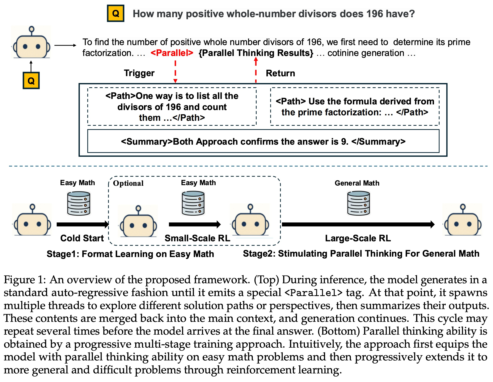
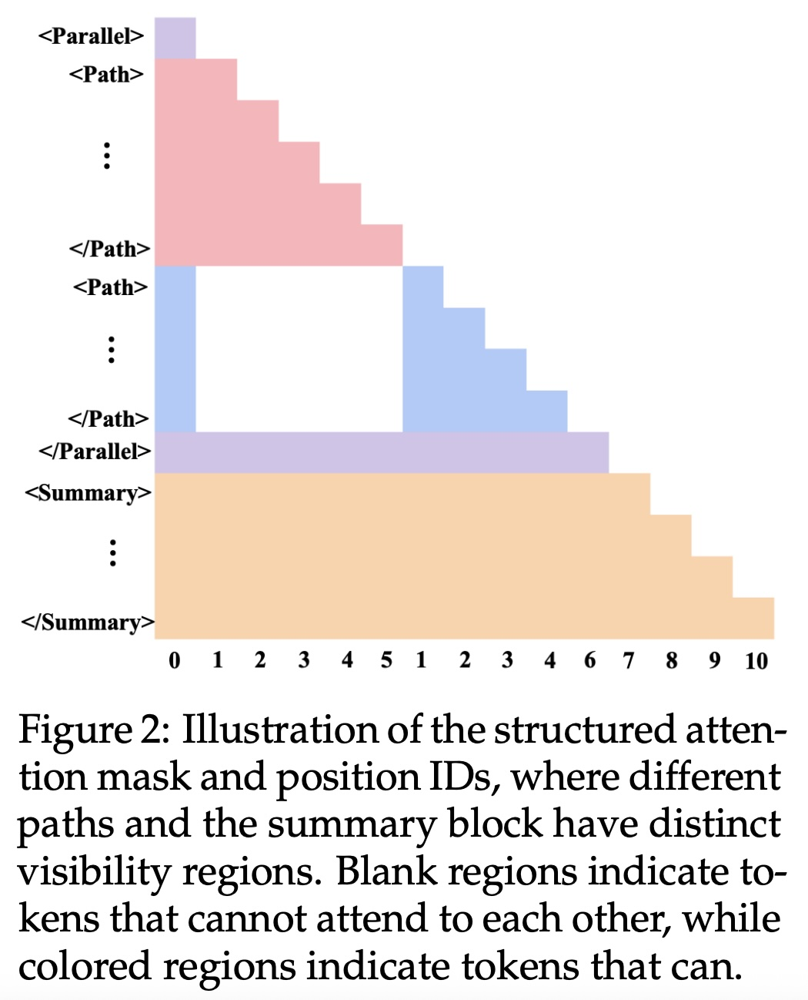
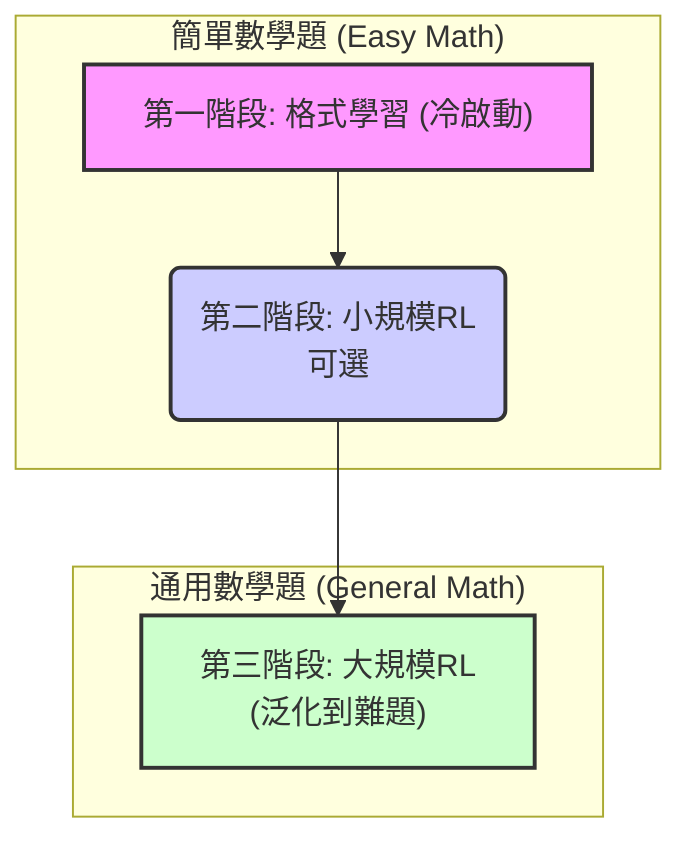
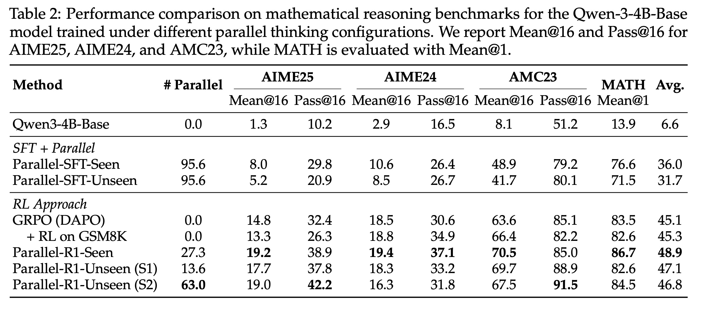
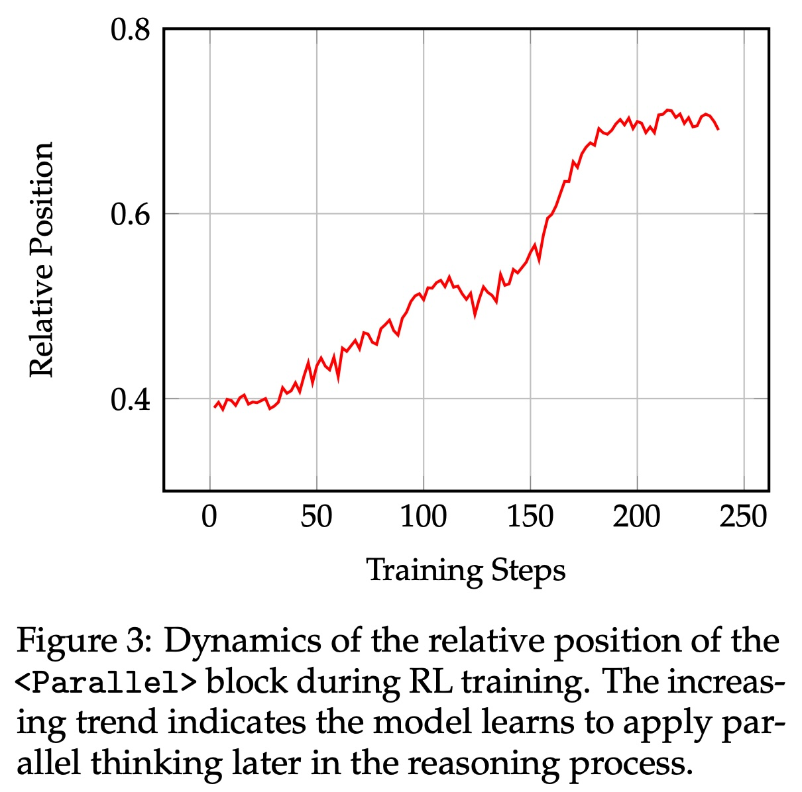
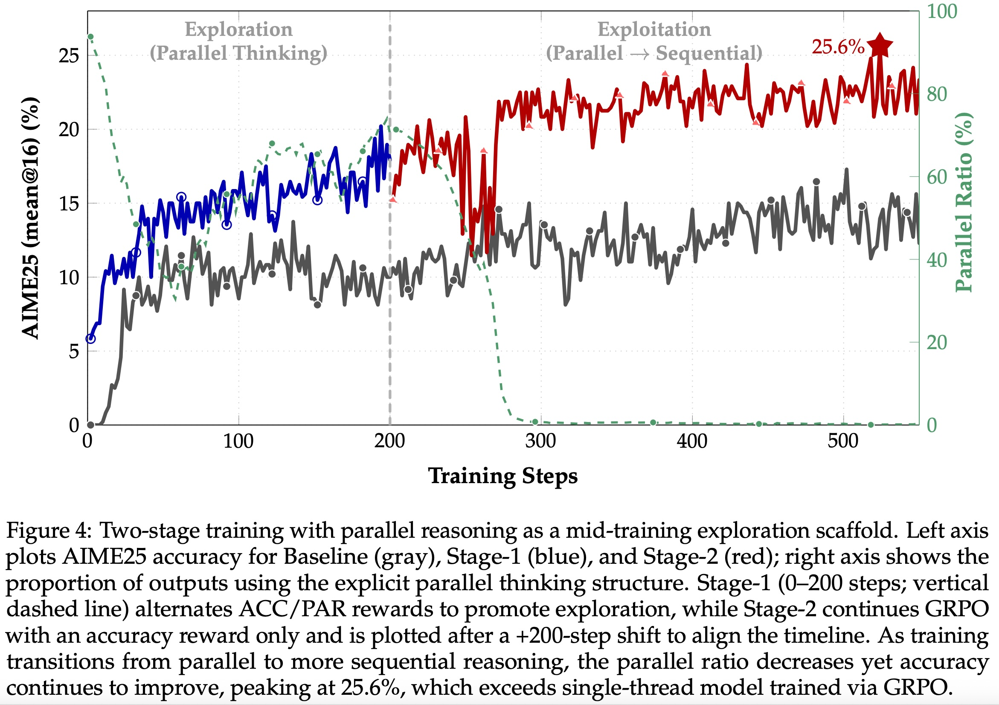

## AI论文解读 | Parallel-R1: Towards Parallel Thinking via Reinforcement Learning
        
### 作者        
digoal        
        
### 日期        
2025-09-14        
        
### 标签        
PostgreSQL , PolarDB , DuckDB , AI , 论文解读        
        
----        
        
## 背景  
      
https://arxiv.org/pdf/2509.07980        
  
提示:          
```          
读懂《Parallel-R1: Towards Parallel Thinking via Reinforcement Learning》这篇论文需要提前掌握哪些基础知识, 请使用中文通熟易懂的讲解这些基础知识, 可以引用论文中的图、表或使用Markdown支持的图形(text,mermaid等)增加解释性. 
  
使用中文通熟易懂的解读《Parallel-R1: Towards Parallel Thinking via Reinforcement Learning》这篇论文, 其中的关键内容请着重讲解, 可以引用论文中的图、表或使用Markdown支持的图形(text,mermaid等)增加解释性. 
  
提取《Parallel-R1: Towards Parallel Thinking via Reinforcement Learning》这篇论文中的重要术语, 使用中文对这些术语进行通熟易懂的讲解, 可以引用论文中的图、表或使用Markdown支持的图形(text,mermaid等)增加解释性. 
```     
  
## 1 前置知识 
  
读懂《Parallel-R1: Towards Parallel Thinking via Reinforcement Learning》这篇论文，你需要先了解几个核心概念。这篇论文提出了一种通过 **强化学习（RL）来训练大语言模型（LLMs）使其具备并行思维** 能力的方法，以此解决传统 **监督微调（SFT）** 方法的局限性。

下面我将分点为您通俗易懂地讲解这些基础知识：

-----

### 1\. 什么是并行思维？

并行思维是一种新的推理方式，它让大语言模型在解决问题时，可以同时探索多个不同的思考路径或解题方案，而不是只沿着一条路径走到底 。这种方式类似于人类在面对难题时，会同时考虑多种可能性，最终综合这些想法得出结论 。

在论文中，并行思维通过三个特殊的标签来实现：

  * `<Parallel> ... </Parallel>`：这个标签标志着并行思维的开始和结束。
  * `<Path> ... </Path>`：这个标签包裹着一条独立的思考路径。
  * `<Summary> ... </Summary>`：这个标签用于总结和整合不同思考路径的发现，并将其结果融入到主推理链中。

下图（来自论文 Figure 1）直观地展示了并行思维的工作流程：当模型遇到一个复杂问题时，它会生成 `<Parallel>` 标签，然后启动多个独立的 `<Path>` 来并行探索不同的解法。最后，它会用一个 `<Summary>` 来汇总这些路径的结果，并继续进行主推理 。   

-----

### 2\. 什么是强化学习（RL）？

强化学习是一种机器学习范式，它让智能体在一个环境中通过**试错**来学习。智能体会根据其行为获得**奖励（reward）或惩罚**，目标是最大化累积奖励 。

这篇论文的核心贡献就是将强化学习应用到大语言模型的并行思维训练上 。与传统的 **监督微调（SFT）** 相比，RL的优势在于：

  * **探索和泛化**：RL鼓励模型探索新的、未见过的行为，而不仅仅是模仿预先生成好的数据 。
  * **可扩展性**：它不需要为每个新任务都去人工标注或生成大量高质量数据 。

在训练过程中，模型会根据其生成的思考路径和最终答案的正确性来获得奖励。例如，如果模型成功使用了并行思维并且得到了正确答案，它会获得更高的奖励 。

-----

### 3\. 什么是监督微调（SFT）？

**监督微调**是一种基于大规模标注数据的训练方法 。它的工作方式是：

1.  首先，准备一个包含输入（问题）和输出（标准答案或推理过程）的数据集。
2.  然后，让模型学习模仿这些数据，本质上是进行“行为克隆” 。

论文指出，SFT在训练并行思维时存在两大问题：

  * **数据依赖**：SFT的效果完全取决于高质量训练数据的可用性 。对于复杂的、现实世界的问题，生成高质量的并行思维数据非常困难且成本高昂 。
  * **缺乏泛化**：由于SFT只是模仿既定模式，模型可能学会“表面匹配”，而没有真正内化并行思维的能力，这限制了其在解决新问题时的泛化能力 。

-----

### 4\. 什么是“冷启动”问题和渐进式课程？

“冷启动”问题是指，当一个模型从未见过某种行为（例如并行思维）时，它在强化学习的探索阶段无法自主生成这种行为，因此无从学习 。

为了解决这个问题，论文提出了一个**渐进式课程**的训练框架，分为三个阶段（见下图，论文 Figure 1底部）：   

1.  **冷启动阶段**：首先，使用监督微调在**简单的数学问题**（例如GSM8K数据集）上对模型进行训练 。由于简单任务的数据易于生成，这一步旨在让模型学习并掌握并行思维的**基本格式**（即前面提到的 `<Parallel>` 等标签的使用）。
2.  **简单数学任务上的RL**：在模型初步掌握格式后，进一步使用强化学习在同一批简单问题上进行训练 。这一步通过奖励机制来稳定和增强模型的并行思维能力。
3.  **通用数学任务上的RL**：最后，将模型转移到更**困难、更复杂**的问题（例如DAPO数据集）上进行强化学习 。此时，模型已经具备了并行思维的基本能力，RL可以帮助它探索更高级的策略，并将该能力泛化到更具挑战性的任务中 。

-----

### 5\. 什么是结构化模型和因果模型？

这篇论文还探讨了两种不同架构的模型：**因果模型（Causal Model）和结构化模型（Structured Model）**。

  * **因果模型**：这是指标准的、没有修改过的模型架构 。它的注意力机制允许一个思考路径中的信息“泄漏”到另一个路径中，这可能导致不同路径之间的梯度相互干扰 。
  * **结构化模型**：这种模型在架构上进行了修改，以强制实现思考路径的**隔离** 。它通过两种机制实现这一点：
      * **路径窗口掩码（Path-window masking）**：限制每个路径中的token只能关注自己路径内的token和共享上下文的token，防止跨路径的信息泄漏 。
      * **多重宇宙位置编码（Multiverse position encodings）**：为每个路径分配独立的位置索引，确保位置嵌入不会重叠 。

下图（来自论文 Figure 2）展示了结构化模型的注意力机制：不同路径（Path）和总结（Summary）区域有各自独立的可见区域，空白区域表示不可互相注意到的部分 。   

通过了解这些基础知识，您将能更好地理解论文中提出的训练框架、实验设计以及其对大语言模型推理能力提升的贡献。
  
## 2 解读论文 
  
好的，這就為您通俗易懂地解讀《Parallel-R1: Towards Parallel Thinking via Reinforcement Learning》這篇論文。

### 論文核心思想：教大型語言模型（LLM）學會「三思而後行」

想像一下，當我們人類解決一個複雜問題時，腦中常會同時冒出好幾種不同的解法或思路，然後再比較、總結，找出最好的那條路。這種能力被稱為「平行思維」（Parallel Thinking）。這篇論文的目標，就是**教會大型語言模型（LLM）掌握這種高級的、類似人類的平行思維能力**。

傳統的模型大多是「一條路走到黑」的「循序思維」（Sequential Thinking），容易鑽牛角尖。而平行思維能讓模型同時探索多種可能性，避免過早鎖定一個可能錯誤的方案，從而提升解決複雜問題（特別是數學題）的準確率和魯棒性 。

該論文的主要貢獻是提出了**首個利用強化學習（Reinforcement Learning, RL）來從零開始教會模型進行平行思維的框架，名為 Parallel-R1** 。

-----

### 面臨的挑戰：為什麼教模型平行思維這麼難？

研究者們發現，想讓模型學會平行思維，主要有三大障礙：

1.  **冷啟動問題（Cold-Start Problem）**：現在的語言模型在預訓練時，看的都是常規的、單線程的文本。它們從未見過像平行思維那樣「一個問題，多種解法」的格式 。你直接讓它用強化學習去探索，它根本就不知道要生成這種格式的內容，學習就無從談起 。
2.  **高品質數據稀缺**：自然語言中，很少有人會把腦中的平行思考過程完整地寫下來 。人工去標註這種數據又太貴。用模型自己生成呢？論文發現，對於簡單問題（如小學數學 GSM8K），模型還能勉強生成一些像樣的平行思維數據；但一遇到複雜問題（如 DAPO 數據集），成功率直接降為零 。
3.  **如何獎勵模型？**：在強化學習中，獎勵設計至關重要 。如果只獎勵最終答案的正確性，模型可能會為了走捷徑而放棄使用更複雜但可能更有益的平行思維 。但如果強制模型必須使用平行思維，它又可能在不必要的地方亂用，反而影響效率和準確率 。

-----

### Parallel-R1 框架：三步走，循序漸進學會平行思維

為了解決上述挑戰，論文設計了一個巧妙的漸進式課程（Progressive Curriculum）。這個過程可以參考論文中的圖 1（下半部分）：  



  

*基於圖 1（下）的訓練流程示意圖* 

1.  **第一階段：冷啟動與格式學習 (Cold-Start Stage)**

      * **目標**：先讓模型「認識」平行思維長什麼樣。
      * **方法**：研究者利用一個強大的模型，在**簡單的**數學問題（GSM8K）上生成了大量帶有平行思維結構的解答 。然後用這些數據對模型進行監督式微調（SFT） 。這一步就像是給學生看範文，讓他先學會基本的格式和樣子，解決「冷啟動」問題 。

2.  **第二階段：在簡單任務上強化 (RL on Easy Math)**

      * **目標**：讓模型不僅認識格式，還能穩定地生成它。
      * **方法**：在上一步的基礎上，繼續在簡單數學題上進行小規模的強化學習 。這裡的獎勵機制很特別： $R\_{final} = R\_{\\langle Parallel\\rangle} \\times R\_{acc}$ 。意思是，**只有當模型同時使用了平行思維並且答案正確時，才能得到正獎勵 (+1)**，否則就是負獎勵 (-1) 。這一步是為了鞏固模型的格式能力。

3.  **第三階段：在困難任務上泛化 (RL on General Math)**

      * **目標**：將平行思維的能力遷移到更複雜、更通用的數學難題上。
      * **方法**：使用更大規模、更難的數學數據集（DAPO），用強化學習進行訓練 。此時，獎勵機制變得很純粹：**只看最終答案是否正確** 。因為模型已經掌握了平行思維這個「工具」，現在的目標是學會如何利用這個工具來解決真正的難題 。

-----

### 關鍵技術細節

#### 1\. 平行思維的格式化表達

模型如何觸發和組織平行思維呢？論文定義了三個特殊的控制標籤，如圖 1（上半部分）所示：   

  * `<Parallel>` ... `</Parallel>`：標記平行思維區塊的開始和結束 。
  * `<Path>` ... `</Path>`：在這個區塊內，每一條獨立的思考路徑都由這對標籤包裹 。
  * `<Summary>` ... `</Summary>`：在所有路徑結束後，模型需要生成一個總結，綜合各路徑的結論 。

在推理時，模型會正常生成文本，一旦生成 `<Parallel>` 標籤，就會暫停主線程，並行地生成多個 `<Path>` 內的內容，最後匯總成 `<Summary>`，再繼續主線程的推理 。

#### 2\. 兩種模型變體：Seen vs. Unseen

論文還探索了兩種實現方式：

  * **Parallel-R1-Seen（因果模型）**：不改變模型原始的注意力架構 。優點是簡單直接，但不同思考路徑之間可能會互相「偷看」，信息會洩漏 。
  * **Parallel-R1-Unseen（結構化模型）**：修改了模型的注意力機制（如圖 2 所示），強制不同的 `<Path>` 之間在計算時相互隔離，不能互相關注 。這樣能保證思考路徑的獨立性，但訓練起來更困難，因為對格式的要求極其嚴格 。   

#### 3\. 創新的獎勵機制：交替獎勵

對於結構更複雜的 `Unseen` 模型，研究者發現簡單的獎勵機制效果不好。因此，他們提出了一種**交替獎勵策略 (Alternating reward strategy)** 。具體來說，訓練過程中每 10 步：

  * 有 8 步（80%）只獎勵最終答案的正確性 ( $R\_{acc}$ ) 。
  * 另外 2 步（20%）採用分層獎勵：
      * 使用平行思維且答案正確：獎勵 +1.2 。
      * 未使用平行思維但答案正確：獎勵 +1.0 。
      * 答案錯誤：懲罰 -1.0 。

這種設計巧妙地在「追求正確答案」和「鼓勵使用平行思維」之間取得了平衡，效果顯著 。

-----

### 實驗結果與驚人發現

實驗結果（如表 2）表明，**Parallel-R1 框架在多個數學基準測試中都顯著優於傳統的強化學習方法** 。例如，`Parallel-R1-Seen` 模型的平均分達到了 48.9，高於基線模型的 45.1 。   

更有趣的是論文的兩大核心發現：

> **核心發現 1：模型思維模式的演化**   
> 隨著強化學習的進行，模型使用平行思維的策略發生了明顯轉變。  
> * **訓練早期**：模型像個「莽撞的探索者」。它在解題的**開頭**就使用平行思維，同時計算多條路徑，希望能撞大運找到一條能走通的路 。  
> * **訓練後期**：模型變成了「謹慎的驗證者」。它傾向於先用自己最有信心的單一思路把題目解完，得到一個答案後，在解題的**結尾**才使用平行思維，從多個角度來驗證這個答案是否可靠 。  
>  
> 論文中的圖 3 直觀地展示了這一點：`<Parallel>` 標籤在解答中的相對位置隨著訓練步數的增加而穩步後移。  

  (此為對圖 3 的文字轉述和示意，原圖顯示 `<Parallel>` 塊的相對位置隨訓練步數增加而增大 )       

> **核心發現 2：平行思維作為一種「訓練腳手架」**  
> 這可能是本文最深刻的洞見。研究者發現，平行思維本身不僅僅是個推理工具，更是一種**高效的結構化探索機制**，可以幫助強化學習達到更高的性能上限 。  
>  
> 他們設計了一個兩階段訓練實驗（如圖 4 所示）：  
> 1.  **探索階段 (0-200 步)**：使用交替獎勵，**強制**模型高頻率地使用平行思維，充分探索解題空間 。  
> 2.  **利用階段 (200 步後)**：切換為只獎勵最終答案的模式，讓模型在探索到的廣闊空間中尋找最優解 。  
>   
> 結果如圖 4 所示，在進入第二階段後，儘管模型使用平行思維的頻率（綠線）下降了，但解題的準確率（紅線）反而持續攀升，最終達到了 25.6% 的峰值，顯著超過了從頭到尾只用單線程推理的基線模型 。這證明，**短暫地強制模型進行平行探索，就像是為施工搭建了一個「腳手架」，雖然最終會被拆除，但它幫助模型達到了原本難以企及的高度** 。  

-----

### 總結

《Parallel-R1》這篇論文不僅僅是提出了一個提升模型數學能力的新方法，它更深層次的貢獻在於：

  * **開創性地設計了一套完整的、可行的流程**，通過「課程學習」和「強化學習」相結合，成功地從零開始為 LLM 注入了複雜的平行思維能力。
  * **深刻地揭示了 LLM 在學習高級推理技能時的動態演化過程**，從初期的暴力探索到後期的謹慎驗證。
  * **提出了「平行思維作為訓練腳手架」這一極具啟發性的概念**，證明了在訓練過程中引入結構化的探索機制，能夠幫助模型突破性能瓶頸，這對未來的強化學習研究有著重要的指導意義。

總而言之，這項工作讓我們離真正能夠像人類一樣靈活、多維度思考的 AI 又近了一步。
  
## 3 术语 
  
好的，已为您整理并讲解了《Parallel-R1: Towards Parallel Thinking via Reinforcement Learning》这篇论文中的几个重要术语。这些概念是理解这篇论文核心思想的关键。

-----

### 1\. 并行思维 (Parallel Thinking)

**并行思维**是这篇论文提出的一个核心概念，它指的是让大语言模型（LLM）在解决复杂问题时，能够同时探索和推理多个不同的思考路径。这与传统的 **链式思考（Chain-of-Thought）** 不同，后者是沿着单一路径一步步推导。

为了实现并行思维，论文设计了三种特殊的标签：

  * **`<Parallel> ... </Parallel>`**：标记并行思考过程的开始与结束。
  * **`<Path> ... </Path>`**：包裹着每一条独立的思考路径。
  * **`<Summary> ... </Summary>`**：用于汇总、整合不同路径的发现，并将其融入最终答案。

这个过程就像一个人解决难题时，会同时考虑A、B、C等多种可能的方案，最后将这些方案的优点结合起来，或者选择最优的一个。

论文中的Figure 1清晰地展示了这一工作流程：   

-----

### 2\. 强化学习 (Reinforcement Learning, RL)

**强化学习**是一种让模型通过“试错”来学习的训练方法。模型在一个环境中采取行动，并根据行动结果获得**奖励**（做得好）或**惩罚**（做得不好）。它的目标是学习一个策略，以最大化其获得的累积奖励。

在这篇论文中，强化学习用于训练大语言模型学习“并行思维”这种行为。模型的奖励由两部分组成：

  * **答案奖励**：如果最终答案正确，获得高奖励。
  * **格式奖励**：如果模型使用了正确的并行思维格式（即 `<Parallel>` 和 `<Path>` 等标签），额外获得奖励。

与传统的监督微调相比，RL的优势在于鼓励模型进行**探索**，而不是仅仅模仿已有的数据，这有助于模型将并行思维泛化到新的、更复杂的问题上。

-----

### 3\. 监督微调 (Supervised Fine-Tuning, SFT)

**监督微调**是一种基于大规模标注数据的训练方法。你需要提供大量**问题-答案**（或**问题-推理过程**）的配对数据，然后让模型去模仿和学习这些数据。

这篇论文指出，SFT在训练并行思维时存在局限性：

  * **依赖数据**：SFT的效果完全依赖于人工标注的高质量数据，而为复杂问题生成并行思维数据非常困难且成本高昂。
  * **泛化性差**：模型只是学会了模仿，而不是真正内化了并行思维的能力，这导致其在解决新问题时表现不佳。

-----

### 4\. 渐进式课程 (Progressive Curriculum)

**渐进式课程**是论文提出的一个训练策略，旨在解决RL训练中的 **“冷启动”问题** 。

  * **冷启动问题**：当模型完全不具备某种能力（如并行思维）时，它在RL的探索阶段无法自主生成这种行为，因此无法获得奖励并进行学习。

渐进式课程通过分阶段训练来解决此问题：

1.  **SFT冷启动**：首先，在相对简单的任务上（如GSM8K）使用SFT。由于简单任务的数据易于获取，这一步让模型先学会并行思维的**基础格式和语法**。
2.  **简单任务上的RL**：在模型掌握基本格式后，在同一批简单任务上转而使用RL进行训练，通过奖励机制来强化和稳定该能力。
3.  **困难任务上的RL**：最后，将模型转移到更复杂的任务（如DAPO）上继续使用RL训练，使其能够将并行思维能力泛化到更具挑战性的问题中。

-----

### 5\. 结构化模型 (Structured Model)

**结构化模型**是这篇论文提出的一个经过修改的模型架构，用于强制实现并行思维路径之间的**隔离**。

传统的 **因果模型（Causal Model）** 在生成不同思考路径时，可能会出现信息“泄漏”，即一条路径中的信息会无意中影响到另一条路径的生成，这可能导致推理过程的混乱。

结构化模型通过两种技术解决了这个问题：

  * **路径窗口掩码 (Path-window masking)**：在注意力机制中设置“遮罩”，确保每条路径中的token只能关注自己路径内的token和共享上下文的token，防止跨路径的信息交流。
  * **多重宇宙位置编码 (Multiverse position encodings)**：为每条路径分配独立的位置编码，保证不同路径的token即使在相同位置，其位置信息也不会混淆。

论文中的Figure 2展示了结构化模型中的注意力掩码：   

-----

### 6\. 奖励模型 (Reward Model)

在强化学习的训练框架中，**奖励模型**负责评估模型的行为，并为其分配一个奖励值。在这篇论文里，奖励模型用于评估模型生成的并行思维轨迹（trajectory）的质量。

奖励模型会考虑多个因素，例如：

  * 最终答案是否正确。
  * 推理过程是否使用了正确的并行思维格式。
  * 推理路径本身是否清晰、有效。

通过这个奖励模型，RL框架可以为模型的每个生成行为提供具体的反馈，从而指导其不断优化和学习，最终掌握高质量的并行思维能力。
  
## 参考        
         
https://arxiv.org/pdf/2509.07980    
        
<b> 以上内容基于DeepSeek、Qwen、Gemini及诸多AI生成, 轻微人工调整, 感谢杭州深度求索人工智能、阿里云、Google等公司. </b>        
        
<b> AI 生成的内容请自行辨别正确性, 当然也多了些许踩坑的乐趣, 毕竟冒险是每个男人的天性.  </b>        
  
    
#### [期望 PostgreSQL|开源PolarDB 增加什么功能?](https://github.com/digoal/blog/issues/76 "269ac3d1c492e938c0191101c7238216")
  
  
#### [PolarDB 开源数据库](https://openpolardb.com/home "57258f76c37864c6e6d23383d05714ea")
  
  
#### [PolarDB 学习图谱](https://www.aliyun.com/database/openpolardb/activity "8642f60e04ed0c814bf9cb9677976bd4")
  
  
#### [PostgreSQL 解决方案集合](../201706/20170601_02.md "40cff096e9ed7122c512b35d8561d9c8")
  
  
#### [德哥 / digoal's Github - 公益是一辈子的事.](https://github.com/digoal/blog/blob/master/README.md "22709685feb7cab07d30f30387f0a9ae")
  
  
#### [About 德哥](https://github.com/digoal/blog/blob/master/me/readme.md "a37735981e7704886ffd590565582dd0")
  
  

  
