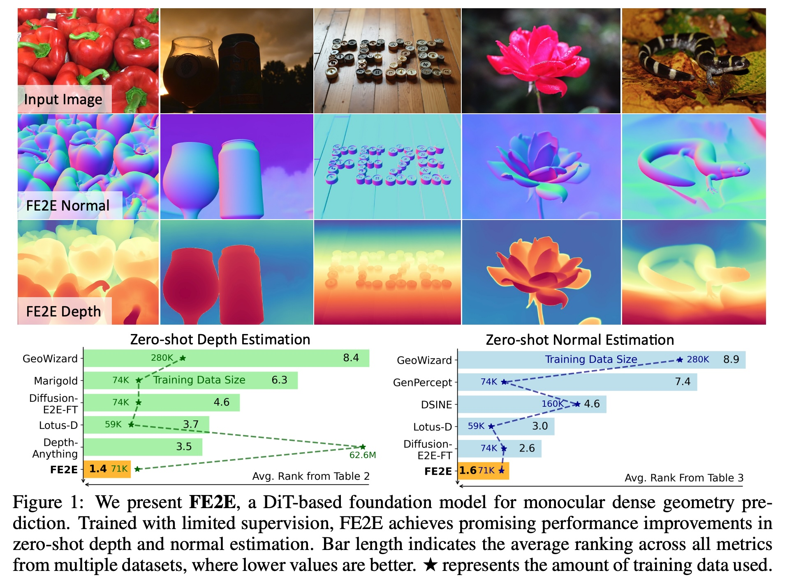
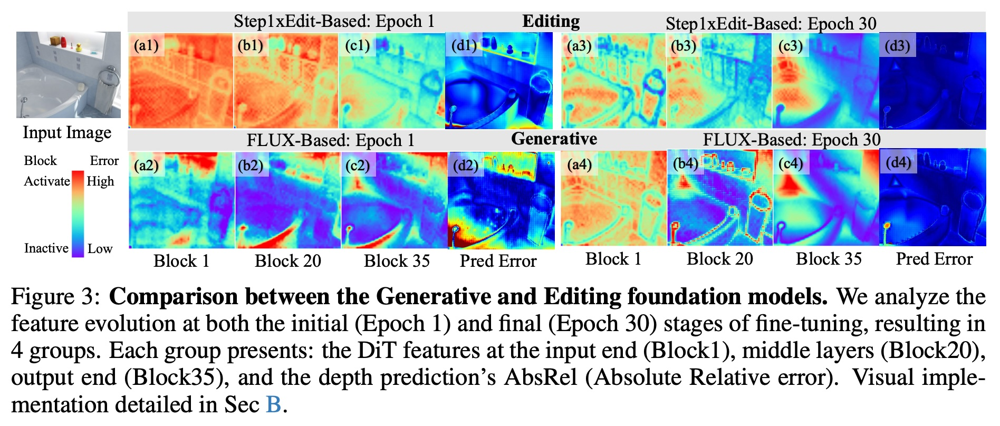
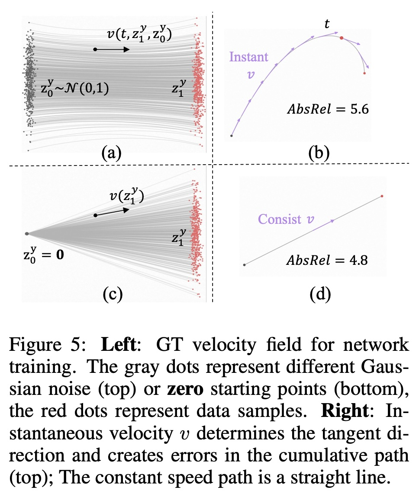
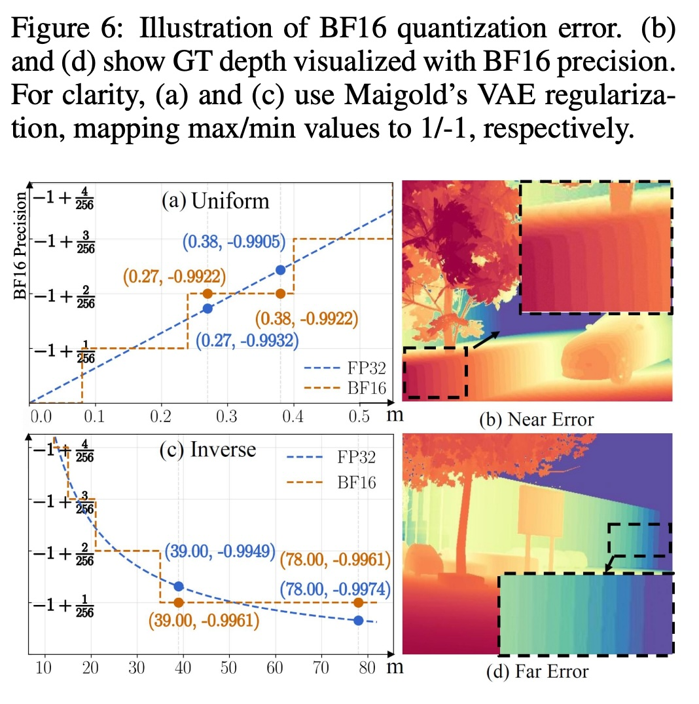
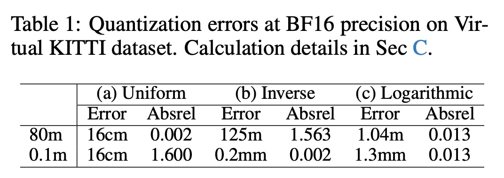
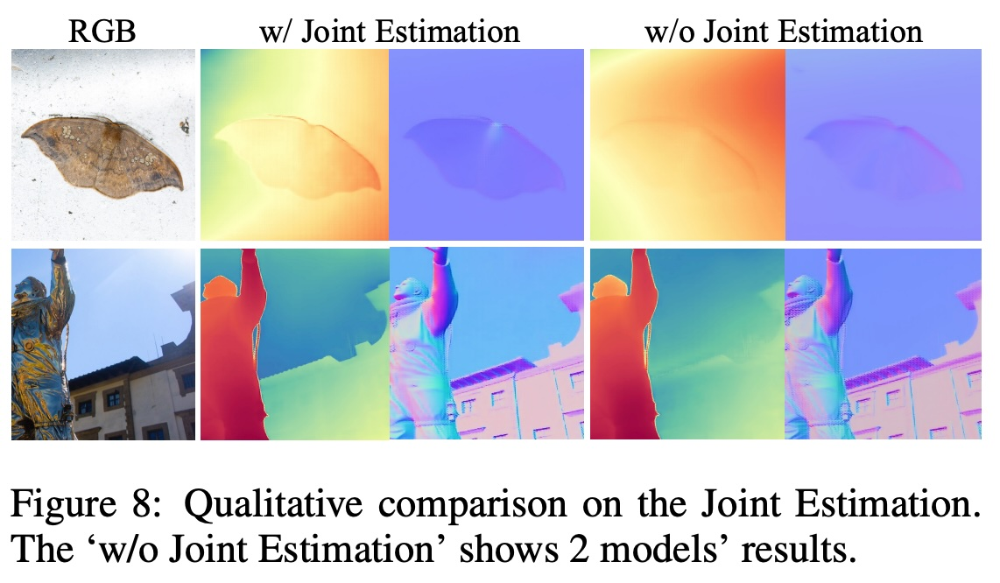
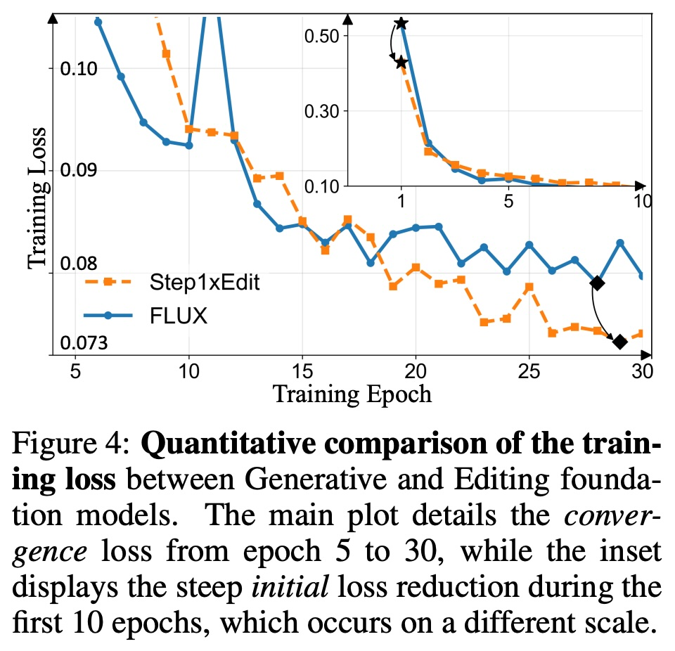
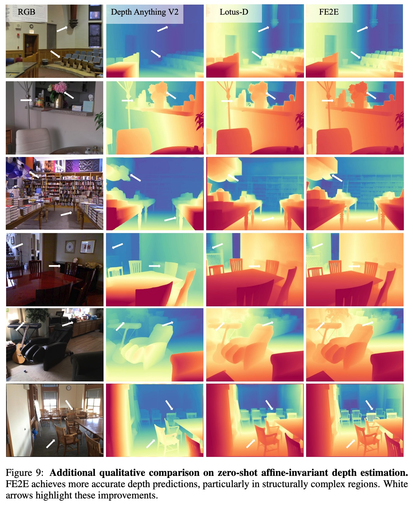

## AI论文解读 | FROM EDITOR TO DENSE GEOMETRY ESTIMATOR
        
### 作者        
digoal        
        
### 日期        
2025-09-14        
        
### 标签        
PostgreSQL , PolarDB , DuckDB , AI , 论文解读        
        
----        
        
## 背景  
      
https://arxiv.org/pdf/2509.04338        
  
提示:          
```          
读懂《FROM EDITOR TO DENSE GEOMETRY ESTIMATOR》这篇论文需要提前掌握哪些基础知识, 请使用中文通熟易懂的讲解这些基础知识, 可以引用论文中的图、表或使用Markdown支持的图形(text,mermaid等)增加解释性. 
  
使用中文通熟易懂的解读《FROM EDITOR TO DENSE GEOMETRY ESTIMATOR》这篇论文, 其中的关键内容请着重讲解, 可以引用论文中的图、表或使用Markdown支持的图形(text,mermaid等)增加解释性. 
  
提取《FROM EDITOR TO DENSE GEOMETRY ESTIMATOR》这篇论文中的重要术语, 使用中文对这些术语进行通熟易懂的讲解, 可以引用论文中的图、表或使用Markdown支持的图形(text,mermaid等)增加解释性. 
```     
  
## 1 前置知识 
  
您好！为了帮助您读懂《FROM EDITOR TO DENSE GEOMETRY ESTIMATOR》这篇论文，我为您整理并通俗地解释了需要提前掌握的核心基础知识。

---

### 1. 密集几何估计 (Dense Geometry Estimation)
这篇论文解决的核心问题是“密集几何估计”，即从一张普通的2D图片中，预测出每个像素点的三维几何信息。文中主要关注两个具体任务：

* **单目深度估计 (Monocular Depth Estimation):** 预测每个像素点到相机的距离。可以想象成给一张照片拍了一张“距离热力图”，颜色越暖（比如红色）代表距离越近，颜色越冷（比如蓝色）代表距离越远。**图1**中的"FE2E Depth"就是深度估计的结果。这个任务在增强现实（AR）和3D重建等领域非常重要 。   
* **表面法线估计 (Normal Estimation):** 预测每个像素点所在表面在三维空间中的朝向。这可以理解为，如果你把一个物体表面看作无数个微小的平面，法线就是垂直于这些平面的向量。法线信息对于理解物体的形状和光影变化至关重要。**图1**中的"FE2E Normal"就是法线估计的结果。

### 2. 生成模型与编辑模型 (Generative vs. Editing Models)
这篇论文的核心论点是：相比于从文本生成图像的**生成模型**（如Stable Diffusion），用于图像到图像（Image-to-Image）任务的**编辑模型**（如Step1X-Edit）更适合作为密集几何估计的基础。

这是因为：
* **生成模型**（Text-to-Image）擅长根据文本提示从零开始创造图像，但它们最初并没有学习如何从一张已有的图像中提取几何结构 。
* **编辑模型**（Image-to-Image）天生就需要理解输入图像，它们内部的特征本身就与几何结构高度相关 。因此，在进行密集几何估计任务的微调时，编辑模型只需要“提炼”和“聚焦”其已有的感知能力，而不是像生成模型那样需要“从头塑造”特征 。

**图3**展示了这一差异：   
* 在训练初期（Epoch 1），基于编辑模型的DiT特征（a1）已经具有结构化的几何信息，而基于生成模型的DiT特征（a2）则非常抽象且缺乏结构 。
* 在训练30个周期后，编辑模型（a3）的特征变得更加清晰和任务导向，而生成模型（a4）的特征虽然也从混乱变得有结构，但这一过程需要巨大的特征“重塑” 。

### 3. Diffusion Transformer (DiT)
DiT是这篇论文中使用的基础架构，结合了**扩散模型**和**Transformer**的优点 。
* **扩散模型 (Diffusion Model):** 一种通过逐步向数据中添加噪声来训练，然后学习如何逆向去噪的生成模型。
* **Transformer:** 一种强大的神经网络架构，最初用于自然语言处理，但因其**全局注意力机制**（Global Attention）在计算机视觉领域也取得了巨大成功。全局注意力让模型能够同时关注图像中的所有部分，捕捉长距离的依赖关系，这对于理解物体的整体几何结构非常有帮助 。

### 4. 流匹配 (Flow Matching)
这篇论文将密集几何估计视为一种特殊的“图像编辑”任务，并使用一种改进的“流匹配”方法进行训练。

* **原始流匹配 (Original Flow Matching):** 将编辑过程建模为一个从随机噪声（ $z_0^y$ ）到目标图像特征（ $z_1^y$ ）的“流”或“路径” 。模型被训练来预测这个流在不同时间点（t）的“瞬时速度”（instantaneous velocity） 。
* **论文的改进 (Consistent Velocity):** 密集几何估计是一种**确定性任务**，即输入图像只有一个唯一的正确深度图。而原始流匹配的“瞬时速度”和随机起点（ $z_0^y\sim\mathcal{N}(0,1)$ ）会引入不必要的随机性和误差 。因此，作者提出了两项改进：
    * **一致性速度 (Consistent Velocity):** 学习一个恒定速度，使流路径变成一条直线，从而避免离散化求解带来的误差 。
    * **固定起点 (Fixed Origin):** 将随机起点固定为0（ $z_0^y=0$ ），消除了优化过程中的随机性，使训练更加稳定 。
    **图5**清晰地对比了两种方法的区别，可见改进后的流匹配（c, d）如何将弯曲路径（b）变为直行路径，从而提高精度和效率 。   

### 5. 对数量化 (Logarithmic Quantization)
大多数现代生成和编辑模型使用 **BF16（BFloat16）** 精度进行训练，这对于RGB图像输出是足够的 。但是，深度图需要更高的精度，特别是在同时处理近处和远处物体时。

* **BF16的局限性:**
    * **均匀量化 (Uniform):** 如果简单地将深度值均匀映射到BF16的精度范围内，近处的微小变化（如0.1m）可能导致巨大的误差，使模型无法训练 。
    * **反向量化 (Inverse):** 虽然对近处物体精度很高，但对远处物体几乎无法区分，例如39米和78米可能被量化为同一个值 。
* **对数量化 (Logarithmic):** 为了解决这个矛盾，论文提出对深度值先进行**对数变换**（ $D_{log}=\ln(D_{GT}+1e-6)$ ），然后再进行量化 。这种方法能够同时在近距离和远距离上都保持良好的精度，完美解决了BF16精度和深度图高精度需求之间的冲突 。**图6**和**表1**直观地展示了不同量化方法的优缺点。      

### 6. 联合估计 (Joint Estimation)
深度和法线信息共同构成物体的三维几何表示，二者之间存在内在联系 。作者利用DiT架构的全局注意力机制，实现了深度和法线的**无额外成本联合估计**（Cost-Free Joint Estimation）。

* **方法:** 通过在训练时，同时在DiT模型的左右两个输出区域分别施加深度和法线的监督信号 。
* **优势:** 由于DiT的全局注意力机制，深度和法线任务的监督信号可以相互作用和增强，从而提升模型的整体性能，且无需引入额外的计算量 。这在**图8**中通过定性对比得到了验证。   
  
## 2 解读论文 
  
好的，我们来通俗易懂地解读一下《FROM EDITOR TO DENSE GEOMETRY ESTIMATOR》这篇论文。

### 引言：FE2E 是什么？

简单来说，这篇论文提出了一个名为 **FE2E (From Editor to Estimator，从编辑器到估计器)** 的新模型 。它的核心任务是**单目稠密几何预测**，也就是仅凭一张普通的2D照片，就能准确地估计出照片中每个像素点的**深度**（物体离相机的远近）和**法线**（物体表面的朝向）。

想象一下，你拍了一张房间的照片，FE2E 就能把它变成下面这样，告诉你哪里是桌子、哪里是墙，以及它们的3D形状和距离。

  

> **图解**：论文的图1展示了FE2E的效果 。输入一张普通照片（Input Image），FE2E可以生成对应的法线图（FE2E Normal）和深度图（FE2E Depth）。法线图用不同颜色表示物体表面朝向，深度图则表示远近关系。 

这篇论文最核心的贡献在于，它另辟蹊径，证明了**使用“图像编辑模型”作为基础，比传统的“图像生成模型”更适合这项任务**，并且在只用了极少量训练数据的情况下，取得了比顶尖模型（SOTA）更好的效果 。

-----

### 核心思想：为什么“图像编辑器”比“图像生成器”更适合？

在FE2E之前，很多类似的工作（如Marigold, GeoWizard）都是基于像Stable Diffusion这样的**文生图（T2I）模型**进行微调的 。这些模型擅长根据文字凭空创造图像。

但作者认为，深度估计本质上是一个**图生图（I2I）的任务：输入一张图，输出一张深度/法线图 。而图像编辑模型**（比如论文中使用的Step1X-Edit ）天生就是为I2I任务设计的，它们的核心能力是理解输入图像的结构，并在此基础上进行修改 。

> **一个比喻**：
>
>   * **图像生成器** 就像一位画家，他可以根据描述从一张白纸开始画画。让他根据一张照片画深度图，他需要从头学习照片里的结构。
>   * **图像编辑器** 就像一位修图师，他首先要深刻理解照片的内容和结构，然后才能精准地修改。这种“理解为先”的特性，天然就与几何估计任务非常契合。

论文通过实验证明了这一点：

1.  **天生的结构理解能力**：从训练一开始，编辑模型的内部特征就已经与图像的几何结构高度吻合了。而生成模型在初期，其特征是混乱且无结构的，需要花费大量精力去“重塑”自己 。

      * **证据**：如下图3所示，在训练的第一个周期（Epoch 1），编辑模型（上排 a1,b1,c1）的特征图已经能看出物体的轮廓，而生成模型（下排 a2,b2,c2）则是一片混乱。   

    > **图3解读**：编辑模型在训练初期就展现出对几何结构的理解，而生成模型需要从混乱中学习 。

2.  **更稳定高效的学习过程**：编辑模型的学习过程更像是一种“**精炼**”，是在已有结构理解的基础上进行微调，因此收敛更稳定，性能瓶颈也更高。而生成模型的学习过程是“**重塑**”，波动大且容易遇到性能瓶颈 。

      * **证据**：下图4的训练损失曲线显示，编辑模型（Step1xEdit，橙色虚线）的下降过程更平滑，最终的损失值也更低。而生成模型（FLUX，蓝色实线）则有明显的震荡 。    

-----

### 三大关键技术创新

为了将一个为通用编辑设计的模型成功适配到高精度的几何估计任务上，作者提出了三项关键改进：

#### 1\. 一致性速度流匹配 (Consistent Velocity Flow Matching)

  * **问题**：传统的扩散模型在从一个随机噪声点“走向”目标结果时，路径是**弯曲、随机**的 。在进行高精度预测时，这种弯曲的路径会因为离散近似而产生累积误差，影响精度 。
  * **解决方案**：作者对训练目标进行了简化，强制模型学习一条**笔直、固定**的路径 。
    1.  **固定起点**：将随机的噪声起点固定为0 。
    2.  **一致速度**：让模型学习一个从起点到终点的恒定“速度”，使得整个变换路径是一条直线 。
  * **好处**：这不仅消除了路径近似带来的误差，还让训练更稳定，推理速度也变得飞快 。

> **图5解读**：(a)和(b)是传统方法，路径弯曲且起点随机，导致误差(AbsRel=5.6) 。 (c)和(d)是FE2E的方法，起点固定为0，路径是直线，误差更小(AbsRel=4.8) 。

  

#### 2\. 对数标注量化 (Logarithmic Annotation Quantization)

  * **问题**：FE2E的基础模型Step1X-Edit使用`BF16`这种低精度浮点数格式进行计算，这对色彩（0-255）完全足够 。但对于深度值，范围可能非常大（例如0米到80米）。如果直接把这么大的范围线性压缩到低精度格式中，会造成巨大的精度损失。比如，0.1米和0.26米可能会被认为是同一个值，导致近处的物体变成一片“糊” 。
  * **解决方案**：作者采用了 **对数（Logarithmic）** 的方式来处理深度值 。简单来说，就是对深度值先取一个对数，再进行归一化和量化。
  * **好处**：对数尺度天然地在数值小的地方（近处）保留了更多的精度，而在数值大的地方（远处）精度稍低，这恰好符合人类视觉和大多数应用场景的需求。它在远近都能保持一个相对平衡且可接受的误差 。

| 量化方法 | 近处(0.1m)误差 | 远处(80m)误差 | 评价 |
| :--- | :--- | :--- | :--- |
| 线性(Uniform) | 1.600 (灾难性)  | 0.002  | 近处完全不可用 |
| 倒数(Inverse) | 0.002  | 1.563 (灾难性)  | 远处完全不可用 |
| **对数(Logarithmic)** | **0.013**  | **0.013**  | **远近皆优，非常均衡** |

  

> **表1解读**：该表展示了不同量化方法在`BF16`精度下的相对误差(AbsRel) 。对数量化在各种距离下都表现出色。

#### 3\. 零成本联合估计 (Cost-Free Joint Estimation)

  * **问题**：深度和法线是同一物体几何属性的两种描述，它们高度相关。如果能让它们在训练时互相借鉴、互相促进，效果会更好 。但之前的方法（如GeoWizard）为了实现这一点，引入了额外的模块，导致训练成本翻倍 。
  * **解决方案**：作者巧妙地利用了其基础模型（DiT架构）的一个特性。该模型在处理输入时，会产生一块通常被**丢弃**的输出区域 。作者发现，由于DiT的全局注意力机制，这块被丢弃的区域其实也包含了丰富的全局信息 。于是，他们将这块“废料”利用起来，用它来监督法线任务，而原本的输出区域则监督深度任务 。
  * **好处**：通过这种“变废为宝”的方式，FE2E在**一次前向传播**中就同时完成了深度和法线的预测和学习，实现了两种任务的相互增强，而**几乎没有增加任何额外的计算成本** 。

-----

### 实验结果

FE2E的表现非常惊人：

  * **深度估计**：在5个主流测试集上，FE2E的平均排名达到了**1.4**，远超所有对比方法 。特别是在ETH3D数据集上，它的关键指标(AbsRel)比之前的最优模型提升了**35%** 。
  * **数据效率**：最引人注目的是，FE2E只用了 **7.1万（71K）** 张合成图像进行训练，就超越了使用 **6260万（62.6M）** 真实图像训练的DepthAnything模型 。这充分证明了“选择正确的基础模型比盲目堆砌数据更有效” 。
  * **法线估计**：同样，在法线估计任务上，FE2E也达到了顶尖（SOTA）水平 。

> **图1中柱状图解读**：这两个柱状图比较了不同模型在深度估计（左）和法线估计（右）任务上的平均排名，**柱子越短表示性能越好** 。FE2E以绝对优势胜出。

  

### 结论

这篇论文的核心贡献可以总结为：

1.  **范式转变**：首次证明了**图像编辑模型是进行稠密几何估计任务的更优选择**，为该领域提供了新的研究方向 。
2.  **技术创新**：提出了一套行之有效的适配方案（一致性速度、对数量化、零成本联合估计），解决了将编辑模型用于高精度预测时遇到的关键难题 。
3.  **卓越性能**：在数据效率极高的情况下，实现了超越现有所有顶尖方法的性能，验证了其方法的有效性 。

总而言之，FE2E不仅仅是一个性能强大的新模型，更重要的是它提出并验证了一个全新的、更高效的解题思路。
  
## 3 术语 
  
好的，我已经为您整理并解释了《FROM EDITOR TO DENSE GEOMETRY ESTIMATOR》这篇论文中的重要术语，希望这些通俗易懂的讲解能帮助您更好地理解这篇论文。

---

### 1. 密集几何估计 (Dense Geometry Estimation)
* **概念:** 密集几何估计是一个计算机视觉任务，它的目标是从一张普通的2D图片中，为**每个像素点**都预测出其在3D空间中的几何信息。这听起来有点像给照片中的每个点都赋予一个三维“身份卡”。
* **论文中的任务:** 这篇论文主要关注密集几何估计中的两个子任务：**单目深度估计**和**表面法线估计**。

### 2. FE2E (From Editor to Dense Geometry Estimator)
* **概念:** FE2E是这篇论文提出的新模型名称。它的名字本身就概括了论文的核心思想：**将一个图像编辑器（Editor）改造成一个密集几何估计器（Dense Geometry Estimator）**。
* **核心贡献:** 论文证明，一个在图像编辑任务上训练过的模型，其内部已经学习了大量的几何信息，因此将其微调为几何估计模型会比从零开始训练或使用通用生成模型更高效、更精确。

### 3. 单目深度估计 (Monocular Depth Estimation)
* **概念:** 这是从**单张**2D图像中预测出每个像素点到相机距离的任务。结果通常是一张**深度图**，其中每个像素的灰度值或颜色代表其距离。
* **图示:** 在论文的**图1**中，"FE2E Depth"就是一张深度图的示例。通常，颜色越浅（或越亮）代表物体越近，颜色越深（或越暗）代表物体越远。   

### 4. 表面法线估计 (Surface Normal Estimation)
* **概念:** 这个任务是预测图片中每个像素点所在物体的表面在三维空间中的朝向。想象一下一个物体的表面，法线就像是垂直于这个表面的箭头。法线图通常用RGB颜色编码，分别代表X、Y、Z轴的朝向。
* **图示:** 论文的**图1**中的"FE2E Normal"就是一张表面法线图。这个信息对于理解物体的形状和光影变化非常重要。

### 5. Diffusion Transformer (DiT)
* **概念:** DiT是论文使用的**基础模型架构**。它结合了**扩散模型**和**Transformer**两种流行技术的优点。
    * **扩散模型:** 学习如何逐步去除图像中的噪声以生成清晰图像。
    * **Transformer:** 拥有强大的**全局注意力机制**，可以让模型同时关注图像中的所有部分，这对于理解物体的整体结构至关重要。

### 6. 流匹配 (Flow Matching)
* **概念:** 流匹配是一种新颖的训练方法。它将训练过程看作是“流”，即从一个起点（通常是噪声）到终点（目标图像或特征）的一条路径。模型被训练来预测在这条路径上的“速度”，从而学习如何从起点转换到终点。
* **论文的改进:**
    * **一致性速度 (Consistent Velocity):** 论文将“流”的速度设为恒定，使路径变成了一条直线，这样可以简化训练并提高效率。
    * **固定起点 (Fixed Origin):** 论文将“流”的起点固定为0，而不是随机噪声，这进一步消除了训练中的不确定性，使得模型能够更稳定地收敛。

### 7. 对数量化 (Logarithmic Quantization)
* **概念:** 这是论文中解决深度图精度问题的一项技术创新。由于深度图的数值范围很广（从近到远），如果直接使用常规的数字精度（如BF16）进行存储，就会在近处或远处损失大量的细节。
* **解决方案:** 论文提出先对深度值进行**对数变换**，再进行量化。这种做法能有效地平衡近处和远处的精度需求，确保模型在处理近距离微小差异和远距离宏观差异时都能保持准确性。
* **图示:** 论文的**图6**和**表1**清晰地展示了对数量化相比其他量化方法的优越性。      

### 8. 零样本 (Zero-shot)
* **概念:** 零样本是一种测试模型泛化能力的评估方式。它指的是模型在**没有看到任何相关训练数据**的情况下，就能够对新任务或新数据集进行预测。
* **论文中的应用:** 论文中的**图1**和**图9**都展示了FE2E在零样本深度估计上的表现。这证明了FE2E模型不仅在训练集上表现好，而且能够很好地泛化到未知场景，这对于实际应用非常重要。     

---

希望以上解释能帮助您更好地理解这篇论文。如果您对某个术语还有疑问，或者想了解论文的其他内容，请随时提出。
  
## 参考        
         
https://arxiv.org/pdf/2509.04338    
        
<b> 以上内容基于DeepSeek、Qwen、Gemini及诸多AI生成, 轻微人工调整, 感谢杭州深度求索人工智能、阿里云、Google等公司. </b>        
        
<b> AI 生成的内容请自行辨别正确性, 当然也多了些许踩坑的乐趣, 毕竟冒险是每个男人的天性.  </b>        
  
    
#### [期望 PostgreSQL|开源PolarDB 增加什么功能?](https://github.com/digoal/blog/issues/76 "269ac3d1c492e938c0191101c7238216")
  
  
#### [PolarDB 开源数据库](https://openpolardb.com/home "57258f76c37864c6e6d23383d05714ea")
  
  
#### [PolarDB 学习图谱](https://www.aliyun.com/database/openpolardb/activity "8642f60e04ed0c814bf9cb9677976bd4")
  
  
#### [PostgreSQL 解决方案集合](../201706/20170601_02.md "40cff096e9ed7122c512b35d8561d9c8")
  
  
#### [德哥 / digoal's Github - 公益是一辈子的事.](https://github.com/digoal/blog/blob/master/README.md "22709685feb7cab07d30f30387f0a9ae")
  
  
#### [About 德哥](https://github.com/digoal/blog/blob/master/me/readme.md "a37735981e7704886ffd590565582dd0")
  
  

  
