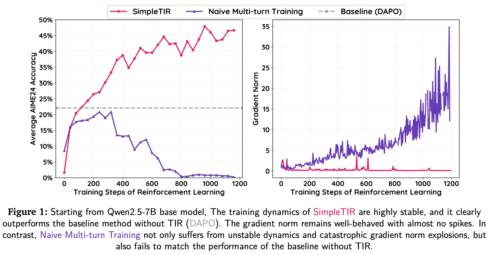
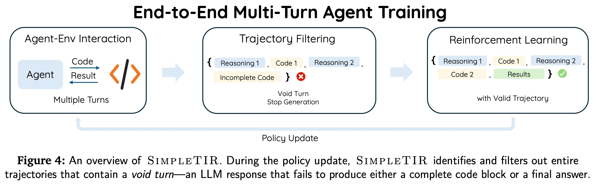
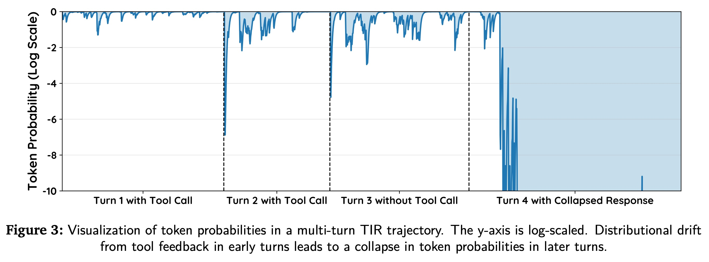
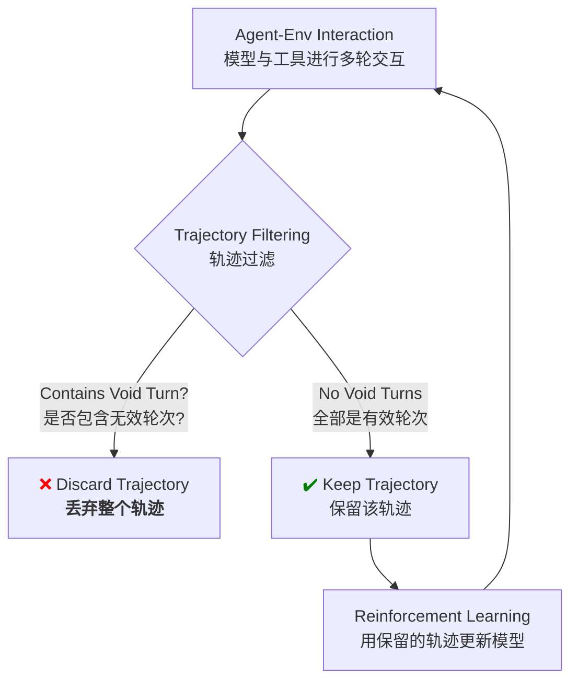
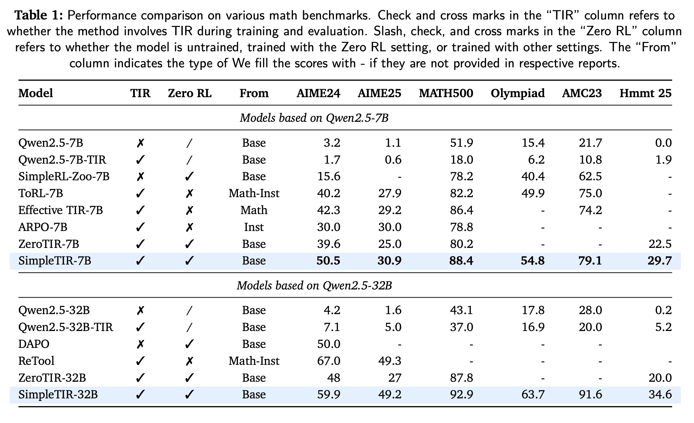
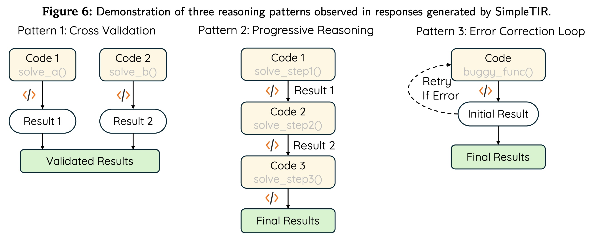
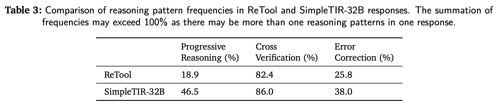

## AI论文解读 | SimpleTIR: End-to-End Reinforcement Learning for Multi-Turn Tool-Integrated Reasoning
        
### 作者        
digoal        
        
### 日期        
2025-09-14  
        
### 标签        
PostgreSQL , PolarDB , DuckDB , AI , 论文解读        
        
----        
        
## 背景  
      
https://arxiv.org/pdf/2509.02479        
  
提示:          
```          
读懂《SimpleTIR: End-to-End Reinforcement Learning for Multi-Turn Tool-Integrated Reasoning》这篇论文需要提前掌握哪些基础知识, 请使用中文通熟易懂的讲解这些基础知识, 可以引用论文中的图、表或使用Markdown支持的图形(text,mermaid等)增加解释性. 
  
使用中文通熟易懂的解读《SimpleTIR: End-to-End Reinforcement Learning for Multi-Turn Tool-Integrated Reasoning》这篇论文, 其中的关键内容请着重讲解, 可以引用论文中的图、表或使用Markdown支持的图形(text,mermaid等)增加解释性. 
  
提取《SimpleTIR: End-to-End Reinforcement Learning for Multi-Turn Tool-Integrated Reasoning》这篇论文中的重要术语, 使用中文对这些术语进行通熟易懂的讲解, 可以引用论文中的图、表或使用Markdown支持的图形(text,mermaid等)增加解释性. 
```     
  
## 1 前置知识 
  
您好！根据您提供的论文内容，要读懂《SimpleTIR: End-to-End Reinforcement Learning for Multi-Turn Tool-Integrated Reasoning》这篇论文，您需要提前掌握以下几个核心基础知识。我会用通俗易懂的中文为您进行讲解，并引用论文中的图表进行辅助说明。

-----

### 1\. 大语言模型（LLM）与工具集成推理（TIR）

首先，您需要理解 **工具集成推理（Tool-Integrated Reasoning, TIR）** 是什么。简单来说，TIR 是一种让大型语言模型（LLM）变得更强大的方法，它允许 LLM 不仅限于自身的知识库，还能通过调用外部工具来辅助推理和解决问题 。

**为什么需要TIR？**

  * **计算不准确**：LLM 在处理精确数学计算时往往表现不佳 。通过调用一个外部的 Python 解释器，LLM 可以进行精确的计算，比如 `print(5 + 3 + 1294.678)`。
  * **知识时效性**：LLM 的知识有“截止日期”（knowledge cutoffs），无法获取最新信息 。通过调用搜索引擎，它就能获取实时信息。

这篇论文关注的是一种更复杂的场景：**多轮TIR**。这意味着 LLM 不仅执行一次工具调用，而是在多个对话回合中反复地进行“推理-生成代码-执行代码-利用结果进行下一轮推理”的循环 。

-----

### 2\. 强化学习（Reinforcement Learning, RL）

这篇论文的核心是使用 **强化学习（RL）** 来训练 LLM。如果您不熟悉RL，可以把它想象成一个“学习如何做决策”的过程。

  * **智能体（Agent）**：在这里就是我们的 **LLM** 。
  * **环境（Environment）**：就是需要 LLM 解决的数学问题和它能调用的工具（例如代码解释器） 。
  * **行动（Action）**：LLM 在每一步中生成的词语（token）。
  * **奖励（Reward）**：当 LLM 成功解决问题并给出正确答案时，它会得到一个正向奖励；如果失败，则会得到一个负向奖励 。

论文将这个过程建模为一个**分层马尔可夫决策过程（Hierarchical MDP）**。可以简单理解为：

  * **高层决策**：决定在当前回合做什么，比如是继续推理，还是调用工具，还是给出最终答案 。
  * **低层决策**：在高层决策确定后，具体生成一个一个的词语（token）来完成这个回合的完整回复 。

-----

### 3\. 多轮TIR中的挑战：不稳定性与梯度爆炸

论文的核心贡献在于它识别并解决了多轮TIR训练中的一个重大问题：**训练不稳定**和**性能崩溃** 。

**问题根源**
论文指出，这种不稳定的主要原因是 **“分布漂移”（distributional drift）** 。由于外部工具返回的结果（如代码执行的输出）与 LLM 自身预训练的数据分布差异很大，当这些结果被作为新输入时，LLM 可能会生成一些 **“低概率词语”（low-probability tokens）** 。

这种“低概率词语”问题在多轮循环中会不断累积 ，最终导致两个致命后果：

1.  **梯度爆炸（Gradient Explosion）**：在训练过程中，模型的参数更新梯度会变得异常巨大，这会彻底破坏训练过程 。
2.  **信用分配错位（Misaligned Credit Assignment）**：由于奖励是稀疏的（只有在最终回答正确时才有），当一个长推理过程在最后一步因为“低概率词语”而失败时，负面奖励会惩罚整个过程，包括前面那些本来正确的推理步骤 。这会促使模型放弃多轮推理，转而选择更简单的单轮回答 。

论文中的图表形象地展示了这个问题：   
**图1：**
左图显示了在多轮TIR训练中，如果没有 SimpleTIR，模型的准确率会很快下降甚至崩溃（蓝线），而梯度（右图）则会疯狂飙升，出现剧烈的波动（蓝线）。这正是梯度爆炸的表现 。 

-----

### 4\. SimpleTIR的解决方案

针对上述问题，论文提出了一个名为 **SimpleTIR** 的解决方案 。它的核心策略非常简单且有效：**过滤掉包含“无效回合”（void turns）的轨迹** 。

**什么是“无效回合”（Void Turn）？**
一个“无效回合”指的是 LLM 的回复中既没有一个完整的代码块，也没有给出最终答案 。这通常是模型由于分布漂移而“卡住”或生成了不完整、无意义内容时的表现 。

**SimpleTIR如何工作？**
如图4所示，SimpleTIR 的流程很简单 ：   

1.  **交互过程（Agent-Env Interaction）**：LLM 像往常一样进行多轮推理和工具调用。
2.  **轨迹过滤（Trajectory Filtering）**：在训练时，SimpleTIR 会检查每一个推理轨迹。如果发现某个回合是“无效回合”，就会把整个轨迹标记为有问题（用红叉标记）。
3.  **强化学习（Reinforcement Learning）**：在进行模型参数更新时，SimpleTIR 会直接忽略所有包含“无效回合”的轨迹，只使用那些有效的、没有出现问题的轨迹来进行学习 。

通过这个简单的过滤步骤，SimpleTIR **同时解决了两个问题** ：

  * **阻止梯度爆炸**：它直接移除了那些因“低概率词语”而产生巨大梯度的轨迹 。
  * **修正信用分配**：它确保了模型在早期正确的推理行为不会因为后续的失败而被错误地惩罚 。

此外，论文还强调了 **“Zero RL”** 的优势。与使用“监督微调（SFT）”作为初始阶段的训练方法不同 ，SimpleTIR直接从一个未对齐的基础模型开始训练 ，这使得模型能够自主地探索并发现更多样化的推理模式，比如**自我纠正**和**交叉验证** 。
  
## 2 解读论文 
  
好的，我们来用一种通俗易懂的方式，深度解读一下《SimpleTIR: End-to-End Reinforcement Learning for Multi-Turn Tool-Integrated Reasoning》这篇非常有趣的论文。

### 一句话总结这篇论文

这篇论文提出了一个名为 **SimpleTIR** 的简单但极其有效的算法，它通过一个巧妙的“**丢弃坏样本**”策略，成功解决了大语言模型（LLM）在学习“**多轮次使用工具**”（比如调用代码解释器）时训练极其不稳定的核心痛点，最终大幅提升了模型在数学推理等复杂任务上的表现。

-----

### 1\. 背景：LLM想用工具，但“学艺不精”容易“走火入魔”

我们都知道，现在的大语言模型很聪明，但它们也有天生的短板，比如做数学计算时容易出错，知识也停留在某个时间点 。为了解决这个问题，研究者们想出了一个好办法：让模型学会使用外部工具，这个过程就叫做**工具集成推理（Tool-Integrated Reasoning, TIR）** 。

就好比我们人类做复杂的数学题，光靠脑子想不够，还会用计算器或写代码来辅助。TIR就是让LLM也学会这一招，比如：

1.  **LLM**：思考解题步骤。
2.  **LLM**：生成一段Python代码来计算。
3.  **工具**：执行代码，返回结果。
4.  **LLM**：看到结果，继续思考下一步。

这个“思考-代码-结果-再思考”的过程可以重复很多次，这就是“**多轮次TIR**” 。理论上，这能让LLM变得非常强大。

**但问题来了**：用强化学习（RL）来教模型这个过程非常困难，训练过程极其不稳定，常常出现“**性能崩潰**”和“**梯度爆炸**” 。

我们可以从论文的这张图中直观地感受到这种“走火入魔”：

*图解：左图为模型在AIME24数学竞赛测试集上的准确率，右图为训练过程中的梯度范数。*

  * **蓝色线（Naive Multi-turn Training）**：代表常规的多轮次训练方法。可以看到，它的准确率（左图）刚开始有所提升，但很快就一头栽下去，几乎归零 。同时，它的梯度（右图）像过山车一样剧烈波动，最后甚至“爆炸”了 。这说明训练过程已经完全失控。
  * **红色线（SimpleTIR）**：代表本文提出的新方法。准确率稳步提升，梯度也一直很平稳 。

那么，为什么常规方法会训练失败呢？论文进行了深入的剖析。

-----

### 2\. 核心病因诊断：来自工具的“异类”反馈导致模型“精神错乱”

论文指出，训练不稳定的根源在于**外部工具反馈带来的“分布漂移”（Distributional Drift）** 。

这是什么意思呢？
大语言模型在预训练阶段“阅读”了海量的正常人类文本。但工具（比如Python解释器）返回的结果，尤其是错误报告（`Error: division by zero`）或者格式奇怪的数字，对模型来说就像是“外星语”，和它之前学的知识分布完全不同 。

当模型在下一轮推理中读到这些“外星语”后，它自己的语言模型就会被“污染”，开始变得不确定和随机 。这会导致它生成一些非常罕见、不合逻辑的词，也就是所谓的 **“低概率词元”（low-probability tokens）** 。

这个问题在多轮次交互中会像滚雪球一样越滚越大 ：
`工具“外星语” -> 模型生成低概率词 -> 低概率词作为新输入 -> 模型更混乱 -> 生成概率更低的词 -> ... -> 最终彻底崩溃`

论文中的 **Figure 3** 非常形象地展示了这个过程：

  

图解：一个多轮交互轨迹中，模型生成每个词元的概率（纵轴为对数尺度，越低代表概率越小）。

可以看到，在前几轮（Turn 1-3），模型生成的词元概率还比较正常。但到了第四轮（Turn 4），在经历了多次工具反馈的“污染”后，模型彻底崩溃，生成了大量概率极低的词元（纵轴值非常小），输出了一堆胡言乱语 。

这些低概率词元会直接导致两个致命后果：

1.  **梯度爆炸**：在强化学习的数学公式中，梯度的大小和生成词元的概率成反比。概率越低，梯度就越大，最终导致梯度爆炸，让训练无法进行 。
2.  **信用分配错误**：强化学习通常在最后才给出一个总分（比如题目答对了没）。一个在前面几轮都表现很好，只在最后一轮崩溃的尝试，会被整体判定为“差”。这会让模型误以为多轮次推理本身就是不好的，从而倾向于不做复杂的推理，导致模型变笨 。

-----

### 3\. SimpleTIR的解决方案：大道至简，过滤“无效轮次”

找到了病因，如何对症下药呢？论文的作者们发现，当模型开始生成大量低概率词元时，它的输出通常会表现为一个非常明显的症状：**既没有生成一个完整的代码块，也没有给出最终答案** 。它可能是在说胡话、生成不完整的代码或者重复无意义的文字。

论文将这种“啥也没干”的轮次定义为 **“无效轮次”（Void Turn）** 。

**SimpleTIR的核心思想异常简单**：
**在训练过程中，检查每一个多轮次的尝试（称为一个“轨迹”）。如果这个轨迹中包含了哪怕一个“无效轮次”，就认为它是一个“坏样本”，直接把它整个丢弃，不参与模型的参数更新。** 

这个过程可以用下面的流程图来表示：



*SimpleTIR 核心过滤流程图*

**为什么这个简单的方法如此有效？**

1.  **精准“排毒”**：无效轮次是低概率词元和分布漂移的直接体现。通过过滤掉包含无效轮次的轨迹，SimpleTIR从源头上阻止了那些会导致梯度爆炸的“有毒”数据进入训练过程 。
2.  **修正信用分配**：一个本来前面步骤都正确，但后面因为模型崩溃而产生无效轮次的轨迹被整个丢弃了。这避免了对其中正确的早期步骤进行“冤枉”的惩罚，保护了模型探索多轮推理的积极性 。

这种方法就像一个聪明的教练，只让运动员学习成功的案例和虽败犹荣的案例，而对于那些因为基础动作变形导致的一塌糊涂的尝试，则直接忽略，避免形成错误的肌肉记忆。

-----

### 4\. 实验效果：显著且稳定

SimpleTIR的效果非常惊人。从论文的**Table 1**可以看出，无论是在7B还是32B的模型上，SimpleTIR都取得了远超基线模型的性能。

| Model | From | AIME24 | MATH500 |
| :--- | :--- | :---: | :---: |
| Qwen2.5-7B (原始模型) | Base | 3.2 | 51.9 |
| **SimpleTIR-7B** | Base | **50.5** | **88.4** |
| Qwen2.5-32B (原始模型) | Base | 4.2 | 43.1 |
| **SimpleTIR-32B** | Base | **59.9** | **92.9** |

  

*数据来源：论文Table 1，展示了在AIME24和MATH500基准测试上的分数。*

  * 在AIME24（一个数学竞赛测试）上，SimpleTIR将7B模型的得分从**3.2分**戏剧性地提升到了**50.5分** 。
  * 相较于其他同样从零开始训练（Zero RL）的方法，SimpleTIR也表现最佳。

-----

### 5\. 意外之喜：激发模型多样的推理模式

由于SimpleTIR采用的是“Zero RL”的端到端训练方式，没有用人类标注好的解题步骤（SFT）来“束缚”模型，它允许模型自由探索并发现更高级的解题策略 。

论文作者发现，经过SimpleTIR训练的模型，自发地学会了多种复杂的推理模式，如 **Figure 6** 所示：

  

图解：模型学会的三种高级推理模式。  

1.  **交叉验证（Cross Validation）**：模型会用两种不同的方法或代码来解决同一个问题，然后比较结果是否一致，以确保正确性 。
2.  **渐进式推理（Progressive Reasoning）**：将一个大问题分解成多个小步骤，一步步解决。前一步代码的输出会成为后一步思考的输入 。
3.  **错误修正循环（Error Correction Loop）**：当生成的代码执行出错时，模型能够理解错误信息，并生成新的代码来修正这个错误 。

  

**Table 3** 的数据也证实，相比于依赖SFT数据的方法（如ReTool），SimpleTIR训练出的模型在“渐进式推理”和“错误修正”上的表现频率更高，说明其推理能力更加灵活和强大 。

### 总结

《SimpleTIR》这篇论文为我们揭示了多轮次工具使用训练中一个长期存在的“魔咒”——由工具反馈引起的分布漂移。它没有采用复杂的算法，而是提出了一个大道至简的“**无效轮次过滤**”策略，就好像在炼丹时精准地把杂质去掉，从而炼出了高质量的丹药。

**SimpleTIR的贡献在于：**

  * **诊断了核心问题**：明确了低概率词元是导致训练不稳定的元凶。
  * **提出了简单的解决方案**：通过过滤包含“无效轮次”的轨迹，稳定了训练过程。
  * **取得了优异的成果**：在多个数学基准上达到了顶尖水平。
  * **展示了Zero RL的潜力**：证明了不依赖人类数据，模型也能自发学习出复杂多样的推理能力。

这项工作为未来开发更强大、更可靠的AI Agent（智能体）铺平了道路，展示了一条通往可扩展、稳定的多轮次推理能力的有效路径。
  
## 3 术语 
  
好的，很高兴能为您从《SimpleTIR: End-to-End Reinforcement Learning for Multi-Turn Tool-Integrated Reasoning》这篇论文中提取并讲解重要的术语。

-----

### 1\. 工具集成推理（Tool-Integrated Reasoning, TIR）

  * **通俗讲解**：这是一种让大型语言模型（LLM）“开外挂”的方法。LLM 本身的知识是有限且固定的，就像一个拥有超强记忆力但从不更新的“百科全书”。而 TIR 就是让它能够调用外部工具来弥补自己的不足，比如：
      * **计算器/Python 解释器**：解决复杂的数学计算问题。
      * **搜索引擎**：获取最新的实时信息。
      * **代码编辑器**：帮助理解和调试代码。
      * **总结**：TIR 的目标是让 LLM 不仅能回答问题，还能**通过使用工具来完成更复杂、更精确的推理任务**。

### 2\. 多轮TIR（Multi-Turn TIR）

  * **通俗讲解**：如果说 TIR 是“开外挂”，那么多轮 TIR 就是 **“持续开外挂”** 。它指的是 LLM 在一个问题解决过程中，进行多次“思考-生成代码-执行工具-根据结果再次思考”的循环。
  * **举例**：
      * **问题**：请计算 2024 年世界杯冠军球队的球员总数，再加上 1234。
      * **单轮TIR**：模型可能会直接尝试回答，但无法获取最新信息。
      * **多轮TIR**：
        1.  **第一轮**：LLM 调用搜索引擎，查询“2024年世界杯冠军”。
        2.  **第二轮**：LLM 根据搜索结果，找到冠军队，再调用搜索引擎查询该队“球员总数”。
        3.  **第三轮**：LLM 将获取到的球员总数和 1234 输入到代码解释器中进行计算。
        4.  **第四轮**：LLM 根据计算结果给出最终答案。
      * 论文的核心挑战就在于如何稳定地训练模型完成这个复杂的多轮过程。

### 3\. 分布漂移（Distributional Drift）

  * **通俗讲解**：这是这篇论文要解决的核心问题。可以把 LLM 的训练数据想象成一个“世界”，模型在这个世界里学会了如何说话。而当它调用外部工具时，工具返回的结果（例如 Python 解释器输出的 `4321`，或者搜索引擎返回的包含广告和不相关信息的网页片段）对于模型来说，就像是 **“另一个世界”的语言** 。
  * **问题**：当模型把这些“另一个世界”的语言（即工具返回的结果）作为输入时，它可能会感到“不知所措”，倾向于生成一些在它原始训练数据中出现频率极低、甚至从未见过的词语（**低概率词语**）。这就像一个只学过中文的人突然要用日文和韩文交流，很容易出错。
  * **后果**：这种不熟悉的输入和低概率词语的生成，会不断累积，最终导致下一节要讲的“梯度爆炸”。

### 4\. 梯度爆炸（Gradient Explosion）

  * **通俗讲解**：这是强化学习训练中的一种灾难性情况。在模型学习过程中，参数的更新就像走楼梯。**梯度**就是我们每一步要迈多大的步子。
  * **正常情况**：我们迈着稳健的小步子，一步步走向正确答案。
  * **梯度爆炸**：由于“分布漂移”等问题，步子突然变得异常巨大，就像从楼梯上跳了下去。这会导致模型参数被更新得非常剧烈且错误，从而让整个模型“崩溃”，训练无法继续。
  * **论文中的图1**清晰地展示了这个问题。左图中的蓝线（RL训练模型）准确率会迅速下降甚至归零，右图中的梯度（Gradient Norm）则会飙升，产生剧烈波动，这正是梯度爆炸的直观表现。   

-----

### 5\. 无效回合（Void Turn）

  * **通俗讲解**：这是 SimpleTIR 算法中提出的一个关键概念。一个**无效回合**指的是 LLM 在一个对话轮次中，**既没有生成一个完整的代码块，也没有给出最终答案**。
  * **作用**：它其实是“分布漂移”导致模型表现异常的信号。当模型因为工具返回的结果而“迷失”时，它通常会生成一些不完整、无意义的回复，例如只写了一半的代码，或者一些无法理解的文本。SimpleTIR 就通过识别这些“无效回合”来判断当前这个推理过程（轨迹）是否出了问题。

### 6\. 轨迹过滤（Trajectory Filtering）

  * **通俗讲解**：这是 SimpleTIR 算法的核心策略。它的思路非常简单：既然有问题的训练样本会导致“梯度爆炸”，那我们**直接把这些有问题的样本过滤掉**，只用好的样本来训练。
  * **具体步骤**：
    1.  模型完成一个多轮推理过程（一个“轨迹”）。
    2.  SimpleTIR 检查这个轨迹中的每一个回合。
    3.  如果轨迹中包含任何一个“无效回合”（即一个“void turn”），就直接**放弃**这个轨迹，不用于模型参数的更新。
    4.  如果轨迹是完整的、有效的，就用它来进行正常的强化学习训练。
  * 这种方法就像一个质量控制员，在训练之前就剔除了次品，确保了训练过程的稳定性和效率。

-----

### 7\. Zero RL

  * **通俗讲解**：这是这篇论文提出的一种训练范式。在传统的训练方法中，通常会先对模型进行**监督微调（SFT）**，教它如何模仿人类的推理和工具调用。
  * **Zero RL** 则不同，它跳过了这个模仿阶段，直接从一个基础模型开始，通过 **强化学习（RL）** 让模型自己去探索和学习如何进行工具集成推理。
  * **优势**：论文认为，这种方式能让模型自主地学习出一些更高级的推理模式，比如**自我纠正（Self-Correction）和交叉验证（Cross-Verification）**，从而表现出更强的泛化能力和鲁棒性。
  
## 参考        
         
https://arxiv.org/pdf/2509.02479    
        
<b> 以上内容基于DeepSeek、Qwen、Gemini及诸多AI生成, 轻微人工调整, 感谢杭州深度求索人工智能、阿里云、Google等公司. </b>        
        
<b> AI 生成的内容请自行辨别正确性, 当然也多了些许踩坑的乐趣, 毕竟冒险是每个男人的天性.  </b>        
  
    
#### [期望 PostgreSQL|开源PolarDB 增加什么功能?](https://github.com/digoal/blog/issues/76 "269ac3d1c492e938c0191101c7238216")
  
  
#### [PolarDB 开源数据库](https://openpolardb.com/home "57258f76c37864c6e6d23383d05714ea")
  
  
#### [PolarDB 学习图谱](https://www.aliyun.com/database/openpolardb/activity "8642f60e04ed0c814bf9cb9677976bd4")
  
  
#### [PostgreSQL 解决方案集合](../201706/20170601_02.md "40cff096e9ed7122c512b35d8561d9c8")
  
  
#### [德哥 / digoal's Github - 公益是一辈子的事.](https://github.com/digoal/blog/blob/master/README.md "22709685feb7cab07d30f30387f0a9ae")
  
  
#### [About 德哥](https://github.com/digoal/blog/blob/master/me/readme.md "a37735981e7704886ffd590565582dd0")
  
  

  
