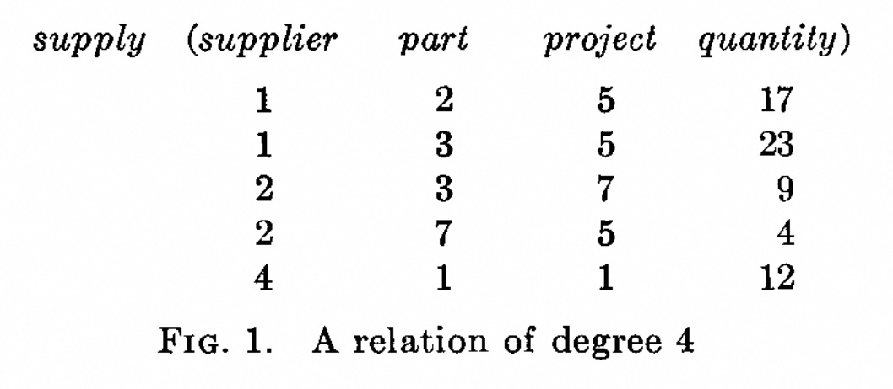
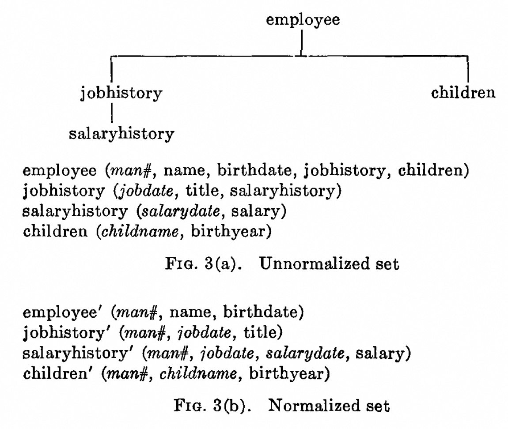
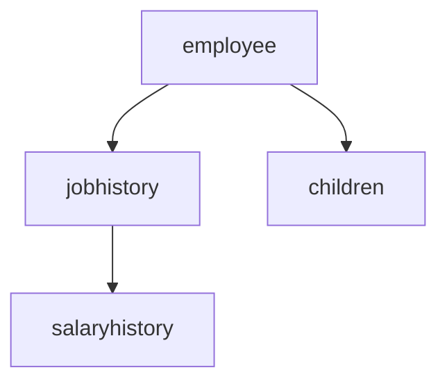
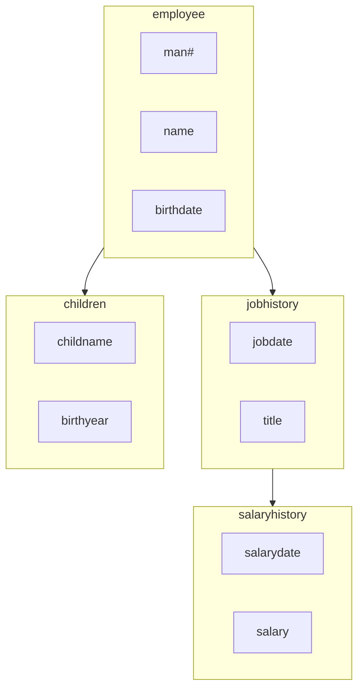
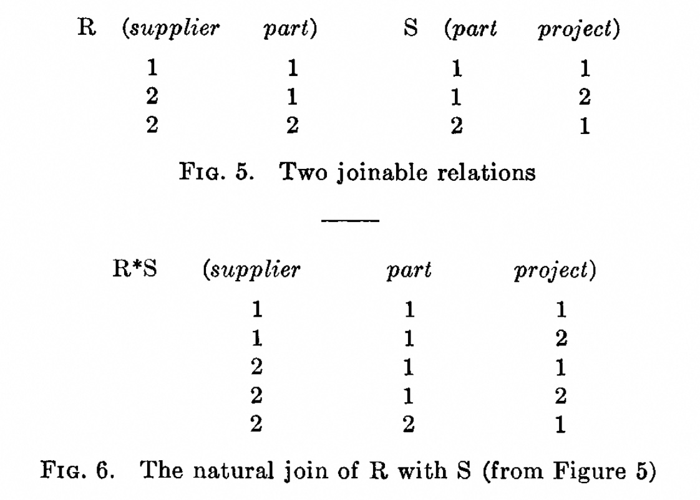
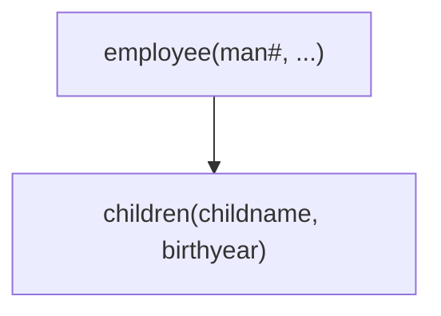

## AI论文解读 | A Relational Model of Data for Large Shared Data Banks 
        
### 作者        
digoal        
        
### 日期        
2025-09-15       
        
### 标签        
PostgreSQL , PolarDB , DuckDB , AI , 论文解读        
        
----        
        
## 背景  
      
https://dl.acm.org/doi/pdf/10.1145/362384.362685        
  
提示:          
```          
读懂《A Relational Model of Data for Large Shared Data Banks》这篇论文需要提前掌握哪些基础知识, 请使用中文通熟易懂的讲解这些基础知识, 可以引用论文中的图、表或使用Markdown支持的图形(text,mermaid等)增加解释性. 
  
使用中文通熟易懂的解读《A Relational Model of Data for Large Shared Data Banks》这篇论文, 其中的关键内容请着重讲解, 可以引用论文中的图、表或使用Markdown支持的图形(text,mermaid等)增加解释性. 
  
提取《A Relational Model of Data for Large Shared Data Banks》这篇论文中的重要术语, 使用中文对这些术语进行通熟易懂的讲解, 可以引用论文中的图、表或使用Markdown支持的图形(text,mermaid等)增加解释性. 
```     
  
## 1 前置知识 
  
您好，为了帮助您更好地理解Codd的经典论文《A Relational Model of Data for Large Shared Data Banks》，我为您梳理了需要提前掌握的核心基础知识。

这篇论文的核心思想，是将当时主流的 **层次（hierarchical）** 和 **网络（network）** 数据模型中存在的各种问题，通过引入严谨的数学理论 —— **关系论（relation theory）** 来解决。因此，掌握以下几个层面的知识会非常有帮助。

### 1\. 了解论文提出的背景（数据依赖性的困境）

在关系模型出现之前，主流的数据系统存在着严重的数据依赖问题，导致应用程序在数据存储方式发生改变时，必须跟着修改。论文中提到三种主要的数据依赖性，您可以把它们想象成三个“痛点”：

  * **排序依赖（Ordering Dependence）**：数据记录的物理存储顺序（例如，按零件号升序排列）被程序所利用。一旦这种物理顺序改变，程序就会出错 。
  * **索引依赖（Indexing Dependence）**：程序直接依赖于数据库的索引，如果索引被移除，程序就会失效 。
  * **存取路径依赖（Access Path Dependence）**：程序依赖于预先定义的、用于访问数据的“路径”或“树状结构” 。当数据结构为了适应新需求而改变时，旧程序就会失效 。

论文通过对比当时的数据结构（如树形或网络模型）和其提出的关系模型，来凸显这些问题，并说明关系模型如何解决它们。

### 2\. 关系模型的核心概念（从数学到数据）

这部分是论文的基石，也是您需要重点理解的部分。关系模型的核心是数学中的 **“关系（Relation）”** 。

您可以把一个关系想象成一个**二维表格**。这个表格有以下几个关键特征 ：

  * **行（Row）**：每一行代表一个“n元组”（n-tuple），也就是一组数据，例如某个零件的完整信息。
  * **列（Column）**：每一列代表一个**域（Domain）**，也就是这列数据可能取值的集合 。
  * **行顺序不重要**：行的排列顺序是无关紧要的 。
  * **列顺序很重要**：列的顺序很重要，并且通过列名（或角色限定名）来标识其意义 。

论文中引用了两个图来帮助理解关系的概念。例如，图1展示了一个名为`supply`的4元关系，记录了供应商、零件、项目和数量的信息 。   

  * **主键（Primary Key）**：能够唯一标识关系中每一行的域或域组合 。例如，在一个`part`关系中，`part number`（零件号）就可以作为主键 。
  * **外键（Foreign Key）**：一个关系中的域，其值是另一个关系的主键 。例如，在图1的`supply`关系中，`supplier`、`part`和`project`本身都是外键 。

### 3\. 范式（Normal Form）

范式是关系模型中的一个关键概念，它通过一种称为 **“规范化（normalization）”** 的简单过程，来消除数据结构中的“非简单域”（nonsimple domain） 。所谓非简单域，就是指某个列的值不是单一原子值，而本身又是一个关系 。

论文中用了一个例子（图3）来解释规范化。   

**未规范化的集合（Unnormalized set）**：



在这个例子中，`jobhistory`和`children`都是`employee`关系的非简单域 。

**规范化过程**：从顶层关系开始，将其主键（例如`man#`）插入到其下属的每个关系中，作为新的主键的一部分 。最后，将所有非简单域从父关系中移除，就得到了规范化的关系集合 。

**规范化的结果（Normalized set）**：

  * employee' (`man#`, name, birthdate)
  * jobhistory' (`man#`, `jobdate`, title)
  * salaryhistory' (`man#`, `jobdate`, `salarydate`, salary)
  * children' (`man#`, `childname`, birthyear)
    

通过这种方式，所有关系都只包含**简单域（simple domain）**，从而可以用简单的二维数组来表示 。

### 4\. 关系运算

论文在第二部分介绍了一些关键的关系运算，这些运算是构建数据查询语言（如SQL）的基础。

  * **投影（Projection）**：选择关系中的特定列 。例如，从`supply`关系中，只选择`project`和`supplier`两列，就会得到一个`project`和`supplier`的投影关系 。
  * **联接（Join）**：将两个有共同域的关系进行组合，从而形成一个新的关系 。

这些关系运算，结合**谓词演算（predicate calculus）**，构成了强大的数据子语言（data sublanguage），允许用户用更高级、更抽象的方式来描述他们想要的数据，而无需关心数据的底层存储方式 。

-----

您想让我针对论文中的某个具体概念，比如**主键和外键**，举一个更详细的例子来解释吗？
  
## 2 解读论文 
  
好的，這就為您通俗易懂地解讀 E.F. Codd 的經典論文《A Relational Model of Data for Large Shared Data Banks》。

這篇於1970年發表的論文，是電腦科學領域的里程碑之作，它奠定了現代幾乎所有關聯式資料庫系統（如 MySQL, PostgreSQL, SQL Server, Oracle Database 等）的理論基礎。可以說，我們今天如何存儲和管理絕大部分的結構化數據，都源於這篇論文的思想。

### 論文核心思想概覽

在 Codd 發表這篇論文之前，主流的資料庫系統主要有兩種模型： **層次式（Hierarchical）** 和 **網狀式（Network）**。  Codd 認為這兩種模型存在嚴重的問題，最大的問題是 **數據獨立性（Data Independence）** 太差。

想像一下，在70年代，應用程式和數據是「緊密耦合」的。程式設計師寫程式時，必須非常清楚數據在實體儲存層面的結構，比如數據是如何排序的、索引是如何建立的、數據之間的存取路徑是怎樣的 。這帶來一個巨大的麻煩：一旦資料庫的儲存結構（例如，為了提升效能而改變了檔案的儲存順序或增加了一個索引）發生改變，所有依賴這個結構的應用程式都可能需要重寫 。這不僅耗時耗力，也極大地限制了數據的靈活性和系統的發展。 

Codd 提出的 **關聯式模型（Relational Model）** 就像一場革命，它的核心目標就是 **將應用程式與數據的具體儲存方式解耦**，從而實現數據獨立性。 

-----

### 論文關鍵內容深度解析

接下來，我們將深入探討論文中的幾個核心概念。

#### 1\. 什麼是關聯式模型？

Codd 借用了數學中「關係（Relation）」的概念來描述數據。  您可以將一個「關係」通俗地理解為一張 **二維表格**。

  * **關係 (Relation)**：就是一張完整的表格，例如一個「員工」表。 
  * **元組 (Tuple)**：表格中的 **每一行**，代表一個具體的實體紀錄，例如某一個員工的所有資訊。 
  * **屬性 (Attribute)**：表格中的 **每一列**，代表實體的一個特徵，例如「員工編號」、「姓名」等。
  * **域 (Domain)**：每一列（屬性）的 **取值範圍**，例如「性別」域可能就是 {'男', '女'}。 

論文中以一個「供應」關係為例（圖1），這是一個四元關係，包含了四個域：供應商 (supplier), 零件 (part), 專案 (project), 和 數量 (quantity)。   

**論文中的圖1：一個四元關係 (A relation of degree 4)** 

| supplier | part | project | quantity |
| :---: | :---: | :---: | :---: |
| 1 | 2 | 5 | 17 |
| 1 | 3 | 5 | 23 |
| 2 | 3 | 7 | 9 |
| 2 | 7 | 5 | 4 |
| 4 | 1 | 1 | 12 |

使用這種簡單、直觀的表格來組織數據，有以下幾個關鍵特徵：

  * **行的順序不重要**：交換任意兩行的位置，關係表達的資訊不變。 
  * **列的順序很重要** (在早期定義中): Codd 最初定義列的順序是重要的，但後來提出了基於 **域名稱** 而非位置來存取數據，從而讓列的順序也變得不重要。 
  * **沒有重複的行**：一張表中不允許存在兩行完全相同的紀錄。 
  * **數據原子性**：每個儲存格中的數據都是不可再分的原子值。 

#### 2\. 數據獨立性：解放程式設計師

這是關聯式模型最核心的優勢。Codd 指出，過去的系統存在三種討厭的數據依賴：

  * **順序依賴 (Ordering Dependence)**：應用程式假設數據是按照特定順序（如員工編號升序）儲存和讀取的。一旦儲存順序改變，程式就可能出錯。 
  * **索引依賴 (Indexing Dependence)**：程式的邏輯依賴於某個特定索引的存在。如果為了效能調整而刪除或更改了索引，程式就無法執行。 
  * **存取路徑依賴 (Access Path Dependence)**：在層次或網狀模型中，程式需要像「走迷宮」一樣，沿著預先定義好的路徑（例如，必須先找到「部門」，才能找到該部門下的「員工」）來存取數據。如果數據的層級結構或連結關係改變了，整個存取邏輯都要重寫。 

**關聯式模型如何解決這個問題？**

它提供了一個抽象的、邏輯的數據視圖（二維表），使用者和程式設計師只需要關心這個邏輯視圖，而無需關心數據在磁碟上到底是如何存放的。  數據的查詢和操作是 **聲明式** 的，你只需要告訴系統 **「你想要什麼（What）」**，而不需要告訴它 **「如何去獲取（How）」**。

例如，你想查詢 'alpha' 專案使用了哪些零件，你只需要提交一個類似 SQL `SELECT part_number FROM commitments WHERE project_name = 'alpha'` 的請求，而不用關心數據是按專案儲存還是按零件儲存的。  資料庫管理系統（DBMS）會負責將你的邏輯請求翻譯成對實體檔案的高效操作。

#### 3\. 正規化 (Normal Form)：消除數據冗餘和不一致

Codd 觀察到，在設計資料庫結構時，我們可能會創建出一些包含「非簡單域」（non-simple domains）的關係，即表格的某個儲存格裡又包含了一張子表。  他在論文的圖3(a)中給出了一個例子。   

**論文中的圖3(a)：未正規化集合 (Unnormalized set)** 

這個結構可以用下面的方式來理解：



  * `employee` 表中有一列叫 `jobhistory`（工作歷史），這一列的每個單元格本身就是一張包含 `jobdate`、`title` 和 `salaryhistory` 的子表。
  * `jobhistory` 子表中又有一列 `salaryhistory`（薪資歷史），它又是一張子表。
  * `employee` 表中還有一列 `children`（子女），也是一張子表。

這種結構複雜且不利於數據操作。為此，Codd 提出了 **正規化（Normalization）** 的過程，其目標是將這些複雜的、嵌套的關係轉換成一系列簡單的、扁平的二維表。  轉換的核心思想是 **「攤平」**，通過將上層關係的主鍵（Primary Key）向下層關係傳遞來消除嵌套。 

經過正規化後，圖3(a)的結構就變成了圖3(b)的樣子：   

**論文中的圖3(b)：正規化集合 (Normalized set)** 

  * **employee'** (\<u\>man\#\</u\>, name, birthdate)
  * **jobhistory'** (\<u\>man\#, jobdate\</u\>, title)
  * **salaryhistory'** (\<u\>man\#, jobdate, salarydate\</u\>, salary)
  * **children'** (\<u\>man\#, childname\</u\>, birthyear)

> *下劃線* 代表該表的主鍵。

可以看到，所有關係都變成了簡單的二維表，原來的嵌套結構通過共享主鍵 `man#` 來維持關聯。這樣做的好處是：

  * **結構簡單清晰**：易於理解和管理。 
  * **減少數據冗餘**：避免了重複儲存相同資訊。
  * **避免更新異常**：更新、插入、刪除數據時，不容易產生數據不一致的問題。

#### 4\. 數據子語言 (Data Sublanguage) 和關聯式操作

Codd 提出，應該有一種通用的、基於謂詞邏輯的 **數據子語言**，讓使用者能夠對這些「關係」（表格）進行操作。  這種語言應具備查詢、插入、更新和刪除數據的能力。這個思想直接催生了後來的 **SQL (Structured Query Language)**。

他還定義了一系列操作關係的運算，這些運算是關聯式資料庫系統運作的數學基礎，其中最重要的幾個是：

  * **投影 (Projection)**：從表格中 **選擇某些列**。  就像用手電筒只照亮表格的幾列。
  * **選擇 (Restriction/Selection)**：從表格中 **選擇滿足條件的某些行**。  就像用篩子篩選出符合條件的紀錄。
  * **連接 (Join)**：將兩個或多個表格 **按照共同的列（鍵）拼接** 起來，形成一個更寬的表。  這是關聯式模型中最強大、最核心的操作之一，它使得我們可以將分散在不同表中的資訊關聯起來。

**論文中的圖5和圖6：一個連接操作的例子**

假設有兩個關係 R 和 S：   

**R (supplier, part)** 

| supplier | part |
| :---: | :---: |
| 1 | 1 |
| 2 | 1 |
| 2 | 2 |

**S (part, project)** 

| part | project |
| :---: | :---: |
| 1 | 1 |
| 1 | 2 |
| 2 | 1 |

這兩個關係可以通過共同的列 `part` 進行 **自然連接 (Natural Join)** ，得到如下的新關係：

**R \* S (supplier, part, project)** 

| supplier | part | project |
| :---: | :---: | :---: |
| 1 | 1 | 1 |
| 1 | 1 | 2 |
| 2 | 1 | 1 |
| 2 | 1 | 2 |
| 2 | 2 | 1 |

通過連接操作，我們就能輕鬆地回答「哪些供應商通過供應零件參與了哪些專案」這樣的問題。

### 結論與影響

E.F. Codd 的這篇論文不僅僅是一個技術提案，更是一種思想上的革新。它將嚴謹的數學理論引入到數據管理領域，提出了一個既簡單優雅又功能強大的模型。

  * **對使用者而言**：關聯式模型極大地簡化了數據操作，使用者無需關心底層複雜的實現細節。 
  * **對開發者而言**：數據獨立性讓應用程式更加健壯，不易受到資料庫結構變化的影響，大大提高了開發和維護效率。 
  * **對整個產業而言**：它催生了價值數千億美元的關聯式資料庫產業，並為後來的數據倉儲、數據分析、商業智慧等領域奠定了堅實的基礎。

儘管今天我們有了 NoSQL、大數據等新的數據技術，但關聯式模型依然是資訊世界的核心基石，其思想和原則在今天依然熠熠生輝。
  
## 3 术语 
  
好的，我为您整理了《A Relational Model of Data for Large Shared Data Banks》这篇论文中的几个重要术语，并用通俗易懂的方式进行了讲解。

### 关系模型核心术语

这篇论文的核心在于将数据存储和处理，从依赖于物理结构（如链表、树形）的方式，转移到基于严谨的数学**关系论**。以下是几个最基础且重要的概念：

#### 1\. 关系 (Relation)

您可以把**关系**想象成一个简单的**二维表格**。这个表格里没有重复的行，并且每一行、每一列都有明确的含义。

论文中给出了一个名为 `supply` 的关系作为例子（类似于论文中的图1）：   

```
┌──────────┬────────┬─────────┬──────────┐
│ supplier │  part  │ project │ quantity │
├──────────┼────────┼─────────┼──────────┤
│ S6       │ P2     │ J1      │ 150      │
│ S6       │ P2     │ J2      │ 50       │
│ S6       │ P4     │ J1      │ 20       │
│ ...      │ ...    │ ...     │ ...      │
└──────────┴────────┴─────────┴──────────┘
```

  * 这个表格的名称 `supply` 就是**关系名**。
  * 表格中的每一行代表一个独立的**n-元组**。

#### 2\. n-元组 (n-tuple)

**n-元组**就是表格中的**一行数据**。它代表了现实世界中的一个实体或一个事件。例如，上面表格中的 `(S6, P2, J1, 150)` 就是一个4-元组，它描述了“供应商S6为项目J1提供了150个零件P2”这个事件。

#### 3\. 域 (Domain)

**域**是指某一列数据所有可能的取值集合。简单来说，它定义了这一列能放什么类型的数据。例如，在上面的 `supply` 表中：

  * `quantity` 这一列的域可以是“所有正整数”。
  * `supplier` 这一列的域可以是“所有有效的供应商编号”。

#### 4\. 主键 (Primary Key) 和外键 (Foreign Key)

  * **主键**：能够唯一标识关系中每一行的列或列的组合。例如，在另一个名为 `parts` 的关系（零件表）中，`part number`（零件号）就可以作为主键，因为每个零件号都是唯一的。
  * **外键**：一个关系中的一列，它的值指向另一个关系中的主键。在上面的 `supply` 关系中，`supplier`、`part` 和 `project` 这几列都是**外键**，它们分别指向了独立的 `suppliers`、`parts` 和 `projects` 关系中的主键。

-----

### 数据操作术语

在关系模型中，数据操作是通过数学运算来实现的，而不是通过物理路径。

#### 1\. 投影 (Projection)

**投影**操作类似于在电子表格中隐藏某些列。它用于从一个关系中选择出我们需要的特定列，并形成一个新的关系。

假设我们有上面的 `supply` 关系，如果我们只想知道“有哪些项目使用了零件P2”，我们可以进行投影操作，只选择 `project` 列：

```
投影(supply, project)
```

结果会得到一个新关系，其中只包含 `project` 列，并且会去重。

#### 2\. 联接 (Join)

**联接**操作用于将两个有共同列的关系（表格）合并成一个新的关系。这是关系模型中非常强大的操作，因为它允许我们通过共享的数据（即外键）来连接不同表格中的信息。

例如，如果我们有一个 `employees` 表和一个 `departments` 表，我们可以通过 `department_id` 这个共同的列将它们联接起来，从而知道每个员工属于哪个部门。

-----

### 数据组织术语

#### 1\. 规范化 (Normalization)

**规范化**是一个将数据结构简化的过程，目的是消除数据冗余和不一致性。在论文中，Codd提出了一个 **范式（Normal Form）** 的概念。

论文中描述了如何将一个复杂、包含“非简单域”的未规范化集合（unnormalized set）简化为多个只包含“简单域”的规范化关系。例如，如果一个员工记录中包含了子关系（例如，这个员工的**子女生平**），就需要将它规范化。

**未规范化的集合**：



在规范化之后，它会被拆分成两个更简单的关系：

  * `employee'` (man\#, name, birthdate)
  * `children'` (man\#, childname, birthyear)

这个过程使得数据可以简单地用表格来表示，从而方便了数据的管理和查询。

您对这些术语的解释清晰吗？您希望我进一步解释一下 **联接（Join）** 操作的实际例子吗？
  
## 参考        
         
https://dl.acm.org/doi/pdf/10.1145/362384.362685    
        
<b> 以上内容基于DeepSeek、Qwen、Gemini及诸多AI生成, 轻微人工调整, 感谢杭州深度求索人工智能、阿里云、Google等公司. </b>        
        
<b> AI 生成的内容请自行辨别正确性, 当然也多了些许踩坑的乐趣, 毕竟冒险是每个男人的天性.  </b>        
    
#### [期望 PostgreSQL|开源PolarDB 增加什么功能?](https://github.com/digoal/blog/issues/76 "269ac3d1c492e938c0191101c7238216")
  
  
#### [PolarDB 开源数据库](https://openpolardb.com/home "57258f76c37864c6e6d23383d05714ea")
  
  
#### [PolarDB 学习图谱](https://www.aliyun.com/database/openpolardb/activity "8642f60e04ed0c814bf9cb9677976bd4")
  
  
#### [PostgreSQL 解决方案集合](../201706/20170601_02.md "40cff096e9ed7122c512b35d8561d9c8")
  
  
#### [德哥 / digoal's Github - 公益是一辈子的事.](https://github.com/digoal/blog/blob/master/README.md "22709685feb7cab07d30f30387f0a9ae")
  
  
#### [About 德哥](https://github.com/digoal/blog/blob/master/me/readme.md "a37735981e7704886ffd590565582dd0")
  
  

  
