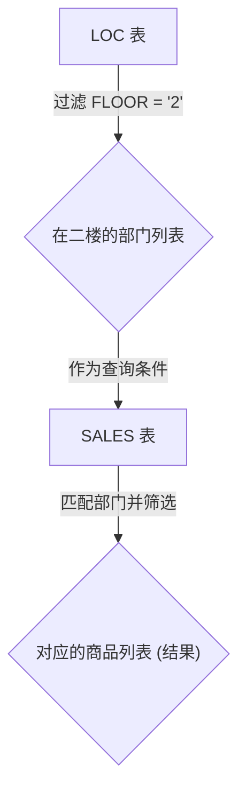

## AI论文解读 | Sequel: A Structured English Query Language
        
### 作者        
digoal        
        
### 日期        
2025-09-15       
        
### 标签        
PostgreSQL , PolarDB , DuckDB , AI , 论文解读        
        
----        
        
## 背景  
      
https://dl.acm.org/doi/pdf/10.1145/800296.811515        
  
提示:          
```          
读懂《Sequel: A Structured English Query Language》这篇论文需要提前掌握哪些基础知识, 请使用中文通熟易懂的讲解这些基础知识, 可以引用论文中的图、表或使用Markdown支持的图形(text,mermaid等)增加解释性. 
  
使用中文通熟易懂的解读《Sequel: A Structured English Query Language》这篇论文, 其中的关键内容请着重讲解, 可以引用论文中的图、表或使用Markdown支持的图形(text,mermaid等)增加解释性. 
  
提取《Sequel: A Structured English Query Language》这篇论文中的重要术语, 使用中文对这些术语进行通熟易懂的讲解, 可以引用论文中的图、表或使用Markdown支持的图形(text,mermaid等)增加解释性. 
```     
  
## 1 前置知识 
  
在开始阅读这篇关于 SEQUEL 的论文之前，了解以下几个基础概念会非常有帮助。

### 1\. 什么是关系型数据库（Relational Database）？

关系型数据库是一种用**表格**来组织数据的数据库模型。论文中提到，关系型数据库中“关系”（relations）可以被看作是具有固定列数和可变行数的表格 。

你可以把论文中提供的“员工表” (EMP) 作为例子来理解 。这个表格有 EMP、NAME、SAL、MGR 和 DEPT 等列（columns），每一行（row）代表一个员工的完整信息。

```
| EMP | NAME    | SAL   | MGR      | DEPT       |
|-----|---------|-------|----------|------------|
|     | SMITH   | 10000 | JONES    | TOY        |
|     | JONES   | 12000 | ANDERSON | FURNITURE  |
|     | LEE     | 10000 | THOMAS   | APPLIANCES |
```

这个表格就是论文中所说的“关系”或“表” 。

### 2\. 什么是查询语言（Query Language）？

查询语言是用于从数据库中检索、操作和管理数据的计算机语言 。这篇论文的核心就是介绍 SEQUEL，它是一种新的查询语言，旨在让不熟悉计算机的普通用户也能轻松地与数据库交互 。

### 3\. 什么是“过程式”和“声明式”语言？

  * **过程式（Procedural）**：你告诉计算机**如何**完成任务。你需要详细地描述每一步操作。论文提到，早期的计算机系统多是过程式编程 。
  * **声明式（Declarative）**：你告诉计算机**想要什么**结果，而不必关心具体如何实现。例如，在数据库查询中，你只需要描述你想要的数据的特征，而不是一步步告诉计算机去哪里找，怎么找 。SEQUEL 就是一种声明式语言 。

### 4\. 什么是谓词演算（First-order Predicate Calculus）？

这是论文中反复出现的一个重要概念，它是一种逻辑系统，可以用来表达复杂的逻辑关系 。一些早期的数据库查询语言（如 Codd 的语言和 COLARD、RIL）就是基于谓词演算的 。

但是，这类语言对普通用户来说太复杂了 。论文中提到，使用谓词演算的语言通常需要用户：

  * 定义变量来代表表格的行或部分行 。
  * 使用布尔表达式和量词（如“所有”或“存在”）来表达查询 。

SEQUEL 的一个主要优点就是它**避免了这些复杂的概念**，让查询变得更像我们平时使用的自然语言 。

-----

这些基础知识可以帮助你更好地理解论文中提出的问题背景（即现有查询语言的复杂性）以及 SEQUEL 如何通过简单、结构化的方式解决这些问题。

请问你对这些基础概念有什么疑问吗？或者，你想了解 SEQUEL 是如何用它特有的语法来执行这些查询的吗？
  
## 2 解读论文 
  
好的，我们来通俗易懂地解读这篇数据库领域的里程碑式论文——《SEQUEL: A STRUCTURED ENGLISH QUERY LANGUAGE》。

这篇论文在1974年发表，介绍了一种名为SEQUEL的查询语言。SEQUEL就是今天我们广泛使用的**SQL** (Structured Query Language) 的前身。可以说，理解了这篇论文，就理解了SQL最初的设计哲学和核心思想。

### 论文核心思想

论文的核心思想是：**创建一个强大、易于学习且接近自然英语的数据库查询语言，让非计算机专家（如会计师、工程师）也能轻松地从数据库中获取信息** 。

在SEQUEL出现之前，查询数据库通常需要使用基于“谓词演算”的复杂语言 。这种语言充满了数学符号，需要用户理解“量词”（比如“对于所有的...”、“存在一个...”）和“绑定变量”等抽象概念，学习门槛非常高 。

作者认为，大多数数据库查询在逻辑上并不复杂 ，因此他们设计了SEQUEL，用一种结构化的、积木式的英语关键词模板，取代了复杂的数学公式 ，大大降低了使用难度。

-----

### 从SQUARE到SEQUEL：从数学到英语的演进

SEQUEL的设计并非凭空而来，它借鉴了作者团队早期设计的另一种语言——SQUARE 。SQUARE在功能上已经很强大，能够消除谓词演算中的量词和复杂的连接词 ，但它的语法仍然是数学符号式的，不够友好 。

SEQUEL的目标就是为SQUARE的强大功能配上一套更友好的、类似英语的语法 。

让我们来看一个简单的例子，直观感受一下它们的区别。

**查询任务 (Q1):** 查找玩具(Toy)部门所有员工的名字 。

  * **SQUARE的写法 (数学化):**

    ```
      EMP
    NAME DEPT('ΤΟΥ')
    ```

    这种写法需要用户理解列名(NAME, DEPT)在上下方的位置代表的映射关系 。

  * **SEQUEL的写法 (英语化):**

    ```sql
    SELECT NAME
    FROM EMP
    WHERE DEPT = 'ΤΟΥ'
    ```

    
    这种写法就像在说一句英语：“从(FROM)员工表(EMP)中，选择(SELECT)名字(NAME)，条件是(WHERE)部门(DEPT)等于'TOY'”。这无疑更加直观和易于理解 。

-----

### SEQUEL的核心构件：`SELECT-FROM-WHERE`

SEQUEL最核心、最基础的结构就是 `SELECT-FROM-WHERE` 查询块 。这构成了几乎所有查询的基础。

为了更好地解释，我们先引用论文中描述员工信息的`EMP`表示例 (一个简化的版本) ：

| EMP | NAME | SAL | MGR | DEPT |
| :--- | :--- | :--- | :--- | :--- |
| | SMITH | 10000 | JONES | TOY |
| | JONES | 12000 | ANDERSON | FURNITURE |
| | LEE | 10000 | THOMAS | APPLIANCES |

这个基础块的三个关键字分工明确：

1.  **`SELECT`**：选择你想要看的数据（列）。
      * 例如：`SELECT NAME, SAL` 表示我想看员工的名字和薪水 。
2.  **`FROM`**：从哪张表中查找。
      * 例如：`FROM EMP` 表示数据来源是员工表 。
3.  **`WHERE`**：设置过滤条件，决定哪些行的数据被选中。
      * 例如：`WHERE DEPT = 'TOY' AND MGR = 'ANDERSON'` 表示筛选出部门是“玩具”并且经理是“ANDERSON”的员工 。

通过组合这三个关键字，用户就能完成大部分简单的查询任务，并且整个逻辑非常清晰 。

-----

### SEQUEL的关键特性与进阶用法

当然，SEQUEL的强大之处在于它能将简单的查询块组合起来，形成复杂的查询。

#### 1\. 嵌套查询 (Nested Queries)

这是SEQUEL最具创造性的设计之一。一个`SELECT-FROM-WHERE`块可以嵌套在另一个块的`WHERE`子句中，用于生成过滤条件 。

**查询任务 (Q3):** 找到在二楼的部门所销售的所有商品 。

这个问题需要两张表的信息：

  * `LOC` 表：记录部门(DEPT)和楼层(FLOOR)的对应关系 。
  * `SALES` 表：记录部门(DEPT)和销售商品(ITEM)的对应关系 。

使用SEQUEL，我们可以像下面这样思考和书写：

1.  **外层查询**：我的最终目标是商品(`ITEM`)，它在`SALES`表中。所以我先写出：
    ```sql
    SELECT ITEM
    FROM SALES
    WHERE DEPT = ???
    ```
2.  **内层查询**：`WHERE`的条件是“部门在二楼”。这个信息需要从`LOC`表中查询。所以我可以写一个子查询来获取所有在二楼的部门：
    ```sql
    SELECT DEPT
    FROM LOC
    WHERE FLOOR = '2'
    ```
3.  **组合**：将内层查询作为外层查询的条件，就得到了最终的完整查询：
    ```sql
    SELECT ITEM
    FROM SALES
    WHERE DEPT = (SELECT DEPT
                  FROM LOC
                  WHERE FLOOR = '2')
    ```
    

这种自上而下、层层深入的结构化写法，非常符合人的思考逻辑 。

我们可以用下图来表示这个查询的数据流：



#### 2\. 聚合函数与分组 (`GROUP BY`)

SEQUEL引入了`AVG` (平均), `SUM` (求和), `COUNT` (计数) 等聚合函数，用于数据统计 。

**查询任务 (Q4):** 计算鞋类(Shoe)部门员工的平均工资 。

```sql
SELECT AVG(SAL)
FROM EMP
WHERE DEPT = 'SHOE'
```


更进一步，`GROUP BY`子句是SEQUEL处理分组统计的一大利器。它解决了在早期语言中需要使用复杂“自由变量”才能完成的问题 。

**查询任务 (Q7):** 找出管理超过10名员工的经理的名字 。

使用`GROUP BY`，我们可以很自然地实现这个需求：

1.  `FROM EMP GROUP BY MGR`: 将`EMP`表按照经理(`MGR`)进行分组。
2.  `SELECT MGR`: 选出经理的名字。
3.  `WHERE COUNT(NAME) > 10`: `WHERE`子句在这里（在现代SQL中是`HAVING`）对分组后的结果进行过滤，筛选出员工人数（`COUNT(NAME)`）大于10的组。

完整的SEQUEL查询如下：

```sql
SELECT MGR
FROM EMP GROUP BY MGR
WHERE COUNT(NAME) > 10
```


这个过程可以想象成：

> 假设你有一堆员工卡片，`GROUP BY MGR`就像你先把所有卡片按经理的名字分成不同的小堆。然后`COUNT(NAME) > 10`就是你去数每一堆卡片的数量，只留下那些数量超过10的堆。最后`SELECT MGR`就是你记下这些留下来的堆的经理名字。

#### 3\. 连接与别名

当查询需要同时处理多张表，并且需要比较它们之间的列时，SEQUEL也提供了简洁的语法。

**查询任务 (Q11):** 找到所有工资比其经理还高的员工 。

这个问题很有趣，因为它是在同一张`EMP`表内进行比较。为了区分“员工”和“经理”，SEQUEL允许为查询块设置一个标签（或称为别名），比如`B1` 。

```sql
B1: SELECT NAME
    FROM EMP
    WHERE SAL > (SELECT SAL
                 FROM EMP
                 WHERE NAME = B1.MGR)
```


这里的`B1`指向外层查询的每一行。`B1.MGR`指的就是当前正在被判断的这位员工的经理的名字。整个查询的含义是：“对于B1块中的每一位员工，找出他的工资(`SAL`)，然后去`EMP`表中找到他经理的工资，如果员工工资更高，则把他选出来” 。

-----

### 与谓词演算语言的对比

为了凸显SEQUEL的简洁性，论文将一个复杂查询用谓词演算和SEQUEL进行了对比 。

**查询任务(Q6):** 找到在二楼的部门所销售的A类商品的总销售额 。

  * **谓词演算的写法**:
    `SUM {x[VOL] c SALES : (∃y ∈ CLASS) ((y[ITEM] = x[ITEM]) ∧ (y[TYPE] = 'A')) ∧ (∃z ∈ LOC) ((z[DEPT] = x[DEPT]) ∧ (z[FLOOR] = '2'))}`

    这需要用户：

    1.  设置三个变量x, y, z来遍历三张表 。
    2.  理解存在量词 `∃` (读作“存在”) 。
    3.  写出明确的连接条件 `y[ITEM] = x[ITEM]` 等 。

  * **SEQUEL的写法**:

    ```sql
    SELECT SUM(VOL)
    FROM SALES
    WHERE ITEM = (SELECT ITEM
                  FROM CLASS
                  WHERE TYPE = 'A')
    AND DEPT = (SELECT DEPT
                FROM LOC
                WHERE FLOOR = '2')
    ```

    这个版本通过两个独立的、清晰的嵌套查询来设定条件，完全避免了抽象的数学概念，更加易读、易写、易维护 。

### 总结与意义

《SEQUEL: A Structured English Query Language》这篇论文的伟大之处在于，它成功地在数据库的数学理论基础和普通用户的易用性之间架起了一座桥梁。

**它的主要贡献可以总结为：**

  * **声明式语言：** 用户只需“声明”他们想要什么，而无需关心计算机如何一步步去获取数据。
  * **结构化、模块化：** 以`SELECT-FROM-WHERE`为核心构建块，通过嵌套和组合来完成复杂任务，思路清晰 。
  * **英语关键字：** 采用易于理解的英语单词作为关键字，大大降低了学习曲线 。
  * **强大的功能：** 涵盖了查询、聚合、分组、连接等核心功能，其表达能力不亚于复杂的谓词演算语言 。

SEQUEL的设计理念直接促成了SQL的诞生和标准化，而SQL至今仍是关系型数据库领域应用最广泛的语言。这篇40多年前的论文所提出的基本原则和语法结构，依然在今天数十亿行代码和无数的数据库应用中发挥着核心作用。
  
## 3 术语 
  
根据论文内容，以下是一些重要的术语及其通俗易懂的中文解释：

### 1\. 关系（Relation）

在关系型数据模型中，“关系”就是指我们通常所说的**表格** 。论文中用了一个名为“EMP”的表格作为例子，它描述了员工的信息 。这个表格有固定的列（如姓名、薪水、部门等），但行数可以变化 。

```
| EMP | NAME    | SAL   | MGR      | DEPT       |
|-----|---------|-------|----------|------------|
|     | SMITH   | 10000 | JONES    | TOY        |
|     | JONES   | 12000 | ANDERSON | FURNITURE  |
|     | LEE     | 10000 | THOMAS   | APPLIANCES |
```

### 2\. 查询语言（Query Language）

查询语言是用来和数据库进行交互的工具 。你可以用它来获取、修改或管理数据 。论文的核心就是介绍一种新的查询语言 **SEQUEL**，它被设计成更像自然语言，让非专业用户也能使用 。

### 3\. 谓词演算（First-order Predicate Calculus）

这是一种数学上的逻辑语言 。一些早期的数据库查询语言（如 Codd 的语言）就是基于它的 。论文认为这种语言对普通用户来说太复杂了，因为它要求用户定义额外的变量和使用量词（如“存在”、“所有”） 。SEQUEL 的优势之一就是它**不需要**这些复杂的概念 。

### 4\. SQUARE

SQUARE 是 SEQUEL 的前身，它是一种更简洁、数学化的查询语言 。论文用它作为引子，来展示如何通过“映射”（mapping）等概念来查询数据 。虽然 SQUARE 也很强大，但它的**数学符号**让非专业用户感到不便，而 SEQUEL 则用**类似英语的关键词**来代替 。

### 5\. 映射（Mapping）

“映射”是 SQUARE 和 SEQUEL 的核心概念之一 。它描述了一种数据检索的方式，类似于我们查表格的习惯 。一个基本的映射包括：

  * **表格名** (Table Name)：你要从哪个表格里找数据（例如 `EMP`） 。
  * **域** (Domain)：你用来查找的列（例如 `DEPT`） 。
  * **范围** (Range)：你想要得到结果的列（例如 `NAME`） 。
  * **参数** (Argument)：你的查找条件（例如 `'TOY'`） 。

用论文中的 Q1 查询来解释，就是“在 EMP 表中，找到 DEPT 列值为 'TOY' 的所有行，并返回对应 NAME 列的值” 。

### 6\. SELECT-FROM-WHERE 块

这是 SEQUEL 语言的基本组成部分 。它提供了一个标准的模板来表达简单的查询 。

  * **SELECT**：指定你想要查看的列 。
  * **FROM**：指定数据来自哪个表格 。
  * **WHERE**：指定筛选数据的条件 。

例如，论文中的 Q1 查询用 SEQUEL 写出来就是：
`SELECT NAME`
`FROM EMP`
`WHERE DEPT = 'TOY'` 

这个结构让查询变得像填空题一样简单 。

### 7\. GROUP BY 子句

这是一个可选的子句，用来将表格中的行根据一个或多个列的值进行**分组** 。例如，`FROM EMP GROUP BY MGR` 会将所有员工按他们的经理进行分组 。一旦分好组，你就可以对每个组应用数学函数（如 COUNT、SUM、AVG 等）来计算总数、平均值等 。

你对这些术语的解释还满意吗？如果想更深入地了解，我们可以探讨一下 SEQUEL 如何处理复杂的查询，比如多个表格之间的关联。
  
## 参考        
         
https://dl.acm.org/doi/pdf/10.1145/800296.811515    
        
<b> 以上内容基于DeepSeek、Qwen、Gemini及诸多AI生成, 轻微人工调整, 感谢杭州深度求索人工智能、阿里云、Google等公司. </b>        
        
<b> AI 生成的内容请自行辨别正确性, 当然也多了些许踩坑的乐趣, 毕竟冒险是每个男人的天性.  </b>        
    
#### [期望 PostgreSQL|开源PolarDB 增加什么功能?](https://github.com/digoal/blog/issues/76 "269ac3d1c492e938c0191101c7238216")
  
  
#### [PolarDB 开源数据库](https://openpolardb.com/home "57258f76c37864c6e6d23383d05714ea")
  
  
#### [PolarDB 学习图谱](https://www.aliyun.com/database/openpolardb/activity "8642f60e04ed0c814bf9cb9677976bd4")
  
  
#### [PostgreSQL 解决方案集合](../201706/20170601_02.md "40cff096e9ed7122c512b35d8561d9c8")
  
  
#### [德哥 / digoal's Github - 公益是一辈子的事.](https://github.com/digoal/blog/blob/master/README.md "22709685feb7cab07d30f30387f0a9ae")
  
  
#### [About 德哥](https://github.com/digoal/blog/blob/master/me/readme.md "a37735981e7704886ffd590565582dd0")
  
  

  
