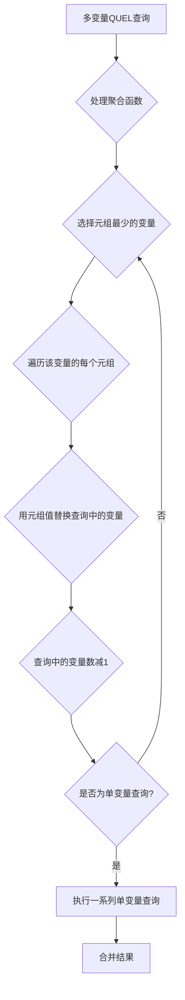

## AI论文解读 | Ingres: A Relational Data Base System
        
### 作者        
digoal        
        
### 日期        
2025-09-15       
        
### 标签        
PostgreSQL , PolarDB , DuckDB , AI , 论文解读        
        
----        
        
## 背景  
      
https://dl.acm.org/doi/pdf/10.1145/1499949.1500029        
  
提示:          
```          
读懂《Ingres: A Relational Data Base System》这篇论文需要提前掌握哪些基础知识, 请使用中文通熟易懂的讲解这些基础知识, 可以引用论文中的图、表或使用Markdown支持的图形(text,mermaid等)增加解释性. 
  
使用中文通熟易懂的解读《Ingres: A Relational Data Base System》这篇论文, 其中的关键内容请着重讲解, 可以引用论文中的图、表或使用Markdown支持的图形(text,mermaid等)增加解释性. 
  
提取《Ingres: A Relational Data Base System》这篇论文中的重要术语, 使用中文对这些术语进行通熟易懂的讲解, 可以引用论文中的图、表或使用Markdown支持的图形(text,mermaid等)增加解释性. 
```     
  
## 1 前置知识 
  
好的，读懂《INGRES: A Relational Data Base System》这篇论文，你需要掌握以下几个基础知识：

  * **关系型数据库模型 (Relational Model)**: 这是这篇论文的核心基础。简单来说，关系型数据库模型将数据组织成表格（即“关系”），每个表格由行（“元组”或“行”）和列（“域”或“列”）组成 。

      * **关系 (Relation)**: 也就是我们常说的“表”。它是一个二维的数据结构，由行和列构成。
      * **域 (Domain)**: 关系中的每一列被称为域 。论文中提到，他们引入了“属性”（Attribute）这个术语来区分投影（R[D]，即列中的实际值）和域（D，即该列可能值的集合） 。
      * **元组 (Tuple)**: 关系中的每一行被称为元组 。元组中的每个元素都属于对应的域。你可以将元组理解为单个记录。

    论文中的CITY示例关系可以很好地说明这个概念：

    ```
    CITY (CNAME, STATE, POPULATION, AREA)
    ```

    这是一个名为 `CITY` 的关系，它有四个域（列）：`CNAME` (城市名), `STATE` (州), `POPULATION` (人口), `AREA` (面积)。

  * **查询语言 (Query Language)**: 这是与数据库进行交互的工具。论文中详细介绍了一种名为 **QUEL** 的查询语言，它是一种基于关系演算（relational calculus）的语言，与Codd的ALPHA语言相似，但也有一些重要区别 。

      * **QUEL 的基本结构**: QUEL 查询通常包含一个或多个 **Range-Statement** 和一个或多个 **Retrieve-Statement** 。
          * **Range-Statement**: 定义一个变量的范围，这个变量将遍历一个特定的关系。例如： `RANGE OF C IS CITY` 表示变量 `C` 的范围是 `CITY` 关系 。
          * **Retrieve-Statement**: 定义要检索的数据。它的基本形式是 `RETRIEVE INTO Result-name (Target-List) WHERE Qualification` 。
      * **目标列表 (Target-List)**: 告诉系统要从查询结果中创建哪些列 。
      * **限定条件 (Qualification)**: 这是一个布尔函数，用于筛选出符合条件的元组 。
      * **查询示例**: 论文中有一个非常清晰的例子，用于找出加州人口超过5万的城市的人口密度：
        ```
        RANGE OF C IS CITY
        RETRIEVE INTO W(C.CNAME, DENSITY=C.POPULATION/C.AREA)
        WHERE C.STATE='California' AND C.POPULATION>50K
        ```
        这个例子定义了变量 `C` 作用于 `CITY` 表，然后检索出符合条件的元组，并计算人口密度 `DENSITY`，最终创建一个名为 `W` 的新关系 。

  * **数据库操作命令**: 除了查询（RETRIEVE），论文还介绍了三种更新操作命令：**REPLACE**、**DELETE** 和 **APPEND** 。这些命令的语法与查询语句非常相似，都包含范围语句和限定条件 。

      * **APPEND**: 用于向现有关系中添加新的符合条件的元组 。
      * **REPLACE**: 用于修改符合条件的元组 。
      * **DELETE**: 用于删除符合条件的元组 。

  * **查询处理与优化**: 论文还探讨了如何处理高级查询。他们提出的主要策略是 **“分解”（decomposition）** 。

      * **分解**: 将复杂的、多变量的查询分解成一系列更简单的、单变量的查询 。
      * **查询修改 (Query Modification)**: 这是一种统一处理访问控制、完整性验证和视图支持的方法 。该方法通过自动向用户的查询中添加额外的限定条件来实现这些功能 。例如，访问控制通过将用户的限制条件作为 `AND` 子句添加到他们的每个查询中来实现 。

-----

为了进一步深入理解，你可能会希望我提供一些关于“关系演算”和“集合论”的额外背景知识。这篇论文中提到的 QUEL 语言和其内部处理机制，比如 `SET` 和 `AGGREGATE` 函数，都深深植根于这些数学概念。

  
  
## 2 解读论文 
  
好的,我们来一起解读这篇发表于1975年的经典论文——《INGRES：一个关系数据库系统》。这篇论文介绍了早期关系数据库管理系统之一的INGRES的设计和实现,其中提出的许多概念对后来的数据库技术发展产生了深远影响。

### **核心思想概览**

INGRES (Interactive Graphics and Retrieval System) 是加州大学伯克利分校开发的一个关系数据库系统 。这篇论文的核心在于介绍了一套完整的关系数据库解决方案,其主要创新点和关键内容包括：

1.  **QUEL查询语言**：一种基于关系演算、功能强大的声明式查询语言 。
2.  **查询分解 (Decomposition)**：一种独特的查询处理算法,能将复杂的多变量查询分解为一系列简单的单变量查询来执行 。
3.  **查询修改 (Query Modification)**：一种优雅且统一的机制,通过修改用户查询来实现访问控制、完整性约束和视图(Views)功能 。
4.  **多样的存取方法 (Access Methods)**：系统支持多种底层数据存储方式,以适应不同的查询需求 。

接下来,我们将对这些关键内容进行详细解读。

### **1. QUEL: 一种强大而丰富的查询语言**

QUEL (QUEry Language) 是INGRES系统的核心交互语言。与我们今天熟知的SQL (其前身是SEQUEL ) 不同,QUEL是一种纯粹的关系演算语言,在当时具有非常先进的特性。

**基本结构**
一个典型的QUEL查询由两部分组成 ：

  * **RANGE**：定义一个元组变量(tuple variable)作为某个关系(表)的别名 。
  * **RETRIEVE**：根据`WHERE`子句指定的条件,从一个或多个关系中检索数据,并将结果存入一个新的关系或直接显示在终端上 。

**示例：查询加州人口超过5万的城市的人口密度**
假设有一个`CITY`表,包含`CNAME`(城市名), `STATE`(州名), `POPULATION`(人口), `AREA`(面积)等字段。查询语句如下 ：

```
RANGE OF C IS CITY
RETRIEVE INTO W (C.CNAME, DENSITY = C.POPULATION / C.AREA)
WHERE C.STATE = 'California' AND C.POPULATION > 50K
```

  * `RANGE OF C IS CITY`：声明`C`是`CITY`表的一个元组变量,类似于SQL中的`FROM CITY AS C`。
  * `RETRIEVE INTO W(...)`：将结果存入名为`W`的新表中。
  * `DENSITY = C.POPULATION / C.AREA`：QUEL可以直接在目标列表中进行算术运算,这是它的一大特点 。
  * `WHERE C.STATE = 'California' AND C.POPULATION > 50K`：指定过滤条件。

**聚合(Aggregation)功能**
QUEL强大的地方在于其灵活的聚合功能。它使用`AGG(...) BY ... WHERE ...`的语法结构,其中`AGG`可以是`COUNT`(计数),`SUM`(求和),`AVG`(平均值)等 。

`BY`关键字是实现分组聚合的关键。例如,要计算每个州人口少于5百万的城市中的最大人口数,可以使用如下表达式 ：
`MAX (X.POPU BY X.STATE WHERE X.POPU < 5M)`

论文中用一个表格清晰地展示了这个聚合函数如何针对每一行数据(元组)进行计算 ：

| X (元组) | X.STATE | `MAX (X.POPU BY X.STATE WHERE X.POPU < 5M)` 的计算结果 |
| :--- | :--- | :--- |
| r1 | CAL | 3M |
| r2 | NY | 0 |
| r3 | ILL | 4M |
| r4 | CAL | 3M |

这个表格说明,聚合函数是针对`X.STATE`的每个不同取值进行计算的。对于`CAL`州,满足条件的人口有1M和3M,最大值为3M；对于`NY`州,没有城市满足人口小于5M的条件,所以结果为0(论文中定义了空集聚合的返回值 )。

### **2. 查询分解：化繁为简的艺术**

如何高效执行像QUEL这样复杂的查询语言是系统实现的关键。INGRES没有选择将QUEL直接编译成底层代码,而是采用了一种称为“**分解 (Decomposition)**”的策略 。

其核心思想是：**将一个复杂的多变量查询,逐步分解成一系列只涉及单个变量的简单查询。** 

这个过程大致分为两步：

1.  **处理聚合与嵌套**：如果查询中包含复杂的聚合函数(QUELn),系统会先通过创建一系列临时关系,将聚合函数部分计算出来,从而将查询简化为不含复杂聚合的`QUELO`查询 。
2.  **元组替换 (Tuple Substitution)**：对于一个多变量的`QUELO`查询,算法会选择一个变量(通常是其所在关系中元组数量最少的那个 ),然后用该关系中的每一条具体记录(元组)去替换这个变量 。每替换一次,查询中的变量就减少一个。这个过程不断重复,直到最后只剩下一个单变量查询 。

**分解过程的简化示意图：**



虽然这种“元组替换”的方法在最坏情况下可能效率不高,但它非常通用和简单,能够处理任意复杂的QUEL查询 。这在当时是一个非常了不起的成就。

### **3. 查询修改：一个机制,三大应用**

查询修改是INGRES最具创新性的设计之一。它的核心思想是：**在执行用户提交的查询之前,系统先根据预设的规则对查询语句本身进行修改,从而透明地实现安全性、完整性和视图功能。** 

#### **(a) 访问控制 (Access Control)**

通过`RESTRICT`命令,可以限制特定用户对数据的访问权限。例如,可以规定用户`SMITH`只能访问他自己或他下属的员工信息 。

当`SMITH`提交一个查询,比如：
`RETRIEVE ... WHERE E.NAME = 'JONES'` 

系统会自动将其修改为：
`RETRIEVE ... WHERE E.NAME = 'JONES' AND (E.NAME = 'SMITH' OR E.MANAGER = 'SMITH')` 

这样一来,即使用户的原始查询想访问`JONES`的信息,修改后的查询也会因为`AND`后面的条件不满足而无法返回结果,从而实现了权限控制 。

#### **(b) 完整性保证 (Integrity Assurance)**

通过`INTEGRITY`命令,可以定义数据必须满足的约束条件。例如,规定所有员工的薪水`SALARY`必须低于`21K` 。

当一个更新操作(如“给所有薪水低于20K的员工加薪10%”)被提交时,系统会自动在`WHERE`子句中加入完整性约束条件,以防止更新后的数据违反规定。

原始更新语句：
`REPLACE E(SALARY BY 1.1 * E.SALARY) WHERE E.SALARY < 20K` 

修改后的更新语句：
`REPLACE E(SALARY BY 1.1 * E.SALARY) WHERE E.SALARY < 20K AND 1.1 * E.SALARY < 21K` 

这样,只有那些加薪后薪水仍然低于`21K`的员工才会被更新,保证了数据的完整性 。

#### **(c) 视图 (Views)**

视图是虚拟的表,它本身不存在,而是由一个或多个真实表的数据派生而来 。通过`DEFINE`命令可以定义视图。例如,将`JOB`表和`FAMILY`表合并成一个虚拟的`EMPLOYEE`视图 。

当用户查询`EMPLOYEE`这个视图时,系统会自动将查询翻译成对底层真实表`JOB`和`FAMILY`的查询 。

用户查询：
`REPLACE E(SALARY BY 1.1*E.SALARY) WHERE E.NAME='JONES'`  (针对视图`EMPLOYEE`)

系统修改后的查询：
`REPLACE J(SAL BY 1.1*J.SAL) WHERE F.NAME='JONES' AND F.E#=J.E#`  (针对真实表`JOB`和`FAMILY`)

查询修改机制的巧妙之处在于,它将访问控制、完整性和视图这三个看似不同的问题,用一种统一、简洁且在语言层面实现的方式解决了,极大地简化了系统内核的设计。

### **4. 存取方法**

经过查询分解后,系统最终执行的是一系列单变量查询。为了高效地执行这些简单查询,INGRES提供了多种底层的数据存储结构(存取方法),包括 ：

  * **非排序表 (Unsorted Tables)**：用于临时关系或数据导入 。
  * **哈希表 (Hashed Tables)**：适用于基于等值查询的快速访问 。
  * **保序地址计算 (Order Preserving Address Computation)**：适用于范围扫描查询 。
  * **压缩存取 (Compressed Access)**：对数据页进行压缩,以减少I/O开销 。

系统允许关系的所有者为数据选择最合适的存储方式 。

### **结论与影响**

这篇论文在1975年提出INGRES系统时,其设计的完整性和前瞻性是惊人的。虽然论文发表时,仅实现了`QUELO`(不含复杂聚合)的功能,但它所描绘的蓝图——特别是QUEL语言、查询分解和查询修改机制——对数据库领域产生了深远的影响。

  * **QUEL**虽然最终在与SQL的商业竞争中失利,但其强大的表达能力和基于演算的纯粹性,至今仍为许多学者所称道。
  * **查询分解**的思想启发了后续数据库系统的查询优化器设计。
  * **查询修改**被证明是一种非常强大和优雅的系统实现技术,后来的许多数据库系统(包括PostgreSQL,其前身就是INGRES的后续项目)都借鉴了这一思想。

总而言之,《INGRES：一个关系数据库系统》是一篇里程碑式的论文,它不仅提出了一个功能完备的系统设计,更重要的是,它所蕴含的深刻思想为关系数据库理论的实践与发展铺平了道路。
  
## 3 术语 
  
从论文《INGRES: A Relational Data Base System》中，我为您提取并整理了以下重要术语：

### 关系型数据模型相关术语

  * **关系 (Relation)**：可以理解为我们日常使用的二维表格。论文将其定义为非空集合 $D1, D2, ..., Dn$ 的笛卡尔积 $D1 \\times D2 \\times \\cdots \\times Dn$ 的一个子集 。在数据库中，一个关系（或称“表”）由行和列构成。
  * **域 (Domain)**：关系中的每一列被称为域。论文指出，他们将域（所有可能值的集合）与“属性”区分开来 。
  * **元组 (Tuple)**：关系中的一行数据。如果关系 R 由 n 个域组成，那么一个元组就是一个 n-tuple $(r1, \\dots, rn)$，其中 $ri$ 属于 $Di$ 。
  * **属性 (Attribute)**：论文引入的术语，用来表示关系 R 在特定域 D 上的**投影** 。你可以把它看作是关系中的某一列，但更强调的是该列中实际存在的值的集合 。这有助于理解QUEL的语法 。

-----

### 查询语言 QUEL 及其组件

  * **QUEL**：全称为 “Interactive Graphics and Retrieval System” 。它是一种基于关系演算的高级查询语言 。与当时流行的语言相比，QUEL具有一些显著特点：它本身支持算术运算，不需要依赖宿主语言；不使用量词；并且能更通用地处理聚合操作（如 SUM 和 MAX） 。
  * **Range-Statement**：定义一个元组变量的取值范围，即它将遍历哪个关系。例如，`RANGE OF C IS CITY` 表示变量 `C` 将会遍历 `CITY` 这个关系 。
  * **Retrieve-Statement**：指定要执行的查询操作，包括要创建的结果关系、要检索的属性列表以及筛选数据的条件 。
  * **Target-List**：一个列表，用于指定查询结果中包含哪些属性，并可以对它们进行重命名或执行函数操作。比如 `DENSITY=C.POPULATION/C.AREA`，它创建了一个名为 `DENSITY` 的新属性，其值是根据 `C.POPULATION` 和 `C.AREA` 计算得来的 。
  * **Qualification**：一个布尔表达式，用于筛选出满足条件的元组 。

下面是一个综合示例，展示了QUEL各组件如何协同工作：
**问题：** 找出加州所有人口超过5万的城市的人口密度 。
**QUEL 查询：**

```
RANGE OF C IS CITY 
RETRIEVE INTO W(C.CNAME, DENSITY=C.POPULATION/C.AREA)
WHERE C.STATE = 'California'
AND C.POPULATION > 50K
```

  * `RANGE OF C IS CITY`: 定义元组变量 `C`，使其作用于 `CITY` 关系。
  * `RETRIEVE INTO W(...)`: 告诉系统创建一个名为 `W` 的新关系。
  * `C.CNAME, DENSITY=C.POPULATION/C.AREA`: 这是 Target-List，定义了 `W` 关系包含的列。
  * `WHERE C.STATE = 'California' AND C.POPULATION > 50K`: 这是 Qualification，用于筛选出符合条件的元组。

### 核心功能与技术

  * **分解 (Decomposition)**：INGRES 的核心查询处理策略 。它的基本思想是将复杂的、多变量的 QUEL 查询分解成一系列简单的、单变量的查询 。这极大地简化了查询的执行，是高级查询语言优化的关键 。
  * **查询修改 (Query Modification)**：这是一种统一且通用的方法，用于处理**访问控制、视图支持**和**完整性验证** 。该机制通过在用户提交的原始查询中自动添加额外的限定条件来实现其功能。
      * **访问控制 (Access Control)**：通过在用户的查询中附加一个 `RESTRICT` 语句的限定条件来实现 。例如，如果用户 SMITH 只能访问自己的数据，那么他发出的任何查询都会被自动修改，并添加 `AND (E.NAME='SMITH' OR E.MANAGER = 'SMITH')` 这样的条件 。
      * **完整性验证 (Integrity Assurance)**：通过在更新命令中附加一个 `INTEGRITY` 语句的限定条件来实现 。例如，如果有一个约束是“任何员工的工资不能超过21K”，那么任何修改工资的命令都会被加上一个 `AND 1.1*E.SALARY<21K` 的条件，以确保更新后数据依然有效 。
      * **视图 (Views)**：通过将引用虚拟关系（即“视图”）的查询，翻译成引用实际基础关系的查询来实现 。例如，如果 `EMPLOYEE` 是一个视图，任何针对 `EMPLOYEE` 的查询都会被翻译成针对其底层关系 `JOB` 和 `FAMILY` 的查询 。

-----

您想进一步了解这些概念背后的理论基础，比如关系演算和集合论，还是想深入探讨论文中提到的 INGRES 的具体访问方法呢？
  
## 参考        
         
https://dl.acm.org/doi/pdf/10.1145/1499949.1500029    
        
<b> 以上内容基于DeepSeek、Qwen、Gemini及诸多AI生成, 轻微人工调整, 感谢杭州深度求索人工智能、阿里云、Google等公司. </b>        
        
<b> AI 生成的内容请自行辨别正确性, 当然也多了些许踩坑的乐趣, 毕竟冒险是每个男人的天性.  </b>        
    
#### [期望 PostgreSQL|开源PolarDB 增加什么功能?](https://github.com/digoal/blog/issues/76 "269ac3d1c492e938c0191101c7238216")
  
  
#### [PolarDB 开源数据库](https://openpolardb.com/home "57258f76c37864c6e6d23383d05714ea")
  
  
#### [PolarDB 学习图谱](https://www.aliyun.com/database/openpolardb/activity "8642f60e04ed0c814bf9cb9677976bd4")
  
  
#### [PostgreSQL 解决方案集合](../201706/20170601_02.md "40cff096e9ed7122c512b35d8561d9c8")
  
  
#### [德哥 / digoal's Github - 公益是一辈子的事.](https://github.com/digoal/blog/blob/master/README.md "22709685feb7cab07d30f30387f0a9ae")
  
  
#### [About 德哥](https://github.com/digoal/blog/blob/master/me/readme.md "a37735981e7704886ffd590565582dd0")
  
  

  
