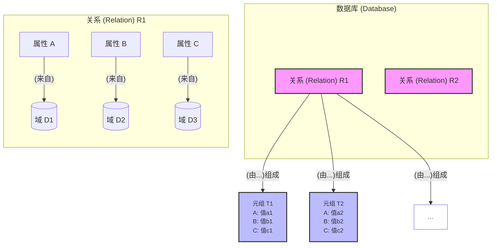
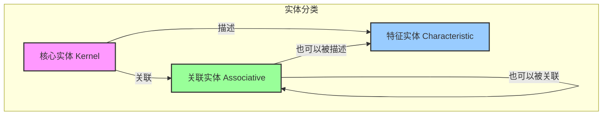
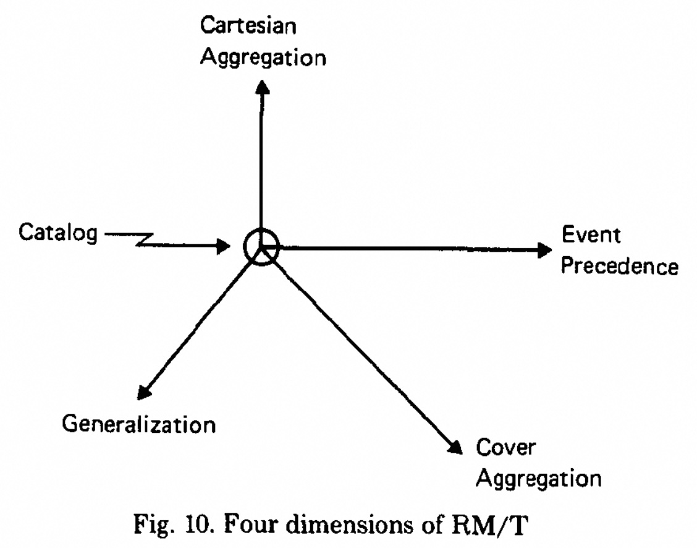
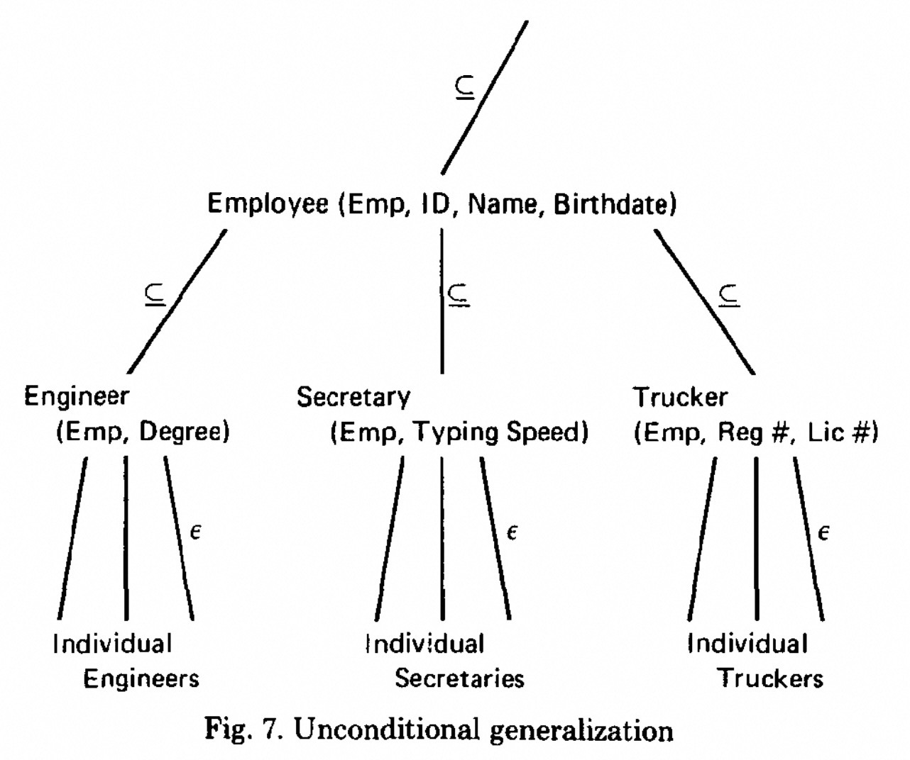
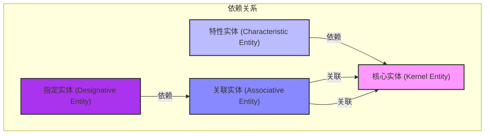

## AI论文解读 | Extending The Database Relational Model To Capture More Meaning
        
### 作者        
digoal        
        
### 日期        
2025-09-15       
        
### 标签        
PostgreSQL , PolarDB , DuckDB , AI , 论文解读        
        
----        
        
## 背景  
      
https://dl.acm.org/doi/pdf/10.1145/320107.320109        
  
提示:          
```          
读懂《Extending The Database Relational Model To Capture More Meaning》这篇论文需要提前掌握哪些基础知识, 请使用中文通熟易懂的讲解这些基础知识, 可以引用论文中的图、表或使用Markdown支持的图形(text,mermaid等)增加解释性. 
  
使用中文通熟易懂的解读《Extending The Database Relational Model To Capture More Meaning》这篇论文, 其中的关键内容请着重讲解, 可以引用论文中的图、表或使用Markdown支持的图形(text,mermaid等)增加解释性. 
  
提取《Extending The Database Relational Model To Capture More Meaning》这篇论文中的重要术语, 使用中文对这些术语进行通熟易懂的讲解, 可以引用论文中的图、表或使用Markdown支持的图形(text,mermaid等)增加解释性. 
```     
  
## 1 前置知识 
  
你好，理解Codd的这篇论文《Extending The Database Relational Model To Capture More Meaning》（扩展关系数据库模型以捕获更多含义）需要你对经典的关系数据库模型有扎实的基础知识。这篇论文正是基于这一基础，提出了进一步的扩展。

要读懂这篇论文，你需要掌握的核心基础知识可以分为以下几个部分：

### 1\. 经典关系模型的核心概念

论文在第二部分对关系模型进行了简要回顾，这为你理解论文的扩展内容奠定了基础。你需要理解以下基本术语：

  * **域 (Domain)**：指一组具有相似类型的值的集合，例如所有可能的员工编号或所有可能的日期。如果域中的所有值都是不可再分的（原子值），则该域是**简单域**。 
  * **属性 (Attribute)**：关系中的一列，是域的特定用途名称。一个关系可以有多个属性，即使它们都来自同一个域。 
  * **元组 (Tuple)**：关系中的一行。它由一组（属性：值）对组成。在表中，元组之间没有重复，并且行和列的顺序是无关紧要的。 
  * **关系 (Relation)**：定义在n个域上的元组子集，可以被看作是一个表格。一个关系有n个属性，其度（degree）为n。 
  * **键 (Keys)**：
      * **候选键 (Candidate Key)**：能唯一标识关系中每个元组的一组属性。 
      * **主键 (Primary Key)**：从候选键中选择的一个，作为关系的唯一标识符。 
  * **完整性规则 (Integrity Rules)**：
      * **实体完整性 (Entity Integrity)**：基关系（Base Relation）的主键值不允许为空。 
      * **参照完整性 (Referential Integrity)**：如果一个属性（外键）的值引用了另一个关系的主键，那么这个值必须在被引用的关系中存在。 

下面的文本图可以帮助你理解这些概念的关系：



-----

### 2\. 关系代数及其操作符

论文强调，关系代数的操作符与关系结构本身一样，是关系模型不可或缺的一部分。掌握这些操作符的定义至关重要：

  * **THETA-SELECT (选择)**：从关系中根据特定条件选择元组（行）。 
  * **PROJECTION (投影)**：从关系中选择指定的属性（列），并删除重复的元组。 
  * **THETA-JOIN (连接)**：根据两个关系中属性值之间的某种关系（如相等或不等）来连接元组。论文区分了 EQUI-JOIN（等值连接）和更通用的 THETA-JOIN。 
  * **NATURAL JOIN (自然连接)**：一种特殊的等值连接，会自动删除连接后产生的多余列。 
  * **DIVIDE (除法)**：一种用于处理“对于所有...都满足”这类查询的操作符。 

-----

### 3\. 高级概念：空值与三值逻辑

论文在回顾了基本关系模型后，立即深入讨论了空值（null values，用`ω`表示）的处理方法。  这部分是论文的重要扩展内容，你需要了解：

  * **空值的含义**：论文主要关注“当前值未知”这一类型的空值。 
  * **三值逻辑 (Three-valued logic)**：为了处理空值，论文引入了真 (T)、假 (F) 和未知 (ω) 三个真值。例如，如果 `x` 或 `y` 为空，那么 `x=y` 的结果就是“未知”。 
  * **扩展的关系代数**：由于引入了空值，经典的关系代数操作符需要进行扩展。论文提出了“真 (TRUE)”和“可能 (MAYBE)”版本的连接（JOIN）和除法（DIVISION）等操作，以处理可能包含空值的情况。 

-----

### 4\. 逻辑基础

论文也提到了关系模型与 **一阶谓词逻辑（first-order predicate logic）** 的紧密联系。  尽管论文强调两者不等同，但理解谓词逻辑能帮助你更好地理解关系查询语言（如SQL）的理论基础和推理能力。

通过对以上概念的掌握，你将能够更好地理解论文后续提出的对关系模型的扩展，例如如何通过“实体类型（Entity Types）”、“特性关系（Characteristic Relations）”和“聚合（Aggregation）”等概念来捕获更多的数据语义（data semantics）。

\<br\>

如果你已经对这些基础知识有了概念，我们可以继续深入探讨论文的具体扩展部分，比如它如何通过**RM/T**（Relational Model/T）来支持原子语义和分子语义。你希望我为你解释论文中提到的哪一种扩展，例如实体、属性和关联的分类方案，还是笛卡尔聚合和泛化？
  
## 2 解读论文 
  
好的，我们来一起解读 E.F. Codd 于1979年发表的这篇经典论文——《扩展数据库关系模型以捕获更多含义》（Extending the Database Relational Model to Capture More Meaning）。

这篇论文意义重大，因为它在最初的关系模型基础上，引入了更丰富的“语义”概念，旨在让数据库不仅能存储数据，更能理解数据背后的现实世界含义。这为后来的实体-关系（ER）模型和面向对象数据库的发展奠定了重要基础。

Codd 提出的这个扩展模型被称为 **RM/T**（Relational Model/Tasmania，因为他最初是在塔斯马尼亚的一次会议上提出这些想法的 ）。

下面，我将为您通俗地解读其核心思想和关键内容。

### **1. 为什么要扩展关系模型？—— “捕获更多含义”**

Codd 在1970年提出了关系模型，其简洁的二维表结构（关系）极大地简化了用户对数据的操作，让他们从复杂的存储细节中解放出来 。

然而，随着应用的深入，人们发现标准的关系模型在表达数据内在含义方面存在不足。例如：

  * “工程师”是“员工”的一种，这种“is-a”的继承关系如何体现？
  * “订单”和“产品”之间的“包含”关系，与“员工”和“部门”之间的“属于”关系，在模型层面如何区分？
  * 所有的数据都放在一张张扁平的表里，有些现实世界中紧密关联的“分子”级信息被拆散了。

为了解决这些问题，Codd 的目标是“捕获更多的数据含义 (capture more of the meaning of the data)” ，让数据库系统能更“智能”地运作 。他将此分为两个方向 ：

1.  **原子语义 (Atomic Semantics)**：寻找构成信息的最基本、最小的意义单元 。
2.  **分子语义 (Molecular Semantics)**：寻找比单个关系（表）更大的、有意义的信息聚合体 。

RM/T 模型正是围绕这两个方向展开的。

### **2. 核心扩展之一：实体唯一标识 —— 代理键 (Surrogate)**

这是 RM/T 中一个非常基础且重要的概念。

**问题背景**：在经典关系模型中，我们使用“主键”（Primary Key）来唯一标识一行数据，例如用“员工编号”标识员工。但 Codd 指出，使用用户定义的、有实际意义的键（如员工编号、身份证号）作为实体的永久标识存在三个问题 ：

1.  **可变性**：用户定义的键可能需要改变。例如，公司合并时，员工编号可能需要重新编排 。
2.  **不同源问题**：两个关系可能用不同的键指代同一个现实世界的实体。例如，一个表用“身份证号”，另一个表用“员工工号”来标识同一个人 。
3.  **生命周期问题**：某个实体可能在拥有用户键之前或之后就需要被记录。例如，一个“求职者”还没有员工编号，一个“退休人员”的员工编号可能已作废，但我们仍需存储他们的信息 。

**解决方案：代理键 (Surrogate)**
为了解决上述问题，Codd 提议引入一个由**系统内部生成和管理**的、对用户不可见的唯一标识符，即“代理键” 。

  * **唯一且永久**：每个实体（无论是什么类型）都有一个在整个数据库生命周期中唯一且不变的代理键 。
  * **系统控制**：用户无法修改代理键的值，甚至看不到它的具体值 。
  * **真实世界映射**：两个代理键相等，当且仅当它们指向现实世界中的同一个实体 。

这个概念极大地影响了后来的数据库设计，今天我们常说的“无意义ID键”（例如，自增ID、UUID）就是代理键思想的体现。所有代理键都来源于一个特殊的域，称为 **E-Domain** (Entity-Domain) 。

### **3. 核心扩展之二：实体与关系的分类**

为了更精确地描述世界，RM/T 对实体和关系进行了分类。它将现实世界中的事物抽象为不同类型的实体，并用专门的关系（表）来存储它们。

#### **E-关系 (E-relation)：实体的存在声明**

RM/T 为每一种实体类型（如员工、部门、项目）都定义了一个一元的 **E-relation** 。这个表非常简单，只包含一列，即该实体类型的代理键。

它的作用是：**声明哪些实体“存在”于数据库中，并且属于这个类型** 。

例如，`EMPLOYEE` E-relation 存储了所有员工实体的代理键。一个代理键出现在这个表中，就意味着这个实体是一个“员工”。

```
  EMPLOYEE (E-relation)
+----------------------+
| EMPLOYEE_SURROGATE   |
+----------------------+
| @s123                |  <- 员工张三的代理键
| @s124                |  <- 员工李四的代理键
| ...                  |
+----------------------+
```

#### **P-关系 (P-relation)：实体的属性描述**

用于描述实体**单值属性**的关系被称为 **P-relation** (Property-relation) 。它的主键是来自对应 E-relation 的代理键，其他列则是该实体的各种属性 。

例如，`EMPLOYEE_PROPERTIES` P-relation 存储了员工的姓名、出生日期等。

```
          EMPLOYEE_PROPERTIES (P-relation)
+----------------------+------------+-------------+
| EMPLOYEE_SURROGATE   | NAME       | BIRTHDATE   |
+----------------------+------------+-------------+
| @s123                | '张三'     | '1990-05-20'|
| @s124                | '李四'     | '1988-11-12'|
| ...                  | ...        | ...         |
+----------------------+------------+-------------+
```

#### **实体的三种类型 (Classification of Entities)**

这是 RM/T 语义表达能力的核心。Codd 将实体分为三类 ，如下图所示：



  * **核心实体 (Kernel Entity)**：它们是独立的、主要的实体，不依赖于其他实体而存在 。例如，“员工”、“部门”、“供应商”等。
  * **特征实体 (Characteristic Entity)**：它们的存在是为了**描述**另一个实体，通常用来表示“多值属性”或复杂的属性结构 。例如，一个员工的“工作经历”或“学历背景”。每一条工作经历都依赖于某个员工存在。
  * **关联实体 (Associative Entity)**：它们代表了两个或多个其他实体之间的**关联关系**，并且这种关联本身也可以拥有属性，甚至可以被进一步关联 。例如，“员工”和“项目”之间的“分配”关系。一次分配可以有“开始日期”这个属性，并且这次分配本身可以作为一个实体被其他事件引用。

这种分类比简单的关系模型强大得多。例如，“员工分配到项目”这个事件，在传统模型中可能只是一张包含员工ID和项目ID的连接表。但在 RM/T 中，它可以被建模为一个“关联实体”，拥有自己的代理键，从而可以被“特征实体”（如“周报”）所描述，这在语义上更清晰、更强大。

### **4. 核心扩展之三：分子语义的四个维度**

RM/T 引入了四种机制来构建比单个关系更大的“分子”级别的语义单元 ，如下图所示。

   
  
图 10: RM/T的四个语义维度   
  

1.  **笛卡尔聚合 (Cartesian Aggregation)**
    这是指将一个**对象间的关系**本身抽象成一个更高级别的对象 。上面提到的实体分类就是笛卡尔聚合的体现：

      * 将多个简单属性（如姓名、地址）聚合，形成一个实体（如员工） 。
      * 将多个实体（如员工、项目）聚合，形成一个关联实体（如分配任务） 。

2.  **概括 (Generalization)**
    这是指将一组相似的对象视为一个通用的、更概括的对象 。这主要体现为**子类型 (subtype)** 和 **继承 (inheritance)** 的概念。

      * 例如，“工程师”、“秘书”和“司机”都是“员工”的子类型 。
      * 子类型会继承父类型的所有属性。例如，只要是“工程师”，就必然拥有“员工”的姓名、工号等所有属性 。
      * RM/T 使用了专门的图关系（如 `UGI-relation`）来记录这种类型间的“is-a”层级关系 。

    

    ```mermaid
    graph TD
        Employee --> Engineer
        Employee --> Secretary
        Employee --> Trucker
    ```

      

    *图 7 的简化表示: 概括关系*

3.  **覆盖聚合 (Cover Aggregation)**
    这是一种“成员-集合”的关系，与“is-a”的概括关系不同 。它表示一个实体集合（Cover），其成员是其他类型的实体。

      * 最经典的例子是“船队”和“船” 。一艘船是船队的**成员**，但一艘船**不是**一种船队（不是 is-a 关系）。
      * 一个实体可以同时属于多个集合（例如，一个人可以属于多个俱乐部），所以这种关系是“覆盖”而非严格的“划分” 。

4.  **事件优先 (Event Precedence)**
    RM/T 还特别考虑了对“事件”类型实体的支持。事件实体通常带有时间戳（如发生时间、开始/结束时间） 。

      * 模型可以定义事件类型之间的**先后顺序**关系。例如，必须先有“下订单”事件，才可能有“发货”事件 。
      * 这种定义可以作为一种数据库的完整性约束，由系统来检查和保证 。

### **5. 新的代数操作符**

为了支持上述扩展，Codd 也为关系代数增加了一系列新的操作符 ，用于处理代理键、关系名称、关系集合以及各种图关系（用于存储模型元数据）。例如：

  * **`NOTE(R)` / `DENOTE(r)`**：获取关系的名称或通过名称引用关系 。
  * **图操作符 (Graph Operators)**：如 `CLOSE` (计算传递闭包) 和 `OPEN` (移除间接关系)，用于在概括层级等图中进行推理 。
  * **`OUTER JOIN` (外连接)**：这篇论文还正式提出了**外连接**的概念，用于在连接没有完全匹配的数据时，通过生成 NULL 值来保留所有信息 。这对于整合不同子类型的属性非常重要。

### **结论与影响**

《扩展数据库关系模型以捕获更多含义》是数据库理论发展史上的一个里程碑。

  * **优点**：RM/T 极大地增强了关系模型的语义表达能力，使其能更自然、更精确地映射现实世界。它形式化地定义了实体、属性、关系、子类型、继承等重要概念。
  * **复杂性**：Codd 自己也承认，这个扩展模型比原来的关系模型要复杂得多，它主要面向的是数据库设计者和高级用户，而大多数普通用户可能还是更喜欢简单经典的关系模型 。
  * **深远影响**：RM/T 的思想深刻影响了后续的数据建模技术。
      * **实体-关系模型 (ER Model)**：Peter Chen 的 ER 模型和 RM/T 在很多思想上是共通的，都强调实体、关系和属性。
      * **面向对象数据库 (OODB)**：RM/T 中的对象标识（代理键）、类型层次（概括）和聚合等概念，都是后来面向对象数据库的核心特征。
      * **SQL 标准**：今天 SQL 标准中的一些特性，如 `UUID` 数据类型、对象关系扩展等，都可以看作是 RM/T 思想的延续和实现。

总而言之，这篇论文的目标是让数据库“知其然，更知其所以然”，为构建更智能、更稳健、更能反映现实世界复杂性的信息系统提供了坚实的理论基础。
  
## 3 术语 
  
在《Extending The Database Relational Model To Capture More Meaning》这篇论文中，Codd为了让关系模型能更好地捕捉数据的“含义”（semantics），在经典关系模型的基础上引入了许多重要的新术语和概念。

以下是论文中几个关键术语的中文讲解：

### 1\. 原子语义与分子语义（Atomic and Molecular Semantics）

这是贯穿论文的两个核心思想。

  * **原子语义（Atomic Semantics）**：指的是将数据分解到最基本的、有意义的单元。它关注的是如何更好地理解和分类单个数据元素，比如一个实体、一个属性或一个关联。例如，区分一个“员工”实体和一个“电话号码”属性，就是一种原子语义的体现。
  * **分子语义（Molecular Semantics）**：指的是将多个基本单元组合成一个更有意义的“分子”。它关注的是如何表示和处理比传统关系（二维表）更大的逻辑单元。例如，如何将一个“订单”与其包含的多个“订单项”作为一个整体来处理。这正是论文中“聚合”（Aggregation）和“泛化”（Generalization）所要解决的问题。

### 2\. 实体类型分类（Entity Type Classification）

这是论文中最具创新性的部分之一，它将现实世界中的“实体”分成了四种类型。

  * **核心实体（Kernel Entity）**：独立存在、不依赖于其他任何实体的实体。它们通常是数据模型中的“主角”。
      * **例子**：`员工`、`部门`、`产品`。
  * **特性实体（Characteristic Entity）**：它描述或进一步限定另一个核心实体，并且它的存在依赖于那个核心实体。它通常是“一对多”关系中的“多”方。
      * **例子**：如果一个员工可以有多个电话号码，`员工电话`就是一个特性实体，它依赖于`员工`实体。
  * **关联实体（Associative Entity）**：它代表了两个或多个独立实体之间的关系。它的主键通常由所关联实体的键组合而成。
      * **例子**：`课程`和`学生`之间的`选课`记录就是一个关联实体，它的主键可能是`（课程ID, 学生ID）`。
  * **指定实体（Designative Entity）**：一个实体，其主键完全由它的外部依赖项构成，而且没有自己的核心属性（非键属性）。它本质上是两个实体之间的`多对多`关系，但其本身没有独立信息。
      * **例子**：在`项目`和`员工`之间的`工作分配`关系中，如果这张表只包含`项目ID`和`员工ID`，而没有其他信息（如工作时长），那么它就是一种指定实体。

下面的Mermaid图展示了这四种实体类型之间的关系：



### 3\. `ω` (Omega) 与 三值逻辑

  * **`ω`（空值）**：论文用希腊字母 `ω` 来表示关系模型中的空值（null value）。它明确指出，空值代表“当前值未知”，而不是“不存在”或“不适用”。这一区分对于数据处理至关重要。
  * **三值逻辑（Three-valued logic）**：为了处理带有 `ω` 的数据，论文引入了三值逻辑：**真 (TRUE)**, **假 (FALSE)**, 和 **未知 (ω)**。例如，在传统数据库中，`10 > 5` 结果为真，`10 > 20` 结果为假。但如果比较表达式中包含空值，例如 `年龄 > 30`，而`年龄`是`ω`，那么结果就是**未知**。

### 4\. 笛卡尔聚合与泛化（Cartesian Aggregation and Generalization）

这是论文为了处理“分子语义”而提出的两种高级概念。

  * **笛卡尔聚合（Cartesian Aggregation）**：它将一组属性或关系（这些关系可能来自不同的表）作为一个新的、更高层次的实体来看待。这与面向对象编程中的“聚合”（Composition）概念类似。
      * **例子**：一个`订单`实体，它由`客户`实体、`送货地址`实体以及多个`订单项`实体聚合而成。
  * **泛化（Generalization）**：它是一种“is-a”关系，用于表示一个实体类型是另一个更通用实体类型的子类型。
      * **例子**：`员工`和`学生`都可以被“泛化”为一个更通用的`人`实体类型。

-----

希望这些解释能帮助你更好地理解这篇论文。如果你想进一步探讨这些概念，比如想看看如何将一个实际的数据模型用这些术语来描述，请随时告诉我。
  
## 参考        
         
https://dl.acm.org/doi/pdf/10.1145/320107.320109    
        
<b> 以上内容基于DeepSeek、Qwen、Gemini及诸多AI生成, 轻微人工调整, 感谢杭州深度求索人工智能、阿里云、Google等公司. </b>        
        
<b> AI 生成的内容请自行辨别正确性, 当然也多了些许踩坑的乐趣, 毕竟冒险是每个男人的天性.  </b>        
    
#### [期望 PostgreSQL|开源PolarDB 增加什么功能?](https://github.com/digoal/blog/issues/76 "269ac3d1c492e938c0191101c7238216")
  
  
#### [PolarDB 开源数据库](https://openpolardb.com/home "57258f76c37864c6e6d23383d05714ea")
  
  
#### [PolarDB 学习图谱](https://www.aliyun.com/database/openpolardb/activity "8642f60e04ed0c814bf9cb9677976bd4")
  
  
#### [PostgreSQL 解决方案集合](../201706/20170601_02.md "40cff096e9ed7122c512b35d8561d9c8")
  
  
#### [德哥 / digoal's Github - 公益是一辈子的事.](https://github.com/digoal/blog/blob/master/README.md "22709685feb7cab07d30f30387f0a9ae")
  
  
#### [About 德哥](https://github.com/digoal/blog/blob/master/me/readme.md "a37735981e7704886ffd590565582dd0")
  
  

  
