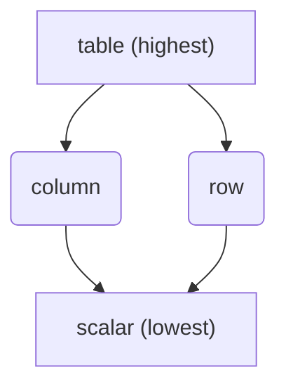
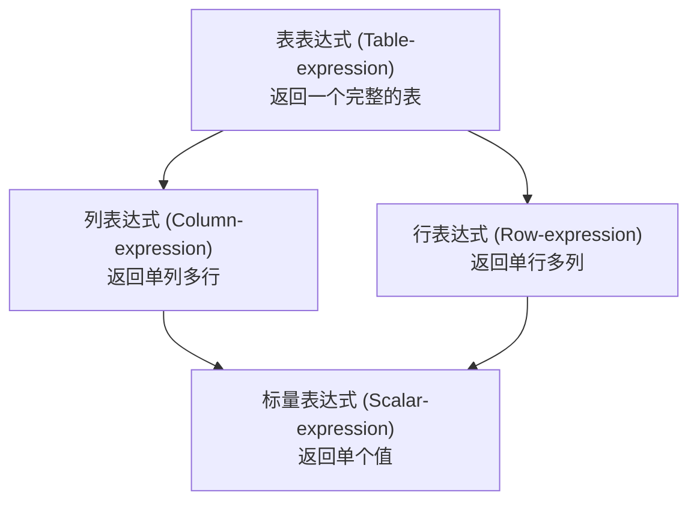
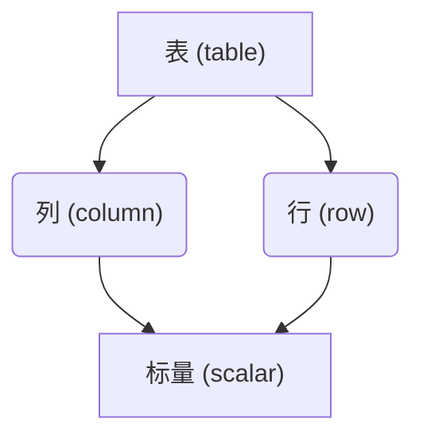

## AI论文解读 | A Critique Of The Sql Database Language
        
### 作者        
digoal        
        
### 日期        
2025-09-15       
        
### 标签        
PostgreSQL , PolarDB , DuckDB , AI , 论文解读        
        
----        
        
## 背景  
      
https://dl.acm.org/doi/pdf/10.1145/984549.984551        
  
提示:          
```          
读懂《A Critique Of The Sql Database Language》这篇论文需要提前掌握哪些基础知识, 请使用中文通熟易懂的讲解这些基础知识, 可以引用论文中的图、表或使用Markdown支持的图形(text,mermaid等)增加解释性. 
  
使用中文通熟易懂的解读《A Critique Of The Sql Database Language》这篇论文, 其中的关键内容请着重讲解, 可以引用论文中的图、表或使用Markdown支持的图形(text,mermaid等)增加解释性. 
  
提取《A Critique Of The Sql Database Language》这篇论文中的重要术语, 使用中文对这些术语进行通熟易懂的讲解, 可以引用论文中的图、表或使用Markdown支持的图形(text,mermaid等)增加解释性. 
```     
  
## 1 前置知识 
  
这篇文章名为《A Critique Of The Sql Database Language》（对SQL数据库语言的批判），由C.J.Date于1983年撰写。要理解这篇论文，您需要提前掌握以下几个核心基础知识。

### 1\. 关系模型 (Relational Model)

这是理解这篇论文最重要的基础。关系模型是Codd于1970年代提出的数据库理论，它将数据组织成表格（表）。论文中的所有概念都基于这一模型。

  * **关系 (Relation) / 表 (Table)**：数据以二维表格的形式存储。
  * **元组 (Tuple) / 行 (Row)**：表中的每一行都代表一个数据记录。
  * **属性 (Attribute) / 列 (Column)**：表中的每一列都代表数据的一个特定字段。

### 2\. 关系代数 (Relational Algebra)

关系代数是一套用于操作关系的理论运算，是关系型数据库查询语言（如SQL）的理论基础。论文多次通过对比SQL与关系代数来批判SQL的局限性。

  * **并集 (Union)**：将两个具有相同结构的表合并，去除重复行。
  * **笛卡尔积 (Product)**：将两个表的所有行进行两两组合。
  * **选择 (Restriction/Selection)**：从表中筛选出符合特定条件的行。
  * **投影 (Projection)**：从表中选择特定的列。
  * **连接 (Join)**：基于两个表的共同列，将它们组合成一个新表。

### 3\. SQL（结构化查询语言）基础

论文的核心是批判SQL，因此您必须对SQL有基本的了解。这篇论文是在SQL语言早期版本（主要指IBM的SQL/DS和DB2）的基础上进行的批判，但其核心思想至今仍然具有参考价值。

  * **基本查询语句**：掌握 `SELECT`, `FROM`, `WHERE`, `GROUP BY`, `HAVING` 等基本子句的用法。
  * **子查询 (Subquery)**：在一个SQL语句中嵌套另一个查询。
  * **数据类型**：了解基本的数据类型，如`INTEGER`, `FLOAT`等。

### 4\. 编程语言基础概念

论文的作者C.J.Date是计算机语言设计专家，因此他从更普遍的编程语言设计原则来审视SQL。

  * **正交性 (Orthogonality)**：这是论文中反复提到的一个核心概念 。在编程语言设计中，正交性指的是语言的不同特性可以独立组合，而不会产生意料之外的副作用。论文批判SQL在表达式、内置函数等方面缺乏正交性 。
  * **表达式 (Expression)**：能够产生值的代码片段。论文将SQL中的表达式分为四类，并展示了它们之间的关系 ：
      * **表表达式 (table-expression)**：结果为一个表。
      * **列表达式 (column-expression)**：结果为一列。
      * **行表达式 (row-expression)**：结果为一行。
      * **标量表达式 (scalar-expression)**：结果为一个单一的标量值。

论文中有一张图表非常直观地展示了这四种表达式的关系：



  * **闭包性 (Closure Property)**：一个运算的输入和输出类型是相同的。例如，关系代数中，对关系进行运算的结果仍然是关系，因此可以进行嵌套运算 。论文批判SQL的表达式缺乏这种闭包性，导致嵌套不灵活 。

### 5\. 数据库设计概念

  * **外键 (Foreign Key)**：一个表中的字段，其值必须与另一个表的主键值匹配，用于保证数据之间的引用完整性。论文指出，早期的SQL版本缺乏对外键概念的支持 。
  * **视图 (View)**：一个虚拟的表，其内容由查询结果定义。
  * **空值 (Null Value)**：表示缺失或未知数据。论文对SQL如何处理空值提出了多项批评 。

-----

如果您对论文中的某个特定部分有疑问，或者想了解作者在批判某个特定SQL特性时是如何将其与关系模型或关系代数进行对比的，我可以为您进行更详细的解释。
  
## 2 解读论文 
  
好的，我们来一起通俗易懂地解读这篇数据库领域的经典论文——C.J. Date 在1983年发表的《A Critique of the SQL Database Language》。

### 核心概要：这篇论文在说什么？

想象一下，在1983年，SQL还像一个刚学会走路的孩子，虽然比之前的技术（如IMS的DL/I、CODASYL的DML）好用太多，但走起路来摇摇晃晃，充满了不规范和不一致。C.J. Date，这位关系数据库模型的“传教士”，就像一位严格的老师，写了这篇“批评报告”，逐一指出了这个“孩子”身上的各种毛病。

**论文的核心论点是：SQL在设计上缺乏“正交性”（Orthogonality），并且没有完全实现关系模型的潜力。**

这篇论文的意义非凡，它深刻地影响了后来SQL标准（如SQL-92、SQL:1999等）的制定，我们今天使用的许多SQL功能，可以说就是为了“修正”当年Date提出的这些问题。

-----

### 关键内容深度解读

#### 1\. 核心批评：缺乏正交性 (Lack of Orthogonality)

这是全文最核心、最反复强调的批评。

**什么是“正交性”？**
简单来说，就是语言的各个组成部分应该是独立的、一致的，并且可以自由组合。如果一个东西（比如一个表达式）可以在A场景使用，那么它也应该能在所有逻辑上说得通的B、C、D场景使用，而不应该有各种奇怪的“特殊规定”。

举个生活中的例子：算术表达式 `(2 + 3)` 的结果是一个数字，所以你可以把它用在任何需要数字的地方，比如 `(2 + 3) * 4` 或者 `10 - (2 + 3)`。这就是正交性。

而Date发现，1983年的SQL到处都是“例外”和“不行”。

##### **1.1 表达式的正交性缺失** 

Date首先定义了四种表达式类型，并指出了它们之间的层级关系 ：



理想情况下，一个返回“表”的表达式，应该可以被用在任何需要“表”的地方。但当时的SQL做不到。

**最典型的例子：`FROM` 子句。** 
当时的 `FROM` 后面只能跟 **表名 (table-name)**，而不能跟一个返回表的 **表表达式 (table-expression)**。

  * **问题场景**：假设你想对两个部门（纽约NYC和旧金山SFO）的员工合并后的结果，再进行筛选。
  * **“自然”的逻辑 (当时SQL不支持)**：
    ```sql
    -- 先合并，再选出员工号 (这是对一个union结果的投影)
    SELECT EMP# FROM (NYC UNION SFO) -- 伪代码，当时非法 
    ```
  * **当时SQL的“绕路”写法**：
    ```sql
    -- 先分别选出员工号，再合并 (这是对两个投影结果的union)
    SELECT EMP# FROM NYC
    UNION
    SELECT EMP# FROM SFO 
    ```
    你必须把“自然”的逻辑转换成SQL能接受的、不那么直观的形式 。

**现代SQL的解决方案**：现代SQL已经解决了这个问题。我们可以使用子查询或通用表表达式（CTE）:

```sql
-- 子查询 (Subquery)
SELECT EMP# FROM (SELECT * FROM NYC UNION ALL SELECT * FROM SFO) AS all_employees;

-- 通用表表达式 (CTE)
WITH all_employees AS (
    SELECT * FROM NYC
    UNION ALL
    SELECT * FROM SFO
)
SELECT EMP# FROM all_employees;
```

这完美体现了“表表达式”的正交性，也是受这篇论文批评所推动的改进之一。

论文中还用一张表格辛辣地指出了SQL对不同类型对象的操作支持是多么不完整和不一致 ：

| 对象 (obj) | 构造器 (constructor) | 比较 (compare) | 赋值 (assign) | 选择器 (selector) | 通用表达式 (gen expr) |
| :--- | :--- | :--- | :--- | :--- | :--- |
| **表 (table)** | 否 | 否 | 仅通过INSERT SELECT | 是 | 否 (核心问题) |
| **列 (column)** | 仅在IN中(常量/变量) | 是 | 否 | 是 | 否 |
| **行 (row)** | 仅在INSERT/UPDATE中 | 否 | 仅能与宿主语言集合互转 | (是) | 否 |
| **标量 (scalar)**| N/A | 是 | (是) | 仅能与宿主语言标量互转 | 否 |

这张表清晰地展示了SQL设计上的“补丁感”——到处都是“仅在...可以”、“否”。

##### **1.2 内置函数的正交性缺失** 

Date批评当时的内置函数（如`SUM`, `AVG`）的设计非常混乱。

  * **混乱的参数作用域**：`SUM(QTY)` 的含义取决于上下文。

      * `SELECT SUM(QTY) FROM SP;` -\> 对整张表的QTY列求和，返回一个值 。
      * `SELECT P#, SUM(QTY) FROM SP GROUP BY P#;` -\> 对每个分组的QTY求和，返回多个值 。
        `SUM(QTY)` 这个写法本身没变，但因为`GROUP BY`的出现，其行为完全不同。Date认为这破坏了语言的一致性 。

  * **无法嵌套**：你无法写出像 `AVG(SUM(QTY))` 这样的表达式来计算“每个零件总供应量的平均值” 。你必须先把 `SUM(QTY)` 的结果存入一个视图（View），然后再对这个视图求`AVG`，但论文指出，由于视图合并的机制问题，这样做也常常会失败 。

**现代SQL的解决方案**：现代SQL的窗口函数（Window Functions）极大地解决了函数嵌套和复杂计算的问题。上面的需求可以这样实现：

```sql
-- 计算每个零件的总量，然后计算这些总量的平均值
SELECT AVG(total_qty)
FROM (
    SELECT SUM(QTY) as total_qty
    FROM SP
    GROUP BY P#
) AS part_totals;
```

#### 2\. 对关系模型的背离 (Aspects of the Relational Model Not Supported)

Date认为SQL没有完全拥抱关系模型的核心思想，尤其是在以下几点：

##### **2.1 缺乏主键 (Primary Key) 和外键 (Foreign Key) 的概念** 

  * **问题**：在1983年的SQL中，主键和外键不是数据库模式（Schema）的一部分。你无法在`CREATE TABLE`时声明“这个字段是主键”。唯一性（uniqueness）是通过创建唯一索引 (`CREATE UNIQUE INDEX`) 这种物理层面的手段来保证的 。
  * **后果**：
    1.  **逻辑与物理混淆**：数据完整性（唯一性）本该是逻辑层面的定义，却与物理实现（索引）捆绑在了一起。删除索引就会破坏数据的完整性约束 。
    2.  **无法实现参照完整性**：没有外键，就无法让数据库自动保证`EMP`表里的`DEPT#`必须在`DEPT`表里存在。
    3.  **视图更新困难**：SQL不知道哪个字段是主键，因此很难制定出通用、可靠的视图更新规则 。

**现代SQL的解决方案**：`CREATE TABLE` 语句现在有了 `PRIMARY KEY` 和 `FOREIGN KEY` 约束，这已成为关系数据库的基石。

##### **2.2 对 NULL 值的混乱处理** 

Date对`NULL`一直持强烈的批评态度。他认为SQL对`NULL`的处理充满了矛盾和反直觉的设计 。

  * 在 `UNIQUE` 和 `ORDER BY` 中，`NULL` 值被视为彼此相等 。
  * 但在 `WHERE` 和 `GROUP BY` 中，`NULL` 值却不被视为相等 。
  * 判断是否为`NULL`必须用 `IS NULL`，而不能用 `= NULL` 。
  * 聚合函数如 `AVG`, `SUM` 会自动忽略 `NULL` 值，这导致 `AVG(STATUS)` 不一定等于 `SUM(STATUS) / COUNT(*)` ，这在数学上是荒谬的。

**现代SQL的现状**：虽然`NULL`的这些行为已经被标准化并延续至今，但关于`NULL`的争论从未停止。现代SQL提供了一些函数如 `COALESCE` 和 `NULLIF` 来更好地处理`NULL`，但其核心的“三值逻辑”（True, False, Unknown）依然是SQL学习中的一个难点。

#### 3\. 语言设计上的其他“错误”和不便

  * **`SELECT *` 的滥用**：Date指出 `SELECT *` 对交互式用户很方便，但对应用程序员来说是“危险的”，因为表的结构可能在程序生命周期内改变，导致程序出错 。

  * **冗余和易误导的操作符**：以 `=ANY` 为例，`WHERE AGE > ANY (SELECT AGE FROM ...)` 的直译是“比任意一个年龄大”，但它的实际意思是“比集合中最小的年龄大”，也就是“比某一个（some）年龄大” 。这种自然语言和实际效果的偏差很容易误导用户。论文甚至列举了7种不同的方式来写同一个简单查询，揭示了语言的冗余性 。

  * **与宿主语言的巨大鸿沟 (Mismatch with Host Language)** 
    当SQL嵌入到COBOL、PL/I等编程语言中时，两者格格不入。比如：

      * 数据类型不完全匹配 。
      * SQL有自己的`NULL`，但宿主语言没有 。
      * 变量引用方式、错误处理机制、语法规则都完全不同 。
        这使得嵌入式SQL编程非常笨拙和低效。

-----

### 总结与现代视角

C.J. Date的这篇论文像一面镜子，清晰地照出了早期SQL语言设计上的诸多缺陷。它虽然言辞犀利，但几乎所有的批评都切中要害。

  * **它的历史价值**：它为后续的SQL标准化工作提供了明确的“待办清单”。我们今天习以为常的**子查询作为派生表**、**`WITH`子句(CTE)**、**`PRIMARY KEY`/`FOREIGN KEY`约束**、**窗口函数**等，很大程度上都是对这些早期批评的回应和修正。

  * **它对今天的启示**：

    1.  **正交性** 依然是衡量任何API或语言设计好坏的黄金标准。一个好的设计应该力求简洁、一致、可组合。
    2.  一些历史遗留问题，比如`NULL`的复杂性，依然困扰着我们。理解这些问题的根源，有助于我们写出更健壮的SQL。
    3.  它提醒我们，一个语言的流行和它的完美程度是两回事。SQL凭借其简单的数据模型和强大的表达能力获得了成功，但它是在不断地“打补丁”和演进中才变得像今天这样强大。

总而言之，这篇论文不仅仅是对一个旧版本软件的抱怨，它是一份关于数据库语言设计原则的深刻洞见，其影响力贯穿了SQL发展的整个历史。
  
## 3 术语 
  
在《A Critique Of The Sql Database Language》这篇论文中，作者C.J.Date对早期SQL语言的不足进行了深入的批判。要理解这篇论文，掌握以下几个核心术语至关重要：

-----

### 1\. 正交性 (Orthogonality)

**正交性**是计算机语言设计中的一个重要原则，指的是语言的不同特性可以独立地、无限制地组合在一起，而不会产生意外的副作用或限制。

  * **论文中的批判**：作者认为SQL缺乏正交性。例如，SQL中的**表达式**在不同上下文中的行为不一致。一个在`SELECT`子句中能用的表达式，可能不能在`GROUP BY`或`WHERE`子句中使用。这种不一致性使得语言不够优雅和灵活。

### 2\. 闭包性 (Closure Property)

**闭包性**是指一个运算的输入和输出具有相同的类型。这意味着一个运算的结果可以作为另一个相同运算的输入，从而实现运算的嵌套。在关系代数中，对关系（表）进行操作的结果仍然是关系，因此可以轻松地将多个操作嵌套在一起。

  * **论文中的批判**：作者指出SQL在这方面存在问题。虽然SQL的基础是关系代数，但SQL中的一些操作破坏了闭包性。比如，对表进行操作可能得到一个非表类型的结果（如单一值），这就阻碍了查询的流畅嵌套。

### 3\. 空值 (Null Value)

**空值**是数据库中用来表示数据缺失或未知的一个特殊标记。

  * **论文中的批判**：论文用了一整节来批判SQL对空值的处理。作者认为，SQL对空值的定义和处理方式模糊不清，导致了复杂的行为，尤其是当它与**三值逻辑 (Three-valued logic)** (`TRUE`, `FALSE`, `UNKNOWN`) 结合时，会产生很多令人困惑的结果。

### 4\. 表达式 (Expression)

**表达式**是编程语言中能够产生一个值的代码片段。作者在论文中将SQL的表达式分为四种层次，并批判它们之间的层次结构导致了SQL的非正交性。

  * **标量表达式 (Scalar Expression)**：产生一个单一值（例如：`5 * 10`）。
  * **行表达式 (Row Expression)**：产生一个行（例如：`('Smith', 25, 'London')`）。
  * **列表达式 (Column Expression)**：产生一列（例如：一个`SELECT`查询结果中的单个列）。
  * **表表达式 (Table Expression)**：产生一个表（例如：整个`SELECT`语句的结果）。

以下图表展示了这四种表达式的逻辑关系：



作者认为，这种层次结构使得不同类型的表达式无法在所有期望的位置上互换，从而限制了语言的灵活性。

-----

希望这些解释能帮助您更好地理解这篇论文的核心思想。如果您对论文中的某个特定批判点（比如关于`GROUP BY`子句的限制，或是**完整性约束 (Integrity Constraint)** 方面）有更深入的疑问，我很乐意为您进一步分析。
  
## 参考        
         
https://dl.acm.org/doi/pdf/10.1145/984549.984551    
        
<b> 以上内容基于DeepSeek、Qwen、Gemini及诸多AI生成, 轻微人工调整, 感谢杭州深度求索人工智能、阿里云、Google等公司. </b>        
        
<b> AI 生成的内容请自行辨别正确性, 当然也多了些许踩坑的乐趣, 毕竟冒险是每个男人的天性.  </b>        
    
#### [期望 PostgreSQL|开源PolarDB 增加什么功能?](https://github.com/digoal/blog/issues/76 "269ac3d1c492e938c0191101c7238216")
  
  
#### [PolarDB 开源数据库](https://openpolardb.com/home "57258f76c37864c6e6d23383d05714ea")
  
  
#### [PolarDB 学习图谱](https://www.aliyun.com/database/openpolardb/activity "8642f60e04ed0c814bf9cb9677976bd4")
  
  
#### [PostgreSQL 解决方案集合](../201706/20170601_02.md "40cff096e9ed7122c512b35d8561d9c8")
  
  
#### [德哥 / digoal's Github - 公益是一辈子的事.](https://github.com/digoal/blog/blob/master/README.md "22709685feb7cab07d30f30387f0a9ae")
  
  
#### [About 德哥](https://github.com/digoal/blog/blob/master/me/readme.md "a37735981e7704886ffd590565582dd0")
  
  

  
