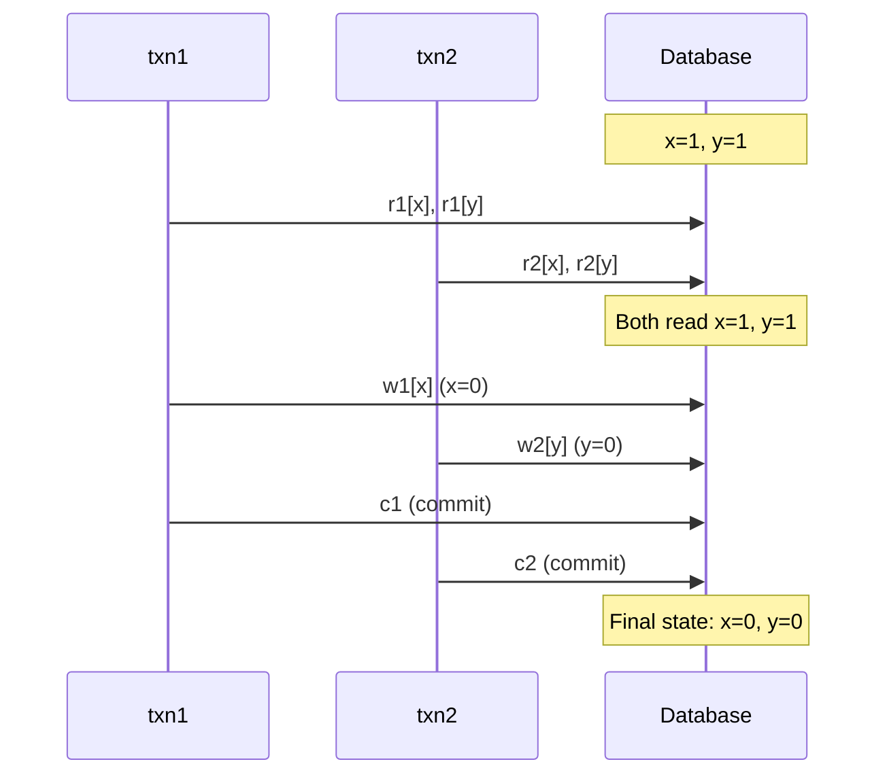
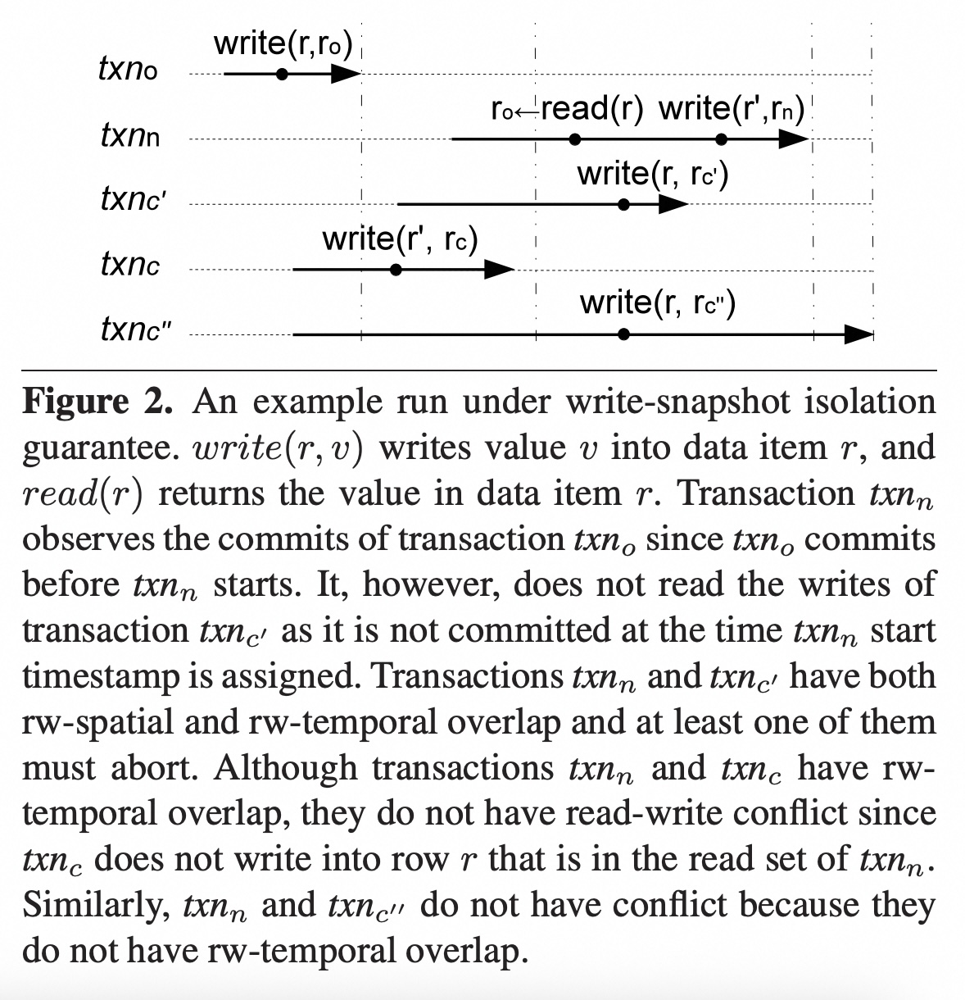
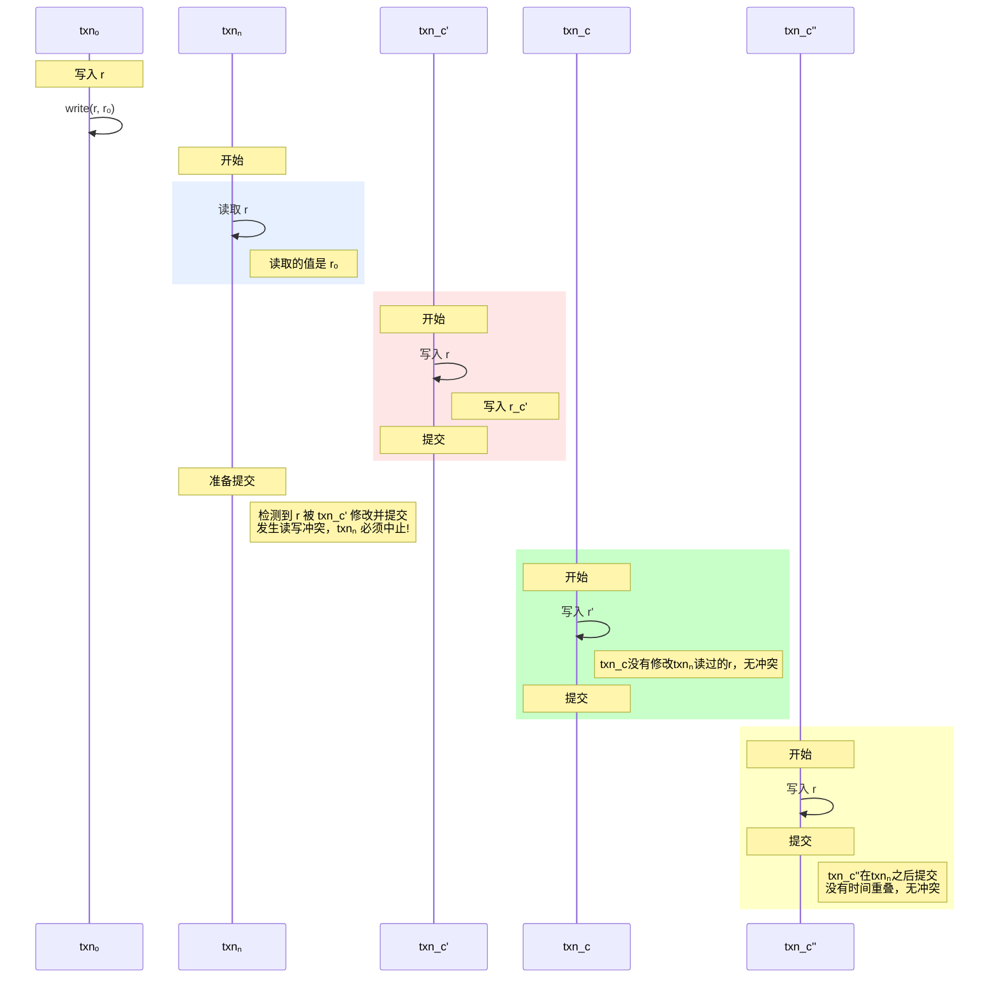
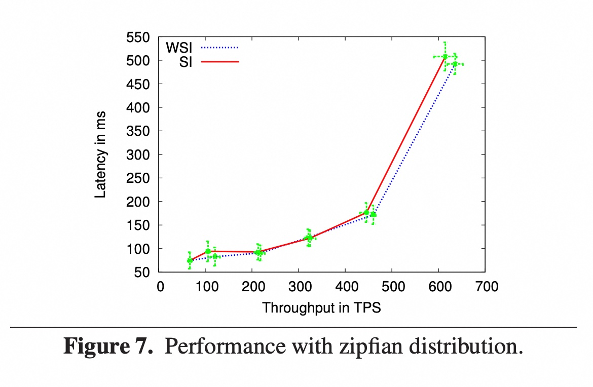
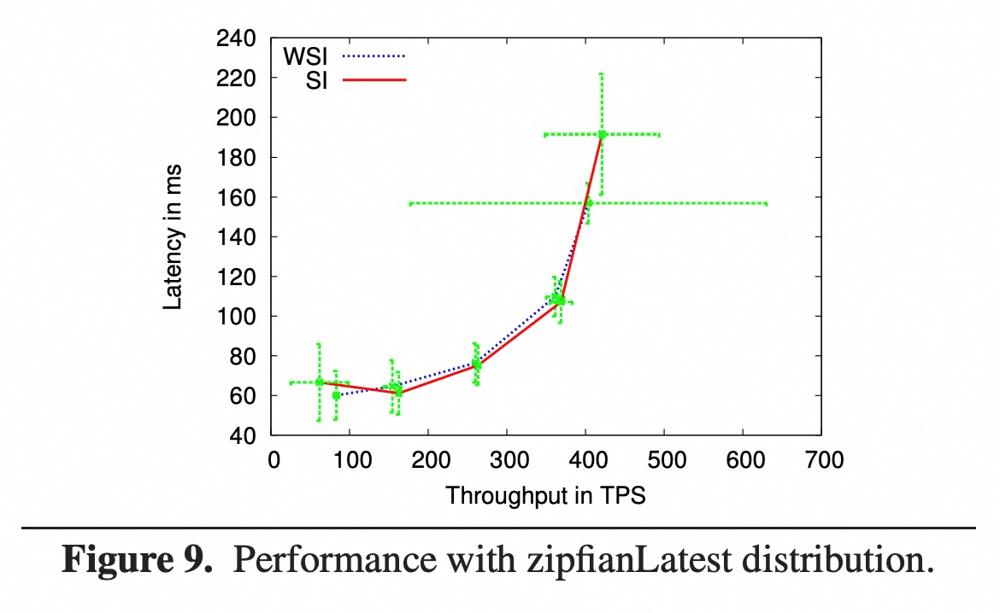
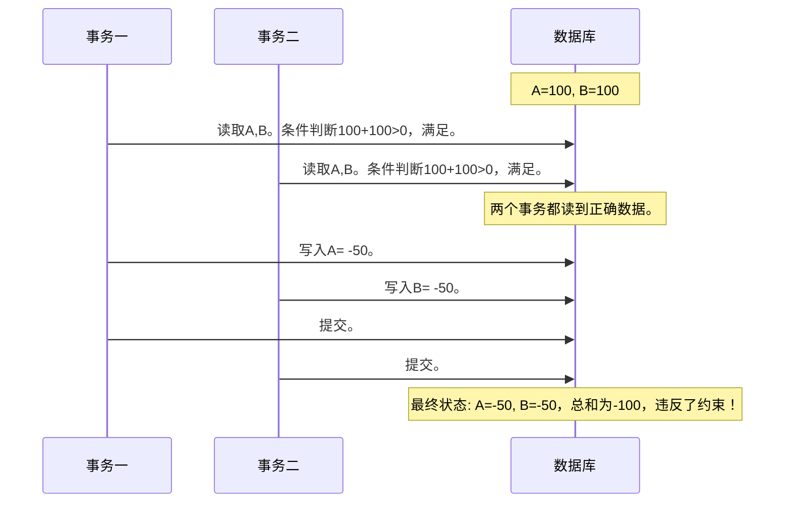

## AI论文解读 | A Critique of Snapshot Isolation
        
### 作者        
digoal        
        
### 日期        
2025-09-16       
        
### 标签        
PostgreSQL , PolarDB , DuckDB , AI , 论文解读        
        
----        
        
## 背景  
      
https://dl.acm.org/doi/pdf/10.1145/2168836.2168853        
  
提示:          
```          
读懂《A Critique of Snapshot Isolation》这篇论文需要提前掌握哪些基础知识, 请使用中文通熟易懂的讲解这些基础知识, 可以引用论文中的图、表或使用Markdown支持的图形(text,mermaid等)增加解释性. 
  
使用中文通熟易懂的解读《A Critique of Snapshot Isolation》这篇论文, 其中的关键内容请着重讲解, 可以引用论文中的图、表或使用Markdown支持的图形(text,mermaid等)增加解释性. 
  
提取《A Critique of Snapshot Isolation》这篇论文中的重要术语, 使用中文对这些术语进行通熟易懂的讲解, 可以引用论文中的图、表或使用Markdown支持的图形(text,mermaid等)增加解释性. 
```     
  
## 1 前置知识 
  
您好，要读懂《A Critique of Snapshot Isolation》这篇论文，您需要提前掌握以下几个核心的数据库基础知识。这篇论文的讨论是建立在这些概念之上的，理解它们是理解论文主要论点的前提。

-----

### **1. 事务 (Transaction) 与 ACID 特性**

首先，您需要理解什么是**事务**。在数据库管理系统（DBMS）中，事务是一个“原子性的执行单元”，它可能包含对数据库的多次读和写操作 。一个可靠的事务系统必须提供 ACID 属性，即**原子性（Atomicity）**、**一致性（Consistency）**、**隔离性（Isolation）和持久性（Durability）** 。

这篇论文主要关注的是**隔离性**（Isolation），它定义了并发事务存在时系统的行为 。

### **2. 并发控制 (Concurrency Control) 与 可串行化 (Serializability)**

当多个事务同时运行时，如果不加以控制，可能会导致数据不一致。**并发控制**就是用来解决这个问题的。

**可串行化**是理想的隔离级别 。它意味着并发执行多个事务的结果，等同于它们以某种顺序串行（即不并发）执行的结果 。然而，由于实现成本高昂且可能导致并发度降低，可串行化在实践中通常会被削弱 。

### **3. 隔离级别 (Isolation Levels) 与 快照隔离 (Snapshot Isolation)**

由于可串行化的开销，商业系统会采用较弱的隔离级别来提高效率，其中最常见的就是**快照隔离** 。

**快照隔离**的工作原理是：事务读取数据时，系统会为它提供一个“快照”（Snapshot） 。这个快照是在事务开始时的数据版本，因此事务在读取时不会受到其他并发事务的影响 。这种机制通常通过 **多版本并发控制（MVCC）** 来实现，即数据库会为数据维护多个版本 。

### **4. 事务异常 (Transaction Anomalies)**

由于快照隔离等弱隔离级别没有提供可串行化的保证，它们可能会允许一些“事务异常”发生 。论文中特别提到了以下两种重要的异常：

#### **写倾斜 (Write Skew)**

写倾斜是一种典型的、快照隔离无法阻止的异常 。论文中给出了一个经典的例子：假设有一个约束条件 `x + y > 0`，初始值 `x=1`，`y=1` 。两个并发事务 `txn1` 和 `txn2` 分别读取 `x` 和 `y`，然后各自在满足约束条件的情况下修改 `x` 和 `y` 的值 。

在快照隔离下，可能会发生以下事件序列（论文中的 History H2）：



在上述序列中，两个事务都认为满足 `x+y>0` 的条件，并分别成功修改了 `x` 和 `y`，但最终的结果 `x=0, y=0` 违反了原始的约束条件 `x+y>0` 。

#### **丢失更新 (Lost Update)**

论文还提到了**丢失更新**异常 。当一个事务的更新被另一个并发事务的提交所覆盖，而导致丢失时，就会发生这种异常 。快照隔离可以阻止这种异常，因为如果两个事务都写入同一个数据项，就会发生冲突 。

### **5. 冲突 (Conflict) 的类型**

这篇论文的核心论点就是对两种不同冲突的分析：

  * **写-写冲突（Write-Write Conflict）**：当两个并发事务试图写入（修改）同一个数据项时发生 。快照隔离主要就是通过检测和阻止这类冲突来保证隔离性 。
  * **读-写冲突（Read-Write Conflict）**：当一个事务读取的数据项被另一个并发事务写入（修改）时发生 。论文提出了**写快照隔离（Write-Snapshot Isolation）**，这是一种通过阻止读-写冲突来提供可串行化保证的新隔离级别 。

-----

希望这些基础知识能帮助您更好地理解这篇论文。
如果您准备好了，我可以为您总结一下这篇论文的主要贡献和论点。这将能帮助您快速把握论文的核心思想。
  
## 2 解读论文 
  
好的，我们来通俗易懂地解读一下《A Critique of Snapshot Isolation》这篇论文。

### 一句话总结

这篇论文的核心是提出了一种名为**写快照隔离 (Write-Snapshot Isolation, WSI)** 的新数据库隔离级别。它通过检测“读写冲突”而不是传统的“写写冲突”，在性能与快照隔离 (Snapshot Isolation, SI) 相近的情况下，却能提供数据库理论上最强的**可串行化 (Serializability)** 保证，解决了快照隔离存在的“写偏斜”等异常问题。

### 核心思想

传统观点认为，要想实现最强的“可串行化”隔离级别，系统性能会大打折扣，并发能力也会降低 。因此，许多商业数据库（如 Oracle, SQL Server）和大型系统（如 Google Percolator）都退而求其次，采用了性能更好但保证更弱的“快照隔离” 。

然而，快照隔离并非完美，它会产生一些数据不一致的异常情况（下文会详述）。

这篇论文的作者们挑战了“高性能和强一致性不可兼得”的传统观念。他们发现：

1.  **避免“写写冲突”** 既非实现可串行化的**充分条件**（因为它依然允许“写偏斜”等异常），也非**必要条件**（因为它会阻止一些本可以安全执行的事务，降低并发度）。
2.  真正关键的是**避免“读写冲突”**。只要保证一个事务在运行期间，它读取过的数据不被其他并发事务修改，就足以实现可串行化 。
3.  在现代的“无锁”(lock-free) 架构中，实现“读写冲突”检测的开销和实现“写写冲突”检测的开销是相当的 。

基于以上洞察，他们设计了“写快照隔离”(WSI)，并用实验证明，我们可以在不牺牲性能的前提下，获得可串行化这一宝贵的特性 。

-----

### 关键内容深度解析

#### 1\. 背景知识：什么是快照隔离 (Snapshot Isolation, SI)？

想象一下，当一个事务开始时，数据库系统会给它拍一张“快照” 。这个事务之后所有的读操作，都是基于这张快照进行的，不受其他并发事务的影响 。这就像你下载了一份文档在本地编辑，别人在云端修改了原始文档，你本地的这份不会变。

  * **优点**：读操作完全不会被阻塞，读写事务和只读事务之间可以高度并发执行，性能很好 。
  * **冲突检测**：SI 只关心一件事——**写写冲突 (Write-Write Conflict)** 。如果两个并发的事务修改了同一个数据项（比如同一行），那么第一个成功提交的事务会“获胜”，后一个尝试提交的事务必须中止 (abort) 并回滚 。

#### 2\. 快照隔离的“阿喀琉斯之踵”：写偏斜 (Write Skew)

虽然 SI 解决了脏读、不可重复读等常见问题，但它无法保证可串行化，最典型的异常就是“写偏斜” 。

我们用论文中的经典例子来说明 ：
假设数据库有一个约束：银行账户 `x` 和 `y` 的总额必须大于 0 (`x + y > 0`)。
初始状态下 `x = 1`, `y = 1`。

现在有两个并发事务：

  * **事务1 ( $txn\_1$ )**：读取 x 和 y，检查 `x+y > 0`。如果满足，就执行 `x = x - 1`。
  * **事务2 ( $txn\_2$ )**：读取 x 和 y，检查 `x+y > 0`。如果满足，就执行 `y = y - 1`。

在快照隔离下，可能发生如下执行序列 (History 2) ：

| 步骤 | 事务1 ( $txn\_1$ ) | 事务2 ( $txn\_2$ ) | 数据库状态 | 说明 |
| :-- | :--- | :--- | :--- | :--- |
| 1 | 读 x=1, y=1 | | `x=1, y=1` | $txn\_1$ 基于快照读取数据。 |
| 2 | | 读 x=1, y=1 | `x=1, y=1` | $txn\_2$ 也基于它的快照读取数据，此时 $txn\_1$ 还没提交。 |
| 3 | 检查 1+1 \> 0, 满足 | | `x=1, y=1` | $txn\_1$ 的逻辑判断通过。 |
| 4 | | 检查 1+1 \> 0, 满足 | `x=1, y=1` | $txn\_2$ 的逻辑判断也通过。 |
| 5 | 写 x=0 | | `x=0, y=1` | $txn\_1$ 准备写入。 |
| 6 | | 写 y=0 | `x=0, y=0` | $txn\_2$ 准备写入。 |
| 7 | 提交 | | `x=0, y=0` | $txn\_1$ 写入 x，与 $txn\_2$ 无写写冲突，提交成功。 |
| 8 | | 提交 | `x=0, y=0` | $txn\_2$ 写入 y，与 $txn\_1$ 无写写冲突，提交成功。 |

**最终结果**：数据库状态变为 `x=0, y=0`，这违反了 `x+y > 0` 的约束！

这就是写偏斜：两个事务各自读取了一致的快照，并基于此作出了看似正确的决定，但它们的并发执行却共同导致了数据不一致。SI 无法阻止这种情况，因为它只检查写写冲突——而这里 $txn\_1$ 写了 `x`， $txn\_2$ 写了 `y`，没有冲突 。

#### 3\. 论文的核心创见：写快照隔离 (Write-Snapshot Isolation, WSI)

作者提出，问题的根源在于事务的“读取前提”在它提交时可能已经失效了。因此，我们不应该关心“写写冲突”，而应该关心 **“读写冲突 (Read-Write Conflict)”** 。

**WSI 的定义**：
一个事务 $txn\_i$ 在读取了某些数据后，如果有另一个并发的事务 $txn\_j$ 修改了这些数据，并且在 $txn\_i$ **提交之前** $txn\_j$ **就已经提交了**，那么就发生了读写冲突， $txn\_i$ 必须中止 。

我们用论文中的 Figure 2 来直观理解这个概念：

  



  * **$txn\_n$ vs $txn\_c'$**： $txn\_n$ 读取了 `r`，之后 $txn\_c'$ 修改了 `r` 并在 $txn\_n$ 提交前提交。这构成了读写冲突， $txn\_n$ 必须中止 。
  * **$txn\_n$ vs $txn\_c$**： $txn\_c$ 修改的是 `r'`，不是 $txn\_n$ 读过的 `r`，所以没有冲突 。
  * **$txn\_n$ vs $txn\_c''$**：虽然 $txn\_c''$ 也修改了 `r`，但它的提交时间晚于 $txn\_n$ 的提交时间，不满足冲突的时间重叠条件，因此也没有冲突 。

**WSI 如何解决写偏斜？**
在之前的银行账户例子中：

1.  $txn\_1$ 读取了 `x` 和 `y`。
2.  $txn\_2$ 也读取了 `x` 和 `y`。
3.  $txn\_1$ 写入 `x` 并提交。
4.  当 $txn\_2$ 尝试提交时，WSI 系统会检查 $txn\_2$ 的**读集合** `{x, y}`。系统发现 `x` 已经被一个并发事务 ( $txn\_1$ ) 修改并提交了。
5.  发生读写冲突， $txn\_2$ 必须中止。

这样，数据库的约束就不会被破坏了。论文从理论上证明了，只要遵循 WSI 规则，任何执行历史都等价于一个串行执行的历史，即**WSI 提供了可串行化保证** 。

#### 4\. 性能评估：WSI vs. SI

理论上更安全，那性能如何呢？论文通过在一个基于 HBase 的分布式数据存储上实现并测试了 WSI 和 SI 。

核心结论是：**性能相当** 。

  * **开销对比**：在无锁架构中，SI 需要在提交时把事务的“写集合”发送给一个中心节点（状态预言机）来检查写写冲突 。WSI 则是把“读集合”和“写集合”都发过去，检查读写冲突 。虽然 WSI 发送的数据多了一点点，但对于 CPU 密集型的中心节点来说，这点网络开销几乎可以忽略不计 。算法本身的复杂度也类似 。

  * **实验结果**：

      * **吞吐量与延迟**：如下图（简化自论文 Figure 7 和 9）所示，在不同的数据访问模式（Zipfian 和 ZipfianLatest）下，WSI (蓝色虚线) 和 SI (红色实线) 的吞吐量 (Throughput) 和延迟 (Latency) 曲线几乎重合 。这意味着在绝大多数负载下，用户感受不到两者的性能差异。     

    *图示：WSI 和 SI 在不同负载下的性能对比（示意图）*

      * **中止率 (Abort Rate)**：在冲突频繁的场景下（如 ZipfianLatest 分布，热点数据是最近写入的数据），WSI 的中止率会比 SI 略高一点（大约 2%）。这是因为读写冲突的可能性比写写冲突稍大 。作者认为，**这是为了获得宝贵的可串行化特性而付出的微小代价** 。

      * **只读事务**：对于占比极高的只读事务，WSI 和 SI 的处理方式完全一样，它们永远不会中止，开销也极低 。

### 结论与意义

这篇论文有力地论证了，在现代的无锁分布式系统中，人们不必再为了性能而牺牲数据一致性。通过将冲突检测的焦点从“写写”转移到“读写”，**Write-Snapshot Isolation (WSI)** 提供了一种简单而高效的方式来实现可串行化。

它的主要贡献在于：

1.  **理论创新**：指出了 SI 的根本缺陷，并证明了“避免读写冲突”是实现可串行化的充分条件 。
2.  **实践价值**：提供了一个具体的、基于无锁架构的 WSI 实现方案，证明其开销与广泛使用的 SI 相当 。
3.  **思想转变**：打破了“性能 vs. 一致性”的固有权衡，为构建大规模、高并发且数据绝对一致的系统提供了新的思路。
  
## 3 术语 
  
好的，我已仔细研读了《A Critique of Snapshot Isolation》这篇论文，并为您提取了其中几个重要的核心术语。以下是对这些术语的通俗化解释，希望能帮助您更好地理解论文。

-----

### **1. 事务 (Transaction)**

**通俗解释**：您可以把事务想象成一个“不可分割”的任务包。这个任务包里的所有操作要么全部成功执行，要么全部不执行。举个例子，您从银行账户A转账给账户B，这个操作包含了“从A减钱”和“往B加钱”两个步骤。如果只完成了第一步，第二步失败了，那么钱就凭空消失了。事务的原子性（Atomicity）保证了这种情况不会发生，要么两步都成功，要么两步都失败，这样能确保系统的正确性。

### **2. 隔离性 (Isolation)**

**通俗解释**：隔离性是事务的一个关键特性。它描述的是多个事务在并发执行时，它们之间的相互影响程度。理想的隔离性是让每个事务感觉自己是系统里唯一在运行的事务，不受其他事务的影响。这篇论文的核心就是探讨数据库在不同隔离级别下，如何处理并发事务之间的相互影响。

### **3. 可串行化 (Serializability)**

**通俗解释**：可串行化是数据库隔离性的“黄金标准”。它意味着，即使多个事务是并发执行的，最终的结果也和它们按某个顺序一个个串行执行的结果完全一致。这提供了最强的数据正确性保证。然而，论文指出，实现可串行化往往需要牺牲性能，因此，在实际系统中，我们经常会妥协，使用更弱的隔离级别。

### **4. 快照隔离 (Snapshot Isolation)**

**通俗解释**：快照隔离是论文重点讨论的一种隔离级别。它的核心思想是“读不阻塞写，写不阻塞读”。当一个事务开始时，它会获得一个数据库在“那一瞬间”的完整快照。该事务所有的读取操作都只在这个快照上进行，因此它不会看到其他并发事务所做的任何修改。

**关键点**：在快照隔离下，一个事务只有在提交时才会检查自己是否与其他并发事务存在**写-写冲突**（即两个事务都修改了同一个数据）。如果存在，其中一个事务会被回滚。

### **5. 事务异常 (Transaction Anomalies)**

**通俗解释**：当数据库的隔离级别不够强时，并发事务可能会导致一些不期望的、不正确的结果，这些结果就是“事务异常”。论文列举了快照隔离无法避免的两种重要异常：

#### **写倾斜 (Write Skew)**

这是快照隔离最经典的异常之一，论文中对它进行了详细的分析。

**通俗解释**：当两个事务都基于一个共同的条件进行操作，但最终导致该条件被破坏时，就会发生写倾斜。

**论文中的经典例子 (History H2)**：
有两个账户 A 和 B，银行要求 A 和 B 的总余额必须大于 0 (`A.balance + B.balance > 0`)。初始时，A 和 B 各有 100 元。



在这个例子中，两个事务都是在自己独立的快照上进行判断，所以都认为自己是安全的，但它们同时写入，最终导致数据不一致。快照隔离无法检测到这种基于读取值的逻辑冲突。

#### **丢失更新 (Lost Update)**

**通俗解释**：当一个事务的更新操作被另一个事务的更新覆盖，而第一个事务的更新结果永久丢失时，就发生了丢失更新。
**论文观点**：论文指出，**快照隔离可以阻止丢失更新**。因为它会检测到两个事务同时更新了同一个数据项，从而避免其中一个事务的提交。

-----

**核心总结**：论文的观点是，虽然快照隔离在性能上优于可串行化，但它并不能完全保证数据正确性，因为它无法阻止写倾斜等异常。

如果您想深入了解论文的核心论点，我可以为您总结一下作者提出的 **写快照隔离 (Write-Snapshot Isolation)** 及其与快照隔离的区别，这正是论文解决写倾斜问题的方案。
  
## 参考        
         
https://dl.acm.org/doi/pdf/10.1145/2168836.2168853    
        
<b> 以上内容基于DeepSeek、Qwen、Gemini及诸多AI生成, 轻微人工调整, 感谢杭州深度求索人工智能、阿里云、Google等公司. </b>        
        
<b> AI 生成的内容请自行辨别正确性, 当然也多了些许踩坑的乐趣, 毕竟冒险是每个男人的天性.  </b>        
    
#### [期望 PostgreSQL|开源PolarDB 增加什么功能?](https://github.com/digoal/blog/issues/76 "269ac3d1c492e938c0191101c7238216")
  
  
#### [PolarDB 开源数据库](https://openpolardb.com/home "57258f76c37864c6e6d23383d05714ea")
  
  
#### [PolarDB 学习图谱](https://www.aliyun.com/database/openpolardb/activity "8642f60e04ed0c814bf9cb9677976bd4")
  
  
#### [PostgreSQL 解决方案集合](../201706/20170601_02.md "40cff096e9ed7122c512b35d8561d9c8")
  
  
#### [德哥 / digoal's Github - 公益是一辈子的事.](https://github.com/digoal/blog/blob/master/README.md "22709685feb7cab07d30f30387f0a9ae")
  
  
#### [About 德哥](https://github.com/digoal/blog/blob/master/me/readme.md "a37735981e7704886ffd590565582dd0")
  
  

  
