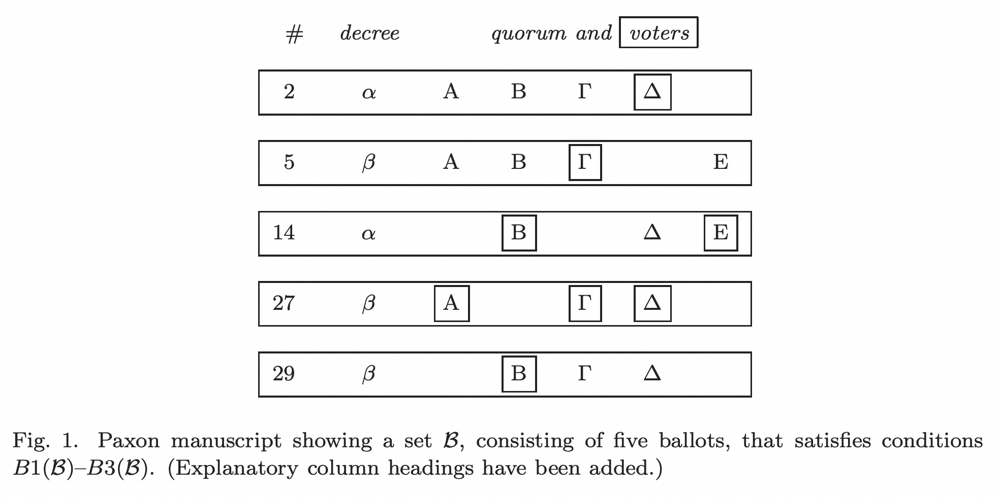
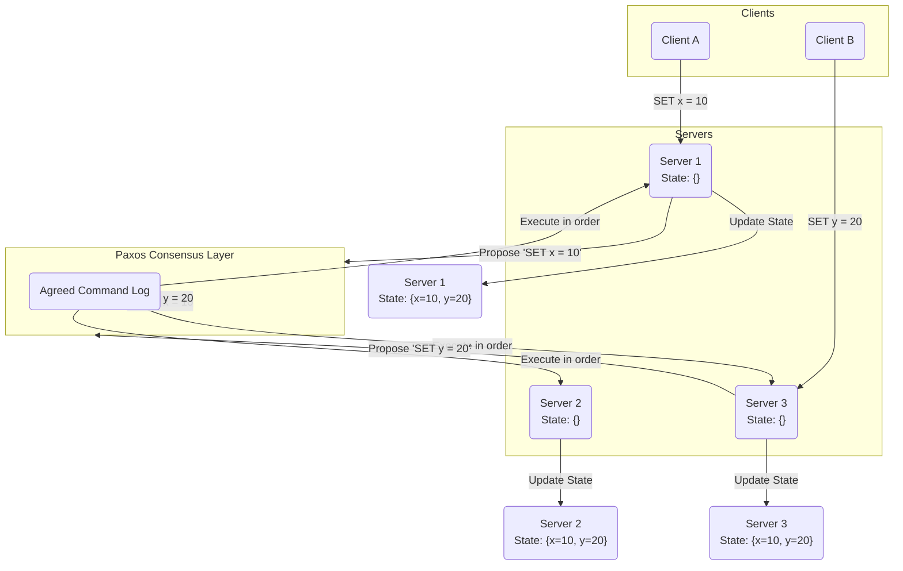
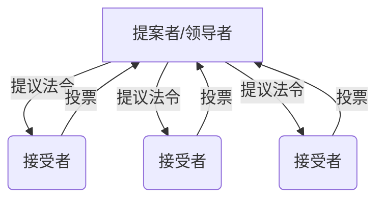

## AI论文解读 | The Part-Time Parliament
        
### 作者        
digoal        
        
### 日期        
2025-09-16       
        
### 标签        
PostgreSQL , PolarDB , DuckDB , AI , 论文解读        
        
----        
        
## 背景  
      
https://lamport.azurewebsites.net/pubs/lamport-paxos.pdf        
  
提示:          
```          
读懂《The Part-Time Parliament》这篇论文需要提前掌握哪些基础知识, 请使用中文通熟易懂的讲解这些基础知识, 可以引用论文中的图、表或使用Markdown支持的图形(text,mermaid等)增加解释性. 
  
使用中文通熟易懂的解读《The Part-Time Parliament》这篇论文, 其中的关键内容请着重讲解, 可以引用论文中的图、表或使用Markdown支持的图形(text,mermaid等)增加解释性. 
  
提取《The Part-Time Parliament》这篇论文中的重要术语, 使用中文对这些术语进行通熟易懂的讲解, 可以引用论文中的图、表或使用Markdown支持的图形(text,mermaid等)增加解释性. 
```     
  
## 1 前置知识 
  
读懂《The Part-Time Parliament》这篇论文，需要掌握一些关于分布式系统和一致性协议的基础知识。这篇论文的精妙之处在于，它用一个虚构的“兼职议会”故事，非常形象地解释了一个复杂的分布式算法，也就是后来大名鼎鼎的 **Paxos** 算法。

下面我会用通俗易懂的语言，为你讲解理解这篇论文所需的核心基础知识。

### 核心基础知识

1.  **分布式系统 (Distributed Systems)**
    * **概念**：简单来说，分布式系统就是由多台计算机（或“节点”）组成的系统，这些计算机通过网络协同工作，共同完成一项任务。
    * **论文中的对应**：论文中的 **“议员 (legislators)”** 就对应于分布式系统中的 **“进程 (processes)” 或 “服务器 (servers)”** 。而议员们进出议会大厅的行为，则对应于服务器的 **“宕机 (failing)”** 或网络连接中断 。

2.  **一致性问题 (Consensus Problem)**
    * **概念**：在分布式系统中，让所有节点对某个值（例如，一个决策、一条命令）达成共识，即使某些节点发生故障，就是“一致性”问题。
    * **论文中的对应**：论文中议员们需要对“法令 (decree)”达成一致，并将其记录在各自的 **“账本 (ledger)”** 上 。一致性的要求是，对于同一个法令编号，所有议员的账本记录必须相同，不能有冲突 。例如，如果法令132是“灯具必须使用橄榄油”，那么其他任何议员的账本里，法令132都不能是其他内容 。
    * **挑战**：由于议员们来去匆匆，可能会导致不一致。论文举了一个例子：
        * 议员A通过了法令37：“禁止在神庙墙上画画”。
        * 议员A离开后，另一群议员B进来，通过了法令37：“艺术自由受到保障”。
        * 这就造成了冲突 。论文中的协议正是为了解决这种冲突，确保即使在部分议员离开的情况下，也能保持一致性。

3.  **多数派 (Quorum)**
    * **概念**：这是 Paxos 算法的核心概念之一。多数派是一组节点，其数量足以保证任意两个多数派集合之间都至少有一个共同的节点。
    * **论文中的对应**：论文中称这个多数派为 **"majority set"** 。协议规定，任何两个多数派集合都必须至少有一个成员重叠 。
    * **作用**：这个重叠的特性非常重要，它保证了在做出任何决策之前，议员们总能找到一个“见过世面”的共同成员，从而了解之前的决策情况，避免做出相互矛盾的决策。

4.  **状态机复制 (State Machine Replication)**
    * **概念**：这是一种构建容错分布式服务的常用方法。它的思想是，在每个节点上运行一个相同的“状态机”（一个能够根据命令改变自身状态的程序），只要所有节点都按相同的顺序接收并执行相同的命令，它们最终都会达到相同的状态。
    * **论文中的对应**：论文明确指出，他们的协议是一种实现“状态机方法”的新方式 。在论文的语境中，**“议员们的法典 (law book)”** 对应于 **“状态机状态 (machine state)”**，而 **“通过一条法令 (passing a decree)”** 则对应于 **“执行一条状态机命令 (executing a state-machine command)”** 。

5.  **三阶段提交 (Three-phase Commit)**
    * **概念**：这是一种确保分布式事务完整性的协议。虽然论文没有直接使用这个术语，但其协议的流程与三阶段提交有异曲同工之妙。
    * **论文中的投票过程**：议员通过法令的过程分为几个步骤 ：
        * **阶段一 (Prepare)**：作为议长的议员（领导者）选择一个新提案号，并向其他议员发送 `NextBallot` 消息。
        * **阶段二 (Accept)**：当议长从多数议员那里收到 `LastVote` 消息后，会确定最终的法令内容，并向多数议员发送 `BeginBallot` 消息，请求他们接受这个法令。
        * **阶段三 (Commit)**：当多数议员接受了这个法令并将其记录到自己的账本后，议长会发送 `Success` 消息，通知所有议员这个法令已通过。
    * 这个过程确保了在任何一个环节，只要无法获得多数议员的响应，就无法通过法令，从而维持了一致性。

---

希望以上解释能帮助你更好地理解这篇论文。如果你想进一步深入了解 Paxos 算法，我可以为你详细讲解它在现代分布式系统中的应用，比如在谷歌的 Chubby 或其他服务中的实践。
  
## 2 解读论文 
  
好的，我们来一起深入浅出地解读这篇分布式系统领域的奠基性论文——Leslie Lamport 的《The Part-Time Parliament》（非正式中文译名《兼职议会》）。

这篇论文用一个生动的故事，介绍了一种在不可靠的分布式环境中达成共识（Consensus）的算法，这个算法后来被称为 **Paxos**。Paxos 算法是构建高可靠性分布式系统的基石，在Google、Amazon等公司的许多核心系统中都有应用。

### 论文引言：一个古希腊的政治难题

Lamport没有直接抛出复杂的算法和证明，而是虚构了一个古希腊的岛屿——Paxos岛。

岛上有一个议会，但议员们都是“兼职”的，他们会随时进入或离开议会厅，去忙自己的商业事务 。他们之间的通信依赖于信使，而这些信使也同样不可靠，可能会把消息弄丢，或者延迟很久才送到，甚至重复投递 。

这个议会面临的核心问题是：**如何在这种混乱的情况下，通过一系列法案（decrees），并保证所有议员的账本（ledgers）上记录的法案序列是一致的？** 

这完美地对应了分布式系统中的挑战：

  * **议员 (Legislators)** ↔️ **服务器/进程 (Servers/Processes)**
  * **离开议会厅 (Leaving the Chamber)** ↔️ **服务器宕机或网络断开 (Failure/Disconnection)**
  * **信使 (Messengers)** ↔️ **网络通信 (Network)**
  * **账本 (Ledgers)** ↔️ **服务器的持久化日志 (Persistent Log)**
  * **法案 (Decrees)** ↔️ **需要达成一致的操作指令 (Commands)**

#### 核心要求

这个系统必须满足两个基本要求：

1.  **一致性 (Consistency / Safety)**：这是最重要的。任何两本议员的账本，对于同一个编号的法案，内容必须完全一样。例如，法案155号不可以在一个账本上是“橄榄税为3德拉克马”，而在另一个上是“橄榄税为5德拉克马” 。
2.  **进展性 (Progress / Liveness)**：系统必须能够持续地通过新的法案。论文给出的承诺是：只要有一个“多数派”的议员在议会厅内稳定地工作足够长的时间，那么任何被提出的法案最终都会被通过，并记录在所有在场议员的账本上 。

-----

### 第一部分：单一法案宗教会议 (The Single-Decree Synod)

为了简化问题，论文首先只解决如何就**一项**法案达成一致。这是整个Paxos算法的核心。

这个过程通过一系列带编号的**投票（Ballots）** 来进行。

#### 成功的关键：三个数学约束 (B1-B3)

Paxon的数学家们发现，只要所有投票都满足以下三个条件，那么系统的一致性就能得到保证。

  * **B1(B): 唯一投票编号**
    每个投票都有一个独一无二的编号 。这很容易实现，比如可以把编号空间划分给不同的议员 。

  * **B2(B): 法定人数(Quorum)必须相交**
    任意两次投票的“法定人数”（即参与投票的议员集合）必须至少有一个共同的成员 。这通过定义“法定人数”为一个**多数派 (Majority)** 来实现 。因为任何两个多数派集合必然有交集。这是保证信息不会丢失的关键。

  * **B3(B): 提案值的选择规则**
    这是最核心、也最巧妙的一条规则。它的内容是：

    > 对于任何一次投票 `B`，如果其法定人数中的任何成员曾经在更早的投票中投过票，那么这次投票 `B` 的提案内容，必须等于那些更早投票中、**编号最晚（latest）** 的那一次投票的提案内容 。

    如果法定人数中没有任何成员投过票，那么提案发起人可以自由选择任何内容。

让我们用论文中的图1来理解这个规则 ：   

| 投票编号 (\#) | 提案内容 (decree) | 法定人数 (quorum) 和 **投票者 (voters)** | B3规则解释 |
| :--- | :--- | :--- | :--- |
| 2 | $\\alpha$ | A B $\\Gamma$ **$\\Delta$** | 这是最早的投票，B3平凡满足 。 |
| 5 | $\\beta$ | A B **$\\Gamma$** E | 它的法定人数 \{A,B, $\\Gamma$ ,E\} 中没人参与过投票2，所以提案人可以自由选择一个新提案 $\\beta$ 。|
| 14 | $\\alpha$ | **B** $\\Delta$ **E** | 它的法定人数 {B, $\\Delta$ ,E} 中， $\\Delta$ 参与过投票2。更早的投票只有2，所以提案内容必须和投票2一样，为 $\\alpha$ 。|
| 27 | $\\beta$ | **A** **$\\Gamma$** **$\\Delta$** | 它的法定人数 {A, $\\Gamma$ , $\\Delta$} 中， $\\Gamma$ 参与过投票5， $\\Delta$ 参与过投票2。在这些更早的投票(2和5)中，编号最晚的是5，所以提案内容必须和投票5一样，为 $\\beta$ 。|
| 29 | $\\beta$ | **B** $\\Gamma$ $\\Delta$ | 它的法定人数 { B, $\\Gamma$ , $\\Delta$ } 中，B参与过14， $\\Gamma$参与过5和27， $\\Delta$参与过2和27。在这些更早的投票(2,5,14,27)中，编号最晚的是27，所以提案内容必须和投票27一样，为 $\\beta$ 。|

**这个规则的精髓在于：一个新提案如果想被接受，它必须首先“学习”并“继承”之前可能已经达成（或即将达成）的决议。通过多数派的交集特性，确保了这种学习过程不会错过任何关键信息。**

#### 算法的两个阶段 (The Basic Protocol)

基于上述规则，实际的算法分为两个阶段，通常被称为 **Prepare-Promise** 和 **Propose-Accept**。

假设一个议员 `P` 想发起一个提案，他会成为一个 **提案人 (Proposer)**，其他议员则是 **接收人 (Acceptors)**。

**阶段一：准备 (Prepare)**

1.  **Prepare请求**：提案人 `P` 选择一个比他之前用过的都大的新投票编号 `b`，然后向一个议员集合（通常是所有议员）发送一个 `NextBallot(b)` 消息（即“准备”请求）。
2.  **Promise响应**：接收人 `q` 收到 `NextBallot(b)` 消息后，会检查 `b` 是否比它已经响应过的所有`NextBallot`消息的编号都大。
      * 如果是，它就做出一个**承诺 (Promise)**：保证不会再投票给任何编号小于 `b` 的投票 。
      * 然后，它会把自己**已经投过票**的、**编号最大**的那次投票 `v`（内容和编号）通过 `LastVote(b, v)` 消息回复给提案人 `P` 。如果它从未投过票，就回复一个空值。

**阶段二：提议 (Propose)**

1.  **Propose请求**：提案人 `P` 等待，直到它收到了来自一个**多数派（即法定人数）** 的`LastVote`（Promise）回复 。
      * 此时，`P` 会审视收到的所有回复。它必须根据 **B3规则** 来决定这次提案的内容 `d`：在所有回复的投票中，选择那个**投票编号最大**的提案内容作为本次的提案内容 `d`。如果所有回复都表示从未投过票，`P` 才可以自由使用它自己最初想提议的内容 。
      * 然后，`P` 向刚刚给它回复的那个多数派发送 `BeginBallot(b, d)` 消息（即“提议”请求）。
2.  **Accept响应**：接收人 `q` 收到 `BeginBallot(b, d)` 消息后，如果它没有做过一个更新的承诺（即承诺不给编号小于 `b'` 的投票，而 `b' > b`），它就会接受这个提案，将 `(b, d)` 记录在自己的账本（的草稿区）中，并向 `P` 回复一条 `Voted(b, q)`（Accepted）消息 。

**最终决议**
当提案人 `P` 收到了来自法定人数中**所有**成员的 `Voted` 消息，就意味着这次投票**成功**了，提案 `d` 已经被选定（chosen）。此时，`P` 就可以向所有人广播 `Success(d)` 消息，通知大家最终的决议。

-----

### 第二部分：多法案议会 (The Multi-Decree Parliament)

解决了单个决议的问题，如何扩展到一系列连续的法案（1号、2号、3号……）呢？

  * **基本思想**：为每一个法案编号都独立运行一次完整的“单一法案宗教会议”算法 。
  * **关键优化**：为所有法案选举一个**唯一的领导者（President）**。这个领导者只需要执行**一次**阶段一（Prepare-Promise），就可以获得在未来所有法案编号上进行提案的权力 。只要没有其他议员用更大的投票编号来挑战它的领导地位，它就可以对后续的法案（比如101号、102号...）直接发起阶段二（Propose-Accept），省去了为每个法案都进行一次阶段一的开销，大大提高了效率 。

#### 实际操作中的细节

  * **填补空缺**：如果议会通过了126号法案，但125号法案还空着，新的领导者为了保证日志的连续性，会主动为125号法案提议一个无操作意义的“橄榄节”法案来填补这个空缺 。
  * **领导者选举**：任何议员都可以通过发起一个更高编号的阶段一投票来尝试成为新的领导者。这可能会导致领导权争夺，暂时无法通过新法案（影响进展性），但绝不会破坏数据一致性（保证一致性）。

-----

### 第三部分：与计算机科学的关联 (Relevance to Computer Science)

这个古老议会的故事，实际上描述了一种强大的分布式系统构建范式——**状态机复制 (State Machine Replication)** 。

其核心思想如下：

1.  将你的系统抽象成一个确定性的**状态机**。例如，一个数据库就是一个状态机，它的“状态”就是所有数据的当前值，而 `UPDATE` 或 `INSERT` 这样的操作就是“指令”，执行指令会让状态机从一个状态转移到另一个状态。
2.  在多台服务器上**复制**这个状态机 。
3.  使用**Paxos议会协议**作为共识引擎，让所有服务器就客户端发来的**指令序列**达成一致 。
4.  由于所有服务器都从相同的初始状态开始，并以完全相同的顺序执行了完全相同的指令序列，因此它们的最终状态必然是完全一致的 。

这个模型的优雅之处在于，它将复杂的分布式共识问题（如处理服务器故障、网络延迟、消息丢失等）与业务逻辑（状态机本身）完全解耦。

下面是一个简单的流程图来说明这个过程：



如上图所示，即使客户端的请求到达了不同的服务器，通过Paxos层对指令顺序达成一致，最终所有服务器副本的状态都将保持同步。

### 结论

《The Part-Time Parliament》通过一个巧妙的寓言，详细阐述了Paxos共识算法。这个算法的核心在于其对**一致性**的强力保证，它允许系统在部分组件失效的情况下，依然能够作为一个整体正确地工作。尽管它可能在极端情况下牺牲**进展性**（即活锁，多个提案人不断用更高编号的提议打断对方），但它绝不妥协于数据的一致性，这使得它成为了构建容错分布式系统的理论基石。
  
## 3 术语 
  
在《The Part-Time Parliament》这篇论文中，作者用一个巧妙的寓言故事，将复杂的分布式一致性算法（Paxos）中的关键概念，都转化为了生动有趣的角色和术语。

以下是论文中一些重要的术语及其通俗易懂的讲解：

### 1\. 议员 (Legislators)

  * **论文中的含义**：兼职议会中的议员们，他们会随时离开或回到议会，也可能在议会中打瞌睡（宕机）。
  * **对应于现实**：分布式系统中的**节点 (Nodes)** 或 **进程 (Processes)**。这些节点就是计算机或服务器，它们可能随时发生故障（宕机）或网络连接中断，但系统仍需要保持正常运行。

### 2\. 法令 (Decree)

  * **论文中的含义**：议员们需要投票通过的法律或决策。
  * **对应于现实**：分布式系统中需要达成一致的**值 (Value)** 或 **命令 (Command)**。例如，在一个数据库系统中，“法令”可能就是一条“写入数据”的命令，所有节点都需要对这条命令达成共识。

### 3\. 法典 (Law Book)

  * **论文中的含义**：每位议员随身携带的，记录了所有已通过法令的小本子。
  * **对应于现实**：分布式系统中的**状态 (State)**。每个节点都有一份法典的副本，系统需要确保所有节点上的法典副本最终都是一致的。

### 4\. 提案者 (Proposer) 与 接受者 (Acceptor)

  * **论文中的含义**：
      * **提案者**：议员中的一位，负责起草并提出新的法令草案，并争取其他议员的支持。
      * **接受者**：其他议员，负责接收草案并对其进行投票。
  * **对应于现实**：
      * **提案者**：Paxos 算法中负责发起提案的**领导者 (Leader)** 角色。
      * **接受者**：负责对提案进行投票的**参与者 (Participants)** 角色。

用一个简单的图来表示它们的关系：



### 5\. 多数派 (Majority)

  * **论文中的含义**：论文中没有直接使用“多数派”一词，但多次提及“获得大多数议员（a majority of legislators）”的同意。这是整个协议的核心，任何法令的通过都必须获得超过半数议员的同意。
  * **对应于现实**：分布式系统中的 **法定人数 (Quorum)**。这个概念非常关键，它保证了任何两个多数派集合之间都至少有一个重叠的成员。正是这个重叠，使得系统能够防止“脑裂”，即使在部分节点宕机的情况下也能做出决策，并保证决策的唯一性和一致性。

### 6\. 议会会期 (Ballot)

  * **论文中的含义**：每次议员们为了通过某个法令而进行的讨论、投票过程，都被称作一个“会期”，每个会期都有一个唯一的编号。这个编号保证了会期是按时间顺序递增的。
  * **对应于现实**：分布式系统中的**提案号 (Proposal Number)**。它是一个单调递增的全局唯一标识符，用于对不同的提案进行排序。Paxos 算法就是通过这个提案号来解决多个提案者同时提出提案时的冲突问题。

-----

希望这些解释能帮助你更好地理解论文中的核心概念。如果你想了解这些术语是如何在 Paxos 算法中协同工作来解决分布式一致性问题的，我们可以进一步探讨。
  
## 参考        
         
https://lamport.azurewebsites.net/pubs/lamport-paxos.pdf    
        
<b> 以上内容基于DeepSeek、Qwen、Gemini及诸多AI生成, 轻微人工调整, 感谢杭州深度求索人工智能、阿里云、Google等公司. </b>        
        
<b> AI 生成的内容请自行辨别正确性, 当然也多了些许踩坑的乐趣, 毕竟冒险是每个男人的天性.  </b>        
    
#### [期望 PostgreSQL|开源PolarDB 增加什么功能?](https://github.com/digoal/blog/issues/76 "269ac3d1c492e938c0191101c7238216")
  
  
#### [PolarDB 开源数据库](https://openpolardb.com/home "57258f76c37864c6e6d23383d05714ea")
  
  
#### [PolarDB 学习图谱](https://www.aliyun.com/database/openpolardb/activity "8642f60e04ed0c814bf9cb9677976bd4")
  
  
#### [PostgreSQL 解决方案集合](../201706/20170601_02.md "40cff096e9ed7122c512b35d8561d9c8")
  
  
#### [德哥 / digoal's Github - 公益是一辈子的事.](https://github.com/digoal/blog/blob/master/README.md "22709685feb7cab07d30f30387f0a9ae")
  
  
#### [About 德哥](https://github.com/digoal/blog/blob/master/me/readme.md "a37735981e7704886ffd590565582dd0")
  
  

  
