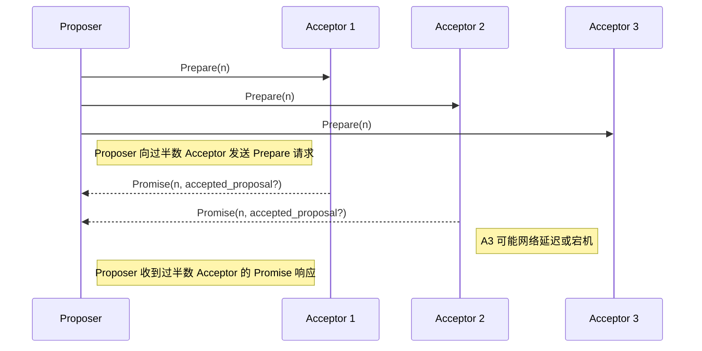
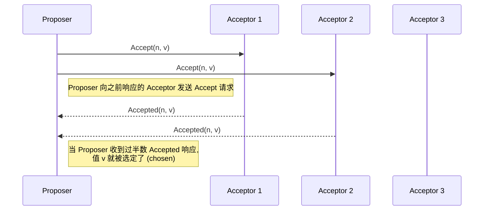

## AI论文解读 | Paxos Made Simple
        
### 作者        
digoal        
        
### 日期        
2025-09-16       
        
### 标签        
PostgreSQL , PolarDB , DuckDB , AI , 论文解读        
        
----        
        
## 背景  
      
https://lamport.azurewebsites.net/pubs/paxos-simple.pdf        
  
提示:          
```          
读懂《Paxos Made Simple》这篇论文需要提前掌握哪些基础知识, 请使用中文通熟易懂的讲解这些基础知识, 可以引用论文中的图、表或使用Markdown支持的图形(text,mermaid等)增加解释性. 
  
使用中文通熟易懂的解读《Paxos Made Simple》这篇论文, 其中的关键内容请着重讲解, 可以引用论文中的图、表或使用Markdown支持的图形(text,mermaid等)增加解释性. 
  
提取《Paxos Made Simple》这篇论文中的重要术语, 使用中文对这些术语进行通熟易懂的讲解, 可以引用论文中的图、表或使用Markdown支持的图形(text,mermaid等)增加解释性. 
```     
  
## 1 前置知识 
  
理解《Paxos Made Simple》这篇论文需要掌握一些基础的分布式系统概念。这篇论文的作者 Leslie Lamport 在开篇就提到，Paxos 算法被认为难以理解，但实际上它非常简单 。为了帮助你更好地理解这篇论文，下面我将用通俗易懂的中文来讲解一些关键的基础知识。

### 1. 分布式系统基础
《Paxos Made Simple》是关于分布式系统的，所以你需要对分布式系统有一些基本的认识。
* **什么是分布式系统？** 它是一组通过网络连接的计算机，共同工作以实现一个共同的目标 。
* **为什么需要分布式系统？** 为了解决单点故障问题。一个单一的服务器如果失败了，整个系统就会瘫痪 。通过使用多台服务器，即使其中一台或几台服务器出现故障，系统仍然可以继续运行。
* **分布式系统中的挑战：** 论文中提到了几个关键挑战 ：
    * **异步性（Asynchronous）：** 计算机之间发送消息所需的时间是不确定的，消息可能会延迟、丢失或重复，但不会被破坏 。
    * **故障（Failures）：** 计算机可能会任意速度运行，甚至会停止运行（“宕机”）然后重新启动 。
    * **容错（Fault-tolerance）：** 系统必须在面对这些故障时仍然能够正常运行 。

### 2. Paxos 算法的核心角色
这篇论文的“共识算法”部分（2 The Consensus Algorithm）介绍了 Paxos 的三个核心角色 ：  
* **Proposer（提议者）：** 提出一个值（value），希望让大家达成共识。
* **Acceptor（接受者）：** 接受提议者的值。一个值被多数接受者接受后，就被“选定”（chosen）了 。
* **Learner（学习者）：** 学习已经被选定的值。

请注意，在实际的实现中，一个进程可以扮演多个角色 。例如，论文的“实现”部分提到，每个进程都扮演着提议者、接受者和学习者的角色 。

### 3. 共识问题
共识（Consensus）是分布式系统中的一个核心问题，也就是让一组计算机对某个值达成一致 。这篇论文的核心是描述一个共识算法，它必须满足以下“安全”要求 ：
* **只有被提议的值才能被选定** 。
* **只能有一个值被选定** 。
* **一个进程只有在值确实被选定时，才能“学习”到它** 。

为了确保“只有一个值被选定”，Paxos 使用了 **多数派（majority）** 的概念 。任何两个多数派的集合至少有一个共同的成员 。这个特性是 Paxos 算法能够保证安全性的关键。

### 4. 算法流程（简化版）
论文中将 Proposer 和 Acceptor 的交互分成了两个阶段，这是理解 Paxos 算法的关键 。

#### **阶段 1：准备（Prepare）**
1.  **Proposer** 选择一个唯一的**提案号（proposal number）** `n`，然后向多数 Acceptor 发送一个**准备请求（prepare request）** 。
2.  当 **Acceptor** 收到这个请求时，如果 `n` 大于它见过的任何提案号，它就会做出两件事 ：
    * 承诺：不再接受任何小于 `n` 的提案。
    * 返回：将它已经接受过的，编号最大的提案（如果有的话）返回给 Proposer 。

#### **阶段 2：接受（Accept）**
1.  当 **Proposer** 收到多数 Acceptor 的响应后，它会决定要提议的值 `v` 。
    * 如果任何 Acceptor 返回了之前接受过的提案，Proposer 必须使用其中编号最大的提案的值作为 `v` 。
    * 如果没有 Acceptor 返回任何提案，Proposer 可以自由选择任何值作为 `v` 。
2.  然后，Proposer 向这些多数 Acceptor 发送一个**接受请求（accept request）**，包含提案号 `n` 和值 `v` 。
3.  **Acceptor** 收到接受请求后，如果它还没有对编号大于 `n` 的准备请求做出承诺，它就会接受这个提案 。

---

如果你想进一步探索这个主题，我们可以深入讨论 Paxos 如何处理故障，比如某个提议者在第二阶段失败了。你对 Paxos 算法的哪个部分最感兴趣？
  
## 2 解读论文 
  
好的，我们来一起用通俗易懂的方式解读一下 Leslie Lamport 的这篇经典论文《Paxos Made Simple》。

这篇论文的核心目标就是用最简单直白的方式，把被很多人认为晦涩难懂的 Paxos 算法讲清楚 。实际上，Lamport 认为 Paxos 是最简单、最显而易见的分布式算法之一 。

### **Paxos 要解决什么问题？**

想象一下，在一个分布式系统中，有多个节点（服务器），它们需要就**某一个值**达成一致。这个“值”可以很简单，比如“主节点是谁”，也可以很复杂，比如“执行哪一条数据库指令”。

这个过程叫作**共识（Consensus）**。一个可靠的共识算法必须满足以下三个核心安全要求 ：

1.  **只能选择被提议过的值**：不能凭空冒出来一个值 。
2.  **只能选择一个唯一的值**：这是最重要的，所有节点最终达成共识的值必须是同一个，不能出现分歧 。
3.  **节点不能学到（Learn）一个还未被确定的值**：一个节点只有在某个值被真正“选定”后，才能获取到它 。

同时，算法还需要保证**活性（Liveness）**，也就是说，最终要能选出一个值来，不能永远“悬”在那里 。

为了解决这个问题，Paxos 引入了三个角色（一个进程可以同时扮演多个角色） ：

  * **提议者（Proposer）**: 负责提出一个值，希望大家能接受它。
  * **接受者（Acceptor）**: 负责对提议者的提议进行投票。
  * **学习者（Learner）**: 负责学习（获取）最终被选定的值。

这个算法被设计为在异步、非拜占庭（non-Byzantine）的环境中工作。这意味着：节点处理速度可能不同，随时可能宕机后重启，网络消息可能延迟、丢失、重复，但不会被篡改 。

-----

### **核心关键：两阶段提交（Two-Phase Commit）的共识算法**

Paxos 的精髓在于其“选择一个值”的过程。这个过程分为两个阶段：**准备阶段（Phase 1）** 和 **接受阶段（Phase 2）** 。

#### **一个简单的想法及其问题**

最简单的方法是只设一个接受者（Acceptor）。谁的提议先到，就接受谁的 。但这显然不行，如果这个唯一的接受者宕机了，整个系统就瘫痪了 。

于是我们很自然地想到，设置多个接受者。当一个提议被 **“足够多”** 的接受者接受后，我们就认为这个值被选定了 。这个“足够多”通常定义为 **“超过半数”（Majority）**  。因为任何两个“超过半数”的集合，都必然有至少一个共同的成员，这为保证“只选择一个值”提供了基础 。

但新的问题来了：如果多个提议者同时向所有接受者发送提议，可能会导致没有任何一个提议获得超过半数的支持，从而陷入僵局 。

#### **引入“提案编号”来解决冲突**

为了解决上述问题，Paxos 引入了**提案（Proposal）的概念。一个提案不仅包含值（Value）**，还包含一个独一无二的、递增的**提案编号（Proposal Number）** 。

算法的核心目标就变成了保证：**如果一个值为 `v` 的提案被选定了，那么任何后续被选定的、编号更高的提案，其值也必须是 `v`** 。这是保证数据一致性的关键！

为了实现这个目标，Paxos 设计了以下两个阶段：

##### **第一阶段：准备（Prepare）**

这个阶段是提议者用来“锁定”接受者，并发现之前可能已被接受的值。

1.  **Proposer**: 选择一个**新的提案编号 `n`**，然后向超过半数的 Acceptor 发送一个 `Prepare` 请求，请求中包含编号 `n` 。
2.  **Acceptor**: 收到 `Prepare(n)` 请求后，会检查自己已经响应过的 `Prepare` 请求的最大编号 `max_n`。
      * 如果 `n` \> `max_n`，那么它就承诺 **“再也不会接受任何编号小于 `n` 的提案”** 。同时，它会把自己已经 **接受过（accepted）** 的编号最大的提案（如有）返回给 Proposer 。然后更新 `max_n` 为 `n`。
      * 如果 `n` \<= `max_n`，则忽略这个请求（或者回复一个错误） 。

我们可以用下面的 Mermaid 图来描述这个过程：



##### **第二阶段：接受（Accept）**

当提议者收到了来自超过半数接受者的承诺（Promise）后，第二阶段开始。

1.  **Proposer**:

      * **决定提议的值 `v`**: 提议者会检查所有收到的 Promise 响应。如果在这些响应中，有接受者曾经接受过提案，提议者**必须**选择其中编号最大的那个提案的值，作为本次自己提案的值 `v` 。如果所有响应中都没有任何提案被接受过，那么提议者可以自由选择任何值（通常是它自己最初想提议的值）作为 `v` 。
      * **发送 `Accept` 请求**: 提议者将 `(n, v)` 作为一个提案，向所有给了它 Promise 的 Acceptor 发送 `Accept` 请求 。

2.  **Acceptor**: 收到 `Accept(n, v)` 请求后，只要它**没有做出过更高编号的承诺**（即 `n` 不小于它记录的 `max_n`），它就接受这个提案，并将其持久化存储 。

这个过程可以用下图表示：



**为什么这个算法是安全的？**

这里的巧妙之处在于 $P2^c$ 约束（见论文）  和提议者在第二阶段决定值的规则。当一个提议者想要发起一个编号为 `n` 的提案时，它必须先通过第一阶段去“侦察”一下，看看在它之前，有没有已经被选定或者“即将被选定”（被部分接受者接受）的值。

如果存在一个被选定的值 `v_old`，那么一定有超过半数的 Acceptor 接受了它。新的提议者 `P_new` 在第一阶段至少会联系到这些 Acceptor 中的一个。这个 Acceptor 会把 `v_old` 的信息告诉 `P_new`。根据规则，`P_new` 就必须以 `v_old` 作为自己提案的值，从而保证了新提案的值和旧提案的值是一致的。这保证了 **“只选择一个唯一的值”** 这一核心安全属性 。

-----

### **如何学习（Learn）被选定的值？**

当一个值被超过半数的接受者接受后，它就被“选定”了。学习者（Learner）要知道这个结果，最直接的方法是让每个接受者在每次接受提案后，都广播通知所有的学习者 。但这通信开销很大 。

更常见的做法是，指定一个或多个 **“主学习者”（Distinguished Learner）** 。接受者只把接受结果告诉主学习者，再由主学习者通知其他普通学习者 。这样可以大大降低通信复杂度 。

-----

### **如何保证进度（Progress）？**

这个两阶段算法虽然安全，但可能出现“活锁”（livelock）问题。比如，两个提议者轮流用更高的提案编号打断对方的第二阶段 。

  * Proposer1 完成了编号 `n1` 的第一阶段。
  * 紧接着，Proposer2 用更高的编号 `n2` \> `n1` 也完成了第一阶段。这导致所有 Acceptor 都承诺不再接受小于 `n2` 的提案。
  * Proposer1 发起的编号为 `n1` 的第二阶段 `Accept` 请求就会被所有 Acceptor 拒绝 。
  * Proposer1 不甘心，再用一个更高的编号 `n3` \> `n2` 重启第一阶段，又打断了 Proposer2 的第二阶段... 如此循环往复 。

为了保证进度，系统通常会选举一个**唯一的领导者（Leader）**，这个 Leader 是系统在一段时间内**唯一的提议者** 。只要这个 Leader 能够和超过半数的 Acceptor 通信，它总能成功地提出并让一个值被选定，从而保证了系统的活性 。

-----

### **最终应用：构建分布式状态机**

共识算法的最终目的是为了构建一个可靠的分布式系统。最常见的应用就是 **复制状态机（Replicated State Machine）** 模型。

想象一下，我们把整个系统看作一个状态机，它接受一系列命令（command），并按顺序执行它们来改变自己的状态 。为了实现容错，我们把这个状态机复制到多台服务器上 。

**如何保证所有副本都以完全相同的顺序执行完全相同的命令序列呢？**

答案就是用 Paxos 。

1.  把命令序列的第一个命令作为**第1个值**，通过 Paxos 算法在所有服务器间达成共识。
2.  把第二个命令作为**第2个值**，运行 Paxos 的第2个实例，达成共识。
3.  以此类推，第 `i` 个命令就是 Paxos 第 `i` 个实例要达成共识的值 。

这样，我们就把对“一个值”的共识，扩展到了对“一个操作日志（Log）序列”的共识。由于 Paxos 保证了每一个位置上的命令都是唯一的，因此所有服务器最终都会得到一个完全相同的命令日志。只要初始状态相同，并且命令是确定性的，那么所有服务器副本的状态就永远能保持一致 。

在实际应用中，通常会由一个 Leader 节点负责接收客户端的命令，然后决定这个命令是日志中的第几个（比如第135个），并作为提议者发起 Paxos 流程，让这个命令在第135个实例中被选定 。这大大提高了效率，因为正常情况下，处理一个命令只需要 Paxos 的第二阶段通信，成本非常低 。

### **总结**

《Paxos Made Simple》这篇论文用清晰的逻辑推导，揭示了一个强大的分布式共识算法。其核心思想可以概括为：

  * **角色分离**：通过 Proposer, Acceptor, Learner 三个角色的互动完成共识。
  * **多数派原则**：以“超过半数”作为决策的标准，保证了系统在部分节点失效时仍能工作。
  * **提案编号**：通过带编号的提案和两阶段提交，巧妙地解决了值冲突问题，确保了数据的一致性和安全性。
  * **领导者选举**：通过选举唯一的 Leader 作为 Proposer 来保证算法的活性和效率。
  * **状态机复制**：将单次共识扩展为对一个操作序列的共识，是 Paxos 在工业界最广泛的应用，也是构建高可用分布式系统的基石。
  
## 3 术语 
  
在《Paxos Made Simple》这篇论文中，为了理解算法的核心概念，掌握几个关键术语是至关重要的。以下是这些重要术语的中文解释：

### 1. 代理（Agents）
在 Paxos 共识算法中，有三类“代理”或“角色”扮演着核心功能：
* **提议者 (Proposers):** 负责提出一个值（value）。他们发起共识过程，目的是让一个值被接受并最终被所有学习者“学习”到。
* **接受者 (Acceptors):** 负责接受提议者提出的值 。当一个值被大多数接受者接受时，这个值就被“选定”（chosen）了。接受者是算法中维护状态的关键角色，他们需要记住自己接受过的最高编号的提案，以及响应过的最高编号的准备请求 。
* **学习者 (Learners):** 负责学习已经被选定的值 。他们本身不参与值的选择过程，只关心最终被大家一致认可的值是什么。

在实际实现中，一个单一的进程（process）可以扮演一个或多个代理角色 。

---

### 2. 提案（Proposal）
一个**提案**是共识过程中的基本单位，它由两部分组成：
* **提案号 (Proposal Number):** 一个唯一的、递增的数字。论文中要求不同的提案必须有不同的编号 。
* **值 (Value):** 提议者希望让大家达成共识的具体内容，比如一个命令或一个数据 。

当一个提案被多数接受者接受时，我们就说这个提案以及它的值被“选定”了 。

---

### 3. 多数派（Majority）
**多数派**是 Paxos 算法能够保证“只选择一个值”这一安全属性的关键。
* **定义:** 任何一组超过半数的接受者集合都构成一个多数派 。
* **关键特性:** 任何两个多数派集合都至少有一个共同的接受者 。这个特性至关重要，它确保了即使有多个提议者同时活跃，他们也无法让不同的值被多数接受者接受。

---

### 4. 算法阶段（Phases of the Algorithm）
论文将 Paxos 共识算法分为两个阶段，这是提议者和接受者之间交互的核心：
* **阶段 1 (Phase 1):** 准备阶段 (Prepare) 。提议者发送一个带有新提案号的**准备请求**给多数接受者。目的是让接受者承诺不再接受比这个提案号小的提案，并返回他们已经接受过的最高编号的提案。
* **阶段 2 (Phase 2):** 接受阶段 (Accept) 。如果提议者从多数接受者那里收到了响应，它就会发送一个**接受请求**，包含提案号和最终确定的值。接受者会根据其承诺决定是否接受这个请求。

这个两阶段提交过程确保了即使存在竞争，也只有符合特定条件的值才能被接受。

---

### 5. 活套（Liveness）与领导者选举（Leader Election）
* **活套 (Liveness):** 确保一个提议的值最终能够被选定，并且学习者最终能够学到它 。
* **活套问题:** 论文中指出，在某些情况下，两个或多个提议者可能会因为互相干扰而导致任何提案都无法被选定 。这通常被称为“活锁”问题。
* **解决方案:** 为了保证活套，通常需要选举出一个**唯一的领导者 (distinguished proposer)** 。这个领导者是唯一被允许尝试发出提案的提议者。只要领导者能与多数接受者成功通信，它就能成功地让一个提案被接受 。

---

我希望这些术语解释能帮助你更好地理解这篇论文。关于这些术语，你更想深入了解哪一个，或者对论文中的其他部分有疑问吗？
  
## 参考        
         
https://lamport.azurewebsites.net/pubs/paxos-simple.pdf    
        
<b> 以上内容基于DeepSeek、Qwen、Gemini及诸多AI生成, 轻微人工调整, 感谢杭州深度求索人工智能、阿里云、Google等公司. </b>        
        
<b> AI 生成的内容请自行辨别正确性, 当然也多了些许踩坑的乐趣, 毕竟冒险是每个男人的天性.  </b>        
    
#### [期望 PostgreSQL|开源PolarDB 增加什么功能?](https://github.com/digoal/blog/issues/76 "269ac3d1c492e938c0191101c7238216")
  
  
#### [PolarDB 开源数据库](https://openpolardb.com/home "57258f76c37864c6e6d23383d05714ea")
  
  
#### [PolarDB 学习图谱](https://www.aliyun.com/database/openpolardb/activity "8642f60e04ed0c814bf9cb9677976bd4")
  
  
#### [PostgreSQL 解决方案集合](../201706/20170601_02.md "40cff096e9ed7122c512b35d8561d9c8")
  
  
#### [德哥 / digoal's Github - 公益是一辈子的事.](https://github.com/digoal/blog/blob/master/README.md "22709685feb7cab07d30f30387f0a9ae")
  
  
#### [About 德哥](https://github.com/digoal/blog/blob/master/me/readme.md "a37735981e7704886ffd590565582dd0")
  
  

  
