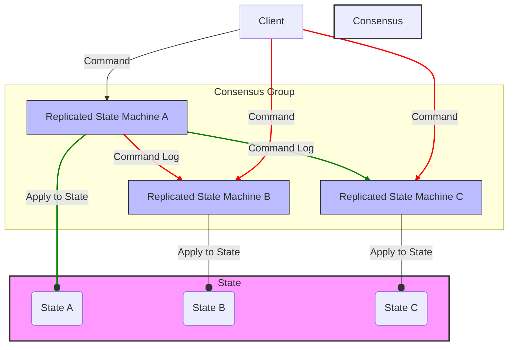
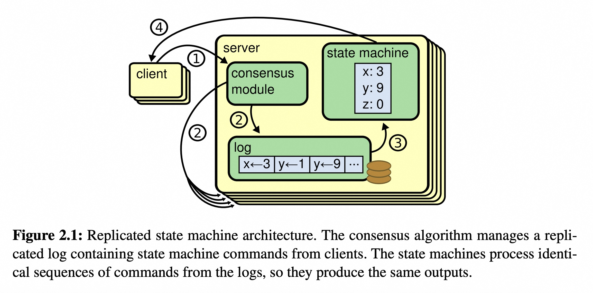
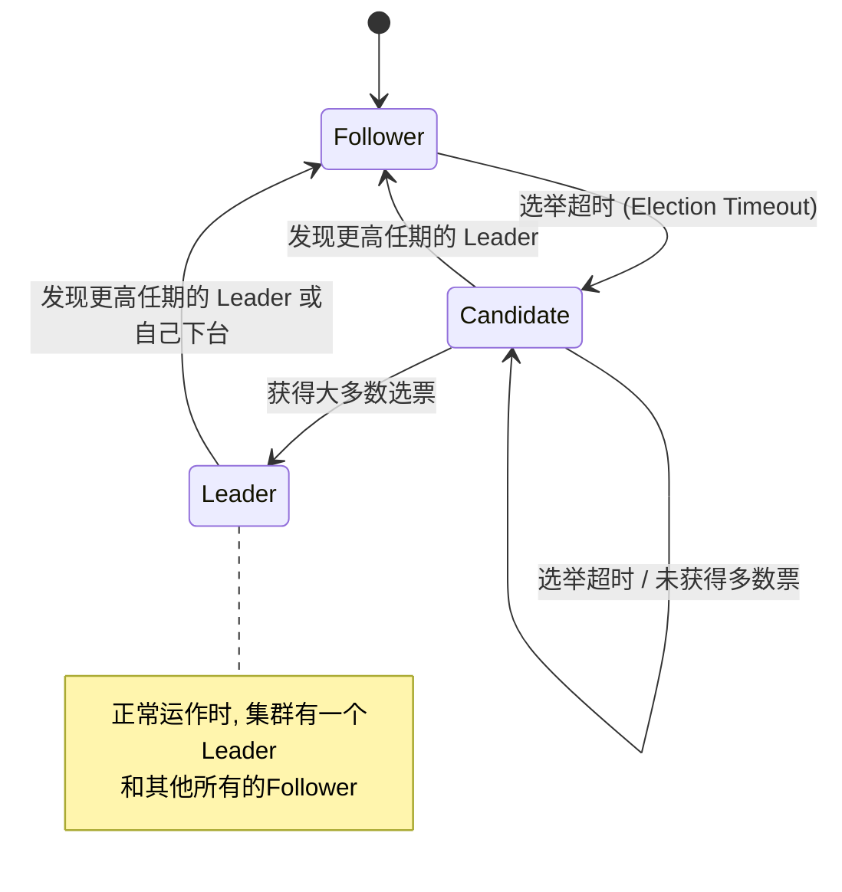
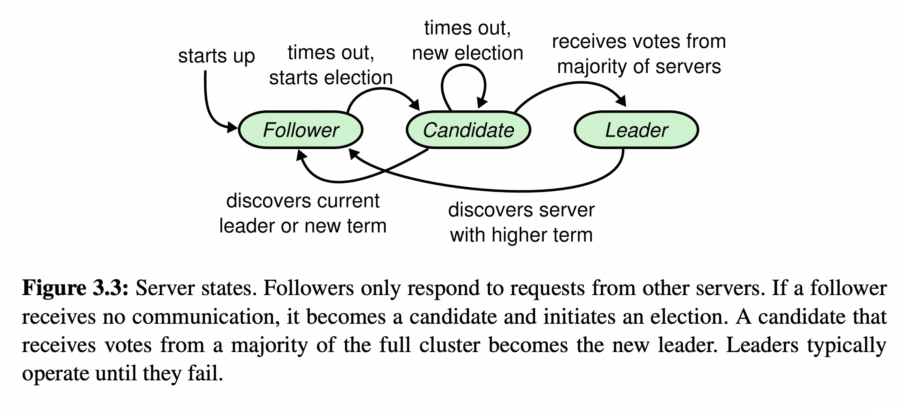
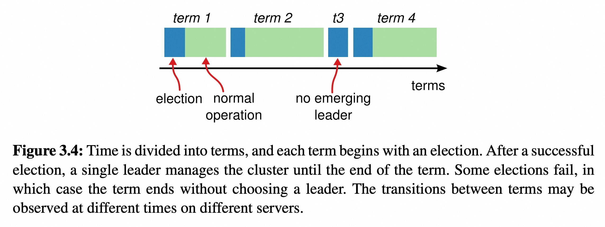
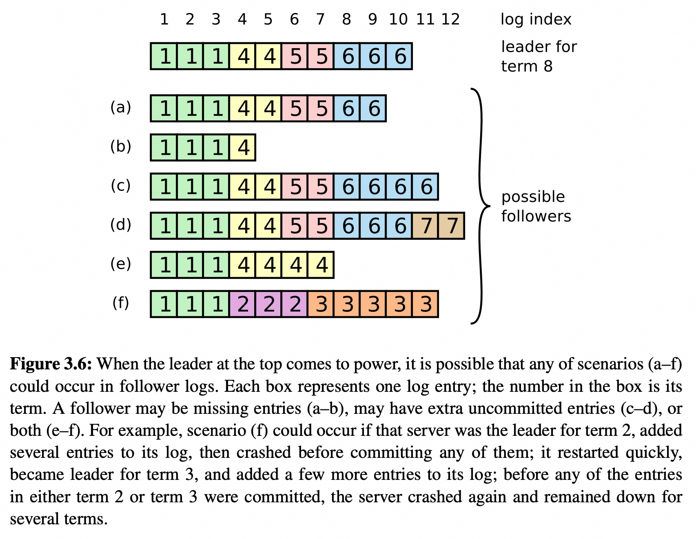
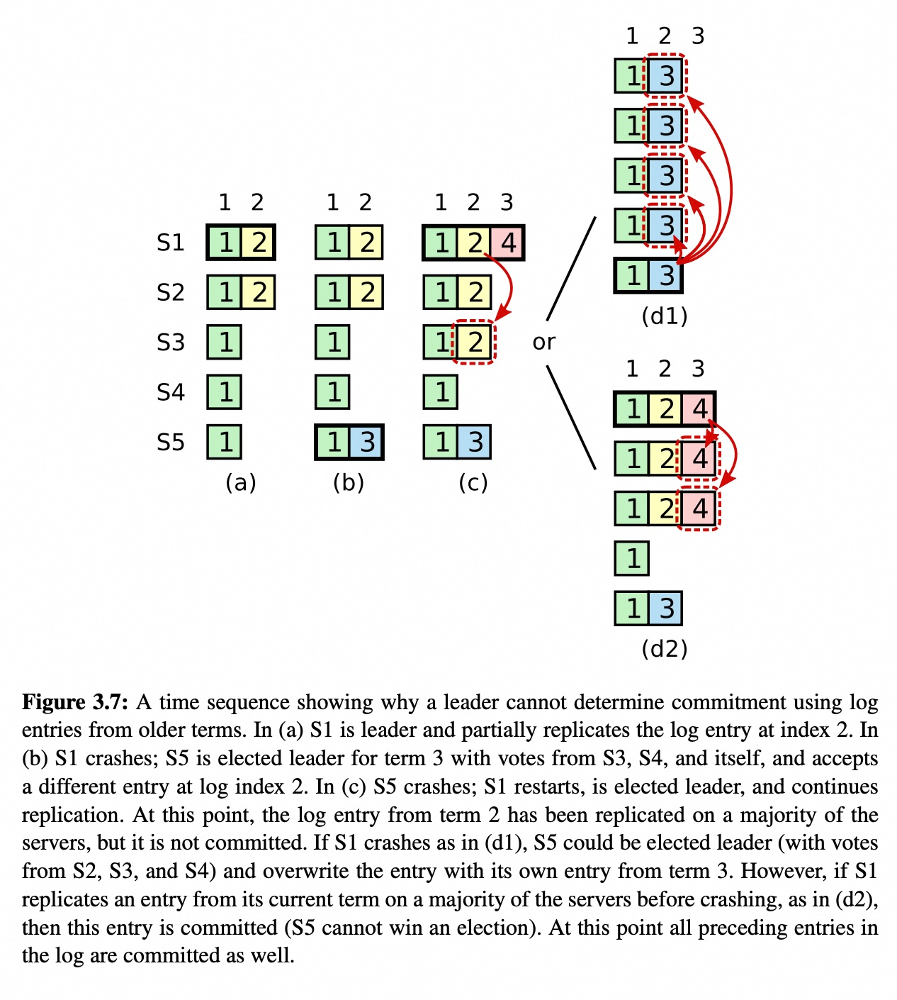
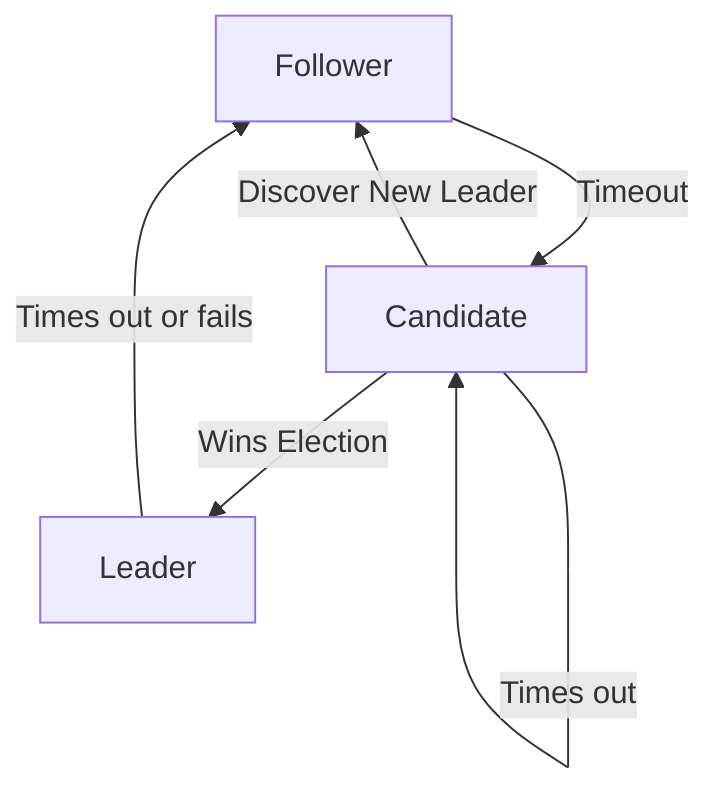

## AI论文解读 | CONSENSUS: BRIDGING THEORY AND PRACTICE
        
### 作者        
digoal        
        
### 日期        
2025-09-16       
        
### 标签        
PostgreSQL , PolarDB , DuckDB , AI , 论文解读        
        
----        
        
## 背景  
      
https://web.stanford.edu/%7Eouster/cgi-bin/papers/OngaroPhD.pdf        
  
提示:          
```          
读懂《CONSENSUS: BRIDGING THEORY AND PRACTICE》这篇论文需要提前掌握哪些基础知识, 请使用中文通熟易懂的讲解这些基础知识, 可以引用论文中的图、表或使用Markdown支持的图形(text,mermaid等)增加解释性. 
  
使用中文通熟易懂的解读《CONSENSUS: BRIDGING THEORY AND PRACTICE》这篇论文, 其中的关键内容请着重讲解, 可以引用论文中的图、表或使用Markdown支持的图形(text,mermaid等)增加解释性. 
  
提取《CONSENSUS: BRIDGING THEORY AND PRACTICE》这篇论文中的重要术语, 使用中文对这些术语进行通熟易懂的讲解, 可以引用论文中的图、表或使用Markdown支持的图形(text,mermaid等)增加解释性. 
```     
  
## 1 前置知识 
  
了解《CONSENSUS: BRIDGING THEORY AND PRACTICE》这篇论文，需要先掌握一些分布式系统的基础概念。这篇论文的核心是提出了一种比传统Paxos算法**更容易理解**的共识算法——Raft 。

以下是阅读这篇论文需要提前掌握的基础知识：

### 1\. 容错系统 (Fault-Tolerant Systems)

这篇论文的引言部分开宗明义地指出，分布式共识是构建容错系统的基础 。容错系统是指即使某些组件发生故障，系统也能继续正常运行的系统 。在现代数据中心，服务器和网络故障是家常便饭，因此容错性至关重要 。

### 2\. 状态机复制 (Replicated State Machines)

共识算法通常应用于“状态机复制”的场景中 。简单来说，就是将一份状态机（可以理解为一个应用程序或服务）复制到多台服务器上 。所有服务器都以相同的顺序执行相同的命令，从而保证它们的状态保持一致 。这使得整个系统能够像一个单一、高可用的实体来运行，即使部分机器发生故障，也能继续工作 。

你可以将它想象成一个团队在协同工作，确保所有人都拥有相同的最新信息，即使有人暂时离开，团队也不会停摆。



图：状态机复制架构简图

### 3\. Paxos 算法

在 Raft 出现之前，Paxos 是分布式共识领域最主要的算法 。论文多次将其作为对比对象，因为 Paxos 出了名的**难以理解和正确实现** 。论文的作者也曾为理解 Paxos 苦恼，因此才着手寻找一种新的、更易于理解的共识算法 。

理解 Paxos 的基本概念，例如提议者 (Proposer)、接受者 (Acceptor) 和学习者 (Learner)，将有助于你理解 Raft 在设计上的简化和改进 。Raft 旨在通过一种更易于理解的架构来解决这些问题 。

### 4\. 日志复制 (Log Replication)

Raft 算法的核心是通过**日志复制**来实现共识 。你可以将日志想象成一个有序的、只追加的记录列表，其中包含了所有客户端的命令。Raft 通过选举一个领导者 (leader)，然后由领导者负责将日志条目复制到其他服务器，确保所有服务器上的日志都保持一致 。

论文中详细描述了日志的结构、如何处理不一致的日志以及日志的提交规则 。掌握这些概念是理解 Raft 算法工作原理的关键 。

-----

希望以上解释能帮助你更好地理解这篇论文。如果你想深入了解论文中提到的某个具体概念，比如集群成员变更、日志压缩或客户端交互，我可以帮你详细解释。
  
## 2 解读论文 
  
好的，我们来通俗易懂地解读这篇重量级的博士论文——Diego Ongaro 的《CONSENSUS: BRIDGING THEORY AND PRACTICE》。

这篇论文的核心贡献是提出了 **Raft 一致性算法**。它的目标非常明确：设计一个比当时学界和工业界主流的 Paxos 算法**更容易理解、也更便于实践**的共识算法，从而填补分布式共识理论与实际系统构建之间的鸿沟 。

我们可以将这篇论文的精髓拆解为以下几个关键部分来理解。

### 1\. 为什么需要一个新的共识算法？问题出在哪里？

在分布式系统中，让多台机器像一台机器一样协同工作，并且能在部分机器宕机时依然保持服务，这是一个核心难题。解决这个难题的关键技术就是 **共识（Consensus）** 算法 。

通常，共识算法被用来实现一种叫做**复制状态机 (Replicated State Machine, RSM)** 的架构 。你可以把它想象成有多位会计，每个人都有一本一模一样的账本（Log）。客户的每一笔交易（Command）都通过共识算法确保以完全相同的顺序记录在每个会计的账本上。由于每个会计都按照同样的顺序处理同样的交易，他们最终的账目（State）也必然是完全一致的。这样，即使有少数会计请假了（机器宕机），整个账房依然能正确运作 。

  

> 图引用自论文 Figure 2.1: 复制状态机架构 。共识算法管理着包含客户端命令的复制日志，状态机按相同顺序执行这些命令，从而得到相同的结果。

在 Raft 出现之前，Paxos 算法是共识领域的“霸主” 。但它有两个致命的缺点：

1.  **极其难以理解 (Exceptionally difficult to understand)**：Paxos 的原始论文晦涩难懂，后续的简化版解释也依然充满挑战。这导致很少有人能真正掌握它，给教学和系统实现都带来了巨大障碍 。
2.  **不便于工程实践 (Does not provide a good foundation for building practical implementations)**：Paxos 的理论描述与构建一个完整的现实世界系统之间存在巨大鸿沟。例如，它缺乏一个被广泛接受的、细节完整的 Multi-Paxos（用于连续决策）算法，并且其核心设计（以单次决策为基础）对于构建一个围绕“日志”的系统来说，架构上显得笨拙和复杂 。

正是为了解决这两个痛点，Raft 算法应运而生。它的首要设计目标就是**可理解性 (Understandability)** 。

### 2\. Raft 核心算法：化繁为简的艺术

为了让算法易于理解，Raft 采用了两种关键技术：**问题分解 (Decomposition)** 和 **简化状态空间 (State Space Reduction)** 。它巧妙地将复杂的一致性问题分解为三个相对独立的子问题：

1.  **领导者选举 (Leader Election)**
2.  **日志复制 (Log Replication)**
3.  **安全性 (Safety)**

#### 2.1 服务器状态与任期 (Terms)

在 Raft 集群中，任何时刻，每台服务器都处于以下三种状态之一：**领导者 (Leader)**、**跟随者 (Follower)** 或 **候选人 (Candidate)** 。

  * **Leader**：集群中同一时间最多只有一个 Leader。它全权负责处理所有客户端请求，并管理日志复制 。
  * **Follower**：被动地响应来自 Leader 和 Candidate 的请求。所有客户端请求都会被它们转发给 Leader 。
  * **Candidate**：一种用于选举新 Leader 的临时状态 。




  

> 上图展示了 Raft 服务器的状态转换，对应论文中的 Figure 3.3 。

Raft 还引入了**任期 (Term)** 的概念，它就像一个逻辑时钟 。每个任期由一个连续递增的整数标识，并以一次选举开始。如果选举成功，该 Leader 将管理集群直到任期结束 。任期帮助服务器识别出过时的 Leader 或信息 。

  

> 图引用自论文 Figure 3.4: Raft 任期示意图 。

#### 2.2 领导者选举 (Leader Election)

选举过程非常直观：

1.  **触发**：一个 Follower 在一段时间（称为选举超时，`election timeout`）内没有收到 Leader 的心跳，它就认为 Leader 可能挂了，于是发起选举 。
2.  **参选**：它会增加自己的任期号，转变为 Candidate 状态，投票给自己，并向集群中所有其他服务器发送 `RequestVote` 请求 。
3.  **投票**：其他服务器在同一任期内只会给第一个收到的、且日志足够新的 Candidate 投票 。
4.  **当选**：如果一个 Candidate 获得了超过半数服务器的投票，它就成功当选为新的 Leader 。

**Raft 的一个精妙设计是使用随机化的选举超时** 。每个 Follower 的选举超时时间都是在一个固定区间内随机选择的（例如 150-300ms）。这大大降低了多个 Follower 同时发起选举导致选票被瓜分（split vote）的可能性，使得选举能够快速稳定地完成 。

#### 2.3 日志复制 (Log Replication)

一旦 Leader 被选出，它就开始处理客户端请求：

1.  Leader 将客户端的命令作为一个新的**日志条目 (log entry)** 追加到自己的日志中 。
2.  然后，它并行地向所有 Follower 发送 `AppendEntries` RPC（远程过程调用），要求它们复制这个条目 。
3.  当 Leader 发现这个条目已经被**大多数**服务器成功复制后，它就认为这个条目是**已提交 (committed)** 的 。
4.  一旦条目被提交，Leader 就可以将它应用到自己的状态机，并将结果返回给客户端 。Leader 也会通过后续的 `AppendEntries` RPC（包括心跳）通知 Follower 哪些条目已经提交，Follower 收到通知后也按顺序应用这些条目 。

为了保证日志的一致性，Raft 设计了强大的 **Log Matching Property** ：

  * 如果不同日志中的两个条目拥有相同的索引（index）和任期号（term），那么它们存储的命令必然相同 。
  * 如果不同日志中的两个条目拥有相同的索引和任期号，那么它们之前的所有条目也都是完全相同的 。

这个性质是通过 `AppendEntries` RPC 中附带的 `prevLogIndex` 和 `prevLogTerm` 来保证的。Follower 只有在自己的日志中找到了与之匹配的条目时，才会接受新的日志条目 。当 Leader 和 Follower 的日志不一致时（例如 Leader 切换后），Leader 会强制 Follower 的日志复制自己的日志来解决冲突 。

  

> 图引用自论文 Figure 3.6: Leader 切换后可能出现的各种日志不一致情况 。Raft 通过 Leader 强制覆盖 Follower 日志的方式来修复这些不一致。

#### 2.4 安全性 (Safety)

为了保证系统的绝对正确，Raft 增加了两个关键的限制：

1.  **选举限制 (Election Restriction)**：在选举阶段，一个 Candidate 必须证明自己的日志至少和集群中大多数节点一样“新”，才有资格当选 Leader 。这里的“新”是通过比较日志最后一个条目的任期号和索引来决定的 。这个限制保证了**新的 Leader 一定拥有所有已经提交的日志条目**，这是 Raft 的核心安全保证之一，被称为 **Leader Completeness Property** 。

2.  **提交规则的补充 (Committing entries from previous terms)**：Raft 规定，Leader **不能**仅通过计算副本数来提交其之前任期的日志条目。它必须通过提交一条**当前任期**的条目，来间接地导致之前所有条目被提交 。

    这个规则有点微妙，但至关重要。下图（Figure 3.7）展示了为什么需要这个规则：在 (c) 状态下，索引为 2、任期为 2 的条目虽然已经被复制到了大多数服务器上，但它并没有被提交。因为如果此时 S1 再次崩溃，S5 仍有可能在新的选举中胜出并用自己任期 3 的条目覆盖掉它（如 d1）。只有当 S1 成功复制了 **当前任期（任期 4）** 的某个条目（如 d2），才能确保索引 2 的条目被真正提交 。

  

> 图引用自论文 Figure 3.7 。它解释了为什么 Leader 必须提交一条当前任期的日志才能确认之前任期的日志被提交。

### 3\. Raft 在实践中的应用

论文不仅仅提出了核心算法，还详细讨论了构建一个完整系统所需的其他关键组件。

  * **集群成员变更 (Chapter 4)**：Raft 提出了一种简单安全的成员变更方法：**一次只增加或移除一个服务器** 。这种方式可以保证在变更过程中，旧配置的“大多数”和新配置的“大多数”总是有重叠，从而避免了“脑裂”（同时出现两个 Leader）的风险 。更复杂的变更可以通过一系列单服务器变更来完成 。

  * **日志压缩 (Chapter 5)**：为防止日志无限增长，Raft 使用**快照 (Snapshotting)** 技术 。每个服务器独立地为自己已提交的日志创建快照，保存当前的状态机状态，然后丢弃快照点之前的日志 。对于落后太多的 Follower，Leader 会直接发送快照给它，而不是一条条地发送日志 。

  * **客户端交互 (Chapter 6)**：论文讨论了客户端如何找到 Leader ，以及如何通过为每个客户端请求分配唯一序列号的方式，来过滤重复请求，从而实现**线性化语义 (Linearizable Semantics)**（即每个操作看起来都是瞬间完成、且只执行一次的强一致性模型）。

### 4\. Raft 的评估：可理解性真的更好吗？

这是这篇论文非常独特和有价值的部分。作者们进行了一项**用户研究 (User Study)** 来科学地评估 Raft 的可理解性 。

  * **方法**：他们邀请了 43 名来自斯坦福和伯克利大学的学生，让他们分别观看 Raft 和 Paxos 的教学视频，然后完成相应的测验 。
  * **结果**：
      * 在测验中，**43 名参与者中有 33 人的 Raft 测验分数高于 Paxos 测验分数** 。
      * 在随后的调查中，绝大多数参与者认为 Raft 会比 Paxos 更容易实现和解释 。

这个研究首次为“一个算法比另一个更容易理解”这一主观论断提供了客观的实验数据支撑，有力地证明了 Raft 在其核心设计目标上的成功 。

### 总结

《CONSENSUS: BRIDGING THEORY AND PRACTICE》这篇论文通过提出 Raft 算法，成功地解决了长期困扰分布式系统领域的 Paxos 算法难于理解和实践的问题。

它的核心思想可以概括为：

  * **以可理解性为中心**：通过分解问题和简化状态空间，让算法的逻辑更清晰、直观。
  * **强领导者模型**：绝大部分复杂性都集中在 Leader 上，简化了 Follower 的逻辑，让数据流向单一、清晰。
  * **机制完备、注重实践**：不仅给出了核心共识机制，还详细阐述了成员变更、日志压缩、客户端交互等一系列工程实践中必须面对的问题，提供了一套完整的解决方案。

正是因为这些优点，Raft 算法自提出以来迅速在工业界得到了广泛的应用，成为了构建可靠分布式系统的基石之一。
  
## 3 术语 
  
### **《CONSENSUS: BRIDGING THEORY AND PRACTICE》论文核心术语解读**

这篇论文的核心在于介绍并详细阐述了 **Raft** 共识算法，它通过简化设计，使其比传统的 Paxos 算法更易于理解。以下是理解论文必不可少的重要术语：

-----

#### 1\. 服务器状态 (Server States)

Raft 将集群中的每个服务器都限定在三种状态之一：

  * **Leader (领导者):** 集群中唯一的主服务器。它负责处理所有客户端请求，并将日志条目复制给其他服务器。
  * **Follower (追随者):** 被动的服务器。它们只响应来自领导者和候选人的请求。如果它们在一段时间内没有收到来自领导者的消息，就会变成候选人。
  * **Candidate (候选人):** 当追随者超时并准备成为新领导者时，会进入此状态。它会向其他服务器发送投票请求，争取成为新的领导者。




图：Raft 服务器状态转换图

#### 2\. 任期 (Term)

**任期**是 Raft 中一个重要的逻辑时间概念，用一个递增的整数表示。每个任期都以一次选举开始，如果选举成功，会有一个领导者被选出。如果选举失败（例如选票分散），会开启一个新的任期并进行新一轮选举。

  * **任期号 (Term Number):** 论文中用 `T` 表示，它像一个逻辑时钟，用来识别过时的信息。当服务器通信时，如果一个服务器发现自己的任期号比对方小，就会立即更新自己的任期号并退回追随者状态。

#### 3\. 日志复制 (Log Replication)

这是 Raft 算法的核心机制，用于确保所有服务器上的数据一致。

  * **日志 (Log):** 一个有序的、只追加的条目列表。每个条目都包含一个客户端命令以及该命令被创建时的任期号。
  * **领导者 (Leader)** 负责接收客户端命令并创建新的日志条目。
  * **复制 (Replication):** 领导者将新的日志条目发送给所有追随者。追随者接收并追加到自己的日志中。

#### 4\. 提交 (Commit)

当一个日志条目被认为“安全”并且可以被应用到服务器的状态机上时，它就被认为是 **已提交 (Committed)**。

  * **提交规则:** 领导者通过计算多数派（即超过一半）的服务器是否已将该日志条目复制到本地来决定是否提交。一旦领导者提交了一个条目，它会通知追随者也进行提交。

#### 5\. 安全性特性 (Safety Properties)

论文中强调了 Raft 的多个安全特性，这些特性确保算法在任何情况下都能保持正确性。

  * **选举安全性 (Election Safety):** 在一个给定的任期内，最多只能有一个领导者被选出。
  * **领导者只追加原则 (Leader Append-Only):** 领导者绝不会覆盖或删除自己的日志条目，只会追加新的。
  * **日志匹配原则 (Log Matching Property):** 如果两个日志条目在不同服务器上有相同的索引和任期号，那么它们从该索引开始，所有之前的日志条目也必须完全相同。

这些术语构成了 Raft 算法的理论基础。

-----

如果你想更深入地了解 Raft 的某个具体部分，比如 **领导者选举的详细过程** 或者 **日志压缩的机制**，我很乐意为你详细解释。
  
## 参考        
         
https://web.stanford.edu/%7Eouster/cgi-bin/papers/OngaroPhD.pdf    
        
<b> 以上内容基于DeepSeek、Qwen、Gemini及诸多AI生成, 轻微人工调整, 感谢杭州深度求索人工智能、阿里云、Google等公司. </b>        
        
<b> AI 生成的内容请自行辨别正确性, 当然也多了些许踩坑的乐趣, 毕竟冒险是每个男人的天性.  </b>        
    
#### [期望 PostgreSQL|开源PolarDB 增加什么功能?](https://github.com/digoal/blog/issues/76 "269ac3d1c492e938c0191101c7238216")
  
  
#### [PolarDB 开源数据库](https://openpolardb.com/home "57258f76c37864c6e6d23383d05714ea")
  
  
#### [PolarDB 学习图谱](https://www.aliyun.com/database/openpolardb/activity "8642f60e04ed0c814bf9cb9677976bd4")
  
  
#### [PostgreSQL 解决方案集合](../201706/20170601_02.md "40cff096e9ed7122c512b35d8561d9c8")
  
  
#### [德哥 / digoal's Github - 公益是一辈子的事.](https://github.com/digoal/blog/blob/master/README.md "22709685feb7cab07d30f30387f0a9ae")
  
  
#### [About 德哥](https://github.com/digoal/blog/blob/master/me/readme.md "a37735981e7704886ffd590565582dd0")
  
  

  
