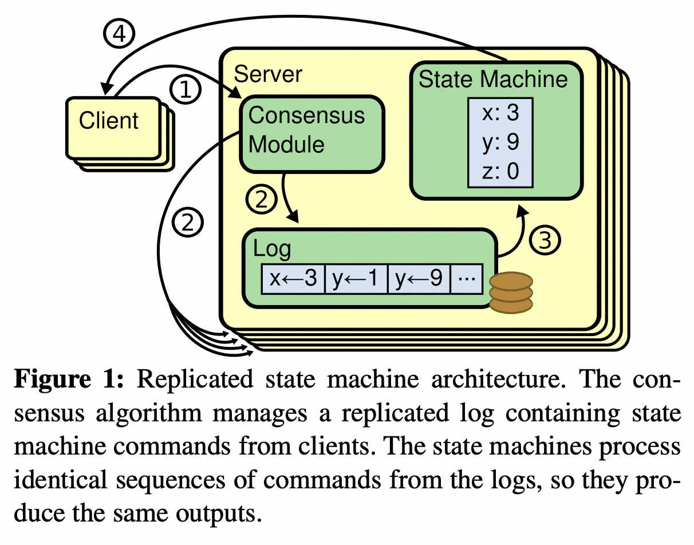
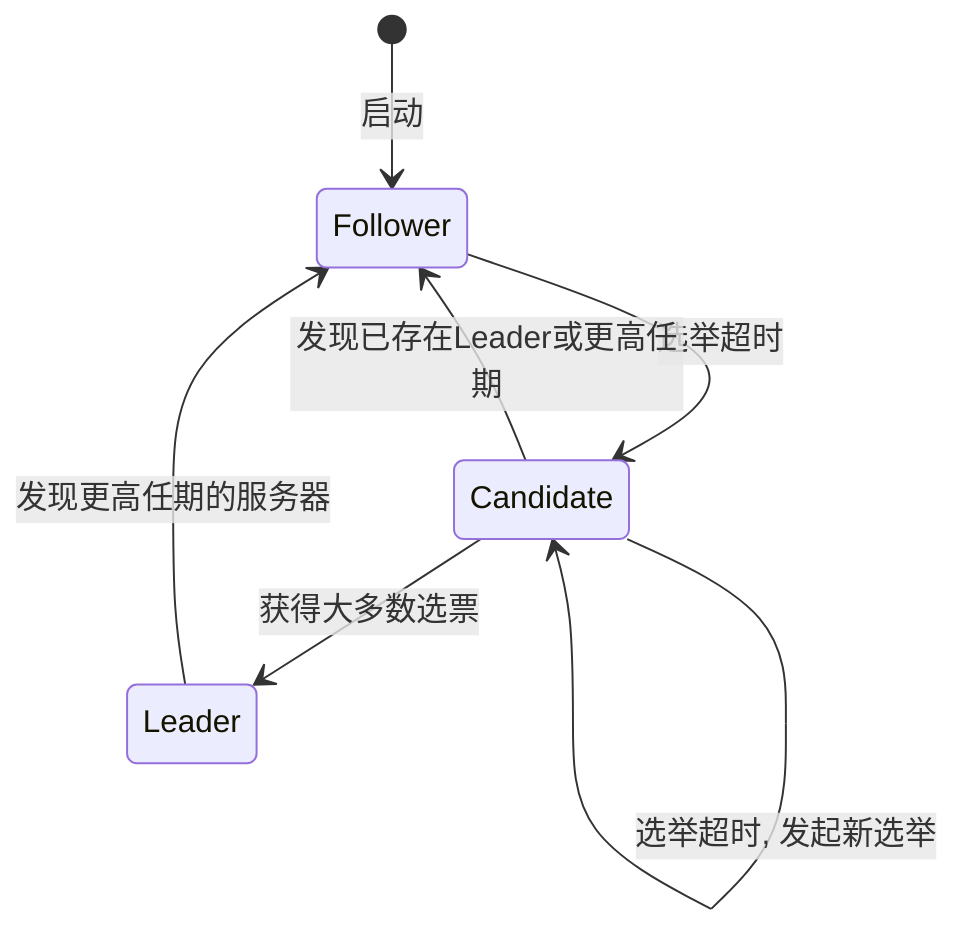
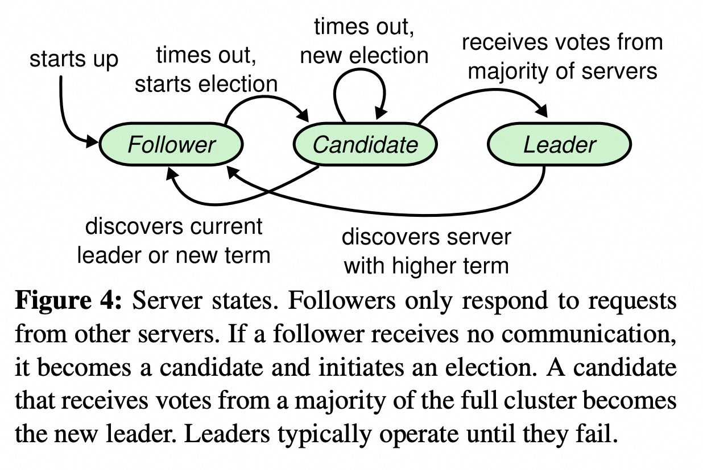
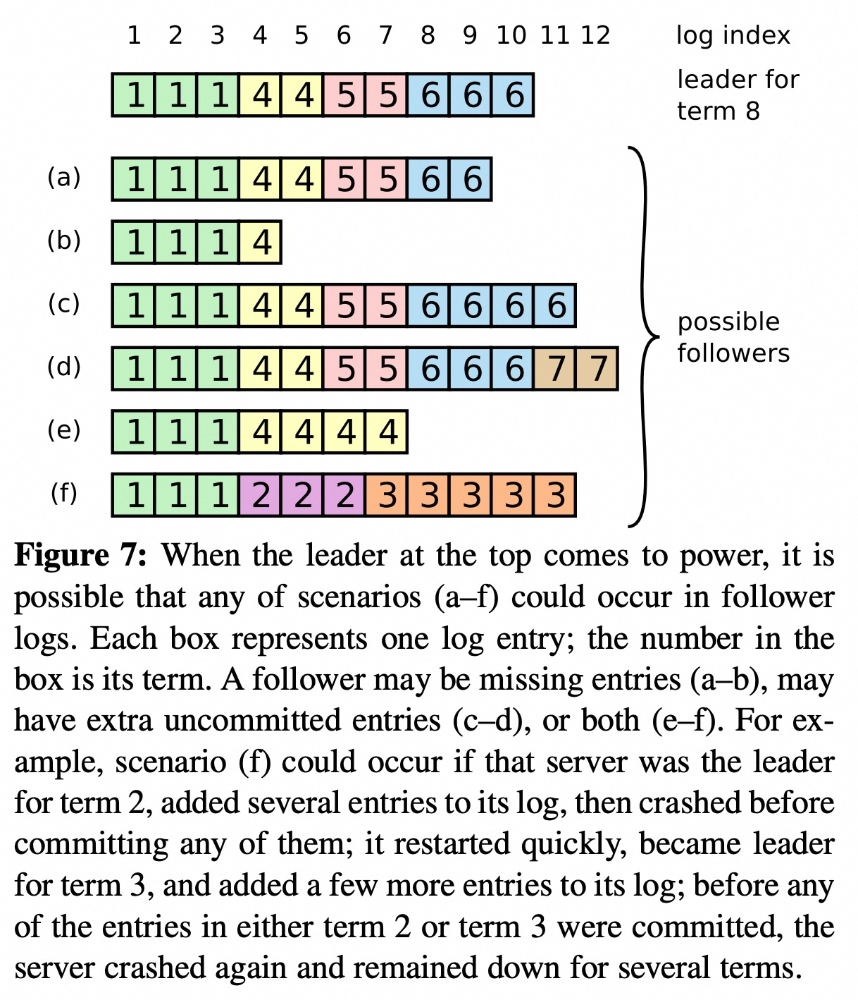
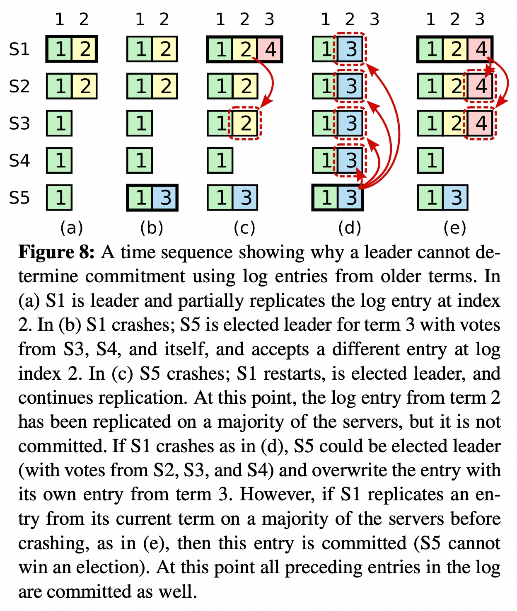
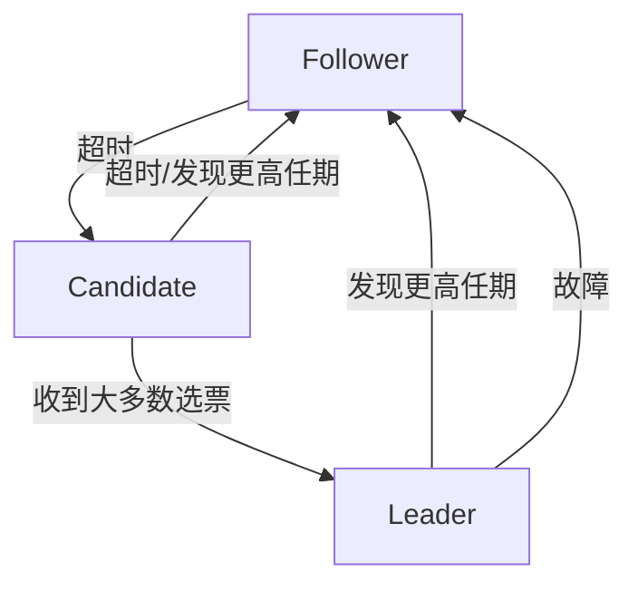

## AI论文解读 | In Search of an Understandable Consensus Algorithm
        
### 作者        
digoal        
        
### 日期        
2025-09-16       
        
### 标签        
PostgreSQL , PolarDB , DuckDB , AI , 论文解读        
        
----        
        
## 背景  
      
https://pdos.csail.mit.edu/6.824/papers/raft-extended.pdf        
  
提示:          
```          
读懂《In Search of an Understandable Consensus Algorithm》这篇论文需要提前掌握哪些基础知识, 请使用中文通熟易懂的讲解这些基础知识, 可以引用论文中的图、表或使用Markdown支持的图形(text,mermaid等)增加解释性. 
  
使用中文通熟易懂的解读《In Search of an Understandable Consensus Algorithm》这篇论文, 其中的关键内容请着重讲解, 可以引用论文中的图、表或使用Markdown支持的图形(text,mermaid等)增加解释性. 
  
提取《In Search of an Understandable Consensus Algorithm》这篇论文中的重要术语, 使用中文对这些术语进行通熟易懂的讲解, 可以引用论文中的图、表或使用Markdown支持的图形(text,mermaid等)增加解释性. 
```     
  
## 1 前置知识 
  
### 解读Raft论文所需的基础知识

要理解《In Search of an Understandable Consensus Algorithm》这篇论文，你需要先掌握一些关于分布式系统和共识算法的基础概念。论文本身的目标就是为了让这些概念更容易理解，但有一些背景知识会帮助你更好地消化它。

#### 1\. 什么是共识算法（Consensus Algorithm）

共识算法是分布式系统中的一个核心概念，它的作用是让一组机器（服务器）能够像一个整体一样协同工作，即使其中一部分机器出现故障也能保持正常运行 。

这个算法的核心目标是确保：

  * **安全性（Safety）**: 任何情况下都不能返回错误的结果 。
  * **可用性（Availability）**: 只要大多数服务器可以正常运行并相互通信，整个系统就能保持可用 。

#### 2\. 什么是可复制状态机（Replicated State Machine）

Raft算法是围绕“可复制状态机”这个概念设计的 。你可以把它想象成一个由多台服务器构成的“虚拟机器”，每台服务器都运行着相同的程序（状态机）。

要保证所有服务器上的状态机保持一致，它们需要按**相同的顺序**执行**相同的命令**。这就需要一个 **复制日志（replicated log）** 来存储这些命令。共识算法的任务就是保证所有服务器上的日志都包含相同的命令，并且顺序也完全一致 。

论文中用一张图清楚地说明了这一点：

  * **客户端（Client）** 发送一个命令给服务器。
  * **共识模块（Consensus Module）** 负责将这个命令写入日志。
  * 通过共识算法，这个日志条目会被复制到所有其他服务器上。
  * 所有服务器上的 **状态机（State Machine）** 会按照日志中命令的顺序依次执行，从而保证了它们最终的状态都是一致的 。

#### 3\. 为什么是Raft，而不是Paxos？

在Raft论文发布之前，Paxos是共识算法领域的“霸主”，大多数共识实现都受其影响 。然而，论文指出Paxos有两个主要缺点：

  * **难以理解（Difficult to understand）**: Paxos非常复杂且难以掌握，即使是经验丰富的研究人员也常常感到困惑 。
  * **不适合实际系统（Not a good foundation for building practical systems）**: Paxos的理论设计与实际系统实现之间存在很大差距，开发者通常需要对其进行大量修改才能应用 。

Raft的设计初衷就是为了解决这些问题，它的首要目标就是**可理解性** 。为了实现这个目标，Raft将共识问题分解成几个相对独立的子问题：

  * **领导者选举（Leader Election）**: 如何选出一个主导者。
  * **日志复制（Log Replication）**: 如何确保所有服务器的日志保持一致。
  * **安全性（Safety）**: 保证算法在所有非拜占庭故障（如网络延迟、分区、丢包等）下都能确保正确性 。
  * **成员变更（Membership Changes）**: 如何安全地增加或删除服务器。

这些模块化的设计使得Raft更易于学习和实现 。

-----

这些基础概念是理解Raft论文的敲门砖。如果您想深入了解论文中的某个具体部分，例如领导者选举、日志复制的详细流程，或者状态机安全，我可以为您进一步讲解。您希望我从哪个部分开始呢？
  
## 2 解读论文 
  
好的，很高兴能为您解读这篇分布式系统领域的经典论文——《In Search of an Understandable Consensus Algorithm》。

这篇论文由 Diego Ongaro 和 John Ousterhout 在 2014 年发表 ，旨在介绍他们设计的一种新的共识算法：**Raft**。

共识算法是构建可靠的分布式系统的核心 ，它能让一组计算机作为一个整体协同工作，即使其中一部分机器发生故障，系统也能继续正常运行 。在 Raft 出现之前，Paxos 算法是共识领域的绝对主导 ，但它以极其难以理解而著称，给学习和工程实践都带来了巨大挑战 。

Raft 的核心设计目标就是**可理解性 (Understandability)** 。作者认为，一个算法不仅要能工作，更重要的是要让人容易理解它为什么能工作 。为了实现这个目标，Raft 采用了两种关键技术：

1.  **问题分解 (Decomposition)**：将复杂的共识问题分解为几个相对独立的子问题：领导者选举 (Leader Election)、日志复制 (Log Replication) 和安全性 (Safety) 。
2.  **状态空间简化 (State Space Reduction)**：相比 Paxos，Raft 减少了系统中的不确定性和服务器之间可能出现的不一致情况，让系统行为更加清晰和可预测 。

接下来，我们将深入探讨 Raft 的核心机制。

### 1\. Raft 是什么？—— 复制状态机模型

首先，我们需要理解 Raft 算法的应用场景。它通常用于管理**复制状态机 (Replicated State Machine)** 。

想象一下，我们有一个数据库服务，为了防止单点故障，我们在多台服务器上运行相同的服务副本。客户端发送一个操作指令（例如，`SET x = 3`），我们希望这个指令在所有副本上都以相同的顺序执行，从而保证所有副本的状态最终都是一致的。

Raft 所做的，就是管理一个**复制日志 (Replicated Log)** 。如下图所示：

  

> **图引用自论文 Figure 1**: 复制状态机架构 。  
> 1\.  客户端向服务器发送指令 。  
> 2\.  服务器中的 Raft 共识模块 (Consensus Module) 负责将指令写入本地日志 (Log)，并与其他服务器通信，确保所有服务器日志的一致性 。  
> 3\.  一旦日志条目被“提交”，状态机 (State Machine) 就会按顺序执行日志中的指令 。  
> 4\.  执行结果最终返回给客户端。  

通过这种方式，即使部分服务器宕机，只要集群中大多数服务器正常，整个系统就能对外提供一致、可靠的服务 。

### 2\. Raft 的角色和任期 (States and Terms)

在 Raft 集群中，任何时刻，一个服务器都处于以下三种状态之一 ：

  * **Leader (领导者)**：负责处理所有客户端请求，管理日志复制。正常情况下，集群中只有一个 Leader 。
  * **Follower (跟随者)**：被动接收 Leader 的日志复制请求，并响应 Leader 和 Candidate 的请求。所有服务器启动时都是 Follower 状态 。
  * **Candidate (候选人)**：当 Follower 在一段时间内没有收到 Leader 的心跳时，它会转变为 Candidate，并发起一次新的选举，试图成为新的 Leader 。

这三种状态的转换关系如下图所示：



  

> **图解**：上图模拟了论文中 Figure 4 的状态转换过程 。

Raft 将时间划分为一个个连续的**任期 (Term)** 。每个任期由一个单调递增的整数标识 。每个任期的开始都是一次**选举 (Election)** 。如果选举成功，会产生一个新的 Leader 来负责该任期的工作 ；如果选举失败（例如选票被瓜分），则该任期结束，立即开始一个新任期和新选举 。

任期在 Raft 中扮演着“逻辑时钟”的角色，能够帮助服务器检测到过期的信息，例如一个已经下台的旧 Leader 。

### 3\. 核心机制一：领导者选举 (Leader Election)

领导者选举是 Raft 中最为关键的机制之一。

1.  **触发选举**：Raft 使用心跳机制来触发选举 。Leader 会周期性地向所有 Follower 发送心跳（不包含日志内容的 `AppendEntries` RPC）来维持其领导地位 。如果一个 Follower 在一个**选举超时 (election timeout)** 时间内没有收到任何来自 Leader 的通信，它就认为 Leader 可能已经宕机，于是发起选举 。

2.  **选举过程**：

      * Follower 将自己的当前任期号加一，转变为 Candidate 状态 。
      * 它首先投票给自己，然后向集群中所有其他服务器并行发送 `RequestVote` RPC（请求投票） 。
      * 接下来，它会等待结果，可能出现三种情况 ：
          * **赢得选举**：如果它收到了来自集群中**大多数**服务器的选票，它就成为新任期的 Leader 。随后，它会立即向所有服务器发送心跳，以确立自己的地位并阻止新的选举 。
          * **选举失败（发现已有Leader）**：在等待投票期间，如果它收到了一个自称是 Leader 的服务器发来的 `AppendEntries` RPC，并且该 Leader 的任期号不小于它自己的当前任期号，那么它会承认对方的合法性，并退回到 Follower 状态 。
          * **选举超时（选票瓜分）**：如果多个 Follower 同时成为 Candidate，选票可能会被瓜分，导致没有任何一个 Candidate 获得大多数选票 。这种情况下，Candidate 会等待自己的选举超时时间耗尽，然后再次增加任期号，发起新一轮选举 。

3.  **避免无限的选票瓜分**：为了防止选举因选票瓜分而无限期失败，Raft 采用了一个非常聪明的技巧：**随机化的选举超时时间 (randomized election timeouts)** 。每个服务器的选举超时时间都在一个固定的区间内随机选择（例如 150-300ms）。这样，在大多数情况下，总会有一个服务器率先超时并发起选举，它有很大概率在其他服务器超时之前赢得选举并发送心跳 。

### 4\. 核心机制二：日志复制 (Log Replication)

一旦 Leader 被选举出来，它就开始负责处理客户端请求和同步日志 。

1.  **处理流程**：

      * Leader 接收到客户端的指令后，会将其作为一个新的**日志条目 (log entry)** 追加到自己的日志中 。
      * 然后，它向所有 Follower 并行地发送 `AppendEntries` RPC 来复制这个条目 。
      * 当 Leader 确认该条目已经被**大多数** Follower 成功复制后，这个条目就被认为是**已提交的 (committed)** 。
      * Leader 将该条目应用到自己的状态机，并将执行结果返回给客户端 。
      * Leader 同时也会通知所有 Follower 该条目已经提交，Follower 收到通知后，也会将该条目应用到自己的状态机 。

2.  **保证日志一致性**：Raft 通过 `AppendEntries` RPC 中的一个一致性检查来强制保证 Follower 的日志与 Leader 一致 。Leader 在发送 RPC 时，会带上新条目**之前**的那一个条目的索引和任期号 。Follower 只有在自己的日志中找到了具有相同索引和任期号的条目时，才会接受新的日志条目 。

      * **正常情况**：Leader 和 Follower 的日志保持一致，这个检查总会成功 。
      * **异常情况（Leader 崩溃后）**：日志可能会出现不一致，如下图（论文 Figure 7）所示。一个新 Leader 上台后，Follower 的日志可能比 Leader 少 (a, b)，也可能多出一些未提交的条目 (c, d)，或者两者兼有 (e, f) 。   

    > **图引用自论文 Figure 7**: 当一个新 Leader (term 8) 上台时，Follower 可能存在的几种日志状态 。

    在这种情况下，Leader 会强制用自己的日志来覆盖 Follower 的日志 。它会从后向前逐个尝试，找到与 Follower 共同拥有的最新的日志条目，然后删除 Follower 在此之后的所有条目，再将 Leader 在此之后的所有条目发送给 Follower，最终使两者的日志达成一致 。

### 5\. 核心机制三：安全性 (Safety)

上面描述的选举和复制机制还不足以保证绝对的安全性。Raft 为此增加了两个关键的限制。

1.  **选举限制 (Election Restriction)**：为了保证所有已提交的日志条目不会丢失，Raft 对选举过程增加了一个限制：一个 Candidate 必须证明自己的日志至少和集群中大多数节点一样“新”，才有资格赢得选举 。

      * 这个比较是通过 `RequestVote` RPC 实现的 。投票者会拒绝投票给一个日志不如自己新的 Candidate 。
      * “新旧”的比较规则是：优先比较最后一条日志的任期号，任期号大的更新；如果任期号相同，则日志更长的更新 。
      * 这个限制确保了新当选的 Leader 一定拥有了所有之前任期已经提交的日志条目，这就是**领导者完整性属性 (Leader Completeness Property)** 。

2.  **提交规则限制**：一个 Leader **不能**直接通过计算副本数来提交之前任期的日志条目 。如下图（论文 Figure 8）所示，(c) 中 S1 虽然将 term 2 的日志复制到了大多数节点，但这个条目仍可能在 (d) 中被新 Leader S5 覆盖 。   

    > **图引用自论文 Figure 8**: 解释了为什么 Leader 不能仅通过计算副本数来提交旧任期的条目 。

    Raft 的解决方案是：Leader **只能**通过计算副本数的方式来提交**当前任期**的日志条目 。一旦当前任期的某个条目被成功提交，那么根据日志匹配特性，它之前的所有条目（包括来自旧任期的）也会被**间接提交** 。

通过这些安全限制，Raft 保证了**状态机安全属性 (State Machine Safety Property)**：如果一个服务器将某个日志条目应用到了它的状态机，那么其他任何服务器都不会在相同的日志索引上应用一个不同的条目 。

### 总结

Raft 通过将共识问题分解为**领导者选举**、**日志复制**和**安全性**三个部分，并围绕一个强有力的 Leader 来简化系统设计，成功地创造了一个比 Paxos 更易于理解和实现的共识算法 。

  * **领导者选举**：通过随机化超时来快速、稳定地选出 Leader。
  * **日志复制**：通过 Leader 强制同步日志，简化了数据流和一致性管理。
  * **安全性**：通过选举和提交规则的限制，确保了已提交数据的持久性和状态机执行的一致性。

论文的后续章节还讨论了集群成员变更 、日志压缩（快照） 等工程实践中必须面对的问题，并为它们提供了同样清晰易懂的解决方案。最终，用户研究也证明，学生们在学习 Raft 之后，对其理解程度显著高于 Paxos 。
  
## 3 术语 
  
从《In Search of an Understandable Consensus Algorithm》这篇论文中，我们可以提取出一些核心的术语，这些术语是理解Raft算法的关键。下面我将用通俗易懂的方式为您讲解这些概念。

### Raft算法核心术语解析

#### 1\. 节点状态（States）

Raft集群中的每个服务器节点在任何时候都处于以下三种状态之一：

  * **跟随者（Follower）**: 这是一个被动的状态。跟随者只响应来自领导者和候选者的请求。当它没有收到任何消息时，它会等待超时并自己成为候选者。
  * **候选者（Candidate）**: 当一个跟随者超时后，它会发起一次选举，自己成为候选者。它会向其他节点发送投票请求，争取成为领导者。
  * **领导者（Leader）**: 这是集群中唯一的主导者。领导者负责接收所有客户端请求，并将日志条目复制给所有跟随者，最终确保集群状态的一致性。一个集群中任何时候都最多只有一个领导者。

-----

#### 2\. 任期（Term）

Raft使用**任期**这个概念来组织时间。任期是连续递增的整数，可以看作是选举周期。

  * 每一次选举过程都对应一个新的任期。
  * 如果一个候选者赢得了选举，它将成为该任期的领导者。
  * 如果选举失败，该任期会以新的选举再次开始。
  * 任期可以帮助节点识别过期或无效的信息，例如，一个旧的领导者发来的消息会被带有更高任期的消息所覆盖。

以下是论文中对状态和任期的关系图解：



-----

#### 3\. 日志（Log）

日志是Raft算法的核心。它由一系列 **日志条目（log entries）** 组成，每个条目包含一个命令和一个任期号。

  * **日志条目（Log Entry）**: 存储着客户端请求的命令，以及该条目被创建时的任期号。
  * **复制日志（Replicated Log）**: Raft通过复制日志来确保所有节点的状态一致性。领导者会负责将新条目复制到所有跟随者。
  * **日志的一致性（Log Matching）**: 这是Raft的关键安全特性。如果两个日志在同一个任期和索引号上包含相同的条目，那么它们在之前的索引号上的所有条目也一定是相同的。

-----

#### 4\. 日志复制（Log Replication）

这是Raft算法中的核心环节，确保集群所有节点的状态机保持一致。

  * 客户端请求首先发送给领导者。
  * 领导者将请求命令作为一个新的日志条目追加到自己的日志中。
  * 领导者并行地向所有跟随者发送 **附加日志（AppendEntries）** RPC请求。
  * 跟随者接收并追加条目到自己的日志中。
  * 一旦领导者收到大多数跟随者的确认，它就认为该条目是 **已提交（Committed）** 的，并可以安全地应用到状态机。

这个过程确保了即使部分节点失败，只要大多数节点能正常运行，集群就能继续安全地工作。

-----

这些是理解Raft算法最基础也是最重要的几个术语。掌握它们之后，你就可以更好地理解论文中关于领导者选举、日志复制以及安全性的详细设计了。

你希望我接下来更深入地讲解其中的哪个部分呢？比如，我们可以详细探讨领导者是如何被选举出来的，或者日志复制的完整流程是怎样的？
  
## 参考        
         
https://pdos.csail.mit.edu/6.824/papers/raft-extended.pdf    
        
<b> 以上内容基于DeepSeek、Qwen、Gemini及诸多AI生成, 轻微人工调整, 感谢杭州深度求索人工智能、阿里云、Google等公司. </b>        
        
<b> AI 生成的内容请自行辨别正确性, 当然也多了些许踩坑的乐趣, 毕竟冒险是每个男人的天性.  </b>        
    
#### [期望 PostgreSQL|开源PolarDB 增加什么功能?](https://github.com/digoal/blog/issues/76 "269ac3d1c492e938c0191101c7238216")
  
  
#### [PolarDB 开源数据库](https://openpolardb.com/home "57258f76c37864c6e6d23383d05714ea")
  
  
#### [PolarDB 学习图谱](https://www.aliyun.com/database/openpolardb/activity "8642f60e04ed0c814bf9cb9677976bd4")
  
  
#### [PostgreSQL 解决方案集合](../201706/20170601_02.md "40cff096e9ed7122c512b35d8561d9c8")
  
  
#### [德哥 / digoal's Github - 公益是一辈子的事.](https://github.com/digoal/blog/blob/master/README.md "22709685feb7cab07d30f30387f0a9ae")
  
  
#### [About 德哥](https://github.com/digoal/blog/blob/master/me/readme.md "a37735981e7704886ffd590565582dd0")
  
  

  
