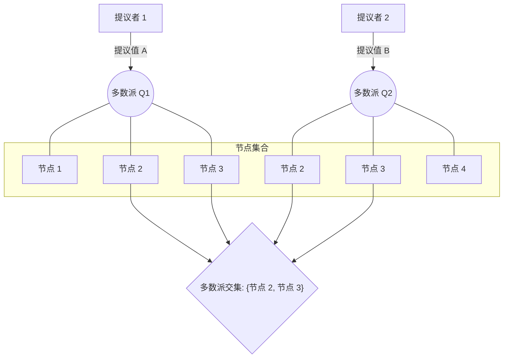

## AI论文解读 | Distributed consensus revised
        
### 作者        
digoal        
        
### 日期        
2025-09-17       
        
### 标签        
PostgreSQL , PolarDB , DuckDB , AI , 论文解读        
        
----        
        
## 背景  
      
https://www.cl.cam.ac.uk/techreports/UCAM-CL-TR-935.pdf        
  
提示:          
```          
读懂《Distributed consensus revised》这篇论文需要提前掌握哪些基础知识, 请使用中文通熟易懂的讲解这些基础知识, 可以引用论文中的图、表或使用Markdown支持的图形(text,mermaid等)增加解释性. 
  
使用中文通熟易懂的解读《Distributed consensus revised》这篇论文, 其中的关键内容请着重讲解, 可以引用论文中的图、表或使用Markdown支持的图形(text,mermaid等)增加解释性. 
  
提取《Distributed consensus revised》这篇论文中的重要术语, 使用中文对这些术语进行通熟易懂的讲解, 可以引用论文中的图、表或使用Markdown支持的图形(text,mermaid等)增加解释性. 
```     
  
## 1 前置知识 
  
要理解《分布式共识修正版》（Distributed consensus revised）这篇论文，你需要先掌握一些基础知识，主要围绕**分布式系统**和**共识算法**这两个核心概念。论文作者海蒂·霍华德（Heidi Howard）在摘要中明确提到，这篇论文旨在重新审视分布式共识的基石，并对一个名为**Paxos**的经典共识算法进行概括和扩展 。

以下是阅读该论文前需要掌握的基础知识：

### 1. 分布式系统（Distributed Systems）
分布式系统是指由多台计算机通过网络连接，共同协作完成任务的系统。论文指出，我们在日常生活中非常依赖分布式系统 。与单机系统不同，分布式系统的组件（例如计算机和网络）是不可靠的 ，可能出现各种故障，如：
- **机器故障（Failures）**: 计算机宕机、网络断开等。
- **异步性（Asynchrony）**: 消息传递没有固定的时间限制，可能存在延迟、乱序或丢失 。

理解这些特性对于理解为什么需要共识算法至关重要，因为共识算法正是为了在这些不稳定的环境下，让系统中的所有参与者达成一致而设计的 。

### 2. 分布式共识（Distributed Consensus）
这是论文的核心问题。分布式共识的定义是在一个不稳定的系统中，所有参与者就某个值达成一致的能力 。论文将共识算法的正确性定义为两个关键保证 ：
- **安全性（Safety）**: 一旦一个值被确定，它将永远不会改变。这个保证在任何情况下都必须成立，不依赖于系统的可靠性或同步性 。
- **活跃性/进步性（Progress）**: 最终系统能够达成一个决定。这个保证通常需要在系统满足一定的活跃性或同步性假设下才能实现 。

论文也提到了一个著名的**FLP不可能定理** ，该定理证明了在完全异步且存在节点宕机的系统中，任何共识算法都无法同时保证安全性和进步性。因此，共识算法的目标是在尽可能弱的活跃性假设下保证进步性 。

### 3. Paxos 算法
Paxos算法由莱斯利·兰伯特（Leslie Lamport）在1998年提出 ，在论文发表的二十多年里，Paxos几乎是分布式共识的代名词 。论文也指出，尽管Paxos应用广泛，但它难以理解、笨重且在实践中不可靠 。

论文对**经典Paxos**（Classic Paxos）的运作方式进行了概述 ：
- **两阶段提交**：Paxos算法主要分为两个阶段，每个阶段都需要得到大多数参与者的同意才能推进 。
    - **第一阶段（Phase 1）**：选举一个领导者（leader）并阻止之前的领导者做出任何新的决定 。
    - **第二阶段（Phase 2）**：领导者在得到大多数参与者的支持后，提出一个值并使其被接受 。

#### 核心角色（Roles）
Paxos中有三种核心角色 ：
- **提议者（Proposer）**：发起提案，试图让某个值被选中。
- **接受者（Acceptor）**：对提议者的提案进行投票和接受。
- **学习者（Learner）**：了解已经被选定的值。

#### 多数派（Quorum）
在Paxos中，要达成共识，需要一个**法定人数**或**多数派**的支持 。论文指出，Paxos的多数派要求保证了任意两个多数派集合之间都存在交集 。这个**多数派交集**（Quorum Intersection）特性是Paxos算法安全性的基石。论文的贡献之一就是通过修正这一特性来泛化Paxos算法 。

### 4. Paxos的变体
论文提到，对Paxos的理解和实践已经产生了许多变体和优化，例如：
- **Multi-Paxos**：通过选举一个稳定的领导者来重复使用第一阶段，从而在正常情况下只需一轮通信即可达成共识 。这大大提高了性能，但领导者也成为了系统的性能瓶颈和单点故障风险 。
- **Fast Paxos**：论文第3章提到，这是一种Paxos变体，允许在特定条件下跳过第一阶段，直接在第二阶段提议值 。

论文的最终目标就是通过对经典Paxos的“多数派”和“值选择规则”进行泛化和修正，提出一个可以涵盖包括Paxos和Fast Paxos在内的更广泛的共识算法家族 。

---
我希望这份基础知识总结能帮助你更好地理解这篇论文。你对文中提到的具体算法或概念（例如“多数派交集”）有什么想深入了解的吗？
  
## 2 解读论文 
  
好的，我们来通俗易懂地解读一下 Heidi Howard 的这篇博士论文《分布式共识修正》(Distributed consensus revised)。

这篇论文可以看作是对分布式共识领域“圣经”——Paxos 算法的一次深刻解构与重塑。作者认为，我们过去二十多年所依赖的 Paxos 算法，其许多限制（如性能差、扩展性不佳）并非共识问题本身固有的，而是 Paxos 自身过于“保守”的设计导致的 。

论文的核心思想是：**Paxos 只是解决分布式共识问题众多可能性中的一个点，而非全部** 。通过逐一放宽 Paxos 的核心约束，作者揭示了一个更广阔、更灵活的共识算法家族。

-----

### 第一部分：背景 - 为什么需要“修正”Paxos？

在我们深入探讨论文的创新之前，先要理解它试图解决的问题。分布式共识是指在可能出现故障（如服务器宕机、网络延迟）的分布式系统中，让所有节点对某个值达成一致的过程 。

Paxos 算法是实现这一目标的“黄金标准” ，但它有几个广为人知的痛点 ：

1.  **晦涩难懂**：Paxos 的原始描述非常抽象，导致学术界和工业界都难以完全理解和正确实现 。
2.  **性能瓶颈**：经典的 Paxos 至少需要两次网络往返（Two-phase）才能确定一个值，并且每次都需要“大多数”节点的参与，这导致延迟高、网络开销大 。
3.  **中心化领导者**：为了提高效率，实际应用中通常使用 Multi-Paxos，即选举一个领导者（Leader）来连续提出提案。这虽然将决策过程优化为一次网络往返，但也引入了单点瓶颈和故障恢复的复杂性 。
4.  **灵活性差**：Paxos 的“大多数同意”原则是一种“一刀切”的方案，无法根据系统的实际状况（如网络拓扑、负载情况）进行调整，耦合了系统规模、性能和容错能力 。

这篇论文的出发点就是挑战这些“常识”，探寻是否存在更优、更灵活的共识实现方式 。

-----

### 第二部分：核心贡献 - 逐步放宽 Paxos 的“铁律”

作者通过一系列精巧的推理，逐步放宽了 Paxos 的几个核心假设。我们可以将其理解为对 Paxos 的“四大修正”。

#### 关键点一：修正“Quorum 交集” (Quorum Intersection Revisited - 第4章)

这是整篇论文最 foundational 的贡献。

  * **经典 Paxos 的“铁律”**：
    Paxos 的安全性依赖于一个核心原则：**任意两个 Quorum（法定人数，通常是大多数节点）必须有交集** 。无论是第一阶段（Phase 1，获取承诺）的 Quorum，还是第二阶段（Phase 2，接受提案）的 Quorum，它们之间都必须至少有一个共同的节点。这确保了新的提案者总能了解到最近可能被接受的值。

  * **论文的第一次放宽 (Revision A / Flexible Paxos)**：
    作者证明，这个要求太强了。实际上，我们**只需要保证任意一个 Phase 1 的 Quorum 和任意一个 Phase 2 的 Quorum 有交集即可** 。Phase 1 的 Quorum 之间可以没有交集，Phase 2 的 Quorum 之间也可以没有交集 。

    这个看似微小的改动，却打开了新世界的大门。我们可以用下面的图来理解：

    ```mermaid
    graph TD
        subgraph "经典 Paxos (Classic Paxos)"
            P1_Q1(P1 Quorum 1)
            P1_Q2(P1 Quorum 2)
            P2_Q1(P2 Quorum 1)
            P2_Q2(P2 Quorum 2)
            
            P1_Q1 -- "必须相交" --> P1_Q2
            P2_Q1 -- "必须相交" --> P2_Q2
            P1_Q1 -- "必须相交" --> P2_Q1
        end

        subgraph "论文修正 A (Revision A)"
            RevA_P1_Q1(P1 Quorum 1)
            RevA_P1_Q2(P1 Quorum 2)
            RevA_P2_Q1(P2 Quorum 1)
            RevA_P2_Q2(P2 Quorum 2)

            RevA_P1_Q1 -- "无需相交" --> RevA_P1_Q2
            RevA_P2_Q1 -- "无需相交" --> RevA_P2_Q2
            RevA_P1_Q1 -- "必须相交" --> RevA_P2_Q1
            RevA_P1_Q2 -- "必须相交" --> RevA_P2_Q2
        end
    ```

  * **论文的第二次放宽 (Revision B)**：
    作者更进一步指出，对于一个提案编号为 `e` 的 Phase 1，它的 Quorum **只需要和所有比 `e` 小的提案编号的 Phase 2 Quorum 相交即可** 。它无需与 `e` 自身或未来更大编号的 Phase 2 Quorum 相交。

    **这带来的直接好处是**：对于系统中的最小提案编号 `emin`（比如 0），由于没有比它更小的编号，所以它的 Phase 1 **完全不需要任何 Quorum 交集** 。这意味着，拿到 `emin` 的提案者可以直接跳过 Phase 1，发起 Phase 2 的提案，从而在一个网络往返内完成决策！。

#### 关键点二：修正“承诺”的用法 (Promises Revisited - 第5章)

  * **经典 Paxos 的做法**：
    提案者在 Phase 1 必须等待，直到收到一个完整 Quorum 的承诺（Promise）才能进入 Phase 2 。

  * **论文的洞察**：
    收到的“承诺”是带有信息的。如果提案者 `p` 在为提案 `e` 收集承诺时，从某个节点收到了一个关于更早提案 `f` (f \< e) 的信息（比如 `promise(e, f, v)`)，那么 `p` 就等于“得知”了提案 `f` 的 Phase 1 结果 。

    这意味着，`p` 可以 **“重用”** `f` 已经建立的 Quorum 交集，从而**不必再等待自己的 Phase 1 Quorum 满足与 `f` 之前所有提案的相交要求** 。这使得提案者在某些情况下可以提前结束 Phase 1，加速决策过程 。

#### 关键点三：修正“提案选值”规则 (Value Selection Revisited - 第6章)

  * **经典 Paxos 的规则**：
    在 Phase 1 收到多个承诺后，提案者必须选择其中**提案编号最高的那个值**作为自己在 Phase 2 的提案值 。

  * **论文的修正 (Quorum-based Value Selection)**：
    作者认为，“选择编号最高的”只是一个安全的“近似规则”。通过更精细地分析所有收到的承诺，并结合 Quorum 的结构，提案者有时可以推断出 **“尽管收到了一个编号较高的提案值，但它实际上不可能已经被决定”** 。

    在这种情况下，提案者就获得了更大的**灵活性**，可以安全地提出自己的候选值，而不是被迫去“接力”一个旧的值 。

#### 关键点四：修正“Epoch”的分配机制 (Epochs Revised - 第7章)

  * **经典 Paxos 的挑战**：
    为了保证安全，不同的提案者不能用相同的提案编号（Epoch）提出不同的值。通常的解决方法是给每个提案者预分配互不重叠的编号段 。

  * **论文的突破 (Epochs by Recovery)**：
    作者提出了一个革命性的想法：**允许多个提案者使用相同的提案编号**，只要我们引入一个“恢复”机制来处理可能出现的“值冲突” 。

    这个机制的核心是，如果检测到同一个 Epoch 有多个值被提出，就通过加强 Phase 1 的 Quorum 要求来确保最终只有一个值能胜出 。这套机制实际上是对 Fast Paxos 算法的泛化和改进 。

    **最大的好处是**：任何一个提案者都可以尝试使用 `emin` 编号来走“快车道”（跳过 Phase 1），而不再是只有一个“天选之子”可以这么做 。这极大地提升了系统的去中心化程度和性能表现。

-----

### 第三部分：总结与意义

这篇论文的贡献是系统性的，它将我们对共识的理解从一个僵化的算法，提升到了一个灵活的框架层面 。

1.  **更大的灵活性 (Greater Flexibility)**：
    系统设计者可以根据具体场景（如广域网延迟、读写比例）来定制 Quorum 结构，在性能、可靠性和成本之间做更精细的权衡 。例如，可以为一个很少发生的故障恢复阶段（Phase 1）设置一个大的、稳健的 Quorum，而为一个频繁发生的常规决策阶段（Phase 2）设置一个小的、高效的 Quorum 。

2.  **新的进展保证 (New Progress Guarantees)**：
    论文提出的新算法可以在经典 Paxos 会发生“活锁”（Livelock）的情况下保证系统继续前进 。例如，当多个提案者同时提出相同的值时，它们不会互相竞争导致谁也无法成功，而是可以协同完成决策 。

3.  **更高的性能 (Improved Performance)**：
    多个新提出的机制，特别是对 `emin` 的使用，使得系统可以在**没有中心化领导者**的情况下，普遍实现**一轮往返**的共识，显著降低了延迟和系统瓶颈 。

4.  **更好的清晰度 (Better Clarity)**：
    通过解构 Paxos，论文清晰地揭示了共识算法安全性的本质要求，帮助我们理解其“为什么”是正确的，而不仅仅是“它”是正确的 。

总而言之，《Distributed consensus revised》是分布式共识领域的一篇里程碑式的作品。它没有推翻 Paxos，而是站在 Paxos 的肩膀上，证明了共识的世界远比我们想象的要广阔和精彩。它为设计下一代高性能、高可用的分布式系统提供了坚实的理论基础和丰富的实践思路。
  
## 3 术语 
  
好的，我已经从《Distributed consensus revised》这篇论文中提取了一些重要术语，并用通俗易懂的中文为你进行解释。

### 重要术语解析

-----

#### 1\. 分布式共识 (Distributed Consensus)

**定义**：这是论文的核心，指在由不可靠的组件（如计算机、网络）组成的分布式系统中，所有参与者（节点）就某个值达成一致的能力。

**通俗解释**：想象一下，你和几个朋友通过对讲机远程决定晚餐吃什么。对讲机信号可能会延迟、丢失甚至完全断开。分布式共识就是要设计一个规则，确保即使在这种混乱情况下，你们最终能一起决定一个共同的晚餐，比如“吃火锅”，并且一旦决定了，就不能再更改。这个规则就是**共识算法**。

-----

#### 2\. Paxos 算法

**定义**：论文称其为“分布式共识的代名词”，由莱斯利·兰伯特（Leslie Lamport）提出的一种经典共识算法。

**通俗解释**：Paxos就像是一个复杂的投票系统。它通过一系列的角色（Proposer, Acceptor, Learner）和两阶段的交互（预提案阶段和接受阶段），确保在一个分布式系统中，所有节点最终能对一个提议达成一致。论文认为，尽管它非常重要，但在实践中可能难以理解和使用。

-----

#### 3\. 多数派 (Quorum)

**定义**：指在共识算法中，为了达成某个决定所需支持的最小节点集合。

**通俗解释**：多数派就是“大多数人”的意思。在Paxos中，任何一个决定（例如，选择一个值）都必须获得“大多数”节点的认可。这个“大多数”通常是指超过半数的节点。论文的亮点之一就是对这个概念进行了泛化和修正，使其不仅仅局限于简单的“过半”规则。

-----

#### 4\. 多数派交集 (Quorum Intersection)

**定义**：这是Paxos算法**安全性**的核心保障。它指的是任意两个多数派集合之间都至少有一个共同的节点。

**通俗解释**：这个特性保证了系统的**安全性**，即一旦某个值被决定，它就不会被改变。为什么呢？因为如果两个提议者试图决定不同的值，他们各自的多数派集合至少有一个重叠的节点。这个重叠的节点会发现并阻止新的提议，从而保证了决策的唯一性。

下面用一个简单的图表说明这个概念：



图中的 `Q1` 和 `Q2` 是两个不同的多数派，但它们都包含了 **节点 2** 和 **节点 3**。正是这种交集的存在，使得任何新的提案都需要通过这些共同节点，从而确保了不会有冲突的决定被批准。

-----

#### 5\. 安全性 (Safety) 与 活跃性 (Liveness)

**定义**：

  - **安全性**：一旦一个值被决定，它将永远不会改变。这是共识算法在任何情况下都必须满足的**正确性**。
  - **活跃性**：系统最终能够达成一个决定。这个特性通常在系统处于相对稳定的状态时才能保证。

**通俗解释**：

  - **安全性**就像是法律，不管发生什么，你都必须遵守。例如，一旦你们决定了吃火锅，这个决定就不能再变。
  - **活跃性**就像是效率，它保证事情能够向前推进。在理想情况下（没有太多故障），你们最终总能达成决定。论文提到，在一个完全异步的网络中，这两个特性无法同时保证，这就是著名的 **FLP 不可能定理**。

-----

你是否希望我用一个具体的例子来演示这些术语，比如用一个故事来模拟Paxos算法中的角色和流程？
  
## 参考        
         
https://www.cl.cam.ac.uk/techreports/UCAM-CL-TR-935.pdf    
        
<b> 以上内容基于DeepSeek、Qwen、Gemini及诸多AI生成, 轻微人工调整, 感谢杭州深度求索人工智能、阿里云、Google等公司. </b>        
        
<b> AI 生成的内容请自行辨别正确性, 当然也多了些许踩坑的乐趣, 毕竟冒险是每个男人的天性.  </b>        
    
#### [期望 PostgreSQL|开源PolarDB 增加什么功能?](https://github.com/digoal/blog/issues/76 "269ac3d1c492e938c0191101c7238216")
  
  
#### [PolarDB 开源数据库](https://openpolardb.com/home "57258f76c37864c6e6d23383d05714ea")
  
  
#### [PolarDB 学习图谱](https://www.aliyun.com/database/openpolardb/activity "8642f60e04ed0c814bf9cb9677976bd4")
  
  
#### [PostgreSQL 解决方案集合](../201706/20170601_02.md "40cff096e9ed7122c512b35d8561d9c8")
  
  
#### [德哥 / digoal's Github - 公益是一辈子的事.](https://github.com/digoal/blog/blob/master/README.md "22709685feb7cab07d30f30387f0a9ae")
  
  
#### [About 德哥](https://github.com/digoal/blog/blob/master/me/readme.md "a37735981e7704886ffd590565582dd0")
  
  

  
